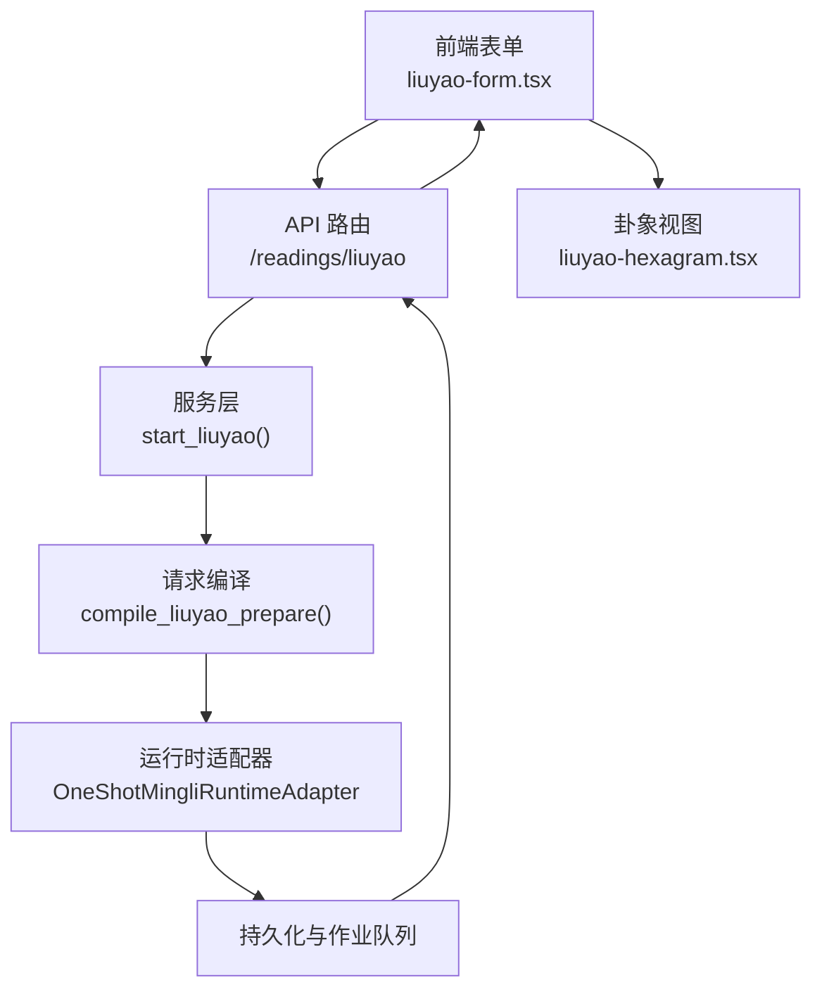
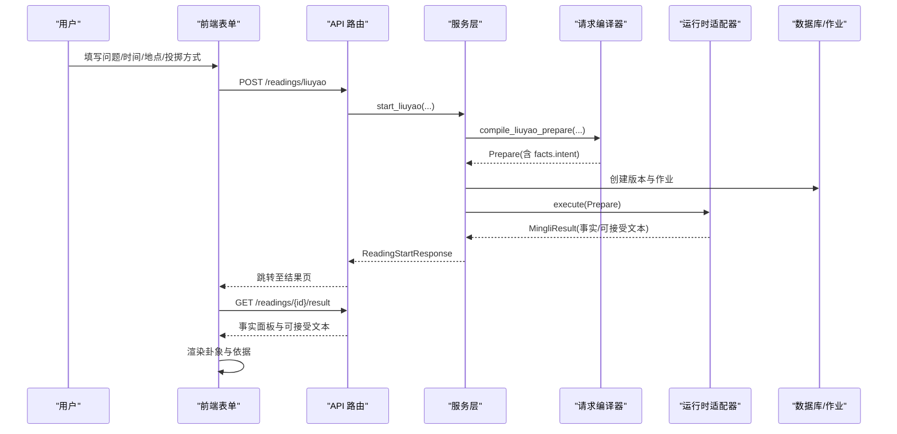
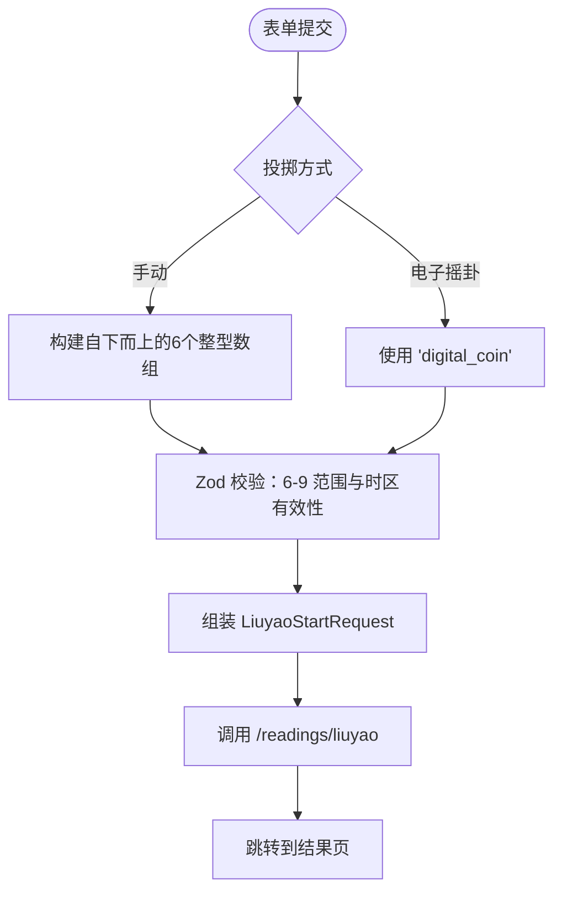
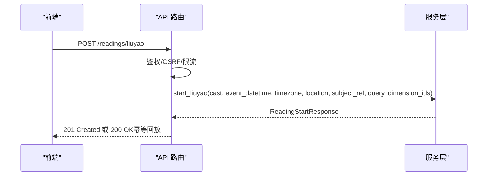
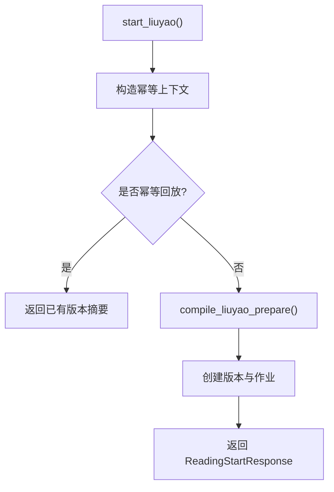
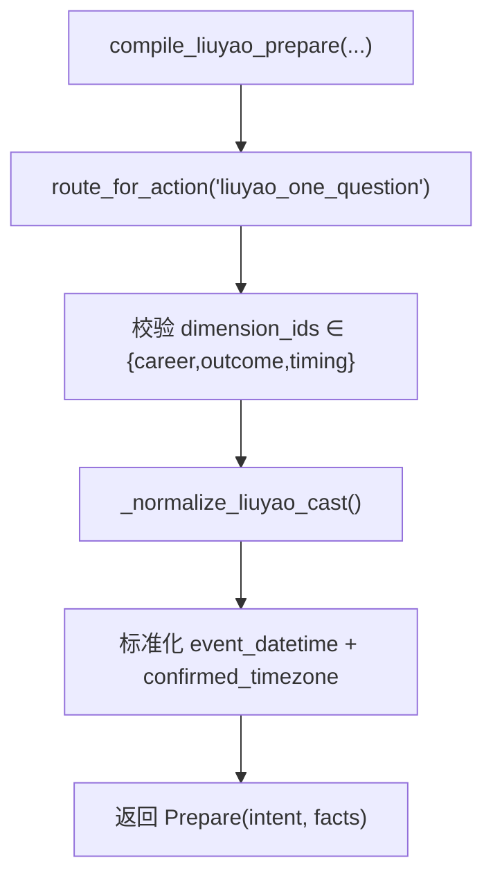
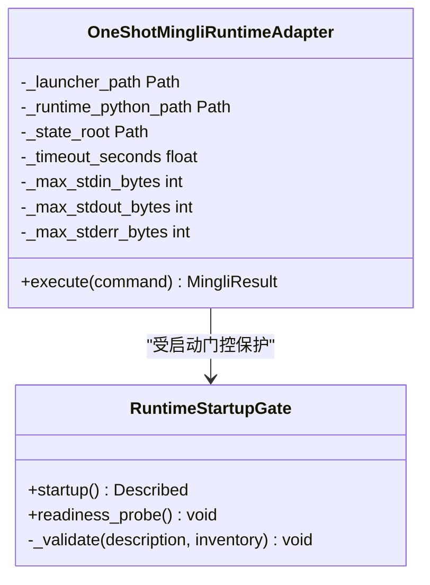
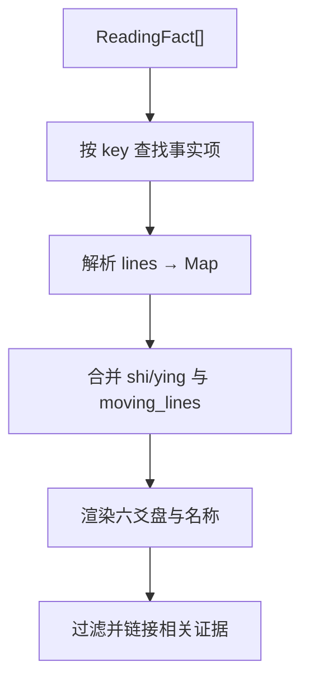

# 六爻占卜实现

<cite>
**本文引用的文件**
- [backend/app/api/readings.py](file://backend/app/api/readings.py)
- [backend/app/readings/service.py](file://backend/app/readings/service.py)
- [backend/app/readings/request_compiler.py](file://backend/app/readings/request_compiler.py)
- [backend/app/readings/capability_policy.py](file://backend/app/readings/capability_policy.py)
- [backend/app/adapters/runtime.py](file://backend/app/adapters/runtime.py)
- [backend/tests/fixtures/mingli/liuyao-digital-prepare.json](file://backend/tests/fixtures/mingli/liuyao-digital-prepare.json)
- [backend/tests/fixtures/mingli/liuyao-manual-prepare.json](file://backend/tests/fixtures/mingli/liuyao-manual-prepare.json)
- [web/src/components/liuyao-form.tsx](file://web/src/components/liuyao-form.tsx)
- [web/src/components/readings/liuyao-hexagram.tsx](file://web/src/components/readings/liuyao-hexagram.tsx)
- [web/src/test/reading-result.test.tsx](file://web/src/test/reading-result.test.tsx)
</cite>

## 目录
1. [简介](#简介)
2. [项目结构](#项目结构)
3. [核心组件](#核心组件)
4. [架构总览](#架构总览)
5. [详细组件分析](#详细组件分析)
6. [依赖关系分析](#依赖关系分析)
7. [性能与可靠性](#性能与可靠性)
8. [故障排查指南](#故障排查指南)
9. [结论](#结论)
10. [附录：API 与数据契约](#附录api-与数据契约)

## 简介
本文件面向“六爻占卜解读”这一能力，系统性梳理从前端表单到后端服务、再到运行时产物的完整链路。重点包括：
- 投掷数据的两种输入方式：手动选择（传统掷币数字化）与电子摇卦（数字模拟）。
- 维度支持：career、outcome、timing，以及不同意图的分析侧重点。
- 卦象生成过程：六个爻位确定、阴阳变化、本卦与变卦推导。
- 解卦知识体系：五行生克、六亲关系、神煞影响在公开事实中的呈现方式。
- API 调用、数据校验与结果格式化。
- 前端可视化方案：卦象图形化、动爻与世应标注、依据联动展示。

## 项目结构
围绕六爻功能的关键路径如下：
- 前端表单负责收集问题、起卦时间与时区、地点、投掷方式与具体投掷值，并发起请求。
- 后端 API 接收请求，进行幂等控制、速率限制与参数校验。
- 服务层将请求编译为 Prepare 命令，写入持久化并创建异步任务。
- 运行时适配器执行固定发布版本的计算流程，产出结构化事实与可接受文本。
- 前端结果页解析服务端返回的公开事实，渲染卦象盘面与关联依据。

**图表来源**
- [backend/app/api/readings.py:198-237](file://backend/app/api/readings.py#L198-L237)
- [backend/app/readings/service.py:206-254](file://backend/app/readings/service.py#L206-L254)
- [backend/app/readings/request_compiler.py:173-215](file://backend/app/readings/request_compiler.py#L173-L215)
- [backend/app/adapters/runtime.py:605-707](file://backend/app/adapters/runtime.py#L605-L707)
- [web/src/components/liuyao-form.tsx:150-195](file://web/src/components/liuyao-form.tsx#L150-L195)
- [web/src/components/readings/liuyao-hexagram.tsx:167-220](file://web/src/components/readings/liuyao-hexagram.tsx#L167-L220)

**章节来源**
- [backend/app/api/readings.py:198-237](file://backend/app/api/readings.py#L198-L237)
- [backend/app/readings/service.py:206-254](file://backend/app/readings/service.py#L206-L254)
- [backend/app/readings/request_compiler.py:173-215](file://backend/app/readings/request_compiler.py#L173-L215)
- [backend/app/adapters/runtime.py:605-707](file://backend/app/adapters/runtime.py#L605-L707)
- [web/src/components/liuyao-form.tsx:150-195](file://web/src/components/liuyao-form.tsx#L150-L195)
- [web/src/components/readings/liuyao-hexagram.tsx:167-220](file://web/src/components/readings/liuyao-hexagram.tsx#L167-L220)

## 核心组件
- 前端表单组件：负责用户输入、本地校验、会话初始化与提交；支持手动输入与电子摇卦两种模式。
- API 路由：定义 /readings/liuyao 端点，处理鉴权、限流、幂等键与参数转换。
- 服务层：编排启动流程，构造 Prepare 命令，落库并调度作业。
- 请求编译器：对维度白名单、时区、投掷数据进行严格校验与规范化。
- 运行时适配器：以一次性进程方式调用固定发布的运行时，保证安全与一致性。
- 卦象视图组件：解析公开事实，渲染本卦、变卦、动爻、世应与每爻详情。

**章节来源**
- [web/src/components/liuyao-form.tsx:37-88](file://web/src/components/liuyao-form.tsx#L37-L88)
- [backend/app/api/readings.py:198-237](file://backend/app/api/readings.py#L198-L237)
- [backend/app/readings/service.py:206-254](file://backend/app/readings/service.py#L206-L254)
- [backend/app/readings/request_compiler.py:173-215](file://backend/app/readings/request_compiler.py#L173-L215)
- [backend/app/adapters/runtime.py:605-707](file://backend/app/adapters/runtime.py#L605-L707)
- [web/src/components/readings/liuyao-hexagram.tsx:167-220](file://web/src/components/readings/liuyao-hexagram.tsx#L167-L220)

## 架构总览
六爻解读采用“前端只负责采集与展示，后端负责编排与计算”的分层设计。关键要点：
- 能力策略锁定 liuyao_one_question 对应 capability_id=liuyao，object_id=concrete_event，horizon_id=instant。
- 维度白名单限定为 career、outcome、timing，防止越界使用。
- 投掷数据支持两种形态：数组形式的自下而上六次投掷值（6-9），或字符串 "digital_coin"。
- 运行时通过一次性进程执行，具备严格的发布包完整性校验与资源清单验证。

**图表来源**
- [backend/app/api/readings.py:198-237](file://backend/app/api/readings.py#L198-L237)
- [backend/app/readings/service.py:206-254](file://backend/app/readings/service.py#L206-L254)
- [backend/app/readings/request_compiler.py:173-215](file://backend/app/readings/request_compiler.py#L173-L215)
- [backend/app/adapters/runtime.py:605-707](file://backend/app/adapters/runtime.py#L605-L707)

## 详细组件分析

### 前端表单：投掷数据与意图封装
- 表单字段包含问题、起卦时刻、IANA 时区、地点、投掷方式与六次投掷值。
- 手动模式下，每个爻位必须选择 6/7/8/9，分别对应老阴、少阳、少阴、老阳。
- 提交时根据模式构造 cast：手动模式为长度为 6 的整数数组；电子摇卦模式为字符串 "digital_coin"。
- 默认维度为 ["career"]，但系统允许传入更多维度（见后文维度说明）。

**图表来源**
- [web/src/components/liuyao-form.tsx:37-88](file://web/src/components/liuyao-form.tsx#L37-L88)
- [web/src/components/liuyao-form.tsx:150-195](file://web/src/components/liuyao-form.tsx#L150-L195)

**章节来源**
- [web/src/components/liuyao-form.tsx:37-88](file://web/src/components/liuyao-form.tsx#L37-L88)
- [web/src/components/liuyao-form.tsx:150-195](file://web/src/components/liuyao-form.tsx#L150-L195)

### API 路由：鉴权、限流与参数转换
- 端点：POST /readings/liuyao
- 入参：cast（数组或 "digital_coin"）、event_datetime、timezone、location、subject_ref、query、dimension_ids
- 响应：ReadingStartResponse（包含 reading_version_id、status、input_request 等）
- 错误映射：非法请求、能力未暴露、运行时不可用等统一映射为 ApiProblem

**图表来源**
- [backend/app/api/readings.py:198-237](file://backend/app/api/readings.py#L198-L237)
- [backend/app/readings/service.py:206-254](file://backend/app/readings/service.py#L206-L254)

**章节来源**
- [backend/app/api/readings.py:198-237](file://backend/app/api/readings.py#L198-L237)
- [backend/app/readings/api_schemas.py:36-55](file://backend/app/readings/api_schemas.py#L36-L55)

### 服务层：幂等、编译与作业调度
- 幂等键：基于 HMAC 的请求指纹，避免重复提交导致多版本。
- 维度解析：若未提供则默认为 ["career"]；最终由编译器校验白名单。
- 编译 Prepare：将 cast、事件时间、时区、地点、subject_ref、query、dimension_ids 打包为 Prepare。
- 作业创建：写入版本记录并创建作业，交由 worker 执行运行时。

**图表来源**
- [backend/app/readings/service.py:206-254](file://backend/app/readings/service.py#L206-L254)
- [backend/app/readings/request_compiler.py:173-215](file://backend/app/readings/request_compiler.py#L173-L215)

**章节来源**
- [backend/app/readings/service.py:206-254](file://backend/app/readings/service.py#L206-L254)

### 请求编译器：维度白名单与投掷校验
- 维度白名单：_LIUYAO_DIMENSION_IDS = {"career", "outcome", "timing"}
- 投掷校验：
  - 支持 "digital_coin"
  - 或长度为 6 的整数元组，取值范围 {6, 7, 8, 9}
- 时区校验：必须为带时区的 datetime，且目标时区有效
- 输出 Prepare：包含 intent（capability_id=liuyao, object_id=concrete_event, horizon_id=instant）与 facts

**图表来源**
- [backend/app/readings/request_compiler.py:173-215](file://backend/app/readings/request_compiler.py#L173-L215)
- [backend/app/readings/capability_policy.py:38-67](file://backend/app/readings/capability_policy.py#L38-L67)

**章节来源**
- [backend/app/readings/request_compiler.py:173-215](file://backend/app/readings/request_compiler.py#L173-L215)
- [backend/app/readings/capability_policy.py:38-67](file://backend/app/readings/capability_policy.py#L38-L67)

### 运行时适配器：一次性进程与安全发布包
- 适配器类型：one-shot-process，每次执行独立进程，隔离风险
- 输入输出：JSON 序列化命令与结果，限制 stdin/stdout/stderr 大小
- 发布包校验：检查 manifest、provider catalog、reference packs、evidence index 等完整性
- 能力描述：确保运行时声明的能力集合与预期一致

**图表来源**
- [backend/app/adapters/runtime.py:605-707](file://backend/app/adapters/runtime.py#L605-L707)
- [backend/app/adapters/runtime.py:486-543](file://backend/app/adapters/runtime.py#L486-L543)

**章节来源**
- [backend/app/adapters/runtime.py:605-707](file://backend/app/adapters/runtime.py#L605-L707)
- [backend/app/adapters/runtime.py:486-543](file://backend/app/adapters/runtime.py#L486-L543)

### 卦象视图：公开事实解析与可视化
- 数据来源：服务端返回的 ReadingFact，包括本卦、变卦、动爻、世应、六爻明细
- 解析逻辑：
  - 查找 key 匹配的事实项（如 primary_hexagram/本卦、changed_hexagram/变卦、moving_lines/动爻、shi_ying/世应、lines/六爻/爻）
  - 解析每爻的阴阳、状态、是否动爻、角色（世/应）、纳甲、六亲、六神等信息
  - 合并世应位置与动爻列表，生成自上而下排列的六爻视图
- 可视化：
  - 显示本卦名、变卦名
  - 每爻显示爻位、阴阳符号、状态标签、动/静标记、角色标签
  - 动爻显示变后的阴阳与详情
  - 关联证据：仅展示与卦象事实相关的依据条目

**图表来源**
- [web/src/components/readings/liuyao-hexagram.tsx:167-220](file://web/src/components/readings/liuyao-hexagram.tsx#L167-L220)
- [web/src/test/reading-result.test.tsx:331-370](file://web/src/test/reading-result.test.tsx#L331-L370)

**章节来源**
- [web/src/components/readings/liuyao-hexagram.tsx:167-220](file://web/src/components/readings/liuyao-hexagram.tsx#L167-L220)
- [web/src/test/reading-result.test.tsx:331-370](file://web/src/test/reading-result.test.tsx#L331-L370)

### 维度支持与解读角度
- 支持的维度：career、outcome、timing
- 当前前端默认维度为 ["career"]，但系统允许传入 outcome、timing 以覆盖默认值
- 不同维度的解读重点：
  - career：聚焦事业与工作主题，如岗位、合作、面试、工作选择与推进
  - outcome：关注事件结果与成败趋势
  - timing：关注时间节点与周期节奏
- 注意：当前成稿仅开放事业与工作主题的白话成稿，其他主题仍保留原始问题正文

**章节来源**
- [backend/app/readings/request_compiler.py:10-13](file://backend/app/readings/request_compiler.py#L10-L13)
- [web/src/components/liuyao-form.tsx:177-178](file://web/src/components/liuyao-form.tsx#L177-L178)
- [web/src/components/liuyao-form.tsx:266-273](file://web/src/components/liuyao-form.tsx#L266-L273)

### 卦象生成过程：从投掷到本卦变卦
- 投掷数据：
  - 手动模式：自下而上的六个整数（6 老阴、7 少阳、8 少阴、9 老阳）
  - 电子摇卦：字符串 "digital_coin"，由运行时内部模拟
- 爻位确定：
  - 服务器根据投掷值与规则计算各爻的阴阳与是否动爻
  - 动爻会引发阴阳变化，从而推导出变卦
- 公开事实：
  - 本卦名与变卦名
  - 动爻列表
  - 世应位置
  - 每爻的阴阳、状态、纳甲、六亲、六神等细节
- 页面不自行补算，仅展示服务端返回的可解析公开事实

**章节来源**
- [backend/app/readings/request_compiler.py:173-180](file://backend/app/readings/request_compiler.py#L173-L180)
- [web/src/components/readings/liuyao-hexagram.tsx:167-220](file://web/src/components/readings/liuyao-hexagram.tsx#L167-L220)

### 解卦知识体系：五行、六亲、神煞
- 公开事实中包含每爻的六亲、六神与纳甲信息，用于支撑解读
- 页面将这些信息作为“详情”展示，便于用户理解断卦依据
- 注意：页面不自行解释或推断，仅复述公开事实与关联证据

**章节来源**
- [web/src/components/readings/liuyao-hexagram.tsx:126-132](file://web/src/components/readings/liuyao-hexagram.tsx#L126-L132)
- [web/src/components/readings/liuyao-hexagram.tsx:295-318](file://web/src/components/readings/liuyao-hexagram.tsx#L295-L318)

## 依赖关系分析
- 能力策略：liuyao_one_question 映射到 capability_id=liuyao，object_id=concrete_event，horizon_id=instant
- 维度白名单：career、outcome、timing
- 投掷数据：6-9 整数或 "digital_coin"
- 运行时：一次性进程，严格校验发布包完整性

**图表来源**
- [backend/app/readings/capability_policy.py:38-67](file://backend/app/readings/capability_policy.py#L38-L67)
- [backend/app/readings/request_compiler.py:173-215](file://backend/app/readings/request_compiler.py#L173-L215)

**章节来源**
- [backend/app/readings/capability_policy.py:38-67](file://backend/app/readings/capability_policy.py#L38-L67)
- [backend/app/readings/request_compiler.py:173-215](file://backend/app/readings/request_compiler.py#L173-L215)

## 性能与可靠性
- 幂等性：通过 Idempotency-Key 防止重复提交产生多版本
- 限流：基于用户身份的写操作速率限制
- 运行时隔离：一次性进程执行，限制 I/O 大小与超时
- 发布包校验：manifest、provider catalog、reference packs、evidence index 完整性检查
- 前端健壮性：表单本地校验、错误提示、重试机制

**章节来源**
- [backend/app/readings/service.py:206-254](file://backend/app/readings/service.py#L206-L254)
- [backend/app/api/readings.py:49-84](file://backend/app/api/readings.py#L49-L84)
- [backend/app/adapters/runtime.py:605-707](file://backend/app/adapters/runtime.py#L605-L707)
- [backend/app/adapters/runtime.py:486-543](file://backend/app/adapters/runtime.py#L486-L543)
- [web/src/components/liuyao-form.tsx:123-148](file://web/src/components/liuyao-form.tsx#L123-L148)

## 故障排查指南
- 常见错误与定位：
  - 无效请求：维度不在白名单、投掷值非法、时区无效
  - 能力未暴露：非 P0 能力被调用
  - 运行时不可用：发布包缺失或不匹配
  - 幂等冲突：重复使用相同 Idempotency-Key 但负载不同
- 排查步骤：
  - 检查前端表单校验与提交载荷
  - 查看 API 返回的 ApiProblem 标题与状态码
  - 确认运行时发布包完整性与服务就绪
  - 核对 Prepare 命令是否符合预期

**章节来源**
- [backend/app/api/readings.py:67-84](file://backend/app/api/readings.py#L67-L84)
- [backend/app/readings/request_compiler.py:16-17](file://backend/app/readings/request_compiler.py#L16-L17)
- [backend/app/readings/service.py:45-79](file://backend/app/readings/service.py#L45-L79)
- [backend/app/adapters/runtime.py:69-66](file://backend/app/adapters/runtime.py#L69-L66)

## 结论
本项目实现了端到端的六爻占卜解读能力，涵盖前端采集、后端编排、运行时计算与前端可视化。通过严格的维度白名单、投掷数据校验、幂等控制与发布包完整性验证，确保了系统的稳定性与安全性。卦象展示以公开事实为基础，清晰呈现本卦、变卦、动爻、世应与每爻详情，并与证据联动，提升可读性与可信度。

## 附录：API 与数据契约
- 端点：POST /readings/liuyao
- 请求体关键字段：
  - cast：长度为 6 的整数数组（6-9）或字符串 "digital_coin"
  - event_datetime：带时区的 ISO 时间
  - timezone：IANA 时区
  - location：地点
  - subject_ref：可选主体标识
  - query：问题正文
  - dimension_ids：维度列表，允许 ["career"]、["outcome"]、["timing"] 或其组合
- 响应体关键字段：
  - reading_version_id：版本 ID
  - status：状态
  - input_request：运行时输入需求（如需补充投掷值）
  - fact_panel：公开事实面板
  - verification：验证结果（可选）

**章节来源**
- [backend/app/api/readings.py:198-237](file://backend/app/api/readings.py#L198-L237)
- [backend/app/readings/api_schemas.py:36-55](file://backend/app/readings/api_schemas.py#L36-L55)
- [backend/tests/fixtures/mingli/liuyao-digital-prepare.json:1-23](file://backend/tests/fixtures/mingli/liuyao-digital-prepare.json#L1-L23)
- [backend/tests/fixtures/mingli/liuyao-manual-prepare.json:1-23](file://backend/tests/fixtures/mingli/liuyao-manual-prepare.json#L1-L23)