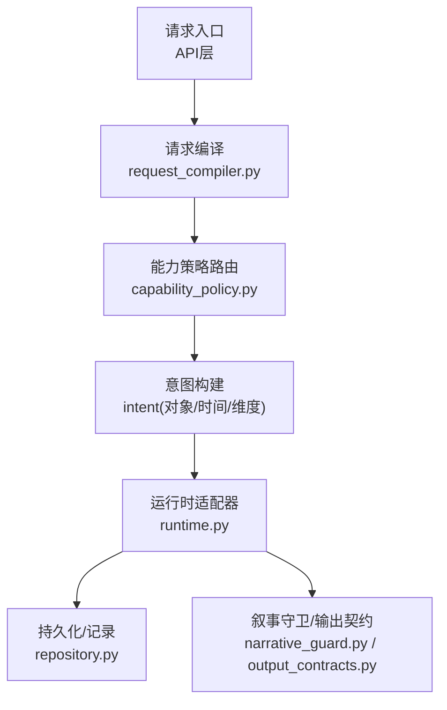
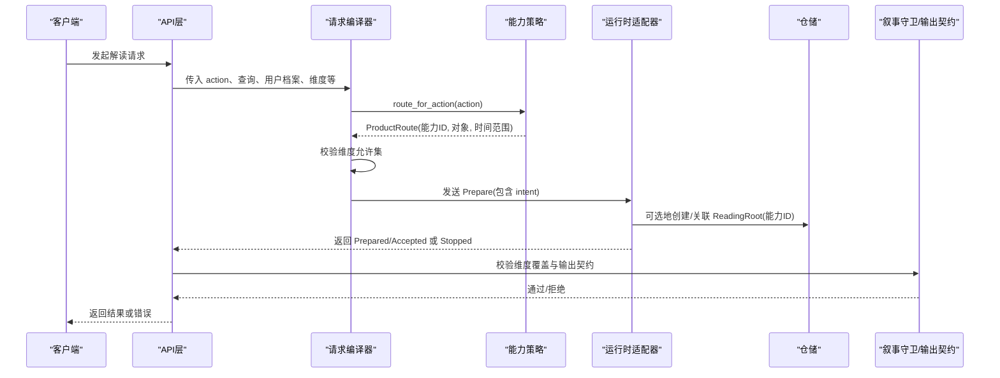
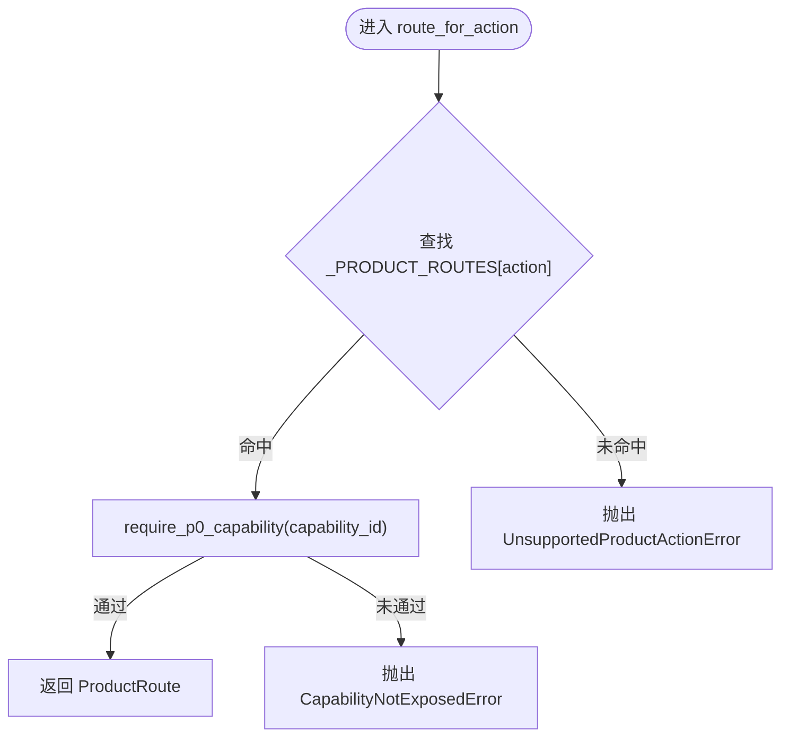
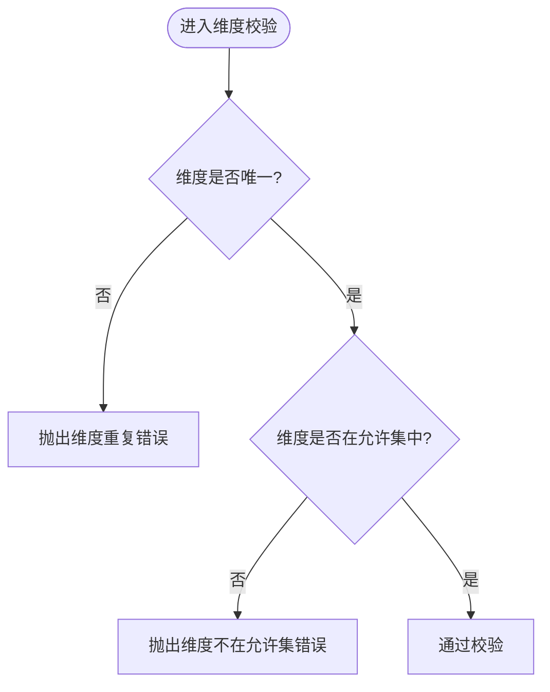
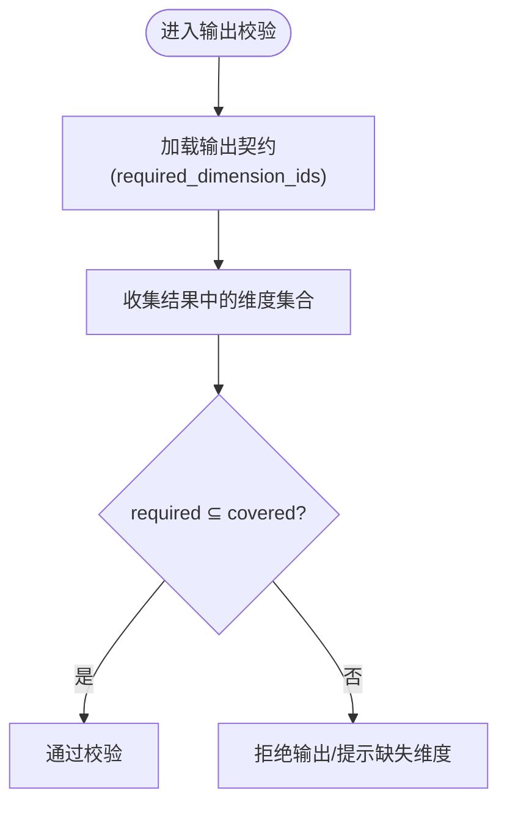
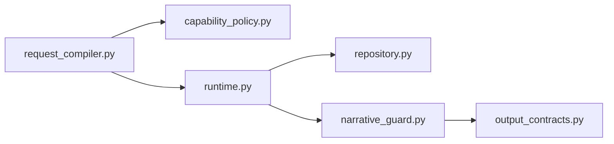

# 能力策略管理

<cite>
**本文引用的文件**
- [capability_policy.py](file://backend/app/readings/capability_policy.py)
- [request_compiler.py](file://backend/app/readings/request_compiler.py)
- [test_request_compiler.py](file://backend/tests/test_request_compiler.py)
- [runtime.py](file://backend/app/adapters/runtime.py)
- [repository.py](file://backend/app/readings/repository.py)
- [narrative_guard.py](file://backend/app/readings/narrative_guard.py)
- [output_contracts.py](file://backend/app/readings/output_contracts.py)
- [api_schemas.py](file://backend/app/readings/api_schemas.py)
- [v1.yaml](file://contracts/openapi/v1.yaml)
</cite>

## 目录
1. [简介](#简介)
2. [项目结构](#项目结构)
3. [核心组件](#核心组件)
4. [架构总览](#架构总览)
5. [详细组件分析](#详细组件分析)
6. [依赖关系分析](#依赖关系分析)
7. [性能与扩展性](#性能与扩展性)
8. [故障排查指南](#故障排查指南)
9. [结论](#结论)
10. [附录](#附录)

## 简介
本技术文档聚焦“能力策略管理”，围绕 ProductRoute 的设计概念、action 到策略的映射、能力 ID 的作用机制（功能开关、版本控制、灰度发布）、维度权限控制、配置扩展机制，以及动态加载与热更新进行系统化说明。文档同时提供测试方法与故障排查建议，确保系统功能的正确性与稳定性。

## 项目结构
能力策略相关代码主要位于后端模块：
- 策略定义与路由：backend/app/readings/capability_policy.py
- 请求编译与维度校验：backend/app/readings/request_compiler.py
- 运行时适配器（含能力描述与默认维度）：backend/app/adapters/runtime.py
- 读取根与能力绑定存储：backend/app/readings/repository.py
- 叙事守卫与输出契约（维度覆盖检查）：backend/app/readings/narrative_guard.py, output_contracts.py
- API Schema 与 OpenAPI 契约：backend/app/readings/api_schemas.py, contracts/openapi/v1.yaml
- 单元测试验证策略与行为：backend/tests/test_request_compiler.py

**图表来源**
- [capability_policy.py:31-67](file://backend/app/readings/capability_policy.py#L31-L67)
- [request_compiler.py:35-93](file://backend/app/readings/request_compiler.py#L35-L93)
- [runtime.py:770-935](file://backend/app/adapters/runtime.py#L770-L935)
- [repository.py:83-118](file://backend/app/readings/repository.py#L83-L118)
- [narrative_guard.py:159-186](file://backend/app/readings/narrative_guard.py#L159-L186)
- [output_contracts.py:16-16](file://backend/app/readings/output_contracts.py#L16-L16)

**章节来源**
- [capability_policy.py:1-67](file://backend/app/readings/capability_policy.py#L1-L67)
- [request_compiler.py:1-216](file://backend/app/readings/request_compiler.py#L1-L216)
- [runtime.py:770-935](file://backend/app/adapters/runtime.py#L770-L935)
- [repository.py:83-118](file://backend/app/readings/repository.py#L83-L118)
- [narrative_guard.py:159-186](file://backend/app/readings/narrative_guard.py#L159-L186)
- [output_contracts.py:16-16](file://backend/app/readings/output_contracts.py#L16-L16)
- [api_schemas.py:22-94](file://backend/app/readings/api_schemas.py#L22-L94)
- [v1.yaml:1076-1107](file://contracts/openapi/v1.yaml#L1076-L1107)

## 核心组件
- 产品路由与策略：ProductRoute 以三元组（能力ID、对象标识、时间范围）表达一次解读请求的策略约束；route_for_action 将冻结的产品 action 映射到具体策略，并强制 P0 暴露能力白名单。
- 请求编译与维度校验：为不同解读类型（八字、日运/周运、六爻）分别限定允许的维度集合，拒绝未知或重复维度。
- 运行时能力描述：Fake 运行时提供能力清单、对象、时间范围、维度与默认维度，用于合同测试与兼容性验证。
- 存储与所有权：ReadingRoot 绑定 capability_id，确保读取根与能力一致，并在创建时校验所有者一致性。
- 叙事守卫与输出契约：在生成结果时校验维度覆盖是否满足契约要求，保障输出完整性。

**章节来源**
- [capability_policy.py:31-67](file://backend/app/readings/capability_policy.py#L31-L67)
- [request_compiler.py:10-12,48-59,96-126,129-170,183-216:10-12](file://backend/app/readings/request_compiler.py#L10-L12)
- [runtime.py:770-935](file://backend/app/adapters/runtime.py#L770-L935)
- [repository.py:83-118](file://backend/app/readings/repository.py#L83-L118)
- [narrative_guard.py:159-186](file://backend/app/readings/narrative_guard.py#L159-L186)
- [output_contracts.py:16-16](file://backend/app/readings/output_contracts.py#L16-L16)

## 架构总览
下图展示了从产品 action 到运行时执行的完整流程，包括策略路由、意图构建、运行时适配与结果校验。

**图表来源**
- [capability_policy.py:61-67](file://backend/app/readings/capability_policy.py#L61-L67)
- [request_compiler.py:35-93](file://backend/app/readings/request_compiler.py#L35-L93)
- [runtime.py:800-864](file://backend/app/adapters/runtime.py#L800-L864)
- [repository.py:83-118](file://backend/app/readings/repository.py#L83-L118)
- [narrative_guard.py:159-186](file://backend/app/readings/narrative_guard.py#L159-L186)

## 详细组件分析

### ProductRoute 与 route_for_action
- 设计概念：ProductRoute 使用三元组（capability_id, object_id, horizon_id）明确一次解读的能力、对象与时间范围。例如：
  - profile_preview/bazi_deep → bazi, natal, life
  - today/near_seven → fortune, near_time_personal, day/week
  - liuyao_one_question → liuyao, concrete_event, instant
- 路由匹配逻辑：route_for_action 根据冻结的 action 查找映射表，若未命中则抛出“不支持的产品动作”异常；随后调用 require_p0_capability 校验该能力是否在 P0 暴露白名单中。
- 作用机制：
  - 功能开关：P0_EXPOSED_CAPABILITY_IDS 作为当前版本对外暴露的能力集合，未列入的能力即使已安装也会被拒绝。
  - 版本控制：V51_RELEASE_CAPABILITY_IDS 表示发行包内具备的能力清单，与 P0 暴露白名单分离，便于灰度与分阶段上线。
  - 灰度发布：通过调整 P0_EXPOSED_CAPABILITY_IDS 可逐步放开能力给更多用户，而不改变底层能力清单。

**图表来源**
- [capability_policy.py:38-67](file://backend/app/readings/capability_policy.py#L38-L67)

**章节来源**
- [capability_policy.py:5-20,23-28,31-67:5-20](file://backend/app/readings/capability_policy.py#L5-L20)
- [test_request_compiler.py:44-114](file://backend/tests/test_request_compiler.py#L44-L114)

### 维度权限控制
- 各解读类型的允许维度集合：
  - 八字：概览、事业
  - 日运/周运：事业
  - 六爻：事业、结果、时机
- 校验规则：
  - 维度必须唯一（去重后长度等于原长度）
  - 维度必须在对应解读类型的允许集中，否则抛出请求编译错误
- 访问限制：
  - 请求编译阶段即拦截非法维度，避免下游处理成本
  - 运行时 Fake 能力会基于维度生成简要信息，体现维度对输出的影响
  - 叙事守卫在结果侧再次校验维度覆盖是否满足契约要求

**图表来源**
- [request_compiler.py:48-59](file://backend/app/readings/request_compiler.py#L48-L59)
- [request_compiler.py:10-12](file://backend/app/readings/request_compiler.py#L10-L12)
- [runtime.py:870-935](file://backend/app/adapters/runtime.py#L870-L935)
- [narrative_guard.py:159-186](file://backend/app/readings/narrative_guard.py#L159-L186)

**章节来源**
- [request_compiler.py:10-12,48-59,96-126,129-170,183-216:10-12](file://backend/app/readings/request_compiler.py#L10-L12)
- [runtime.py:870-935](file://backend/app/adapters/runtime.py#L870-L935)
- [narrative_guard.py:159-186](file://backend/app/readings/narrative_guard.py#L159-L186)

### 能力 ID 的作用机制
- 能力清单与暴露白名单分离：
  - V51_RELEASE_CAPABILITY_IDS：发行包内具备的能力集合
  - P0_EXPOSED_CAPABILITY_IDS：当前版本对外暴露的能力集合
- 灰度与版本控制：
  - 通过仅调整 P0_EXPOSED_CAPABILITY_IDS 实现灰度发布
  - 新增能力先加入发行清单，再逐步开放至 P0 暴露
- 运行时契约：
  - Fake 运行时描述能力清单、对象、时间范围、维度与默认维度，用于端到端合同测试
  - 请求编译生成的 intent 包含 capability_id，供运行时识别与处理

**章节来源**
- [capability_policy.py:5-20,53-67:5-20](file://backend/app/readings/capability_policy.py#L5-L20)
- [runtime.py:770-935](file://backend/app/adapters/runtime.py#L770-L935)
- [test_request_compiler.py:44-114](file://backend/tests/test_request_compiler.py#L44-L114)

### 维度与输出契约校验
- 输出契约要求：
  - 某些解读类型要求特定维度被覆盖（如事业维度）
- 叙事守卫：
  - 在生成结果时检查 findings 的 dimension_ids 是否满足 required_dimension_ids
  - 若不满足，拒绝输出或提示缺失维度

**图表来源**
- [output_contracts.py:16-16](file://backend/app/readings/output_contracts.py#L16-L16)
- [narrative_guard.py:159-186](file://backend/app/readings/narrative_guard.py#L159-L186)

**章节来源**
- [output_contracts.py:16-16](file://backend/app/readings/output_contracts.py#L16-L16)
- [narrative_guard.py:159-186](file://backend/app/readings/narrative_guard.py#L159-L186)

### 配置管理与动态加载
- 配置项：
  - 能力清单与暴露白名单位于策略模块常量中，便于版本化管理
  - 运行时适配器提供能力描述（对象、时间范围、维度、默认维度），用于前端展示与合同测试
- 动态加载与热更新：
  - 策略路由为内存映射，修改需重启服务生效
  - 运行时能力描述由适配器提供，可通过替换适配器实现能力切换
  - 仓储层在创建 ReadingRoot 时绑定 capability_id，确保数据一致性

**章节来源**
- [capability_policy.py:5-20,38-67:5-20](file://backend/app/readings/capability_policy.py#L5-L20)
- [runtime.py:770-935](file://backend/app/adapters/runtime.py#L770-L935)
- [repository.py:83-118](file://backend/app/readings/repository.py#L83-L118)

## 依赖关系分析
- 请求编译依赖策略路由：compile_* 函数通过 _route_for_compiler 调用 route_for_action，并校验 expected_capability_id
- 运行时依赖能力描述：Describe/Prepare 命令依赖 runtime 提供的能力清单与默认维度
- 仓储依赖能力绑定：create_root 需要 capability_id，确保读取根与能力一致
- 叙事守卫依赖输出契约：校验维度覆盖是否符合契约要求

**图表来源**
- [request_compiler.py:35-93](file://backend/app/readings/request_compiler.py#L35-L93)
- [capability_policy.py:61-67](file://backend/app/readings/capability_policy.py#L61-L67)
- [runtime.py:800-864](file://backend/app/adapters/runtime.py#L800-L864)
- [repository.py:83-118](file://backend/app/readings/repository.py#L83-L118)
- [narrative_guard.py:159-186](file://backend/app/readings/narrative_guard.py#L159-L186)
- [output_contracts.py:16-16](file://backend/app/readings/output_contracts.py#L16-L16)

**章节来源**
- [request_compiler.py:35-93](file://backend/app/readings/request_compiler.py#L35-L93)
- [capability_policy.py:61-67](file://backend/app/readings/capability_policy.py#L61-L67)
- [runtime.py:800-864](file://backend/app/adapters/runtime.py#L800-L864)
- [repository.py:83-118](file://backend/app/readings/repository.py#L83-L118)
- [narrative_guard.py:159-186](file://backend/app/readings/narrative_guard.py#L159-L186)
- [output_contracts.py:16-16](file://backend/app/readings/output_contracts.py#L16-L16)

## 性能与扩展性
- 性能特性：
  - 策略路由为内存映射，查找复杂度 O(1)
  - 维度校验为集合差运算，复杂度 O(n)，n 为维度数量
  - 运行时 Describe/Prepare 为轻量操作，适合高频调用
- 扩展性建议：
  - 新增解读类型：在 request_compiler.py 中添加维度允许集与编译函数，并在策略路由中增加映射
  - 新增维度：在各解读类型的维度允许集中添加新维度，并确保输出契约与叙事守卫能覆盖
  - 灰度发布：调整 P0_EXPOSED_CAPABILITY_IDS 逐步放开能力，配合测试用例验证

[本节为通用指导，不直接分析具体文件]

## 故障排查指南
- 常见错误与定位：
  - 不支持的产品动作：检查 action 是否在 _PRODUCT_ROUTES 中定义
  - 能力未暴露：检查 capability_id 是否在 P0_EXPOSED_CAPABILITY_IDS 中
  - 维度非法：检查维度是否重复或不在允许集中
  - 输出维度缺失：检查 required_dimension_ids 是否被覆盖
- 调试步骤：
  - 打印 route_for_action 返回值，确认三元组是否正确
  - 打印编译后的 intent，确认 capability_id、object_id、horizon、dimension_ids
  - 查看运行时返回的 brief/findings，确认维度覆盖情况
  - 核对输出契约要求的维度集合

**章节来源**
- [capability_policy.py:23-28,53-67:23-28](file://backend/app/readings/capability_policy.py#L23-L28)
- [request_compiler.py:48-59,96-126,129-170,183-216:48-59](file://backend/app/readings/request_compiler.py#L48-L59)
- [runtime.py:800-864](file://backend/app/adapters/runtime.py#L800-L864)
- [narrative_guard.py:159-186](file://backend/app/readings/narrative_guard.py#L159-L186)

## 结论
能力策略管理通过 ProductRoute 的三元组模型清晰表达了能力、对象与时间范围的约束；route_for_action 将冻结的产品动作映射到具体策略，并通过 P0 暴露白名单实现功能开关与灰度发布。维度权限控制在请求编译阶段即进行严格校验，结合输出契约与叙事守卫保障结果完整性。配置项集中在策略与运行时适配器中，便于版本化管理与动态加载。通过完善的测试与故障排查方法，可确保系统的正确性与稳定性。

## 附录
- API 契约参考：ReadingRequestView 包含 subject_refs、capability_ids、object_id、dimension_ids、horizon 等字段，用于统一描述请求视图。
- 前端展示：web 层维护能力、对象、维度的标签映射，用于界面显示。

**章节来源**
- [v1.yaml:1076-1107](file://contracts/openapi/v1.yaml#L1076-L1107)
- [api_schemas.py:22-94](file://backend/app/readings/api_schemas.py#L22-L94)