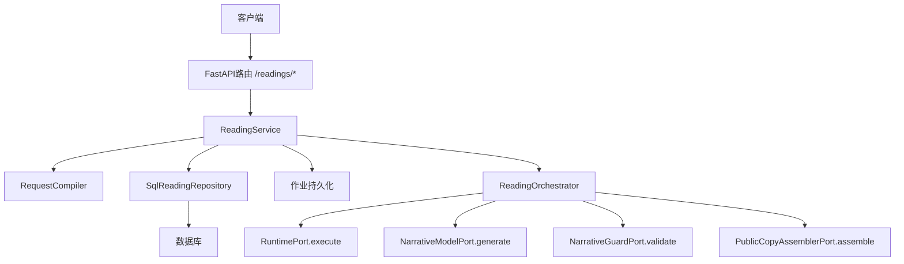
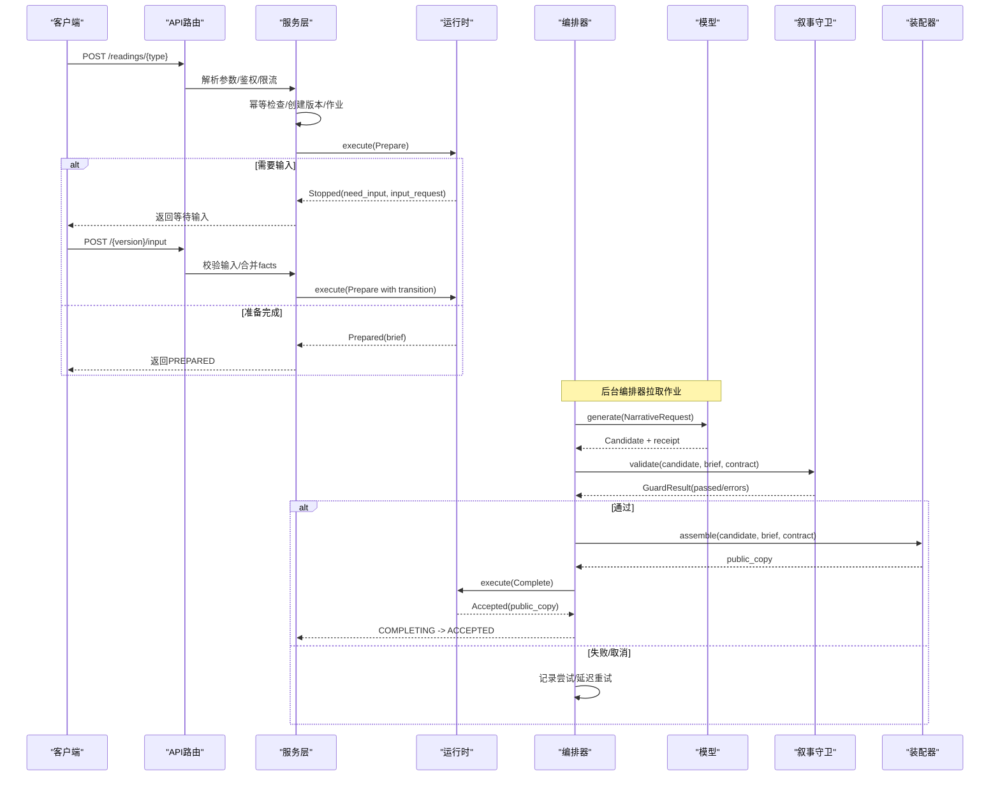
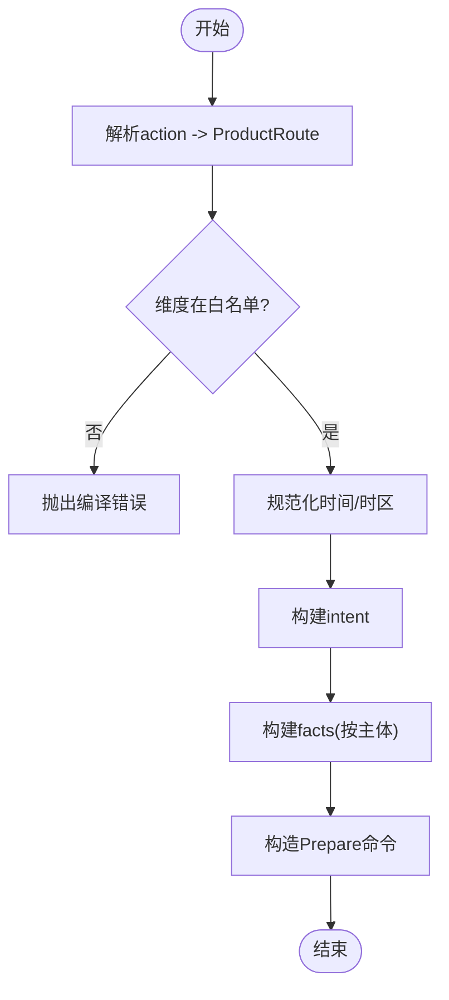
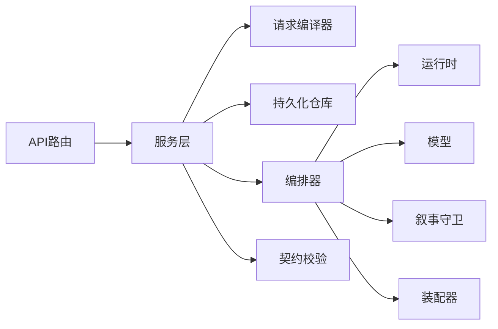

# 解读类型实现

<cite>
**本文引用的文件**
- [backend/app/readings/request_compiler.py](file://backend/app/readings/request_compiler.py)
- [backend/app/readings/capability_policy.py](file://backend/app/readings/capability_policy.py)
- [backend/app/readings/orchestrator.py](file://backend/app/readings/orchestrator.py)
- [backend/app/readings/models.py](file://backend/app/readings/models.py)
- [backend/app/readings/api_schemas.py](file://backend/app/readings/api_schemas.py)
- [backend/app/readings/service.py](file://backend/app/readings/service.py)
- [backend/app/api/readings.py](file://backend/app/api/readings.py)
- [backend/app/readings/runtime_contracts.py](file://backend/app/readings/runtime_contracts.py)
- [contracts/schemas/mingli-command-v2.schema.json](file://contracts/schemas/mingli-command-v2.schema.json)
- [contracts/schemas/mingli-result-v2.schema.json](file://contracts/schemas/mingli-result-v2.schema.json)
</cite>

## 目录
1. [简介](#简介)
2. [项目结构](#项目结构)
3. [核心组件](#核心组件)
4. [架构总览](#架构总览)
5. [详细组件分析](#详细组件分析)
6. [依赖关系分析](#依赖关系分析)
7. [性能与可靠性](#性能与可靠性)
8. [故障排查指南](#故障排查指南)
9. [结论](#结论)
10. [附录：API调用示例与集成方法](#附录api调用示例与集成方法)

## 简介
本文件系统性阐述命理解读类型的后端实现，覆盖三大解读类型：八字分析、运势预测、六爻占卜。重点说明：
- 每种解读类型的输入参数、处理流程与输出格式
- 请求编译器的设计（参数校验、数据转换、运行时适配）
- 能力策略（功能开关、配额控制、访问权限管理）
- 不同解读类型的业务规则与数据模型差异
- 扩展机制与自定义解读开发指南
- API调用示例与集成方法

## 项目结构
后端围绕“读取服务层 + 请求编译器 + 编排器 + 持久化模型 + 契约校验”的层次组织：
- API路由层：接收HTTP请求，进行鉴权、限流、入参校验，并委托服务层
- 服务层：组装领域动作、构建Prepare命令、持久化版本与作业、幂等控制
- 请求编译器：将产品动作与用户输入编译为统一的Prepare命令
- 编排器：驱动运行时执行Prepare/Complete，协调模型生成、叙事守卫、公开副本装配
- 持久化模型：记录阅读根、版本、事实简报、生成尝试、已接受副本、作业队列等
- 契约层：通过JSON Schema严格约束命令与结果的结构

图表来源
- [backend/app/api/readings.py:87-399](file://backend/app/api/readings.py#L87-L399)
- [backend/app/readings/service.py:117-513](file://backend/app/readings/service.py#L117-L513)
- [backend/app/readings/request_compiler.py:96-216](file://backend/app/readings/request_compiler.py#L96-L216)
- [backend/app/readings/orchestrator.py:178-450](file://backend/app/readings/orchestrator.py#L178-L450)
- [backend/app/readings/models.py:53-378](file://backend/app/readings/models.py#L53-L378)

章节来源
- [backend/app/api/readings.py:87-399](file://backend/app/api/readings.py#L87-L399)
- [backend/app/readings/service.py:117-513](file://backend/app/readings/service.py#L117-L513)
- [backend/app/readings/request_compiler.py:96-216](file://backend/app/readings/request_compiler.py#L96-L216)
- [backend/app/readings/orchestrator.py:178-450](file://backend/app/readings/orchestrator.py#L178-L450)
- [backend/app/readings/models.py:53-378](file://backend/app/readings/models.py#L53-L378)

## 核心组件
- 能力策略：定义可暴露的能力ID与产品动作到能力/对象/时间范围的映射，限制P0能力集
- 请求编译器：将产品动作与用户输入编译为统一的Prepare命令，包含意图、事实、时域
- 服务层：负责幂等、创建阅读版本与作业、提交输入、查询摘要与结果
- 编排器：驱动Prepare/Complete生命周期，处理重试、延迟、中止、成本与告警
- 契约校验：通过JSON Schema对命令与结果进行强校验，保证前后端与运行时边界安全
- 数据模型：以不可变追加式记录保存准备命令、生成尝试、已接受副本等

章节来源
- [backend/app/readings/capability_policy.py:1-68](file://backend/app/readings/capability_policy.py#L1-L68)
- [backend/app/readings/request_compiler.py:1-216](file://backend/app/readings/request_compiler.py#L1-L216)
- [backend/app/readings/service.py:117-819](file://backend/app/readings/service.py#L117-L819)
- [backend/app/readings/orchestrator.py:178-450](file://backend/app/readings/orchestrator.py#L178-L450)
- [backend/app/readings/runtime_contracts.py:105-304](file://backend/app/readings/runtime_contracts.py#L105-L304)
- [backend/app/readings/models.py:53-378](file://backend/app/readings/models.py#L53-L378)

## 架构总览
整体工作流分为三个阶段：
- 准备阶段（Prepare）：服务层根据产品动作编译Prepare命令，持久化后交由运行时执行；运行时可能返回需要补充输入或终止
- 生成阶段（Generate）：编排器从运行时获取Brief，调用模型生成候选，经叙事守卫校验，再装配公开副本
- 完成阶段（Complete）：将已接受的公开副本回写至运行时，最终状态为已接受

图表来源
- [backend/app/api/readings.py:87-399](file://backend/app/api/readings.py#L87-L399)
- [backend/app/readings/service.py:129-513](file://backend/app/readings/service.py#L129-L513)
- [backend/app/readings/orchestrator.py:212-450](file://backend/app/readings/orchestrator.py#L212-L450)
- [backend/app/readings/runtime_contracts.py:105-304](file://backend/app/readings/runtime_contracts.py#L105-L304)

## 详细组件分析

### 请求编译器：参数验证、数据转换、运行时适配
- 产品动作路由：将action映射到capability_id/object_id/horizon_id，并强制P0能力白名单
- 维度白名单：按解读类型限定dimension_ids集合，防止越界
- 时区与时段：
  - 八字：无时段，仅携带主体事实（出生信息、时基策略、子时策略、坐标来源等）
  - 运势：基于服务器当前时间计算start/end（日/周），并校验请求时区不得覆盖确认档案时区
  - 六爻：事件时间需转换为确认时区；cast支持数字硬币字符串或6个自下而上的整数（6..9）
- 统一Prepare构造：intent包含subject_refs、object_id、dimension_ids、horizon、capability_id、comparisons；facts按主体聚合

图表来源
- [backend/app/readings/request_compiler.py:35-93](file://backend/app/readings/request_compiler.py#L35-L93)
- [backend/app/readings/request_compiler.py:96-216](file://backend/app/readings/request_compiler.py#L96-L216)

章节来源
- [backend/app/readings/request_compiler.py:1-216](file://backend/app/readings/request_compiler.py#L1-L216)

### 能力策略：功能开关、配额控制、访问权限管理
- 能力白名单：V51_RELEASE_CAPABILITY_IDS列出所有能力；P0_EXPOSED_CAPABILITY_IDS限定对外暴露能力
- 产品动作映射：profile_preview/bazi_deep/today/near_seven/liuyao_one_question分别映射到bazi/fortune/liuyao能力与对象/时域
- 访问控制：route_for_action会校验capability是否属于P0暴露集，否则抛出未暴露错误
- 配额控制：API层通过速率限制器按owner限流，避免滥用

章节来源
- [backend/app/readings/capability_policy.py:1-68](file://backend/app/readings/capability_policy.py#L1-L68)
- [backend/app/api/readings.py:49-55](file://backend/app/api/readings.py#L49-L55)

### 服务层：幂等、版本与作业、输入补全、摘要与结果
- 幂等键：基于Idempotency-Key与请求指纹，防止重复提交
- 版本与作业：创建ReadingRoot/Version，持久化加密的Prepare命令，创建作业并设置输出契约与语言
- 输入补全：当运行时返回need_input，服务层校验输入字段类型、范围、选择项，合并到facts并重试Prepare
- 摘要与结果：提供列表、详情、结果查询，包含public fact面板、验证反馈、前序答案投影

章节来源
- [backend/app/readings/service.py:117-819](file://backend/app/readings/service.py#L117-L819)
- [backend/app/readings/models.py:53-378](file://backend/app/readings/models.py#L53-L378)

### 编排器：Prepare/Complete生命周期、重试与告警
- 状态机：INPUT_READY -> PREPARED -> COMPLETING -> ACCEPTED；支持WAITING_INPUT、TERMINAL_STOPPED、DELAYED、RUNTIME_UNKNOWN
- 重试与退避：Prepare/Complete传输失败时按退避时间重试；达到最大尝试次数标记延迟
- 模型生成与守卫：生成候选后关闭引用，经叙事守卫校验；失败记录错误并尝试重试
- 公开副本装配：通过后装配公开副本，提交Complete；成功则记录已接受副本
- 告警：运行时未知、守卫拒绝、模型成本等事件通过AlertSink上报

章节来源
- [backend/app/readings/orchestrator.py:178-450](file://backend/app/readings/orchestrator.py#L178-L450)

### 契约与数据模型：命令与结果的强约束
- 命令Schema：describe/prepare/complete三态，prepare要求query/intent/facts/state_token/transition
- 结果Schema：described/prepared/accepted/stopped四态，stopped区分need_input与终端停止
- 数据模型：ReadingVersion存储加密的prepare/last_result/completion；GenerationAttempt记录候选与错误；AcceptedCopy存储最终副本；ReadingJobs管理作业队列与租约

章节来源
- [contracts/schemas/mingli-command-v2.schema.json:1-126](file://contracts/schemas/mingli-command-v2.schema.json#L1-L126)
- [contracts/schemas/mingli-result-v2.schema.json:1-392](file://contracts/schemas/mingli-result-v2.schema.json#L1-L392)
- [backend/app/readings/models.py:53-378](file://backend/app/readings/models.py#L53-L378)
- [backend/app/readings/runtime_contracts.py:105-304](file://backend/app/readings/runtime_contracts.py#L105-L304)

### 三种解读类型的业务规则与数据模型差异
- 八字分析（bazi）
  - 输入：profile_version_id、可选query、可选dimension_ids（默认career）
  - 事实：出生时间或四柱、时区、地点、性别、时间口径、子时策略、坐标来源
  - 时域：life（无start/end）
  - 用途：本命格局预览、职业维度等
- 运势预测（fortune）
  - 输入：profile_version_id、可选query
  - 事实：出生时间、时区、地点、性别、参考时间、时间口径、子时策略
  - 时域：day/week（自动计算start/end）
  - 用途：今日/本周运势
- 六爻占卜（liuyao）
  - 输入：cast（数字硬币或6个6..9整数）、event_datetime、timezone、location、可选subject_ref、可选query、可选dimension_ids
  - 事实：cast、事件时间、时区、地点
  - 时域：instant（无start/end）
  - 用途：一事一卦

章节来源
- [backend/app/readings/request_compiler.py:96-216](file://backend/app/readings/request_compiler.py#L96-L216)
- [backend/app/readings/service.py:129-254](file://backend/app/readings/service.py#L129-L254)
- [backend/app/readings/api_schemas.py:17-55](file://backend/app/readings/api_schemas.py#L17-L55)

## 依赖关系分析
- API路由依赖服务层与能力策略、请求编译器异常类型
- 服务层依赖配置、身份、档案服务、持久化仓库、输出契约、请求编译器
- 编排器依赖运行时端口、模型端口、守卫端口、装配器端口、时钟与告警
- 契约层通过JSON Schema在运行时与持久化边界进行强校验

图表来源
- [backend/app/api/readings.py:87-399](file://backend/app/api/readings.py#L87-L399)
- [backend/app/readings/service.py:117-513](file://backend/app/readings/service.py#L117-L513)
- [backend/app/readings/orchestrator.py:178-450](file://backend/app/readings/orchestrator.py#L178-L450)
- [backend/app/readings/runtime_contracts.py:105-304](file://backend/app/readings/runtime_contracts.py#L105-L304)

章节来源
- [backend/app/api/readings.py:87-399](file://backend/app/api/readings.py#L87-L399)
- [backend/app/readings/service.py:117-513](file://backend/app/readings/service.py#L117-L513)
- [backend/app/readings/orchestrator.py:178-450](file://backend/app/readings/orchestrator.py#L178-L450)
- [backend/app/readings/runtime_contracts.py:105-304](file://backend/app/readings/runtime_contracts.py#L105-L304)

## 性能与可靠性
- 幂等性：通过Idempotency-Key与请求指纹避免重复创建版本与作业
- 重试与退避：Prepare/Complete失败按退避时间重试，避免瞬时抖动导致失败
- 最大尝试次数：达到上限后标记延迟，减少无效重试
- 不可变记录：GenerationAttempt/AcceptedCopy等追加式写入，便于审计与回溯
- 速率限制：API层按owner限流，保护后端资源

章节来源
- [backend/app/readings/service.py:429-453](file://backend/app/readings/service.py#L429-L453)
- [backend/app/readings/orchestrator.py:250-394](file://backend/app/readings/orchestrator.py#L250-L394)
- [backend/app/readings/models.py:188-378](file://backend/app/readings/models.py#L188-L378)
- [backend/app/api/readings.py:49-55](file://backend/app/api/readings.py#L49-L55)

## 故障排查指南
- 请求编译错误：检查action是否受支持、dimension_ids是否在允许集合、时区是否合法、cast值是否为6..9或digital_coin
- 能力未暴露：确认capability_id属于P0暴露集
- 输入不合法：核对runtime返回的input_request，确保每个any_of组恰好选择一个字段，且类型与取值符合策略
- 运行时未知：Prepare传输失败且无state_token时进入RUNTIME_UNKNOWN，需等待恢复后重试
- 生成失败：查看GenerationAttempt中的guard_errors与model_receipt，必要时调整输出契约或重试
- 幂等冲突：Idempotency-Key与action或请求指纹不一致，需重新生成key

章节来源
- [backend/app/readings/request_compiler.py:16-71](file://backend/app/readings/request_compiler.py#L16-L71)
- [backend/app/readings/capability_policy.py:23-68](file://backend/app/readings/capability_policy.py#L23-L68)
- [backend/app/readings/service.py:677-786](file://backend/app/readings/service.py#L677-L786)
- [backend/app/readings/orchestrator.py:250-394](file://backend/app/readings/orchestrator.py#L250-L394)

## 结论
本系统通过清晰的分层与契约约束，实现了八字、运势、六爻三类解读的统一编排与可靠交付。请求编译器将多源输入标准化为Prepare命令，能力策略保障功能开关与访问控制，编排器确保生成质量与可观测性，数据模型提供完整审计轨迹。该架构具备良好的扩展性，便于新增解读类型与能力。

## 附录：API调用示例与集成方法

### 通用约定
- 鉴权：所有写操作需携带CSRF令牌与Owner上下文
- 幂等：建议为每次创建/提交输入/跟进请求提供Idempotency-Key头
- 限流：同一Owner在单位时间内请求数受限

### 八字分析（预览）
- 路径：POST /readings/preview
- 请求体字段：
  - profile_version_id: UUID
  - query: 可选字符串
  - dimension_ids: 可选数组，默认["career"]
- 响应：ReadingStartResponse，包含reading_version_id、status、horizon、dimension_ids等

章节来源
- [backend/app/api/readings.py:87-121](file://backend/app/api/readings.py#L87-L121)
- [backend/app/readings/api_schemas.py:17-27](file://backend/app/readings/api_schemas.py#L17-L27)
- [backend/app/readings/service.py:129-165](file://backend/app/readings/service.py#L129-L165)

### 运势预测（今日/本周）
- 路径：POST /readings/today 或 /readings/week
- 请求体字段：
  - profile_version_id: UUID
  - query: 可选字符串
- 响应：ReadingStartResponse，horizon为day或week

章节来源
- [backend/app/api/readings.py:124-195](file://backend/app/api/readings.py#L124-L195)
- [backend/app/readings/api_schemas.py:29-35](file://backend/app/readings/api_schemas.py#L29-L35)
- [backend/app/readings/service.py:167-204](file://backend/app/readings/service.py#L167-L204)

### 六爻占卜
- 路径：POST /readings/liuyao
- 请求体字段：
  - cast: ["digital_coin"] 或 [6,7,8,9] 的6元组
  - event_datetime: 带时区的日期时间
  - timezone: IANA时区
  - location: 地点
  - subject_ref: 可选主体标识
  - query: 可选字符串
  - dimension_ids: 可选数组，默认["career"]
- 响应：ReadingStartResponse

章节来源
- [backend/app/api/readings.py:198-237](file://backend/app/api/readings.py#L198-L237)
- [backend/app/readings/api_schemas.py:36-55](file://backend/app/readings/api_schemas.py#L36-L55)
- [backend/app/readings/service.py:206-254](file://backend/app/readings/service.py#L206-L254)

### 补充输入（当状态为WAITING_INPUT）
- 路径：POST /readings/{reading_version_id}/input
- 请求体字段：values: 字典，按runtime返回的input_request的要求填写
- 响应：ReadingStartResponse

章节来源
- [backend/app/api/readings.py:281-306](file://backend/app/api/readings.py#L281-L306)
- [backend/app/readings/service.py:256-292](file://backend/app/readings/service.py#L256-L292)

### 查询结果与历史
- 列表：GET /readings
- 详情：GET /readings/{reading_version_id}
- 结果：GET /readings/{reading_version_id}/result
- 验证：POST /readings/{reading_version_id}/verification
- 跟进：POST /readings/{reading_version_id}/follow-up

章节来源
- [backend/app/api/readings.py:240-399](file://backend/app/api/readings.py#L240-L399)
- [backend/app/readings/service.py:294-427](file://backend/app/readings/service.py#L294-L427)

### 扩展机制与自定义解读开发指南
- 新增能力：
  - 在能力策略中登记新capability_id（若需P0暴露，加入P0_EXPOSED_CAPABILITY_IDS）
  - 在产品动作映射中添加action到capability/object/horizon的映射
- 新增解读类型：
  - 在请求编译器中定义新的compile_*_prepare函数，实现维度白名单、时间归一化、facts构建
  - 在服务层添加对应的start_*方法，复用幂等、版本与作业创建逻辑
  - 在API路由层暴露新接口，绑定对应schema与服务方法
- 输入校验：
  - 使用service层的_INPUT_FIELD_POLICIES与_validate_input_value扩展字段策略
  - 结合runtime返回的input_request动态渲染前端表单
- 输出契约：
  - 通过output_contracts定义max_output_chars与展示模板
  - 编排器将candidate装配为public_copy，供前端渲染

章节来源
- [backend/app/readings/capability_policy.py:1-68](file://backend/app/readings/capability_policy.py#L1-L68)
- [backend/app/readings/request_compiler.py:96-216](file://backend/app/readings/request_compiler.py#L96-L216)
- [backend/app/readings/service.py:96-114](file://backend/app/readings/service.py#L96-L114)
- [backend/app/readings/service.py:256-292](file://backend/app/readings/service.py#L256-L292)
- [backend/app/readings/output_contracts.py](file://backend/app/readings/output_contracts.py)