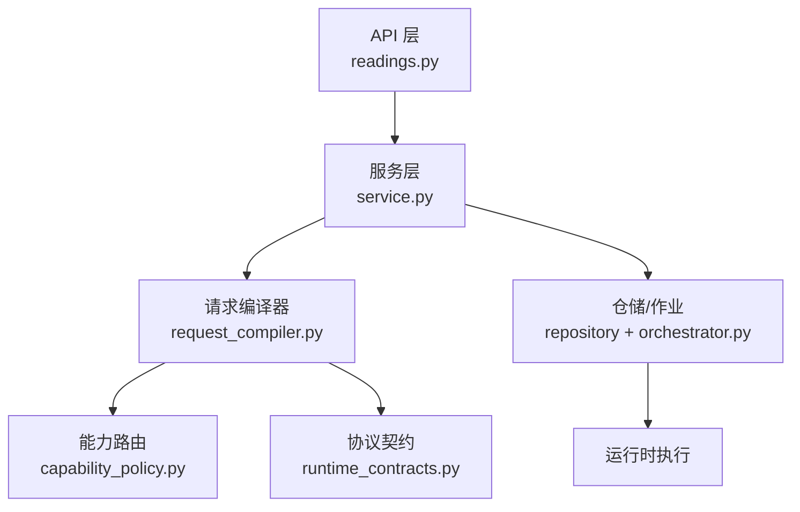
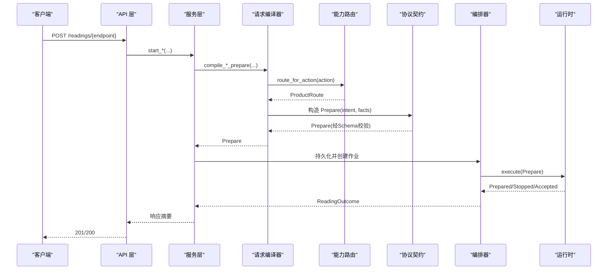
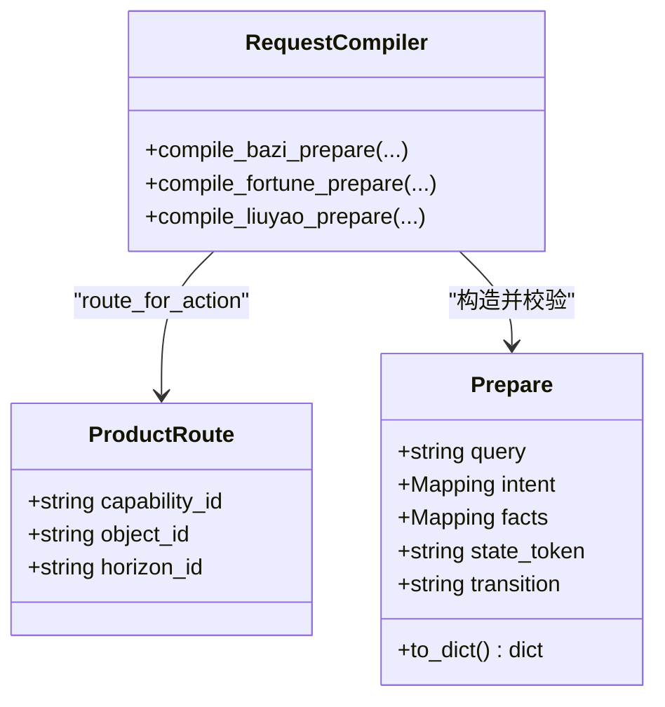
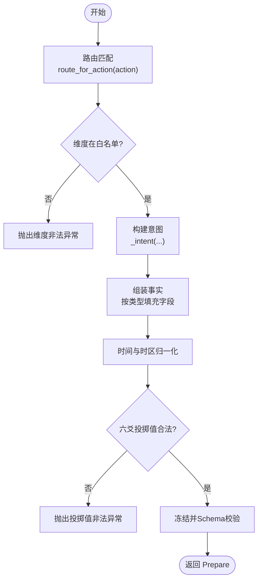
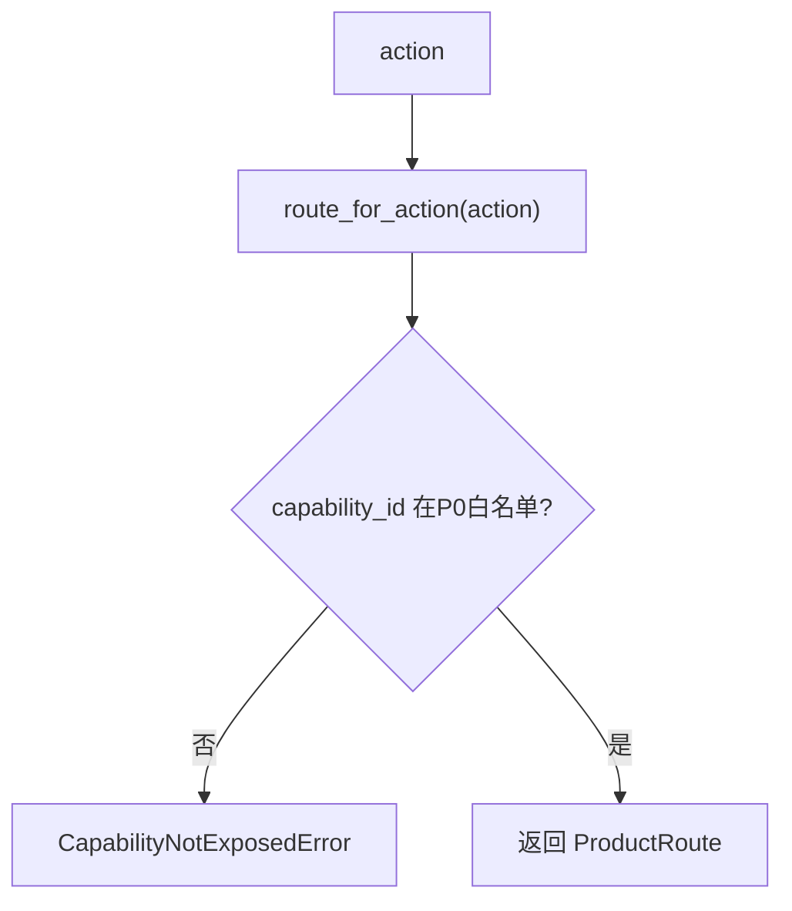
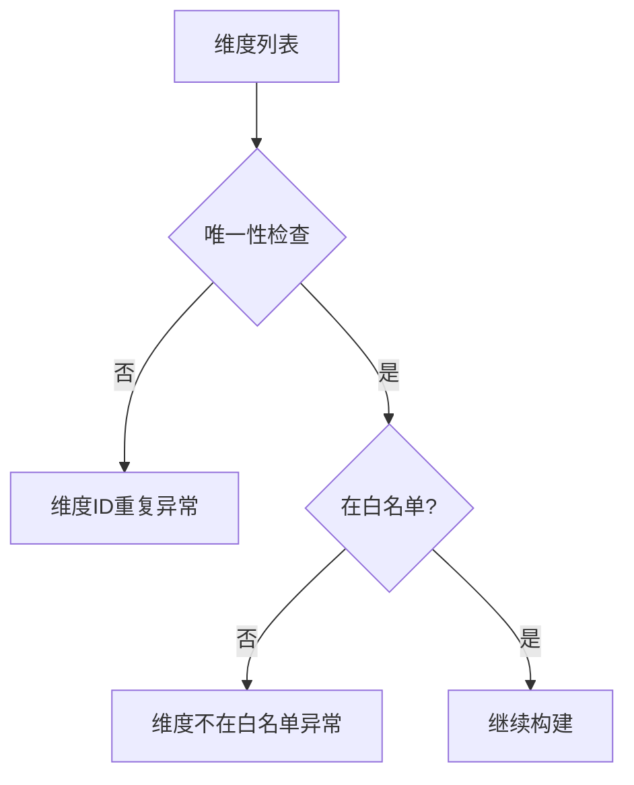
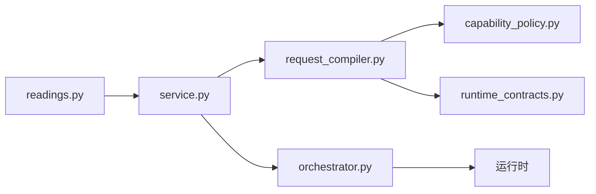

# 请求编译机制

<cite>
**本文引用的文件**
- [request_compiler.py](file://backend/app/readings/request_compiler.py)
- [capability_policy.py](file://backend/app/readings/capability_policy.py)
- [runtime_contracts.py](file://backend/app/readings/runtime_contracts.py)
- [service.py](file://backend/app/readings/service.py)
- [readings.py](file://backend/app/api/readings.py)
- [orchestrator.py](file://backend/app/readings/orchestrator.py)
- [mingli-command-v2.schema.json](file://contracts/schemas/mingli-command-v2.schema.json)
- [test_request_compiler.py](file://backend/tests/test_request_compiler.py)
</cite>

## 目录
1. [简介](#简介)
2. [项目结构](#项目结构)
3. [核心组件](#核心组件)
4. [架构总览](#架构总览)
5. [详细组件分析](#详细组件分析)
6. [依赖关系分析](#依赖关系分析)
7. [性能考虑](#性能考虑)
8. [故障排查指南](#故障排查指南)
9. [结论](#结论)
10. [附录](#附录)

## 简介
本技术文档聚焦于“请求编译机制”，系统性解析 RequestCompiler 的设计与实现，覆盖统一接口抽象、类型特定实现的分层设计；详述 Prepare 命令的构建过程（意图生成、事实数据组装、参数验证）；解释路由匹配机制（action 到 ProductRoute 的映射与能力 ID 校验）；说明数据类型转换与规范化（时间戳处理、时区转换、地理坐标与六爻投掷值校验）；阐述维度白名单与非法参数拦截策略；总结错误处理模式、异常类型定义与调试信息输出；并提供扩展自定义解读类型的开发指南与最佳实践。

## 项目结构
请求编译位于后端 readings 模块中，围绕 request_compiler.py 提供三类 Prepare 构建器：八字、运势、六爻。它们通过 capability_policy.py 将产品 action 映射为 ProductRoute，并通过 runtime_contracts.py 中的 Prepare/Complete/Describe 等契约对象进行序列化与 JSON Schema 校验。API 层在 readings.py 中将 HTTP 请求转为服务调用，服务层 service.py 负责编排、幂等控制与持久化，最终由 orchestrator.py 驱动运行时执行。

图表来源
- [readings.py:87-237](file://backend/app/api/readings.py#L87-L237)
- [service.py:129-254](file://backend/app/readings/service.py#L129-L254)
- [request_compiler.py:96-216](file://backend/app/readings/request_compiler.py#L96-L216)
- [capability_policy.py:31-68](file://backend/app/readings/capability_policy.py#L31-L68)
- [runtime_contracts.py:113-155](file://backend/app/readings/runtime_contracts.py#L113-L155)

章节来源
- [readings.py:87-237](file://backend/app/api/readings.py#L87-L237)
- [service.py:129-254](file://backend/app/readings/service.py#L129-L254)
- [request_compiler.py:96-216](file://backend/app/readings/request_compiler.py#L96-L216)
- [capability_policy.py:31-68](file://backend/app/readings/capability_policy.py#L31-L68)
- [runtime_contracts.py:113-155](file://backend/app/readings/runtime_contracts.py#L113-L155)

## 核心组件
- 请求编译器：提供统一的 Prepare 构建入口，按产品类型分派具体编译逻辑。
- 能力路由：将产品 action 映射到能力 ID、对象 ID、时间范围 ID，并限制 P0 暴露能力。
- 协议契约：以不可变数据类承载 Prepare/Complete/Describe 等命令与结果，并在构造时进行 JSON Schema 校验。
- 服务编排：负责身份与权限、幂等键、默认查询与维度、配置读取、持久化与作业创建。
- 运行编排：驱动 Prepare/Complete 执行、重试、告警与状态推进。

章节来源
- [request_compiler.py:16-216](file://backend/app/readings/request_compiler.py#L16-L216)
- [capability_policy.py:1-68](file://backend/app/readings/capability_policy.py#L1-L68)
- [runtime_contracts.py:18-155](file://backend/app/readings/runtime_contracts.py#L18-L155)
- [service.py:117-254](file://backend/app/readings/service.py#L117-L254)
- [orchestrator.py:178-285](file://backend/app/readings/orchestrator.py#L178-L285)

## 架构总览
请求编译的核心流程如下：
- API 接收请求，调用服务层的 start_* 方法。
- 服务层解析参数、加载已确认的用户画像或事件上下文，计算默认查询与维度。
- 调用对应编译器生成 Prepare 命令（包含 intent 与 facts）。
- 服务层持久化版本与作业，交由编排器执行。
- 编排器调用运行时执行 Prepare，根据返回状态推进后续流程。

图表来源
- [readings.py:87-237](file://backend/app/api/readings.py#L87-L237)
- [service.py:129-254](file://backend/app/readings/service.py#L129-L254)
- [request_compiler.py:96-216](file://backend/app/readings/request_compiler.py#L96-L216)
- [capability_policy.py:61-68](file://backend/app/readings/capability_policy.py#L61-L68)
- [runtime_contracts.py:113-155](file://backend/app/readings/runtime_contracts.py#L113-L155)
- [orchestrator.py:212-285](file://backend/app/readings/orchestrator.py#L212-L285)

## 详细组件分析

### 统一接口抽象与分层设计
- 统一入口：request_compiler.py 暴露三个编译函数，分别对应八字、运势、六爻。每个函数职责单一，输入参数明确，输出均为 Prepare。
- 分层设计：
  - 路由层：capability_policy.route_for_action 将 action 映射为 ProductRoute，并进行 P0 能力白名单校验。
  - 编译层：各 compile_*_prepare 函数基于路由与领域规则生成 intent 与 facts。
  - 契约层：runtime_contracts.Prepare 在构造时对 intent/facts 冻结并执行 JSON Schema 校验，确保跨进程/运行时边界的数据一致性。

图表来源
- [capability_policy.py:31-68](file://backend/app/readings/capability_policy.py#L31-L68)
- [request_compiler.py:96-216](file://backend/app/readings/request_compiler.py#L96-L216)
- [runtime_contracts.py:113-155](file://backend/app/readings/runtime_contracts.py#L113-L155)

章节来源
- [request_compiler.py:96-216](file://backend/app/readings/request_compiler.py#L96-L216)
- [capability_policy.py:31-68](file://backend/app/readings/capability_policy.py#L31-L68)
- [runtime_contracts.py:113-155](file://backend/app/readings/runtime_contracts.py#L113-L155)

### Prepare 命令构建过程
- 意图生成：
  - 统一 _intent 函数填充 subject_refs、object_id、dimension_ids、horizon(kind_id/start/end)、capability_id、comparisons。
  - 不同编译器的差异在于 horizon 的起止时间与维度集合。
- 事实数据组装：
  - 八字：从 ConfirmedProfileVersion 提取出生时间/四柱、时区、地点、性别、时间基准策略、子时策略、经纬度与坐标来源。
  - 运势：注入 reference_datetime（服务器时间归一化至用户时区），以及出生时间、时区、地点、性别、策略。
  - 六爻：注入 normalized cast、event_datetime、confirmed_timezone、location。
- 参数验证：
  - 维度白名单：每种解读类型有允许维度集合，超出即拒绝。
  - 时区校验：必须为已知 IANA 时区且带时区信息的 datetime。
  - 六爻投掷值：仅支持数字硬币字符串或自下而上的六个整数（6..9）。

图表来源
- [request_compiler.py:35-93](file://backend/app/readings/request_compiler.py#L35-L93)
- [request_compiler.py:96-216](file://backend/app/readings/request_compiler.py#L96-L216)
- [runtime_contracts.py:113-155](file://backend/app/readings/runtime_contracts.py#L113-L155)

章节来源
- [request_compiler.py:35-93](file://backend/app/readings/request_compiler.py#L35-L93)
- [request_compiler.py:96-216](file://backend/app/readings/request_compiler.py#L96-L216)
- [runtime_contracts.py:113-155](file://backend/app/readings/runtime_contracts.py#L113-L155)

### 路由匹配机制与能力 ID 校验
- action 到 ProductRoute 的映射：
  - profile_preview/bazi_deep -> bazi/natal/life
  - today -> fortune/near_time_personal/day
  - near_seven -> fortune/near_time_personal/week
  - liuyao_one_question -> liuyao/concrete_event/instant
- 能力 ID 校验：
  - 仅 P0_EXPOSED_CAPABILITY_IDS 暴露给当前产品版本，未暴露的能力会抛出 CapabilityNotExposedError。
  - 编译器内部使用 _route_for_compiler 强制 action 对应的 capability_id 与预期一致，防止越权。

图表来源
- [capability_policy.py:5-68](file://backend/app/readings/capability_policy.py#L5-L68)
- [request_compiler.py:35-45](file://backend/app/readings/request_compiler.py#L35-L45)

章节来源
- [capability_policy.py:5-68](file://backend/app/readings/capability_policy.py#L5-L68)
- [request_compiler.py:35-45](file://backend/app/readings/request_compiler.py#L35-L45)

### 数据类型转换与规范化
- 时间戳与时区：
  - 所有传入 datetime 必须带时区信息，否则拒绝。
  - 使用 ZoneInfo 将时间转换为目标时区；未知时区抛出异常。
  - 运势场景下，reference_datetime 由服务器 UTC 时间归一化为用户时区日期，day/week 起止日期据此计算。
- 地理坐标：
  - 八字事实中包含 longitude、latitude、coordinate_source，用于后续计算与展示。
- 六爻投掷值：
  - 支持 "digital_coin" 或长度为 6 的自下而上整数元组，取值范围 6..9；其他形式均拒绝。

章节来源
- [request_compiler.py:62-71](file://backend/app/readings/request_compiler.py#L62-L71)
- [request_compiler.py:129-170](file://backend/app/readings/request_compiler.py#L129-L170)
- [request_compiler.py:173-180](file://backend/app/readings/request_compiler.py#L173-L180)
- [request_compiler.py:183-216](file://backend/app/readings/request_compiler.py#L183-L216)

### 维度白名单机制与非法参数拦截
- 维度白名单：
  - 八字允许 ["overview", "career"]
  - 运势允许 ["career"]
  - 六爻允许 ["career", "outcome", "timing"]
- 非法参数拦截：
  - 重复维度、不在白名单的维度、非法时区、非法投掷值、客户端时区覆盖已确认时区等，均抛出 RequestCompilationError。
  - API 层将 RequestCompilationError 与 CapabilityNotExposedError 统一转换为 400 错误。

图表来源
- [request_compiler.py:48-59](file://backend/app/readings/request_compiler.py#L48-L59)
- [readings.py:115-117](file://backend/app/api/readings.py#L115-L117)
- [readings.py:152-153](file://backend/app/api/readings.py#L152-L153)
- [readings.py:189-190](file://backend/app/api/readings.py#L189-L190)
- [readings.py:231-232](file://backend/app/api/readings.py#L231-L232)

章节来源
- [request_compiler.py:48-59](file://backend/app/readings/request_compiler.py#L48-L59)
- [readings.py:115-117](file://backend/app/api/readings.py#L115-L117)
- [readings.py:152-153](file://backend/app/api/readings.py#L152-L153)
- [readings.py:189-190](file://backend/app/api/readings.py#L189-L190)
- [readings.py:231-232](file://backend/app/api/readings.py#L231-L232)

### 错误处理模式、异常类型与调试信息
- 异常类型：
  - RequestCompilationError：请求编译阶段失败（维度非法、时区非法、投掷值非法、时区覆盖等）。
  - CapabilityNotExposedError：能力未在当前产品版本暴露。
  - ContractValidationError：Prepare/Complete/Describe 等命令未通过 JSON Schema 校验。
  - 服务层异常：如 InvalidReadingInputError、IdempotencyConflictError、RuntimeReleaseUnavailableError 等。
- 错误传播：
  - API 层捕获 RequestCompilationError 与 CapabilityNotExposedError，返回 400 错误。
  - 服务层将业务异常映射为 ApiProblem，携带明确标题与状态码。
- 调试信息：
  - 契约校验失败时会附带路径信息，便于定位问题字段。
  - 编排器在传输错误或模型生成失败时记录告警，辅助排障。

章节来源
- [request_compiler.py:16-71](file://backend/app/readings/request_compiler.py#L16-L71)
- [capability_policy.py:23-29](file://backend/app/readings/capability_policy.py#L23-L29)
- [runtime_contracts.py:23-39](file://backend/app/readings/runtime_contracts.py#L23-L39)
- [service.py:45-79](file://backend/app/readings/service.py#L45-L79)
- [readings.py:67-84](file://backend/app/api/readings.py#L67-L84)
- [orchestrator.py:196-210](file://backend/app/readings/orchestrator.py#L196-L210)

### 扩展自定义解读类型的指南与最佳实践
- 新增解读类型步骤：
  1. 在 capability_policy.py 的 _PRODUCT_ROUTES 中添加 action 到 ProductRoute 的映射，并确保 capability_id 在 P0_EXPOSED_CAPABILITY_IDS 中暴露（如需）。
  2. 在 request_compiler.py 中新增 compile_xxx_prepare 函数，遵循现有模式：
     - 使用 _route_for_compiler 校验 action 与预期 capability_id 一致。
     - 使用 _validate_dimensions 校验维度白名单。
     - 使用 _normalize_datetime 进行时区归一化。
     - 使用 _intent 构建意图，按领域规则组装 facts。
     - 返回 Prepare，由 runtime_contracts 完成冻结与 Schema 校验。
  3. 在 service.py 中新增服务方法 start_xxx，复用默认查询与维度策略，调用新编译器并持久化。
  4. 在 API 层 readings.py 中新增路由端点，绑定到服务方法。
- 最佳实践：
  - 保持 Prepare 的不可变性与最小必要字段，避免泄露敏感信息。
  - 严格使用白名单与类型约束，拒绝任何未经验证的输入。
  - 对时间与时区进行集中化处理，避免分散逻辑导致不一致。
  - 通过测试用例（参考 test_request_compiler.py）断言输出与固定夹具一致，保障契约稳定性。

章节来源
- [capability_policy.py:31-68](file://backend/app/readings/capability_policy.py#L31-L68)
- [request_compiler.py:96-216](file://backend/app/readings/request_compiler.py#L96-L216)
- [service.py:129-254](file://backend/app/readings/service.py#L129-L254)
- [readings.py:87-237](file://backend/app/api/readings.py#L87-L237)
- [test_request_compiler.py:44-114](file://backend/tests/test_request_compiler.py#L44-L114)

## 依赖关系分析
- 低耦合高内聚：
  - request_compiler.py 仅依赖 capability_policy 与 runtime_contracts，不感知数据库与外部系统。
  - service.py 聚合多个子系统（profiles、repository、security），但对外暴露清晰的服务方法。
  - orchestrator.py 通过 Protocol 抽象运行时、模型、守卫与公共副本装配，便于替换与测试。
- 直接依赖链：
  - API -> Service -> Compiler -> Policy/Contracts -> Repository -> Orchestrator -> Runtime
- 潜在循环依赖：
  - 当前模块间无循环导入；通过 Protocol 与数据类解耦。

图表来源
- [readings.py:87-237](file://backend/app/api/readings.py#L87-L237)
- [service.py:117-254](file://backend/app/readings/service.py#L117-L254)
- [request_compiler.py:96-216](file://backend/app/readings/request_compiler.py#L96-L216)
- [capability_policy.py:31-68](file://backend/app/readings/capability_policy.py#L31-L68)
- [runtime_contracts.py:113-155](file://backend/app/readings/runtime_contracts.py#L113-L155)
- [orchestrator.py:178-285](file://backend/app/readings/orchestrator.py#L178-L285)

章节来源
- [readings.py:87-237](file://backend/app/api/readings.py#L87-L237)
- [service.py:117-254](file://backend/app/readings/service.py#L117-L254)
- [request_compiler.py:96-216](file://backend/app/readings/request_compiler.py#L96-L216)
- [capability_policy.py:31-68](file://backend/app/readings/capability_policy.py#L31-L68)
- [runtime_contracts.py:113-155](file://backend/app/readings/runtime_contracts.py#L113-L155)
- [orchestrator.py:178-285](file://backend/app/readings/orchestrator.py#L178-L285)

## 性能考虑
- 不可变数据类与冻结映射减少拷贝与意外修改开销。
- JSON Schema 校验缓存（lru_cache）提升多次校验性能。
- 维度白名单与早期参数校验降低无效请求进入后端的成本。
- 编排器对运行时传输错误采用退避重试，避免雪崩。

[本节为通用指导，不直接分析具体文件]

## 故障排查指南
- 常见错误与定位：
  - 维度非法：检查 dimension_ids 是否在对应解读类型的白名单内。
  - 时区非法：确认 timezone 为有效 IANA 名称，且 datetime 带时区。
  - 六爻投掷值非法：确认仅使用 "digital_coin" 或六个 6..9 的整数。
  - 能力未暴露：确认 capability_id 在 P0_EXPOSED_CAPABILITY_IDS 中。
  - 契约校验失败：查看 ContractValidationError 的路径信息，定位具体字段。
- 日志与告警：
  - 编排器在传输错误、模型生成失败、守卫拒绝等场景发出告警，结合 job_id 与 details 定位问题。
- 复现建议：
  - 使用测试夹具与 canonical_json 对比输出，快速比对期望与实际差异。

章节来源
- [request_compiler.py:16-71](file://backend/app/readings/request_compiler.py#L16-L71)
- [capability_policy.py:23-29](file://backend/app/readings/capability_policy.py#L23-L29)
- [runtime_contracts.py:23-39](file://backend/app/readings/runtime_contracts.py#L23-L39)
- [orchestrator.py:196-210](file://backend/app/readings/orchestrator.py#L196-L210)
- [test_request_compiler.py:174-186](file://backend/tests/test_request_compiler.py#L174-L186)

## 结论
请求编译机制通过清晰的层次划分与严格的契约校验，实现了跨产品能力的稳定对接。统一接口抽象与类型特定实现使扩展新解读类型变得可控且可测试；路由匹配与能力白名单保障了安全与版本治理；时间与时区的集中化处理提升了数据一致性；完善的错误处理与调试信息降低了运维成本。遵循本文档的最佳实践，可在保证质量的前提下高效扩展新的解读能力。

[本节为总结，不直接分析具体文件]

## 附录
- Prepare 命令 JSON Schema 关键约束：
  - intent 要求 subject_refs、object_id、dimension_ids、horizon、capability_id、comparisons。
  - facts 为 subject -> field 的映射，字段名非空。
  - prepare 的 kind 固定为 "prepare"，query 为非空文本，state_token 与 transition 可为空。

章节来源
- [mingli-command-v2.schema.json:1-126](file://contracts/schemas/mingli-command-v2.schema.json#L1-L126)