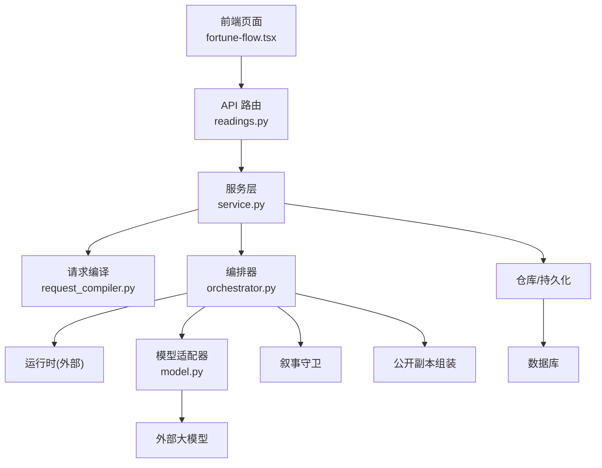
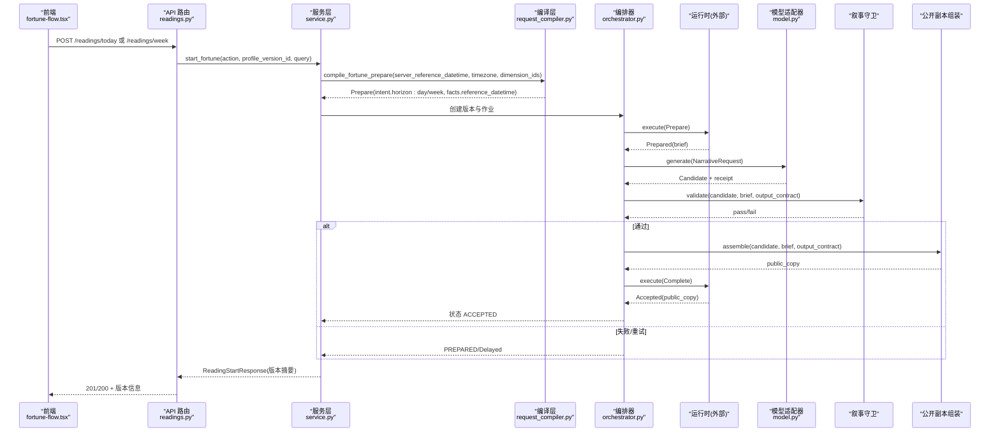
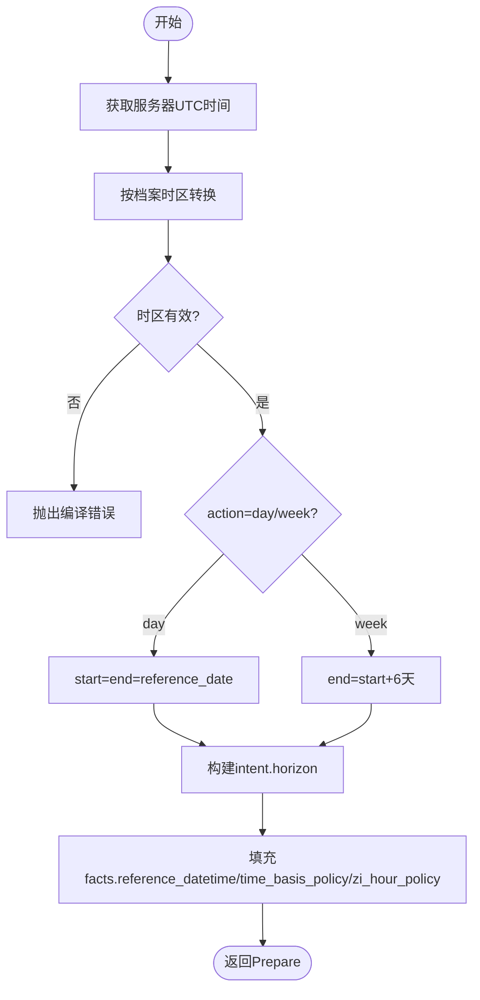
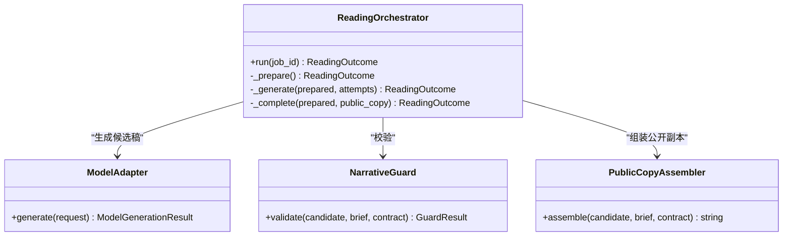
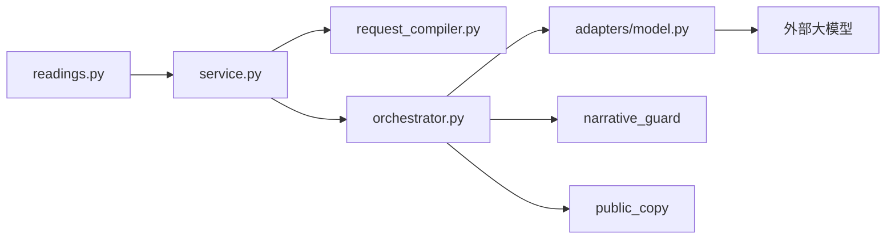

# 运势预测实现

<cite>
**本文引用的文件**
- [backend/app/readings/service.py](file://backend/app/readings/service.py)
- [backend/app/readings/request_compiler.py](file://backend/app/readings/request_compiler.py)
- [backend/app/api/readings.py](file://backend/app/api/readings.py)
- [backend/app/readings/orchestrator.py](file://backend/app/readings/orchestrator.py)
- [backend/app/adapters/model.py](file://backend/app/adapters/model.py)
- [contracts/schemas/mingli-result-v2.schema.json](file://contracts/schemas/mingli-result-v2.schema.json)
- [web/src/components/fortune-flow.tsx](file://web/src/components/fortune-flow.tsx)
- [web/src/lib/reading-display.ts](file://web/src/lib/reading-display.ts)
- [backend/tests/fixtures/mingli/fortune-day-prepare.json](file://backend/tests/fixtures/mingli/fortune-day-prepare.json)
- [backend/tests/fixtures/mingli/fortune-week-prepare.json](file://backend/tests/fixtures/mingli/fortune-week-prepare.json)
</cite>

## 目录
1. [简介](#简介)
2. [项目结构](#项目结构)
3. [核心组件](#核心组件)
4. [架构总览](#架构总览)
5. [详细组件分析](#详细组件分析)
6. [依赖关系分析](#依赖关系分析)
7. [性能与可靠性](#性能与可靠性)
8. [故障排查指南](#故障排查指南)
9. [结论](#结论)
10. [附录：API 规范与前端集成](#附录api-规范与前端集成)

## 简介
本文件面向“运势预测解读”能力，聚焦每日与近七日（一周）运势的完整实现路径：从用户发起请求、服务端时间范围计算与时区标准化、到运行时编排、模型生成与结果组装，再到前端展示。重点说明：
- 时间跨度处理差异：day 与 week 的范围计算策略
- 参考日期标准化与时区约束
- 维度支持：当前仅开放 career（事业）
- 数据生成机制：Prepare/Brief/Candidate/公开副本流水线
- 评分体系与吉凶判断：由运行时与模型产出，服务层不硬编码
- API 接口规范、参数校验与响应结构
- 前端展示组件集成与体验优化建议

## 项目结构
本项目采用分层与领域内聚的组织方式：
- API 层：FastAPI 路由负责鉴权、限流、入参校验与错误映射
- 服务层：ReadingService 负责启动解读、幂等控制、持久化与摘要返回
- 编译层：RequestCompiler 将产品动作转换为 Prepare 命令，完成时间范围与时区标准化
- 编排层：ReadingOrchestrator 驱动运行时执行、模型生成、守卫校验与公共副本组装
- 适配器层：ModelAdapter 对接外部大模型，输出结构化候选稿
- 契约层：JSON Schema 定义运行时协议与结果结构
- 前端：Next.js 页面与组件负责用户交互、调用 API、渲染事实面板与接受正文

图表来源
- [backend/app/api/readings.py:124-195](file://backend/app/api/readings.py#L124-L195)
- [backend/app/readings/service.py:167-204](file://backend/app/readings/service.py#L167-L204)
- [backend/app/readings/request_compiler.py:129-170](file://backend/app/readings/request_compiler.py#L129-L170)
- [backend/app/readings/orchestrator.py:212-248](file://backend/app/readings/orchestrator.py#L212-L248)
- [backend/app/adapters/model.py:200-334](file://backend/app/adapters/model.py#L200-L334)

章节来源
- [backend/app/api/readings.py:124-195](file://backend/app/api/readings.py#L124-L195)
- [backend/app/readings/service.py:167-204](file://backend/app/readings/service.py#L167-L204)
- [backend/app/readings/request_compiler.py:129-170](file://backend/app/readings/request_compiler.py#L129-L170)
- [backend/app/readings/orchestrator.py:212-248](file://backend/app/readings/orchestrator.py#L212-L248)
- [backend/app/adapters/model.py:200-334](file://backend/app/adapters/model.py#L200-L334)

## 核心组件
- 路由层：提供 /readings/today 与 /readings/week 两个入口，统一走 ReadingService.start_fortune
- 服务层：校验 action、构建幂等上下文、加载已确认档案、调用编译层生成 Prepare、持久化并返回版本摘要
- 编译层：根据 action 选择 horizon（day/week），基于服务器时间与档案时区计算 start/end，填充 facts（含 reference_datetime、time_basis_policy、zi_hour_policy）
- 编排层：驱动运行时执行 Prepare，进入 Prepared 后调用模型生成 NarrativeCandidate，经守卫校验与公开副本组装，最终提交 Complete 得到 Accepted
- 模型适配器：构造固定温度与最大 token 的 JSON 对象请求，解析候选稿与用量收据，记录审计
- 契约层：mingli-result-v2.schema.json 定义 prepared/prepared brief/candidate/public copy 等结构

章节来源
- [backend/app/api/readings.py:124-195](file://backend/app/api/readings.py#L124-L195)
- [backend/app/readings/service.py:167-204](file://backend/app/readings/service.py#L167-L204)
- [backend/app/readings/request_compiler.py:129-170](file://backend/app/readings/request_compiler.py#L129-L170)
- [backend/app/readings/orchestrator.py:212-394](file://backend/app/readings/orchestrator.py#L212-L394)
- [backend/app/adapters/model.py:200-334](file://backend/app/adapters/model.py#L200-L334)
- [contracts/schemas/mingli-result-v2.schema.json:328-346](file://contracts/schemas/mingli-result-v2.schema.json#L328-L346)

## 架构总览
下图展示了“今日/近七日运势”从前端到后端再到运行时的端到端流程，包括时间范围计算、准备阶段、模型生成、守卫校验与结果交付。

图表来源
- [backend/app/api/readings.py:124-195](file://backend/app/api/readings.py#L124-L195)
- [backend/app/readings/service.py:167-204](file://backend/app/readings/service.py#L167-L204)
- [backend/app/readings/request_compiler.py:129-170](file://backend/app/readings/request_compiler.py#L129-L170)
- [backend/app/readings/orchestrator.py:212-394](file://backend/app/readings/orchestrator.py#L212-L394)
- [backend/app/adapters/model.py:200-334](file://backend/app/adapters/model.py#L200-L334)

## 详细组件分析

### 时间范围计算、参考日期标准化与时区处理
- 参考时间来源：服务层使用 UTC 当前时间作为 server_reference_datetime，传入编译层
- 时区标准化：编译层将 UTC 时间转换到档案已确认的 timezone；若未带时区或时区无效则抛出编译错误
- 时间跨度：
  - day：start=end=reference_date
  - week：end=start+6 天
- 维度限制：fortune 仅允许 career；若传入其他维度会拒绝
- 时区覆盖保护：不允许客户端覆盖档案已确认的时区

图表来源
- [backend/app/readings/request_compiler.py:62-71](file://backend/app/readings/request_compiler.py#L62-L71)
- [backend/app/readings/request_compiler.py:129-170](file://backend/app/readings/request_compiler.py#L129-L170)
- [backend/app/readings/service.py:167-204](file://backend/app/readings/service.py#L167-L204)

章节来源
- [backend/app/readings/request_compiler.py:62-71](file://backend/app/readings/request_compiler.py#L62-L71)
- [backend/app/readings/request_compiler.py:129-170](file://backend/app/readings/request_compiler.py#L129-L170)
- [backend/app/readings/service.py:167-204](file://backend/app/readings/service.py#L167-L204)

### 运势维度与差异化处理
- 维度：当前仅开放 career（事业）。编译层对维度进行白名单校验，非允许值直接拒绝
- 日 vs 周：
  - 日：horizon.kind_id=day，start=end=当日
  - 周：horizon.kind_id=week，start=end=当日+6天
- 目标对象：near_time_personal（近期个人趋势）
- 能力标识：capability_id=fortune

章节来源
- [backend/app/readings/request_compiler.py:10-13](file://backend/app/readings/request_compiler.py#L10-L13)
- [backend/app/readings/request_compiler.py:74-93](file://backend/app/readings/request_compiler.py#L74-L93)
- [backend/tests/fixtures/mingli/fortune-day-prepare.json:1-29](file://backend/tests/fixtures/mingli/fortune-day-prepare.json#L1-L29)
- [backend/tests/fixtures/mingli/fortune-week-prepare.json:1-29](file://backend/tests/fixtures/mingli/fortune-week-prepare.json#L1-L29)

### 运势数据生成机制（运行时与模型）
- 服务层创建 ReadingVersion 与 Job，设置输出契约与语言、最大尝试次数
- 编排器执行 Prepare，得到 Prepared 与 Brief（包含问题、词汇、事实、证据、发现、声明范围、限制、前序答案、请求视图）
- 模型适配器构造固定 temperature 与 max_tokens 的 JSON 请求，要求返回符合 Candidate Schema 的对象
- 守卫校验候选稿是否符合输出契约与限制
- 通过后将候选稿组装为公开副本，提交 Complete 得到 Accepted

图表来源
- [backend/app/readings/orchestrator.py:178-394](file://backend/app/readings/orchestrator.py#L178-L394)
- [backend/app/adapters/model.py:200-334](file://backend/app/adapters/model.py#L200-L334)

章节来源
- [backend/app/readings/orchestrator.py:212-394](file://backend/app/readings/orchestrator.py#L212-L394)
- [backend/app/adapters/model.py:200-334](file://backend/app/adapters/model.py#L200-L334)
- [contracts/schemas/mingli-result-v2.schema.json:328-346](file://contracts/schemas/mingli-result-v2.schema.json#L328-L346)

### 评分体系、吉凶判断与个性化调整因子
- 评分与吉凶：不在服务层硬编码。Brief 中的 claim_scopes 指定每个维度的 allowed_kind_ids 与 certainty_ceiling_id；模型在生成候选稿时需遵循这些限制与确定性上限
- 个性化调整：facts 中包含 reference_datetime、time_basis_policy、zi_hour_policy、location、gender 等，运行时与模型据此进行命理因素综合分析与趋势预测
- 限制与合规：limits 用于注入免责声明与边界提示，模型不得突破

章节来源
- [contracts/schemas/mingli-result-v2.schema.json:262-309](file://contracts/schemas/mingli-result-v2.schema.json#L262-L309)
- [backend/app/readings/request_compiler.py:129-170](file://backend/app/readings/request_compiler.py#L129-L170)
- [backend/app/adapters/model.py:48-58](file://backend/app/adapters/model.py#L48-L58)

### API 接口规范、参数验证与响应结构
- 今日运势
  - 路径：POST /api/v1/readings/today
  - 请求体：FortuneStartRequest（profile_version_id, query?）
  - 头：Idempotency-Key（可选，8-128字符）
  - 响应：ReadingStartResponse（包含 capability_id=fortune、horizon.kind_id=day、dimension_ids=["career"]）
- 近七日运势
  - 路径：POST /api/v1/readings/week
  - 请求体：同上
  - 响应：ReadingStartResponse（horizon.kind_id=week，end=start+6天）
- 通用字段
  - ReadingHorizon：kind_id/start/end
  - ReadingStatus：input_ready/waiting_input/prepared/completing/accepted/delayed/runtime_unknown/terminal_stopped
- 错误映射
  - 编译错误/能力未暴露 -> 400 Invalid request
  - 幂等冲突 -> 409 Idempotency-Key conflict
  - 资源不存在 -> 404
  - 运行时不可用 -> 503

章节来源
- [backend/app/api/readings.py:124-195](file://backend/app/api/readings.py#L124-L195)
- [backend/app/readings/api_schemas.py:29-34](file://backend/app/readings/api_schemas.py#L29-L34)
- [backend/app/readings/api_schemas.py:76-102](file://backend/app/readings/api_schemas.py#L76-L102)
- [backend/app/readings/api_schemas.py:121-130](file://backend/app/readings/api_schemas.py#L121-L130)

### 前端展示组件集成与用户体验优化
- 入口组件：fortune-flow.tsx 提供“今日/近七日”表单，选择已确认档案版本后发起解读；明确“当前算法范围：事业与工作”，避免界面暗换范围
- 结果展示：reading-display.ts 将服务端返回的 fact panel 转为可读中文，格式化时间、四柱、月令、周期标记等；对敏感键做过滤，避免泄露内部字段
- 体验优化建议
  - 明确告知“日期范围由服务端确认”，减少前端自行推算带来的歧义
  - 对等待输入状态（waiting_input）提供清晰引导与最小必填项提示
  - 对延迟/失败状态提供重试与反馈
  - 对周期标记（period_markers）与目标周期（target_period）进行高亮展示，帮助用户理解时间粒度

章节来源
- [web/src/components/fortune-flow.tsx:23-136](file://web/src/components/fortune-flow.tsx#L23-L136)
- [web/src/lib/reading-display.ts:19-36](file://web/src/lib/reading-display.ts#L19-L36)
- [web/src/lib/reading-display.ts:119-157](file://web/src/lib/reading-display.ts#L119-L157)
- [web/src/lib/reading-display.ts:257-298](file://web/src/lib/reading-display.ts#L257-L298)
- [web/src/lib/reading-display.ts:467-571](file://web/src/lib/reading-display.ts#L467-L571)

## 依赖关系分析
- 路由依赖服务层，服务层依赖编译层与仓库；编排器依赖运行时、模型、守卫与组装器
- 编译层依赖产品路线与能力策略，确保只允许 fortune 能力下的 day/week 范围
- 模型适配器依赖外部大模型，严格限制 base_url、temperature、max_tokens，并记录用量与成本
- 契约层贯穿全流程，保证 Prepare/Brief/Candidate/Public Copy 的结构一致性

图表来源
- [backend/app/api/readings.py:124-195](file://backend/app/api/readings.py#L124-L195)
- [backend/app/readings/service.py:167-204](file://backend/app/readings/service.py#L167-L204)
- [backend/app/readings/request_compiler.py:129-170](file://backend/app/readings/request_compiler.py#L129-L170)
- [backend/app/readings/orchestrator.py:212-394](file://backend/app/readings/orchestrator.py#L212-L394)
- [backend/app/adapters/model.py:200-334](file://backend/app/adapters/model.py#L200-L334)

章节来源
- [backend/app/api/readings.py:124-195](file://backend/app/api/readings.py#L124-L195)
- [backend/app/readings/service.py:167-204](file://backend/app/readings/service.py#L167-L204)
- [backend/app/readings/request_compiler.py:129-170](file://backend/app/readings/request_compiler.py#L129-L170)
- [backend/app/readings/orchestrator.py:212-394](file://backend/app/readings/orchestrator.py#L212-L394)
- [backend/app/adapters/model.py:200-334](file://backend/app/adapters/model.py#L200-L334)

## 性能与可靠性
- 幂等性：通过 Idempotency-Key 与服务端指纹防止重复提交
- 重试与退避：Prepare/Complete 传输失败时设置 retry_not_before，避免雪崩
- 最大尝试次数：模型生成最多尝试两次，超过则延迟并告警
- 超时与限流：模型调用设置连接/读取/整体超时；API 层对用户写入速率限制
- 审计与可观测：模型调用收据记录 provider、模型版本、token 用量与成本

章节来源
- [backend/app/readings/service.py:552-620](file://backend/app/readings/service.py#L552-L620)
- [backend/app/readings/orchestrator.py:187-194](file://backend/app/readings/orchestrator.py#L187-L194)
- [backend/app/readings/orchestrator.py:301-394](file://backend/app/readings/orchestrator.py#L301-L394)
- [backend/app/adapters/model.py:149-195](file://backend/app/adapters/model.py#L149-L195)
- [backend/app/adapters/model.py:291-334](file://backend/app/adapters/model.py#L291-L334)

## 故障排查指南
- 编译错误：检查 dimension_ids 是否在允许集合、timezone 是否合法、server_reference_datetime 是否带时区
- 运行时未知：Prepare 传输失败且无 state_token 时，状态置为 runtime_unknown，需重试或降级
- 模型错误：关注 error_code（如 model_rate_limited、model_upstream_error、model_invalid_response），结合收据定位
- 守卫拒绝：记录 guard errors 与 attempt_number，必要时调整输出契约或提示
- 幂等冲突：确认 Idempotency-Key 与 action/payload 一致

章节来源
- [backend/app/readings/request_compiler.py:62-71](file://backend/app/readings/request_compiler.py#L62-L71)
- [backend/app/readings/orchestrator.py:250-285](file://backend/app/readings/orchestrator.py#L250-L285)
- [backend/app/adapters/model.py:250-334](file://backend/app/adapters/model.py#L250-L334)
- [backend/app/api/readings.py:67-84](file://backend/app/api/readings.py#L67-L84)

## 结论
本项目以“编译-编排-模型-守卫-组装”的清晰流水线实现了每日与近七日运势预测。关键特性包括：
- 严格的时间范围与时区标准化，确保跨地域一致性
- 维度白名单与能力策略，保障功能可控扩展
- 以契约为中心的产物结构，便于前后端稳定协作
- 完善的幂等、重试、超时与审计机制，提升可靠性
- 前端以事实面板与公开副本为核心，提供友好且安全的展示

## 附录：API 规范与前端集成

### 接口清单
- POST /api/v1/readings/today
  - 请求体：{ profile_version_id, query? }
  - 响应：ReadingStartResponse（capability_id=fortune, horizon.kind_id=day）
- POST /api/v1/readings/week
  - 请求体：同上
  - 响应：ReadingStartResponse（capability_id=fortune, horizon.kind_id=week）
- GET /api/v1/readings/{version}
  - 响应：ReadingStartResponse（查询版本状态与范围）
- GET /api/v1/readings/{version}/result
  - 响应：ReadingResultResponse（status, accepted_copy, fact_panel, verification, input_request）

### 请求参数验证要点
- profile_version_id 必须存在且属于当前所有者
- query 可选，长度限制
- Idempotency-Key 可选，长度 8-128
- 时区与时间口径来自已确认档案，禁止覆盖

### 响应数据结构要点
- ReadingHorizon：kind_id/start/end
- ReadingStatus：input_ready/waiting_input/prepared/completing/accepted/delayed/runtime_unknown/terminal_stopped
- ReadingFactPanel：question/vocabulary/facts/evidence/findings/claim_scopes/limits/prior_answer/request_view
- ReadingResultResponse：reading_version_id/status/accepted_copy/fact_panel/verification/input_request

章节来源
- [backend/app/api/readings.py:124-195](file://backend/app/api/readings.py#L124-L195)
- [backend/app/readings/api_schemas.py:29-34](file://backend/app/readings/api_schemas.py#L29-L34)
- [backend/app/readings/api_schemas.py:76-130](file://backend/app/readings/api_schemas.py#L76-L130)
- [contracts/schemas/mingli-result-v2.schema.json:262-346](file://contracts/schemas/mingli-result-v2.schema.json#L262-L346)