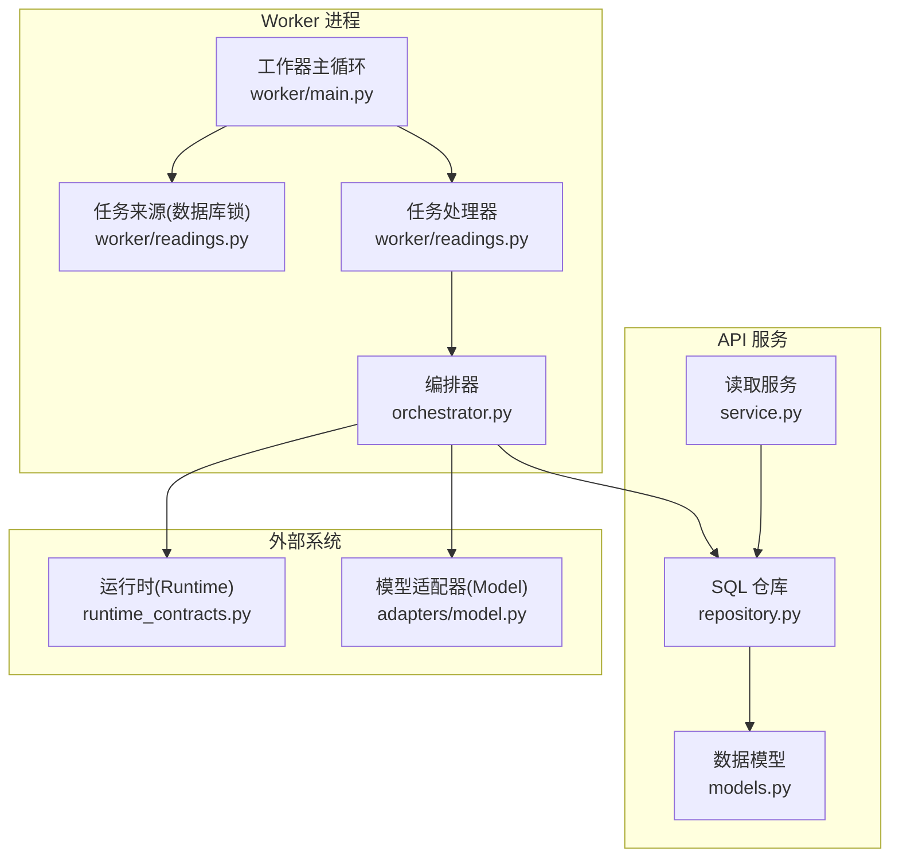
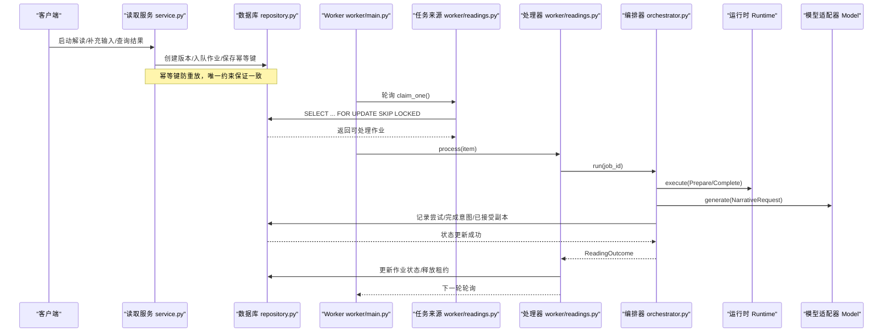
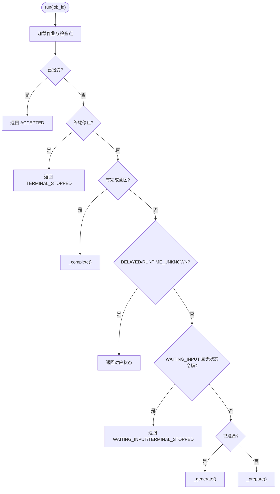
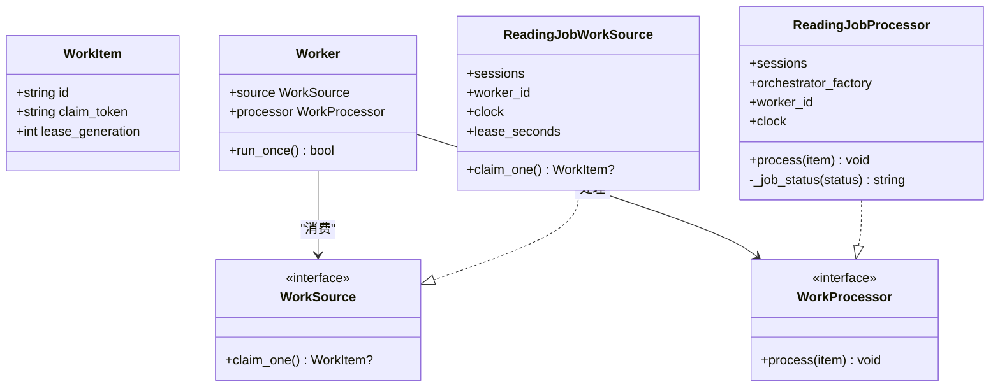
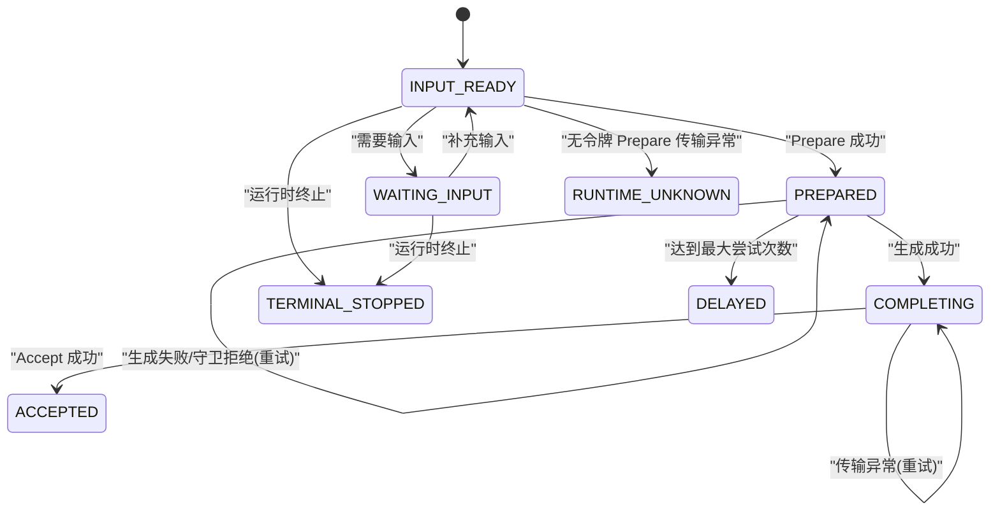
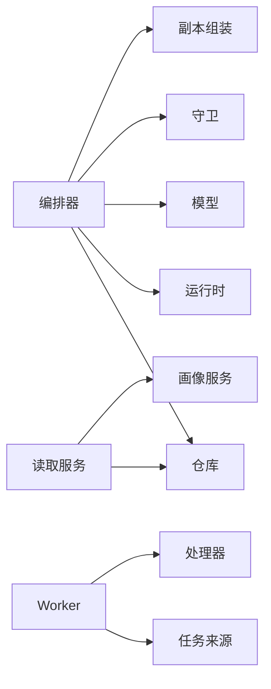

# 解读编排器

<cite>
**本文引用的文件**   
- [backend/app/readings/orchestrator.py](file://backend/app/readings/orchestrator.py)
- [backend/worker/readings.py](file://backend/worker/readings.py)
- [backend/worker/main.py](file://backend/worker/main.py)
- [backend/app/readings/service.py](file://backend/app/readings/service.py)
- [backend/app/readings/repository.py](file://backend/app/readings/repository.py)
- [backend/app/readings/models.py](file://backend/app/readings/models.py)
- [backend/app/readings/status.py](file://backend/app/readings/status.py)
- [backend/app/readings/errors.py](file://backend/app/readings/errors.py)
- [backend/app/config.py](file://backend/app/config.py)
</cite>

## 目录
1. [简介](#简介)
2. [项目结构](#项目结构)
3. [核心组件](#核心组件)
4. [架构总览](#架构总览)
5. [详细组件分析](#详细组件分析)
6. [依赖关系分析](#依赖关系分析)
7. [性能与并发](#性能与并发)
8. [故障恢复与重试](#故障恢复与重试)
9. [幂等性与一致性](#幂等性与一致性)
10. [配置选项与监控指标](#配置选项与监控指标)
11. [排错指南](#排错指南)
12. [结论](#结论)

## 简介
本文件面向“命理解读编排器”的完整技术文档，聚焦于解读任务的编排流程、状态机、异步任务处理、结果生成与持久化策略、幂等性控制、并发安全、重试与超时、以及故障转移。读者可据此理解从用户发起请求到最终接受结果的端到端过程，并掌握 Worker 进程通信、任务队列管理、以及关键错误恢复机制。

## 项目结构
后端采用模块化单体架构：API 服务负责创建解读版本与入队；Worker 进程通过数据库作为分布式队列进行任务拉取与执行；编排器协调运行时（Runtime）与模型（Model），完成准备、生成、校验、组装公开副本、提交并接受结果。

**图表来源**
- [backend/app/readings/service.py:117-513](file://backend/app/readings/service.py#L117-L513)
- [backend/app/readings/repository.py:200-224](file://backend/app/readings/repository.py#L200-L224)
- [backend/worker/main.py:57-79](file://backend/worker/main.py#L57-L79)
- [backend/worker/readings.py:108-161](file://backend/worker/readings.py#L108-L161)
- [backend/worker/readings.py:164-231](file://backend/worker/readings.py#L164-L231)
- [backend/app/readings/orchestrator.py:178-450](file://backend/app/readings/orchestrator.py#L178-L450)

**章节来源**
- [backend/app/readings/service.py:117-513](file://backend/app/readings/service.py#L117-L513)
- [backend/worker/readings.py:108-231](file://backend/worker/readings.py#L108-L231)
- [backend/worker/main.py:57-79](file://backend/worker/main.py#L57-L79)
- [backend/app/readings/orchestrator.py:178-450](file://backend/app/readings/orchestrator.py#L178-L450)

## 核心组件
- 编排器 ReadingOrchestrator：驱动解读生命周期，维护状态机，协调 Runtime 与 Model，记录检查点与结果。
- Worker 工作器：基于数据库的任务队列，实现任务领取、租约锁定、失败重试与超时恢复。
- 读取服务 ReadingService：创建解读版本、入队任务、输入补充、幂等键控制、结果查询。
- SQL 仓库 SqlReadingRepository：持久化所有中间态、尝试记录、已接受副本、事实摘要等。
- 数据模型：定义解读根、版本、作业、尝试、已接受副本、验证等表结构与约束。
- 状态枚举 ReadingStatus：定义解读生命周期的全部状态。
- 错误类型：区分传输错误、模型错误、不变量错误等。

**章节来源**
- [backend/app/readings/orchestrator.py:43-189](file://backend/app/readings/orchestrator.py#L43-L189)
- [backend/worker/readings.py:108-231](file://backend/worker/readings.py#L108-L231)
- [backend/app/readings/service.py:117-513](file://backend/app/readings/service.py#L117-L513)
- [backend/app/readings/repository.py:51-800](file://backend/app/readings/repository.py#L51-L800)
- [backend/app/readings/models.py:28-378](file://backend/app/readings/models.py#L28-L378)
- [backend/app/readings/status.py:1-13](file://backend/app/readings/status.py#L1-L13)
- [backend/app/readings/errors.py:1-30](file://backend/app/readings/errors.py#L1-L30)

## 架构总览
解读任务从 API 服务开始，创建版本并写入作业表；Worker 周期性轮询数据库，使用行级锁与租约机制领取任务；编排器根据当前检查点决定下一步动作：准备、生成、完成或终止；结果经校验与组装后持久化，最终进入已接受状态。

**图表来源**
- [backend/app/readings/service.py:129-513](file://backend/app/readings/service.py#L129-L513)
- [backend/worker/readings.py:63-161](file://backend/worker/readings.py#L63-L161)
- [backend/worker/readings.py:175-231](file://backend/worker/readings.py#L175-L231)
- [backend/app/readings/orchestrator.py:212-450](file://backend/app/readings/orchestrator.py#L212-L450)

## 详细组件分析

### 编排器 ReadingOrchestrator
- 职责：加载作业与检查点，依据状态机推进流程；调用运行时执行 Prepare/Complete；调用模型生成候选文本；守卫校验；组装公开副本；记录尝试与结果；处理传输异常与延迟重试。
- 关键数据结构：
  - ReadingJob：作业元信息（准备命令、策略版本、输出契约、语言、最大输出字符、最大尝试次数）。
  - ReadingCheckpoint：检查点（状态、等待输入、终端停止、已准备、尝试计数、完成副本、已接受）。
  - ReadingOutcome：运行结果（状态、公开副本、输入请求、停止原因、重试时间、提交后取消标志）。
- 状态机推进：
  - 若已接受则直接返回。
  - 若终端停止则返回对应状态。
  - 若存在完成意图且已准备则进入完成阶段。
  - 若处于延迟或运行时未知则返回相应状态。
  - 若等待输入且无状态令牌则视为停止。
  - 若已准备则进入生成阶段。
  - 否则进入准备阶段。
- 准备阶段 _prepare：
  - 调用运行时执行 Prepare。
  - 若传输异常且带状态令牌则延迟重试；若无令牌则标记运行时未知并告警。
  - 若返回 Prepared 则记录并进入 PREPARED。
  - 若返回 Stopped 则记录等待输入或终端停止。
- 生成阶段 _generate：
  - 构造 NarrativeRequest，限制最大尝试次数。
  - 调用模型生成候选，关闭引用，守卫校验。
  - 若通过守卫则组装公开副本；若失败则记录尝试错误。
  - 若达到最大尝试次数则标记 DELAYED 并告警。
  - 若成功则记录成功尝试与完成意图，进入 COMPLETING。
- 完成阶段 _complete：
  - 调用运行时执行 Complete，携带 state_token 与 public_copy。
  - 若传输异常则延迟重试（已完成意图已持久化，确保幂等）。
  - 若 Accepted 则校验 token 与副本一致性，记录已接受并返回 ACCEPTED。
  - 若 Stopped 则记录终端停止。
- 告警与成本：
  - 守卫拒绝、延迟、运行时未知、模型成本等事件通过 AlertSink 上报。

**图表来源**
- [backend/app/readings/orchestrator.py:212-248](file://backend/app/readings/orchestrator.py#L212-L248)
- [backend/app/readings/orchestrator.py:250-285](file://backend/app/readings/orchestrator.py#L250-L285)
- [backend/app/readings/orchestrator.py:287-394](file://backend/app/readings/orchestrator.py#L287-L394)
- [backend/app/readings/orchestrator.py:396-435](file://backend/app/readings/orchestrator.py#L396-L435)

**章节来源**
- [backend/app/readings/orchestrator.py:43-189](file://backend/app/readings/orchestrator.py#L43-L189)
- [backend/app/readings/orchestrator.py:212-450](file://backend/app/readings/orchestrator.py#L212-L450)

### Worker 任务队列与并发安全
- 任务来源 ReadingJobWorkSource：
  - 使用 SELECT ... WITH FOR UPDATE SKIP LOCKED 获取下一个可处理作业。
  - 支持过期租约回收：claimed 且 lease_expires_at 过期的作业会被重新认领。
  - 对无状态令牌的 Prepare 过期场景，将版本状态置为 RUNTIME_UNKNOWN，避免重复创建未知 Root。
  - 发放租约：设置 lease_owner、lease_token、lease_generation、lease_expires_at。
- 任务处理器 ReadingJobProcessor：
  - 在事务中校验当前租约是否仍有效（owner/token/generation/expiry）。
  - 调用编排器 run，得到 Outcome。
  - 根据 Outcome 计算作业新状态与 available_at（支持 retry_not_before）。
  - 使用条件更新释放租约，若更新失败则抛出 LeaseLostError。
  - 若 Outcome 指示提交后取消，则抛出 CancelledError 以中断后续逻辑。
- 工作器主循环 Worker：
  - 周期轮询 claim_one，若无任务则休眠 poll_interval。
  - 支持 --once 单次执行与 --poll-interval 参数。

**图表来源**
- [backend/worker/main.py:10-79](file://backend/worker/main.py#L10-L79)
- [backend/worker/readings.py:108-161](file://backend/worker/readings.py#L108-L161)
- [backend/worker/readings.py:164-231](file://backend/worker/readings.py#L164-L231)

**章节来源**
- [backend/worker/readings.py:63-161](file://backend/worker/readings.py#L63-L161)
- [backend/worker/readings.py:175-231](file://backend/worker/readings.py#L175-L231)
- [backend/worker/main.py:57-79](file://backend/worker/main.py#L57-L79)

### 读取服务与幂等性
- 启动解读 start_preview/start_fortune/start_liuyao：
  - 构建 Prepare 命令，创建 ReadingRoot 与 ReadingVersion，加密存储 prepare 指令。
  - 创建作业 ReadingJobRecord 入队。
  - 若提供幂等键，则保存幂等记录并支持重放。
- 补充输入 supply_input：
  - 校验版本处于 waiting_input，加载 last_result 中的 input_request。
  - 映射并验证输入值，替换 facts，更新 prepare 并重置 last_result。
  - 重新入队作业。
- 幂等键 IdempotencyKey：
  - 通过 HMAC 哈希 key_hash 与 request_fingerprint 唯一标识一次操作。
  - 唯一约束防止同一 owner 下重复使用相同 key_hash。
  - 冲突时抛出 IdempotencyConflictError。

**章节来源**
- [backend/app/readings/service.py:129-513](file://backend/app/readings/service.py#L129-L513)
- [backend/app/readings/service.py:552-620](file://backend/app/readings/service.py#L552-L620)
- [backend/app/readings/models.py:294-338](file://backend/app/readings/models.py#L294-L338)

### 结果生成、验证与持久化
- 生成：
  - 编排器调用模型生成 NarrativeCandidate，关闭引用，记录 receipt。
- 验证：
  - 守卫 NarrativeGuard.validate 校验候选是否符合输出契约与业务规则。
  - 若失败则记录 guard_errors 并可能重试或延迟。
- 组装：
  - PublicCopyAssembler 将候选组装为公开副本字符串。
  - 若组装失败则记录错误并回退到尝试记录。
- 持久化：
  - 每次尝试记录 GenerationAttempt（含候选、错误、receipt）。
  - 成功尝试记录 CompletedIntent（加密存储 public_copy）。
  - 运行时 Accept 成功后记录 AcceptedCopy（加密存储 accepted copy 与 digest）。
  - 所有敏感数据通过 EnvelopeCipher 加密存储，字段完整性由 digest 校验。

**章节来源**
- [backend/app/readings/orchestrator.py:287-394](file://backend/app/readings/orchestrator.py#L287-L394)
- [backend/app/readings/repository.py:616-716](file://backend/app/readings/repository.py#L616-L716)
- [backend/app/readings/models.py:188-245](file://backend/app/readings/models.py#L188-L245)

### 生命周期状态机

**图表来源**
- [backend/app/readings/status.py:1-13](file://backend/app/readings/status.py#L1-L13)
- [backend/app/readings/orchestrator.py:212-450](file://backend/app/readings/orchestrator.py#L212-L450)
- [backend/app/readings/repository.py:718-730](file://backend/app/readings/repository.py#L718-L730)

## 依赖关系分析
- 编排器依赖：
  - Repository：读写作业、版本、尝试、已接受副本等。
  - RuntimePort：执行 Prepare/Complete。
  - NarrativeModelPort：生成候选。
  - NarrativeGuardPort：校验候选。
  - PublicCopyAssemblerPort：组装公开副本。
  - Clock：时间源用于重试与日志。
  - AlertSink：告警上报。
- Worker 依赖：
  - Database sessions：事务与行级锁。
  - EnvelopeCipher：内容加密。
  - Settings：环境与安全策略。
- 服务层依赖：
  - ProfileService：读取用户画像版本。
  - Repository：创建根、版本、作业、幂等键等。

**图表来源**
- [backend/app/readings/orchestrator.py:178-189](file://backend/app/readings/orchestrator.py#L178-L189)
- [backend/worker/readings.py:234-286](file://backend/worker/readings.py#L234-L286)
- [backend/app/readings/service.py:117-128](file://backend/app/readings/service.py#L117-L128)

**章节来源**
- [backend/app/readings/orchestrator.py:178-189](file://backend/app/readings/orchestrator.py#L178-L189)
- [backend/worker/readings.py:234-286](file://backend/worker/readings.py#L234-L286)
- [backend/app/readings/service.py:117-128](file://backend/app/readings/service.py#L117-L128)

## 性能与并发
- 数据库锁与租约：
  - 使用 with_for_update(skip_locked=True) 避免争用，提高吞吐。
  - 租约包含 owner、token、generation、expires_at，确保单实例独占处理。
- 重试与退避：
  - Prepare/Complete 传输异常时设置 retry_not_before，按 backoff 延迟重试。
  - 生成阶段达到最大尝试次数后标记 DELAYED，避免无限重试。
- 超时控制：
  - 运行时超时由 Settings.runtime_timeout_seconds 控制。
  - 模型超时由 model_connect/read/overall 超时与响应大小限制控制。
- 资源限制：
  - 模型最大响应字节、温度、输出 token 数均受配置约束。
  - 运行时 stdin/stdout/stderr 大小限制防止资源滥用。

**章节来源**
- [backend/worker/readings.py:63-161](file://backend/worker/readings.py#L63-L161)
- [backend/app/readings/orchestrator.py:187-194](file://backend/app/readings/orchestrator.py#L187-L194)
- [backend/app/config.py:84-121](file://backend/app/config.py#L84-L121)
- [backend/app/config.py:253-291](file://backend/app/config.py#L253-L291)

## 故障恢复与重试
- 运行时传输异常：
  - Prepare 阶段：若有状态令牌则延迟重试；若无令牌则标记 RUNTIME_UNKNOWN 并告警。
  - Complete 阶段：已完成意图已持久化，延迟重试确保幂等提交。
- 模型生成失败：
  - 记录尝试与错误，若未达最大尝试次数则继续重试；否则标记 DELAYED。
- 租约失效：
  - 处理器在提交前校验租约，若失效则抛出 LeaseLostError，交由上层重试。
- 取消与恢复：
  - 若编排器指示 cancel_after_commit，则抛出 CancelledError，Worker 捕获后结束本轮处理。

**章节来源**
- [backend/app/readings/orchestrator.py:250-285](file://backend/app/readings/orchestrator.py#L250-L285)
- [backend/app/readings/orchestrator.py:396-435](file://backend/app/readings/orchestrator.py#L396-L435)
- [backend/worker/readings.py:175-218](file://backend/worker/readings.py#L175-L218)

## 幂等性与一致性
- 幂等键：
  - 通过 HMAC 哈希 key_hash 与 request_fingerprint 唯一标识一次操作。
  - 唯一约束保证同一 owner 下幂等键不重复。
  - 重放时返回已有版本摘要，避免重复创建。
- 首次写入获胜：
  - AcceptedCopy 首次写入后不可更改，后续重复提交会返回已有副本。
- 不可变记录：
  - FactBrief、GenerationAttempt、AcceptedCopy 等记录禁止更新，仅追加。
- 状态一致性：
  - 版本状态与作业状态同步更新，确保状态机推进一致。

**章节来源**
- [backend/app/readings/service.py:552-620](file://backend/app/readings/service.py#L552-L620)
- [backend/app/readings/repository.py:674-716](file://backend/app/readings/repository.py#L674-L716)
- [backend/app/readings/models.py:370-378](file://backend/app/readings/models.py#L370-L378)

## 配置选项与监控指标
- 运行时配置：
  - runtime_adapter：fake/one-shot。
  - runtime_timeout_seconds：运行时超时。
  - runtime_max_stdin/stdout/stderr_bytes：I/O 限制。
- 模型配置：
  - model_adapter：fake/deepseek。
  - model_provider/profile_id/id/base_url/endpoint_path/thinking_mode。
  - model_connect/read/overall_timeout_seconds：超时限制。
  - model_max_response_bytes：响应大小限制。
  - model_temperature/max_output_tokens：生成参数。
  - deepseek_api_key：API 密钥。
  - model_price_snapshot_version/currency/input/output_price_microunits_per_million_tokens：成本快照与计价。
- 安全与生产约束：
  - production 环境强制 secure cookie、禁用 fake OTP/Runtime/Model。
  - 固定路径与 manifest digest 校验。
  - real_traffic_enabled 需配合 alert_sink_enabled。
- 监控指标（告警事件）：
  - runtime_unknown：运行时未知。
  - guard_rejection：守卫拒绝。
  - delayed：达到最大尝试次数。
  - model_cost：模型调用成本与提供者信息。

**章节来源**
- [backend/app/config.py:84-121](file://backend/app/config.py#L84-L121)
- [backend/app/config.py:188-329](file://backend/app/config.py#L188-L329)
- [backend/app/readings/orchestrator.py:196-210](file://backend/app/readings/orchestrator.py#L196-L210)
- [backend/app/readings/orchestrator.py:323-393](file://backend/app/readings/orchestrator.py#L323-L393)

## 排错指南
- 常见问题定位：
  - 运行时未知：检查 Prepare 是否带状态令牌，确认运行时可用性与超时配置。
  - 守卫拒绝：查看 guard_errors 列表，调整输出契约或候选质量。
  - 达到最大尝试次数：评估模型稳定性与提示词质量，必要时增加 max_attempts。
  - 租约失效：检查 Worker 实例数量与数据库连接池，避免并发竞争。
  - 幂等键冲突：确认客户端幂等键唯一性与作用域。
- 日志与告警：
  - 启用 alert_sink_enabled 收集 runtime_unknown、guard_rejection、delayed、model_cost。
  - 结合 log_level 调整日志级别，便于问题追踪。

**章节来源**
- [backend/app/readings/orchestrator.py:196-210](file://backend/app/readings/orchestrator.py#L196-L210)
- [backend/app/readings/orchestrator.py:323-393](file://backend/app/readings/orchestrator.py#L323-L393)
- [backend/app/config.py:146-148](file://backend/app/config.py#L146-L148)

## 结论
解读编排器通过明确的状态机、严格的检查点与持久化策略、数据库驱动的分布式任务队列、以及完善的幂等与并发控制，实现了高可靠、可恢复、可扩展的命理解读流水线。其设计将运行时与模型解耦，借助守卫与副本组装保障输出质量，并通过告警与配置约束提升可观测性与安全性。在生产环境中，应严格遵循配置安全策略，合理设置超时与重试参数，持续监控告警指标，确保系统稳定运行。