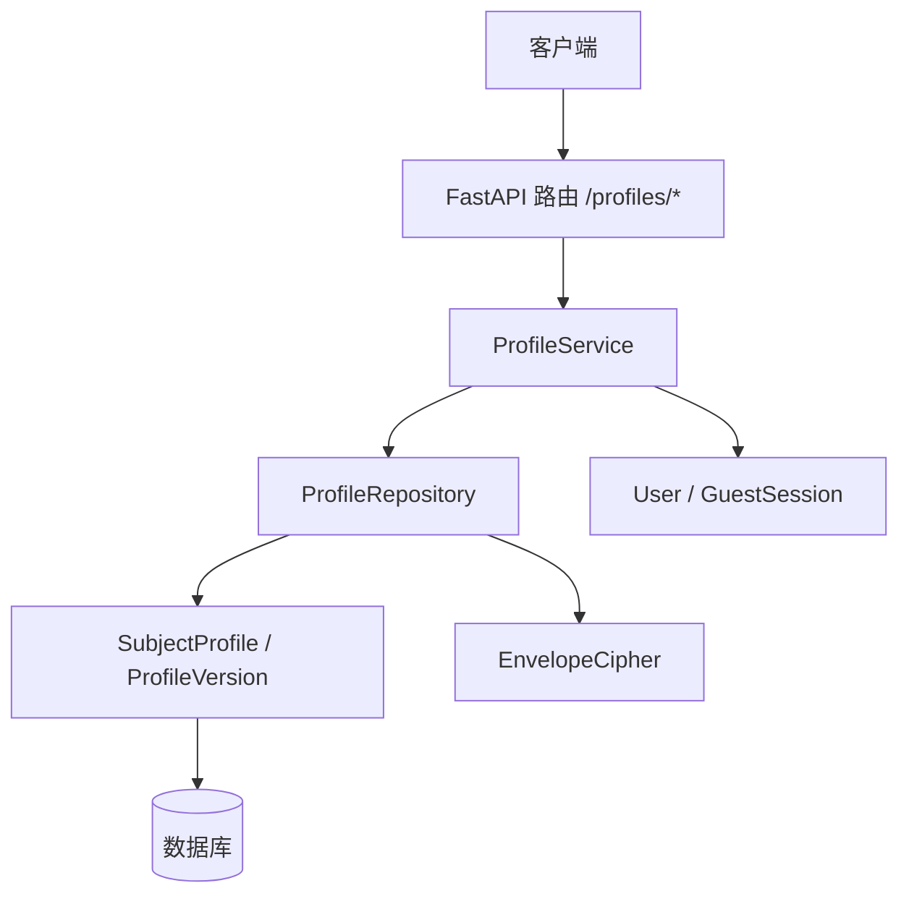
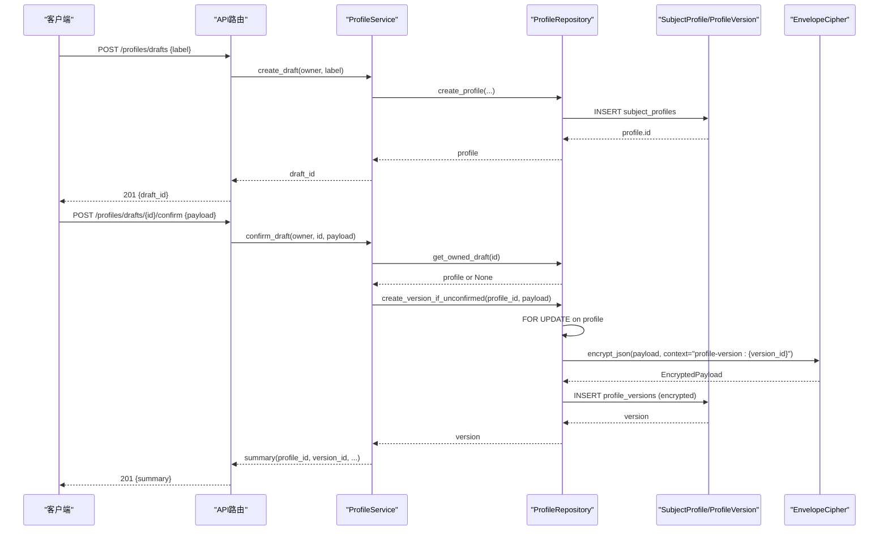
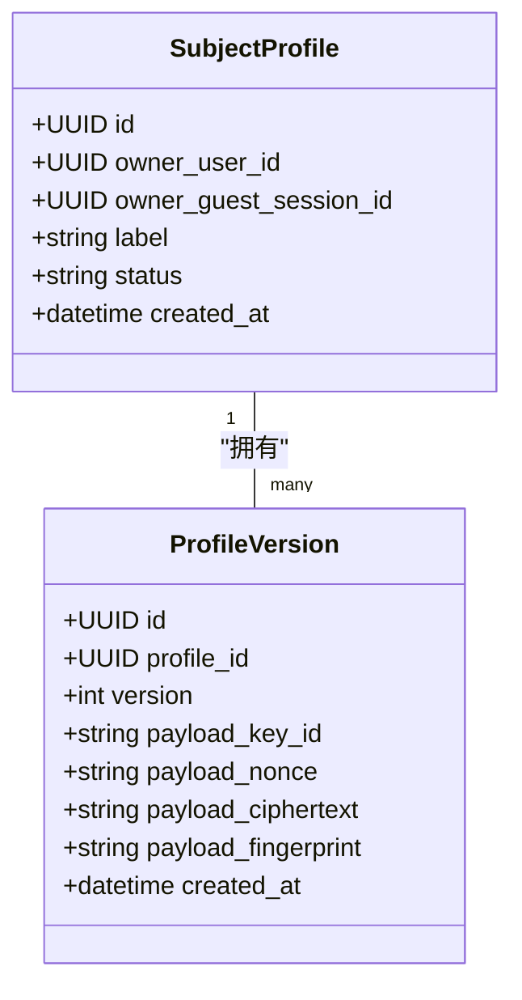
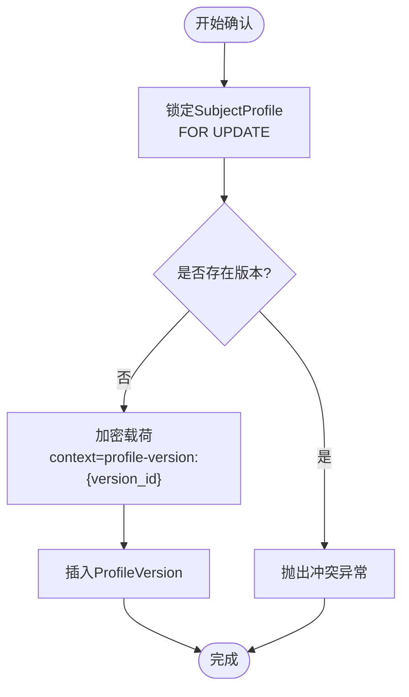
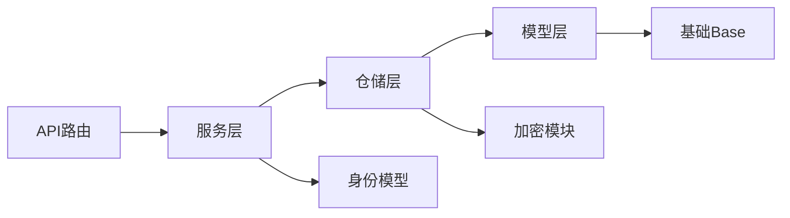

# 用户档案模块

<cite>
**本文引用的文件**
- [backend/app/profiles/models.py](file://backend/app/profiles/models.py)
- [backend/app/profiles/schemas.py](file://backend/app/profiles/schemas.py)
- [backend/app/profiles/service.py](file://backend/app/profiles/service.py)
- [backend/app/profiles/repository.py](file://backend/app/profiles/repository.py)
- [backend/app/api/profiles.py](file://backend/app/api/profiles.py)
- [backend/app/security/envelope.py](file://backend/app/security/envelope.py)
- [backend/app/persistence.py](file://backend/app/persistence.py)
- [backend/app/identity/models.py](file://backend/app/identity/models.py)
- [backend/alembic/versions/0002_profiles_and_readings.py](file://backend/alembic/versions/0002_profiles_and_readings.py)
- [backend/tests/test_profiles_api.py](file://backend/tests/test_profiles_api.py)
- [web/src/lib/api.ts](file://web/src/lib/api.ts)
- [web/src/components/profile-archive.tsx](file://web/src/components/profile-archive.tsx)
</cite>

## 目录
1. [简介](#简介)
2. [项目结构](#项目结构)
3. [核心组件](#核心组件)
4. [架构总览](#架构总览)
5. [详细组件分析](#详细组件分析)
6. [依赖关系分析](#依赖关系分析)
7. [性能考虑](#性能考虑)
8. [故障排查指南](#故障排查指南)
9. [结论](#结论)
10. [附录](#附录)

## 简介
本模块提供“用户档案”的完整生命周期管理：创建草稿、确认并生成不可变版本、列出与查询最新版本、以及访客会话认领。数据模型采用“主体档案 + 不可变版本”的设计，敏感字段以信封加密存储，并通过数据库约束和ORM事件确保一致性、安全与可追溯性。API层提供受CSRF保护与速率限制的写入接口，列表接口返回最小化摘要，避免泄露隐私信息。

## 项目结构
- 后端分层
  - API路由：定义HTTP端点、鉴权、限流与响应标记
  - 服务层：编排业务用例（创建草稿、确认、列出、访客认领）
  - 仓储层：封装SQLAlchemy查询、行级锁、加解密与持久化
  - 模型层：定义表结构与不变性约束
  - 安全层：信封加密（AES-GCM + HMAC指纹）
  - 身份模型：用户、访客会话等基础实体
  - 迁移脚本：数据库表结构与约束初始化
- 前端
  - API类型定义与调用封装
  - 档案归档页面：列表展示、错误处理与重试

图表来源
- [backend/app/api/profiles.py:43-111](file://backend/app/api/profiles.py#L43-L111)
- [backend/app/profiles/service.py:44-189](file://backend/app/profiles/service.py#L44-L189)
- [backend/app/profiles/repository.py:22-198](file://backend/app/profiles/repository.py#L22-L198)
- [backend/app/profiles/models.py:21-79](file://backend/app/profiles/models.py#L21-L79)
- [backend/app/security/envelope.py:32-122](file://backend/app/security/envelope.py#L32-L122)
- [backend/app/identity/models.py:31-132](file://backend/app/identity/models.py#L31-L132)

章节来源
- [backend/app/api/profiles.py:43-111](file://backend/app/api/profiles.py#L43-L111)
- [backend/app/profiles/service.py:44-189](file://backend/app/profiles/service.py#L44-L189)
- [backend/app/profiles/repository.py:22-198](file://backend/app/profiles/repository.py#L22-L198)
- [backend/app/profiles/models.py:21-79](file://backend/app/profiles/models.py#L21-L79)
- [backend/app/security/envelope.py:32-122](file://backend/app/security/envelope.py#L32-L122)
- [backend/app/identity/models.py:31-132](file://backend/app/identity/models.py#L31-L132)

## 核心组件
- 数据模型
  - SubjectProfile：主体档案，拥有唯一所有者（用户或访客会话之一），包含标签、状态与时间戳
  - ProfileVersion：不可变版本记录，保存加密后的命盘数据载荷，具备版本号与指纹校验
- 服务与仓储
  - ProfileService：对外暴露用例方法，负责权限归属转换、异常映射与结果组装
  - ProfileRepository：实现并发安全的版本分配、载荷加解密、最新快照查询
- 安全与持久化
  - EnvelopeCipher：基于AES-GCM与HMAC指纹的信封加密，支持JSON序列化与上下文绑定
  - ImmutableRecordError：用于拦截对不可变记录的更新尝试
- 迁移与约束
  - Alembic迁移：创建subject_profiles与profile_versions表及外键、唯一约束
  - 检查约束：owner_exactly_one保证所有者互斥

章节来源
- [backend/app/profiles/models.py:21-79](file://backend/app/profiles/models.py#L21-L79)
- [backend/app/profiles/repository.py:22-198](file://backend/app/profiles/repository.py#L22-L198)
- [backend/app/security/envelope.py:32-122](file://backend/app/security/envelope.py#L32-L122)
- [backend/app/persistence.py:1-3](file://backend/app/persistence.py#L1-L3)
- [backend/alembic/versions/0002_profiles_and_readings.py:28-60](file://backend/alembic/versions/0002_profiles_and_readings.py#L28-L60)

## 架构总览
- 请求路径
  - POST /api/v1/profiles/drafts：创建草稿
  - POST /api/v1/profiles/drafts/{draft_id}/confirm：确认草稿并生成不可变版本
  - GET /api/v1/profiles：列出当前所有者的最新档案版本摘要
- 关键流程
  - 创建草稿：校验CSRF与速率限制，持久化SubjectProfile
  - 确认草稿：行级锁+重入检查，生成加密版本，返回最小摘要
  - 列出档案：仅返回非敏感摘要，禁止缓存
  - 访客认领：原子转移SubjectProfile与相关资源所有权至已验证用户

图表来源
- [backend/app/api/profiles.py:43-111](file://backend/app/api/profiles.py#L43-L111)
- [backend/app/profiles/service.py:52-113](file://backend/app/profiles/service.py#L52-L113)
- [backend/app/profiles/repository.py:27-104](file://backend/app/profiles/repository.py#L27-L104)
- [backend/app/security/envelope.py:98-122](file://backend/app/security/envelope.py#L98-L122)

## 详细组件分析

### 数据模型设计
- SubjectProfile
  - 主键：UUID
  - 所有者：user_id或guest_session_id二选一（检查约束）
  - 标签：可选字符串
  - 状态：默认active
  - 时间戳：自动创建时间
- ProfileVersion
  - 主键：UUID
  - 关联：profile_id（外键）
  - 版本：自增序号
  - 载荷：key_id、nonce、ciphertext、fingerprint（全部加密存储）
  - 时间戳：自动创建时间
  - 不可变性：before_update事件抛出ImmutableRecordError阻止修改
  - 唯一约束：(profile_id, version)

图表来源
- [backend/app/profiles/models.py:21-79](file://backend/app/profiles/models.py#L21-L79)

章节来源
- [backend/app/profiles/models.py:21-79](file://backend/app/profiles/models.py#L21-L79)

### 版本控制与不可变数据原则
- 版本分配串行化：通过FOR UPDATE锁定SubjectProfile，防止并发重复确认
- 幂等与防重：在持有锁后再次检查是否已有版本，避免竞态条件
- 不可变存储：ProfileVersion禁止更新，任何更新尝试将触发异常
- 历史追踪：每个版本独立编号与创建时间，便于审计与回溯

图表来源
- [backend/app/profiles/repository.py:57-104](file://backend/app/profiles/repository.py#L57-L104)
- [backend/app/profiles/models.py:77-79](file://backend/app/profiles/models.py#L77-L79)

章节来源
- [backend/app/profiles/repository.py:57-104](file://backend/app/profiles/repository.py#L57-L104)
- [backend/app/profiles/models.py:77-79](file://backend/app/profiles/models.py#L77-L79)

### 数据验证规则与业务约束
- 输入校验（Pydantic）
  - 草稿标签：长度1-80
  - 确认载荷：出生日期时间格式、时区必须为IANA有效值、位置长度限制、性别枚举、时间基准与时辰策略枚举、经纬度范围、坐标来源可选
- 数据库约束
  - owner_exactly_one：用户与访客会话二选一
  - 唯一约束：(profile_id, version)
- 运行时校验
  - 时区有效性由validator强制校验
  - 载荷完整性由信封加密指纹校验

章节来源
- [backend/app/profiles/schemas.py:10-60](file://backend/app/profiles/schemas.py#L10-L60)
- [backend/app/profiles/models.py:21-29](file://backend/app/profiles/models.py#L21-L29)
- [backend/app/profiles/models.py:49-57](file://backend/app/profiles/models.py#L49-L57)
- [backend/app/security/envelope.py:75-96](file://backend/app/security/envelope.py#L75-L96)

### 档案与用户的关联与权限控制
- 所有者模型：OwnerProtocol抽象用户或访客会话，统一转换为(user_id, guest_id)元组
- 访问控制
  - 写操作需CSRF令牌与速率限制
  - 列表与详情按所有者过滤，跨所有者访问返回404
- 访客认领
  - 原子转移SubjectProfile、ReadingRoot与ReadingIdempotencyKey的所有者
  - 使用with_for_update锁定GuestSession，防止重复认领

章节来源
- [backend/app/profiles/service.py:30-42](file://backend/app/profiles/service.py#L30-L42)
- [backend/app/profiles/service.py:130-179](file://backend/app/profiles/service.py#L130-L179)
- [backend/app/api/profiles.py:35-41](file://backend/app/api/profiles.py#L35-L41)
- [backend/app/identity/models.py:91-111](file://backend/app/identity/models.py#L91-L111)

### CRUD操作示例与最佳实践
- 创建草稿
  - 请求：POST /api/v1/profiles/drafts，携带label
  - 响应：201，返回draft_id
  - 注意：需要CSRF令牌；会被速率限制
- 确认草稿
  - 请求：POST /api/v1/profiles/drafts/{draft_id}/confirm，携带birth_datetime、timezone、location、gender、time_basis_policy、zi_hour_policy、可选坐标
  - 响应：201，返回profile_id、profile_version_id、subject_ref、version、created_at
  - 注意：同一草稿只能确认一次；重复确认返回409
- 列出档案
  - 请求：GET /api/v1/profiles
  - 响应：200，返回profiles数组（仅摘要）
  - 注意：响应头标记private，禁止缓存
- 获取特定版本（内部使用）
  - 通过service.get_owned_profile_version进行所有者校验与存在性检查

最佳实践
- 前端只保留公开可见事实，不缓存原始输入
- 列表接口仅返回最小必要字段，避免泄露隐私
- 写操作前确保CSRF令牌正确且未过期
- 遇到429时遵循retry-after提示重试

章节来源
- [backend/app/api/profiles.py:43-111](file://backend/app/api/profiles.py#L43-L111)
- [backend/tests/test_profiles_api.py:75-163](file://backend/tests/test_profiles_api.py#L75-L163)
- [web/src/lib/api.ts:7-30](file://web/src/lib/api.ts#L7-L30)

### 导入导出功能说明
- 导出
  - 当前API未提供直接导出明文档案的接口；列表仅返回摘要，版本载荷为密文
  - 如需导出，应通过受控的内部工具读取密文并配合密钥管理进行解密，同时遵守合规要求
- 导入
  - 无显式导入接口；可通过创建草稿并确认的方式重建档案
  - 建议导入前进行数据清洗与校验，确保符合schemas约束

章节来源
- [backend/app/profiles/schemas.py:10-60](file://backend/app/profiles/schemas.py#L10-L60)
- [backend/app/profiles/repository.py:184-198](file://backend/app/profiles/repository.py#L184-L198)
- [backend/app/security/envelope.py:98-122](file://backend/app/security/envelope.py#L98-L122)

### 数据迁移策略
- 初始迁移
  - 创建subject_profiles与profile_versions表
  - 建立外键与检查约束，确保所有者互斥与版本唯一
- 演进策略
  - 新增字段或约束时通过Alembic迁移逐步升级
  - 保持向后兼容，避免破坏现有读写路径

章节来源
- [backend/alembic/versions/0002_profiles_and_readings.py:28-60](file://backend/alembic/versions/0002_profiles_and_readings.py#L28-L60)

### 性能优化方案
- 并发安全
  - 使用FOR UPDATE锁定SubjectProfile，串行化版本分配，避免重复确认
- 查询优化
  - 列表查询通过子查询聚合max(version)，再JOIN回具体版本，减少扫描
- 缓存策略
  - 列表响应标记private，禁止浏览器缓存；服务端可按会话粒度缓存摘要（可选）
- I/O优化
  - 载荷加密在仓储层集中处理，避免重复逻辑
  - 批量操作尽量合并事务提交

章节来源
- [backend/app/profiles/repository.py:15-19](file://backend/app/profiles/repository.py#L15-L19)
- [backend/app/profiles/repository.py:145-182](file://backend/app/profiles/repository.py#L145-L182)
- [backend/app/api/profiles.py:35-41](file://backend/app/api/profiles.py#L35-L41)

## 依赖关系分析
- 模块耦合
  - API依赖服务层，服务依赖仓储与安全模块
  - 仓储依赖模型与加密模块，模型依赖基础Base与持久化异常
  - 服务依赖身份模型以实现所有者转换与访客认领
- 外部依赖
  - FastAPI路由与依赖注入
  - SQLAlchemy异步会话与查询构建
  - cryptography库实现AES-GCM与HMAC

图表来源
- [backend/app/api/profiles.py:1-28](file://backend/app/api/profiles.py#L1-L28)
- [backend/app/profiles/service.py:1-17](file://backend/app/profiles/service.py#L1-L17)
- [backend/app/profiles/repository.py:1-13](file://backend/app/profiles/repository.py#L1-L13)
- [backend/app/profiles/models.py:1-19](file://backend/app/profiles/models.py#L1-L19)
- [backend/app/security/envelope.py:1-18](file://backend/app/security/envelope.py#L1-L18)
- [backend/app/identity/models.py:1-30](file://backend/app/identity/models.py#L1-L30)

章节来源
- [backend/app/api/profiles.py:1-28](file://backend/app/api/profiles.py#L1-L28)
- [backend/app/profiles/service.py:1-17](file://backend/app/profiles/service.py#L1-L17)
- [backend/app/profiles/repository.py:1-13](file://backend/app/profiles/repository.py#L1-L13)
- [backend/app/profiles/models.py:1-19](file://backend/app/profiles/models.py#L1-L19)
- [backend/app/security/envelope.py:1-18](file://backend/app/security/envelope.py#L1-L18)
- [backend/app/identity/models.py:1-30](file://backend/app/identity/models.py#L1-L30)

## 性能考虑
- 并发控制：行级锁确保版本分配的原子性与一致性
- 查询效率：聚合子查询减少全表扫描，按创建时间与ID降序排序提升用户体验
- 安全开销：信封加密带来CPU开销，但保障数据安全；建议在热点路径中复用cipher实例
- 限流保护：写操作速率限制防止滥用，降低系统压力

## 故障排查指南
- 常见错误
  - 404：草稿或版本不存在，或跨所有者访问
  - 409：草稿已被确认，重复确认
  - 400：请求参数无效（如时区非法）
  - 403：CSRF校验失败
  - 429：写操作频率过高
- 定位步骤
  - 检查请求头是否携带正确的CSRF令牌
  - 确认草稿ID属于当前所有者
  - 查看数据库约束是否被违反（如所有者互斥）
  - 检查加密载荷指纹是否匹配
- 日志与测试
  - 参考测试用例验证端到端流程与边界情况

章节来源
- [backend/app/api/profiles.py:78-93](file://backend/app/api/profiles.py#L78-L93)
- [backend/tests/test_profiles_api.py:127-163](file://backend/tests/test_profiles_api.py#L127-L163)
- [backend/app/security/envelope.py:75-96](file://backend/app/security/envelope.py#L75-L96)

## 结论
用户档案模块通过“主体档案 + 不可变版本”的数据模型，结合严格的输入校验、数据库约束与信封加密，实现了高安全、高一致性的命盘数据存储与管理。API层提供清晰的CRUD语义与防护机制，服务与仓储层确保并发安全与性能。未来可在合规前提下扩展导入导出能力，并持续优化查询与缓存策略。

## 附录
- 前端类型与页面
  - 类型定义：ProfileSummary、ProfileDraftResponse、ProfileConfirmRequest
  - 页面组件：ProfileArchive负责列表展示与错误恢复
- 测试覆盖
  - 端到端测试覆盖创建、确认、列表、CSRF、速率限制与时区校验

章节来源
- [web/src/lib/api.ts:7-30](file://web/src/lib/api.ts#L7-L30)
- [web/src/components/profile-archive.tsx:39-87](file://web/src/components/profile-archive.tsx#L39-L87)
- [backend/tests/test_profiles_api.py:75-163](file://backend/tests/test_profiles_api.py#L75-L163)