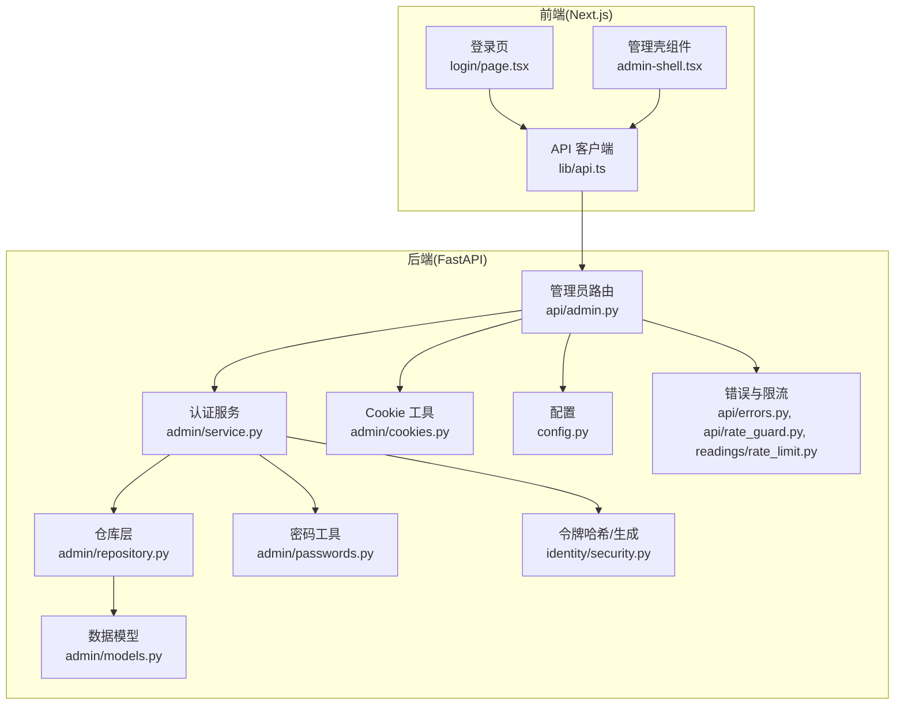
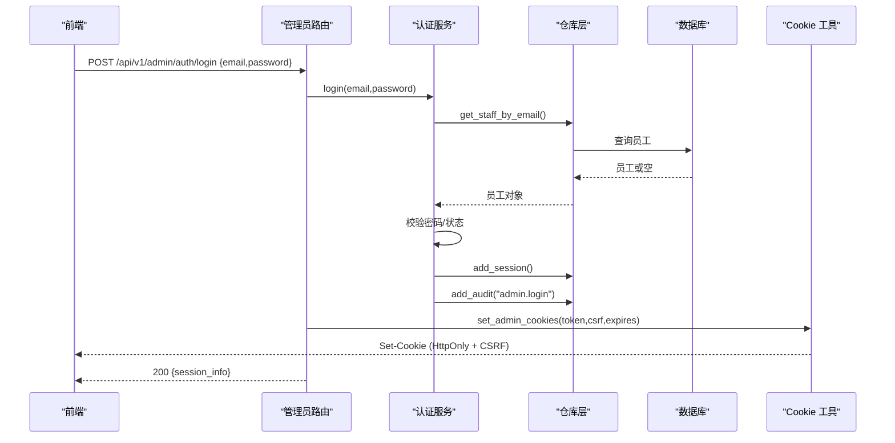
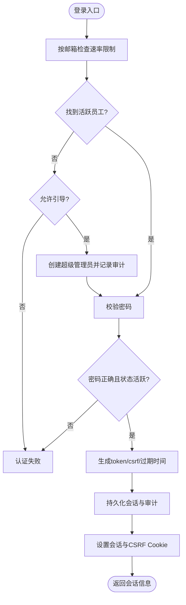
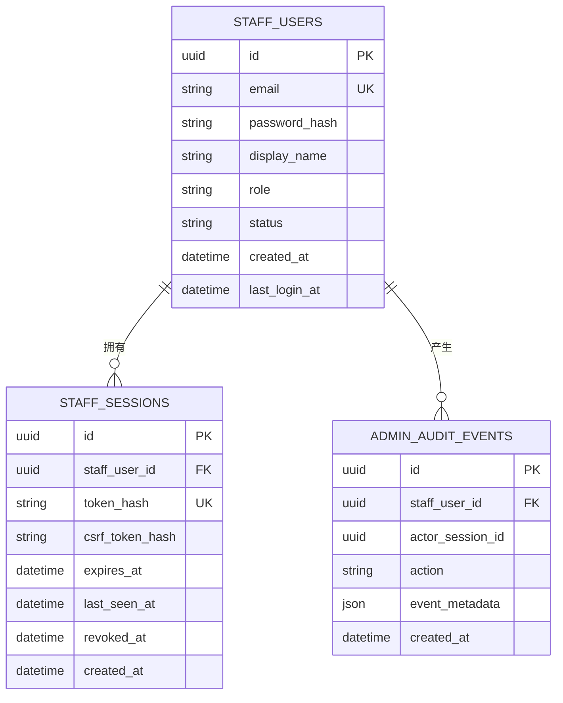
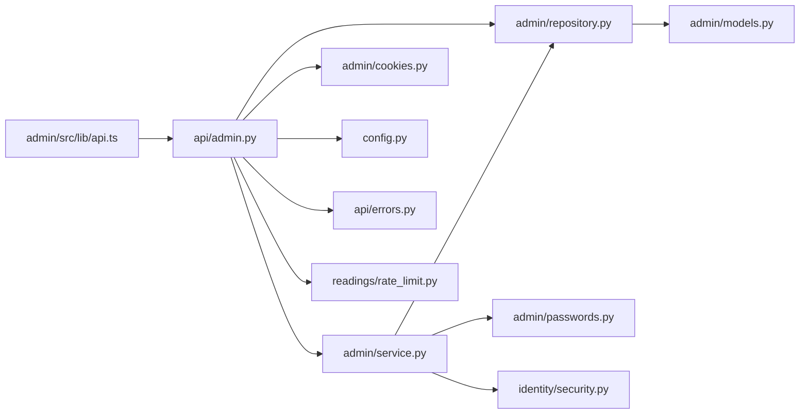

# 管理后台模块

<cite>
**本文引用的文件**
- [backend/app/admin/service.py](file://backend/app/admin/service.py)
- [backend/app/admin/models.py](file://backend/app/admin/models.py)
- [backend/app/admin/cookies.py](file://backend/app/admin/cookies.py)
- [backend/app/admin/passwords.py](file://backend/app/admin/passwords.py)
- [backend/app/admin/repository.py](file://backend/app/admin/repository.py)
- [backend/app/admin/schemas.py](file://backend/app/admin/schemas.py)
- [backend/app/api/admin.py](file://backend/app/api/admin.py)
- [backend/app/config.py](file://backend/app/config.py)
- [backend/app/identity/security.py](file://backend/app/identity/security.py)
- [backend/app/api/errors.py](file://backend/app/api/errors.py)
- [backend/app/api/rate_guard.py](file://backend/app/api/rate_guard.py)
- [backend/app/readings/rate_limit.py](file://backend/app/readings/rate_limit.py)
- [contracts/openapi/admin-v1.yaml](file://contracts/openapi/admin-v1.yaml)
- [admin/src/lib/api.ts](file://admin/src/lib/api.ts)
- [admin/src/app/login/page.tsx](file://admin/src/app/login/page.tsx)
- [admin/src/components/admin-shell.tsx](file://admin/src/components/admin-shell.tsx)
</cite>

## 目录
1. [简介](#简介)
2. [项目结构](#项目结构)
3. [核心组件](#核心组件)
4. [架构总览](#架构总览)
5. [详细组件分析](#详细组件分析)
6. [依赖关系分析](#依赖关系分析)
7. [性能与安全考量](#性能与安全考量)
8. [故障排查指南](#故障排查指南)
9. [结论](#结论)
10. [附录：API 使用示例与最佳实践](#附录api-使用示例与最佳实践)

## 简介
本模块为 FateRadar 的管理后台（运营台），提供员工身份认证、会话管理、CSRF 防护、审计日志以及管理概览等能力。前端 Next.js 应用通过同源 Cookie 与后端交互，后端基于 FastAPI 暴露 /api/v1/admin/* 接口，采用角色（support/finance/ops/superadmin）进行权限划分，并通过数据库持久化会话与审计事件。当前“用户管理、订单处理、系统监控”等页面已具备路由骨架，业务逻辑以占位形式实现，便于后续接入真实领域服务。

## 项目结构
管理后台由前后端两部分组成：
- 后端：位于 backend/app/admin 与 backend/app/api/admin.py，负责认证、授权、会话、Cookie、审计与速率限制。
- 前端：位于 admin/src，包含登录页、壳组件与导航，统一通过 lib/api.ts 发起请求并携带 CSRF 头。

**图表来源**
- [backend/app/api/admin.py:1-200](file://backend/app/api/admin.py#L1-L200)
- [backend/app/admin/service.py:1-148](file://backend/app/admin/service.py#L1-L148)
- [backend/app/admin/models.py:1-81](file://backend/app/admin/models.py#L1-L81)
- [backend/app/admin/repository.py:1-57](file://backend/app/admin/repository.py#L1-L57)
- [backend/app/admin/passwords.py:1-55](file://backend/app/admin/passwords.py#L1-L55)
- [backend/app/admin/cookies.py:1-81](file://backend/app/admin/cookies.py#L1-L81)
- [backend/app/config.py:62-146](file://backend/app/config.py#L62-L146)
- [backend/app/identity/security.py:1-11](file://backend/app/identity/security.py#L1-L11)
- [backend/app/api/errors.py:1-17](file://backend/app/api/errors.py#L1-L17)
- [backend/app/api/rate_guard.py:1-20](file://backend/app/api/rate_guard.py#L1-L20)
- [backend/app/readings/rate_limit.py:1-61](file://backend/app/readings/rate_limit.py#L1-L61)
- [admin/src/lib/api.ts:1-80](file://admin/src/lib/api.ts#L1-L80)
- [admin/src/app/login/page.tsx:1-82](file://admin/src/app/login/page.tsx#L1-L82)
- [admin/src/components/admin-shell.tsx:1-116](file://admin/src/components/admin-shell.tsx#L1-L116)

**章节来源**
- [backend/app/api/admin.py:1-200](file://backend/app/api/admin.py#L1-L200)
- [backend/app/admin/service.py:1-148](file://backend/app/admin/service.py#L1-L148)
- [backend/app/admin/models.py:1-81](file://backend/app/admin/models.py#L1-L81)
- [backend/app/admin/repository.py:1-57](file://backend/app/admin/repository.py#L1-L57)
- [backend/app/admin/passwords.py:1-55](file://backend/app/admin/passwords.py#L1-L55)
- [backend/app/admin/cookies.py:1-81](file://backend/app/admin/cookies.py#L1-L81)
- [backend/app/config.py:62-146](file://backend/app/config.py#L62-L146)
- [backend/app/identity/security.py:1-11](file://backend/app/identity/security.py#L1-L11)
- [backend/app/api/errors.py:1-17](file://backend/app/api/errors.py#L1-L17)
- [backend/app/api/rate_guard.py:1-20](file://backend/app/api/rate_guard.py#L1-L20)
- [backend/app/readings/rate_limit.py:1-61](file://backend/app/readings/rate_limit.py#L1-L61)
- [contracts/openapi/admin-v1.yaml:1-231](file://contracts/openapi/admin-v1.yaml#L1-L231)
- [admin/src/lib/api.ts:1-80](file://admin/src/lib/api.ts#L1-L80)
- [admin/src/app/login/page.tsx:1-82](file://admin/src/app/login/page.tsx#L1-L82)
- [admin/src/components/admin-shell.tsx:1-116](file://admin/src/components/admin-shell.tsx#L1-L116)

## 核心组件
- 管理员认证与会话：AdminAuthService 负责登录、登出、引导创建超级管理员、记录审计事件；会话以不透明令牌存储，服务端仅保存哈希。
- Cookie 管理：set_admin_cookies/clear_admin_cookies 设置 HttpOnly 的会话 Cookie 与可读的 CSRF Cookie，遵循 SameSite=Lax 与 Secure 策略。
- 密码安全：基于 scrypt 的加盐哈希与常量时间比较验证。
- 数据模型：staff_users、staff_sessions、admin_audit_events 三张表，分别承载员工信息、会话状态与审计事件。
- 仓库层：对会话、员工、审计事件的增删查操作封装。
- API 路由：/api/v1/admin/auth/login、/auth/logout、/me、/overview，内置速率限制、CSRF 校验与私有响应标记。
- 前端：登录页调用登录接口，壳组件拉取 /me 校验会话并渲染导航，统一通过 adminFetch 自动附带 CSRF 头。

**章节来源**
- [backend/app/admin/service.py:33-129](file://backend/app/admin/service.py#L33-L129)
- [backend/app/admin/cookies.py:15-81](file://backend/app/admin/cookies.py#L15-L81)
- [backend/app/admin/passwords.py:16-55](file://backend/app/admin/passwords.py#L16-L55)
- [backend/app/admin/models.py:17-81](file://backend/app/admin/models.py#L17-L81)
- [backend/app/admin/repository.py:14-57](file://backend/app/admin/repository.py#L14-L57)
- [backend/app/api/admin.py:68-199](file://backend/app/api/admin.py#L68-L199)
- [admin/src/lib/api.ts:28-80](file://admin/src/lib/api.ts#L28-L80)
- [admin/src/app/login/page.tsx:17-31](file://admin/src/app/login/page.tsx#L17-L31)
- [admin/src/components/admin-shell.tsx:36-59](file://admin/src/components/admin-shell.tsx#L36-L59)

## 架构总览
管理后台采用前后端分离的同源 Cookie 认证模式：
- 登录成功后，后端返回会话与 CSRF 令牌，并写入两个 Cookie。
- 后续写操作需同时携带 cookie 中的 CSRF 值到请求头 x-csrf-token，后端进行双提交校验。
- 读操作仅需有效会话 Cookie。
- 所有敏感操作均记录审计事件，支持按员工与会话追踪。

**图表来源**
- [backend/app/api/admin.py:103-145](file://backend/app/api/admin.py#L103-L145)
- [backend/app/admin/service.py:49-89](file://backend/app/admin/service.py#L49-L89)
- [backend/app/admin/repository.py:22-40](file://backend/app/admin/repository.py#L22-L40)
- [backend/app/admin/cookies.py:38-65](file://backend/app/admin/cookies.py#L38-L65)

**章节来源**
- [backend/app/api/admin.py:103-145](file://backend/app/api/admin.py#L103-L145)
- [backend/app/admin/service.py:49-89](file://backend/app/admin/service.py#L49-L89)
- [backend/app/admin/cookies.py:38-65](file://backend/app/admin/cookies.py#L38-L65)

## 详细组件分析

### 管理员认证与会话
- 登录流程：
  - 校验邮箱格式与长度，按邮箱维度做速率限制，避免枚举与暴力破解。
  - 若未找到活跃员工，且允许引导模式，则创建首个超级管理员并记录审计。
  - 校验密码与状态后，生成不透明 token 与 csrf_token，计算过期时间，写入会话并记录审计。
- 登出流程：
  - 撤销会话（标记 revoked_at），记录审计，清除 Cookie。
- 会话校验：
  - 从 Cookie 读取会话令牌，哈希后查询有效会话（未撤销且未过期）。
  - 校验员工状态为 active，更新 last_seen_at。
- CSRF 校验：
  - 写操作必须同时携带 cookie 中的 mingli_admin_csrf 与请求头 x-csrf-token，并与服务端存储的哈希比对。

**图表来源**
- [backend/app/api/admin.py:103-145](file://backend/app/api/admin.py#L103-L145)
- [backend/app/admin/service.py:49-89](file://backend/app/admin/service.py#L49-L89)
- [backend/app/admin/service.py:103-129](file://backend/app/admin/service.py#L103-L129)
- [backend/app/admin/cookies.py:38-65](file://backend/app/admin/cookies.py#L38-L65)

**章节来源**
- [backend/app/api/admin.py:68-100](file://backend/app/api/admin.py#L68-L100)
- [backend/app/api/admin.py:103-163](file://backend/app/api/admin.py#L103-L163)
- [backend/app/admin/service.py:49-129](file://backend/app/admin/service.py#L49-L129)

### 密码安全与令牌处理
- 密码哈希：使用 scrypt 参数化强度，最小长度校验，随机盐，输出标准化编码。
- 密码校验：解析编码参数，重新计算摘要并使用常量时间比较，防止时序攻击。
- 令牌处理：不透明令牌通过 URL-safe 随机生成，服务端仅保存 SHA-256 哈希，避免泄露风险。

**章节来源**
- [backend/app/admin/passwords.py:16-55](file://backend/app/admin/passwords.py#L16-L55)
- [backend/app/identity/security.py:5-11](file://backend/app/identity/security.py#L5-L11)

### Cookie 与 CSRF 机制
- Cookie 策略：
  - 会话 Cookie：mingli_admin_session，HttpOnly，SameSite=Lax，Secure（生产强制）。
  - CSRF Cookie：mingli_admin_csrf，可被前端读取，用于双提交校验。
- 生命周期：根据会话过期时间动态设置 max_age 与 expires。
- 登出清理：删除两个 Cookie，确保会话失效。

**章节来源**
- [backend/app/admin/cookies.py:15-81](file://backend/app/admin/cookies.py#L15-L81)
- [backend/app/config.py:72-76](file://backend/app/config.py#L72-L76)
- [backend/app/config.py:188-191](file://backend/app/config.py#L188-L191)

### 数据模型与审计
- staff_users：唯一邮箱索引、状态索引，记录显示名、角色、状态、最后登录时间。
- staff_sessions：唯一 token_hash 索引，记录关联员工、CSRF 哈希、过期与最后访问时间、撤销时间。
- admin_audit_events：记录员工与会话、动作类型与元数据，支持按时间与员工检索。

**图表来源**
- [backend/app/admin/models.py:17-81](file://backend/app/admin/models.py#L17-L81)

**章节来源**
- [backend/app/admin/models.py:17-81](file://backend/app/admin/models.py#L17-L81)

### 速率限制与防暴力破解
- 登录速率限制：按邮箱维度滑动窗口限流，超限返回 429 并附带 Retry-After。
- 实现：WindowRateLimiter 维护每个 key 的时间戳队列，窗口内超过阈值即拒绝。

**章节来源**
- [backend/app/api/admin.py:56-65](file://backend/app/api/admin.py#L56-L65)
- [backend/app/api/rate_guard.py:5-20](file://backend/app/api/rate_guard.py#L5-L20)
- [backend/app/readings/rate_limit.py:9-61](file://backend/app/readings/rate_limit.py#L9-L61)

### 管理功能现状与扩展点
- 用户管理、订单处理、退款审批、解读任务、审计日志等页面已在导航中定义，当前以占位为主，待接入领域服务。
- 概览接口返回 KPI 与队列的占位数据，is_stub 标识是否为模拟数据。

**章节来源**
- [backend/app/admin/service.py:132-148](file://backend/app/admin/service.py#L132-L148)
- [contracts/openapi/admin-v1.yaml:69-82](file://contracts/openapi/admin-v1.yaml#L69-L82)
- [admin/src/components/admin-shell.tsx:13-20](file://admin/src/components/admin-shell.tsx#L13-L20)

## 依赖关系分析
- 路由层依赖认证服务、仓库层、Cookie 工具、配置与错误/限流模块。
- 认证服务依赖仓库层、密码工具与令牌工具。
- 仓库层依赖 SQLAlchemy 异步会话与数据模型。
- 前端依赖统一的 adminFetch，自动附加 CSRF 头与凭据。

**图表来源**
- [backend/app/api/admin.py:1-200](file://backend/app/api/admin.py#L1-L200)
- [backend/app/admin/service.py:1-148](file://backend/app/admin/service.py#L1-L148)
- [backend/app/admin/repository.py:1-57](file://backend/app/admin/repository.py#L1-L57)
- [backend/app/admin/passwords.py:1-55](file://backend/app/admin/passwords.py#L1-L55)
- [backend/app/admin/cookies.py:1-81](file://backend/app/admin/cookies.py#L1-L81)
- [backend/app/config.py:62-146](file://backend/app/config.py#L62-L146)
- [backend/app/identity/security.py:1-11](file://backend/app/identity/security.py#L1-L11)
- [backend/app/api/errors.py:1-17](file://backend/app/api/errors.py#L1-L17)
- [backend/app/readings/rate_limit.py:1-61](file://backend/app/readings/rate_limit.py#L1-L61)
- [admin/src/lib/api.ts:1-80](file://admin/src/lib/api.ts#L1-L80)

**章节来源**
- [backend/app/api/admin.py:1-200](file://backend/app/api/admin.py#L1-L200)
- [backend/app/admin/service.py:1-148](file://backend/app/admin/service.py#L1-L148)
- [backend/app/admin/repository.py:1-57](file://backend/app/admin/repository.py#L1-L57)
- [backend/app/admin/passwords.py:1-55](file://backend/app/admin/passwords.py#L1-L55)
- [backend/app/admin/cookies.py:1-81](file://backend/app/admin/cookies.py#L1-L81)
- [backend/app/config.py:62-146](file://backend/app/config.py#L62-L146)
- [backend/app/identity/security.py:1-11](file://backend/app/identity/security.py#L1-L11)
- [backend/app/api/errors.py:1-17](file://backend/app/api/errors.py#L1-L17)
- [backend/app/readings/rate_limit.py:1-61](file://backend/app/readings/rate_limit.py#L1-L61)
- [admin/src/lib/api.ts:1-80](file://admin/src/lib/api.ts#L1-L80)

## 性能与安全考量
- 性能
  - 会话查询与审计写入均为轻量级数据库操作，注意在高峰时段合理设置连接池与超时。
  - 速率限制为内存滑动窗口，适合单机部署；多实例场景需考虑分布式限流。
- 安全
  - 生产环境强制启用 Secure Cookie，禁止引导凭据注入。
  - 密码哈希使用 scrypt 并限制最小长度，验证使用常量时间比较。
  - 会话令牌仅存哈希，避免泄露；CSRF 双提交校验防止跨站请求伪造。
  - 登录接口按邮箱限流，降低暴力破解与枚举风险。
  - 所有管理操作记录审计事件，支持事后追溯。

[本节为通用指导，不直接分析具体文件]

## 故障排查指南
- 401 未认证
  - 检查是否携带有效的 mingli_admin_session Cookie。
  - 确认会话未过期且未被撤销。
  - 确认员工状态为 active。
- 403 CSRF 校验失败
  - 写操作必须携带 x-csrf-token 请求头，且值与 Cookie 中的 mingli_admin_csrf 一致。
  - 服务端会对比 Cookie 值与服务端存储的哈希。
- 429 登录频率过高
  - 同一邮箱在短时间内多次尝试会被限流，等待 Retry-After 后再试。
- 审计日志缺失
  - 确认登录/登出等操作成功提交事务，审计事件已写入。

**章节来源**
- [backend/app/api/admin.py:68-100](file://backend/app/api/admin.py#L68-L100)
- [backend/app/api/admin.py:103-163](file://backend/app/api/admin.py#L103-L163)
- [backend/app/api/rate_guard.py:5-20](file://backend/app/api/rate_guard.py#L5-L20)
- [backend/app/readings/rate_limit.py:23-32](file://backend/app/readings/rate_limit.py#L23-L32)

## 结论
管理后台模块实现了稳健的员工认证与会话管理，结合 CSRF 双提交、速率限制与审计日志，满足运营台的安全与可追溯需求。当前业务页面以占位形式存在，便于后续接入用户管理、订单处理与系统监控等能力。建议在生产环境严格配置 Secure Cookie、禁用引导凭据，并持续完善各管理功能的领域集成与权限控制。

[本节为总结性内容，不直接分析具体文件]

## 附录：API 使用示例与最佳实践

### 接口契约
- 登录：POST /api/v1/admin/auth/login，返回会话信息与 CSRF 令牌，并设置 Cookie。
- 登出：POST /api/v1/admin/auth/logout，需要 CSRF 头，返回 204 并清除 Cookie。
- 当前员工：GET /api/v1/admin/me，需要有效会话 Cookie。
- 管理概览：GET /api/v1/admin/overview，需要有效会话 Cookie，返回 KPI 与队列（可能为占位）。

**章节来源**
- [contracts/openapi/admin-v1.yaml:15-82](file://contracts/openapi/admin-v1.yaml#L15-L82)

### 前端调用要点
- 登录成功后，浏览器会自动接收两个 Cookie。
- 写操作需自动附加 x-csrf-token 请求头，值为 Cookie 中的 mingli_admin_csrf。
- 统一通过 adminFetch 发起请求，已处理凭据与缓存策略。

**章节来源**
- [admin/src/lib/api.ts:28-80](file://admin/src/lib/api.ts#L28-L80)
- [admin/src/app/login/page.tsx:17-31](file://admin/src/app/login/page.tsx#L17-L31)

### 管理员操作最佳实践
- 会话管理
  - 合理设置会话时长，避免过长导致安全风险。
  - 登出时务必调用登出接口，确保会话撤销与 Cookie 清理。
- 密码安全
  - 使用强密码，避免重复使用。
  - 定期轮换密码，关注异常登录行为。
- 访问审计
  - 定期检查审计日志，发现异常操作及时处置。
  - 将审计事件纳入集中式日志平台，便于检索与分析。
- 安全防护
  - 生产环境启用 Secure Cookie，关闭引导模式。
  - 对写接口强制 CSRF 校验，避免跨站请求。
  - 对登录接口保持合理的速率限制。
- 审批与批量处理
  - 当前为占位阶段，建议在接入领域服务时引入审批工作流与批量处理能力，确保操作可回滚与可审计。

[本节为通用指导，不直接分析具体文件]