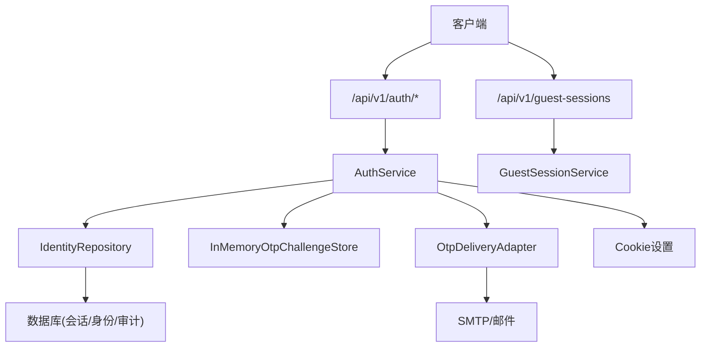
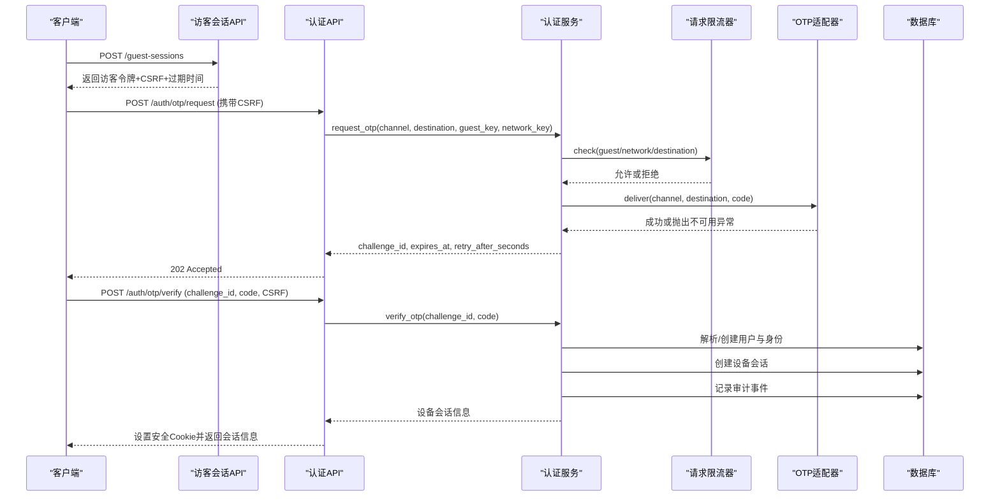
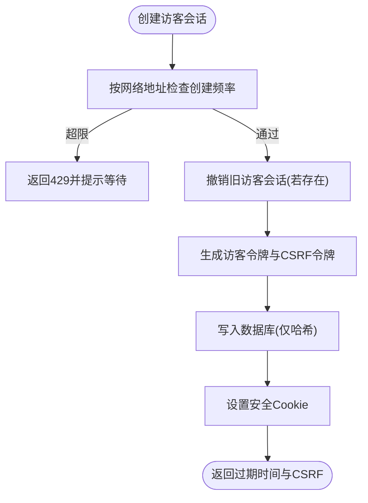
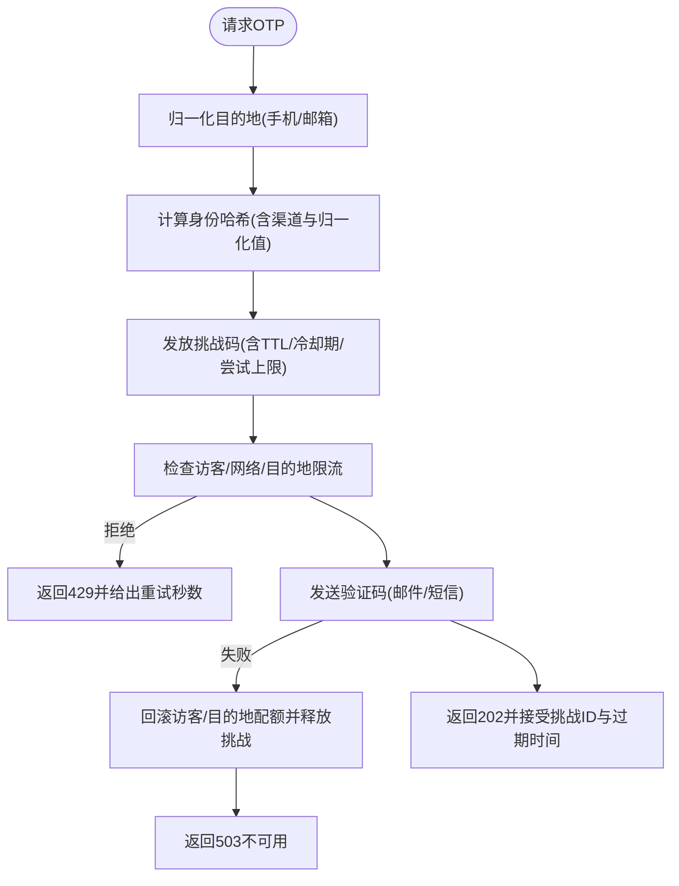
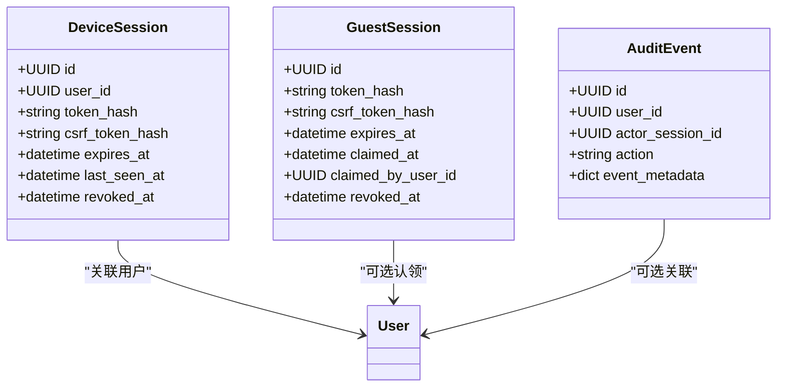
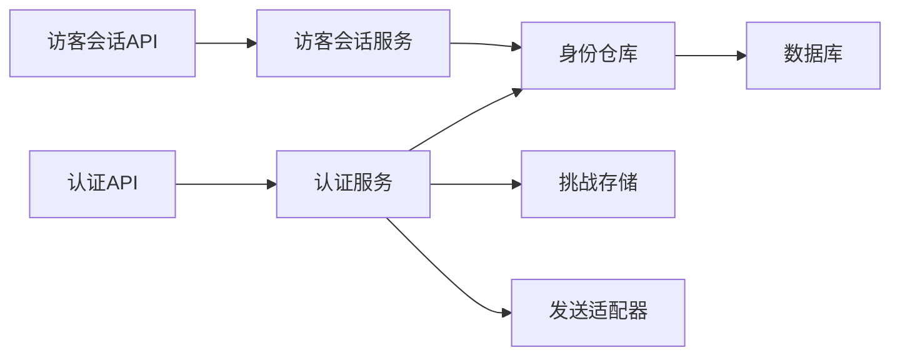

# 身份认证模块

<cite>
**本文引用的文件**
- [backend/app/identity/service.py](file://backend/app/identity/service.py)
- [backend/app/api/auth.py](file://backend/app/api/auth.py)
- [backend/app/identity/otp.py](file://backend/app/identity/otp.py)
- [backend/app/adapters/otp.py](file://backend/app/adapters/otp.py)
- [backend/app/api/guest_sessions.py](file://backend/app/api/guest_sessions.py)
- [backend/app/identity/models.py](file://backend/app/identity/models.py)
- [backend/app/identity/cookies.py](file://backend/app/identity/cookies.py)
- [backend/app/api/dependencies.py](file://backend/app/api/dependencies.py)
- [backend/app/config.py](file://backend/app/config.py)
- [backend/tests/test_auth.py](file://backend/tests/test_auth.py)
- [backend/tests/test_guest_sessions.py](file://backend/tests/test_guest_sessions.py)
</cite>

## 目录
1. [简介](#简介)
2. [项目结构](#项目结构)
3. [核心组件](#核心组件)
4. [架构总览](#架构总览)
5. [详细组件分析](#详细组件分析)
6. [依赖关系分析](#依赖关系分析)
7. [性能与扩展性](#性能与扩展性)
8. [故障排查指南](#故障排查指南)
9. [结论](#结论)
10. [附录：API调用示例与集成要点](#附录api调用示例与集成要点)

## 简介
本模块提供基于手机号和邮箱的OTP（一次性验证码）登录能力，以及访客会话管理。系统通过“双提交CSRF + 安全Cookie”保障请求安全性；通过分层限流、挑战码存储与冷却期控制防止滥用；通过设备会话持久化实现用户登录态；通过审计事件记录关键安全动作。当前实现未使用JWT，而是采用无状态令牌+服务端会话表的方式管理登录态。

## 项目结构
认证相关代码主要位于后端模块中，围绕以下层次组织：
- API层：路由定义与请求校验（auth、guest-sessions）
- 服务层：业务编排（AuthService、GuestSessionService）
- 领域模型与存储：用户、身份、会话、审计事件等ORM模型
- 安全与令牌：令牌生成与哈希、Cookie设置
- OTP通道适配：短信/邮件发送适配器
- 配置与安全策略：环境约束、速率限制、超时等

图表来源
- [backend/app/api/auth.py:30-41](file://backend/app/api/auth.py#L30-L41)
- [backend/app/api/guest_sessions.py:22-52](file://backend/app/api/guest_sessions.py#L22-L52)
- [backend/app/identity/service.py:35-191](file://backend/app/identity/service.py#L35-L191)
- [backend/app/adapters/otp.py:57-129](file://backend/app/adapters/otp.py#L57-L129)
- [backend/app/identity/cookies.py:35-102](file://backend/app/identity/cookies.py#L35-L102)

章节来源
- [backend/app/api/auth.py:1-161](file://backend/app/api/auth.py#L1-L161)
- [backend/app/api/guest_sessions.py:1-53](file://backend/app/api/guest_sessions.py#L1-L53)
- [backend/app/identity/service.py:1-192](file://backend/app/identity/service.py#L1-L192)

## 核心组件
- 访客会话服务：创建短期访客会话，颁发访客令牌与CSRF令牌，并写入数据库与Cookie。
- 认证服务：处理OTP请求与验证，完成身份解析、设备会话创建、审计记录与Cookie下发。
- OTP挑战存储：内存式挑战码存储，支持TTL、冷却期、最大尝试次数与撤销释放。
- 请求限流器：三层窗口（访客、网络IP、目的地）限流，支持失败回滚与过期清理。
- 适配器：邮件发送（SMTP），测试用假适配器，生产禁用或关闭模式。
- Cookie与安全：安全Cookie设置、CSRF双提交校验、令牌哈希存储。
- 配置与安全策略：生产环境强制安全Cookie、禁止Fake OTP、强制注入密钥等。

章节来源
- [backend/app/identity/service.py:23-191](file://backend/app/identity/service.py#L23-L191)
- [backend/app/identity/otp.py:64-304](file://backend/app/identity/otp.py#L64-L304)
- [backend/app/adapters/otp.py:16-129](file://backend/app/adapters/otp.py#L16-L129)
- [backend/app/identity/cookies.py:12-102](file://backend/app/identity/cookies.py#L12-L102)
- [backend/app/config.py:62-335](file://backend/app/config.py#L62-L335)

## 架构总览
认证流程分为两条主线：
- 访客会话：创建访客会话，用于后续发起OTP请求时的防刷与CSRF保护。
- OTP登录：手机号或邮箱发送验证码，验证通过后建立设备会话并下发安全Cookie。

图表来源
- [backend/app/api/guest_sessions.py:16-52](file://backend/app/api/guest_sessions.py#L16-L52)
- [backend/app/api/auth.py:44-138](file://backend/app/api/auth.py#L44-L138)
- [backend/app/identity/service.py:100-191](file://backend/app/identity/service.py#L100-L191)
- [backend/app/identity/otp.py:221-304](file://backend/app/identity/otp.py#L221-L304)
- [backend/app/adapters/otp.py:57-129](file://backend/app/adapters/otp.py#L57-L129)

## 详细组件分析

### 访客会话管理
- 生命周期：默认24小时，新建时会撤销旧访客会话，避免并发冲突。
- 数据隔离：仅存储令牌哈希与CSRF哈希，不存储明文；通过CSRF双提交确保跨站请求伪造防护。
- 速率限制：按网络地址限制创建频率，支持可信代理识别真实客户端IP。
- Cookie策略：访客令牌HttpOnly，CSRF非HttpOnly以便前端读取；Secure与SameSite=lax保证传输与同源策略。

图表来源
- [backend/app/api/guest_sessions.py:16-52](file://backend/app/api/guest_sessions.py#L16-L52)
- [backend/app/identity/service.py:35-58](file://backend/app/identity/service.py#L35-L58)
- [backend/app/identity/models.py:91-110](file://backend/app/identity/models.py#L91-L110)
- [backend/app/identity/cookies.py:35-60](file://backend/app/identity/cookies.py#L35-L60)

章节来源
- [backend/app/api/guest_sessions.py:1-53](file://backend/app/api/guest_sessions.py#L1-L53)
- [backend/app/identity/service.py:28-58](file://backend/app/identity/service.py#L28-L58)
- [backend/app/identity/models.py:91-110](file://backend/app/identity/models.py#L91-L110)
- [backend/app/identity/cookies.py:35-60](file://backend/app/identity/cookies.py#L35-L60)

### 手机号/邮箱OTP登录
- 目标归一化：手机号仅保留数字并标准化为国际格式；邮箱规范化并脱敏显示。
- 挑战码生成：生成随机六位验证码，计算哈希后存入挑战存储，附带TTL与冷却期。
- 多层限流：访客维度、网络维度、目的地维度分别限流，失败可回滚以避免浪费配额。
- 发送通道：邮件通过SMTP发送；短信通道在适配器中预留但当前实现以邮件为主。
- 验证流程：校验挑战码有效性、尝试次数与过期时间；成功后解析或创建用户与身份，建立设备会话，记录审计事件，下发安全Cookie。

图表来源
- [backend/app/identity/otp.py:183-218](file://backend/app/identity/otp.py#L183-L218)
- [backend/app/identity/otp.py:221-265](file://backend/app/identity/otp.py#L221-L265)
- [backend/app/identity/otp.py:64-181](file://backend/app/identity/otp.py#L64-L181)
- [backend/app/adapters/otp.py:57-129](file://backend/app/adapters/otp.py#L57-L129)
- [backend/app/api/auth.py:44-88](file://backend/app/api/auth.py#L44-L88)

章节来源
- [backend/app/identity/otp.py:13-218](file://backend/app/identity/otp.py#L13-L218)
- [backend/app/identity/otp.py:221-304](file://backend/app/identity/otp.py#L221-L304)
- [backend/app/adapters/otp.py:16-129](file://backend/app/adapters/otp.py#L16-L129)
- [backend/app/api/auth.py:44-88](file://backend/app/api/auth.py#L44-L88)

### 设备会话与Cookie管理
- 令牌与CSRF：设备会话包含会话令牌与CSRF令牌，均哈希存储于数据库；响应中设置安全Cookie。
- 会话有效期：由配置决定设备会话天数；每次访问会更新最后访问时间。
- 登出：标记会话撤销并清除Cookie，同时记录审计事件。
- CSRF校验：所有写操作需携带x-csrf-token头与Cookie中的CSRF一致，否则拒绝。

图表来源
- [backend/app/identity/models.py:68-132](file://backend/app/identity/models.py#L68-L132)
- [backend/app/identity/cookies.py:63-102](file://backend/app/identity/cookies.py#L63-L102)
- [backend/app/api/auth.py:141-160](file://backend/app/api/auth.py#L141-L160)

章节来源
- [backend/app/identity/models.py:68-132](file://backend/app/identity/models.py#L68-L132)
- [backend/app/identity/cookies.py:63-102](file://backend/app/identity/cookies.py#L63-L102)
- [backend/app/api/auth.py:141-160](file://backend/app/api/auth.py#L141-L160)

### 安全令牌与刷新机制
- 令牌类型：当前未使用JWT，采用无状态令牌+服务端会话表。令牌为URL安全的随机字符串，服务端仅存哈希。
- 刷新机制：未实现显式刷新接口；可通过重新登录获取新设备会话。
- 安全存储：所有敏感令牌均以SHA-256哈希存储；CSRF通过双提交校验。
- 生产安全：强制启用Secure Cookie、禁止Fake OTP、要求注入身份哈希键与内容加密密钥。

章节来源
- [backend/app/identity/security.py:1-11](file://backend/app/identity/security.py#L1-L11)
- [backend/app/identity/cookies.py:12-102](file://backend/app/identity/cookies.py#L12-L102)
- [backend/app/config.py:188-329](file://backend/app/config.py#L188-L329)

### 错误处理与审计日志
- 错误分类：无效目的地、OTP不可用、速率限制、无效或过期验证码、访客会话已被认领等。
- 审计事件：OTP验证成功、设备会话撤销等关键动作均记录审计事件，便于追踪与合规。
- 幂等与回滚：OTP请求失败时释放挑战与冷却期，避免资源泄漏；限流失败时回滚已消耗配额。

章节来源
- [backend/app/api/auth.py:69-138](file://backend/app/api/auth.py#L69-L138)
- [backend/app/identity/service.py:117-191](file://backend/app/identity/service.py#L117-L191)
- [backend/app/identity/models.py:113-132](file://backend/app/identity/models.py#L113-L132)

## 依赖关系分析
- API到服务：auth与guest-sessions路由依赖AuthService与GuestSessionService。
- 服务到存储：通过IdentityRepository访问数据库，持久化会话、身份与审计事件。
- 服务到OTP：挑战存储与发送适配器解耦，便于替换为Redis与外部短信/邮件服务。
- 依赖注入：FastAPI依赖项负责数据库会话、CSRF校验与会话鉴权。

图表来源
- [backend/app/api/auth.py:30-41](file://backend/app/api/auth.py#L30-L41)
- [backend/app/api/guest_sessions.py:37-52](file://backend/app/api/guest_sessions.py#L37-L52)
- [backend/app/identity/service.py:78-98](file://backend/app/identity/service.py#L78-L98)

章节来源
- [backend/app/api/auth.py:1-161](file://backend/app/api/auth.py#L1-L161)
- [backend/app/api/guest_sessions.py:1-53](file://backend/app/api/guest_sessions.py#L1-L53)
- [backend/app/identity/service.py:78-98](file://backend/app/identity/service.py#L78-L98)

## 性能与扩展性
- 限流器：内存实现适合单机测试与开发；生产建议替换为分布式限流（如Redis）以支持多实例。
- 挑战存储：当前为内存存储，生产需替换为持久化存储以保证重启后仍有效。
- 发送适配器：邮件通过标准库SMTP发送，生产应配置TLS/STARTTLS并设置合理超时；短信通道可扩展。
- Cookie与CSRF：使用HttpOnly与Secure减少XSS风险；SameSite=lax缓解CSRF。
- 配置约束：生产环境强制安全策略，防止误配导致的安全风险。

[本节为通用指导，无需具体文件引用]

## 故障排查指南
- 无法收到验证码：
  - 检查邮件适配器配置（主机、端口、用户名、密码、发件人）。
  - 确认生产环境未使用Fake适配器；生产下禁用SMTP直连，需持久化挑战存储。
- 频繁触发限流：
  - 检查访客、网络、目的地三个维度的限流阈值与窗口时间。
  - 确认可信代理配置正确，避免将代理IP误判为客户端IP。
- 登录失败或会话无效：
  - 确认CSRF头与Cookie一致；检查设备会话是否被撤销或过期。
  - 查看审计事件定位问题。
- 生产环境启动失败：
  - 检查是否满足安全策略（Secure Cookie、注入密钥、禁用Fake等）。

章节来源
- [backend/app/adapters/otp.py:57-129](file://backend/app/adapters/otp.py#L57-L129)
- [backend/app/config.py:188-329](file://backend/app/config.py#L188-L329)
- [backend/tests/test_auth.py:329-367](file://backend/tests/test_auth.py#L329-L367)

## 结论
该身份认证模块通过访客会话、OTP挑战与设备会话构建了完整的登录流程，结合多层限流、CSRF双提交与安全Cookie，提供了较为完善的安全保障。当前实现聚焦于邮件通道与内存存储，生产部署时需替换为持久化挑战存储与分布式限流，并根据需要接入短信通道。未使用JWT，采用无状态令牌+服务端会话表的方式，简化了刷新逻辑但需在业务侧自行实现刷新策略。

[本节为总结性内容，无需具体文件引用]

## 附录：API调用示例与集成要点
- 创建访客会话
  - 方法：POST /api/v1/guest-sessions
  - 响应：包含expires_at与csrf_token；Set-Cookie中包含mingli_guest与mingli_csrf
  - 注意：后续请求需携带x-csrf-token头与Cookie中的CSRF一致
- 请求OTP
  - 方法：POST /api/v1/auth/otp/request
  - 请求体：{channel: "phone"|"email", destination: "手机号或邮箱"}
  - 响应：202 Accepted，包含challenge_id、expires_at、retry_after_seconds；本地/测试环境可能返回development_code
- 验证OTP
  - 方法：POST /api/v1/auth/otp/verify
  - 请求体：{challenge_id, code}
  - 响应：200 OK，包含user_id、session_id、expires_at、csrf_token；Set-Cookie中包含mingli_session与mingli_csrf
- 登出
  - 方法：POST /api/v1/auth/logout
  - 响应：204 No Content；清除设备会话Cookie

集成要点
- 前端需在每次写操作时从Cookie读取CSRF并放入x-csrf-token头。
- 设备会话Cookie为HttpOnly与Secure，确保HTTPS传输。
- 生产环境必须配置Secure Cookie、禁用Fake OTP、注入必要的密钥。
- 如需短信通道，需实现对应的OtpDeliveryAdapter并在配置中启用。

章节来源
- [backend/tests/test_auth.py:10-50](file://backend/tests/test_auth.py#L10-L50)
- [backend/tests/test_guest_sessions.py:14-38](file://backend/tests/test_guest_sessions.py#L14-L38)
- [backend/app/api/auth.py:44-138](file://backend/app/api/auth.py#L44-L138)
- [backend/app/api/guest_sessions.py:16-52](file://backend/app/api/guest_sessions.py#L16-L52)