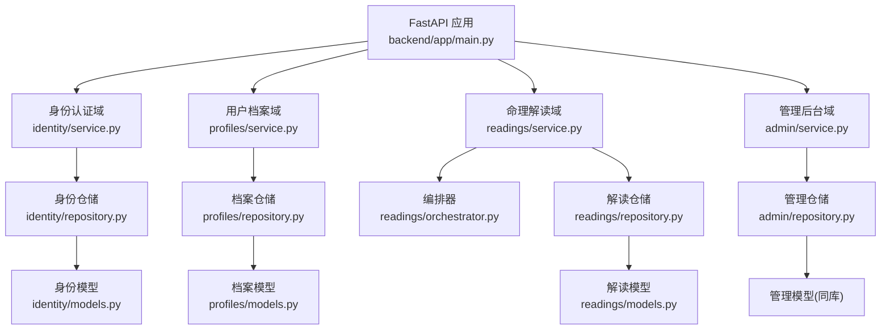
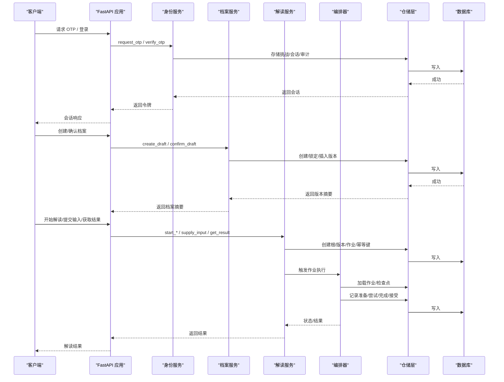
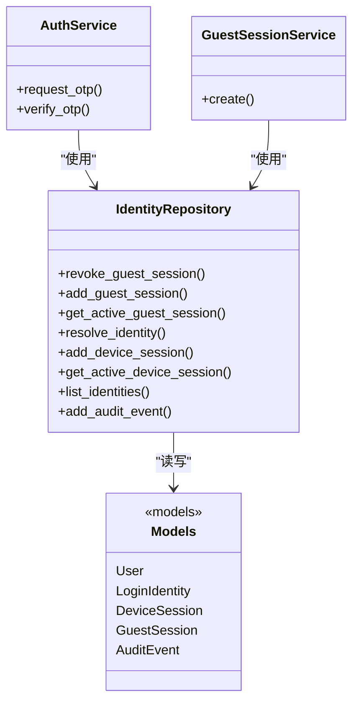
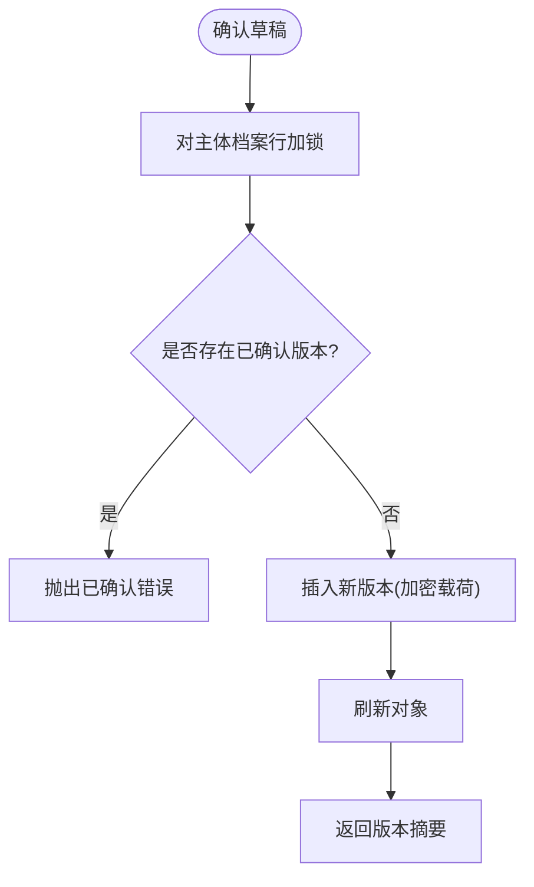
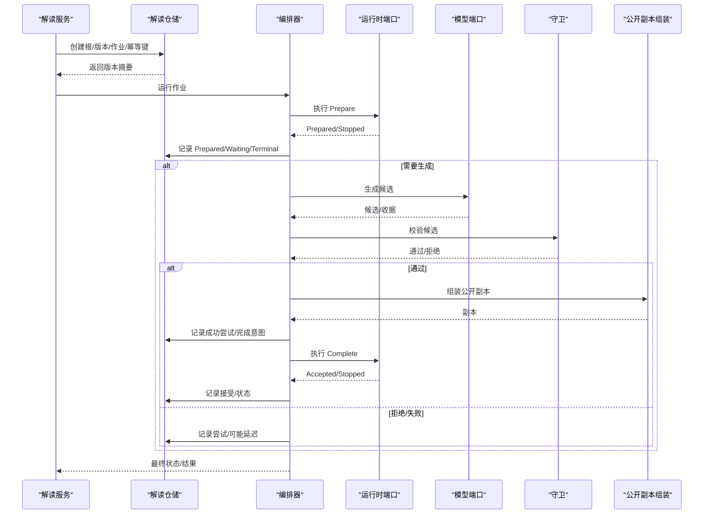
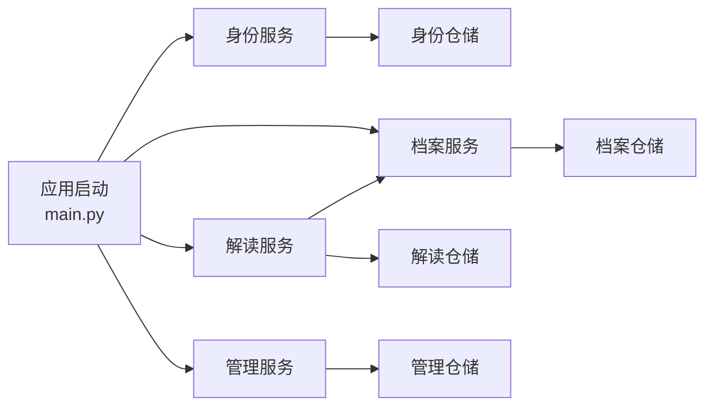

# 领域模块

<cite>
**本文引用的文件**
- [backend/app/main.py](file://backend/app/main.py)
- [backend/app/config.py](file://backend/app/config.py)
- [backend/app/identity/service.py](file://backend/app/identity/service.py)
- [backend/app/identity/repository.py](file://backend/app/identity/repository.py)
- [backend/app/identity/models.py](file://backend/app/identity/models.py)
- [backend/app/profiles/service.py](file://backend/app/profiles/service.py)
- [backend/app/profiles/repository.py](file://backend/app/profiles/repository.py)
- [backend/app/profiles/models.py](file://backend/app/profiles/models.py)
- [backend/app/readings/service.py](file://backend/app/readings/service.py)
- [backend/app/readings/orchestrator.py](file://backend/app/readings/orchestrator.py)
- [backend/app/readings/repository.py](file://backend/app/readings/repository.py)
- [backend/app/readings/models.py](file://backend/app/readings/models.py)
- [backend/app/admin/service.py](file://backend/app/admin/service.py)
- [backend/app/admin/repository.py](file://backend/app/admin/repository.py)
- [README.md](file://README.md)
</cite>

## 目录
1. [简介](#简介)
2. [项目结构](#项目结构)
3. [核心组件](#核心组件)
4. [架构总览](#架构总览)
5. [详细组件分析](#详细组件分析)
6. [依赖关系分析](#依赖关系分析)
7. [性能与一致性](#性能与一致性)
8. [故障排查指南](#故障排查指南)
9. [结论](#结论)
10. [附录](#附录)

## 简介
本仓库采用模块化单体架构，将命理解读系统按领域划分为身份认证（identity）、用户档案（profiles）、命理解读（readings）与管理后台（admin）。各域通过服务层编排用例、仓储层抽象数据访问、编排器驱动异步任务执行，并以不可变记录与幂等键保障一致性与可重放。配置与安全策略集中在应用启动阶段，确保生产环境的安全基线。

## 项目结构
后端以 FastAPI 应用为入口，装配 OTP、限流、日志与路由；四个领域各自拥有 service/repository/models/schemas 分层。读取流程由 ReadingService 发起，ReadingOrchestrator 在 worker 中驱动 Prepare/Generate/Complete 三阶段，并通过 Repository 持久化检查点与审计信息。

图表来源
- [backend/app/main.py:30-140](file://backend/app/main.py#L30-L140)
- [backend/app/identity/service.py:78-191](file://backend/app/identity/service.py#L78-L191)
- [backend/app/profiles/service.py:44-189](file://backend/app/profiles/service.py#L44-L189)
- [backend/app/readings/service.py:117-800](file://backend/app/readings/service.py#L117-L800)
- [backend/app/readings/orchestrator.py:178-450](file://backend/app/readings/orchestrator.py#L178-L450)
- [backend/app/identity/repository.py:16-114](file://backend/app/identity/repository.py#L16-L114)
- [backend/app/profiles/repository.py:22-198](file://backend/app/profiles/repository.py#L22-L198)
- [backend/app/readings/repository.py:51-862](file://backend/app/readings/repository.py#L51-L862)
- [backend/app/admin/repository.py:14-57](file://backend/app/admin/repository.py#L14-L57)

章节来源
- [README.md:24-35](file://README.md#L24-L35)
- [backend/app/main.py:30-140](file://backend/app/main.py#L30-L140)

## 核心组件
- 身份认证域：提供访客会话、OTP 验证码申请与校验、设备会话创建与审计事件记录。
- 用户档案域：支持草稿创建、版本确认、版本列表与归属转移（访客到已验证用户）。
- 命理解读域：封装八字、运势、六爻的启动、输入补充、结果获取、跟进查询与幂等控制；编排器负责 Prepare/Generate/Complete 状态机与重试、告警。
- 管理后台域：员工登录/登出、审计事件、初始超级管理员引导与概览占位。

章节来源
- [backend/app/identity/service.py:28-191](file://backend/app/identity/service.py#L28-L191)
- [backend/app/profiles/service.py:44-189](file://backend/app/profiles/service.py#L44-L189)
- [backend/app/readings/service.py:117-800](file://backend/app/readings/service.py#L117-L800)
- [backend/app/readings/orchestrator.py:178-450](file://backend/app/readings/orchestrator.py#L178-L450)
- [backend/app/admin/service.py:33-148](file://backend/app/admin/service.py#L33-L148)

## 架构总览
应用启动时装配 OTP 通道、请求限速、内容加密密钥与路由；各域服务通过仓储访问数据库，解读流程通过编排器驱动外部运行时与模型生成，最终产出“已接受副本”并进入可展示状态。

图表来源
- [backend/app/main.py:30-140](file://backend/app/main.py#L30-L140)
- [backend/app/identity/service.py:100-191](file://backend/app/identity/service.py#L100-L191)
- [backend/app/profiles/service.py:52-189](file://backend/app/profiles/service.py#L52-L189)
- [backend/app/readings/service.py:129-800](file://backend/app/readings/service.py#L129-L800)
- [backend/app/readings/orchestrator.py:212-450](file://backend/app/readings/orchestrator.py#L212-L450)
- [backend/app/readings/repository.py:83-862](file://backend/app/readings/repository.py#L83-L862)

## 详细组件分析

### 身份认证域（identity）
- 职责边界
  - 访客会话：创建、撤销、过期控制。
  - OTP 流程：申请验证码、速率限制、投递失败回滚、挑战存储、校验后解析或创建身份、创建设备会话与审计事件。
- 关键实体
  - User、LoginIdentity、DeviceSession、GuestSession、AuditEvent。
- 事务与一致性
  - 会话与审计事件在同一会话中写入；投递失败会释放挑战并回滚限速占用。
- 安全要点
  - 令牌哈希存储；目的地归一化与 HMAC 标识；生产环境禁用 fake OTP。

图表来源
- [backend/app/identity/service.py:78-191](file://backend/app/identity/service.py#L78-L191)
- [backend/app/identity/repository.py:16-114](file://backend/app/identity/repository.py#L16-L114)
- [backend/app/identity/models.py:31-132](file://backend/app/identity/models.py#L31-L132)

章节来源
- [backend/app/identity/service.py:28-191](file://backend/app/identity/service.py#L28-L191)
- [backend/app/identity/repository.py:16-114](file://backend/app/identity/repository.py#L16-L114)
- [backend/app/identity/models.py:31-132](file://backend/app/identity/models.py#L31-L132)

### 用户档案域（profiles）
- 职责边界
  - 草稿创建与确认；版本不可变；访客资源向已验证用户原子迁移。
- 关键实体
  - SubjectProfile、ProfileVersion。
- 并发与一致性
  - 使用行级锁序列化版本分配；确认时先加锁再检查是否已有版本。
- 敏感数据
  - 版本载荷使用信封加密存储与读取。

图表来源
- [backend/app/profiles/repository.py:57-104](file://backend/app/profiles/repository.py#L57-L104)
- [backend/app/profiles/service.py:65-105](file://backend/app/profiles/service.py#L65-L105)

章节来源
- [backend/app/profiles/service.py:44-189](file://backend/app/profiles/service.py#L44-L189)
- [backend/app/profiles/repository.py:22-198](file://backend/app/profiles/repository.py#L22-L198)
- [backend/app/profiles/models.py:21-80](file://backend/app/profiles/models.py#L21-L80)

### 命理解读域（readings）
- 职责边界
  - 启动解读（八字/运势/六爻）、补充输入、获取结果、提交验证、跟进查询；维护幂等键与历史。
- 编排器
  - 三阶段工作流：Prepare（准备事实/状态令牌）、Generate（模型生成+守卫校验+组装公开副本）、Complete（提交并接受副本）。
  - 支持延迟、重试、告警与最大尝试次数控制。
- 仓储
  - 所有命令、结果、候选、接受副本均以信封加密存储；严格不可变追加记录。
- 跨域协作
  - 依赖 ProfileService 获取已确认档案版本；与身份域共享会话所有权（用户/访客）。

图表来源
- [backend/app/readings/service.py:129-800](file://backend/app/readings/service.py#L129-L800)
- [backend/app/readings/orchestrator.py:212-450](file://backend/app/readings/orchestrator.py#L212-L450)
- [backend/app/readings/repository.py:83-862](file://backend/app/readings/repository.py#L83-L862)

章节来源
- [backend/app/readings/service.py:117-800](file://backend/app/readings/service.py#L117-L800)
- [backend/app/readings/orchestrator.py:178-450](file://backend/app/readings/orchestrator.py#L178-L450)
- [backend/app/readings/repository.py:51-862](file://backend/app/readings/repository.py#L51-L862)
- [backend/app/readings/models.py:28-378](file://backend/app/readings/models.py#L28-L378)

### 管理后台域（admin）
- 职责边界
  - 员工登录/登出、审计事件记录、首次超级管理员引导（受环境开关控制）。
- 安全要点
  - 密码哈希与校验；会话令牌哈希存储；生产环境禁止引导凭据。

章节来源
- [backend/app/admin/service.py:33-148](file://backend/app/admin/service.py#L33-L148)
- [backend/app/admin/repository.py:14-57](file://backend/app/admin/repository.py#L14-L57)

## 依赖关系分析
- 应用启动装配
  - 设置 OTP 通道、限速器、内容加密密钥、可信代理网络，并注册异常处理器与路由。
- 领域间耦合
  - 解读服务依赖档案服务获取已确认版本；两者均通过会话所有者（用户/访客）进行权限判定。
- 数据一致性
  - 通过行级锁、唯一约束、不可变记录与幂等键保证并发安全与可重放。

图表来源
- [backend/app/main.py:30-140](file://backend/app/main.py#L30-L140)
- [backend/app/readings/service.py:117-128](file://backend/app/readings/service.py#L117-L128)

章节来源
- [backend/app/main.py:30-140](file://backend/app/main.py#L30-L140)

## 性能与一致性
- 并发控制
  - 档案版本分配与解读版本分配均采用行级锁，避免重复分配。
- 幂等性
  - 解读启动与跟进使用基于 HMAC 的请求指纹与动作标记的幂等键，冲突时回放或抛错。
- 重试与退避
  - 编排器对 Prepare/Complete 传输错误进行退避重试；达到最大尝试次数后延迟处理。
- 缓存策略
  - 当前实现未引入应用侧缓存；热点数据可通过数据库索引与只读副本优化。
- 安全与合规
  - 生产环境强制启用安全 Cookie、固定 Runtime/Model 路径与白名单、禁用 fake 适配器与真实流量门控。

章节来源
- [backend/app/profiles/repository.py:57-77](file://backend/app/profiles/repository.py#L57-L77)
- [backend/app/readings/service.py:429-595](file://backend/app/readings/service.py#L429-L595)
- [backend/app/readings/orchestrator.py:250-435](file://backend/app/readings/orchestrator.py#L250-L435)
- [backend/app/config.py:188-329](file://backend/app/config.py#L188-L329)

## 故障排查指南
- 常见问题定位
  - OTP 投递失败：检查投递适配器与限速器回滚逻辑，确认挑战释放与冷却窗口未被占用。
  - 解读等待输入：确认版本状态为 WAITING_INPUT 且存在 input_request；supply_input 需满足字段策略。
  - 幂等键冲突：当 action 或请求指纹不匹配时抛出冲突；检查客户端幂等键生成与传递。
  - 编排器延迟：达到最大尝试次数或模型调用失败将被标记为 DELAYED，查看告警与重试时间。
- 审计与追踪
  - 身份与管理后台均记录审计事件；解读过程记录尝试、候选、守卫错误与成本收据。

章节来源
- [backend/app/identity/service.py:100-191](file://backend/app/identity/service.py#L100-L191)
- [backend/app/readings/service.py:256-428](file://backend/app/readings/service.py#L256-L428)
- [backend/app/readings/orchestrator.py:287-394](file://backend/app/readings/orchestrator.py#L287-L394)
- [backend/app/admin/service.py:49-129](file://backend/app/admin/service.py#L49-L129)

## 结论
该模块化单体通过清晰的领域边界、服务编排与仓储抽象，实现了高内聚低耦合的业务能力。身份、档案、解读与管理后台各司其职，借助不可变记录、幂等键与行级锁保障强一致性与可重放。编排器将复杂的异步流程标准化，配合告警与重试机制提升鲁棒性。生产安全通过严格的配置校验与白名单策略落地。

## 附录
- 领域演进建议
  - 保持命令/结果契约稳定，新增能力通过输出契约版本演进。
  - 扩展新领域时优先复用会话所有权与幂等键模式，避免跨域直接耦合。
- 向后兼容
  - 对外 API 与 Schema 变更遵循版本化；内部模型追加字段但不破坏旧读取路径。
- 参考文档
  - 项目说明与运行方式见 README。

章节来源
- [README.md:1-113](file://README.md#L1-L113)