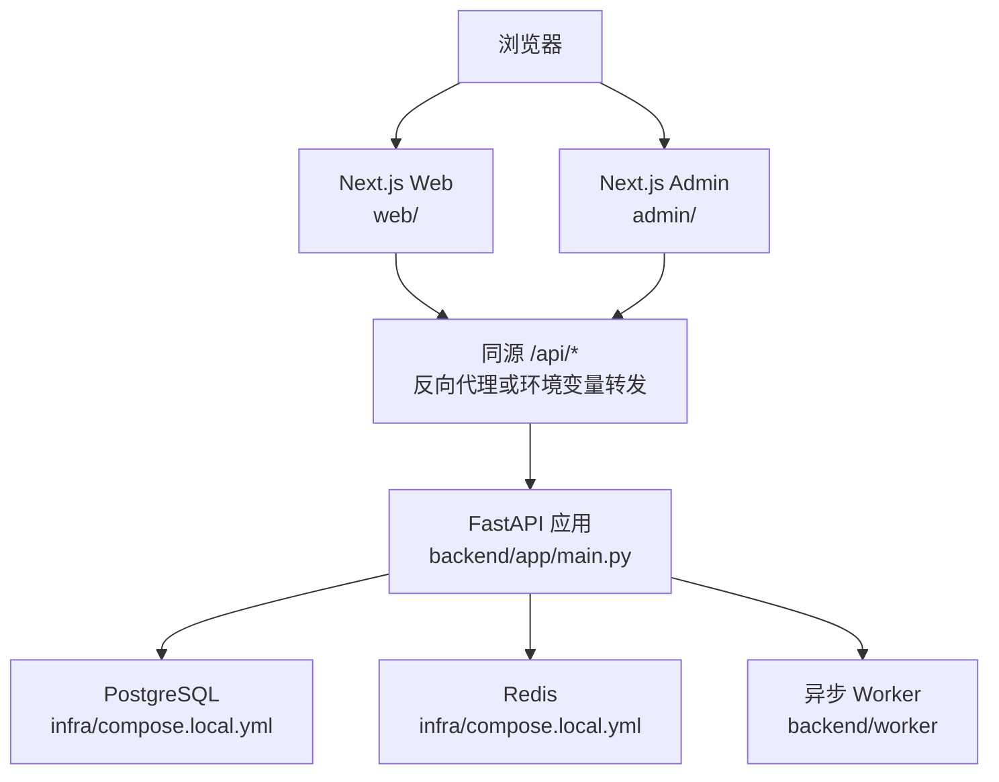
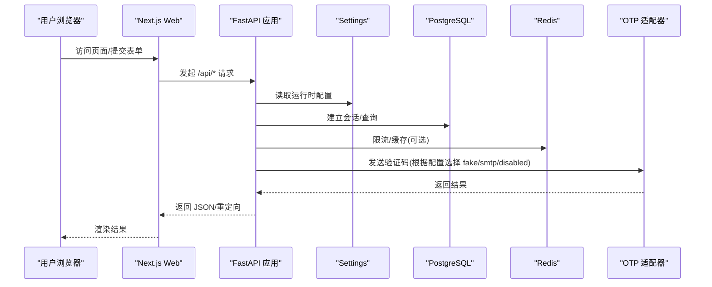
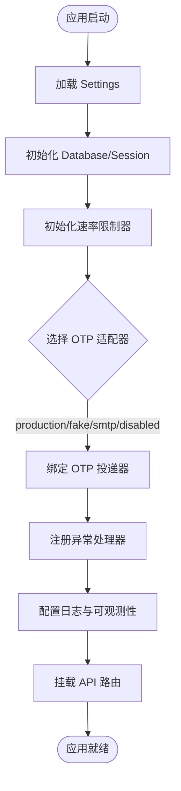
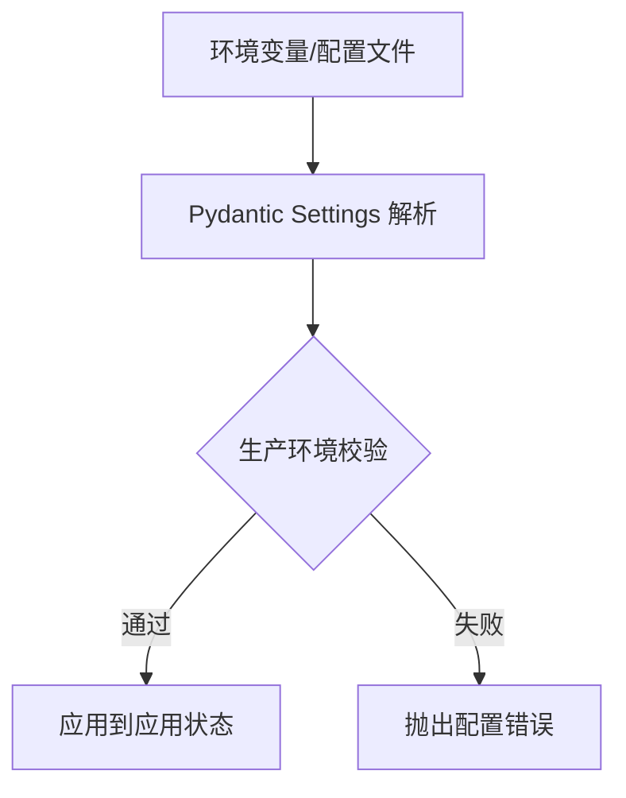
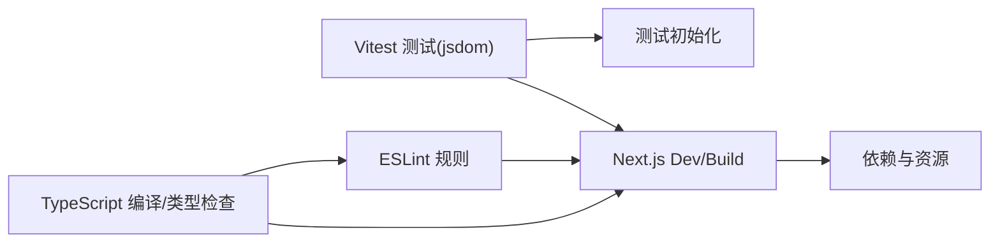
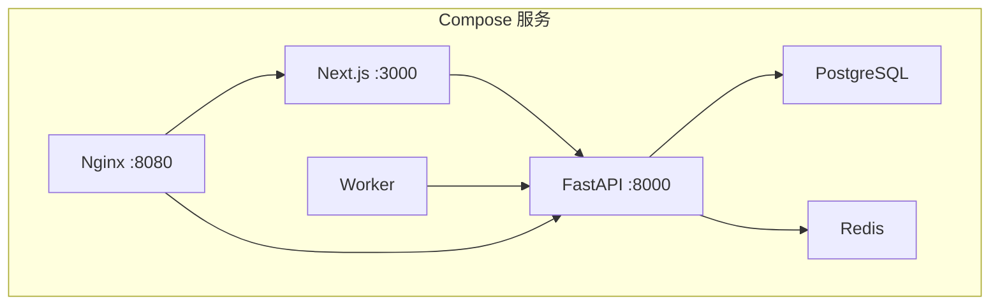
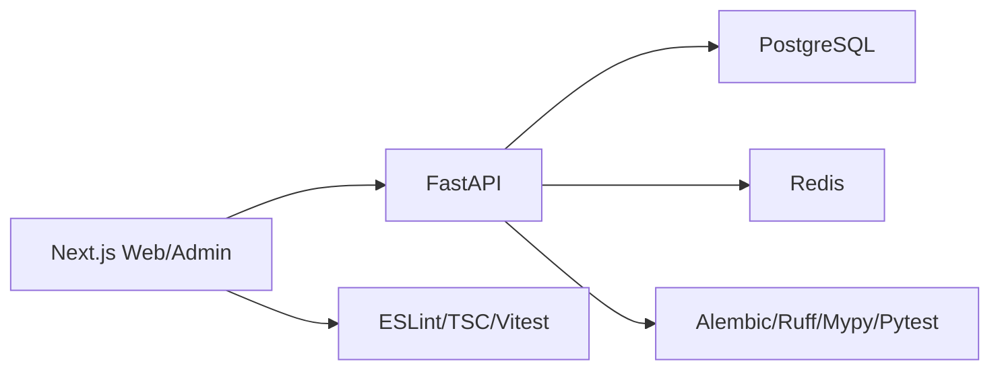

# 开发指南

<cite>
**本文引用的文件**
- [README.md](file://README.md)
- [Makefile](file://Makefile)
- [DESIGN.md](file://DESIGN.md)
- [backend/pyproject.toml](file://backend/pyproject.toml)
- [backend/app/config.py](file://backend/app/config.py)
- [backend/app/main.py](file://backend/app/main.py)
- [infra/compose.local.yml](file://infra/compose.local.yml)
- [web/package.json](file://web/package.json)
- [admin/package.json](file://admin/package.json)
- [web/tsconfig.json](file://web/tsconfig.json)
- [web/eslint.config.mjs](file://web/eslint.config.mjs)
- [web/vitest.config.ts](file://web/vitest.config.ts)
- [web/src/test/setup.ts](file://web/src/test/setup.ts)
- [admin/src/lib/env.ts](file://admin/src/lib/env.ts)
- [admin/src/components/env-badge.tsx](file://admin/src/components/env-badge.tsx)
- [.gitignore](file://.gitignore)
- [.dockerignore](file://.dockerignore)
- [docs/PHASE_0_GATES.md](file://docs/PHASE_0_GATES.md)
- [docs/plans/2026-08-10-test-deploy-and-branch-consolidation.md](file://docs/plans/2026-08-10-test-deploy-and-branch-consolidation.md)
</cite>

## 目录
1. [引言](#引言)
2. [项目结构](#项目结构)
3. [核心组件](#核心组件)
4. [架构总览](#架构总览)
5. [详细组件分析](#详细组件分析)
6. [依赖关系分析](#依赖关系分析)
7. [性能与可观测性](#性能与可观测性)
8. [故障排查指南](#故障排查指南)
9. [结论](#结论)
10. [附录：工作流、规范与最佳实践](#附录工作流规范与最佳实践)

## 引言
本指南面向新加入的开发者，目标是帮助你在最短时间内理解仓库的组织方式、本地开发环境、测试与质量门禁、前后端协作方式以及发布前的安全与合规要求。本项目采用“模块化单体后端 + 双前端（公共网站与管理后台）+ 独立 Worker”的架构，使用 FastAPI、Next.js、PostgreSQL、Redis 与 Docker Compose 进行本地一体化运行；通过 Alembic 管理数据库迁移，并通过 Makefile 统一测试、检查与构建入口。

## 项目结构
仓库按职责划分清晰：
- web：Next.js 公共网站（App Router），TypeScript + React，Vitest 单元测试，ESLint + TypeScript 类型检查。
- admin：独立的 Next.js 管理控制台，端口默认 3001。
- backend：FastAPI 模块化单体，包含 API、领域模块、Worker、Alembic 迁移与配置。
- contracts：OpenAPI 与 JSON Schema 合同，用于前后端契约校验。
- infra：Docker Compose、Nginx、系统服务与运行手册。
- tests/contract：跨模块合同测试。
- docs：产品蓝图、ADR、计划与发布证据。

**图示来源**
- [infra/compose.local.yml:31-89](file://infra/compose.local.yml#L31-L89)
- [backend/app/main.py:50-140](file://backend/app/main.py#L50-L140)

**章节来源**
- [README.md:24-35](file://README.md#L24-L35)
- [infra/compose.local.yml:1-93](file://infra/compose.local.yml#L1-L93)

## 核心组件
- 后端应用：FastAPI 应用工厂创建、路由挂载、异常处理、日志与请求可观测性安装、OTP 投递适配器选择、速率限制器初始化。
- 配置中心：基于 Pydantic Settings 的环境变量加载与安全校验，生产模式强制安全策略。
- 数据库与迁移：AsyncPG + SQLAlchemy，Alembic 管理版本化迁移。
- 前端：Next.js 公共站点与管理后台，分别提供开发与构建脚本。
- 基础设施：Docker Compose 编排 PostgreSQL、Redis、API、Worker、Web 与 Nginx 边缘层。

**章节来源**
- [backend/app/main.py:30-156](file://backend/app/main.py#L30-L156)
- [backend/app/config.py:62-335](file://backend/app/config.py#L62-L335)
- [backend/pyproject.toml:1-58](file://backend/pyproject.toml#L1-L58)
- [web/package.json:1-46](file://web/package.json#L1-L46)
- [admin/package.json:1-34](file://admin/package.json#L1-L34)
- [infra/compose.local.yml:1-93](file://infra/compose.local.yml#L1-L93)

## 架构总览
下图展示了从浏览器到后端服务的完整调用链，包括 OTP 适配器的动态选择与速率限制器的注入。

**图示来源**
- [backend/app/main.py:50-140](file://backend/app/main.py#L50-L140)
- [backend/app/config.py:62-149](file://backend/app/config.py#L62-L149)
- [infra/compose.local.yml:31-89](file://infra/compose.local.yml#L31-L89)

## 详细组件分析

### 后端应用启动与装配
- 应用工厂 create_app 负责：
  - 注入 Settings、Database、Session Factory。
  - 初始化 OTP 挑战存储与请求限流器。
  - 初始化各业务速率限制器（访客会话创建、阅读写入、档案写入、管理员登录）。
  - 根据 environment 与 otp_adapter 选择 OTP 投递适配器。
  - 注册全局异常处理器（ApiProblem、RequestValidationError）。
  - 配置日志级别并安装请求可观测性。
  - 挂载 API 路由，并定制 OpenAPI 文档以移除 422 响应。

**图示来源**
- [backend/app/main.py:30-156](file://backend/app/main.py#L30-L156)

**章节来源**
- [backend/app/main.py:30-156](file://backend/app/main.py#L30-L156)

### 配置与安全门
- Settings 集中管理所有运行时参数，支持环境变量前缀 MINGLI_，并对生产环境执行严格校验：
  - 强制 secure cookie、禁止 Fake OTP/Runtime/Model。
  - SMTP 必填字段校验。
  - 内容加密密钥与身份哈希密钥不得复用且必须为合法长度。
  - 模型供应商、端点、超时、温度、输出 token 上限等 P0 约束。
  - 生产环境固定 Runtime 路径与冻结 manifest/capability shape 摘要。
  - real_traffic_enabled 默认关闭，未满足外部 Gate 时拒绝开启。

**图示来源**
- [backend/app/config.py:62-335](file://backend/app/config.py#L62-L335)

**章节来源**
- [backend/app/config.py:62-335](file://backend/app/config.py#L62-L335)

### 前端工程与工具链
- 公共网站（web）：
  - Node 22+，Next.js App Router，TypeScript strict，Vitest 测试（jsdom），ESLint 基于 next-vitals/typescript。
  - 脚本：dev/build/start/lint/typecheck/test。
- 管理后台（admin）：
  - 独立 Next.js 应用，默认端口 3001，脚本类似。
- 类型与别名：
  - tsconfig 启用 strict、bundler 解析、@ 路径别名指向 src。
  - Vitest 配置启用 jsdom、全局 API、CSS 支持与 setup 文件。

**图示来源**
- [web/package.json:1-46](file://web/package.json#L1-L46)
- [admin/package.json:1-34](file://admin/package.json#L1-L34)
- [web/tsconfig.json:1-31](file://web/tsconfig.json#L1-L31)
- [web/eslint.config.mjs:1-11](file://web/eslint.config.mjs#L1-L11)
- [web/vitest.config.ts:1-21](file://web/vitest.config.ts#L1-L21)
- [web/src/test/setup.ts:1-1](file://web/src/test/setup.ts#L1-L1)

**章节来源**
- [web/package.json:1-46](file://web/package.json#L1-L46)
- [admin/package.json:1-34](file://admin/package.json#L1-L34)
- [web/tsconfig.json:1-31](file://web/tsconfig.json#L1-L31)
- [web/eslint.config.mjs:1-11](file://web/eslint.config.mjs#L1-L11)
- [web/vitest.config.ts:1-21](file://web/vitest.config.ts#L1-L21)

### 本地环境与容器编排
- 推荐本地运行：Node 22+、Python 3.12、uv、PostgreSQL 16；Docker 可选。
- Compose 提供：
  - PostgreSQL 16（健康检查、数据卷）。
  - Redis 7（无持久化，仅内存）。
  - API（FastAPI，暴露 8000）。
  - Worker（轮询间隔可调）。
  - Web（Next.js，暴露 3000）。
  - Edge（Nginx，聚合 8080）。
- 环境变量通过 compose 注入，敏感值由运行环境或 Secret Manager 注入。

**图示来源**
- [infra/compose.local.yml:1-93](file://infra/compose.local.yml#L1-L93)

**章节来源**
- [README.md:39-73](file://README.md#L39-L73)
- [infra/compose.local.yml:1-93](file://infra/compose.local.yml#L1-L93)

## 依赖关系分析
- 后端依赖：FastAPI、SQLAlchemy(asyncpg)、Alembic、Pydantic Settings、httpx、jsonschema、cryptography、uvicorn。
- 前端依赖：Next.js、React、Radix UI、Zod、React Hook Form、Lucide、motion、字体包。
- 测试与质量：pytest、ruff、mypy、vitest、eslint、tsc。
- 基础设施：PostgreSQL、Redis、Nginx、Docker。

**图示来源**
- [backend/pyproject.toml:1-58](file://backend/pyproject.toml#L1-L58)
- [web/package.json:1-46](file://web/package.json#L1-L46)
- [admin/package.json:1-34](file://admin/package.json#L1-L34)

**章节来源**
- [backend/pyproject.toml:1-58](file://backend/pyproject.toml#L1-L58)
- [web/package.json:1-46](file://web/package.json#L1-L46)
- [admin/package.json:1-34](file://admin/package.json#L1-L34)

## 性能与可观测性
- 日志与请求追踪：应用启动时配置日志级别并安装请求可观测性中间件。
- 速率限制：针对访客会话创建、阅读写入、档案写入、管理员登录等关键路径设置窗口限流。
- 模型调用超时与大小限制：连接、读取、整体超时与响应体大小均有上限，防止慢下游拖垮服务。
- 生产安全：禁止 Fake 适配器与本地密钥，强制 secure cookie 与固定 Runtime 路径。

**章节来源**
- [backend/app/main.py:115-140](file://backend/app/main.py#L115-L140)
- [backend/app/config.py:101-149](file://backend/app/config.py#L101-L149)
- [backend/app/config.py:188-329](file://backend/app/config.py#L188-L329)

## 故障排查指南
- 常见问题定位顺序：
  - 确认环境变量与 Secrets：检查 MINGLI_* 与 DEEPSEEK_API_KEY 是否注入正确。
  - 检查数据库连通与迁移：确保 alembic 升级到 head，PostgreSQL 健康。
  - 检查 OTP 适配器：local/test 可使用 fake，生产需 smtp 或 disabled。
  - 检查速率限制：若频繁被拒，查看对应限流器配置。
  - 检查模型调用：超时、响应大小、价格快照版本与货币是否符合约束。
  - 检查前端构建与类型检查：npm run lint/typecheck/build。
- 调试技巧：
  - 使用 make test/make check 快速验证后端与前端质量门。
  - 使用 Docker Compose 一键拉起完整链路，便于端到端复现。
  - 关注应用日志级别与请求可观测性输出。
- 安全边界：
  - 严禁提交 .env、密钥、证书、真实数据与运行时产物。
  - 生产流量在未满足外部 Gate 前保持关闭。

**章节来源**
- [README.md:75-113](file://README.md#L75-L113)
- [Makefile:1-47](file://Makefile#L1-L47)
- [infra/compose.local.yml:1-93](file://infra/compose.local.yml#L1-L93)
- [docs/PHASE_0_GATES.md:1-59](file://docs/PHASE_0_GATES.md#L1-L59)
- [.gitignore:1-36](file://.gitignore#L1-L36)
- [.dockerignore:1-15](file://.dockerignore#L1-L15)

## 结论
本项目通过清晰的模块边界、严格的配置校验与完善的本地编排，提供了稳定高效的开发体验。遵循本指南中的工作流、规范与质量门禁，可以显著降低回归风险并提升交付质量。在外部 Gate 全部闭环之前，生产流量应保持关闭，所有变更需经过测试与审查。

## 附录：工作流、规范与最佳实践

### 分支策略与合并策略
- 建议分支命名：
  - feature/xxx：新功能。
  - fix/xxx：缺陷修复。
  - docs/xxx：文档更新。
  - ops/xxx：基础设施与部署相关。
- 合并策略：
  - 功能分支合入 main 前需通过 make check 与独立测试 gate。
  - 变更应分组合并提交，避免将无关改动混入同一提交。
  - 基础设施变更需通过安全审查后再合并。

**章节来源**
- [docs/plans/2026-08-10-test-deploy-and-branch-consolidation.md:35-134](file://docs/plans/2026-08-10-test-deploy-and-branch-consolidation.md#L35-L134)

### 提交消息规范
- 建议格式：type(scope): subject
  - feat：新功能。
  - fix：缺陷修复。
  - docs：文档更新。
  - ops：基础设施与部署。
- 示例：
  - feat: expose phase 2 reading workflows
  - docs: record phase 2 candidate gates
  - ops: add test deployment runbook

**章节来源**
- [docs/plans/2026-08-10-test-deploy-and-branch-consolidation.md:96-126](file://docs/plans/2026-08-10-test-deploy-and-branch-consolidation.md#L96-L126)

### 代码审查流程
- 审查维度：
  - 标准审查：对照仓库指令、安全边界与质量门禁。
  - 规格审查：对照实施计划与发布说明，检查缺失或越界行为。
  - 部署输入审计：Nginx、SSH、证书、Compose、环境变量、迁移、备份、重启、健康检查与回滚说明。
- 阻塞问题必须在独立分支内修复，并保持最小变更范围。

**章节来源**
- [docs/plans/2026-08-10-test-deploy-and-branch-consolidation.md:45-70](file://docs/plans/2026-08-10-test-deploy-and-branch-consolidation.md#L45-L70)

### 编码规范与风格
- Python：
  - 使用 ruff 进行风格检查，目标 py312，行宽 100。
  - mypy 严格模式，启用 pydantic 插件。
  - pytest 严格配置与标记。
- TypeScript/JavaScript：
  - ESLint 基于 next-vitals/typescript，忽略构建产物。
  - TypeScript strict 模式，bundler 解析，路径别名 @。
  - Vitest 使用 jsdom 环境，启用 CSS 与全局 API。

**章节来源**
- [backend/pyproject.toml:32-58](file://backend/pyproject.toml#L32-L58)
- [web/eslint.config.mjs:1-11](file://web/eslint.config.mjs#L1-L11)
- [web/tsconfig.json:1-31](file://web/tsconfig.json#L1-L31)
- [web/vitest.config.ts:1-21](file://web/vitest.config.ts#L1-L21)

### 调试与热重载
- 后端：
  - uvicorn --reload 启用热重载，端口 8000。
  - 通过环境变量调整日志级别与适配器。
- 前端：
  - npm run dev 启动 Next.js 开发服务器，自动热重载。
  - 管理后台默认端口 3001。
- 容器：
  - docker compose 一键拉起完整链路，便于端到端调试。

**章节来源**
- [README.md:39-73](file://README.md#L39-L73)
- [web/package.json:9-15](file://web/package.json#L9-L15)
- [admin/package.json:9-14](file://admin/package.json#L9-L14)
- [infra/compose.local.yml:31-89](file://infra/compose.local.yml#L31-L89)

### 常见开发任务步骤
- 添加新功能：
  - 创建 feature 分支，实现后端 API 与前端页面。
  - 编写测试与类型检查，确保 make check 通过。
  - 提交符合规范的提交信息，触发审查。
- 修复 Bug：
  - 定位根因，最小化变更范围。
  - 补充测试用例，确保回归通过。
  - 提交 fix 分支并合入 main。
- 性能优化：
  - 识别瓶颈（数据库、模型调用、前端渲染）。
  - 增加限流、超时与缓存策略。
  - 通过日志与可观测性验证效果。

**章节来源**
- [Makefile:1-47](file://Makefile#L1-L47)
- [backend/app/config.py:101-149](file://backend/app/config.py#L101-L149)
- [backend/app/main.py:73-88](file://backend/app/main.py#L73-L88)

### 文档编写规范
- 代码注释：
  - 函数与类应有清晰的目的与参数说明。
  - 复杂逻辑需附流程图或注释说明。
- API 文档：
  - 使用 OpenAPI 描述接口，保持与实现一致。
  - 移除不必要的 422 响应以避免混淆。
- 用户手册：
  - 提供本地运行、部署与故障排查指南。
  - 记录环境变量与安全边界。

**章节来源**
- [backend/app/main.py:142-152](file://backend/app/main.py#L142-L152)
- [README.md:39-73](file://README.md#L39-L73)
- [docs/PHASE_0_GATES.md:1-59](file://docs/PHASE_0_GATES.md#L1-L59)

### 贡献者指南与社区参与
- 贡献流程：
  - Fork 仓库，创建功能分支。
  - 遵循提交规范与质量门禁。
  - 提交 Pull Request，等待审查与合并。
- 社区参与：
  - 参与设计讨论与架构决策（ADR）。
  - 报告问题与提出改进建议。
  - 遵守安全边界与合规要求。

**章节来源**
- [docs/adr/*.md](file://docs/adr/0001-use-a-modular-monolith-on-alibaba-cloud.md)
- [DESIGN.md:1-434](file://DESIGN.md#L1-L434)

### 环境与部署注意事项
- 环境变量：
  - 使用 MINGLI_* 前缀配置后端。
  - 管理后台通过 NEXT_PUBLIC_MINGLI_ENV 显示环境标识。
- 安全：
  - 禁止提交敏感文件与环境变量。
  - 生产环境强制 secure cookie 与固定 Runtime 路径。
- 容器：
  - 使用 Compose 编排服务，便于本地与测试环境一致性。

**章节来源**
- [backend/app/config.py:62-149](file://backend/app/config.py#L62-L149)
- [admin/src/lib/env.ts:1-9](file://admin/src/lib/env.ts#L1-L9)
- [admin/src/components/env-badge.tsx:1-16](file://admin/src/components/env-badge.tsx#L1-L16)
- [.gitignore:1-36](file://.gitignore#L1-L36)
- [.dockerignore:1-15](file://.dockerignore#L1-L15)
- [infra/compose.local.yml:1-93](file://infra/compose.local.yml#L1-L93)