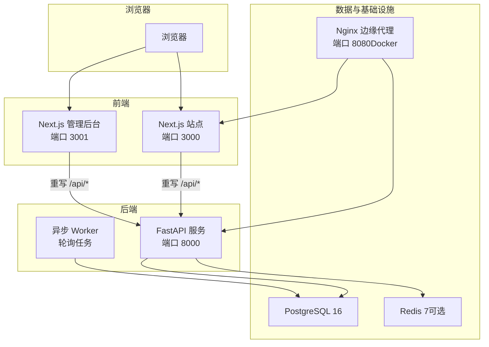
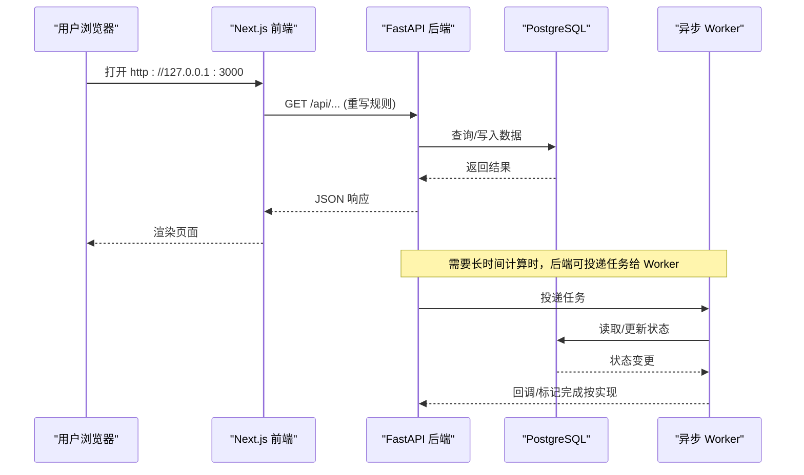
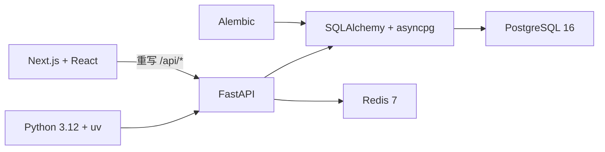

# 快速开始

<cite>
**本文引用的文件**
- [README.md](file://README.md)
- [Makefile](file://Makefile)
- [backend/pyproject.toml](file://backend/pyproject.toml)
- [web/package.json](file://web/package.json)
- [admin/package.json](file://admin/package.json)
- [backend/app/config.py](file://backend/app/config.py)
- [backend/app/main.py](file://backend/app/main.py)
- [backend/worker/main.py](file://backend/worker/main.py)
- [infra/compose.local.yml](file://infra/compose.local.yml)
- [infra/fateradar-test.env.example](file://infra/fateradar-test.env.example)
- [web/next.config.ts](file://web/next.config.ts)
- [admin/next.config.ts](file://admin/next.config.ts)
- [backend/alembic/env.py](file://backend/alembic/env.py)
</cite>

## 目录
1. [简介](#简介)
2. [项目结构](#项目结构)
3. [核心组件](#核心组件)
4. [架构总览](#架构总览)
5. [详细组件分析](#详细组件分析)
6. [依赖关系分析](#依赖关系分析)
7. [性能与启动建议](#性能与启动建议)
8. [故障排查指南](#故障排查指南)
9. [结论](#结论)
10. [附录：常用命令与环境变量](#附录：常用命令与环境变量)

## 简介
本指南面向首次接触 Mingli Web 的开发者，目标是在最短时间内完成本地环境搭建并运行完整应用。你将了解：
- 环境与工具要求（Node.js、Python、uv、PostgreSQL、可选 Docker Compose）
- 依赖安装、数据库迁移、服务启动的完整步骤
- 三个核心进程的职责：FastAPI 后端、异步 Worker、Next.js 前端
- 如何访问应用与配置环境变量
- 常见问题定位与解决
- 测试与质量检查命令

## 项目结构
仓库采用前后端分离与模块化单体设计：
- web：Next.js 用户站点（App Router + TypeScript）
- admin：Next.js 独立管理后台
- backend：FastAPI 模块化单体 API 与异步 Worker
- contracts：OpenAPI 与 JSON Schema 合同
- infra：本地容器编排、Nginx 与运行手册
- tests/contract：跨模块合同测试

图表来源
- [infra/compose.local.yml:1-93](file://infra/compose.local.yml#L1-L93)
- [web/next.config.ts:1-66](file://web/next.config.ts#L1-L66)
- [admin/next.config.ts:1-65](file://admin/next.config.ts#L1-L65)

章节来源
- [README.md:24-35](file://README.md#L24-L35)

## 核心组件
- FastAPI 后端服务：提供 REST API、鉴权、限流、健康检查、OpenAPI 文档等；通过 Alembic 管理数据库迁移。
- 异步 Worker 进程：从任务源拉取工作项并处理，支持单次执行或持续轮询模式。
- Next.js 前端应用：公共站点与管理后台，将相对 /api/* 请求重写至后端地址。

章节来源
- [backend/app/main.py:30-156](file://backend/app/main.py#L30-L156)
- [backend/worker/main.py:1-120](file://backend/worker/main.py#L1-L120)
- [web/next.config.ts:1-66](file://web/next.config.ts#L1-L66)
- [admin/next.config.ts:1-65](file://admin/next.config.ts#L1-L65)

## 架构总览
下图展示一次典型的用户请求在系统中的流转路径：浏览器访问前端，前端将 /api/* 请求转发到后端，后端读写数据库，必要时由 Worker 异步处理耗时任务。

图表来源
- [web/next.config.ts:31-38](file://web/next.config.ts#L31-L38)
- [backend/app/main.py:138-141](file://backend/app/main.py#L138-L141)
- [backend/worker/main.py:74-97](file://backend/worker/main.py#L74-L97)

## 详细组件分析

### 环境要求与本地安装
- 必需
  - Node.js 22+
  - Python 3.12
  - uv（Python 包管理与虚拟环境）
  - PostgreSQL 16
- 可选
  - Docker Compose（一键拉起 Postgres、Redis、API、Worker、Web、Nginx）

安装步骤（任选其一）：
- 使用 Makefile 一键安装所有依赖
  - 命令：make install
- 手动安装
  - 后端：uv sync --project backend --group dev
  - 前端与管理后台：npm install --prefix web && npm install --prefix admin

章节来源
- [README.md:39-54](file://README.md#L39-L54)
- [Makefile:13-16](file://Makefile#L13-L16)
- [web/package.json:6-15](file://web/package.json#L6-L15)
- [admin/package.json:6-15](file://admin/package.json#L6-L15)

### 数据库迁移
- 使用 Alembic 将数据库升级到最新版本
  - 命令：make migrate
  - 等价命令：uv run --project backend alembic -c backend/alembic.ini upgrade head
- 迁移会加载 Settings.database_url 并应用所有版本脚本

章节来源
- [Makefile:42-43](file://Makefile#L42-L43)
- [backend/alembic/env.py:20-58](file://backend/alembic/env.py#L20-L58)

### 启动三个核心进程
- FastAPI 后端服务
  - 命令：uv run --project backend uvicorn app.main:app --app-dir backend --reload --port 8000
  - 作用：提供 HTTP API、OpenAPI 文档、健康检查、限流、鉴权等
- 异步 Worker 进程
  - 命令：uv run --directory backend python -m worker.main --poll-interval 2
  - 作用：周期性拉取任务并处理，支持 --once 单次执行
- Next.js 前端应用
  - 命令：npm --prefix web run dev
  - 作用：开发服务器，默认监听 3000 端口，并将 /api/* 重写至后端

访问地址：http://127.0.0.1:3000

章节来源
- [README.md:49-54](file://README.md#L49-L54)
- [backend/app/main.py:50-56](file://backend/app/main.py#L50-L56)
- [backend/worker/main.py:81-97](file://backend/worker/main.py#L81-L97)
- [web/package.json:9-15](file://web/package.json#L9-L15)

### 使用 Docker Compose 一键启动
- 入口：infra/compose.local.yml
- 包含服务：postgres、redis、api、worker、web、edge（nginx）
- 默认端口：
  - 前端：127.0.0.1:3000
  - 后端 API：127.0.0.1:8000
  - 边缘代理：127.0.0.1:8080

章节来源
- [infra/compose.local.yml:1-93](file://infra/compose.local.yml#L1-L93)

### 环境变量与配置要点
- 后端配置统一来自 MINGLI_ 前缀的环境变量，并通过 pydantic-settings 校验与安全约束
  - 关键项示例：
    - MINGLI_DATABASE_URL：数据库连接串
    - MINGLI_OTP_ADAPTER：验证码适配器（local/test 可用 fake）
    - MINGLI_COOKIE_SECURE：生产环境必须为 true
    - MINGLI_IDENTITY_HASH_KEY、MINGLI_CONTENT_ENCRYPTION_KEY_B64：安全密钥
    - MINGLI_MODEL_ADAPTER、DEEPSEEK_API_KEY：模型适配器与密钥
- 前端重写后端地址：
  - 构建/运行时通过 BACKEND_INTERNAL_URL 决定 /api/* 的目标地址
  - 默认值：http://127.0.0.1:8000

章节来源
- [backend/app/config.py:62-149](file://backend/app/config.py#L62-L149)
- [backend/app/config.py:188-329](file://backend/app/config.py#L188-L329)
- [web/next.config.ts:3-5](file://web/next.config.ts#L3-L5)
- [admin/next.config.ts:3-5](file://admin/next.config.ts#L3-L5)
- [infra/fateradar-test.env.example:13-45](file://infra/fateradar-test.env.example#L13-L45)

### 测试与质量检查
- 统一入口
  - 测试：make test
  - 质量门：make check
- 后端
  - 测试：uv run --project backend pytest backend/tests tests/contract -q
  - 代码风格：ruff check --config backend/pyproject.toml backend tests
  - 类型检查：mypy --config-file backend/pyproject.toml backend/app backend/worker
- 前端与管理后台
  - 测试：npm --prefix web test
  - 代码风格：npm --prefix web run lint
  - 类型检查：npm --prefix web run typecheck
  - 构建：npm --prefix web run build

章节来源
- [Makefile:18-40](file://Makefile#L18-L40)
- [README.md:75-92](file://README.md#L75-L92)
- [backend/pyproject.toml:32-54](file://backend/pyproject.toml#L32-L54)

## 依赖关系分析
- 后端依赖
  - FastAPI、SQLAlchemy(asyncpg)、Alembic、Pydantic Settings、Uvicorn 等
- 前端依赖
  - Next.js、React、TypeScript、Vitest、ESLint
- 基础设施
  - PostgreSQL 16、Redis 7（可选）、Nginx（可选）

图表来源
- [backend/pyproject.toml:1-17](file://backend/pyproject.toml#L1-L17)
- [web/package.json:17-44](file://web/package.json#L17-L44)
- [infra/compose.local.yml:4-29](file://infra/compose.local.yml#L4-L29)

章节来源
- [backend/pyproject.toml:1-58](file://backend/pyproject.toml#L1-L58)
- [web/package.json:1-46](file://web/package.json#L1-L46)
- [infra/compose.local.yml:1-93](file://infra/compose.local.yml#L1-L93)

## 性能与启动建议
- 开发阶段
  - 使用 uvicorn --reload 开启热重载，便于快速迭代
  - Worker 使用较短轮询间隔（如 2 秒）提升任务吞吐
- 生产阶段
  - 确保 cookie_secure=true、禁用 fake 适配器、注入真实密钥
  - 合理设置模型超时与输出大小限制，避免长尾请求拖垮服务
- 资源隔离
  - 使用 Docker Compose 隔离数据库与缓存，避免本机端口冲突

[本节为通用建议，不直接分析具体文件]

## 故障排查指南
- 数据库迁移失败
  - 确认 MINGLI_DATABASE_URL 指向正确的 PostgreSQL 实例与库名
  - 使用 make migrate 重新升级；若历史 SQLite 开发库存在旧迁移 ID，需先修正 alembic_version 映射（仅针对旧 SQLite 开发库，不要对 PostgreSQL 执行）
  - 参考 README 中的迁移修复说明
- 端口冲突
  - 前端默认 3000、后端 8000、边缘代理 8080；修改端口后需同步更新 next.config.ts 中的 BACKEND_INTERNAL_URL
- 环境变量缺失或不合法
  - 生产环境禁止使用 fake OTP/Runtime/Model 适配器
  - 内容加密密钥必须为合法的 base64 且长度为 32 字节
  - 身份哈希密钥不得以 local-only- 开头
- 无法访问 /api/*
  - 检查前端 rewrites 是否生效，BACKEND_INTERNAL_URL 是否正确
  - 确认后端服务已启动且端口可达

章节来源
- [README.md:56-73](file://README.md#L56-L73)
- [backend/app/config.py:188-329](file://backend/app/config.py#L188-L329)
- [web/next.config.ts:31-38](file://web/next.config.ts#L31-L38)

## 结论
通过以上步骤，你可以在本地快速启动完整的 Mingli Web 应用，理解三大进程的职责与协作方式，并使用统一的命令进行迁移、测试与质量检查。遇到问题时，优先检查环境变量、端口与数据库连通性，再结合日志与 OpenAPI 文档定位问题。

[本节为总结，不直接分析具体文件]

## 附录：常用命令与环境变量

- 常用命令
  - 安装依赖：make install
  - 数据库迁移：make migrate
  - 启动后端：uv run --project backend uvicorn app.main:app --app-dir backend --reload --port 8000
  - 启动 Worker：uv run --directory backend python -m worker.main --poll-interval 2
  - 启动前端：npm --prefix web run dev
  - 运行测试：make test
  - 运行质量检查：make check

- 关键环境变量
  - MINGLI_DATABASE_URL：数据库连接串
  - MINGLI_OTP_ADAPTER：验证码适配器（local/test 可用 fake）
  - MINGLI_COOKIE_SECURE：生产环境必须为 true
  - MINGLI_IDENTITY_HASH_KEY、MINGLI_CONTENT_ENCRYPTION_KEY_B64：安全密钥
  - MINGLI_MODEL_ADAPTER、DEEPSEEK_API_KEY：模型适配器与密钥
  - BACKEND_INTERNAL_URL：前端重写 /api/* 的目标地址

章节来源
- [Makefile:13-46](file://Makefile#L13-L46)
- [backend/app/config.py:62-149](file://backend/app/config.py#L62-L149)
- [infra/fateradar-test.env.example:13-45](file://infra/fateradar-test.env.example#L13-L45)
- [web/next.config.ts:3-5](file://web/next.config.ts#L3-L5)