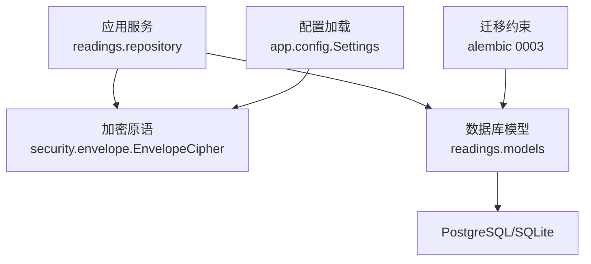
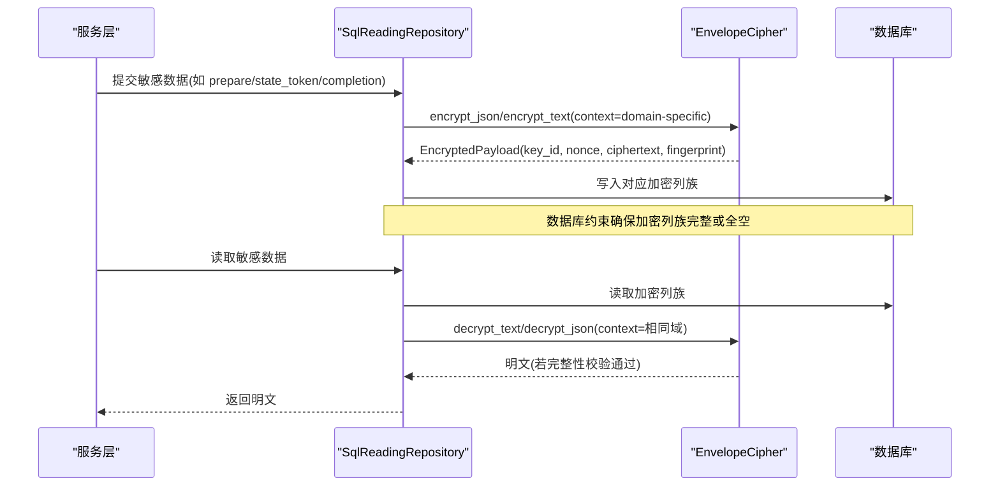
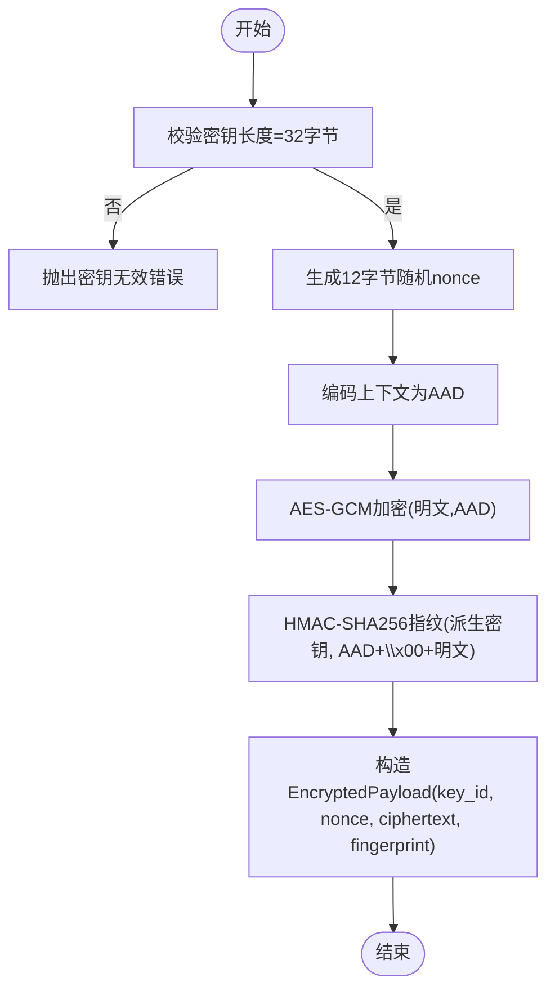
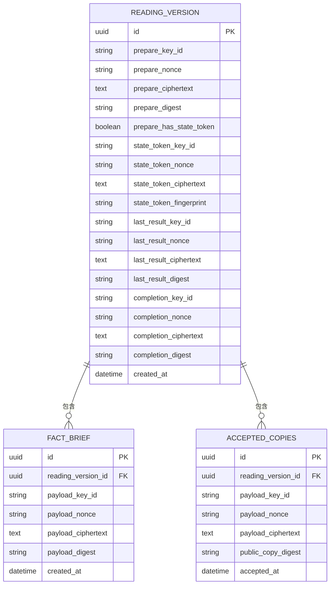
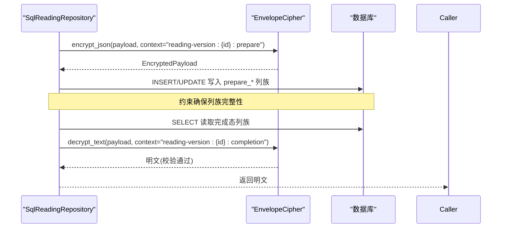
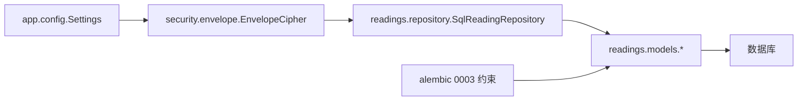

# 安全加密存储

<cite>
**本文引用的文件**
- [backend/app/security/envelope.py](file://backend/app/security/envelope.py)
- [backend/app/config.py](file://backend/app/config.py)
- [backend/app/readings/models.py](file://backend/app/readings/models.py)
- [backend/app/readings/repository.py](file://backend/app/readings/repository.py)
- [backend/alembic/versions/0003_reading_integrity_constraints.py](file://backend/alembic/versions/0003_reading_integrity_constraints.py)
- [backend/tests/test_sensitive_payloads.py](file://backend/tests/test_sensitive_payloads.py)
</cite>

## 目录
1. [简介](#简介)
2. [项目结构](#项目结构)
3. [核心组件](#核心组件)
4. [架构总览](#架构总览)
5. [详细组件分析](#详细组件分析)
6. [依赖关系分析](#依赖关系分析)
7. [性能考虑](#性能考虑)
8. [故障排查指南](#故障排查指南)
9. [结论](#结论)
10. [附录](#附录)

## 简介
本文件面向“安全加密存储”主题，系统性说明本项目在数据库中采用信封加密（Envelope Encryption）机制对敏感数据进行持久化保护与受控解密访问。重点覆盖：
- 敏感字段 state_token、last_result、completion 的加密实现与完整性校验
- payload_key_id、payload_nonce、payload_ciphertext 等字段的用途与安全保证
- 密钥管理、随机数生成与域分离上下文（AAD）策略
- 加密算法选择（AES-GCM）及配置约束
- 密钥轮换策略与泄露应急响应流程建议
- 加密数据的查询与分析方法
- 批量处理与性能优化最佳实践

## 项目结构
后端安全能力集中在 app/security 模块，数据库模型集中在 app/readings.models，仓库层负责将加密结果写入数据库并执行解密读取。配置模块集中管理内容加密密钥及其生产环境强制校验。迁移脚本通过数据库级约束保障加密字段集合的一致性。

图表来源
- [backend/app/readings/repository.py:51-54](file://backend/app/readings/repository.py#L51-L54)
- [backend/app/security/envelope.py:32-54](file://backend/app/security/envelope.py#L32-L54)
- [backend/app/readings/models.py:130-180](file://backend/app/readings/models.py#L130-L180)
- [backend/alembic/versions/0003_reading_integrity_constraints.py:17-44](file://backend/alembic/versions/0003_reading_integrity_constraints.py#L17-L44)

章节来源
- [backend/app/readings/repository.py:51-54](file://backend/app/readings/repository.py#L51-L54)
- [backend/app/security/envelope.py:32-54](file://backend/app/security/envelope.py#L32-L54)
- [backend/app/readings/models.py:130-180](file://backend/app/readings/models.py#L130-L180)
- [backend/alembic/versions/0003_reading_integrity_constraints.py:17-44](file://backend/alembic/versions/0003_reading_integrity_constraints.py#L17-L44)

## 核心组件
- 信封加密器 EnvelopeCipher：基于 AES-256-GCM 的 AEAD 加密，使用域分离上下文（AAD）和 HMAC 指纹进行完整性校验；提供文本与 JSON 加解密接口。
- 加密载荷 EncryptedPayload：包含 key_id、nonce、ciphertext、fingerprint 四个字段，用于持久化与传输。
- 数据库模型 ReadingVersion/FactBrief/AcceptedCopy 等：为不同阶段的敏感数据提供独立的加密列族（key_id/nonce/ciphertext/digest 或 fingerprint）。
- 仓库 SqlReadingRepository：封装加密写入与解密读取逻辑，统一上下文构造与完整性校验。
- 配置 Settings：强制要求生产环境注入有效的 32 字节内容加密密钥，禁止复用身份哈希密钥，并提供从设置构建 EnvelopeCipher 的方法。

章节来源
- [backend/app/security/envelope.py:24-121](file://backend/app/security/envelope.py#L24-L121)
- [backend/app/readings/models.py:130-180](file://backend/app/readings/models.py#L130-L180)
- [backend/app/readings/repository.py:817-861](file://backend/app/readings/repository.py#L817-L861)
- [backend/app/config.py:124-125](file://backend/app/config.py#L124-L125)
- [backend/app/config.py:217-236](file://backend/app/config.py#L217-L236)

## 架构总览
下图展示敏感数据从业务侧到数据库的加密写入与解密读取路径，以及完整性校验点。

图表来源
- [backend/app/readings/repository.py:139-167](file://backend/app/readings/repository.py#L139-L167)
- [backend/app/readings/repository.py:817-861](file://backend/app/readings/repository.py#L817-L861)
- [backend/app/security/envelope.py:56-96](file://backend/app/security/envelope.py#L56-L96)
- [backend/alembic/versions/0003_reading_integrity_constraints.py:17-44](file://backend/alembic/versions/0003_reading_integrity_constraints.py#L17-L44)

## 详细组件分析

### 信封加密器 EnvelopeCipher
- 算法与模式：AES-256-GCM（AEAD），使用 12 字节随机 nonce，AID 为域分离上下文字符串。
- 完整性校验：除 GCM Tag 外，额外计算 HMAC-SHA256 指纹（由派生密钥 + 上下文 + 明文拼接），防止密文被篡改或误用。
- 密钥来源：从 Settings.content_encryption_key_b64 解码得到 32 字节密钥，并使用 Settings.content_encryption_key_id 作为 key_id。
- 错误处理：解密失败（包括 tag 不匹配、base64 解析失败、上下文不一致）统一抛出 EnvelopeDecryptionError。

图表来源
- [backend/app/security/envelope.py:35-73](file://backend/app/security/envelope.py#L35-L73)
- [backend/app/security/envelope.py:75-96](file://backend/app/security/envelope.py#L75-L96)

章节来源
- [backend/app/security/envelope.py:32-121](file://backend/app/security/envelope.py#L32-L121)

### 数据库模型与字段语义
- ReadingVersion 中的三类敏感数据：
  - state_token：会话状态令牌，加密后保存于 state_token_* 列族，含 fingerprint。
  - last_result：最近一次中间结果，加密后保存于 last_result_* 列族，含 digest。
  - completion：最终接受副本，加密后保存于 completion_* 列族，含 digest。
- FactBrief 与 AcceptedCopy：
  - payload_key_id/payload_nonce/payload_ciphertext/payload_digest：通用载荷加密元数据与摘要。
- 一致性约束：迁移脚本通过 ALL_OR_NONE 约束确保任一加密列族要么全部为空，要么全部有值，避免半写导致的不可用。

图表来源
- [backend/app/readings/models.py:130-180](file://backend/app/readings/models.py#L130-L180)
- [backend/app/readings/models.py:225-244](file://backend/app/readings/models.py#L225-L244)
- [backend/alembic/versions/0003_reading_integrity_constraints.py:17-44](file://backend/alembic/versions/0003_reading_integrity_constraints.py#L17-L44)

章节来源
- [backend/app/readings/models.py:130-180](file://backend/app/readings/models.py#L130-L180)
- [backend/app/readings/models.py:225-244](file://backend/app/readings/models.py#L225-L244)
- [backend/alembic/versions/0003_reading_integrity_constraints.py:17-44](file://backend/alembic/versions/0003_reading_integrity_constraints.py#L17-L44)

### 仓库层读写流程
- 写入：
  - 根据领域阶段构造唯一上下文 context="reading-version:{version_id}:{phase}"，调用 EnvelopeCipher.encrypt_json/encrypt_text 获得 EncryptedPayload。
  - 将 key_id、nonce、ciphertext、digest/fingerprint 写入对应列族。
  - 对于 completion 首次写入，使用 digest 比较实现“首次写入获胜”的不可变记录语义。
- 读取：
  - 若所有加密列为空则返回 None；否则构造 EncryptedPayload，使用相同上下文解密，并通过指纹/摘要校验完整性。

图表来源
- [backend/app/readings/repository.py:139-167](file://backend/app/readings/repository.py#L139-L167)
- [backend/app/readings/repository.py:817-861](file://backend/app/readings/repository.py#L817-L861)

章节来源
- [backend/app/readings/repository.py:139-167](file://backend/app/readings/repository.py#L139-L167)
- [backend/app/readings/repository.py:817-861](file://backend/app/readings/repository.py#L817-L861)

### 密钥管理与配置约束
- 密钥来源：Settings.content_encryption_key_b64 必须为有效 base64，解码后严格等于 32 字节（AES-256）。
- 密钥标识：Settings.content_encryption_key_id 用于标记当前密钥版本，便于未来轮换识别。
- 生产环境强制：
  - 禁止使用本地默认密钥或 local-only-* 前缀的 key_id。
  - 禁止与 identity_hash_key 复用同一密钥。
  - 其他安全开关（如 cookie_secure、OTP 适配器）在生产环境强制启用。

章节来源
- [backend/app/config.py:124-125](file://backend/app/config.py#L124-L125)
- [backend/app/config.py:217-236](file://backend/app/config.py#L217-L236)

### 随机数生成与完整性校验
- 随机数：每次加密生成 12 字节随机 nonce，确保相同明文多次加密产生不同密文，防止重放与统计攻击。
- 完整性：
  - AES-GCM Tag 提供认证加密完整性。
  - 额外 HMAC-SHA256 指纹（由派生密钥 + 上下文 + 明文拼接）提供跨上下文隔离与防篡改校验。
  - 测试覆盖了随机 nonce、稳定指纹、错误上下文拒绝、篡改指纹拒绝等行为。

章节来源
- [backend/app/security/envelope.py:56-96](file://backend/app/security/envelope.py#L56-L96)
- [backend/tests/test_sensitive_payloads.py:9-40](file://backend/tests/test_sensitive_payloads.py#L9-L40)

### 字段用途与安全保证
- state_token/key_id/nonce/ciphertext/fingerprint：存储运行时状态令牌，具备域分离上下文与指纹校验，防止跨阶段重用。
- last_result/key_id/nonce/ciphertext/digest：存储中间结果，digest 用于比对是否一致，支持幂等控制。
- completion/key_id/nonce/ciphertext/digest：存储最终接受副本，digest 用于“首次写入获胜”的不可变语义。
- payload_key_id/payload_nonce/payload_ciphertext/payload_digest：FactBrief/AcceptedCopy 中通用载荷加密元数据与摘要，用于独立于主流程的敏感片段保护。

章节来源
- [backend/app/readings/models.py:130-180](file://backend/app/readings/models.py#L130-L180)
- [backend/app/readings/models.py:225-244](file://backend/app/readings/models.py#L225-L244)

## 依赖关系分析
- EnvelopeCipher 依赖 cryptography.hazmat.primitives.ciphers.aead.AESGCM 与标准库 hashlib/hmac/base64/os。
- SqlReadingRepository 依赖 EnvelopeCipher 与 SQLAlchemy 异步会话，负责将加密结果映射到模型列族。
- Settings 提供密钥与 key_id，并在生产环境进行强校验。
- Alembic 迁移通过 CHECK 约束保障各加密列族的原子性。

图表来源
- [backend/app/config.py:124-125](file://backend/app/config.py#L124-L125)
- [backend/app/security/envelope.py:32-54](file://backend/app/security/envelope.py#L32-L54)
- [backend/app/readings/repository.py:51-54](file://backend/app/readings/repository.py#L51-L54)
- [backend/app/readings/models.py:130-180](file://backend/app/readings/models.py#L130-L180)
- [backend/alembic/versions/0003_reading_integrity_constraints.py:17-44](file://backend/alembic/versions/0003_reading_integrity_constraints.py#L17-L44)

章节来源
- [backend/app/config.py:124-125](file://backend/app/config.py#L124-L125)
- [backend/app/security/envelope.py:32-54](file://backend/app/security/envelope.py#L32-L54)
- [backend/app/readings/repository.py:51-54](file://backend/app/readings/repository.py#L51-L54)
- [backend/app/readings/models.py:130-180](file://backend/app/readings/models.py#L130-L180)
- [backend/alembic/versions/0003_reading_integrity_constraints.py:17-44](file://backend/alembic/versions/0003_reading_integrity_constraints.py#L17-L44)

## 性能考虑
- 算法选择：AES-GCM 在现代硬件上具有良好吞吐，适合高并发场景。
- 随机数：使用系统熵源生成 12 字节 nonce，开销低且安全。
- 序列化：JSON 序列化使用紧凑分隔符与排序键，减少体积并提升可重复性。
- 批量处理建议：
  - 在事务内批量写入多个版本的加密列族，减少网络往返。
  - 对大对象分片存储，避免单行过大影响索引与备份。
  - 结合连接池与异步 I/O，降低锁竞争。
- 缓存策略：对频繁读取的公开副本（非敏感）可缓存，但敏感字段仅在内存中短暂存在后立即丢弃。

[本节为通用性能指导，不直接分析具体代码文件]

## 故障排查指南
- 解密失败常见原因：
  - 上下文不一致：解密时使用的 context 必须与加密时完全一致，否则会抛出 EnvelopeDecryptionError。
  - 密钥不匹配：key_id 与当前 EnvelopeCipher 的 key_id 不一致会拒绝解密。
  - 数据损坏：base64 解码失败或 GCM Tag 不匹配均会导致解密失败。
  - 指纹不匹配：HMAC 指纹校验失败表明数据被篡改或上下文错误。
- 定位步骤：
  - 检查加密时的 context 是否与解密时一致。
  - 核对数据库中 key_id 与当前运行实例的 content_encryption_key_id 是否一致。
  - 验证 nonce/ciphertext 是否为合法 base64。
  - 查看指纹/摘要是否一致，必要时重新加密。
- 相关测试用例参考：
  - 随机 nonce 与稳定指纹行为。
  - 错误上下文导致解密失败。
  - 篡改指纹导致解密失败。
  - 生产环境强制注入内容加密密钥。

章节来源
- [backend/app/security/envelope.py:75-96](file://backend/app/security/envelope.py#L75-L96)
- [backend/tests/test_sensitive_payloads.py:9-53](file://backend/tests/test_sensitive_payloads.py#L9-L53)

## 结论
本项目采用 AES-GCM 信封加密配合域分离上下文与 HMAC 指纹，对 state_token、last_result、completion 以及通用 payload 进行强安全的持久化保护。通过严格的配置校验与数据库约束，确保密钥安全、数据完整性与一致性。仓库层统一封装了加密写入与解密读取流程，便于扩展与维护。建议在后续演进中引入密钥轮换机制与审计日志，进一步提升长期安全性与可运维性。

[本节为总结性内容，不直接分析具体代码文件]

## 附录

### 密钥轮换策略（建议）
- 多密钥共存：保留历史 key_id，允许旧密文继续解密。
- 渐进式轮换：新写入使用新 key_id，后台任务按批次重加密为新的 key_id。
- 回滚预案：保留旧密钥一段时间，支持紧急回滚。
- 审计与告警：记录每次轮换事件与受影响记录数量。

[本节为概念性建议，不直接分析具体代码文件]

### 密钥泄露应急响应流程（建议）
- 立即停用泄露密钥，启用新密钥并更新配置。
- 评估受影响范围，优先轮换最高风险数据。
- 触发后台重加密任务，逐步替换旧密文。
- 加强访问控制与密钥保管（如使用 KMS/HSM）。
- 记录事件并进行复盘与加固。

[本节为概念性建议，不直接分析具体代码文件]

### 加密数据的查询与分析方法
- 仅能基于非敏感字段进行筛选与聚合（如 reading_version_id、status、capability_id 等）。
- 无法对密文字段进行精确匹配或模糊搜索；如需检索，应在明文阶段建立不可逆索引（如哈希）并妥善管理。
- 审计与分析应聚焦于元数据与计数指标，避免暴露明文内容。
- 导出与报表需脱敏，仅输出必要的安全摘要。

[本节为概念性建议，不直接分析具体代码文件]