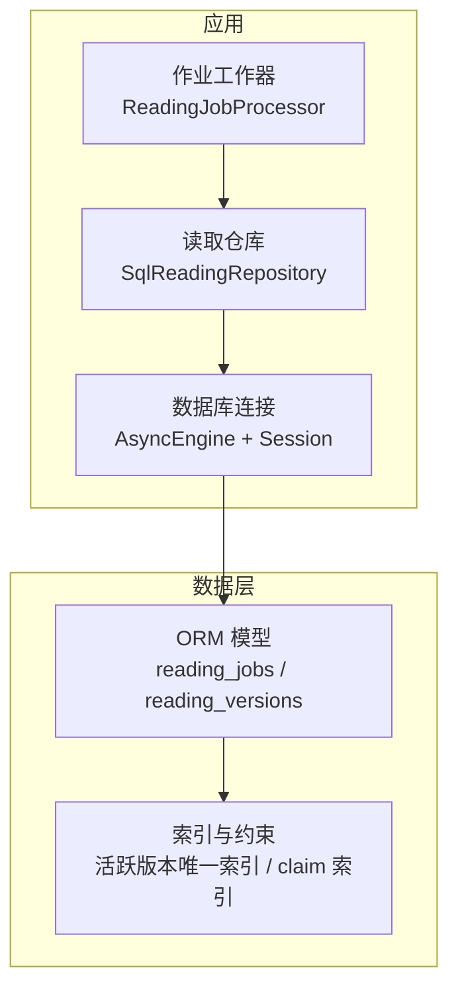
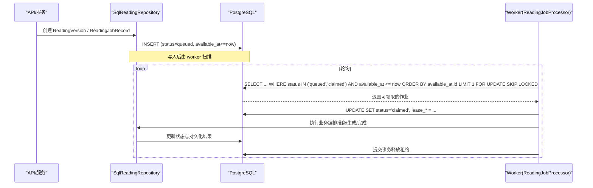
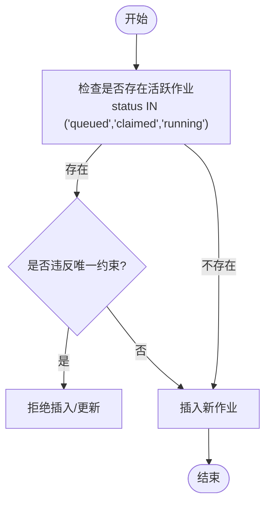
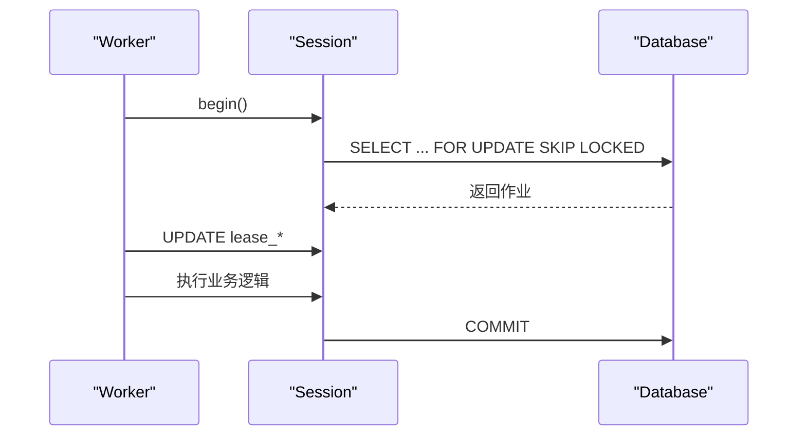
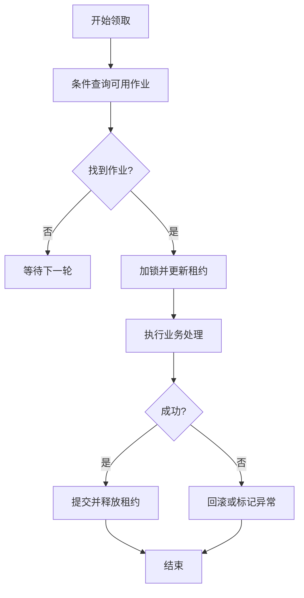
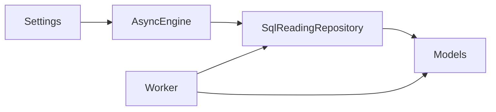

# 性能优化与索引

<cite>
**本文引用的文件**
- [backend/app/readings/models.py](file://backend/app/readings/models.py)
- [backend/app/readings/repository.py](file://backend/app/readings/repository.py)
- [backend/worker/readings.py](file://backend/worker/readings.py)
- [backend/app/database.py](file://backend/app/database.py)
- [backend/app/config.py](file://backend/app/config.py)
- [backend/alembic/env.py](file://backend/alembic/env.py)
- [backend/alembic/versions/0004_reading_job_fencing.py](file://backend/alembic/versions/0004_reading_job_fencing.py)
</cite>

## 目录
1. [简介](#简介)
2. [项目结构](#项目结构)
3. [核心组件](#核心组件)
4. [架构总览](#架构总览)
5. [详细组件分析](#详细组件分析)
6. [依赖关系分析](#依赖关系分析)
7. [性能考量](#性能考量)
8. [故障排查指南](#故障排查指南)
9. [结论](#结论)
10. [附录](#附录)

## 简介
本文件聚焦于数据库层面的性能优化与索引策略，围绕 reading_jobs 表的活跃版本唯一约束、claim 索引，以及 JSONB 字段在 dimension_ids、horizon、output_contract 等列上的使用场景与查询优化展开。同时说明连接池与事务管理策略（含异步并发控制与资源管理）、慢查询分析与监控方法、数据库维护任务（VACUUM、ANALYZE、统计信息更新）的最佳实践，并提供性能测试与基准测试指导。

## 项目结构
后端通过 SQLAlchemy 异步引擎与 session 工厂管理数据库连接；读取与编排层通过 repository 访问模型；工作进程 worker 负责领取并处理作业，利用条件索引与行级锁实现高并发下的安全 claim。

**图表来源**
- [backend/app/database.py:12-32](file://backend/app/database.py#L12-L32)
- [backend/app/readings/repository.py:51-81](file://backend/app/readings/repository.py#L51-L81)
- [backend/worker/readings.py:164-218](file://backend/worker/readings.py#L164-L218)
- [backend/app/readings/models.py:247-291](file://backend/app/readings/models.py#L247-L291)

**章节来源**
- [backend/app/database.py:12-32](file://backend/app/database.py#L12-L32)
- [backend/app/readings/models.py:247-291](file://backend/app/readings/models.py#L247-L291)
- [backend/worker/readings.py:164-218](file://backend/worker/readings.py#L164-L218)

## 核心组件
- 数据库连接与会话：提供异步引擎、会话工厂、健康探测与资源释放。
- 读取模型与索引：定义 reading_jobs、reading_versions 等表结构，包含活跃版本唯一约束与 claim 复合索引。
- 仓库层：封装读写逻辑，包括加锁、加密载荷存取、状态流转。
- 工作器：基于条件查询与行级锁进行作业领取、租约续期与完成提交。

**章节来源**
- [backend/app/database.py:12-32](file://backend/app/database.py#L12-L32)
- [backend/app/readings/models.py:84-159](file://backend/app/readings/models.py#L84-L159)
- [backend/app/readings/models.py:247-291](file://backend/app/readings/models.py#L247-L291)
- [backend/app/readings/repository.py:51-81](file://backend/app/readings/repository.py#L51-L81)
- [backend/worker/readings.py:63-82](file://backend/worker/readings.py#L63-L82)

## 架构总览
下图展示了作业从创建到被 worker 领取、执行、完成的完整流程，突出索引与锁的使用点。

**图表来源**
- [backend/app/readings/repository.py:200-224](file://backend/app/readings/repository.py#L200-L224)
- [backend/worker/readings.py:63-82](file://backend/worker/readings.py#L63-L82)
- [backend/worker/readings.py:175-218](file://backend/worker/readings.py#L175-L218)

## 详细组件分析

### reading_jobs 表索引与约束设计
- 活跃版本唯一索引（条件唯一索引）
  - 作用：保证同一 reading_version_id 在同一时刻最多只有一个“活跃”作业（状态为 queued/claimed/running），避免重复调度与竞态。
  - 机制：通过条件唯一约束在 PostgreSQL 上实现，仅对特定状态集合生效，降低无关状态的冲突成本。
- claim 复合索引
  - 作用：加速 worker 的领取查询，按 status 与 available_at 快速定位可执行作业，并按时间顺序优先。
  - 机制：复合索引覆盖 where 条件与 order by，减少全表扫描与排序开销。

**图表来源**
- [backend/app/readings/models.py:247-264](file://backend/app/readings/models.py#L247-L264)

**章节来源**
- [backend/app/readings/models.py:247-264](file://backend/app/readings/models.py#L247-L264)

### JSONB 字段的使用与优化
- dimension_ids（数组型 JSONB）
  - 场景：用于过滤或匹配维度集合（如 career、fortune 等）。
  - 优化建议：
    - 若频繁按元素存在性查询，考虑在 PostgreSQL 上建立 GIN 索引以支持 @> 或 ? 操作符。
    - 保持元素类型为字符串，避免混合类型导致索引失效。
- horizon（对象型 JSONB）
  - 场景：存储时间范围、周期等结构化参数。
  - 优化建议：
    - 针对常用键（如 start_date、end_date）建立表达式索引或使用 jsonb_path_ops。
    - 将高频查询条件下推至 SQL 层，避免在应用层解析大对象。
- output_contract（对象型 JSONB）
  - 场景：描述输出格式、字段映射等契约。
  - 优化建议：
    - 仅在必要字段上建立表达式索引，避免过度索引影响写性能。
    - 对只读展示路径做缓存或物化视图，降低重复解析成本。

注意：当前代码未显式创建上述 JSONB 索引；建议在评估查询计划后按需添加，并结合 EXPLAIN ANALYZE 验证收益。

**章节来源**
- [backend/app/readings/models.py:131-132](file://backend/app/readings/models.py#L131-L132)
- [backend/app/readings/models.py:274](file://backend/app/readings/models.py#L274)

### 连接池配置与事务管理
- 连接池
  - 使用异步引擎并启用 pool_pre_ping，确保连接健康检测，避免使用失效连接。
  - 默认连接池大小由驱动决定；在高并发场景下可根据 QPS 与延迟目标调整最大连接数与队列长度。
- 会话与事务
  - 每个请求/任务使用独立 AsyncSession，短生命周期持有，避免长事务阻塞。
  - 关键路径使用 with_for_update 与 SKIP LOCKED 实现无锁竞争的高吞吐领取。
  - 作业领取与完成在同一事务中提交，保证状态一致性。

**图表来源**
- [backend/app/database.py:12-32](file://backend/app/database.py#L12-L32)
- [backend/worker/readings.py:121-161](file://backend/worker/readings.py#L121-L161)
- [backend/worker/readings.py:175-218](file://backend/worker/readings.py#L175-L218)

**章节来源**
- [backend/app/database.py:12-32](file://backend/app/database.py#L12-L32)
- [backend/worker/readings.py:121-161](file://backend/worker/readings.py#L121-L161)
- [backend/worker/readings.py:175-218](file://backend/worker/readings.py#L175-L218)

### 作业领取与租约机制（Claim）
- 领取查询
  - 条件：status 为 queued 且 available_at 已到期，或 claimed 但租约过期。
  - 排序：available_at 升序、id 升序，保证公平性与时效性。
  - 锁定：FOR UPDATE SKIP LOCKED，避免多 worker 争抢同一行。
- 租约更新
  - 设置 lease_owner、lease_token、lease_expires_at，并在完成后清理。
  - 使用 lease_generation 与 token 双重校验，防止陈旧 worker 提交。

**图表来源**
- [backend/worker/readings.py:63-82](file://backend/worker/readings.py#L63-L82)
- [backend/worker/readings.py:121-161](file://backend/worker/readings.py#L121-L161)
- [backend/worker/readings.py:175-218](file://backend/worker/readings.py#L175-L218)

**章节来源**
- [backend/worker/readings.py:63-82](file://backend/worker/readings.py#L63-L82)
- [backend/worker/readings.py:121-161](file://backend/worker/readings.py#L121-L161)
- [backend/worker/readings.py:175-218](file://backend/worker/readings.py#L175-L218)

### 迁移与约束演进
- 作业租约完整性约束
  - 通过迁移脚本添加 lease_generation、lease_token 字段，并引入 check 约束保证租约三字段要么全空要么全有，避免不一致状态。
  - 历史数据清洗：将遗留非空租约字段重置为空，确保一致性。

**章节来源**
- [backend/alembic/versions/0004_reading_job_fencing.py:18-45](file://backend/alembic/versions/0004_reading_job_fencing.py#L18-L45)

## 依赖关系分析
- 模块耦合
  - worker 依赖 repository 与 models，通过 sqlalchemy 语句直接访问数据库，减少中间层开销。
  - repository 依赖 cipher 进行敏感数据加密/解密，确保 payload 安全。
- 外部依赖
  - 配置来自 Settings，包含 database_url 等运行时参数。
  - Alembic 迁移通过 env 加载所有模型元数据，确保 schema 一致。

**图表来源**
- [backend/app/config.py:62-74](file://backend/app/config.py#L62-L74)
- [backend/app/database.py:12-32](file://backend/app/database.py#L12-L32)
- [backend/app/readings/repository.py:51-81](file://backend/app/readings/repository.py#L51-L81)
- [backend/worker/readings.py:254-286](file://backend/worker/readings.py#L254-L286)

**章节来源**
- [backend/app/config.py:62-74](file://backend/app/config.py#L62-L74)
- [backend/app/database.py:12-32](file://backend/app/database.py#L12-L32)
- [backend/app/readings/repository.py:51-81](file://backend/app/readings/repository.py#L51-L81)
- [backend/worker/readings.py:254-286](file://backend/worker/readings.py#L254-L286)

## 性能考量
- 索引策略
  - 活跃版本唯一索引：避免重复调度，提升并发安全性。
  - claim 复合索引：显著降低领取查询的扫描与排序成本。
  - JSONB 索引：根据实际查询模式添加 GIN 或表达式索引，避免盲目索引。
- 查询优化
  - 使用 FOR UPDATE SKIP LOCKED 避免锁竞争热点。
  - 将复杂条件下推到数据库层，减少应用层计算。
- 连接池与事务
  - 合理设置连接池大小与超时，避免连接耗尽。
  - 短事务、批量提交，减少锁持有时间。
- 监控与分析
  - 定期运行 EXPLAIN ANALYZE 分析慢查询。
  - 关注 pg_stat_statements 中的高频慢查询与锁等待。
- 维护任务
  - VACUUM：定期回收死元组，避免表膨胀。
  - ANALYZE：更新统计信息，帮助优化器选择更优执行计划。
  - 统计信息：在大批量写入后及时更新，确保查询计划准确。

[本节为通用性能指导，不直接分析具体文件]

## 故障排查指南
- 常见错误
  - 唯一约束冲突：同一 reading_version_id 出现多个活跃作业，检查并发写入逻辑与索引有效性。
  - 租约丢失：worker 提交时 lease 校验失败，检查并发抢占与超时配置。
  - JSONB 查询缓慢：确认是否命中索引，必要时添加合适索引或改写查询。
- 诊断步骤
  - 使用 EXPLAIN ANALYZE 查看执行计划，关注扫描方式与索引使用情况。
  - 检查 pg_locks 与 pg_stat_activity，识别锁等待与长事务。
  - 核对 alembic 迁移是否完整执行，确保约束与索引存在。

**章节来源**
- [backend/worker/readings.py:175-218](file://backend/worker/readings.py#L175-L218)
- [backend/app/readings/models.py:247-264](file://backend/app/readings/models.py#L247-L264)

## 结论
通过合理的索引设计（活跃版本唯一索引与 claim 复合索引）、JSONB 字段的针对性优化、以及健壮的并发控制（FOR UPDATE SKIP LOCKED 与租约机制），系统在多 worker 环境下实现了高吞吐与强一致性。配合连接池调优、事务管理与定期维护任务，可进一步提升整体性能与稳定性。建议持续监控慢查询并迭代索引策略，确保长期性能表现。

[本节为总结性内容，不直接分析具体文件]

## 附录
- 配置项参考
  - database_url：数据库连接串，确保使用异步驱动。
  - 其他运行时参数：如模型超时、输出限制等，影响端到端延迟。
- 迁移环境
  - Alembic 通过 env 加载模型元数据，确保 schema 同步。

**章节来源**
- [backend/app/config.py:62-74](file://backend/app/config.py#L62-L74)
- [backend/alembic/env.py:17-48](file://backend/alembic/env.py#L17-L48)