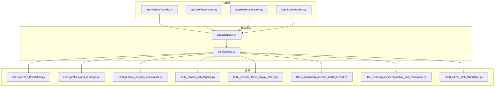
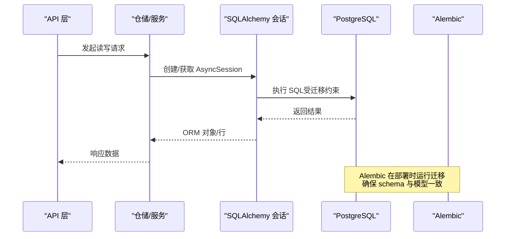
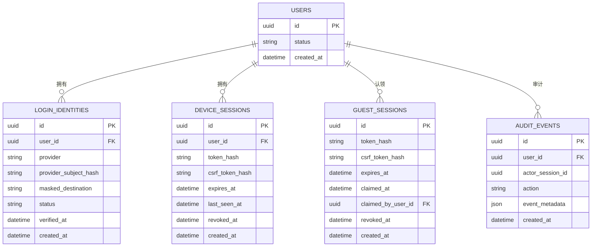
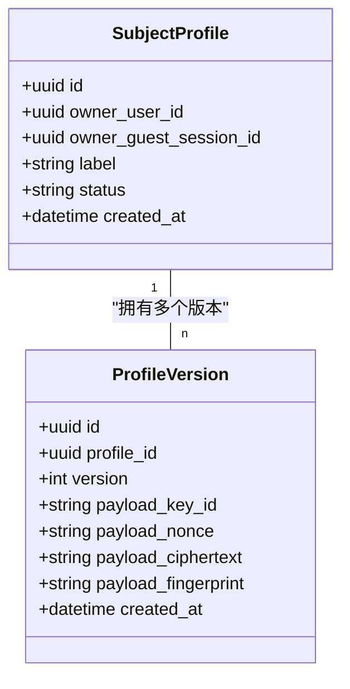
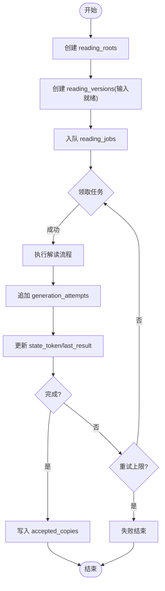
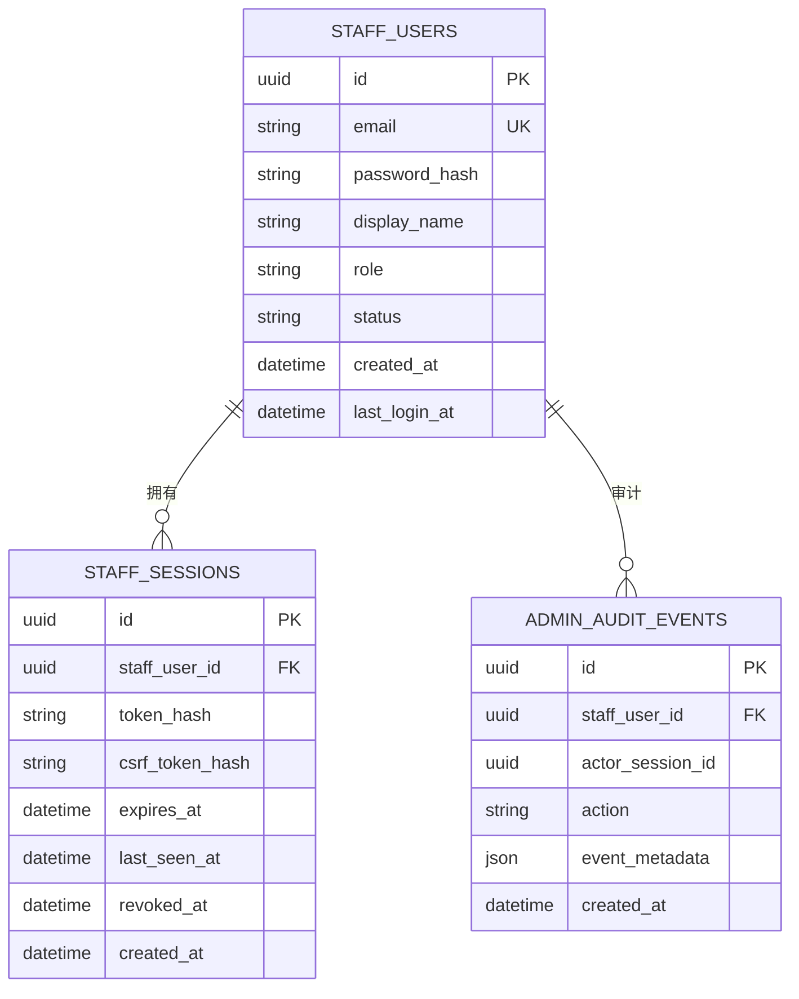
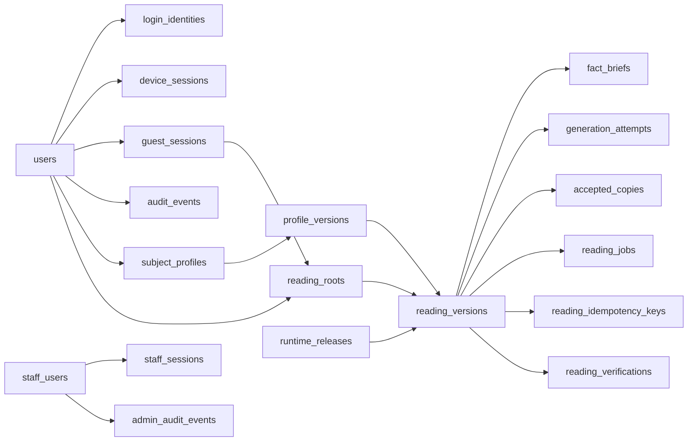
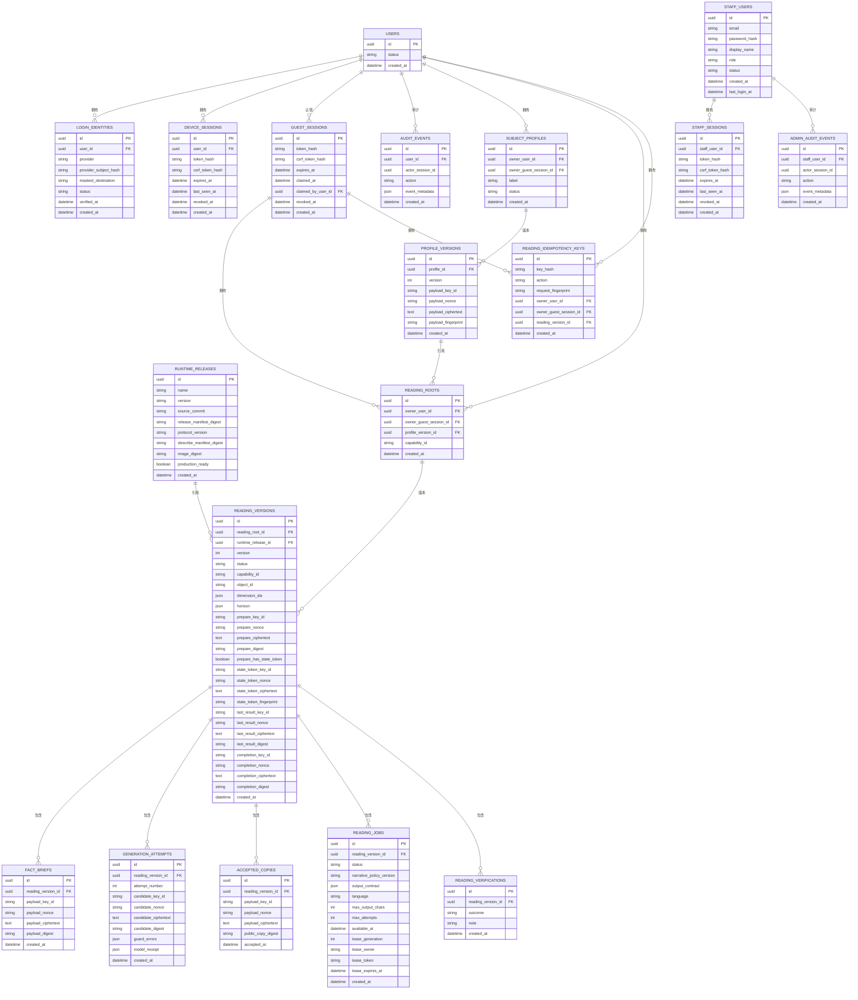

# 数据库设计

<cite>
**本文引用的文件**
- [backend/app/database.py](file://backend/app/database.py)
- [backend/alembic/env.py](file://backend/alembic/env.py)
- [backend/app/persistence.py](file://backend/app/persistence.py)
- [backend/app/identity/models.py](file://backend/app/identity/models.py)
- [backend/app/profiles/models.py](file://backend/app/profiles/models.py)
- [backend/app/readings/models.py](file://backend/app/readings/models.py)
- [backend/app/admin/models.py](file://backend/app/admin/models.py)
- [backend/alembic/versions/0001_identity_foundation.py](file://backend/alembic/versions/0001_identity_foundation.py)
- [backend/alembic/versions/0002_profiles_and_readings.py](file://backend/alembic/versions/0002_profiles_and_readings.py)
- [backend/alembic/versions/0003_reading_integrity_constraints.py](file://backend/alembic/versions/0003_reading_integrity_constraints.py)
- [backend/alembic/versions/0004_reading_job_fencing.py](file://backend/alembic/versions/0004_reading_job_fencing.py)
- [backend/alembic/versions/0005_prepare_token_replay_safety.py](file://backend/alembic/versions/0005_prepare_token_replay_safety.py)
- [backend/alembic/versions/0006_generation_attempt_model_receipt.py](file://backend/alembic/versions/0006_generation_attempt_model_receipt.py)
- [backend/alembic/versions/0007_reading_api_idempotency_and_verification.py](file://backend/alembic/versions/0007_reading_api_idempotency_and_verification.py)
- [backend/alembic/versions/0008_admin_staff_foundation.py](file://backend/alembic/versions/0008_admin_staff_foundation.py)
</cite>

## 目录
1. [简介](#简介)
2. [项目结构](#项目结构)
3. [核心组件](#核心组件)
4. [架构总览](#架构总览)
5. [详细组件分析](#详细组件分析)
6. [依赖关系分析](#依赖关系分析)
7. [性能考虑](#性能考虑)
8. [故障排查指南](#故障排查指南)
9. [结论](#结论)
10. [附录](#附录)

## 简介
本文件面向 PostgreSQL 数据库的实体关系与数据模型，围绕用户、档案（subject_profiles）、命理解读（readings）、管理员（staff）等核心实体进行系统化说明。文档覆盖表结构、字段类型、约束与索引、外键关系、不可变数据模型与版本控制、Alembic 迁移策略、数据访问模式与查询优化、安全与隐私、备份恢复、监控与维护最佳实践。目标是让非技术读者也能理解系统的数据组织方式，同时为工程师提供可操作的实现参考。

## 项目结构
后端使用 SQLAlchemy ORM 定义模型并通过 Alembic 管理迁移；数据库连接通过异步引擎与会话工厂统一管理。核心模型分布在 identity、profiles、readings、admin 四个模块中，分别对应身份与会话、用户档案及其加密版本、命理解读生命周期与作业调度、以及管理员与审计。

图表来源
- [backend/app/database.py:12-32](file://backend/app/database.py#L12-L32)
- [backend/alembic/env.py:17-58](file://backend/alembic/env.py#L17-L58)

章节来源
- [backend/app/database.py:12-32](file://backend/app/database.py#L12-L32)
- [backend/alembic/env.py:17-58](file://backend/alembic/env.py#L17-L58)

## 核心组件
- 身份与会话：users、login_identities、device_sessions、guest_sessions、audit_events
- 档案与版本：subject_profiles、profile_versions（不可变）
- 命理解读：reading_roots、reading_versions（不可变）、fact_briefs（不可变）、generation_attempts（不可变）、accepted_copies（不可变）、reading_jobs、reading_idempotency_keys、reading_verifications
- 运行时发布：runtime_releases
- 管理员：staff_users、staff_sessions、admin_audit_events

这些组件共同支撑“不可变数据 + 版本化”的设计：关键业务数据以追加写入的方式记录历史，通过 version 或 attempt_number 等字段形成时间线，避免就地修改，确保可追溯性与一致性。

章节来源
- [backend/app/identity/models.py:31-132](file://backend/app/identity/models.py#L31-L132)
- [backend/app/profiles/models.py:21-79](file://backend/app/profiles/models.py#L21-L79)
- [backend/app/readings/models.py:28-378](file://backend/app/readings/models.py#L28-L378)
- [backend/app/admin/models.py:17-81](file://backend/app/admin/models.py#L17-L81)

## 架构总览
下图展示了从 API 到数据库的关键路径：API 调用进入服务层后，通过会话访问 ORM 模型，最终由 Alembic 管理的迁移保证数据库结构与代码一致。

图表来源
- [backend/app/database.py:12-32](file://backend/app/database.py#L12-L32)
- [backend/alembic/env.py:17-58](file://backend/alembic/env.py#L17-L58)

## 详细组件分析

### 身份与会话域
- users：用户主表，包含 id、status、created_at
- login_identities：登录标识，关联 user_id，唯一约束 provider + provider_subject_hash，便于多提供者统一
- device_sessions：设备会话，存储 token_hash、csrf_token_hash、过期与撤销时间
- guest_sessions：访客会话，支持被认领到正式用户
- audit_events：用户行为审计事件，JSON 元数据

关键约束与索引
- 外键：login_identities、device_sessions、guest_sessions、audit_events 均指向 users
- 唯一性：token_hash 唯一，provider+subject_hash 唯一
- 索引：按 user_id、expires_at、user_id 建立常用查询索引

图表来源
- [backend/app/identity/models.py:31-132](file://backend/app/identity/models.py#L31-L132)
- [backend/alembic/versions/0001_identity_foundation.py:19-123](file://backend/alembic/versions/0001_identity_foundation.py#L19-L123)

章节来源
- [backend/app/identity/models.py:31-132](file://backend/app/identity/models.py#L31-L132)
- [backend/alembic/versions/0001_identity_foundation.py:19-123](file://backend/alembic/versions/0001_identity_foundation.py#L19-L123)

### 档案与版本（不可变）
- subject_profiles：档案主体，owner_user_id 与 owner_guest_session_id 二选一（检查约束）
- profile_versions：档案的加密版本，包含 key_id、nonce、ciphertext、fingerprint，且不可更新（ORM before_update 拦截抛出异常）

图表来源
- [backend/app/profiles/models.py:21-79](file://backend/app/profiles/models.py#L21-L79)
- [backend/alembic/versions/0002_profiles_and_readings.py:28-72](file://backend/alembic/versions/0002_profiles_and_readings.py#L28-L72)

章节来源
- [backend/app/profiles/models.py:21-79](file://backend/app/profiles/models.py#L21-L79)
- [backend/alembic/versions/0002_profiles_and_readings.py:28-72](file://backend/alembic/versions/0002_profiles_and_readings.py#L28-L72)

### 命理解读（不可变 + 工作流）
- runtime_releases：运行时发布物登记，用于锁定生成过程使用的模型/协议版本
- reading_roots：解读根记录，绑定 owner 与 profile_version_id，capability_id 表示能力维度
- reading_versions：解读版本，包含 prepare/state_token/last_result/completion 等多组加密信封字段，并带有完整性检查约束
- fact_briefs、generation_attempts、accepted_copies：均为不可变追加记录，保障可审计与可回溯
- reading_jobs：解读任务队列，支持 lease fencing（lease_owner、lease_token、lease_expires_at、lease_generation），状态机驱动
- reading_idempotency_keys：幂等键映射，防止重复提交
- reading_verifications：用户反馈（接受/部分/不同意/未知），独立于命令流

图表来源
- [backend/app/readings/models.py:53-378](file://backend/app/readings/models.py#L53-L378)
- [backend/alembic/versions/0002_profiles_and_readings.py:96-289](file://backend/alembic/versions/0002_profiles_and_readings.py#L96-L289)
- [backend/alembic/versions/0003_reading_integrity_constraints.py:47-87](file://backend/alembic/versions/0003_reading_integrity_constraints.py#L47-L87)
- [backend/alembic/versions/0004_reading_job_fencing.py:25-45](file://backend/alembic/versions/0004_reading_job_fencing.py#L25-L45)
- [backend/alembic/versions/0005_prepare_token_replay_safety.py:19-30](file://backend/alembic/versions/0005_prepare_token_replay_safety.py#L19-L30)
- [backend/alembic/versions/0006_generation_attempt_model_receipt.py:19-26](file://backend/alembic/versions/0006_generation_attempt_model_receipt.py#L19-L26)
- [backend/alembic/versions/0007_reading_api_idempotency_and_verification.py:24-100](file://backend/alembic/versions/0007_reading_api_idempotency_and_verification.py#L24-L100)

章节来源
- [backend/app/readings/models.py:53-378](file://backend/app/readings/models.py#L53-L378)
- [backend/alembic/versions/0002_profiles_and_readings.py:96-289](file://backend/alembic/versions/0002_profiles_and_readings.py#L96-L289)
- [backend/alembic/versions/0003_reading_integrity_constraints.py:47-87](file://backend/alembic/versions/0003_reading_integrity_constraints.py#L47-L87)
- [backend/alembic/versions/0004_reading_job_fencing.py:25-45](file://backend/alembic/versions/0004_reading_job_fencing.py#L25-L45)
- [backend/alembic/versions/0005_prepare_token_replay_safety.py:19-30](file://backend/alembic/versions/0005_prepare_token_replay_safety.py#L19-L30)
- [backend/alembic/versions/0006_generation_attempt_model_receipt.py:19-26](file://backend/alembic/versions/0006_generation_attempt_model_receipt.py#L19-L26)
- [backend/alembic/versions/0007_reading_api_idempotency_and_verification.py:24-100](file://backend/alembic/versions/0007_reading_api_idempotency_and_verification.py#L24-L100)

### 管理员域
- staff_users：管理员账号，含 email、password_hash、role、status
- staff_sessions：管理员会话，token_hash、csrf_token_hash、过期与撤销
- admin_audit_events：管理员操作审计，JSON 元数据

图表来源
- [backend/app/admin/models.py:17-81](file://backend/app/admin/models.py#L17-L81)
- [backend/alembic/versions/0008_admin_staff_foundation.py:19-103](file://backend/alembic/versions/0008_admin_staff_foundation.py#L19-L103)

章节来源
- [backend/app/admin/models.py:17-81](file://backend/app/admin/models.py#L17-L81)
- [backend/alembic/versions/0008_admin_staff_foundation.py:19-103](file://backend/alembic/versions/0008_admin_staff_foundation.py#L19-L103)

## 依赖关系分析
- 模型继承自 Base，统一命名约定与元数据
- 所有表通过外键保持引用完整性，常见 ondelete 策略：
  - CASCADE：删除用户/会话级联清理其子记录
  - RESTRICT：保护已发布的运行时版本不被误删
  - SET NULL：审计/访客认领等场景允许置空
- 大量 CheckConstraint 保证“全有或全无”的加密信封一致性、所有者唯一性、状态枚举合法性
- 唯一约束与复合索引保障幂等键、活跃任务唯一性等关键业务规则

图表来源
- [backend/app/identity/models.py:31-132](file://backend/app/identity/models.py#L31-L132)
- [backend/app/profiles/models.py:21-79](file://backend/app/profiles/models.py#L21-L79)
- [backend/app/readings/models.py:28-378](file://backend/app/readings/models.py#L28-L378)
- [backend/app/admin/models.py:17-81](file://backend/app/admin/models.py#L17-L81)

章节来源
- [backend/app/identity/models.py:31-132](file://backend/app/identity/models.py#L31-L132)
- [backend/app/profiles/models.py:21-79](file://backend/app/profiles/models.py#L21-L79)
- [backend/app/readings/models.py:28-378](file://backend/app/readings/models.py#L28-L378)
- [backend/app/admin/models.py:17-81](file://backend/app/admin/models.py#L17-L81)

## 性能考虑
- 连接池与会话
  - 使用异步引擎与 sessionmaker，expire_on_commit=False 减少不必要的刷新开销
  - 启用 pool_pre_ping 提升连接健康检测能力
- 索引策略
  - 高频过滤列建立索引：如 guest_sessions.expires_at、各表的 user_id/staff_user_id
  - 条件唯一索引：reading_jobs 对 active 状态的 reading_version_id 唯一，避免并发冲突
  - 复合索引：reading_jobs(status, available_at) 加速任务领取
- 查询优化建议
  - 优先使用 JSONB 查询（PostgreSQL 下自动选择 JSONB）
  - 对大文本字段（ciphertext）避免 SELECT *，按需投影
  - 对读取密集型报表，考虑物化视图或归档策略
- 慢查询分析
  - 开启 pg_stat_statements 跟踪热点 SQL
  - 结合 EXPLAIN ANALYZE 分析扫描计划，关注顺序扫描与缺失索引
  - 定期统计信息更新（ANALYZE）

章节来源
- [backend/app/database.py:12-32](file://backend/app/database.py#L12-L32)
- [backend/app/readings/models.py:247-291](file://backend/app/readings/models.py#L247-L291)
- [backend/app/identity/models.py:68-110](file://backend/app/identity/models.py#L68-L110)

## 故障排查指南
- 不可变记录错误
  - 当尝试更新被标记为不可变的记录（如 ProfileVersion、FactBrief、GenerationAttempt、AcceptedCopy）时，会抛出 ImmutableRecordError
  - 排查要点：确认是否误用 UPDATE；应改为插入新版本或新尝试
- 任务锁争用
  - reading_jobs 的 lease 字段需满足“全有或全无”约束；若出现不一致，检查迁移与并发逻辑
  - 使用 uq_reading_jobs_active_version 条件唯一索引避免同一解读版本并发处理
- 幂等键冲突
  - reading_idempotency_keys 基于 key_hash + owner 唯一；重复提交将触发唯一约束冲突
  - 排查：核对客户端幂等键生成策略与 owner 传递是否正确
- 审计与追踪
  - 通过 audit_events 与 admin_audit_events 的 JSON 元数据定位问题上下文
  - 结合 created_at 排序与 user_id/staff_user_id 筛选

章节来源
- [backend/app/persistence.py:1-3](file://backend/app/persistence.py#L1-L3)
- [backend/app/profiles/models.py:77-79](file://backend/app/profiles/models.py#L77-L79)
- [backend/app/readings/models.py:370-378](file://backend/app/readings/models.py#L370-L378)
- [backend/alembic/versions/0003_reading_integrity_constraints.py:47-87](file://backend/alembic/versions/0003_reading_integrity_constraints.py#L47-L87)
- [backend/alembic/versions/0004_reading_job_fencing.py:25-45](file://backend/alembic/versions/0004_reading_job_fencing.py#L25-L45)
- [backend/alembic/versions/0007_reading_api_idempotency_and_verification.py:24-67](file://backend/alembic/versions/0007_reading_api_idempotency_and_verification.py#L24-L67)

## 结论
本数据库设计以“不可变 + 版本化”为核心，通过严格的检查约束、唯一约束与外键关系，确保数据一致性与可追溯性。Alembic 迁移将演进过程显式化，配合幂等键与任务锁机制，使高并发下的解读流程具备鲁棒性。建议在运维侧持续完善监控、备份与性能调优，以支撑生产环境的稳定运行。

## 附录

### 实体关系图（ERD）

图表来源
- [backend/app/identity/models.py:31-132](file://backend/app/identity/models.py#L31-L132)
- [backend/app/profiles/models.py:21-79](file://backend/app/profiles/models.py#L21-L79)
- [backend/app/readings/models.py:28-378](file://backend/app/readings/models.py#L28-L378)
- [backend/app/admin/models.py:17-81](file://backend/app/admin/models.py#L17-L81)

### 数据访问模式与连接配置
- 使用异步引擎与会话工厂，统一暴露 probe/dispose/session 方法
- 迁移环境通过 async_engine_from_config 构建引擎并运行迁移
- 建议在生产环境根据负载调整连接池大小与超时参数

章节来源
- [backend/app/database.py:12-32](file://backend/app/database.py#L12-L32)
- [backend/alembic/env.py:42-58](file://backend/alembic/env.py#L42-L58)

### 迁移管理与版本控制
- 迁移按序编号，描述清晰，包含 upgrade/downgrade
- 目标元数据来自 Base.metadata，确保与 ORM 模型同步
- 新增字段与约束通过迁移增量添加，避免破坏性变更

章节来源
- [backend/alembic/env.py:17-58](file://backend/alembic/env.py#L17-L58)
- [backend/alembic/versions/0001_identity_foundation.py:19-123](file://backend/alembic/versions/0001_identity_foundation.py#L19-L123)
- [backend/alembic/versions/0002_profiles_and_readings.py:28-289](file://backend/alembic/versions/0002_profiles_and_readings.py#L28-L289)
- [backend/alembic/versions/0003_reading_integrity_constraints.py:47-87](file://backend/alembic/versions/0003_reading_integrity_constraints.py#L47-L87)
- [backend/alembic/versions/0004_reading_job_fencing.py:25-45](file://backend/alembic/versions/0004_reading_job_fencing.py#L25-L45)
- [backend/alembic/versions/0005_prepare_token_replay_safety.py:19-30](file://backend/alembic/versions/0005_prepare_token_replay_safety.py#L19-L30)
- [backend/alembic/versions/0006_generation_attempt_model_receipt.py:19-26](file://backend/alembic/versions/0006_generation_attempt_model_receipt.py#L19-L26)
- [backend/alembic/versions/0007_reading_api_idempotency_and_verification.py:24-100](file://backend/alembic/versions/0007_reading_api_idempotency_and_verification.py#L24-L100)
- [backend/alembic/versions/0008_admin_staff_foundation.py:19-103](file://backend/alembic/versions/0008_admin_staff_foundation.py#L19-L103)

### 数据安全与隐私
- 敏感数据采用加密信封存储（key_id、nonce、ciphertext、digest/fingerprint），并通过检查约束保证完整性
- 会话与令牌仅存储哈希值，降低泄露风险
- 审计事件记录用户与管理员操作，便于合规与溯源

章节来源
- [backend/app/profiles/models.py:49-79](file://backend/app/profiles/models.py#L49-L79)
- [backend/app/readings/models.py:84-159](file://backend/app/readings/models.py#L84-L159)
- [backend/app/identity/models.py:68-110](file://backend/app/identity/models.py#L68-L110)
- [backend/app/admin/models.py:17-81](file://backend/app/admin/models.py#L17-L81)

### 备份恢复策略
- 定期全量备份与增量 WAL 归档，保留足够历史窗口
- 恢复演练：验证还原后的数据一致性与可用性
- 针对大表（如 ciphertext 文本）考虑分库分表或冷热分离

[本节为通用指导，不直接分析具体文件]

### 监控与维护最佳实践
- 指标采集：连接数、慢查询、锁等待、I/O 与 CPU 使用率
- 日志与审计：集中收集 audit_events 与 admin_audit_events，设置告警阈值
- 维护任务：定期 VACUUM/ANALYZE、统计信息更新、索引重建评估

[本节为通用指导，不直接分析具体文件]