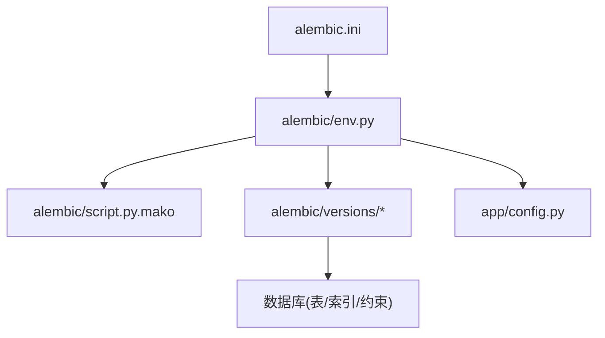
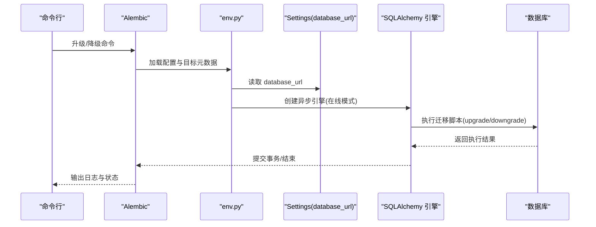
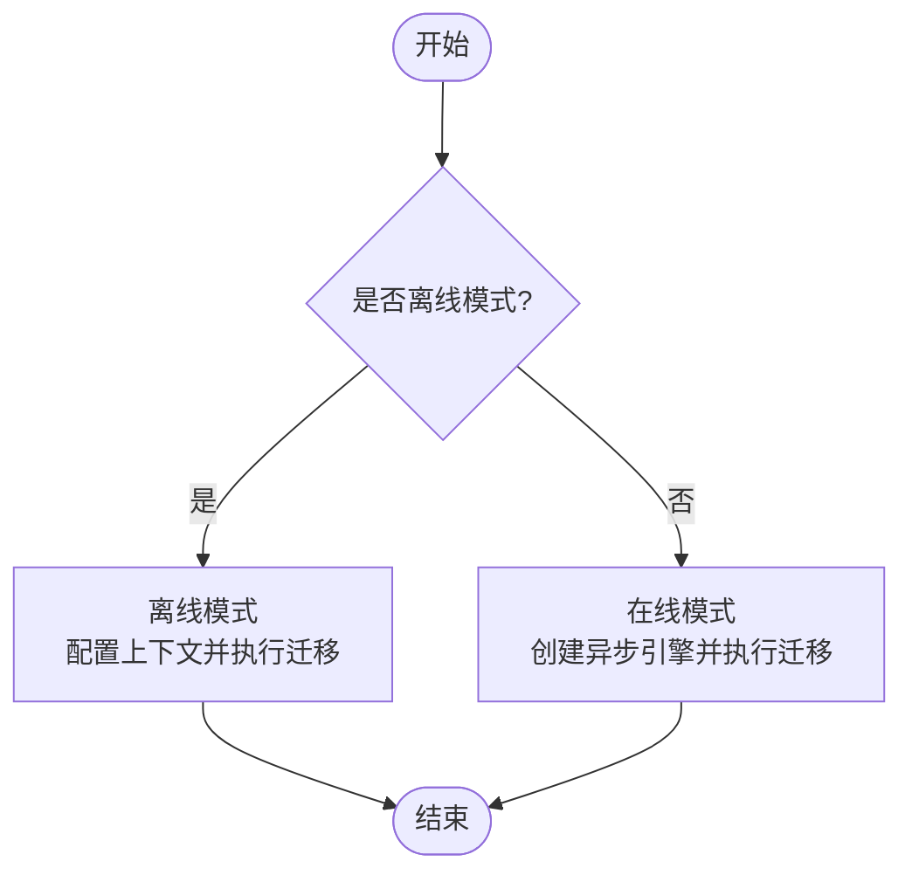
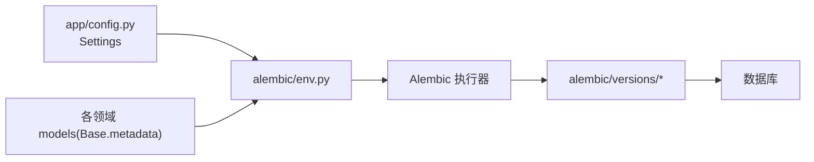

# 数据库迁移管理

<cite>
**本文引用的文件**
- [backend/alembic.ini](file://backend/alembic.ini)
- [backend/alembic/env.py](file://backend/alembic/env.py)
- [backend/alembic/script.py.mako](file://backend/alembic/script.py.mako)
- [backend/alembic/versions/0001_identity_foundation.py](file://backend/alembic/versions/0001_identity_foundation.py)
- [backend/alembic/versions/0002_profiles_and_readings.py](file://backend/alembic/versions/0002_profiles_and_readings.py)
- [backend/alembic/versions/0003_reading_integrity_constraints.py](file://backend/alembic/versions/0003_reading_integrity_constraints.py)
- [backend/alembic/versions/0004_reading_job_fencing.py](file://backend/alembic/versions/0004_reading_job_fencing.py)
- [backend/alembic/versions/0005_prepare_token_replay_safety.py](file://backend/alembic/versions/0005_prepare_token_replay_safety.py)
- [backend/alembic/versions/0006_generation_attempt_model_receipt.py](file://backend/alembic/versions/0006_generation_attempt_model_receipt.py)
- [backend/alembic/versions/0007_reading_api_idempotency_and_verification.py](file://backend/alembic/versions/0007_reading_api_idempotency_and_verification.py)
- [backend/alembic/versions/0008_admin_staff_foundation.py](file://backend/alembic/versions/0008_admin_staff_foundation.py)
- [backend/app/config.py](file://backend/app/config.py)
- [backend/tests/test_migrations.py](file://backend/tests/test_migrations.py)
- [backend/tests/test_reading_migrations.py](file://backend/tests/test_reading_migrations.py)
</cite>

## 目录
1. [简介](#简介)
2. [项目结构](#项目结构)
3. [核心组件](#核心组件)
4. [架构总览](#架构总览)
5. [详细组件分析](#详细组件分析)
6. [依赖关系分析](#依赖关系分析)
7. [性能考虑](#性能考虑)
8. [故障排查指南](#故障排查指南)
9. [结论](#结论)
10. [附录](#附录)

## 简介
本文件面向后端数据库迁移管理，系统性说明 Alembic 在本仓库中的配置、迁移文件组织与命名规范、版本控制策略，以及各迁移的历史演进。文档覆盖身份基础、档案与解读、解读完整性约束、解读作业围栏、令牌重放安全、生成尝试模型收据、解读 API 幂等性与验证、管理员员工基础等迁移目标；阐述升级、降级与回滚执行流程；给出数据安全（备份、校验、错误处理）与生产部署策略建议；并提供最佳实践与常见问题解决方案。

## 项目结构
后端使用 Alembic 进行数据库迁移，相关结构与职责如下：
- alembic.ini：Alembic 运行时配置，指定脚本位置、日志级别与处理器。
- alembic/env.py：迁移环境入口，加载应用配置与 SQLAlchemy 元数据，提供离线/在线异步迁移执行路径。
- alembic/script.py.mako：迁移脚本模板，定义 revision、down_revision、upgrade/downgrade 骨架。
- alembic/versions/*：按时间顺序的迁移脚本，每个文件对应一次数据库结构变更。
- app/config.py：集中式配置，包含数据库连接 URL 等关键设置，供 env.py 读取。
- tests/*：迁移正确性、可逆性与约束的自动化测试。

图表来源
- [backend/alembic.ini:1-39](file://backend/alembic.ini#L1-L39)
- [backend/alembic/env.py:1-59](file://backend/alembic/env.py#L1-L59)
- [backend/alembic/script.py.mako:1-26](file://backend/alembic/script.py.mako#L1-L26)
- [backend/app/config.py:62-75](file://backend/app/config.py#L62-L75)

章节来源
- [backend/alembic.ini:1-39](file://backend/alembic.ini#L1-L39)
- [backend/alembic/env.py:1-59](file://backend/alembic/env.py#L1-L59)
- [backend/alembic/script.py.mako:1-26](file://backend/alembic/script.py.mako#L1-L26)
- [backend/app/config.py:62-75](file://backend/app/config.py#L62-L75)

## 核心组件
- 迁移配置与环境
  - 通过 alembic.ini 指定脚本目录与日志级别。
  - env.py 将 Settings.database_url 注入到 Alembic 引擎，并基于是否离线模式选择运行方式；在线模式使用异步引擎执行迁移。
- 迁移脚本模板
  - script.py.mako 提供标准骨架，便于统一生成 upgrade/downgrade。
- 版本链与元数据
  - 每个迁移文件声明 revision 与 down_revision，形成线性版本链。
  - target_metadata 指向应用模型 Base.metadata，确保迁移与 ORM 模型一致。
- 配置来源
  - database_url 来自 Settings，支持环境变量前缀 MINGLI_，便于不同环境切换。

章节来源
- [backend/alembic/env.py:1-59](file://backend/alembic/env.py#L1-L59)
- [backend/alembic/script.py.mako:1-26](file://backend/alembic/script.py.mako#L1-L26)
- [backend/app/config.py:62-75](file://backend/app/config.py#L62-L75)

## 架构总览
下图展示从命令行触发迁移到实际执行 SQL 的关键调用链，以及配置与模型元数据的参与方式。

图表来源
- [backend/alembic/env.py:20-58](file://backend/alembic/env.py#L20-L58)
- [backend/app/config.py:62-75](file://backend/app/config.py#L62-L75)

## 详细组件分析

### 迁移文件组织结构与命名规范
- 目录：backend/alembic/versions
- 命名：四位数字序号 + 下划线 + 语义化描述（例如 0001_identity_foundation.py），保证可读性与排序稳定。
- 版本链：每个文件声明 revision 与 down_revision，形成严格线性历史。
- 模板：script.py.mako 提供统一骨架，减少样板代码差异。

章节来源
- [backend/alembic/versions/0001_identity_foundation.py:1-16](file://backend/alembic/versions/0001_identity_foundation.py#L1-L16)
- [backend/alembic/script.py.mako:1-26](file://backend/alembic/script.py.mako#L1-L26)

### 版本控制策略
- 线性版本：所有迁移以单链形式推进，避免分支合并复杂度。
- 不可变历史：已发布版本的迁移脚本不应修改，新增变更通过新迁移实现。
- 可回滚：每个迁移均实现 downgrade，便于本地调试与紧急回退。
- 兼容性：revision ID 长度受 Alembic 默认 version_num VARCHAR(32) 限制，测试中强制校验。

章节来源
- [backend/tests/test_migrations.py:14-32](file://backend/tests/test_migrations.py#L14-L32)

### 迁移历史与功能演进
以下按版本号简述每次迁移的目标与影响：

- 0001 身份基础
  - 创建用户、登录身份、设备会话、访客会话、审计事件等基础表及索引/唯一约束。
  - 为后续身份与会话体系奠定基础。

- 0002 档案与解读
  - 引入 subject_profiles、profile_versions、runtime_releases、reading_roots、reading_versions、fact_briefs、generation_attempts、accepted_copies、reading_jobs 等核心表。
  - 建立加密载荷字段、版本化、工作项队列与并发抢占索引。

- 0003 解读完整性约束
  - 强化 owner 互斥约束与多组“全有或全无”信封一致性检查（state_token、last_result、completion、candidate）。
  - 提升数据一致性保障，防止部分写入导致的不一致。

- 0004 解读作业围栏
  - 为 reading_jobs 增加 lease_generation 与 lease_token 列，完善租约围栏机制，避免重复执行。
  - 对存量数据进行清理，确保一致性。

- 0005 令牌重放安全
  - 在 reading_versions 增加 prepare_has_state_token 标志位，用于标识 Prepare 阶段是否携带可重放安全的状态令牌。
  - 默认 false，保持失败关闭的安全边界。

- 0006 生成尝试模型收据
  - 为 generation_attempts 增加 model_receipt(JSON)，持久化独立模型收据，增强可追溯性。

- 0007 解读 API 幂等性与验证
  - 新增 reading_idempotency_keys 表，持久化幂等键映射，支持幂等请求去重。
  - 新增 reading_verifications 表，记录用户对解读结果的验证反馈。
  - 为 subject_profiles 增加 label 字段。

- 0008 管理员员工基础
  - 新增 staff_users、staff_sessions、admin_audit_events 表，支撑后台管理与审计。

章节来源
- [backend/alembic/versions/0001_identity_foundation.py:19-123](file://backend/alembic/versions/0001_identity_foundation.py#L19-L123)
- [backend/alembic/versions/0002_profiles_and_readings.py:28-288](file://backend/alembic/versions/0002_profiles_and_readings.py#L28-L288)
- [backend/alembic/versions/0003_reading_integrity_constraints.py:47-87](file://backend/alembic/versions/0003_reading_integrity_constraints.py#L47-L87)
- [backend/alembic/versions/0004_reading_job_fencing.py:25-45](file://backend/alembic/versions/0004_reading_job_fencing.py#L25-L45)
- [backend/alembic/versions/0005_prepare_token_replay_safety.py:19-30](file://backend/alembic/versions/0005_prepare_token_replay_safety.py#L19-L30)
- [backend/alembic/versions/0006_generation_attempt_model_receipt.py:19-22](file://backend/alembic/versions/0006_generation_attempt_model_receipt.py#L19-L22)
- [backend/alembic/versions/0007_reading_api_idempotency_and_verification.py:24-104](file://backend/alembic/versions/0007_reading_api_idempotency_and_verification.py#L24-L104)
- [backend/alembic/versions/0008_admin_staff_foundation.py:19-103](file://backend/alembic/versions/0008_admin_staff_foundation.py#L19-L103)

### 执行流程：升级、降级与回滚
- 升级（upgrade）
  - 在线模式：env.py 构建异步引擎，逐条执行迁移脚本的 upgrade()。
  - 离线模式：直接以字符串 SQL 方式执行，便于无连接时生成脚本。
- 降级（downgrade）
  - 按版本链反向执行 downgrade()，撤销结构变更。
- 回滚（rollback）
  - 当某次升级失败，可在事务内回滚至上一版本，结合测试用例验证可逆性。

图表来源
- [backend/alembic/env.py:20-58](file://backend/alembic/env.py#L20-L58)

章节来源
- [backend/alembic/env.py:20-58](file://backend/alembic/env.py#L20-L58)

### 数据安全考虑
- 数据备份
  - 在生产执行迁移前，务必对数据库进行快照或逻辑备份，确保可恢复。
- 迁移验证
  - 使用测试套件验证迁移建表、索引、唯一约束与检查约束是否正确生效。
  - 重点验证 owner 互斥、信封“全有或全无”、幂等键唯一性等关键约束。
- 错误处理
  - 迁移脚本应尽可能幂等且具备降级能力；遇到异常立即中止，避免半更新状态。
  - 对于存量数据清洗（如 0004 对 reading_jobs 的清理），应在迁移中显式执行并验证。

章节来源
- [backend/tests/test_reading_migrations.py:23-137](file://backend/tests/test_reading_migrations.py#L23-L137)
- [backend/alembic/versions/0004_reading_job_fencing.py:36-40](file://backend/alembic/versions/0004_reading_job_fencing.py#L36-L40)

### 生产环境的迁移部署策略与自动化流程
- 前置条件
  - 确认数据库连接配置正确（database_url），并确保 Alembic 能访问到正确的脚本目录。
- 推荐流程
  - 预检：运行迁移脚本生成预览（离线模式）或 dry-run 检查。
  - 备份：执行数据库快照/导出。
  - 升级：在维护窗口内执行升级，观察日志与指标。
  - 验证：运行集成测试或冒烟测试，确认关键表与约束存在。
  - 回滚预案：若失败，立即回滚至上一版本并恢复备份。
- 自动化建议
  - 在 CI/CD 流水线中加入迁移测试步骤，确保每次提交都通过迁移可逆性校验。
  - 将迁移执行纳入发布门禁，未通过则阻止上线。

章节来源
- [backend/alembic.ini:1-39](file://backend/alembic.ini#L1-L39)
- [backend/alembic/env.py:20-58](file://backend/alembic/env.py#L20-L58)
- [backend/tests/test_migrations.py:14-32](file://backend/tests/test_migrations.py#L14-L32)

### 最佳实践
- 迁移粒度
  - 每次迁移聚焦单一业务变更，保持小而清晰，便于审查与回滚。
- 命名与注释
  - 使用语义化文件名与清晰的 docstring，说明迁移目的与影响范围。
- 约束优先
  - 尽量用数据库约束表达业务规则（如 owner 互斥、信封一致性），减少应用层校验负担。
- 可回滚设计
  - 每个迁移必须实现 downgrade，并在测试中验证可逆性。
- 幂等与安全
  - 对增量字段添加合理默认值，避免空值破坏；对敏感字段采用哈希存储与加密载荷。
- 监控与审计
  - 利用审计事件表记录关键操作，配合管理员审计表进行合规追踪。

[本节为通用指导，不直接分析具体文件]

### 常见问题与解决方案
- 迁移失败：检查数据库连接、权限与现有对象冲突；查看日志定位具体 SQL 错误。
- 约束冲突：确认插入数据满足检查约束（如 owner 互斥、信封一致性）。
- 版本不一致：确保 alembic_version 与实际迁移链一致，必要时手动修复或重建。
- 回滚风险：谨慎执行 downgrade，尤其是涉及数据删除的迁移；先备份再操作。

章节来源
- [backend/tests/test_reading_migrations.py:140-227](file://backend/tests/test_reading_migrations.py#L140-L227)

## 依赖关系分析
- 模块耦合
  - env.py 依赖 app.config.Settings 获取数据库 URL，并导入各领域模型以收集元数据。
  - 迁移脚本仅依赖 Alembic op 与 SQLAlchemy，保持低耦合。
- 外部依赖
  - 数据库驱动由 Settings.database_url 决定（示例为 PostgreSQL/AsyncPG）。
- 循环依赖
  - 迁移脚本之间通过 revision 链关联，无 Python 级循环导入。

图表来源
- [backend/alembic/env.py:1-59](file://backend/alembic/env.py#L1-L59)
- [backend/app/config.py:62-75](file://backend/app/config.py#L62-L75)

章节来源
- [backend/alembic/env.py:1-59](file://backend/alembic/env.py#L1-L59)
- [backend/app/config.py:62-75](file://backend/app/config.py#L62-L75)

## 性能考虑
- 索引设计
  - 针对高频查询与并发抢占场景建立合适索引（如 reading_jobs 的状态与可用时间索引）。
- 批量操作
  - 对存量数据清洗尽量分批执行，避免长事务锁表。
- 连接池与超时
  - 使用连接池与合理的超时配置，避免迁移期间阻塞服务。
- 只读校验
  - 在迁移前后执行轻量校验（如计数、约束检查），快速发现异常。

[本节为通用指导，不直接分析具体文件]

## 故障排查指南
- 定位问题
  - 查看 Alembic 日志级别与 SQLAlchemy 日志，定位具体 SQL 语句。
  - 使用测试用例复现问题，缩小范围。
- 常见错误
  - 约束违反：检查插入数据是否符合 owner 互斥、信封一致性等约束。
  - 版本错乱：核对 alembic_version 与迁移链，必要时手动修正。
  - 连接失败：检查 database_url 与网络连通性。
- 恢复步骤
  - 回滚到上一个稳定版本，恢复备份，修复数据后重新执行迁移。

章节来源
- [backend/tests/test_reading_migrations.py:230-262](file://backend/tests/test_reading_migrations.py#L230-L262)
- [backend/tests/test_reading_migrations.py:325-446](file://backend/tests/test_reading_migrations.py#L325-L446)

## 结论
本项目的 Alembic 迁移体系以线性版本链为核心，围绕身份、档案与解读、完整性约束、作业围栏、令牌重放安全、模型收据、API 幂等性与验证、管理员员工基础等关键能力逐步演进。通过严格的约束与完善的测试，保障了数据一致性与可回滚性。建议在生产环境中遵循备份、预检、灰度与回滚预案的最佳实践，确保迁移过程安全可控。

## 附录
- 常用命令
  - 升级：alembic upgrade head
  - 降级：alembic downgrade <目标版本>
  - 离线生成：alembic revision --autogenerate（需配置比较类型）
- 参考测试
  - 迁移版本长度校验与基础表构建验证
  - 解读相关迁移的表结构、索引与约束验证
  - 特定迁移的可逆性验证（如 0007 往返）

章节来源
- [backend/tests/test_migrations.py:14-66](file://backend/tests/test_migrations.py#L14-L66)
- [backend/tests/test_reading_migrations.py:23-137](file://backend/tests/test_reading_migrations.py#L23-L137)
- [backend/tests/test_reading_migrations.py:230-262](file://backend/tests/test_reading_migrations.py#L230-L262)