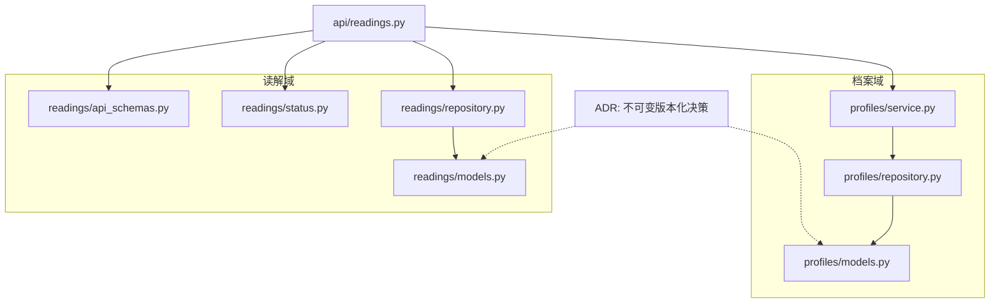
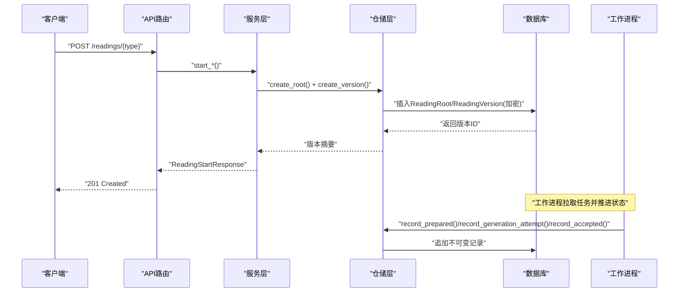
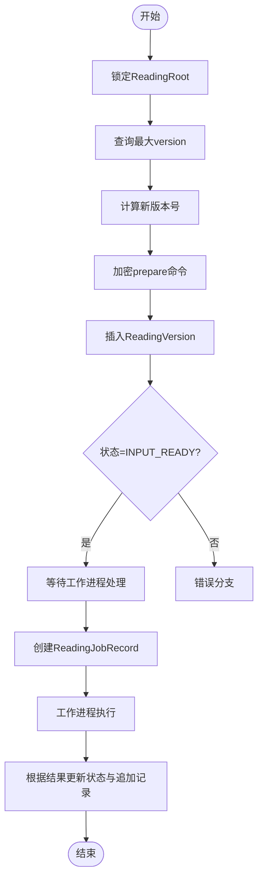
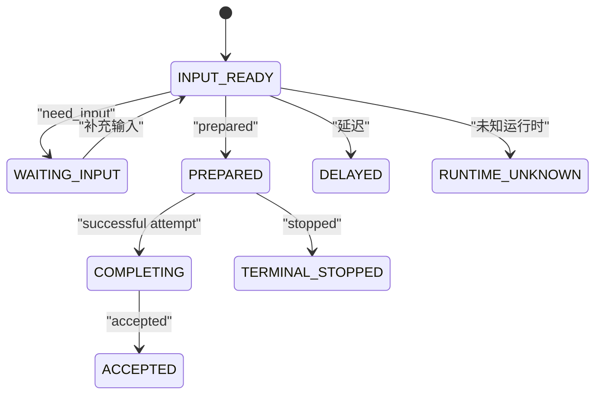
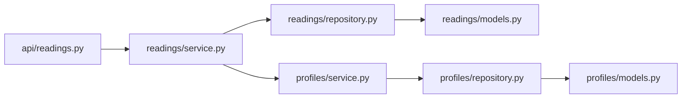

# 数据版本控制

<cite>
**本文引用的文件**
- [backend/app/readings/models.py](file://backend/app/readings/models.py)
- [backend/app/profiles/models.py](file://backend/app/profiles/models.py)
- [backend/app/readings/repository.py](file://backend/app/readings/repository.py)
- [backend/app/profiles/repository.py](file://backend/app/profiles/repository.py)
- [backend/app/readings/status.py](file://backend/app/readings/status.py)
- [backend/app/readings/api_schemas.py](file://backend/app/readings/api_schemas.py)
- [backend/app/api/readings.py](file://backend/app/api/readings.py)
- [backend/app/profiles/service.py](file://backend/app/profiles/service.py)
- [docs/adr/0004-version-profiles-and-readings-immutably.md](file://docs/adr/0004-version-profiles-and-readings-immutably.md)
</cite>

## 目录
1. [简介](#简介)
2. [项目结构](#项目结构)
3. [核心组件](#核心组件)
4. [架构总览](#架构总览)
5. [详细组件分析](#详细组件分析)
6. [依赖关系分析](#依赖关系分析)
7. [性能考量](#性能考量)
8. [故障排查指南](#故障排查指南)
9. [结论](#结论)
10. [附录：API使用示例与查询模式](#附录api使用示例与查询模式)

## 简介
本文件系统性阐述“不可变数据模型”的版本化设计，覆盖读取记录（ReadingVersion）与档案（ProfileVersion）的完整生命周期、状态机、审计追踪、差异与合并策略、性能影响与优化、迁移最佳实践与故障恢复，并提供面向使用者的API调用示例与查询模式。整体目标是在保证可复现、可审计、可退款的前提下，提供稳定可靠的版本化读写能力。

## 项目结构
后端采用分层组织：领域模型（models）、仓储实现（repository）、服务编排（service）、对外接口（api）。版本控制的核心集中在 readings 与 profiles 两个模块中，通过加密信封持久化敏感载荷，并通过数据库约束与事件监听确保不可变性。



图表来源
- [backend/app/readings/models.py:28-159](file://backend/app/readings/models.py#L28-L159)
- [backend/app/profiles/models.py:21-79](file://backend/app/profiles/models.py#L21-L79)
- [backend/app/readings/repository.py:44-167](file://backend/app/readings/repository.py#L44-L167)
- [backend/app/profiles/repository.py:15-104](file://backend/app/profiles/repository.py#L15-L104)
- [backend/app/readings/status.py:1-13](file://backend/app/readings/status.py#L1-L13)
- [backend/app/readings/api_schemas.py:17-130](file://backend/app/readings/api_schemas.py#L17-L130)
- [backend/app/api/readings.py:87-200](file://backend/app/api/readings.py#L87-L200)
- [docs/adr/0004-version-profiles-and-readings-immutably.md:1-12](file://docs/adr/0004-version-profiles-and-readings-immutably.md#L1-L12)

章节来源
- [backend/app/readings/models.py:28-159](file://backend/app/readings/models.py#L28-L159)
- [backend/app/profiles/models.py:21-79](file://backend/app/profiles/models.py#L21-L79)
- [backend/app/readings/repository.py:44-167](file://backend/app/readings/repository.py#L44-L167)
- [backend/app/profiles/repository.py:15-104](file://backend/app/profiles/repository.py#L15-L104)
- [backend/app/readings/status.py:1-13](file://backend/app/readings/status.py#L1-L13)
- [backend/app/readings/api_schemas.py:17-130](file://backend/app/readings/api_schemas.py#L17-L130)
- [backend/app/api/readings.py:87-200](file://backend/app/api/readings.py#L87-L200)
- [docs/adr/0004-version-profiles-and-readings-immutably.md:1-12](file://docs/adr/0004-version-profiles-and-readings-immutably.md#L1-L12)

## 核心组件
- ReadingRoot：读解根实体，绑定拥有者（用户或访客会话）与能力标识，作为版本化的根节点。
- ReadingVersion：不可变版本行，包含准备阶段输入、中间结果、完成副本等加密载荷，以及状态与元数据。
- ProfileVersion：不可变档案版本，存储加密后的出生资料与时间基准策略等。
- FactBrief / GenerationAttempt / AcceptedCopy：围绕单个版本的辅助不可变记录，分别保存事实摘要、生成尝试与已接纳正文。
- ReadingJobRecord：工作项记录，驱动异步执行与状态推进。
- ReadingIdempotencyKey：幂等键映射到具体版本，保障重试安全。
- ReadingVerification：用户反馈独立保存，不参与模型命令路径。

章节来源
- [backend/app/readings/models.py:53-159](file://backend/app/readings/models.py#L53-L159)
- [backend/app/readings/models.py:162-245](file://backend/app/readings/models.py#L162-L245)
- [backend/app/readings/models.py:247-337](file://backend/app/readings/models.py#L247-L337)
- [backend/app/profiles/models.py:21-79](file://backend/app/profiles/models.py#L21-L79)

## 架构总览
版本化读取流程从API进入，经服务层编译请求并创建ReadingRoot与首个ReadingVersion；仓储层负责加密封装、并发锁与状态推进；工作进程消费任务，写入FactBrief、GenerationAttempt与AcceptedCopy；最终暴露只读查询接口供前端展示历史与详情。



图表来源
- [backend/app/api/readings.py:87-200](file://backend/app/api/readings.py#L87-L200)
- [backend/app/readings/repository.py:83-167](file://backend/app/readings/repository.py#L83-L167)
- [backend/app/readings/repository.py:584-716](file://backend/app/readings/repository.py#L584-L716)

## 详细组件分析

### ReadingVersion 版本控制实现
- 版本号管理：基于 reading_root_id 的最大 version 递增分配，配合唯一约束防止重复版本。
- 状态转换：通过 ReadingStatus 枚举定义状态机，仓储方法在关键节点更新状态（如 input_ready、waiting_input、prepared、completing、accepted、delayed、runtime_unknown）。
- 审计追踪：每个版本关联 FactBrief、GenerationAttempt、AcceptedCopy 等不可变记录，形成完整的执行轨迹；同时记录 RuntimeRelease 以绑定运行时版本。
- 并发安全：创建版本前对 ReadingRoot 加排他锁（FOR UPDATE），避免并发下版本号冲突。
- 数据安全：所有敏感字段（prepare、last_result、completion、state_token）均以信封加密存储，并附带指纹校验。



图表来源
- [backend/app/readings/repository.py:44-167](file://backend/app/readings/repository.py#L44-L167)
- [backend/app/readings/status.py:1-13](file://backend/app/readings/status.py#L1-L13)
- [backend/app/readings/models.py:84-159](file://backend/app/readings/models.py#L84-L159)

章节来源
- [backend/app/readings/models.py:84-159](file://backend/app/readings/models.py#L84-L159)
- [backend/app/readings/repository.py:44-167](file://backend/app/readings/repository.py#L44-L167)
- [backend/app/readings/status.py:1-13](file://backend/app/readings/status.py#L1-L13)

### ProfileVersion 档案版本控制策略
- 不可变策略：ProfileVersion 行禁止更新，任何修改都会产生新版本；SubjectProfile 仅用于归属与标签等轻量信息。
- 版本分配：通过 SubjectProfile 的行级锁（FOR UPDATE）串行化版本分配，确保同一档案的确认过程互斥。
- 历史版本查询：支持按拥有者列出最新档案版本，也可按版本ID加载原始载荷（解密后）。
- 回滚机制：由于不可变设计，“回滚”即切换到历史版本引用；业务侧可通过选择更早的 profile_version_id 来重现旧版数据。

```mermaid
classDiagram
class SubjectProfile {
+id
+owner_user_id
+owner_guest_session_id
+label
+status
+created_at
}
class ProfileVersion {
+id
+profile_id
+version
+payload_key_id
+payload_nonce
+payload_ciphertext
+payload_fingerprint
+created_at
}
SubjectProfile ||--o{ ProfileVersion : "拥有多个不可变版本"
```

图表来源
- [backend/app/profiles/models.py:21-79](file://backend/app/profiles/models.py#L21-L79)
- [backend/app/profiles/repository.py:15-104](file://backend/app/profiles/repository.py#L15-L104)

章节来源
- [backend/app/profiles/models.py:21-79](file://backend/app/profiles/models.py#L21-L79)
- [backend/app/profiles/repository.py:15-104](file://backend/app/profiles/repository.py#L15-L104)
- [backend/app/profiles/service.py:65-105](file://backend/app/profiles/service.py#L65-L105)

### 版本间的数据差异管理与合并策略
- 差异管理：由于所有版本不可变且加密，差异比较应在应用层进行：先解密对应版本的 payload 或 prepare/last_result/completion，再进行结构化对比。
- 合并策略：不直接合并旧版本；推荐做法是创建新版本，将合并后的意图作为新的 prepare 命令写入，从而保持审计链清晰。
- 一致性约束：ReadingVersion 的 state_token、last_result、completion 三组字段通过检查约束保证“全有或全无”，避免部分写入导致的不一致。

章节来源
- [backend/app/readings/models.py:84-159](file://backend/app/readings/models.py#L84-L159)
- [backend/app/readings/repository.py:283-334](file://backend/app/readings/repository.py#L283-L334)

### 状态机与审计追踪
- 状态机：由 ReadingStatus 定义，涵盖 input_ready、waiting_input、terminal_stopped、prepared、completing、accepted、delayed、runtime_unknown。
- 审计追踪：FactBrief（准备阶段的事实摘要）、GenerationAttempt（每次生成尝试及候选）、AcceptedCopy（已接纳正文）均不可变，形成完整审计链；ReadingVerification 独立记录用户反馈。
- 幂等性：ReadingIdempotencyKey 将幂等键与版本绑定，防止重复提交造成多份版本。



图表来源
- [backend/app/readings/status.py:1-13](file://backend/app/readings/status.py#L1-L13)
- [backend/app/readings/repository.py:556-730](file://backend/app/readings/repository.py#L556-L730)

章节来源
- [backend/app/readings/status.py:1-13](file://backend/app/readings/status.py#L1-L13)
- [backend/app/readings/repository.py:556-730](file://backend/app/readings/repository.py#L556-L730)

## 依赖关系分析
- 模型依赖：ReadingVersion 依赖 RuntimeRelease、ReadingRoot；FactBrief、GenerationAttempt、AcceptedCopy 依赖 ReadingVersion；ReadingJobRecord 依赖 ReadingVersion。
- 仓储依赖：Repository 依赖 EnvelopeCipher 进行加解密；依赖 SQLAlchemy 事务与会话。
- 服务依赖：Profiles.Service 依赖 Repository 与 Settings；Readings.API 依赖 Service 与 Schemas。
- 外部约束：数据库唯一约束与检查约束保障完整性；事件监听阻止对不可变记录的更新。



图表来源
- [backend/app/api/readings.py:87-200](file://backend/app/api/readings.py#L87-L200)
- [backend/app/readings/repository.py:44-167](file://backend/app/readings/repository.py#L44-L167)
- [backend/app/profiles/repository.py:15-104](file://backend/app/profiles/repository.py#L15-L104)
- [backend/app/readings/models.py:28-159](file://backend/app/readings/models.py#L28-L159)
- [backend/app/profiles/models.py:21-79](file://backend/app/profiles/models.py#L21-L79)

章节来源
- [backend/app/api/readings.py:87-200](file://backend/app/api/readings.py#L87-L200)
- [backend/app/readings/repository.py:44-167](file://backend/app/readings/repository.py#L44-L167)
- [backend/app/profiles/repository.py:15-104](file://backend/app/profiles/repository.py#L15-L104)
- [backend/app/readings/models.py:28-159](file://backend/app/readings/models.py#L28-L159)
- [backend/app/profiles/models.py:21-79](file://backend/app/profiles/models.py#L21-L79)

## 性能考量
- 行级锁与序列化：创建版本前对 ReadingRoot/SubjectProfile 加 FOR UPDATE 锁，避免竞争但可能成为热点瓶颈。建议在高并发场景下评估分片或队列分流。
- 加密开销：所有敏感载荷均加密存储，带来CPU与I/O成本。建议批量操作时复用会话与连接池，减少往返。
- 查询优化：列表查询限制条数（如 READING_HISTORY_LIMIT=50），避免全表扫描；索引覆盖常用过滤条件（如 owner、status、available_at）。
- 幂等键表：ReadingIdempotencyKey 需维护合适索引，避免重复键冲突时的慢查询。
- 工作进程：将耗时逻辑移出HTTP路径，降低响应时间与锁持有时间。

[本节为通用指导，不直接分析具体文件]

## 故障排查指南
- 不可变记录被更新：若触发 ImmutableRecordError，说明试图更新受保护的记录（如 ProfileVersion、FactBrief、GenerationAttempt、AcceptedCopy）。应改为创建新版本或追加记录。
- 版本不存在或无权限：load_owned_version/get_owned_profile_version 返回 LookupError 或 None，检查拥有者匹配与版本ID有效性。
- 状态不一致：ReadingVersion 的状态应与作业状态一致；若出现不一致，检查 record_* 方法是否成功执行。
- 幂等冲突：Idempotency-Key 冲突会返回409，确认客户端是否正确传递幂等键。
- 运行时不可用：RuntimeReleaseUnavailableError 表示没有生产就绪的运行时发布，需登记并发布可用版本。

章节来源
- [backend/app/readings/models.py:370-377](file://backend/app/readings/models.py#L370-L377)
- [backend/app/profiles/models.py:77-79](file://backend/app/profiles/models.py#L77-L79)
- [backend/app/readings/repository.py:239-258](file://backend/app/readings/repository.py#L239-L258)
- [backend/app/readings/repository.py:120-167](file://backend/app/readings/repository.py#L120-L167)
- [backend/app/api/readings.py:67-84](file://backend/app/api/readings.py#L67-L84)

## 结论
本项目通过不可变数据模型与严格的数据库约束，实现了可复现、可审计、可退款的版本化读取与档案管理。ReadingVersion 与 ProfileVersion 分别承担读解与档案的版本化职责，辅以状态机、幂等键与工作进程，形成稳健的端到端流程。建议在后续演进中持续优化并发与加密性能，并完善差异比较工具与回滚指引。

[本节为总结性内容，不直接分析具体文件]

## 附录：API使用示例与查询模式

### 启动读解（预览/今日/周/六爻）
- 入口：POST /readings/preview、/readings/today、/readings/week、/readings/liuyao
- 请求体：参考 ReadingVersionSummary 相关请求模型（PreviewStartRequest、FortuneStartRequest、LiuyaoStartRequest）
- 响应：ReadingStartResponse，包含 reading_version_id、status、horizon、dimension_ids 等
- 幂等：通过 Idempotency-Key 头避免重复提交

章节来源
- [backend/app/api/readings.py:87-200](file://backend/app/api/readings.py#L87-L200)
- [backend/app/readings/api_schemas.py:17-55](file://backend/app/readings/api_schemas.py#L17-L55)
- [backend/app/readings/api_schemas.py:84-102](file://backend/app/readings/api_schemas.py#L84-L102)

### 查询读解历史与详情
- 列表：获取当前拥有者的最近读解版本（limit默认50）
- 详情：按 reading_version_id 加载版本摘要与状态，必要时解密 last_result 或 accepted_copy

章节来源
- [backend/app/readings/repository.py:260-281](file://backend/app/readings/repository.py#L260-L281)
- [backend/app/readings/repository.py:239-258](file://backend/app/readings/repository.py#L239-L258)
- [backend/app/readings/repository.py:301-363](file://backend/app/readings/repository.py#L301-L363)

### 查询档案版本
- 列出最新档案版本：list_latest_versions
- 获取指定版本载荷：load_version_payload（解密后返回）
- 确认草稿：confirm_draft（创建不可变 ProfileVersion）

章节来源
- [backend/app/profiles/repository.py:145-182](file://backend/app/profiles/repository.py#L145-L182)
- [backend/app/profiles/repository.py:184-198](file://backend/app/profiles/repository.py#L184-L198)
- [backend/app/profiles/service.py:65-105](file://backend/app/profiles/service.py#L65-L105)

### 查询模式建议
- 按拥有者过滤：始终携带 owner_user_id 或 owner_guest_session_id，确保数据隔离。
- 限制范围：列表查询使用 limit，避免大结果集。
- 增量加载：结合 created_at 或 version 字段做分页或增量同步。
- 审计回溯：通过 reading_version_id 关联 FactBrief、GenerationAttempt、AcceptedCopy 构建完整审计视图。

[本节为使用指导，不直接分析具体文件]