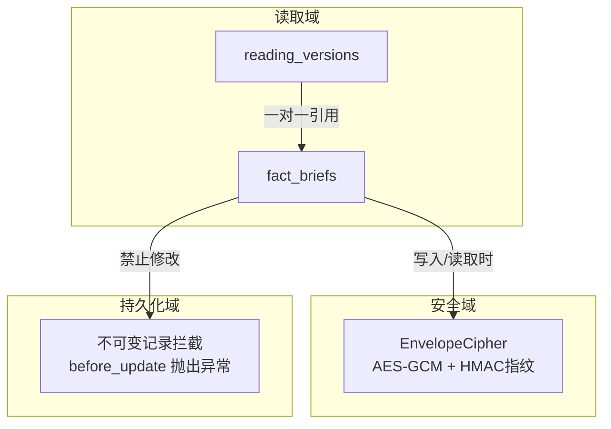
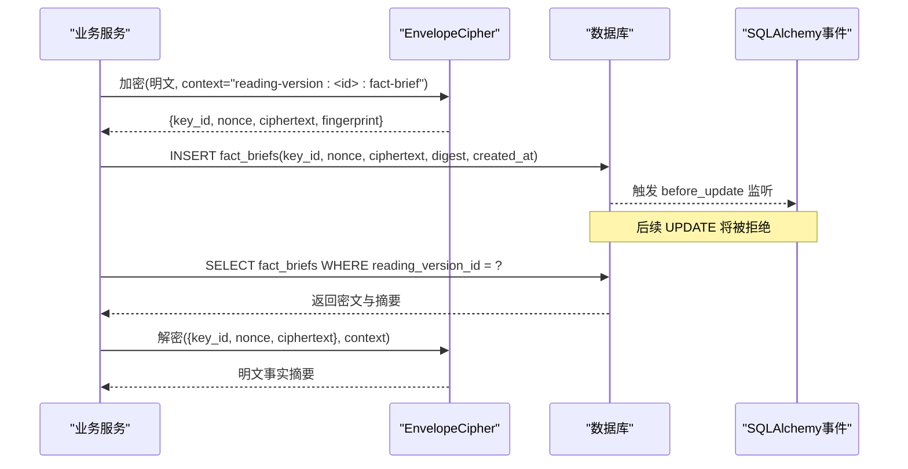
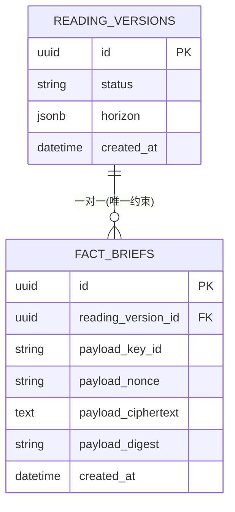
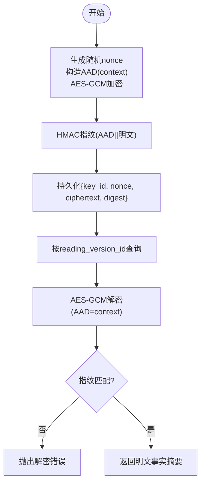
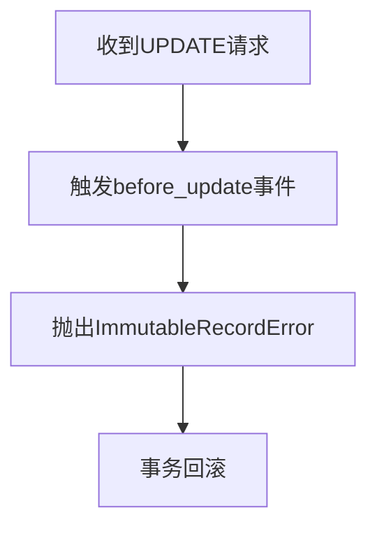
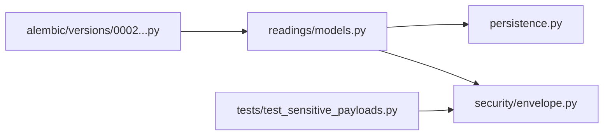

# 事实摘要实体

<cite>
**本文引用的文件**
- [backend/app/readings/models.py](file://backend/app/readings/models.py)
- [backend/app/security/envelope.py](file://backend/app/security/envelope.py)
- [backend/app/persistence.py](file://backend/app/persistence.py)
- [backend/alembic/versions/0002_profiles_and_readings.py](file://backend/alembic/versions/0002_profiles_and_readings.py)
- [backend/tests/test_sensitive_payloads.py](file://backend/tests/test_sensitive_payloads.py)
</cite>

## 目录
1. [简介](#简介)
2. [项目结构](#项目结构)
3. [核心组件](#核心组件)
4. [架构总览](#架构总览)
5. [详细组件分析](#详细组件分析)
6. [依赖关系分析](#依赖关系分析)
7. [性能考虑](#性能考虑)
8. [故障排查指南](#故障排查指南)
9. [结论](#结论)
10. [附录](#附录)

## 简介
本文件围绕“事实摘要”实体展开，聚焦 FactBrief 表在命理解读系统中的设计目的、数据模型与约束、加密存储机制、不可变记录模式以及时间戳自动生成。同时给出与 reading_versions 的一对一关系说明，并提供加密存储与解密访问的示例路径与安全最佳实践。

## 项目结构
FactBrief 属于读取（reading）域的数据模型，位于后端应用模块中；其加密能力由安全模块提供；不可变更新拦截通过持久化层事件监听实现；数据库迁移定义于 Alembic 版本脚本中；相关行为由测试覆盖。

图表来源
- [backend/app/readings/models.py:84-185](file://backend/app/readings/models.py#L84-L185)
- [backend/app/security/envelope.py:32-122](file://backend/app/security/envelope.py#L32-L122)
- [backend/app/persistence.py:1-3](file://backend/app/persistence.py#L1-L3)

章节来源
- [backend/app/readings/models.py:84-185](file://backend/app/readings/models.py#L84-L185)
- [backend/app/security/envelope.py:32-122](file://backend/app/security/envelope.py#L32-L122)
- [backend/app/persistence.py:1-3](file://backend/app/persistence.py#L1-L3)

## 核心组件
- FactBrief：存储命理解读的“事实摘要”，采用密文形式保存 payload，并附带完整性校验摘要。
- EnvelopeCipher：基于 AES-256-GCM 的加密封装，使用随机 nonce、领域上下文 AAD 和 HMAC 指纹保证机密性与完整性。
- 不可变记录：对 FactBrief 等关键表启用 before_update 拦截，阻止任何已插入记录的修改，确保追加式审计。
- 时间戳：created_at 由数据库函数自动填充，保证创建时间的可信性。

章节来源
- [backend/app/readings/models.py:162-185](file://backend/app/readings/models.py#L162-L185)
- [backend/app/security/envelope.py:32-122](file://backend/app/security/envelope.py#L32-L122)
- [backend/app/persistence.py:1-3](file://backend/app/persistence.py#L1-L3)

## 架构总览
FactBrief 与 ReadingVersion 形成一对一关系，每个阅读版本仅允许存在一条事实摘要。写入流程将明文事实摘要经 EnvelopeCipher 加密后落库；读取流程需携带相同 key_id 与 context 进行认证解密与指纹校验。所有写入完成后，FactBrief 记录不可再被修改。

图表来源
- [backend/app/readings/models.py:162-185](file://backend/app/readings/models.py#L162-L185)
- [backend/app/security/envelope.py:56-96](file://backend/app/security/envelope.py#L56-L96)
- [backend/app/persistence.py:1-3](file://backend/app/persistence.py#L1-L3)

## 详细组件分析

### FactBrief 数据模型与约束
- 主键 id：UUID，默认自生成。
- reading_version_id：外键指向 reading_versions.id，级联删除；与 reading_version_id 建立唯一约束，实现一对一关系。
- payload_* 字段：
  - payload_key_id：当前使用的密钥标识。
  - payload_nonce：每次加密生成的随机数。
  - payload_ciphertext：密文内容。
  - payload_digest：用于完整性校验的摘要值。
- created_at：带时区的创建时间，由数据库函数 server_default=func.now() 自动填充。

图表来源
- [backend/app/readings/models.py:84-185](file://backend/app/readings/models.py#L84-L185)
- [backend/alembic/versions/0002_profiles_and_readings.py:184-205](file://backend/alembic/versions/0002_profiles_and_readings.py#L184-L205)

章节来源
- [backend/app/readings/models.py:162-185](file://backend/app/readings/models.py#L162-L185)
- [backend/alembic/versions/0002_profiles_and_readings.py:184-205](file://backend/alembic/versions/0002_profiles_and_readings.py#L184-L205)

### 加密存储机制（payload_*）
- 算法与参数：
  - 对称加密：AES-256-GCM，提供机密性与完整性保护。
  - 随机数：每次加密生成 12 字节随机 nonce，避免重放与确定性输出。
  - 上下文 AAD：以 domain-separated 的 context 作为附加认证数据，防止跨上下文重用。
  - 指纹：使用独立派生的 HMAC 密钥对 AAD+明文计算指纹，用于完整性校验。
- 存储字段映射：
  - payload_key_id：对应 EnvelopeCipher.key_id。
  - payload_nonce：base64 编码的随机数。
  - payload_ciphertext：base64 编码的密文。
  - payload_digest：完整性摘要（在 FactBrief 中体现为 digest）。
- 解密验证流程：
  - 校验 key_id 一致。
  - 使用相同 context 与 nonce/ciphertext 执行认证解密。
  - 重新计算指纹并与存储指纹比对，不一致则拒绝。

图表来源
- [backend/app/security/envelope.py:56-96](file://backend/app/security/envelope.py#L56-L96)
- [backend/app/readings/models.py:177-180](file://backend/app/readings/models.py#L177-L180)

章节来源
- [backend/app/security/envelope.py:56-96](file://backend/app/security/envelope.py#L56-L96)
- [backend/app/readings/models.py:177-180](file://backend/app/readings/models.py#L177-L180)

### 与 reading_versions 的一对一关系
- 通过 UniqueConstraint("reading_version_id") 强制每个阅读版本仅能有一条事实摘要。
- 外键 ondelete=CASCADE，删除阅读版本时级联删除对应事实摘要，保持数据一致性。
- 该约束在迁移脚本中显式声明，确保历史版本兼容。

章节来源
- [backend/app/readings/models.py:164-169](file://backend/app/readings/models.py#L164-L169)
- [backend/alembic/versions/0002_profiles_and_readings.py:184-205](file://backend/alembic/versions/0002_profiles_and_readings.py#L184-L205)

### 不可变记录设计模式
- 通过 SQLAlchemy event 监听 FactBrief 的 before_update，一旦尝试更新即抛出 ImmutableRecordError。
- 该模式确保事实摘要一旦写入即不可变更，满足审计与可追溯要求。
- 适用于其他关键只读表（如 GenerationAttempt、AcceptedCopy），统一策略。

图表来源
- [backend/app/readings/models.py:370-377](file://backend/app/readings/models.py#L370-L377)
- [backend/app/persistence.py:1-3](file://backend/app/persistence.py#L1-L3)

章节来源
- [backend/app/readings/models.py:370-377](file://backend/app/readings/models.py#L370-L377)
- [backend/app/persistence.py:1-3](file://backend/app/persistence.py#L1-L3)

### created_at 时间戳自动生成
- created_at 使用 server_default=func.now()，由数据库在服务端生成带时区的时间戳。
- 优点：避免客户端时间漂移，提升审计可信度。

章节来源
- [backend/app/readings/models.py:181-185](file://backend/app/readings/models.py#L181-L185)

### 加密存储与解密访问示例（路径指引）
- 加密存储示例路径：
  - 构造上下文 context="reading-version:<reading_version_id>:fact-brief"
  - 调用 EnvelopeCipher.encrypt_text 或 encrypt_json 获取 EncryptedPayload
  - 将 key_id、nonce、ciphertext、digest 写入 fact_briefs
  - 参考：[backend/app/security/envelope.py:56-73](file://backend/app/security/envelope.py#L56-L73)、[backend/app/readings/models.py:177-180](file://backend/app/readings/models.py#L177-L180)
- 解密访问示例路径：
  - 根据 reading_version_id 查询 fact_briefs
  - 使用相同 key_id 与 context 调用 EnvelopeCipher.decrypt_text 或 decrypt_json
  - 若指纹不匹配或上下文不一致，将抛出解密错误
  - 参考：[backend/app/security/envelope.py:75-96](file://backend/app/security/envelope.py#L75-L96)

章节来源
- [backend/app/security/envelope.py:56-96](file://backend/app/security/envelope.py#L56-L96)
- [backend/app/readings/models.py:177-180](file://backend/app/readings/models.py#L177-L180)

## 依赖关系分析
- 模型依赖：
  - FactBrief 引用 reading_versions（外键与唯一约束）。
  - 不可变拦截依赖 persistence.ImmutableRecordError。
- 安全依赖：
  - EnvelopeCipher 依赖 cryptography 的 AESGCM 与 HMAC。
  - 配置项 content_encryption_key_b64 与 content_encryption_key_id 驱动密钥加载。
- 迁移依赖：
  - Alembic 脚本定义了 fact_briefs 表结构与约束。

图表来源
- [backend/app/readings/models.py:162-185](file://backend/app/readings/models.py#L162-L185)
- [backend/app/security/envelope.py:32-122](file://backend/app/security/envelope.py#L32-L122)
- [backend/alembic/versions/0002_profiles_and_readings.py:184-205](file://backend/alembic/versions/0002_profiles_and_readings.py#L184-L205)
- [backend/tests/test_sensitive_payloads.py:9-40](file://backend/tests/test_sensitive_payloads.py#L9-L40)

章节来源
- [backend/app/readings/models.py:162-185](file://backend/app/readings/models.py#L162-L185)
- [backend/app/security/envelope.py:32-122](file://backend/app/security/envelope.py#L32-L122)
- [backend/alembic/versions/0002_profiles_and_readings.py:184-205](file://backend/alembic/versions/0002_profiles_and_readings.py#L184-L205)
- [backend/tests/test_sensitive_payloads.py:9-40](file://backend/tests/test_sensitive_payloads.py#L9-L40)

## 性能考虑
- 加密开销：AES-GCM 加解密为高效对称操作；建议批量处理时复用上下文与密钥对象。
- 随机数生成：os.urandom(12) 轻量且安全，适合高频场景。
- 指纹计算：HMAC-SHA256 开销较小，但应避免在热路径重复计算；可在内存中缓存待比较结果。
- 数据库写入：fact_briefs 为小记录写入，注意事务边界与连接池大小。

## 故障排查指南
- 解密失败常见原因：
  - key_id 不匹配：确认使用与加密相同的密钥标识。
  - context 不一致：必须与加密时完全一致（包括命名空间与分隔符）。
  - 指纹不匹配：可能因密文或明文被篡改，或上下文变化导致。
- 不可变更新错误：
  - 出现 ImmutableRecordError 表示试图修改已存在的 fact_briefs 记录，应改为新增或撤销后重建。
- 配置问题：
  - 生产环境必须提供有效的 32 字节内容加密密钥与 key_id，否则启动或初始化会失败。

章节来源
- [backend/app/security/envelope.py:75-96](file://backend/app/security/envelope.py#L75-L96)
- [backend/app/persistence.py:1-3](file://backend/app/persistence.py#L1-L3)
- [backend/tests/test_sensitive_payloads.py:9-40](file://backend/tests/test_sensitive_payloads.py#L9-L40)

## 结论
FactBrief 通过强约束与不可变模式保障事实摘要的唯一性与不可篡改性；借助 AES-GCM 与 HMAC 指纹实现机密性与完整性双重保护；配合数据库自动时间戳与迁移脚本，形成完整的安全与合规基线。建议在读写路径严格遵循上下文隔离与密钥管理策略，以获得最佳安全性与可维护性。

## 附录
- 数据安全与完整性最佳实践
  - 始终使用 domain-separated 的 context，避免跨功能域重用。
  - 每次加密生成新的随机 nonce，杜绝确定性输出。
  - 存储指纹并在解密时严格比对，拒绝任何篡改。
  - 限制密钥轮换范围，确保历史数据仍可解密或提供迁移方案。
  - 对敏感日志脱敏，避免泄露 key_id、nonce、ciphertext。
  - 在事务中完成写入与校验，失败立即回滚。
  - 定期审计 fact_briefs 与 reading_versions 的一致性。