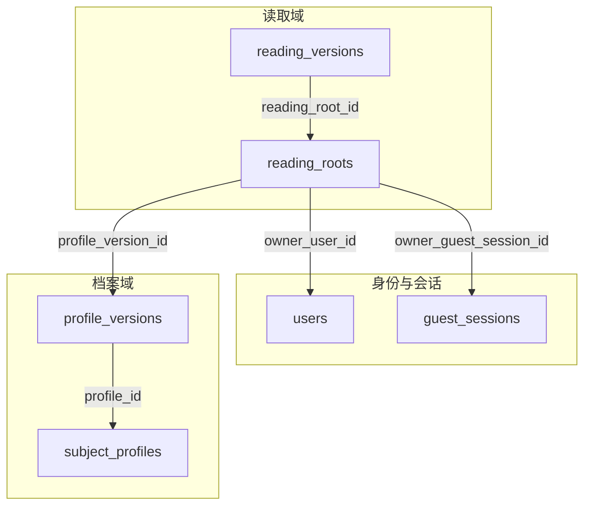
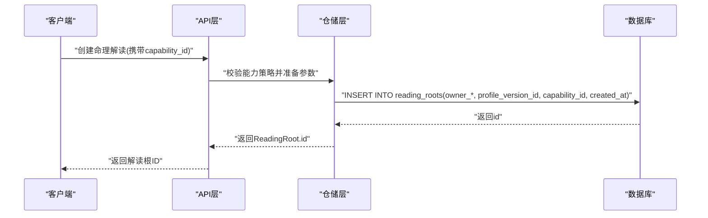
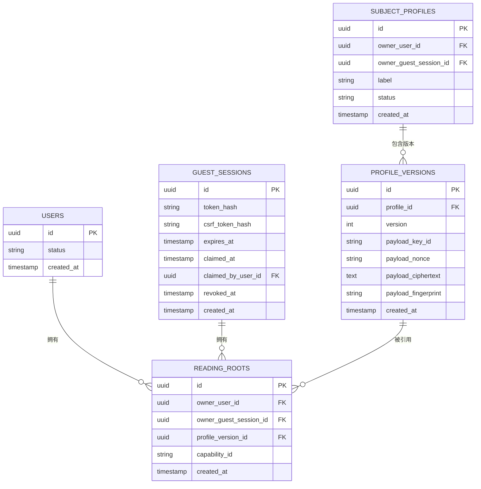
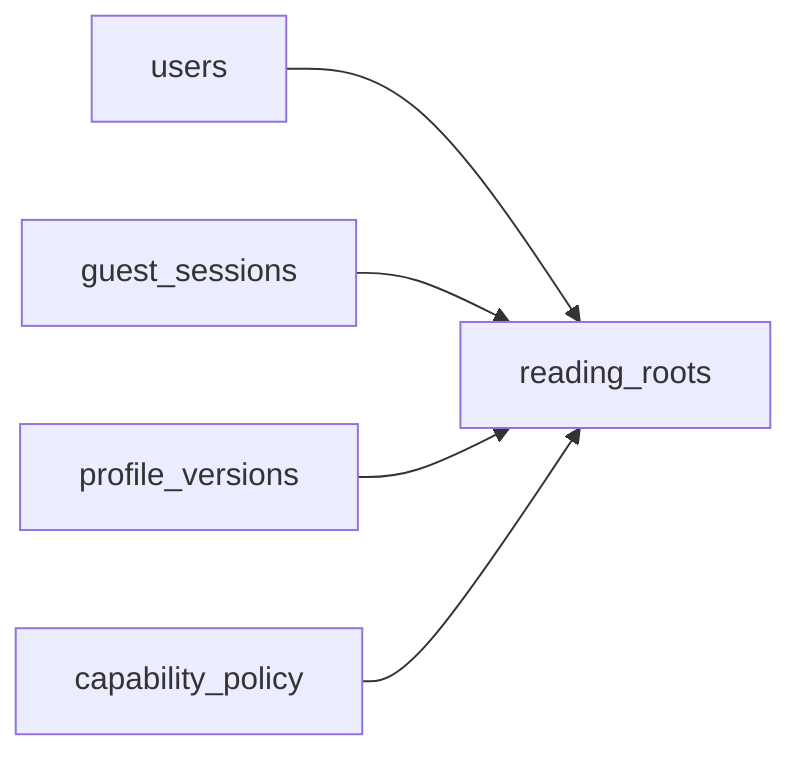

# 命理解读根实体

<cite>
**本文引用的文件**
- [backend/app/readings/models.py](file://backend/app/readings/models.py)
- [backend/alembic/versions/0002_profiles_and_readings.py](file://backend/alembic/versions/0002_profiles_and_readings.py)
- [backend/alembic/versions/0003_reading_integrity_constraints.py](file://backend/alembic/versions/0003_reading_integrity_constraints.py)
- [backend/app/identity/models.py](file://backend/app/identity/models.py)
- [backend/app/profiles/models.py](file://backend/app/profiles/models.py)
- [backend/app/readings/capability_policy.py](file://backend/app/readings/capability_policy.py)
</cite>

## 目录
1. [简介](#简介)
2. [项目结构](#项目结构)
3. [核心组件](#核心组件)
4. [架构总览](#架构总览)
5. [详细组件分析](#详细组件分析)
6. [依赖关系分析](#依赖关系分析)
7. [性能与一致性考量](#性能与一致性考量)
8. [故障排查指南](#故障排查指南)
9. [结论](#结论)
10. [附录：示例数据与ER图](#附录示例数据与er图)

## 简介
本文件聚焦于“命理解读根实体”（ReadingRoot）的数据库设计与业务语义。ReadingRoot用于标识一次命理解读的“根记录”，承载所有者归属、关联档案版本、能力标识以及创建时间等关键信息，并通过严格的约束确保数据一致性与可追溯性。

## 项目结构
围绕ReadingRoot的相关代码主要分布在以下位置：
- 模型定义：backend/app/readings/models.py
- 迁移脚本：backend/alembic/versions/0002_profiles_and_readings.py、backend/alembic/versions/0003_reading_integrity_constraints.py
- 身份与会话模型：backend/app/identity/models.py（users、guest_sessions）
- 档案版本模型：backend/app/profiles/models.py（profile_versions）
- 能力策略：backend/app/readings/capability_policy.py（capability_id取值范围与暴露策略）

图表来源
- [backend/app/readings/models.py:53-81](file://backend/app/readings/models.py#L53-L81)
- [backend/app/identity/models.py:31-110](file://backend/app/identity/models.py#L31-L110)
- [backend/app/profiles/models.py:21-74](file://backend/app/profiles/models.py#L21-L74)
- [backend/alembic/versions/0002_profiles_and_readings.py:97-123](file://backend/alembic/versions/0002_profiles_and_readings.py#L97-L123)

章节来源
- [backend/app/readings/models.py:53-81](file://backend/app/readings/models.py#L53-L81)
- [backend/alembic/versions/0002_profiles_and_readings.py:97-123](file://backend/alembic/versions/0002_profiles_and_readings.py#L97-L123)

## 核心组件
- ReadingRoot表：命理解读的根记录，唯一标识一次解读生命周期。
- 关键字段：
  - id：UUID主键，默认由系统生成。
  - owner_user_id：可选，指向用户；删除用户时级联删除该解读根。
  - owner_guest_session_id：可选，指向访客会话；删除会话时级联删除该解读根。
  - profile_version_id：可选，指向档案版本；删除档案版本时限制删除，防止破坏引用完整性。
  - capability_id：非空字符串，表示本次解读使用的能力类型。
  - created_at：非空时间戳，默认使用数据库当前时间自动设置。

- 重要约束：
  - owner_exactly_one：强制owner_user_id与owner_guest_session_id有且仅有一个非空，确保每条解读记录只能属于一个所有者类型（用户或访客会话）。

章节来源
- [backend/app/readings/models.py:53-81](file://backend/app/readings/models.py#L53-L81)
- [backend/alembic/versions/0003_reading_integrity_constraints.py:47-57](file://backend/alembic/versions/0003_reading_integrity_constraints.py#L47-L57)

## 架构总览
ReadingRoot作为命理解读的核心锚点，向上游承接所有者（用户或访客会话），向下游支撑解读版本（reading_versions）及后续工作项、结果等。通过外键与检查约束，保证：
- 所有权唯一性：一条解读只属于一个所有者。
- 档案版本不可变引用：避免误删导致引用断裂。
- 能力标识可控：通过策略层限定可用能力集合与暴露范围。

图表来源
- [backend/app/readings/models.py:53-81](file://backend/app/readings/models.py#L53-L81)
- [backend/app/readings/capability_policy.py:5-20](file://backend/app/readings/capability_policy.py#L5-L20)

## 详细组件分析

### ReadingRoot字段与约束详解
- 主键id：UUID，默认值由ORM在插入时生成。
- 所有者关系：
  - owner_user_id：外键到users.id，ondelete=CASCADE。
  - owner_guest_session_id：外键到guest_sessions.id，ondelete=CASCADE。
  - 检查约束owner_exactly_one：确保二者有且仅有一个非空。
- 档案版本关联：
  - profile_version_id：外键到profile_versions.id，ondelete=RESTRICT，禁止删除被引用的档案版本。
- 能力标识：
  - capability_id：非空字符串，长度限制为80。
- 时间戳：
  - created_at：带时区的时间戳，默认使用数据库函数设置为当前时间。

章节来源
- [backend/app/readings/models.py:53-81](file://backend/app/readings/models.py#L53-L81)
- [backend/alembic/versions/0002_profiles_and_readings.py:97-123](file://backend/alembic/versions/0002_profiles_and_readings.py#L97-L123)
- [backend/alembic/versions/0003_reading_integrity_constraints.py:47-57](file://backend/alembic/versions/0003_reading_integrity_constraints.py#L47-L57)

### owner_exactly_one约束的业务含义
- 业务规则：每次命理解读必须明确归属于一个所有者——要么属于某个已登录用户，要么属于某个访客会话，不能同时为空或同时为非空。
- 实现方式：通过数据库检查约束在写入和更新时强制校验，避免应用层逻辑遗漏导致的脏数据。
- 影响范围：创建ReadingRoot时必须满足；任何试图将两个所有者字段同时置空或同时置非空的变更都会被拒绝。

章节来源
- [backend/app/readings/models.py:53-61](file://backend/app/readings/models.py#L53-L61)
- [backend/alembic/versions/0003_reading_integrity_constraints.py:47-57](file://backend/alembic/versions/0003_reading_integrity_constraints.py#L47-L57)

### 外键关系与级联删除策略
- users -> reading_roots：ondelete=CASCADE。当用户被删除时，其所有命理解读根记录一并删除。
- guest_sessions -> reading_roots：ondelete=CASCADE。当访客会话过期或被撤销时，相关解读根记录一并删除。
- profile_versions -> reading_roots：ondelete=RESTRICT。禁止删除仍被命理解读根引用的档案版本，保障历史解读可追溯。

章节来源
- [backend/app/readings/models.py:64-75](file://backend/app/readings/models.py#L64-L75)
- [backend/alembic/versions/0002_profiles_and_readings.py:104-121](file://backend/alembic/versions/0002_profiles_and_readings.py#L104-L121)

### capability_id字段的作用与取值范围
- 作用：标识本次命理解读所使用的具体能力（如八字、紫微、六爻等），贯穿请求编译、执行与输出契约。
- 取值范围：
  - 运行时能力集合：V51_RELEASE_CAPABILITY_IDS包含一组能力标识。
  - P0暴露集合：P0_EXPOSED_CAPABILITY_IDS限定当前产品阶段对外暴露的能力。
- 策略校验：通过require_p0_capability等方法对capability_id进行白名单校验，未暴露的能力会被拒绝。

章节来源
- [backend/app/readings/capability_policy.py:5-20](file://backend/app/readings/capability_policy.py#L5-L20)
- [backend/app/readings/capability_policy.py:53-67](file://backend/app/readings/capability_policy.py#L53-L67)

### 创建时间戳的自动设置机制
- created_at字段使用数据库函数作为server_default，在插入新记录时自动填充当前时间（带时区）。
- 优点：避免应用层时间不一致问题，提升审计与排序可靠性。

章节来源
- [backend/app/readings/models.py:77-81](file://backend/app/readings/models.py#L77-L81)

### 实体关系ER图

图表来源
- [backend/app/identity/models.py:31-110](file://backend/app/identity/models.py#L31-L110)
- [backend/app/profiles/models.py:21-74](file://backend/app/profiles/models.py#L21-L74)
- [backend/app/readings/models.py:53-81](file://backend/app/readings/models.py#L53-L81)
- [backend/alembic/versions/0002_profiles_and_readings.py:97-123](file://backend/alembic/versions/0002_profiles_and_readings.py#L97-L123)

## 依赖关系分析
- ReadingRoot依赖：
  - users：通过owner_user_id建立一对一或多对一的所有权关系。
  - guest_sessions：通过owner_guest_session_id建立一对一或多对一的所有权关系。
  - profile_versions：通过profile_version_id建立一对多的引用关系（多个解读可能引用同一档案版本）。
- 约束耦合：
  - owner_exactly_one确保所有权互斥。
  - ondelete策略决定上游实体删除时的级联行为。
- 能力策略耦合：
  - capability_id需通过策略层校验，确保仅允许的产品能力被使用。

图表来源
- [backend/app/readings/models.py:53-81](file://backend/app/readings/models.py#L53-L81)
- [backend/app/readings/capability_policy.py:5-20](file://backend/app/readings/capability_policy.py#L5-L20)

章节来源
- [backend/app/readings/models.py:53-81](file://backend/app/readings/models.py#L53-L81)
- [backend/app/readings/capability_policy.py:5-20](file://backend/app/readings/capability_policy.py#L5-L20)

## 性能与一致性考量
- 索引建议：
  - 针对owner_user_id、owner_guest_session_id建立索引以优化按所有者查询。
  - 针对profile_version_id建立索引以优化按档案版本聚合解读。
- 事务边界：
  - 创建ReadingRoot与后续ReadingVersion应在同一事务中完成，确保状态一致性。
- 约束成本：
  - owner_exactly_one在写入时进行校验，开销较小但能显著降低应用层复杂度。
- 级联删除：
  - CASCADE策略简化清理逻辑，但需注意删除用户或会话时的批量删除影响。

[本节为通用指导，不直接分析具体文件]

## 故障排查指南
- 常见错误：
  - 违反owner_exactly_one：尝试同时为空或同时为非空。检查插入/更新逻辑是否设置了两个所有者字段。
  - 违反外键约束：
    - 引用了不存在的users/guest_sessions/profile_versions记录。
    - 尝试删除被引用的profile_versions（RESTRICT）。
  - 能力校验失败：传入的capability_id不在P0暴露集合中。
- 定位方法：
  - 查看数据库约束名称（如ck_reading_roots_owner_exactly_one）对应的错误消息。
  - 核对capability_policy中的白名单与调用路径。
  - 检查迁移是否成功应用（特别是0003引入的检查约束）。

章节来源
- [backend/alembic/versions/0003_reading_integrity_constraints.py:47-57](file://backend/alembic/versions/0003_reading_integrity_constraints.py#L47-L57)
- [backend/app/readings/capability_policy.py:53-67](file://backend/app/readings/capability_policy.py#L53-L67)

## 结论
ReadingRoot是命理解读系统的核心锚点，通过严格的所有权约束、外键策略与能力策略，确保了数据的一致性与可追溯性。结合自动时间戳与合理的索引设计，可在高并发场景下保持良好性能。建议在应用层配合策略校验与事务管理，进一步降低出错概率。

[本节为总结性内容，不直接分析具体文件]

## 附录：示例数据与ER图
- 示例数据（示意，非真实值）：
  - users: id="u1", status="active", created_at="2026-01-01T00:00:00+00:00"
  - guest_sessions: id="gs1", token_hash="abc...", expires_at="2026-01-02T00:00:00+00:00", created_at="2026-01-01T00:00:00+00:00"
  - subject_profiles: id="sp1", owner_user_id="u1", status="active", created_at="2026-01-01T00:00:00+00:00"
  - profile_versions: id="pv1", profile_id="sp1", version=1, payload_key_id="k1", payload_nonce="n1", payload_ciphertext="c1", payload_fingerprint="f1", created_at="2026-01-01T00:00:00+00:00"
  - reading_roots:
    - 示例A（用户拥有）: id="rr1", owner_user_id="u1", owner_guest_session_id=NULL, profile_version_id="pv1", capability_id="bazi", created_at="2026-01-01T00:00:00+00:00"
    - 示例B（访客拥有）: id="rr2", owner_user_id=NULL, owner_guest_session_id="gs1", profile_version_id="pv1", capability_id="fortune", created_at="2026-01-01T00:00:00+00:00"

- ER图（同前节）：展示users、guest_sessions、subject_profiles、profile_versions与reading_roots之间的关系。

[本节提供概念性示例，不直接分析具体文件]