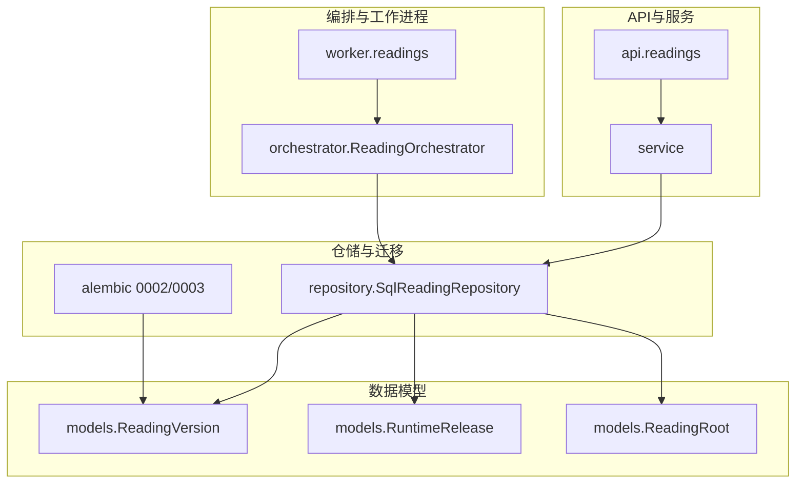
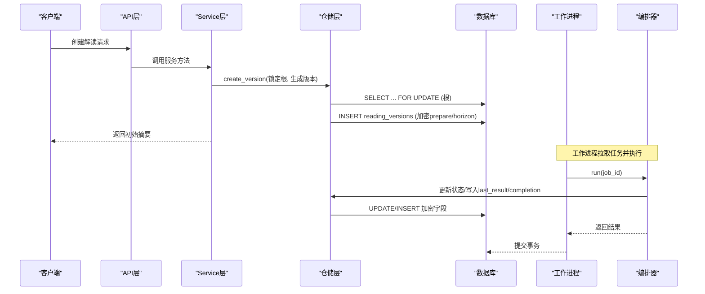
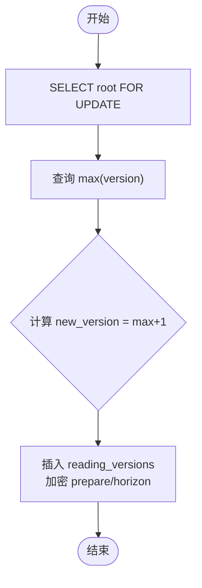
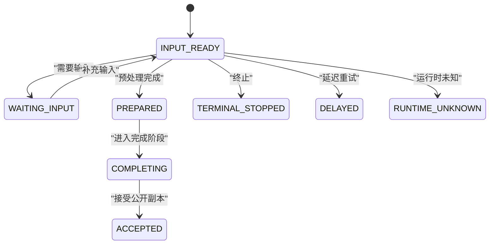
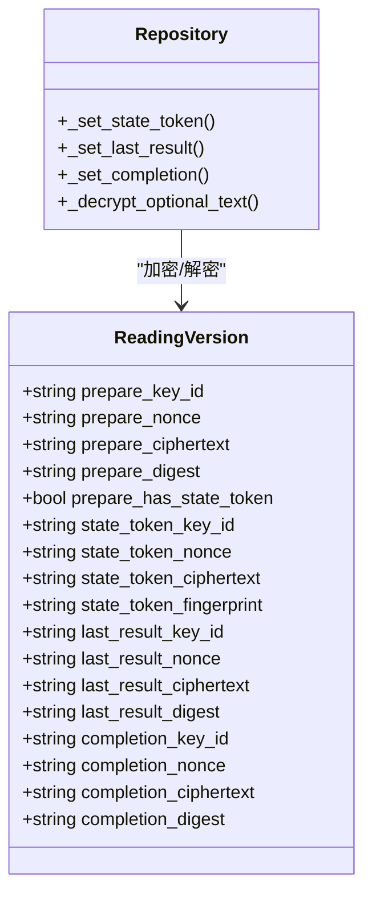
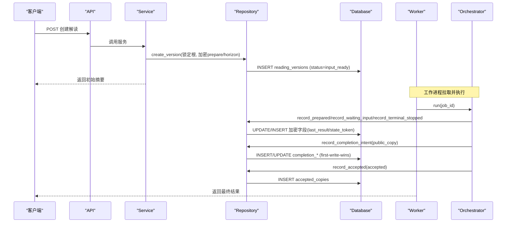
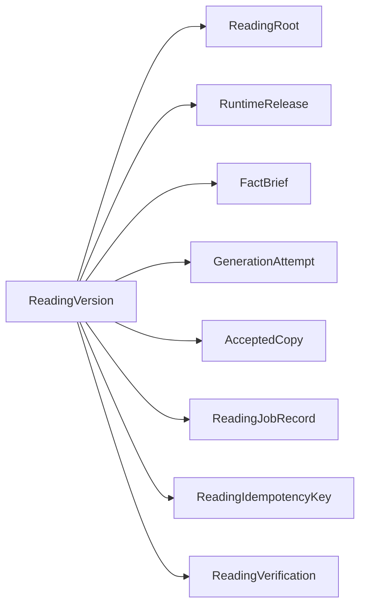

# 命理解读版本实体

<cite>
**本文引用的文件**
- [backend/app/readings/models.py](file://backend/app/readings/models.py)
- [backend/alembic/versions/0002_profiles_and_readings.py](file://backend/alembic/versions/0002_profiles_and_readings.py)
- [backend/alembic/versions/0003_reading_integrity_constraints.py](file://backend/alembic/versions/0003_reading_integrity_constraints.py)
- [backend/app/readings/repository.py](file://backend/app/readings/repository.py)
- [backend/app/readings/status.py](file://backend/app/readings/status.py)
- [backend/app/readings/service.py](file://backend/app/readings/service.py)
- [backend/worker/readings.py](file://backend/worker/readings.py)
- [backend/app/api/readings.py](file://backend/app/api/readings.py)
</cite>

## 目录
1. [简介](#简介)
2. [项目结构](#项目结构)
3. [核心组件](#核心组件)
4. [架构总览](#架构总览)
5. [详细组件分析](#详细组件分析)
6. [依赖关系分析](#依赖关系分析)
7. [性能考量](#性能考量)
8. [故障排查指南](#故障排查指南)
9. [结论](#结论)
10. [附录](#附录)

## 简介
本文件聚焦于“命理解读版本实体”的数据库与实现细节，围绕 ReadingVersion 表的复杂结构展开，系统阐述：
- 版本控制机制：version 字段的递增策略、唯一性约束与并发安全。
- 运行时发布关联：runtime_release_id 的作用与选择策略。
- 状态管理：status 字段的状态机流转与触发点。
- 不可变记录的加密字段组：prepare_*、state_token_*、last_result_*、completion_* 的成对设计与完整性约束。
- horizon JSON 结构的用途与校验。
- created_at 时间戳的自动生成。
- 版本化数据的完整生命周期示例（从创建到接受）。

## 项目结构
ReadingVersion 属于后端数据模型层，由 SQLAlchemy ORM 定义并通过 Alembic 迁移落地；其写入路径由仓储层封装，编排器驱动状态流转，工作进程消费任务并持久化结果。

图表来源
- [backend/app/readings/models.py:28-159](file://backend/app/readings/models.py#L28-L159)
- [backend/app/readings/repository.py:120-167](file://backend/app/readings/repository.py#L120-L167)
- [backend/alembic/versions/0002_profiles_and_readings.py:124-180](file://backend/alembic/versions/0002_profiles_and_readings.py#L124-L180)
- [backend/alembic/versions/0003_reading_integrity_constraints.py:47-87](file://backend/alembic/versions/0003_reading_integrity_constraints.py#L47-L87)

章节来源
- [backend/app/readings/models.py:28-159](file://backend/app/readings/models.py#L28-L159)
- [backend/alembic/versions/0002_profiles_and_readings.py:124-180](file://backend/alembic/versions/0002_profiles_and_readings.py#L124-L180)
- [backend/alembic/versions/0003_reading_integrity_constraints.py:47-87](file://backend/alembic/versions/0003_reading_integrity_constraints.py#L47-L87)

## 核心组件
- ReadingVersion：记录一次命理解读的不可变快照，包含版本、状态、能力标识、对象标识、维度、horizon、以及多组加密载荷。
- RuntimeRelease：运行时发布元数据，被版本引用以绑定执行环境。
- SqlReadingRepository：负责读取/写入 ReadingVersion，处理加密、状态更新、并发锁与完整性校验。
- ReadingStatus：状态枚举，定义状态机所有合法值。
- Service/API/Worker：驱动状态流转与任务执行。

章节来源
- [backend/app/readings/models.py:84-159](file://backend/app/readings/models.py#L84-L159)
- [backend/app/readings/status.py:1-13](file://backend/app/readings/status.py#L1-L13)
- [backend/app/readings/repository.py:120-167](file://backend/app/readings/repository.py#L120-L167)

## 架构总览
ReadingVersion 的生命周期由服务层发起，仓储层在 PostgreSQL 行级锁保护下分配版本号并写入加密载荷；工作进程根据状态机推进流程，最终产出可接受的公开副本。

图表来源
- [backend/app/readings/repository.py:120-167](file://backend/app/readings/repository.py#L120-L167)
- [backend/app/readings/repository.py:792-830](file://backend/app/readings/repository.py#L792-L830)
- [backend/worker/readings.py:175-231](file://backend/worker/readings.py#L175-L231)

## 详细组件分析

### ReadingVersion 表结构与约束
- 主键与关联
  - id：UUID 主键。
  - reading_root_id：外键指向 reading_roots，级联删除。
  - runtime_release_id：外键指向 runtime_releases，限制删除，用于绑定运行时代码与环境。
- 版本与唯一性
  - version：整数版本号，按 reading_root_id 分组递增。
  - 唯一约束：(reading_root_id, version) 保证同一根下的版本唯一。
- 业务标识
  - status：字符串状态，受状态机约束。
  - capability_id：能力标识，需与根一致。
  - object_id：对象标识。
  - dimension_ids：JSON 数组，维度列表。
  - horizon：JSON 对象，承载运行时上下文或范围信息。
- 加密字段组（不可变）
  - prepare_*：准备命令的密文信封（key_id, nonce, ciphertext, digest），必须完整。
  - state_token_*：状态令牌密文信封，可选但全有或全无。
  - last_result_*：最近一次停止结果的密文信封，可选但全有或全无。
  - completion_*：完成意图的密文信封，首次写入后不可更改（first-write-wins）。
- 时间戳
  - created_at：服务器默认当前时间，不可变。

章节来源
- [backend/app/readings/models.py:84-159](file://backend/app/readings/models.py#L84-L159)
- [backend/alembic/versions/0002_profiles_and_readings.py:124-180](file://backend/alembic/versions/0002_profiles_and_readings.py#L124-L180)
- [backend/alembic/versions/0003_reading_integrity_constraints.py:21-44](file://backend/alembic/versions/0003_reading_integrity_constraints.py#L21-L44)

### 版本控制机制与并发安全
- 版本递增策略
  - 通过查询同根最大 version + 1 得到新版本号。
  - 使用 PostgreSQL 的 SELECT ... FOR UPDATE 锁定 reading_roots，避免并发写导致的竞争条件。
- 唯一性保障
  - 唯一约束 (reading_root_id, version) 防止重复版本。
- 能力一致性
  - 新版本的 capability_id 必须与根的 capability_id 一致，否则拒绝。

图表来源
- [backend/app/readings/repository.py:44-48](file://backend/app/readings/repository.py#L44-L48)
- [backend/app/readings/repository.py:120-167](file://backend/app/readings/repository.py#L120-L167)

章节来源
- [backend/app/readings/repository.py:44-48](file://backend/app/readings/repository.py#L44-L48)
- [backend/app/readings/repository.py:120-167](file://backend/app/readings/repository.py#L120-L167)

### 运行时发布关联
- runtime_release_id 将版本绑定到特定运行时发布，确保可追溯性与一致性。
- 解析生产可用发布时，按 created_at 降序与 id 降序选取最新的生产就绪发布。

章节来源
- [backend/app/readings/models.py:28-50](file://backend/app/readings/models.py#L28-L50)
- [backend/app/readings/repository.py:226-237](file://backend/app/readings/repository.py#L226-L237)

### 状态管理与流转
- 状态枚举
  - input_ready、waiting_input、terminal_stopped、prepared、completing、accepted、delayed、runtime_unknown。
- 典型流转
  - 创建版本：input_ready。
  - 等待输入：waiting_input（当需要用户补充信息）。
  - 恢复输入后：回到 input_ready 并重新排队。
  - 预处理成功：prepared。
  - 完成阶段：completing -> accepted。
  - 异常或延迟：terminal_stopped / delayed / runtime_unknown。
- 触发点
  - Service 在 supply_input 中校验 waiting_input 并替换 prepare，随后创建作业。
  - Worker 根据编排结果映射为作业状态并更新。

图表来源
- [backend/app/readings/status.py:1-13](file://backend/app/readings/status.py#L1-L13)
- [backend/app/readings/service.py:256-292](file://backend/app/readings/service.py#L256-L292)
- [backend/worker/readings.py:220-231](file://backend/worker/readings.py#L220-L231)

章节来源
- [backend/app/readings/status.py:1-13](file://backend/app/readings/status.py#L1-L13)
- [backend/app/readings/service.py:256-292](file://backend/app/readings/service.py#L256-L292)
- [backend/worker/readings.py:220-231](file://backend/worker/readings.py#L220-L231)

### 不可变记录的加密字段组设计
- 成对/成组设计
  - 每组包含 key_id、nonce、ciphertext，以及指纹/摘要（digest/fingerprint）。
  - state_token_*、last_result_*、completion_* 采用“全有或全无”的完整性约束，禁止部分填充。
- 完整性与防篡改
  - fingerprint/digest 作为密文的指纹，用于校验完整性。
  - completion_* 支持“首次写入获胜”，后续尝试若指纹不一致则拒绝。
- 读写路径
  - 写入：仓储层使用 EnvelopeCipher 加密并设置对应字段。
  - 读取：提供解密辅助方法，要求字段齐全。

图表来源
- [backend/app/readings/models.py:133-154](file://backend/app/readings/models.py#L133-L154)
- [backend/app/readings/repository.py:792-830](file://backend/app/readings/repository.py#L792-L830)
- [backend/alembic/versions/0003_reading_integrity_constraints.py:21-44](file://backend/alembic/versions/0003_reading_integrity_constraints.py#L21-L44)

章节来源
- [backend/app/readings/models.py:133-154](file://backend/app/readings/models.py#L133-L154)
- [backend/app/readings/repository.py:792-830](file://backend/app/readings/repository.py#L792-L830)
- [backend/alembic/versions/0003_reading_integrity_constraints.py:21-44](file://backend/alembic/versions/0003_reading_integrity_constraints.py#L21-L44)

### horizon JSON 结构用途
- 存储 Prepare 命令中的 horizon 对象，作为运行时上下文或范围信息。
- 写入前进行类型校验，必须是对象（Mapping），否则拒绝。
- 该字段与能力、维度等共同构成一次解读的上下文快照。

章节来源
- [backend/app/readings/repository.py:143-158](file://backend/app/readings/repository.py#L143-L158)

### created_at 时间戳自动生成
- created_at 使用数据库服务器默认值 CURRENT_TIMESTAMP，保证不可变且统一时区。

章节来源
- [backend/app/readings/models.py:155-159](file://backend/app/readings/models.py#L155-L159)
- [backend/alembic/versions/0002_profiles_and_readings.py:19-25](file://backend/alembic/versions/0002_profiles_and_readings.py#L19-L25)

### 版本化数据完整生命周期示例
以下示例展示从创建到接受的端到端流程，涵盖状态变化与关键写入点：

图表来源
- [backend/app/readings/repository.py:120-167](file://backend/app/readings/repository.py#L120-L167)
- [backend/app/readings/repository.py:792-830](file://backend/app/readings/repository.py#L792-L830)
- [backend/worker/readings.py:175-231](file://backend/worker/readings.py#L175-L231)

章节来源
- [backend/app/readings/repository.py:120-167](file://backend/app/readings/repository.py#L120-L167)
- [backend/app/readings/repository.py:792-830](file://backend/app/readings/repository.py#L792-L830)
- [backend/worker/readings.py:175-231](file://backend/worker/readings.py#L175-L231)

## 依赖关系分析
- 模型依赖
  - ReadingVersion 引用 ReadingRoot 与 RuntimeRelease。
  - 其他相关表：fact_briefs、generation_attempts、accepted_copies、reading_jobs、reading_idempotency_keys、reading_verifications。
- 迁移依赖
  - 0002 创建基础表与约束。
  - 0003 强化所有者唯一性与加密信封完整性约束。
- 运行时依赖
  - 仓储层依赖 EnvelopeCipher 进行加解密。
  - 编排器依赖仓库接口与外部适配器（Runtime、Model、Guard）。

图表来源
- [backend/app/readings/models.py:162-378](file://backend/app/readings/models.py#L162-L378)

章节来源
- [backend/app/readings/models.py:162-378](file://backend/app/readings/models.py#L162-L378)
- [backend/alembic/versions/0002_profiles_and_readings.py:124-303](file://backend/alembic/versions/0002_profiles_and_readings.py#L124-L303)
- [backend/alembic/versions/0003_reading_integrity_constraints.py:47-135](file://backend/alembic/versions/0003_reading_integrity_constraints.py#L47-L135)

## 性能考量
- 并发安全：使用 SELECT ... FOR UPDATE 锁定根，避免版本分配竞争。
- 索引与约束：
  - 活跃作业的唯一索引与状态/可用时间索引提升调度效率。
  - 唯一约束与检查约束减少无效写入与脏数据。
- 加密开销：每次写入涉及对称加密与指纹计算，应合理批量与缓存密钥材料。
- 只追加模式：不可变记录降低锁粒度与冲突概率，提高吞吐。

[本节为通用指导，不直接分析具体文件]

## 故障排查指南
- 完整性错误
  - 加密字段不完整：会抛出不可变记录错误，检查 key_id/nonce/ciphertext/fingerprint 是否齐全。
  - 完成意图冲突：completion_* 首次写入后再次写入且指纹不一致将被拒绝。
- 状态错误
  - 非 waiting_input 状态下尝试补充输入：抛出“未等待输入”错误。
  - 作业已存在：并发重复提交导致完整性错误。
- 运行时未知
  - 编排器标记 runtime_unknown，需检查外部适配器与网络。

章节来源
- [backend/app/readings/repository.py:792-830](file://backend/app/readings/repository.py#L792-L830)
- [backend/app/readings/service.py:256-292](file://backend/app/readings/service.py#L256-L292)
- [backend/app/readings/status.py:1-13](file://backend/app/readings/status.py#L1-L13)

## 结论
ReadingVersion 通过严格的版本控制、运行时绑定、状态机与不可变加密字段，构建了高内聚、可审计、可回滚的命理解读数据基座。结合数据库约束与仓储层的加解密逻辑，系统在并发、一致性与安全性方面具备稳健保障。

[本节为总结，不直接分析具体文件]

## 附录
- 关键路径参考
  - 版本创建与加密写入：[backend/app/readings/repository.py:120-167](file://backend/app/readings/repository.py#L120-L167)
  - 状态令牌/结果/完成写入：[backend/app/readings/repository.py:792-830](file://backend/app/readings/repository.py#L792-L830)
  - 状态枚举：[backend/app/readings/status.py:1-13](file://backend/app/readings/status.py#L1-L13)
  - 迁移定义：[backend/alembic/versions/0002_profiles_and_readings.py:124-180](file://backend/alembic/versions/0002_profiles_and_readings.py#L124-L180)、[backend/alembic/versions/0003_reading_integrity_constraints.py:47-87](file://backend/alembic/versions/0003_reading_integrity_constraints.py#L47-L87)
  - 工作进程状态映射：[backend/worker/readings.py:220-231](file://backend/worker/readings.py#L220-L231)