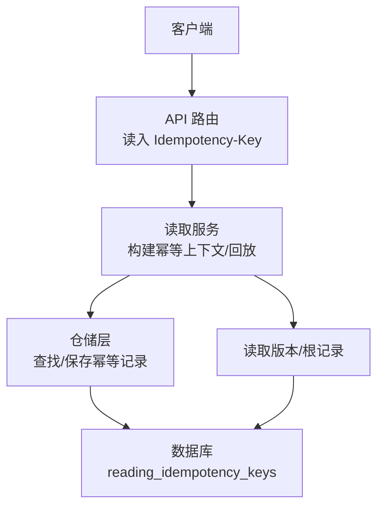
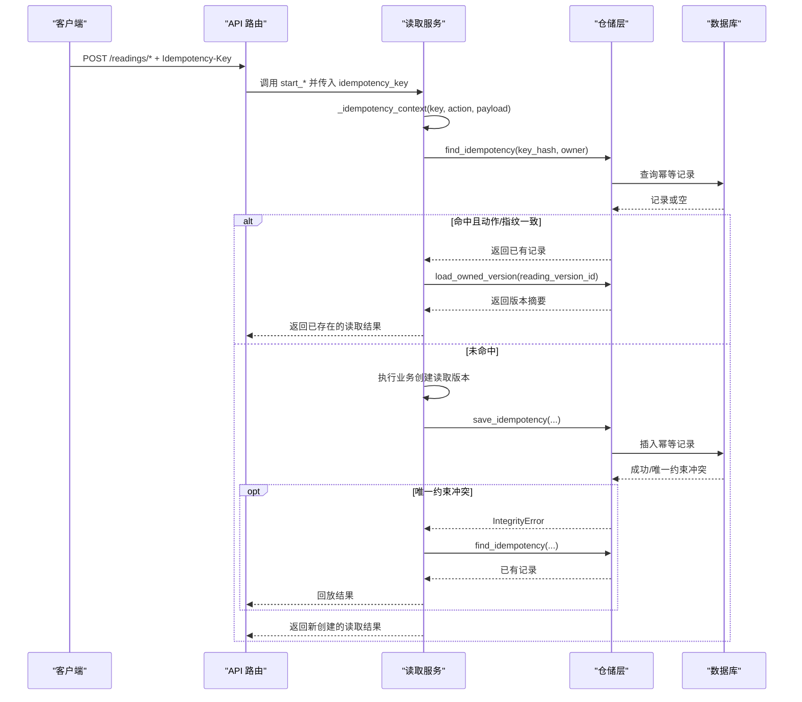
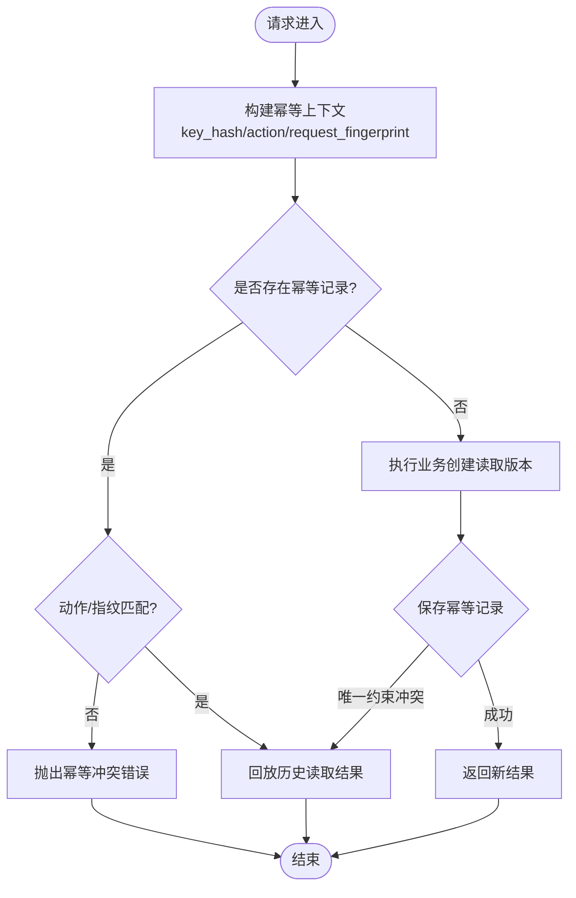

# 幂等键实体

<cite>
**本文引用的文件**
- [models.py](file://backend/app/readings/models.py)
- [0007_reading_api_idempotency_and_verification.py](file://backend/alembic/versions/0007_reading_api_idempotency_and_verification.py)
- [repository.py](file://backend/app/readings/repository.py)
- [service.py](file://backend/app/readings/service.py)
- [readings.py](file://backend/app/api/readings.py)
- [test_reading_migrations.py](file://backend/tests/test_reading_migrations.py)
- [idempotency.ts](file://web/src/lib/idempotency.ts)
- [api.ts](file://web/src/lib/api.ts)
</cite>

## 目录
1. [简介](#简介)
2. [项目结构](#项目结构)
3. [核心组件](#核心组件)
4. [架构总览](#架构总览)
5. [详细组件分析](#详细组件分析)
6. [依赖关系分析](#依赖关系分析)
7. [性能考量](#性能考量)
8. [故障排查指南](#故障排查指南)
9. [结论](#结论)
10. [附录](#附录)

## 简介
本文件围绕 ReadingIdempotencyKey 表与相关服务实现，系统化说明“读取（Reading）API”的幂等性保护机制。重点包括：
- 设计目的：通过持久化的幂等键映射，确保同一所有者对同一请求意图的重复提交只产生一次实际执行结果。
- key_hash 的请求指纹哈希与去重机制：基于 HMAC-SHA256 对 Idempotency-Key 进行服务端签名式摘要，并结合所有者维度做唯一约束。
- action 的动作类型区分：将不同业务动作（如预览、今日运势、本周运势、六爻起卦）隔离，避免跨动作复用键导致误判。
- owner_user_id 与 owner_guest_session_id 的所有者隔离：强制二选一，保证幂等范围限定在单一会话或用户下。
- request_fingerprint 的请求特征记录：对标准化后的请求载荷计算指纹，用于检测“同名键但不同请求”的冲突。
- reading_version_id 的关联与索引优化：幂等键指向具体读取版本，提供按版本查询的索引以加速回放。
- 幂等性保护的实现原理与使用场景：覆盖创建读取入口的多个 API，支持客户端重试、网络抖动下的安全重复提交。
- 重复请求处理的完整流程：从请求进入、查找、落库到冲突回放的端到端时序。

## 项目结构
后端采用分层组织：API 层接收请求并透传幂等键；服务层负责幂等上下文构建、冲突检测与结果回放；仓储层负责幂等记录的读写；数据模型与迁移定义表结构与约束。前端为每次稳定意图生成幂等键并在后续相同意图中复用。

图表来源
- [readings.py:90-237](file://backend/app/api/readings.py#L90-L237)
- [service.py:129-254](file://backend/app/readings/service.py#L129-L254)
- [repository.py:406-446](file://backend/app/readings/repository.py#LL406-L446)
- [models.py:294-337](file://backend/app/readings/models.py#L294-L337)

章节来源
- [readings.py:90-237](file://backend/app/api/readings.py#L90-L237)
- [service.py:129-254](file://backend/app/readings/service.py#L129-L254)
- [repository.py:406-446](file://backend/app/readings/repository.py#L406-L446)
- [models.py:294-337](file://backend/app/readings/models.py#L294-L337)

## 核心组件
- 数据模型 ReadingIdempotencyKey：定义幂等键表结构、约束与索引。
- 迁移脚本：创建表、外键、唯一约束、检查约束与索引。
- 服务层幂等逻辑：构建 IdempotencyContext、冲突检测、结果回放、落库与异常处理。
- 仓储层接口：按 key_hash + 所有者查找幂等记录；保存幂等记录。
- API 路由：在多个写入型读取接口中接收并传递 Idempotency-Key。
- 前端幂等键管理：为稳定意图生成并缓存幂等键，减少重复键生成。

章节来源
- [models.py:294-337](file://backend/app/readings/models.py#L294-L337)
- [0007_reading_api_idempotency_and_verification.py:24-73](file://backend/alembic/versions/0007_reading_api_idempotency_and_verification.py#L24-L73)
- [service.py:77-86](file://backend/app/readings/service.py#L77-L86)
- [service.py:429-488](file://backend/app/readings/service.py#L429-L488)
- [service.py:552-619](file://backend/app/readings/service.py#L552-L619)
- [repository.py:406-446](file://backend/app/readings/repository.py#L406-L446)
- [readings.py:90-237](file://backend/app/api/readings.py#L90-L237)
- [idempotency.ts:1-17](file://web/src/lib/idempotency.ts#L1-L17)

## 架构总览
幂等保护贯穿“请求进入—幂等判断—业务执行—结果回放”的全链路。关键要点：
- 幂等键由客户端生成，服务端不信任原始键值，而是用 HMAC 派生 key_hash。
- 幂等范围限定于“所有者 + 动作 + 请求指纹”，三者共同决定是否命中。
- 成功执行业务后，将幂等记录与业务结果绑定；重复请求直接回放历史结果。
- 若检测到同名键但动作或指纹不一致，视为冲突并拒绝。

图表来源
- [readings.py:90-237](file://backend/app/api/readings.py#L90-L237)
- [service.py:129-254](file://backend/app/readings/service.py#L129-L254)
- [service.py:429-488](file://backend/app/readings/service.py#L429-L488)
- [service.py:552-619](file://backend/app/readings/service.py#L552-L619)
- [repository.py:406-446](file://backend/app/readings/repository.py#L406-L446)

## 详细组件分析

### 数据模型与约束
- 表名：reading_idempotency_keys
- 关键字段：
  - key_hash：对客户端 Idempotency-Key 经 HMAC 派生的摘要，用于去重。
  - action：动作类型，限制幂等作用域（如 profile_preview、today、near_seven、liuyao_one_question）。
  - request_fingerprint：对标准化后的请求载荷计算的指纹，防止同名键被用于不同请求。
  - owner_user_id / owner_guest_session_id：所有者标识，二者必须二选一，确保幂等范围隔离。
  - reading_version_id：幂等记录绑定的读取版本，便于回放时定位结果。
  - created_at：记录创建时间。
- 约束与索引：
  - 唯一约束：(key_hash, owner_user_id, owner_guest_session_id) 保证同一所有者下同一 key_hash 仅一条。
  - 检查约束：owner_user_id 与 owner_guest_session_id 必须恰好一个非空。
  - 索引：ix_reading_idempotency_keys_reading_version_id 加速按版本回放。

章节来源
- [models.py:294-337](file://backend/app/readings/models.py#L294-L337)
- [0007_reading_api_idempotency_and_verification.py:24-73](file://backend/alembic/versions/0007_reading_api_idempotency_and_verification.py#L24-L73)
- [test_reading_migrations.py:174-200](file://backend/tests/test_reading_migrations.py#L174-L200)

### 幂等键哈希与请求指纹
- key_hash 计算：使用 HMAC-SHA256，密钥来自配置项 identity_hash_key，域名为固定字符串，输入为客户端提供的 Idempotency-Key。该方式使服务端可验证键的来源有效性，同时避免明文存储敏感键。
- request_fingerprint 计算：对标准化 JSON（键排序、紧凑分隔符）的请求载荷计算 HMAC-SHA256，确保相同语义的请求产生相同指纹，微小差异则指纹不同，从而触发冲突检测。
- 标准化策略：统一序列化格式，消除顺序、空白等无关差异，保证幂等判定稳定。

章节来源
- [service.py:597-619](file://backend/app/readings/service.py#L597-L619)
- [service.py:734-748](file://backend/app/readings/service.py#L734-L748)

### 动作类型区分（action）
- 各入口在构建幂等上下文时注入不同的 action 值，例如：
  - profile_preview：预览准备
  - today/near_seven：今日/近七日运势
  - liuyao_one_question：六爻一问
- 作用：即使 key_hash 相同，不同动作也会被视为不同幂等范围，避免跨功能复用键导致的错误回放。

章节来源
- [service.py:129-254](file://backend/app/readings/service.py#L129-L254)

### 所有者隔离机制（owner_user_id / owner_guest_session_id）
- 规则：两条字段必须恰好一个非空，通过数据库检查约束强制执行。
- 效果：
  - 登录用户：以 user_id 作为幂等范围边界。
  - 访客会话：以 guest_session_id 作为幂等范围边界。
- 迁移与测试：迁移脚本定义了检查约束；测试用例验证了非法组合会被数据库拒绝。

章节来源
- [models.py:298-303](file://backend/app/readings/models.py#L298-L303)
- [0007_reading_api_idempotency_and_verification.py:62-66](file://backend/alembic/versions/0007_reading_api_idempotency_and_verification.py#L62-L66)
- [test_reading_migrations.py:174-200](file://backend/tests/test_reading_migrations.py#L174-L200)

### 关联关系与索引优化（reading_version_id）
- 关联：幂等记录通过 reading_version_id 关联到具体的读取版本，便于回放时加载对应结果。
- 索引：为 reading_version_id 建立非唯一索引，提升按版本回放的性能。
- 级联：删除读取版本时会级联清理相关幂等记录，保持数据一致性。

章节来源
- [models.py:328-337](file://backend/app/readings/models.py#L328-L337)
- [0007_reading_api_idempotency_and_verification.py:50-54](file://backend/alembic/versions/0007_reading_api_idempotency_and_verification.py#L50-L54)
- [0007_reading_api_idempotency_and_verification.py:68-73](file://backend/alembic/versions/0007_reading_api_idempotency_and_verification.py#L68-L73)

### 幂等性保护的实现原理与使用场景
- 原理：
  - 客户端为每次“稳定意图”生成幂等键，并在相同意图期间复用。
  - 服务端根据 key_hash + 所有者 + 动作 + 请求指纹判定是否命中。
  - 首次请求执行业务并落库；重复请求直接回放历史结果。
  - 若检测到同名键但动作或指纹不一致，抛出冲突错误。
- 使用场景：
  - 网络抖动导致客户端重试。
  - 用户双击按钮造成重复提交。
  - 分布式环境下并发重试。
  - 需要保证“同请求只生效一次”的写入操作。

章节来源
- [readings.py:90-237](file://backend/app/api/readings.py#L90-L237)
- [service.py:129-254](file://backend/app/readings/service.py#L129-L254)
- [service.py:429-488](file://backend/app/readings/service.py#L429-L488)
- [service.py:552-619](file://backend/app/readings/service.py#L552-L619)

### 重复请求处理的完整流程

图表来源
- [service.py:552-619](file://backend/app/readings/service.py#L552-L619)
- [service.py:429-488](file://backend/app/readings/service.py#L429-L488)
- [repository.py:406-446](file://backend/app/readings/repository.py#L406-L446)

## 依赖关系分析
- API 路由依赖服务层的幂等方法，并将 Idempotency-Key 透传。
- 服务层依赖仓储层进行幂等记录的查找与保存，并依赖读取版本仓库进行结果回放。
- 数据模型与迁移定义表结构、约束与索引，保障幂等性的强一致性与性能。
- 前端模块负责为稳定意图生成幂等键，并在相同意图中复用，降低键碰撞概率。

图表来源
- [readings.py:90-237](file://backend/app/api/readings.py#L90-L237)
- [service.py:129-254](file://backend/app/readings/service.py#L129-L254)
- [repository.py:406-446](file://backend/app/readings/repository.py#L406-L446)
- [models.py:294-337](file://backend/app/readings/models.py#L294-L337)
- [0007_reading_api_idempotency_and_verification.py:24-73](file://backend/alembic/versions/0007_reading_api_idempotency_and_verification.py#L24-L73)
- [idempotency.ts:1-17](file://web/src/lib/idempotency.ts#L1-L17)

章节来源
- [readings.py:90-237](file://backend/app/api/readings.py#L90-L237)
- [service.py:129-254](file://backend/app/readings/service.py#L129-L254)
- [repository.py:406-446](file://backend/app/readings/repository.py#L406-L446)
- [models.py:294-337](file://backend/app/readings/models.py#L294-L337)
- [0007_reading_api_idempotency_and_verification.py:24-73](file://backend/alembic/versions/0007_reading_api_idempotency_and_verification.py#L24-L73)
- [idempotency.ts:1-17](file://web/src/lib/idempotency.ts#L1-L17)

## 性能考量
- 唯一约束与索引：
  - (key_hash, owner_user_id, owner_guest_session_id) 唯一约束提供 O(log N) 级别的幂等查找与冲突检测。
  - ix_reading_idempotency_keys_reading_version_id 索引加速按版本回放。
- 哈希计算：
  - HMAC-SHA256 计算开销低，适合高频请求路径。
  - 标准化 JSON 序列化确保幂等稳定性，避免因顺序或空白导致的误判。
- 事务与回滚：
  - 保存幂等记录失败时回滚事务，避免脏数据。
  - 冲突时通过回放快速返回，减少重复计算。

[本节为通用性能讨论，不直接分析具体文件]

## 故障排查指南
- 幂等冲突错误：
  - 现象：抛出“幂等键属于不同动作或载荷”的错误。
  - 原因：同名 Idempotency-Key 被用于不同动作或不同请求指纹。
  - 处理：客户端应确保同一意图复用同一键；不同意图生成新键。
- 所有者约束违反：
  - 现象：插入幂等记录时报错。
  - 原因：owner_user_id 与 owner_guest_session_id 同时为空或非空。
  - 处理：确保请求上下文正确设置所有者标识。
- 回放失败：
  - 现象：幂等命中但无法回放结果。
  - 原因：关联的读取版本不存在或无权限访问。
  - 处理：检查读取版本生命周期与所有权校验。

章节来源
- [service.py:77-86](file://backend/app/readings/service.py#L77-L86)
- [service.py:552-619](file://backend/app/readings/service.py#L552-L619)
- [test_reading_migrations.py:174-200](file://backend/tests/test_reading_migrations.py#L174-L200)

## 结论
ReadingIdempotencyKey 表与服务端幂等逻辑共同构成了稳健的幂等保护体系。通过 key_hash 的 HMAC 派生、request_fingerprint 的载荷指纹、action 的动作隔离以及所有者的严格约束，系统能够在高并发与网络不稳定环境下保证“同请求只生效一次”。配合前端幂等键管理，可有效避免重复提交带来的副作用，提升用户体验与系统可靠性。

[本节为总结性内容，不直接分析具体文件]

## 附录
- 前端幂等键生成与复用：
  - 为稳定意图生成幂等键，并在相同意图期间复用，减少键碰撞。
  - 建议在前端维护意图指纹，避免重复生成键。

章节来源
- [idempotency.ts:1-17](file://web/src/lib/idempotency.ts#L1-L17)
- [api.ts:1-200](file://web/src/lib/api.ts#L1-L200)