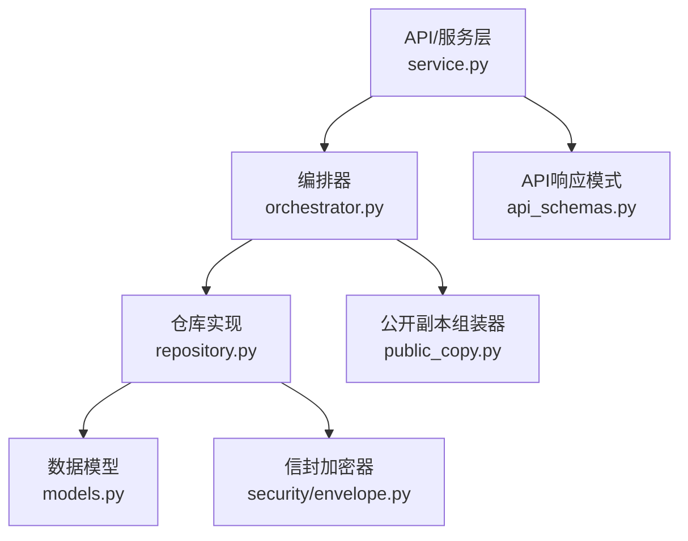
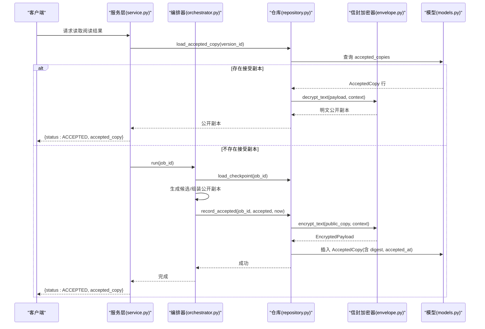
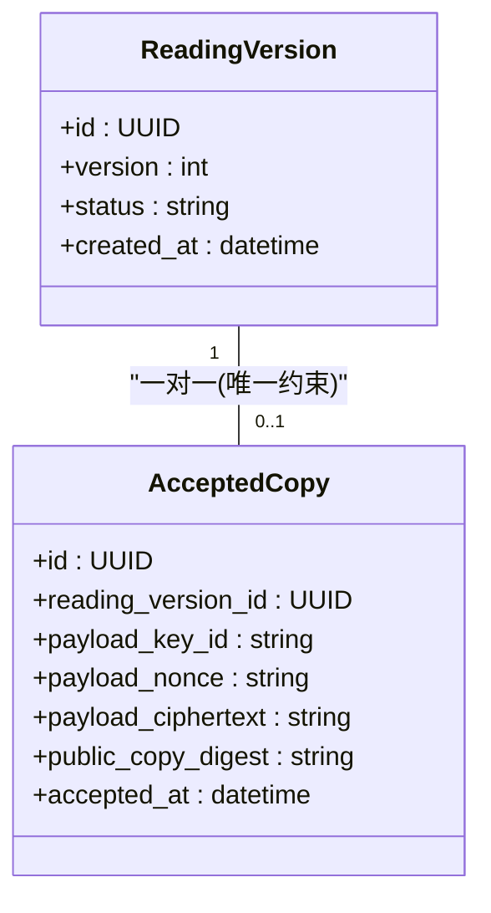
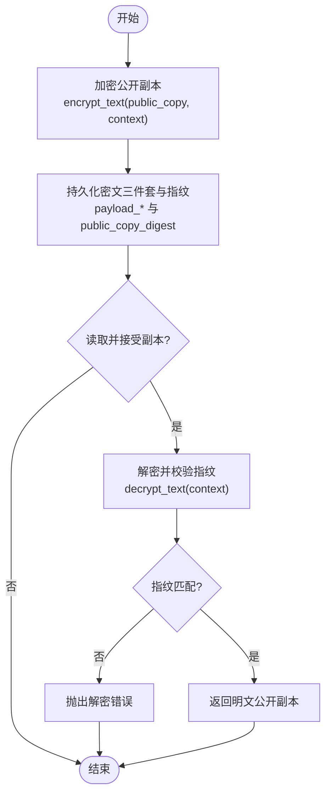
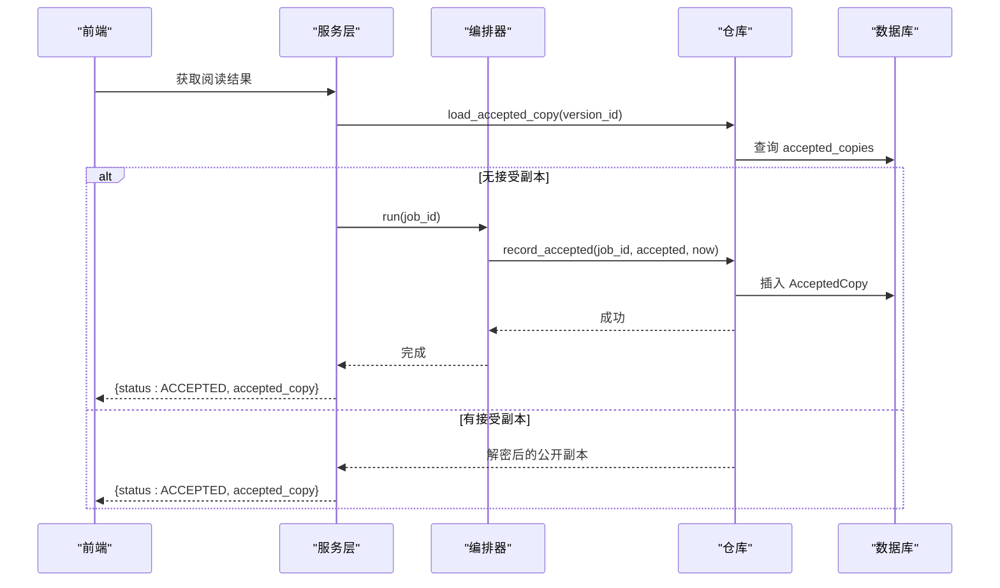
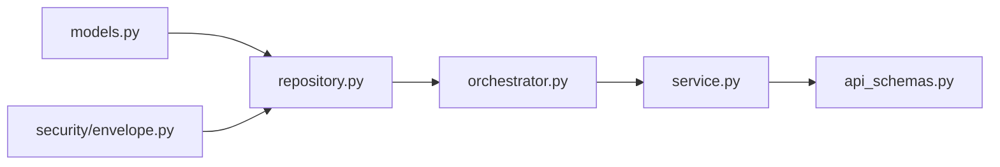

# 接受副本实体

<cite>
**本文引用的文件**
- [backend/app/readings/models.py](file://backend/app/readings/models.py)
- [backend/app/readings/repository.py](file://backend/app/readings/repository.py)
- [backend/app/security/envelope.py](file://backend/app/security/envelope.py)
- [backend/app/readings/public_copy.py](file://backend/app/readings/public_copy.py)
- [backend/app/readings/service.py](file://backend/app/readings/service.py)
- [backend/app/readings/orchestrator.py](file://backend/app/readings/orchestrator.py)
- [backend/app/readings/api_schemas.py](file://backend/app/readings/api_schemas.py)
</cite>

## 目录
1. [简介](#简介)
2. [项目结构](#项目结构)
3. [核心组件](#核心组件)
4. [架构总览](#架构总览)
5. [详细组件分析](#详细组件分析)
6. [依赖关系分析](#依赖关系分析)
7. [性能考虑](#性能考虑)
8. [故障排查指南](#故障排查指南)
9. [结论](#结论)
10. [附录](#附录)

## 简介
本文件围绕“接受副本实体”展开，聚焦 AcceptedCopy 表的设计目的、字段含义、加密存储机制、与 reading_versions 的一对一约束、accepted_at 时间戳的语义，以及不可变记录的数据完整性保障。同时给出用户接受流程与副本管理的端到端示例，帮助读者理解从候选结果到最终可交付的公开副本的完整生命周期。

## 项目结构
与“接受副本”相关的代码主要分布在以下模块：
- 数据模型定义：models.py
- 持久化与加解密读写：repository.py
- 内容信封加密器：security/envelope.py
- 公开副本组装与校验：public_copy.py
- 编排与状态流转：orchestrator.py
- 服务层聚合与对外响应：service.py
- API 响应模式：api_schemas.py

图表来源
- [backend/app/readings/service.py:320-344](file://backend/app/readings/service.py#L320-L344)
- [backend/app/readings/orchestrator.py:212-248](file://backend/app/readings/orchestrator.py#L212-L248)
- [backend/app/readings/repository.py:674-716](file://backend/app/readings/repository.py#L674-L716)
- [backend/app/readings/models.py:225-244](file://backend/app/readings/models.py#L225-L244)
- [backend/app/security/envelope.py:32-96](file://backend/app/security/envelope.py#L32-L96)
- [backend/app/readings/public_copy.py:13-45](file://backend/app/readings/public_copy.py#L13-L45)
- [backend/app/readings/api_schemas.py:121-129](file://backend/app/readings/api_schemas.py#L121-L129)

章节来源
- [backend/app/readings/models.py:225-244](file://backend/app/readings/models.py#L225-L244)
- [backend/app/readings/repository.py:674-716](file://backend/app/readings/repository.py#L674-L716)
- [backend/app/security/envelope.py:32-96](file://backend/app/security/envelope.py#L32-L96)
- [backend/app/readings/public_copy.py:13-45](file://backend/app/readings/public_copy.py#L13-L45)
- [backend/app/readings/service.py:320-344](file://backend/app/readings/service.py#L320-L344)
- [backend/app/readings/orchestrator.py:212-248](file://backend/app/readings/orchestrator.py#L212-L248)
- [backend/app/readings/api_schemas.py:121-129](file://backend/app/readings/api_schemas.py#L121-L129)

## 核心组件
- AcceptedCopy（接受副本）
  - 作用：存储用户接受的最终解读版本（公开副本），作为不可变的审计与交付凭证。
  - 关键字段：
    - reading_version_id：关联 reading_versions，形成一对一关系。
    - payload_key_id/payload_nonce/payload_ciphertext：密文三件套，用于安全存储用户确认的最终副本。
    - public_copy_digest：对公开副本计算的指纹（哈希），用于完整性校验与防篡改。
    - accepted_at：用户确认时间点，不可变且仅写入一次。
  - 约束：reading_version_id 唯一，确保每个阅读版本最多一条接受副本。
  - 不可变性：通过事件监听在更新前抛出异常，保证追加型只写。

- EnvelopeCipher（信封加密器）
  - 算法：AES-256-GCM + HMAC 指纹；使用上下文绑定（AAD）防止重放与串用。
  - 能力：encrypt_text/decrypt_text、encrypt_json/decrypt_json；返回 EncryptedPayload（key_id, nonce, ciphertext, fingerprint）。
  - 用途：为 AcceptedCopy.payload_* 提供机密性与完整性保护。

- PublicCopyAssembler（公开副本组装器）
  - 职责：将候选块与必要限制文本、披露文本拼接成最终公开副本，并执行长度、敏感标识等安全检查。
  - 输出：供 AcceptedCopy 加密存储的明文公开副本。

- Repository（仓库）
  - record_accepted：首次写入 AcceptedCopy，后续重复提交进行一致性比对（first-write-wins）。
  - load_accepted_copy：读取并解密 AcceptedCopy，返回用户可见的公开副本。
  - get_accepted_copy：按 reading_version_id 查询是否已有接受副本。

- Service/Orchestrator（服务与编排）
  - service.get_result：返回 ReadingResultResponse，包含 accepted_copy 字段。
  - orchestrator.run：若已存在 AcceptedCopy，直接返回 ACCEPTED 状态与公开副本。

章节来源
- [backend/app/readings/models.py:225-244](file://backend/app/readings/models.py#L225-L244)
- [backend/app/security/envelope.py:32-96](file://backend/app/security/envelope.py#L32-L96)
- [backend/app/readings/public_copy.py:13-45](file://backend/app/readings/public_copy.py#L13-L45)
- [backend/app/readings/repository.py:351-363](file://backend/app/readings/repository.py#L351-L363)
- [backend/app/readings/repository.py:674-716](file://backend/app/readings/repository.py#L674-L716)
- [backend/app/readings/service.py:320-344](file://backend/app/readings/service.py#L320-L344)
- [backend/app/readings/orchestrator.py:212-248](file://backend/app/readings/orchestrator.py#L212-L248)

## 架构总览
下图展示“用户接受流程”中各组件的交互顺序，包括公开副本组装、加密存储、状态推进与结果返回。

图表来源
- [backend/app/readings/service.py:320-344](file://backend/app/readings/service.py#L320-L344)
- [backend/app/readings/orchestrator.py:212-248](file://backend/app/readings/orchestrator.py#L212-L248)
- [backend/app/readings/repository.py:351-363](file://backend/app/readings/repository.py#L351-L363)
- [backend/app/readings/repository.py:674-716](file://backend/app/readings/repository.py#L674-L716)
- [backend/app/security/envelope.py:56-96](file://backend/app/security/envelope.py#L56-L96)
- [backend/app/readings/models.py:225-244](file://backend/app/readings/models.py#L225-L244)

## 详细组件分析

### AcceptedCopy 数据模型与约束
- 一对一关系：通过 UniqueConstraint("reading_version_id") 保证每个 reading_versions 仅对应一条接受副本。
- 不可变记录：AcceptedCopy 被注册为不可变模型，before_update 事件会抛出异常，确保追加型只写。
- 字段说明：
  - payload_key_id/payload_nonce/payload_ciphertext：由 EnvelopeCipher 生成的密文三件套，用于存储用户确认的最终副本。
  - public_copy_digest：对公开副本计算得到的指纹，用于完整性校验。
  - accepted_at：用户确认的时间点，仅在首次写入时设置。

图表来源
- [backend/app/readings/models.py:84-159](file://backend/app/readings/models.py#L84-L159)
- [backend/app/readings/models.py:225-244](file://backend/app/readings/models.py#L225-L244)

章节来源
- [backend/app/readings/models.py:225-244](file://backend/app/readings/models.py#L225-L244)
- [backend/app/readings/models.py:370-377](file://backend/app/readings/models.py#L370-L377)

### 加密存储机制与数据保护
- 加密算法：AES-256-GCM，结合上下文（context）作为附加认证数据（AAD），确保密文与上下文绑定，防止跨上下文重用。
- 指纹校验：使用独立密钥派生的 HMAC-SHA256 指纹，解密后比对，确保密文未被篡改。
- 存储策略：
  - 写入时：调用 encrypt_text(public_copy, context="...:accepted-copy")，得到 key_id/nonce/ciphertext/fingerprint，分别存入 payload_* 与 public_copy_digest。
  - 读取时：使用相同 context 解密并校验指纹，再返回明文公开副本。
- 安全性要点：
  - 非对称密钥轮换：key_id 标识当前使用的密钥，便于未来轮换。
  - 防重放：context 区分不同业务对象与阶段，避免同一密文在不同上下文中复用。
  - 完整性：fingerprint 校验失败即抛错，拒绝被篡改的密文。

图表来源
- [backend/app/security/envelope.py:56-96](file://backend/app/security/envelope.py#L56-L96)
- [backend/app/readings/repository.py:351-363](file://backend/app/readings/repository.py#L351-L363)
- [backend/app/readings/repository.py:674-716](file://backend/app/readings/repository.py#L674-L716)

章节来源
- [backend/app/security/envelope.py:32-96](file://backend/app/security/envelope.py#L32-L96)
- [backend/app/readings/repository.py:351-363](file://backend/app/readings/repository.py#L351-L363)
- [backend/app/readings/repository.py:674-716](file://backend/app/readings/repository.py#L674-L716)

### public_copy_digest 的作用
- 完整性校验：digest 是对公开副本计算的指纹，用于验证存储的密文对应的明文未被篡改。
- 幂等与一致性：record_accepted 在重复提交时，先解密已有副本并与新提交的公开副本比较，不一致则拒绝，确保 first-write-wins。
- 审计与追溯：digest 可作为外部审计的轻量级索引，无需解密即可判断是否一致。

章节来源
- [backend/app/readings/repository.py:674-716](file://backend/app/readings/repository.py#L674-L716)
- [backend/app/readings/models.py:225-244](file://backend/app/readings/models.py#L225-L244)

### 与 reading_versions 的一对一关系约束
- 唯一性：UniqueConstraint("reading_version_id") 确保每个阅读版本仅有一条接受副本。
- 级联删除：当 reading_versions 被删除时，对应的 AcceptedCopy 也会被级联删除，保持引用完整性。
- 业务意义：接受副本代表该版本最终的、不可变更的用户确认结果，一对一约束避免了歧义。

章节来源
- [backend/app/readings/models.py:225-244](file://backend/app/readings/models.py#L225-L244)

### accepted_at 时间戳的语义
- 语义：记录用户确认的最终时间点，作为审计与合规的关键证据。
- 写入时机：仅在首次写入 AcceptedCopy 时设置，后续不可修改（不可变记录）。
- 用途：可用于统计用户确认延迟、合规审计、争议处理等。

章节来源
- [backend/app/readings/models.py:225-244](file://backend/app/readings/models.py#L225-L244)
- [backend/app/readings/repository.py:674-716](file://backend/app/readings/repository.py#L674-L716)

### 不可变记录设计与数据完整性保证
- 不可变设计：AcceptedCopy 被加入不可变模型集合，before_update 事件抛出异常，阻止任何更新操作。
- 完整性保证：
  - 数据库层：唯一约束与外键约束保证关系正确。
  - 应用层：record_accepted 的 first-write-wins 逻辑与指纹校验确保内容不被覆盖或篡改。
  - 加密层：AES-GCM 与 HMAC 指纹确保机密性与完整性。

章节来源
- [backend/app/readings/models.py:370-377](file://backend/app/readings/models.py#L370-L377)
- [backend/app/readings/repository.py:674-716](file://backend/app/readings/repository.py#L674-L716)
- [backend/app/security/envelope.py:56-96](file://backend/app/security/envelope.py#L56-L96)

### 用户接受流程与副本管理示例
- 场景一：首次接受
  - 步骤：
    1) 编排器生成候选并组装公开副本。
    2) 仓库调用 record_accepted，加密存储并写入 accepted_at。
    3) 服务层返回 ReadingResultResponse，包含 accepted_copy。
  - 关键点：首次写入成功后，状态推进至 ACCEPTED。
- 场景二：重复接受
  - 行为：仓库先解密已有副本与新提交对比，一致则幂等返回，不一致则拒绝。
- 场景三：查看历史结果
  - 行为：服务层通过 load_accepted_copy 获取并解密公开副本，返回给前端。

图表来源
- [backend/app/readings/service.py:320-344](file://backend/app/readings/service.py#L320-L344)
- [backend/app/readings/orchestrator.py:212-248](file://backend/app/readings/orchestrator.py#L212-L248)
- [backend/app/readings/repository.py:351-363](file://backend/app/readings/repository.py#L351-L363)
- [backend/app/readings/repository.py:674-716](file://backend/app/readings/repository.py#L674-L716)

章节来源
- [backend/app/readings/service.py:320-344](file://backend/app/readings/service.py#L320-L344)
- [backend/app/readings/orchestrator.py:212-248](file://backend/app/readings/orchestrator.py#L212-L248)
- [backend/app/readings/repository.py:351-363](file://backend/app/readings/repository.py#L351-L363)
- [backend/app/readings/repository.py:674-716](file://backend/app/readings/repository.py#L674-L716)

## 依赖关系分析
- 模型依赖：
  - AcceptedCopy 依赖 reading_versions（外键与唯一约束）。
  - 不可变事件监听作用于 AcceptedCopy，阻止更新。
- 仓库依赖：
  - repository.py 依赖 models.py 与 security/envelope.py。
  - record_accepted/load_accepted_copy 使用 EnvelopeCipher 进行加解密。
- 编排与服务：
  - orchestrator.py 负责状态机推进，调用 repository.record_accepted。
  - service.py 聚合结果并返回 ReadingResultResponse。

图表来源
- [backend/app/readings/models.py:225-244](file://backend/app/readings/models.py#L225-L244)
- [backend/app/readings/repository.py:674-716](file://backend/app/readings/repository.py#L674-L716)
- [backend/app/security/envelope.py:32-96](file://backend/app/security/envelope.py#L32-L96)
- [backend/app/readings/orchestrator.py:212-248](file://backend/app/readings/orchestrator.py#L212-L248)
- [backend/app/readings/service.py:320-344](file://backend/app/readings/service.py#L320-L344)
- [backend/app/readings/api_schemas.py:121-129](file://backend/app/readings/api_schemas.py#L121-L129)

章节来源
- [backend/app/readings/models.py:225-244](file://backend/app/readings/models.py#L225-L244)
- [backend/app/readings/repository.py:674-716](file://backend/app/readings/repository.py#L674-L716)
- [backend/app/security/envelope.py:32-96](file://backend/app/security/envelope.py#L32-L96)
- [backend/app/readings/orchestrator.py:212-248](file://backend/app/readings/orchestrator.py#L212-L248)
- [backend/app/readings/service.py:320-344](file://backend/app/readings/service.py#L320-L344)
- [backend/app/readings/api_schemas.py:121-129](file://backend/app/readings/api_schemas.py#L121-L129)

## 性能考虑
- 加密成本：AES-GCM 加解密开销较低，但需避免频繁大对象加密；建议批量或缓存公开副本的解密结果（在服务层短生命周期内）。
- 数据库访问：load_accepted_copy 与 record_accepted 均涉及单行读写，注意事务边界与连接池配置。
- 指纹校验：HMAC 校验在解密后进行，增加少量 CPU 开销，但显著提升安全性。
- 并发控制：唯一约束与 first-write-wins 逻辑天然抑制重复写入，减少竞争。

[本节为通用指导，不直接分析具体文件]

## 故障排查指南
- 解密失败
  - 现象：抛出解密错误，提示认证失败或指纹不匹配。
  - 可能原因：上下文不一致、密钥 ID 不匹配、密文被篡改。
  - 处理：检查 context 参数与 key_id 是否一致；确认存储的密文未被修改。
- 重复接受冲突
  - 现象：尝试覆盖已有接受副本时报错。
  - 原因：first-write-wins 策略，已存在且内容不一致。
  - 处理：比对新旧公开副本，必要时回滚或提示用户。
- 缺少接受副本
  - 现象：服务层返回空 accepted_copy。
  - 原因：尚未完成接受流程或状态未推进至 ACCEPTED。
  - 处理：检查编排器状态与仓库记录，确保 record_accepted 已执行。

章节来源
- [backend/app/security/envelope.py:75-96](file://backend/app/security/envelope.py#L75-L96)
- [backend/app/readings/repository.py:674-716](file://backend/app/readings/repository.py#L674-L716)
- [backend/app/readings/service.py:320-344](file://backend/app/readings/service.py#L320-L344)

## 结论
AcceptedCopy 以不可变记录的形式保存用户接受的最终解读版本，通过 AES-GCM 与 HMAC 指纹实现机密性与完整性保护，借助唯一约束与 first-write-wins 策略确保数据一致性。accepted_at 精确记录用户确认时间点，配合 reading_versions 的一对一关系，构成完整的审计与交付闭环。结合编排器与服务层的协作，系统提供了健壮的用户接受流程与副本管理能力。

[本节为总结性内容，不直接分析具体文件]

## 附录
- API 响应字段
  - accepted_copy：字符串或空，表示已接受的公开副本。
  - status：当前状态，ACCEPTED 表示已完成接受。
- 相关模式
  - PublicCopyAssemblyError：公开副本组装失败时的异常类型。
  - ReadingResultResponse：服务层对外返回的结果模式。

章节来源
- [backend/app/readings/api_schemas.py:121-129](file://backend/app/readings/api_schemas.py#L121-L129)
- [backend/app/readings/public_copy.py:9-11](file://backend/app/readings/public_copy.py#L9-L11)