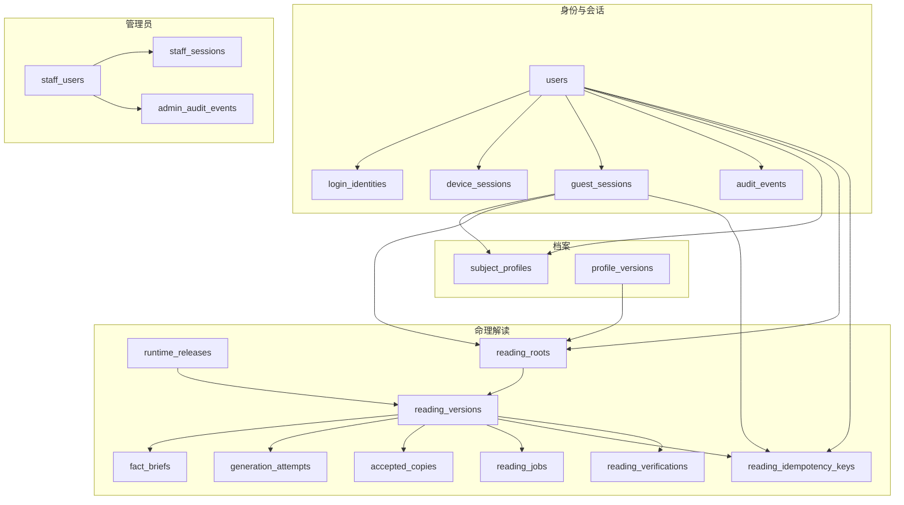
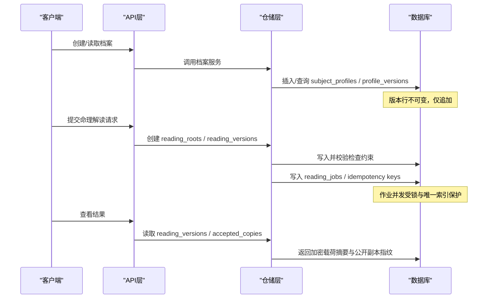
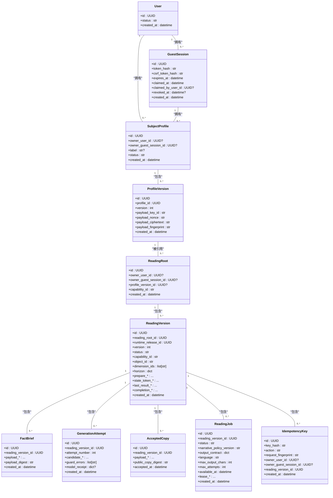
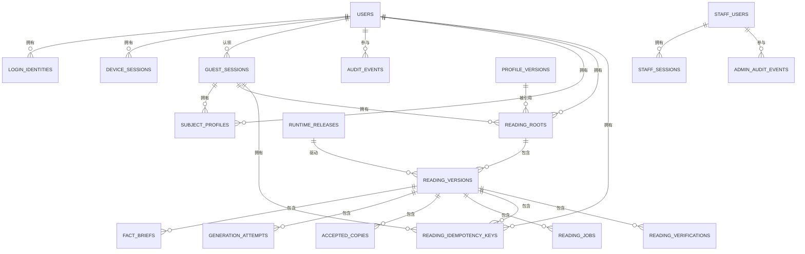

# 核心实体模型

<cite>
**本文引用的文件**
- [backend/app/identity/models.py](file://backend/app/identity/models.py)
- [backend/app/profiles/models.py](file://backend/app/profiles/models.py)
- [backend/app/readings/models.py](file://backend/app/readings/models.py)
- [backend/app/admin/models.py](file://backend/app/admin/models.py)
- [backend/app/persistence.py](file://backend/app/persistence.py)
- [backend/alembic/versions/0001_identity_foundation.py](file://backend/alembic/versions/0001_identity_foundation.py)
- [backend/alembic/versions/0002_profiles_and_readings.py](file://backend/alembic/versions/0002_profiles_and_readings.py)
- [backend/alembic/versions/0003_reading_integrity_constraints.py](file://backend/alembic/versions/0003_reading_integrity_constraints.py)
- [backend/alembic/versions/0008_admin_staff_foundation.py](file://backend/alembic/versions/0008_admin_staff_foundation.py)
</cite>

## 目录
1. [简介](#简介)
2. [项目结构](#项目结构)
3. [核心组件](#核心组件)
4. [架构总览](#架构总览)
5. [详细组件分析](#详细组件分析)
6. [依赖关系分析](#依赖关系分析)
7. [性能考量](#性能考量)
8. [故障排查指南](#故障排查指南)
9. [结论](#结论)
10. [附录：ER图与示例数据](#附录er图与示例数据)

## 简介
本文件聚焦于“用户、档案、命理解读、管理员”等核心实体的数据模型与关系，系统性说明主键设计、字段类型、约束条件、索引策略、不可变记录模式（append-only）、外键与级联行为、UUID 主键生成策略，以及数据验证规则与业务约束的实现细节。文档同时提供 ER 图与示例数据，帮助读者快速理解并正确使用这些核心模型。

## 项目结构
后端采用模块化组织，核心实体分布在以下模块：
- 身份与会话：用户、登录身份、设备会话、访客会话、审计事件
- 档案：主体档案与档案版本（加密载荷）
- 命理解读：运行发布、解读根、解读版本、事实摘要、生成尝试、已接受副本、解读作业、幂等键、解读验证
- 管理员：员工用户、员工会话、管理审计事件

图表来源
- [backend/app/identity/models.py:31-132](file://backend/app/identity/models.py#L31-L132)
- [backend/app/profiles/models.py:21-79](file://backend/app/profiles/models.py#L21-L79)
- [backend/app/readings/models.py:28-378](file://backend/app/readings/models.py#L28-L378)
- [backend/app/admin/models.py:17-81](file://backend/app/admin/models.py#L17-L81)

章节来源
- [backend/app/identity/models.py:31-132](file://backend/app/identity/models.py#L31-L132)
- [backend/app/profiles/models.py:21-79](file://backend/app/profiles/models.py#L21-L79)
- [backend/app/readings/models.py:28-378](file://backend/app/readings/models.py#L28-L378)
- [backend/app/admin/models.py:17-81](file://backend/app/admin/models.py#L17-L81)

## 核心组件
- 用户与会话：支撑认证、授权与审计的基础实体，使用 UUID 主键与时间戳，具备唯一性约束与索引优化查询。
- 档案：主体档案与其不可变版本，版本行通过数据库约束与 ORM 事件双重保护，确保只追加不修改。
- 命理解读：围绕“解读版本”的完整生命周期，包含输入准备、候选结果、最终接受副本、作业调度与幂等控制；多处使用检查约束保证密文信封完整性。
- 管理员：员工账号与会话、管理审计事件，用于后台管理与操作追溯。

章节来源
- [backend/app/identity/models.py:31-132](file://backend/app/identity/models.py#L31-L132)
- [backend/app/profiles/models.py:21-79](file://backend/app/profiles/models.py#L21-L79)
- [backend/app/readings/models.py:28-378](file://backend/app/readings/models.py#L28-L378)
- [backend/app/admin/models.py:17-81](file://backend/app/admin/models.py#L17-L81)

## 架构总览
核心数据流围绕“用户/访客 -> 档案 -> 命理解读”展开：
- 用户或访客创建主体档案，档案以不可变版本形式存储加密载荷。
- 基于档案版本创建解读根，随后产生多个解读版本，每个版本关联运行发布、能力标识、对象标识与维度集合。
- 解读版本在作业队列中执行，产出候选结果与最终接受副本，期间记录生成尝试与幂等键，保障可重放与一致性。
- 所有关键状态变更均附带审计事件，便于追踪与合规。

图表来源
- [backend/app/profiles/models.py:21-79](file://backend/app/profiles/models.py#L21-L79)
- [backend/app/readings/models.py:53-378](file://backend/app/readings/models.py#L53-L378)

## 详细组件分析

### 用户与会话（身份基础）
- users：用户主表，UUID 主键，默认 uuid4；status 默认 active；created_at 带时区时间戳。
- login_identities：绑定第三方登录身份，唯一约束 (provider, provider_subject_hash)，按 user_id 建索引；删除用户级联删除。
- device_sessions：设备会话，token_hash 唯一；按 user_id 建索引；支持撤销时间戳。
- guest_sessions：访客会话，token_hash 唯一；过期时间索引；可被认领到用户（claimed_by_user_id），删除用户时置空。
- audit_events：用户行为审计，JSONB 元数据，按 user_id 建索引。

主键与索引
- 全部主键为 UUID，默认由 uuid4 生成。
- 常用查询列建立索引：user_id、expires_at、staff_user_id、created_at 等。

约束与级联
- 多数外键 ondelete=CASCADE，保证清理一致；部分审计类外键 ondelete=SET NULL，保留历史。

章节来源
- [backend/app/identity/models.py:31-132](file://backend/app/identity/models.py#L31-L132)
- [backend/alembic/versions/0001_identity_foundation.py:19-123](file://backend/alembic/versions/0001_identity_foundation.py#L19-L123)

### 档案（主体与版本）
- subject_profiles：主体档案，owner_user_id 与 owner_guest_session_id 二选一（检查约束）。
- profile_versions：档案版本，唯一约束 (profile_id, version)；ORM before_update 抛出不可变错误，实现 append-only。

不可变记录模式
- 通过 SQLAlchemy event 监听 before_update，直接抛出 ImmutableRecordError，阻止任何更新操作。
- 配合数据库唯一约束，确保版本线性增长且不可篡改。

章节来源
- [backend/app/profiles/models.py:21-79](file://backend/app/profiles/models.py#L21-L79)
- [backend/alembic/versions/0002_profiles_and_readings.py:28-72](file://backend/alembic/versions/0002_profiles_and_readings.py#L28-L72)

### 命理解读（核心工作流）
- runtime_releases：运行发布元信息，release_manifest_digest 唯一。
- reading_roots：解读根，owner_user_id 与 owner_guest_session_id 二选一；引用 profile_versions（RESTRICT 防止误删）。
- reading_versions：解读版本，唯一约束 (reading_root_id, version)；多组检查约束保证 state_token、last_result、completion 三组密文信封“全有或全无”。
- fact_briefs：事实摘要，唯一约束 reading_version_id；密文信封字段齐全。
- generation_attempts：生成尝试，唯一约束 (reading_version_id, attempt_number)；candidate 密文信封检查约束。
- accepted_copies：已接受副本，唯一约束 reading_version_id；记录 public_copy_digest 与接受时间。
- reading_jobs：作业队列，条件唯一索引限制活跃作业；lease 字段成对出现（检查约束）；按 status+available_at 建索引加速领取。
- reading_idempotency_keys：幂等键，唯一约束 (key_hash, owner_user_id, owner_guest_session_id)；按 reading_version_id 建索引。
- reading_verifications：用户反馈，outcome 枚举约束。

不可变记录模式
- RuntimeRelease、FactBrief、GenerationAttempt、AcceptedCopy 统一通过事件监听 before_update 抛出 ImmutableRecordError，强制 append-only。

外键与级联
- 大部分子表 ondelete=CASCADE，确保删除父记录时级联清理。
- reading_roots 引用 profile_versions 使用 RESTRICT，避免误删正在使用的档案版本。

章节来源
- [backend/app/readings/models.py:28-378](file://backend/app/readings/models.py#L28-L378)
- [backend/alembic/versions/0002_profiles_and_readings.py:73-288](file://backend/alembic/versions/0002_profiles_and_readings.py#L73-L288)
- [backend/alembic/versions/0003_reading_integrity_constraints.py:17-88](file://backend/alembic/versions/0003_reading_integrity_constraints.py#L17-L88)

### 管理员（员工与会话、审计）
- staff_users：员工账号，email 唯一，status 索引；密码哈希、角色、显示名等。
- staff_sessions：员工会话，token_hash 唯一，按 staff_user_id 建索引；支持撤销。
- admin_audit_events：管理审计事件，JSONB 元数据，按 staff_user_id 与 created_at 建索引。

章节来源
- [backend/app/admin/models.py:17-81](file://backend/app/admin/models.py#L17-L81)
- [backend/alembic/versions/0008_admin_staff_foundation.py:19-103](file://backend/alembic/versions/0008_admin_staff_foundation.py#L19-L103)

## 依赖关系分析
- 身份与会话是其他实体的基础，用户与访客会话作为 owner 出现在档案与解读根。
- 档案版本被解读根引用，解读版本为核心聚合根，承载密文载荷与作业状态。
- 作业与幂等键围绕解读版本进行并发控制与去重。
- 管理员子系统独立但共享 Base 命名约定与审计风格。

图表来源
- [backend/app/identity/models.py:31-132](file://backend/app/identity/models.py#L31-L132)
- [backend/app/profiles/models.py:21-79](file://backend/app/profiles/models.py#L21-L79)
- [backend/app/readings/models.py:28-378](file://backend/app/readings/models.py#L28-L378)

## 性能考量
- 索引策略
  - 高频查询列建立索引：user_id、expires_at、staff_user_id、created_at 等。
  - reading_jobs 使用条件唯一索引限制活跃作业，避免同一解读版本并发重复执行。
  - reading_jobs 按 (status, available_at) 建复合索引，提升作业领取效率。
- 约束与校验
  - 检查约束保证密文信封完整性，减少应用层校验开销与不一致风险。
  - 唯一约束防止重复写入（如幂等键、版本号组合）。
- 不可变记录
  - 通过数据库与 ORM 双重保护，避免意外更新导致的数据漂移。
- 时间戳与时区
  - 所有时间字段带时区，避免跨时区问题，利于排序与窗口查询。

[本节为通用指导，不直接分析具体文件]

## 故障排查指南
- 不可变记录被更新
  - 现象：触发 before_update 事件抛出 ImmutableRecordError。
  - 原因：试图更新 RuntimeRelease、FactBrief、GenerationAttempt、AcceptedCopy、ProfileVersion 等不可变记录。
  - 处理：改为插入新记录（追加模式），不要尝试 UPDATE。
- 作业并发冲突
  - 现象：同一 reading_version_id 的活跃作业唯一性约束失败。
  - 原因：并发提交导致重复领取。
  - 处理：确保幂等键与作业领取逻辑正确，重试时先查询是否存在活跃作业。
- 密文信封不完整
  - 现象：检查约束失败（如 state_token、last_result、completion、candidate 等）。
  - 原因：部分字段为空而另一部分非空。
  - 处理：确保成对字段同时存在或同时为空。
- 所有者二选一约束失败
  - 现象：subject_profiles、reading_roots、reading_idempotency_keys 的 owner_exactly_one 约束失败。
  - 原因：owner_user_id 与 owner_guest_session_id 同时为空或同时非空。
  - 处理：确保二者之一为非空。

章节来源
- [backend/app/persistence.py:1-3](file://backend/app/persistence.py#L1-L3)
- [backend/app/profiles/models.py:77-79](file://backend/app/profiles/models.py#L77-L79)
- [backend/app/readings/models.py:370-377](file://backend/app/readings/models.py#L370-L377)
- [backend/alembic/versions/0003_reading_integrity_constraints.py:17-88](file://backend/alembic/versions/0003_reading_integrity_constraints.py#L17-L88)

## 结论
该数据模型以“不可变记录 + 强约束 + 明确外键关系”为核心设计原则，围绕用户、档案、命理解读与管理员四大领域构建稳定、可审计、可扩展的数据层。通过数据库检查约束与 ORM 事件双重保障，确保数据一致性与安全性；通过合理的索引与条件唯一约束，提升并发与查询性能。建议在新增功能时遵循相同范式：优先使用不可变追加、显式约束与清晰的外键关系，以保证长期可维护性。

[本节为总结，不直接分析具体文件]

## 附录：ER图与示例数据

### ER图（概念映射）

图表来源
- [backend/app/identity/models.py:31-132](file://backend/app/identity/models.py#L31-L132)
- [backend/app/profiles/models.py:21-79](file://backend/app/profiles/models.py#L21-L79)
- [backend/app/readings/models.py:28-378](file://backend/app/readings/models.py#L28-L378)
- [backend/app/admin/models.py:17-81](file://backend/app/admin/models.py#L17-L81)

### 示例数据（示意）
- 用户
  - users.id = "a1b2c3d4-..."
  - users.status = "active"
  - users.created_at = "2026-08-09T12:00:00Z"
- 访客会话
  - guest_sessions.token_hash = "sha256(...)"
  - guest_sessions.expires_at = "2026-08-10T12:00:00Z"
- 主体档案
  - subject_profiles.owner_user_id = "a1b2c3d4-..."
  - subject_profiles.status = "active"
- 档案版本
  - profile_versions.profile_id = "e5f6g7h8-..."
  - profile_versions.version = 1
  - profile_versions.payload_key_id = "key-id-1"
  - profile_versions.payload_nonce = "nonce-1"
  - profile_versions.payload_ciphertext = "encrypted-data"
  - profile_versions.payload_fingerprint = "fp-1"
- 解读根
  - reading_roots.owner_user_id = "a1b2c3d4-..."
  - reading_roots.profile_version_id = "e5f6g7h8-..."
  - reading_roots.capability_id = "bazi"
- 解读版本
  - reading_versions.reading_root_id = "i9j0k1l2-..."
  - reading_versions.runtime_release_id = "m3n4o5p6-..."
  - reading_versions.version = 1
  - reading_versions.status = "input_ready"
  - reading_versions.dimension_ids = ["year","month"]
  - reading_versions.horizon = {"from":"2026-01-01","to":"2026-12-31"}
  - reading_versions.prepare_key_id = "prep-key"
  - reading_versions.prepare_nonce = "prep-nonce"
  - reading_versions.prepare_ciphertext = "prep-cipher"
  - reading_versions.prepare_digest = "prep-digest"
- 事实摘要
  - fact_briefs.reading_version_id = "q7r8s9t0-..."
  - fact_briefs.payload_key_id = "brief-key"
  - fact_briefs.payload_nonce = "brief-nonce"
  - fact_briefs.payload_ciphertext = "brief-cipher"
  - fact_briefs.payload_digest = "brief-digest"
- 生成尝试
  - generation_attempts.reading_version_id = "u1v2w3x4-..."
  - generation_attempts.attempt_number = 1
  - generation_attempts.candidate_key_id = "cand-key"
  - generation_attempts.candidate_nonce = "cand-nonce"
  - generation_attempts.candidate_ciphertext = "cand-cipher"
  - generation_attempts.candidate_digest = "cand-digest"
  - generation_attempts.guard_errors = []
- 已接受副本
  - accepted_copies.reading_version_id = "y5z6a7b8-..."
  - accepted_copies.payload_key_id = "acc-key"
  - accepted_copies.payload_nonce = "acc-nonce"
  - accepted_copies.payload_ciphertext = "acc-cipher"
  - accepted_copies.public_copy_digest = "pub-digest"
  - accepted_copies.accepted_at = "2026-08-09T13:00:00Z"
- 解读作业
  - reading_jobs.reading_version_id = "c9d0e1f2-..."
  - reading_jobs.status = "queued"
  - reading_jobs.narrative_policy_version = "v1"
  - reading_jobs.output_contract = {"schema":"v1"}
  - reading_jobs.language = "zh-CN"
  - reading_jobs.max_output_chars = 2000
  - reading_jobs.max_attempts = 3
  - reading_jobs.available_at = "2026-08-09T12:05:00Z"
- 幂等键
  - reading_idempotency_keys.key_hash = "hash-1"
  - reading_idempotency_keys.action = "create_reading"
  - reading_idempotency_keys.request_fingerprint = "fp-req"
  - reading_idempotency_keys.owner_user_id = "a1b2c3d4-..."
  - reading_idempotency_keys.reading_version_id = "g3h4i5j6-..."
- 管理员
  - staff_users.email = "admin@example.com"
  - staff_users.role = "superadmin"
  - staff_users.status = "active"
  - staff_sessions.staff_user_id = "k7l8m9n0-..."
  - admin_audit_events.staff_user_id = "k7l8m9n0-..."
  - admin_audit_events.action = "update_profile"
  - admin_audit_events.event_metadata = {"target":"profile-1"}

[本节为概念示例，不直接分析具体文件]