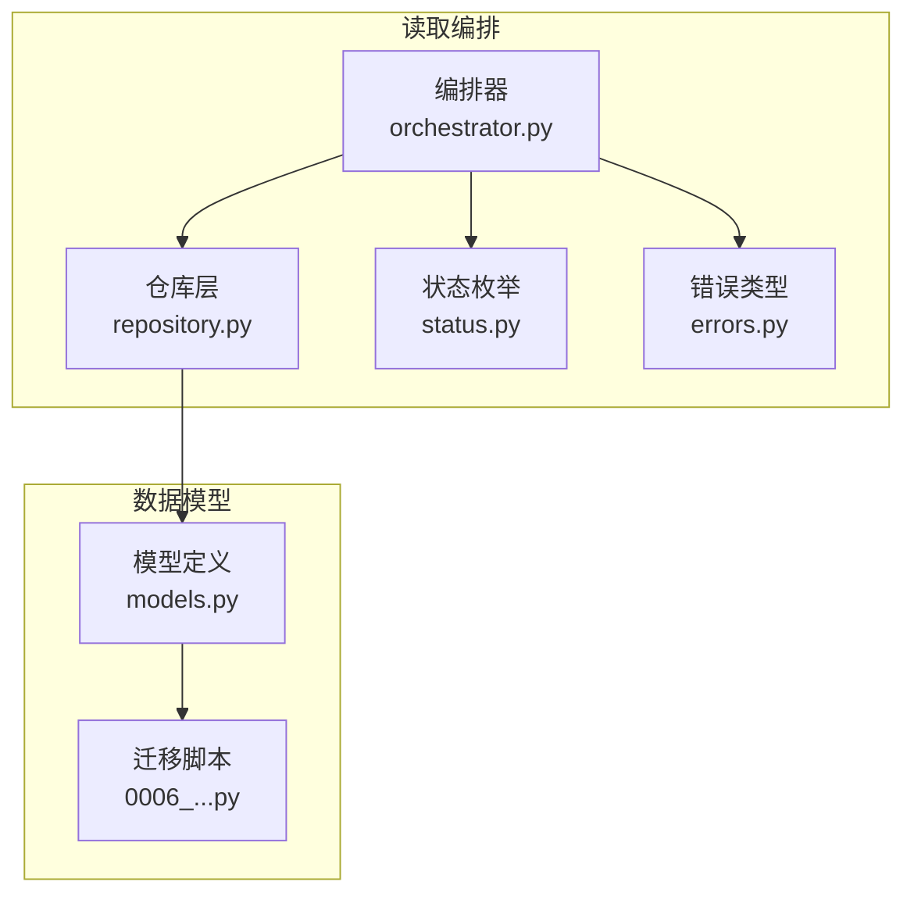
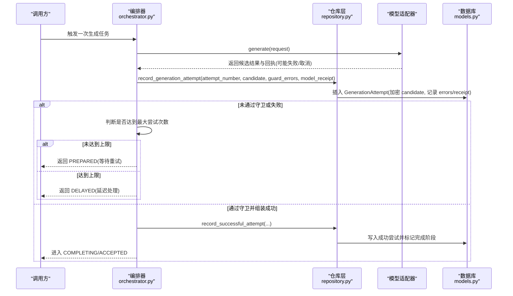
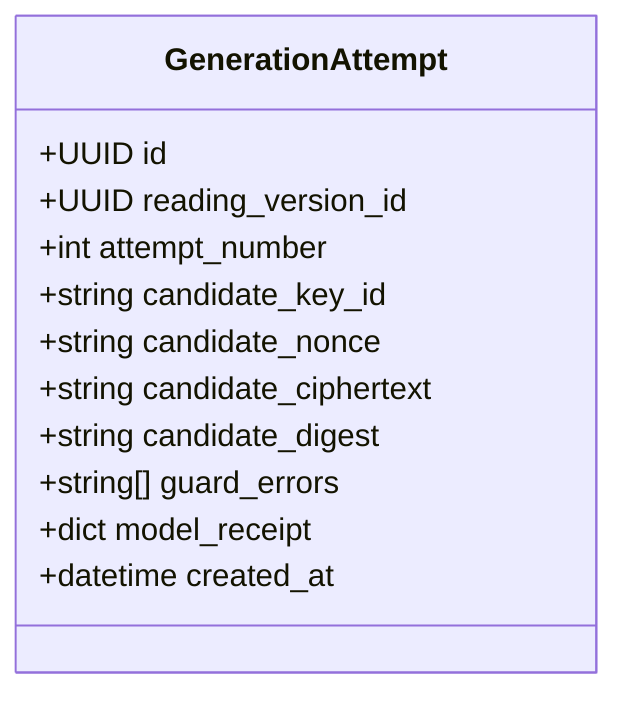
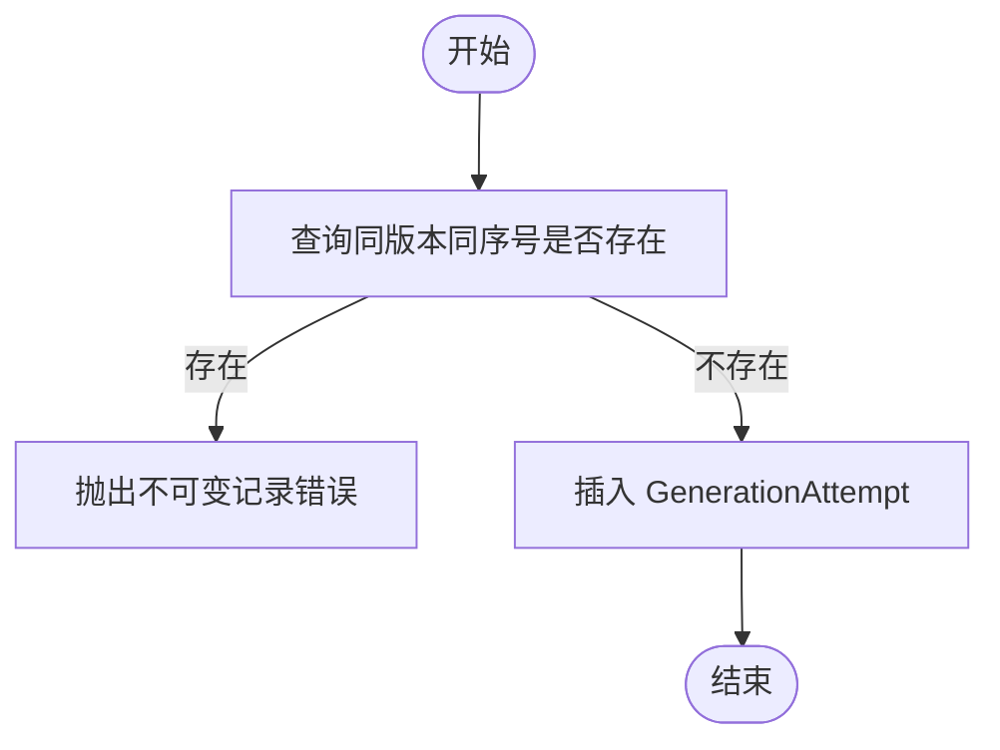
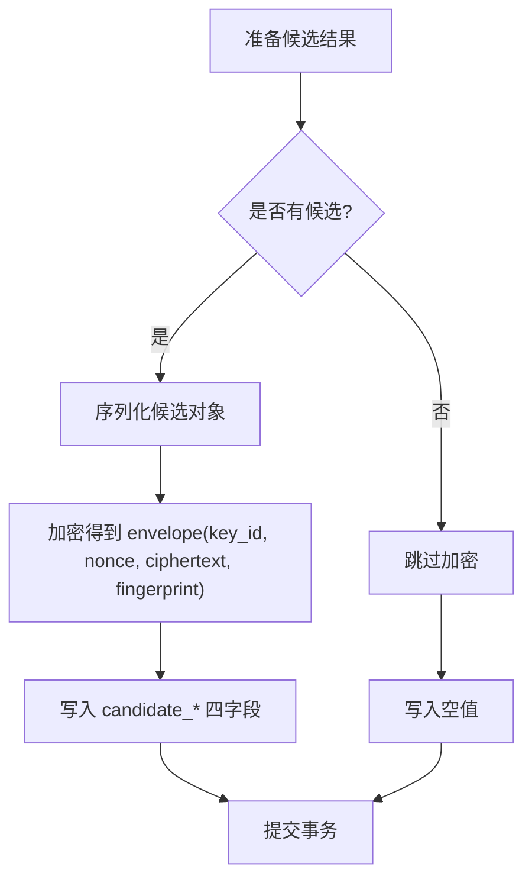
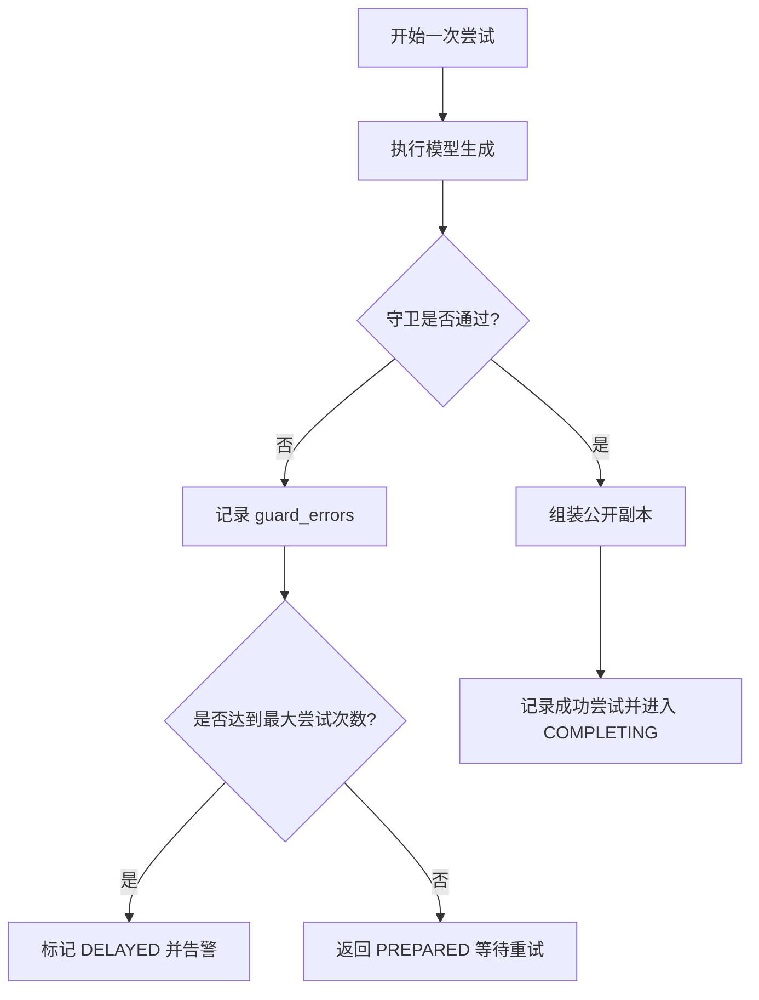
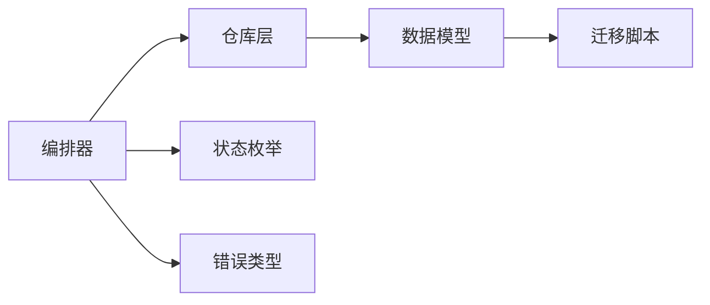

# 生成尝试实体

<cite>
**本文引用的文件**
- [models.py](file://backend/app/readings/models.py)
- [repository.py](file://backend/app/readings/repository.py)
- [orchestrator.py](file://backend/app/readings/orchestrator.py)
- [errors.py](file://backend/app/readings/errors.py)
- [status.py](file://backend/app/readings/status.py)
- [0006_generation_attempt_model_receipt.py](file://backend/alembic/versions/0006_generation_attempt_model_receipt.py)
- [test_reading_migrations.py](file://backend/tests/test_reading_migrations.py)
- [test_reading_repository.py](file://backend/tests/test_reading_repository.py)
</cite>

## 目录
1. [引言](#引言)
2. [项目结构](#项目结构)
3. [核心组件](#核心组件)
4. [架构总览](#架构总览)
5. [详细组件分析](#详细组件分析)
6. [依赖关系分析](#依赖关系分析)
7. [性能考虑](#性能考虑)
8. [故障排查指南](#故障排查指南)
9. [结论](#结论)
10. [附录](#附录)

## 引言
本文件围绕“生成尝试实体”（GenerationAttempt）展开，系统化说明其在命理解读生成过程中的设计目的、字段语义与约束、加密存储机制、错误日志记录、模型响应元数据存储、不可变记录保护、失败重试策略以及完整的生命周期管理。目标是让读者在不深入代码细节的情况下，也能准确理解该实体的职责边界与行为约定。

## 项目结构
与 GenerationAttempt 相关的实现分布在后端模块的以下位置：
- 数据模型定义：backend/app/readings/models.py
- 持久化与写入逻辑：backend/app/readings/repository.py
- 编排流程与重试控制：backend/app/readings/orchestrator.py
- 状态枚举：backend/app/readings/status.py
- 领域错误类型：backend/app/readings/errors.py
- 数据库迁移（新增 model_receipt 列）：backend/alembic/versions/0006_generation_attempt_model_receipt.py
- 相关测试：backend/tests/test_reading_migrations.py、backend/tests/test_reading_repository.py

图表来源
- [orchestrator.py:306-386](file://backend/app/readings/orchestrator.py#L306-L386)
- [repository.py:616-790](file://backend/app/readings/repository.py#L616-L790)
- [models.py:188-222](file://backend/app/readings/models.py#L188-L222)
- [0006_generation_attempt_model_receipt.py:19-26](file://backend/alembic/versions/0006_generation_attempt_model_receipt.py#L19-L26)

章节来源
- [models.py:188-222](file://backend/app/readings/models.py#L188-L222)
- [repository.py:616-790](file://backend/app/readings/repository.py#L616-L790)
- [orchestrator.py:306-386](file://backend/app/readings/orchestrator.py#L306-L386)
- [status.py:1-13](file://backend/app/readings/status.py#L1-L13)
- [errors.py:1-30](file://backend/app/readings/errors.py#L1-L30)
- [0006_generation_attempt_model_receipt.py:19-26](file://backend/alembic/versions/0006_generation_attempt_model_receipt.py#L19-L26)

## 核心组件
- GenerationAttempt 表：用于记录每次模型生成尝试的结果与上下文，包括候选结果、守卫错误、模型调用回执等。
- 唯一性约束：在同一阅读版本下，attempt_number 必须唯一，确保“第几次尝试”的全局有序且可追溯。
- 候选结果加密：candidate_* 字段以密文形式存储，包含密钥标识、随机数、密文与指纹，保证敏感内容不落库明文。
- 错误日志：guard_errors 记录守卫校验阶段的错误码或信息，便于定位问题。
- 模型回执：model_receipt 记录独立模型调用的元数据（如提供方、耗时、用量、成本等），用于审计与计费。
- 不可变记录：GenerationAttempt 为追加型记录，禁止更新，防止篡改历史。

章节来源
- [models.py:188-222](file://backend/app/readings/models.py#L188-L222)
- [repository.py:756-790](file://backend/app/readings/repository.py#L756-L790)
- [0006_generation_attempt_model_receipt.py:19-26](file://backend/alembic/versions/0006_generation_attempt_model_receipt.py#L19-L26)

## 架构总览
生成尝试的生命周期由编排器驱动，仓库层负责落库，数据模型通过约束与事件监听保障完整性与不可变性。

图表来源
- [orchestrator.py:306-386](file://backend/app/readings/orchestrator.py#L306-L386)
- [repository.py:616-790](file://backend/app/readings/repository.py#L616-L790)
- [models.py:188-222](file://backend/app/readings/models.py#L188-L222)

## 详细组件分析

### GenerationAttempt 表结构与约束
- 主键与关联：id 为主键；reading_version_id 外键关联到阅读版本。
- attempt_number：尝试序号，与 reading_version_id 构成唯一约束，确保每个版本的尝试序列不重复。
- candidate_*：候选结果的加密信封，包含 key_id、nonce、ciphertext、digest，数据库层面通过检查约束强制“全有或全无”。
- guard_errors：JSON 数组，记录守卫校验失败的错误码/信息。
- model_receipt：JSON 字段，记录模型调用回执（独立于候选结果），便于审计与成本核算。
- created_at：创建时间戳。

图表来源
- [models.py:188-222](file://backend/app/readings/models.py#L188-L222)

章节来源
- [models.py:188-222](file://backend/app/readings/models.py#L188-L222)

### attempt_number 的尝试序号管理与唯一性约束
- 唯一性：在同一个 reading_version_id 下，attempt_number 必须唯一，避免重复写入同一序号。
- 顺序性：编排器按 completed_attempts + 1 计算下一次尝试序号，确保严格递增。
- 幂等保护：仓库层在插入前查询是否存在同版本同序号的记录，若存在则抛出不可变记录错误，防止覆盖。

图表来源
- [repository.py:756-790](file://backend/app/readings/repository.py#L756-L790)
- [orchestrator.py:306-386](file://backend/app/readings/orchestrator.py#L306-L386)

章节来源
- [repository.py:756-790](file://backend/app/readings/repository.py#L756-L790)
- [orchestrator.py:306-386](file://backend/app/readings/orchestrator.py#L306-L386)

### candidate_* 字段的候选结果加密存储机制
- 加密入口：当存在候选结果时，仓库层使用加密器将候选对象序列化后加密，得到 key_id、nonce、ciphertext、fingerprint。
- 落库字段：candidate_key_id、candidate_nonce、candidate_ciphertext、candidate_digest 分别保存上述值。
- 完整性约束：数据库检查约束要求四个字段要么全部为空，要么全部非空，防止部分写入导致的不一致。
- 测试验证：测试用例覆盖了仅写入部分字段会触发完整性错误的场景。

图表来源
- [repository.py:756-790](file://backend/app/readings/repository.py#L756-L790)
- [models.py:188-222](file://backend/app/readings/models.py#L188-L222)
- [test_reading_migrations.py:383-417](file://backend/tests/test_reading_migrations.py#L383-L417)

章节来源
- [repository.py:756-790](file://backend/app/readings/repository.py#L756-L790)
- [models.py:188-222](file://backend/app/readings/models.py#L188-L222)
- [test_reading_migrations.py:383-417](file://backend/tests/test_reading_migrations.py#L383-L417)

### guard_errors 字段的错误日志记录和调试信息
- 用途：记录守卫校验阶段的错误集合，便于追踪哪些规则未通过。
- 写入时机：无论成功与否，只要未产出公开副本，都会记录本次尝试的错误集合。
- 编排器行为：若守卫未通过，会发出告警事件并决定是否继续重试或延迟。

章节来源
- [orchestrator.py:306-386](file://backend/app/readings/orchestrator.py#L306-L386)
- [repository.py:616-790](file://backend/app/readings/repository.py#L616-L790)

### model_receipt 字段的模型响应元数据存储
- 用途：记录独立模型调用的回执，包含提供方、模型版本、请求指纹、耗时、用量、成本等信息。
- 写入路径：成功或失败（含取消）均可能携带回执；编排器在异常分支中也会提取回执并记录。
- 迁移支持：通过迁移脚本为 generation_attempts 表新增 JSON 列以存储回执。

章节来源
- [orchestrator.py:306-386](file://backend/app/readings/orchestrator.py#L306-L386)
- [0006_generation_attempt_model_receipt.py:19-26](file://backend/alembic/versions/0006_generation_attempt_model_receipt.py#L19-L26)
- [test_reading_repository.py:247-288](file://backend/tests/test_reading_repository.py#L247-L288)

### 不可变记录的保护机制
- 数据库级：通过唯一约束与检查约束保证数据的完整性和一致性。
- ORM 级：对 GenerationAttempt 等模型注册 before_update 事件，任何更新操作都会抛出不可变记录错误，确保“只追加不修改”。
- 应用级：仓库层在插入前进行存在性检查，避免重复写入相同序号。

章节来源
- [models.py:370-377](file://backend/app/readings/models.py#L370-L377)
- [repository.py:756-790](file://backend/app/readings/repository.py#L756-L790)
- [test_reading_repository.py:291-324](file://backend/tests/test_reading_repository.py#L291-L324)

### 生成失败的重试策略与错误处理流程
- 重试条件：若本次尝试未产生公开副本（即未通过守卫或模型调用失败），编排器根据当前尝试序号与最大尝试次数决定后续动作。
- 达到上限：当 attempt_number >= max_attempts 时，将作业标记为 DELAYED，并发出延迟告警。
- 未达上限：返回 PREPARED，允许外部调度再次尝试。
- 异常处理：捕获模型生成失败与取消两类异常，提取回执并记录错误码，保证审计链路完整。

图表来源
- [orchestrator.py:306-386](file://backend/app/readings/orchestrator.py#L306-L386)
- [status.py:1-13](file://backend/app/readings/status.py#L1-L13)

章节来源
- [orchestrator.py:306-386](file://backend/app/readings/orchestrator.py#L306-L386)
- [status.py:1-13](file://backend/app/readings/status.py#L1-L13)

### 完整的生成尝试生命周期管理
- 初始化：编排器计算下一次 attempt_number。
- 执行：调用模型生成，获取候选结果与回执。
- 守卫：校验候选结果是否符合输出契约，收集错误。
- 记录：无论成败，只要未产出公开副本，就记录一次 GenerationAttempt（含加密候选、错误、回执）。
- 决策：根据是否达到最大尝试次数，决定返回 PREPARED 或 DELAYED。
- 成功：若通过守卫并成功组装公开副本，记录成功尝试并推进到 COMPLETING/ACCEPTED。

章节来源
- [orchestrator.py:306-386](file://backend/app/readings/orchestrator.py#L306-L386)
- [repository.py:616-790](file://backend/app/readings/repository.py#L616-L790)
- [status.py:1-13](file://backend/app/readings/status.py#L1-L13)

## 依赖关系分析
- 编排器依赖仓库层进行持久化，依赖状态枚举进行状态流转，依赖错误类型进行异常分类。
- 仓库层依赖数据模型进行表映射，并通过加密器对候选结果进行安全存储。
- 数据模型通过约束与事件监听保障完整性与不可变性。
- 迁移脚本扩展了 model_receipt 字段，使回执得以持久化。

图表来源
- [orchestrator.py:306-386](file://backend/app/readings/orchestrator.py#L306-L386)
- [repository.py:616-790](file://backend/app/readings/repository.py#L616-L790)
- [models.py:188-222](file://backend/app/readings/models.py#L188-L222)
- [0006_generation_attempt_model_receipt.py:19-26](file://backend/alembic/versions/0006_generation_attempt_model_receipt.py#L19-L26)

章节来源
- [orchestrator.py:306-386](file://backend/app/readings/orchestrator.py#L306-L386)
- [repository.py:616-790](file://backend/app/readings/repository.py#L616-L790)
- [models.py:188-222](file://backend/app/readings/models.py#L188-L222)
- [0006_generation_attempt_model_receipt.py:19-26](file://backend/alembic/versions/0006_generation_attempt_model_receipt.py#L19-L26)

## 性能考虑
- 加密开销：每次尝试若存在候选结果，需进行序列化与加密，建议在批量或高频场景评估吞吐影响。
- 索引建议：针对 reading_version_id 与 attempt_number 的组合查询已受唯一约束保护，通常无需额外索引；如需按时间范围检索，可考虑在 created_at 上建立索引。
- 重试频率：max_attempts 应结合模型调用成本与系统负载合理配置，避免频繁重试造成资源浪费。

[本节提供通用指导，不直接分析具体文件]

## 故障排查指南
- 唯一冲突：若出现“Generation Attempt already exists”，检查是否重复写入相同 reading_version_id 与 attempt_number。
- 部分写入失败：若插入时报完整性错误，确认 candidate_* 四字段是否同时写入或同时为空。
- 不可变记录错误：任何尝试更新 GenerationAttempt 的操作都会失败，这是预期行为；如需修正，应通过新尝试记录体现。
- 回执缺失：若审计发现 model_receipt 为空，检查编排器异常分支是否正确提取回执并记录。

章节来源
- [repository.py:756-790](file://backend/app/readings/repository.py#L756-L790)
- [models.py:188-222](file://backend/app/readings/models.py#L188-L222)
- [test_reading_migrations.py:383-417](file://backend/tests/test_reading_migrations.py#L383-L417)
- [test_reading_repository.py:291-324](file://backend/tests/test_reading_repository.py#L291-L324)

## 结论
GenerationAttempt 作为命理解读生成过程的核心审计点，通过严格的唯一性约束、加密存储、错误日志与模型回执记录，确保了生成尝试的可追溯性与安全性。配合编排器的重试策略与不可变记录保护，系统在失败恢复、成本控制与合规审计方面具备坚实基础。

[本节为总结性内容，不直接分析具体文件]

## 附录
- 状态枚举参考：PREPARED、COMPLETING、DELAYED 等状态在编排流程中的含义与转换。
- 测试用例参考：通过迁移与仓库层测试验证约束与不可变性。

章节来源
- [status.py:1-13](file://backend/app/readings/status.py#L1-L13)
- [test_reading_migrations.py:383-417](file://backend/tests/test_reading_migrations.py#L383-L417)
- [test_reading_repository.py:291-324](file://backend/tests/test_reading_repository.py#L291-L324)