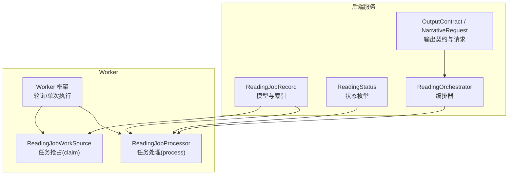
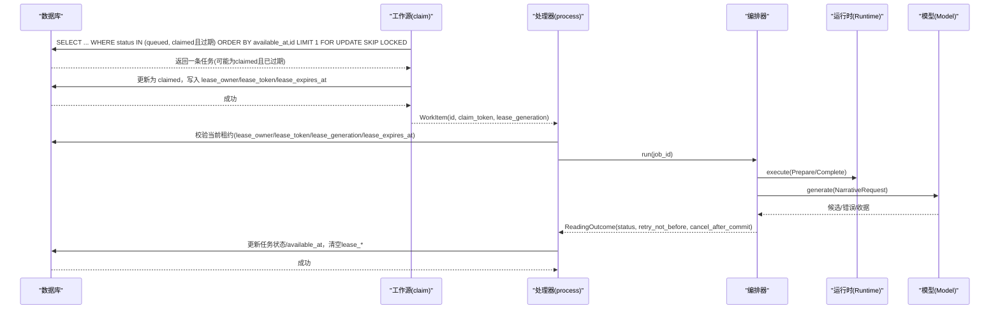
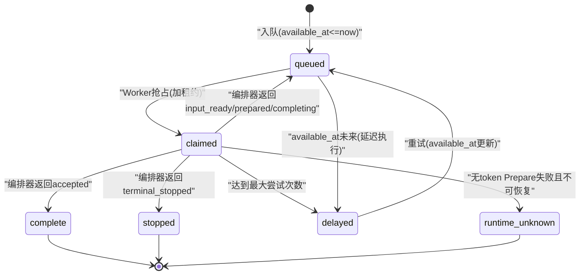
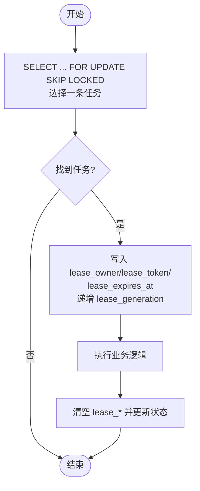
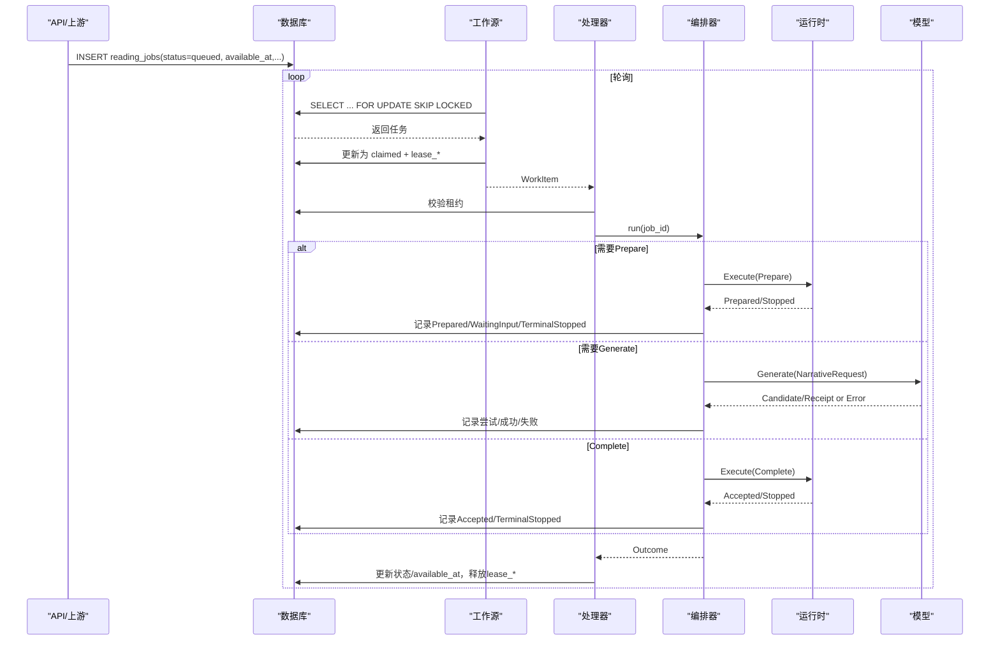
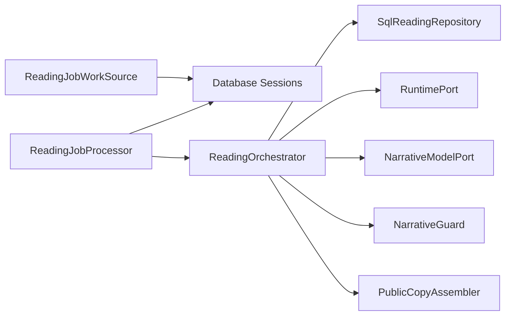

# 解读任务实体

<cite>
**本文引用的文件**
- [models.py](file://backend/app/readings/models.py)
- [status.py](file://backend/app/readings/status.py)
- [orchestrator.py](file://backend/app/readings/orchestrator.py)
- [output_contracts.py](file://backend/app/readings/output_contracts.py)
- [narrative_contracts.py](file://backend/app/readings/narrative_contracts.py)
- [readings.py](file://backend/worker/readings.py)
- [main.py](file://backend/worker/main.py)
</cite>

## 目录
1. [简介](#简介)
2. [项目结构](#项目结构)
3. [核心组件](#核心组件)
4. [架构总览](#架构总览)
5. [详细组件分析](#详细组件分析)
6. [依赖关系分析](#依赖关系分析)
7. [性能与可扩展性](#性能与可扩展性)
8. [故障恢复与可观测性](#故障恢复与可观测性)
9. [结论](#结论)
10. [附录：状态机与字段说明](#附录状态机与字段说明)

## 简介
本文件聚焦于“解读任务”的异步调度与执行机制，围绕数据库表 ReadingJobRecord 的设计目标、任务状态机、分布式锁（lease_*）、输出契约（output_contract）、策略版本（narrative_policy_version）与语言（language）配置、延迟执行（available_at），以及任务队列与故障恢复策略进行系统化说明。目标是帮助读者理解从任务入队、抢占、执行到完成或重试的完整生命周期。

## 项目结构
与任务调度直接相关的代码主要分布在后端服务与后台 Worker 中：
- 数据模型与约束：backend/app/readings/models.py
- 任务状态枚举：backend/app/readings/status.py
- 编排器（Orchestrator）：backend/app/readings/orchestrator.py
- 输出契约与叙事请求：backend/app/readings/output_contracts.py、backend/app/readings/narrative_contracts.py
- Worker 工作源与处理器：backend/worker/readings.py
- Worker 框架与轮询循环：backend/worker/main.py

图表来源
- [models.py:247-291](file://backend/app/readings/models.py#L247-L291)
- [status.py:4-13](file://backend/app/readings/status.py#L4-L13)
- [orchestrator.py:178-249](file://backend/app/readings/orchestrator.py#L178-L249)
- [narrative_contracts.py:91-168](file://backend/app/readings/narrative_contracts.py#L91-L168)
- [readings.py:63-231](file://backend/worker/readings.py#L63-L231)
- [main.py:57-120](file://backend/worker/main.py#L57-L120)

章节来源
- [models.py:247-291](file://backend/app/readings/models.py#L247-L291)
- [readings.py:63-231](file://backend/worker/readings.py#L63-L231)
- [main.py:57-120](file://backend/worker/main.py#L57-L120)

## 核心组件
- ReadingJobRecord：持久化任务元数据、状态与分布式锁信息，提供并发安全的查询与更新能力。
- ReadingStatus：定义解读流程内部状态（如 input_ready、prepared、completing、delayed 等）。
- ReadingOrchestrator：协调 Runtime、模型生成、公共副本组装与校验，驱动任务推进。
- OutputContract/NarrativeRequest：描述输出格式、语言、长度限制、维度要求等契约；构造对模型的请求。
- Worker（ReadingJobWorkSource + ReadingJobProcessor）：实现任务的抢占、加锁、执行与释放锁。

章节来源
- [models.py:247-291](file://backend/app/readings/models.py#L247-L291)
- [status.py:4-13](file://backend/app/readings/status.py#L4-L13)
- [orchestrator.py:178-249](file://backend/app/readings/orchestrator.py#L178-L249)
- [narrative_contracts.py:91-168](file://backend/app/readings/narrative_contracts.py#L91-L168)
- [readings.py:108-231](file://backend/worker/readings.py#L108-L231)

## 架构总览
任务由 API 或服务端创建并写入 reading_jobs 表，Worker 周期性轮询可用任务，通过带锁的 SELECT ... FOR UPDATE SKIP LOCKED 抢占一条任务，设置 lease_* 字段作为分布式锁，随后调用编排器执行，最终根据结果写回状态并释放锁。

图表来源
- [readings.py:63-161](file://backend/worker/readings.py#L63-L161)
- [readings.py:175-218](file://backend/worker/readings.py#L175-L218)
- [orchestrator.py:212-435](file://backend/app/readings/orchestrator.py#L212-L435)

## 详细组件分析

### ReadingJobRecord 表设计与设计目的
- 设计目的：以单表承载解读任务的排队、抢占、执行与重试，支持多 Worker 并发安全地共享同一队列，并通过条件索引与检查约束保证一致性。
- 关键字段
  - status：任务状态，受检查约束与索引保护，用于筛选可抢占任务。
  - available_at：延迟执行时间，按该字段排序优先处理到期任务。
  - lease_*：分布式锁三件套（owner/token/expires_at）+ 版本号（lease_generation），防止重复执行与脏读。
  - narrative_policy_version/language/max_output_chars/max_attempts：控制模型生成策略与上限。
  - output_contract：JSONB 存储的输出契约，约束输出块数量、语言、长度、维度要求等。
- 关键索引与约束
  - 唯一索引 uq_reading_jobs_active_version：在 queued/claimed/running 状态下对 reading_version_id 唯一，避免同一解读版本出现多个活跃任务。
  - 索引 ix_reading_jobs_claim：基于 status 与 available_at，加速抢占查询。
  - 检查约束 lease_envelope_all_or_none：确保 lease_* 字段要么全空，要么全有，避免部分写入导致的状态不一致。

章节来源
- [models.py:247-291](file://backend/app/readings/models.py#L247-L291)

### 任务状态机与流转
- 内部状态（ReadingStatus）：input_ready、waiting_input、terminal_stopped、prepared、completing、accepted、delayed、runtime_unknown。
- 外部可见状态（reading_jobs.status）：queued、claimed、complete、stopped、delayed、runtime_unknown 等。
- 典型流转
  - 入队：status=queued，available_at<=now 时可被抢占。
  - 抢占：status=claimed，写入 lease_*，lease_expires_at 超时后其他 Worker 可重新抢占。
  - 执行：编排器推进到 prepared/completing/accepted 等阶段，对应映射为 queued/complete/delayed/runtime_unknown 等。
  - 失败/重试：若编排器返回 retry_not_before，则下次 available_at 之后再次入队；达到最大尝试次数进入 delayed。
  - 终止：terminal_stopped 或 accepted 表示终态。

图表来源
- [status.py:4-13](file://backend/app/readings/status.py#L4-L13)
- [readings.py:220-231](file://backend/worker/readings.py#L220-L231)
- [orchestrator.py:212-435](file://backend/app/readings/orchestrator.py#L212-L435)

章节来源
- [status.py:4-13](file://backend/app/readings/status.py#L4-L13)
- [readings.py:220-231](file://backend/worker/readings.py#L220-L231)
- [orchestrator.py:212-435](file://backend/app/readings/orchestrator.py#L212-L435)

### 分布式锁机制（lease_*）
- 抢占阶段：使用 SELECT ... FOR UPDATE SKIP LOCKED 选择一条待处理任务，并在事务内将 status 置为 claimed，同时写入 lease_owner、lease_token、lease_expires_at，并递增 lease_generation。
- 持有阶段：处理器在执行前会再次用当前 worker_id、claim_token、lease_generation、lease_expires_at 精确匹配行，确保只有持有租约的 Worker 能继续。
- 释放阶段：无论成功或失败，都会清空 lease_* 字段，使任务回到可抢占状态或终态。
- 防重入与过期：若 Worker 崩溃，lease_expires_at 过期后，其他 Worker 可在下一次抢占时拾取该任务；若任务指向的 ReadingVersion 处于特定状态且无 state_token，则标记为 runtime_unknown，避免不安全重试。

图表来源
- [readings.py:63-161](file://backend/worker/readings.py#L63-L161)
- [readings.py:175-218](file://backend/worker/readings.py#L175-L218)

章节来源
- [readings.py:63-161](file://backend/worker/readings.py#L63-L161)
- [readings.py:175-218](file://backend/worker/readings.py#L175-L218)

### 输出契约（output_contract）
- 作用：约束模型输出的结构与语义，包括最小/最大块数、最大字符数、必需维度、限制类型、披露文案等。
- 解析与校验：OutputContract 通过 JSON Schema 校验，NarrativeRequest 会强制 language 与 max_output_chars 不超过契约限制。
- 使用位置：编排器在构造 NarrativeRequest 时传入 output_contract，并在生成候选后进行守卫校验与公共副本组装。

章节来源
- [narrative_contracts.py:91-168](file://backend/app/readings/narrative_contracts.py#L91-L168)
- [output_contracts.py:1-35](file://backend/app/readings/output_contracts.py#L1-L35)
- [orchestrator.py:287-394](file://backend/app/readings/orchestrator.py#L287-L394)

### 策略配置（narrative_policy_version 与 language）
- narrative_policy_version：标识使用的叙事策略版本，随 NarrativeRequest 下发给模型，确保生成内容符合当前策略。
- language：必须与 output_contract.language 一致，否则拒绝请求；用于控制输出语言。
- 校验：NarrativeRequest.__post_init__ 中对 language 非空、max_output_chars 正数、与契约一致性等进行严格校验。

章节来源
- [narrative_contracts.py:140-168](file://backend/app/readings/narrative_contracts.py#L140-L168)
- [orchestrator.py:287-300](file://backend/app/readings/orchestrator.py#L287-L300)

### 延迟执行调度（available_at）
- 作用：允许任务在未来某个时间点再执行，常用于退避重试或等待外部输入。
- 抢占规则：仅当 status=queued 且 available_at <= now 时，或 status=claimed 且 lease_expires_at < now（租约过期）时，才会被选中。
- 编排器影响：若返回 retry_not_before，则下次 available_at 设置为该时间；否则保持原 available_at 或设为完成时间。

章节来源
- [readings.py:63-82](file://backend/worker/readings.py#L63-L82)
- [readings.py:187-218](file://backend/worker/readings.py#L187-L218)
- [orchestrator.py:250-285](file://backend/app/readings/orchestrator.py#L250-L285)

### 任务队列工作原理与故障恢复
- 队列模型：基于数据库表的轻量队列，利用条件索引与行级锁实现高并发下的公平抢占。
- 故障恢复
  - Worker 崩溃：租约过期后可被其他 Worker 抢占；若任务指向的 ReadingVersion 处于特定状态且无 state_token，则标记为 runtime_unknown，避免不安全重试。
  - 网络抖动：编排器对 Prepare/Complete 的传输错误采用指数退避式重试（retry_not_before），保证幂等与最终一致性。
  - 最大尝试次数：达到上限后进入 delayed，便于后续人工干预或批量重试。
- 可观测性：编排器在关键路径发出告警事件（如 guard_rejection、delayed、model_cost、runtime_unknown），便于监控与排障。

章节来源
- [readings.py:121-218](file://backend/worker/readings.py#L121-L218)
- [orchestrator.py:196-210](file://backend/app/readings/orchestrator.py#L196-L210)
- [orchestrator.py:250-435](file://backend/app/readings/orchestrator.py#L250-L435)

### 任务生命周期的完整管理流程

图表来源
- [readings.py:63-218](file://backend/worker/readings.py#L63-L218)
- [orchestrator.py:212-435](file://backend/app/readings/orchestrator.py#L212-L435)

## 依赖关系分析
- Worker 依赖 Database 会话与 Settings，构建 ReadingJobWorkSource 与 ReadingJobProcessor。
- Processor 依赖 OrchestratorFactory，后者注入 Repository、Runtime、Model、Guard、Assembler、Clock、AlertSink。
- Orchestrator 依赖 ReadingRepository 抽象，实际由 SqlReadingRepository 实现，负责读写 reading_versions、generation_attempts、accepted_copies 等表。
- OutputContract/NarrativeRequest 通过 JSON Schema 校验，确保契约与请求的一致性。

图表来源
- [readings.py:234-286](file://backend/worker/readings.py#L234-L286)
- [orchestrator.py:178-249](file://backend/app/readings/orchestrator.py#L178-L249)

章节来源
- [readings.py:234-286](file://backend/worker/readings.py#L234-L286)
- [orchestrator.py:178-249](file://backend/app/readings/orchestrator.py#L178-L249)

## 性能与可扩展性
- 并发抢占：使用 SKIP LOCKED 减少锁竞争，配合条件索引 ix_reading_jobs_claim 提升查询效率。
- 批处理：Worker 支持 run_forever 持续轮询，可通过 poll_interval 调节吞吐与延迟。
- 扩展性：多 Worker 实例可水平扩展，只要共享同一数据库即可；lease_* 保证每个任务在同一时刻仅被一个 Worker 处理。
- 资源控制：max_output_chars、max_attempts 限制模型调用成本与重试风暴风险。

[本节为通用指导，不直接分析具体文件]

## 故障恢复与可观测性
- 租约过期：Worker 崩溃后，lease_expires_at 过期，其他 Worker 可抢占并继续处理。
- 无 token Prepare 失败：标记为 runtime_unknown，避免在不安全状态下重试。
- 传输错误：Prepare/Complete 的网络错误通过 retry_not_before 退避重试，保证幂等。
- 告警：guard_rejection、delayed、model_cost、runtime_unknown 等事件用于监控与排障。

章节来源
- [readings.py:121-218](file://backend/worker/readings.py#L121-L218)
- [orchestrator.py:196-210](file://backend/app/readings/orchestrator.py#L196-L210)
- [orchestrator.py:250-435](file://backend/app/readings/orchestrator.py#L250-L435)

## 结论
ReadingJobRecord 通过简洁而严谨的状态机、分布式租约与条件索引，实现了高可靠、可水平扩展的任务队列。结合编排器的幂等与退避策略，系统在 Worker 崩溃、网络抖动、模型失败等场景下仍能保持稳定与一致性。输出契约与策略版本确保了生成内容的可控性与可追溯性。

[本节为总结，不直接分析具体文件]

## 附录：状态机与字段说明

### 状态机要点
- queued：可被抢占，需满足 available_at<=now。
- claimed：已被 Worker 抢占，持有租约直至过期或被释放。
- complete/stopped/delayed/runtime_unknown：终态或特殊状态，不再参与抢占。

章节来源
- [status.py:4-13](file://backend/app/readings/status.py#L4-L13)
- [readings.py:220-231](file://backend/worker/readings.py#L220-L231)

### 关键字段说明
- status：任务可见状态，受索引与约束保护。
- available_at：延迟执行时间，决定何时可被抢占。
- lease_owner/lease_token/lease_expires_at：分布式锁三件套，防止重复执行。
- lease_generation：租约版本号，增强防重入安全性。
- narrative_policy_version/language/max_output_chars/max_attempts：策略与限制。
- output_contract：输出契约，约束结构与语义。

章节来源
- [models.py:247-291](file://backend/app/readings/models.py#L247-L291)
- [narrative_contracts.py:91-168](file://backend/app/readings/narrative_contracts.py#L91-L168)