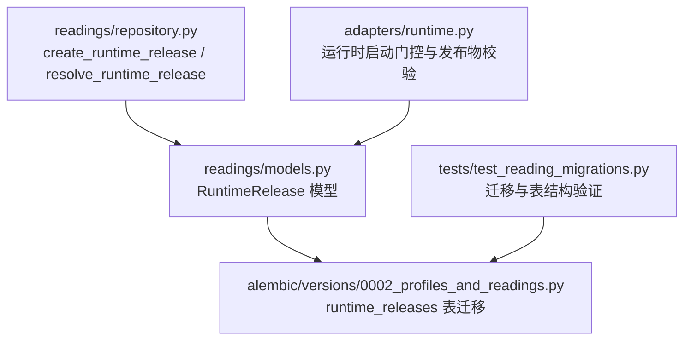
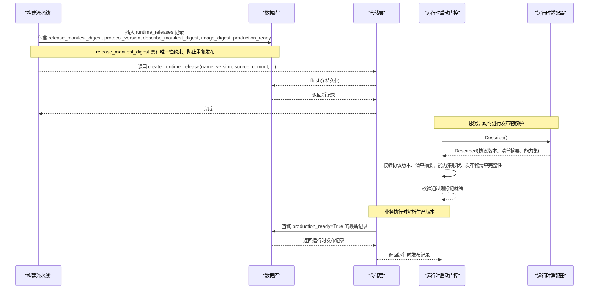
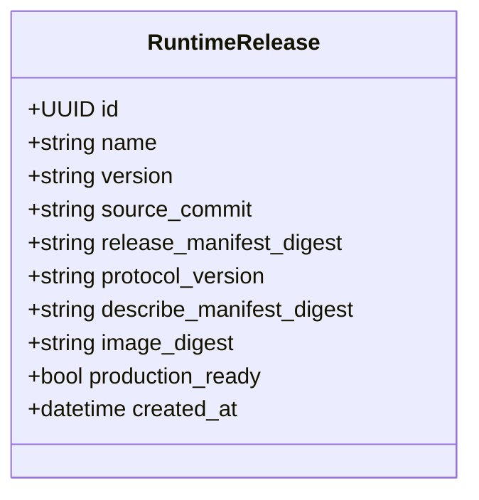
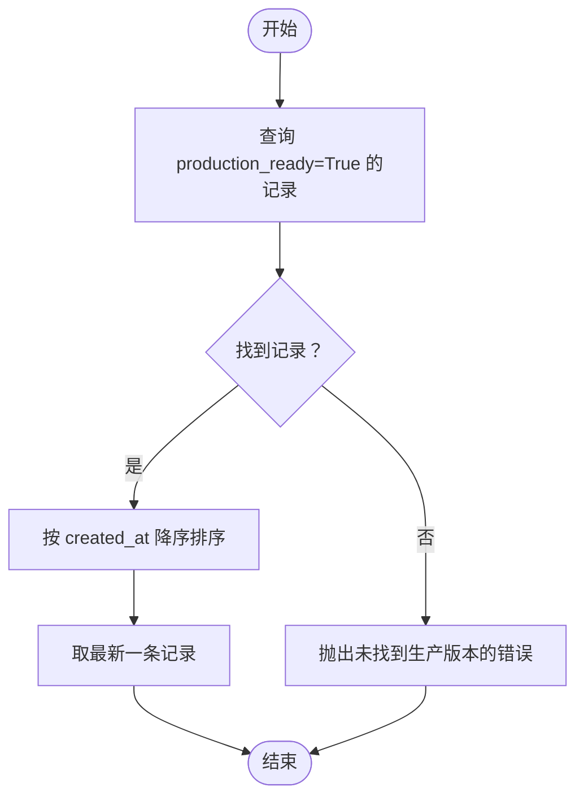
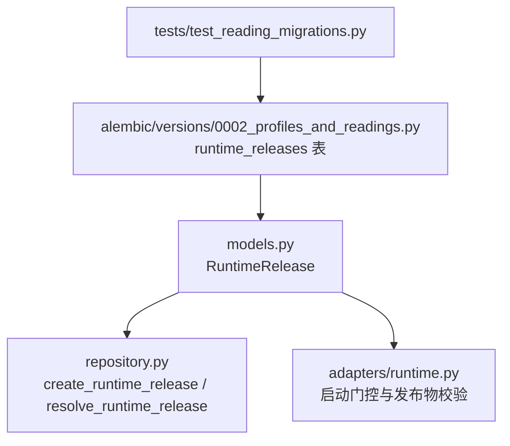

# 运行时发布实体

<cite>
**本文引用的文件**
- [backend/app/readings/models.py](file://backend/app/readings/models.py)
- [backend/app/readings/repository.py](file://backend/app/readings/repository.py)
- [backend/alembic/versions/0002_profiles_and_readings.py](file://backend/alembic/versions/0002_profiles_and_readings.py)
- [backend/tests/test_reading_migrations.py](file://backend/tests/test_reading_migrations.py)
- [backend/app/adapters/runtime.py](file://backend/app/adapters/runtime.py)
</cite>

## 目录
1. [简介](#简介)
2. [项目结构](#项目结构)
3. [核心组件](#核心组件)
4. [架构总览](#架构总览)
5. [详细组件分析](#详细组件分析)
6. [依赖关系分析](#依赖关系分析)
7. [性能考虑](#性能考虑)
8. [故障排查指南](#故障排查指南)
9. [结论](#结论)
10. [附录](#附录)

## 简介
本文件围绕“运行时发布实体”展开，聚焦于 RuntimeRelease 表在命理计算系统中的设计目的与使用方式。该表用于管理命理计算运行时的版本元数据，确保每次发布的可追溯性、一致性与生产可用性。文档将解释以下关键点：
- release_manifest_digest 的唯一性约束与版本追踪机制
- source_commit、protocol_version、describe_manifest_digest 的版本管理作用
- production_ready 标志位的生产环境标识功能
- image_digest 字段与容器镜像的关联关系
- created_at 时间戳的自动设置
- 运行时版本管理的完整流程与最佳实践

## 项目结构
与运行时发布实体相关的代码主要分布在后端模块中：
- 数据模型定义位于 readings/models.py
- 数据库迁移脚本位于 alembic/versions/0002_profiles_and_readings.py
- 仓储层创建与查询逻辑位于 readings/repository.py
- 运行时启动门控与发布物校验逻辑位于 adapters/runtime.py
- 迁移与表结构验证测试位于 tests/test_reading_migrations.py

**图表来源**
- [backend/app/readings/models.py:28-50](file://backend/app/readings/models.py#L28-L50)
- [backend/alembic/versions/0002_profiles_and_readings.py:73-95](file://backend/alembic/versions/0002_profiles_and_readings.py#L73-L95)
- [backend/app/readings/repository.py:56-81](file://backend/app/readings/repository.py#L56-L81)
- [backend/app/adapters/runtime.py:486-544](file://backend/app/adapters/runtime.py#L486-L544)
- [backend/tests/test_reading_migrations.py:265-296](file://backend/tests/test_reading_migrations.py#L265-L296)

**章节来源**
- [backend/app/readings/models.py:28-50](file://backend/app/readings/models.py#L28-L50)
- [backend/alembic/versions/0002_profiles_and_readings.py:73-95](file://backend/alembic/versions/0002_profiles_and_readings.py#L73-L95)
- [backend/app/readings/repository.py:56-81](file://backend/app/readings/repository.py#L56-L81)
- [backend/app/adapters/runtime.py:486-544](file://backend/app/adapters/runtime.py#L486-L544)
- [backend/tests/test_reading_migrations.py:265-296](file://backend/tests/test_reading_migrations.py#L265-L296)

## 核心组件
- RuntimeRelease 模型：定义 runtime_releases 表的列、约束与默认值，包含唯一约束与不可变记录保护。
- 仓储方法 create_runtime_release：负责插入新的运行时发布记录。
- 仓储方法 resolve_runtime_release：按生产就绪状态与创建时间选择当前生产使用的运行时版本。
- 迁移脚本：创建 runtime_releases 表并声明唯一约束与默认值。
- 运行时启动门控：校验运行时发布物的完整性与一致性，确保协议版本、能力集、清单摘要等符合预期。

**章节来源**
- [backend/app/readings/models.py:28-50](file://backend/app/readings/models.py#L28-L50)
- [backend/app/readings/repository.py:56-81](file://backend/app/readings/repository.py#L56-L81)
- [backend/app/readings/repository.py:226-237](file://backend/app/readings/repository.py#L226-L237)
- [backend/alembic/versions/0002_profiles_and_readings.py:73-95](file://backend/alembic/versions/0002_profiles_and_readings.py#L73-L95)
- [backend/app/adapters/runtime.py:486-544](file://backend/app/adapters/runtime.py#L486-L544)

## 架构总览
运行时发布实体在整个系统中承担“版本基线”的角色：
- 发布阶段：构建产物生成清单与证据，计算 release_manifest_digest、describe_manifest_digest、image_digest 等指纹；写入 runtime_releases 表。
- 上线阶段：将某条记录的 production_ready 置为 True，作为当前生产版本。
- 运行阶段：服务启动时通过运行时启动门控校验发布物完整性；业务执行时通过仓储解析出当前生产版本（production_ready=True）并绑定到读取任务。

**图表来源**
- [backend/app/readings/repository.py:56-81](file://backend/app/readings/repository.py#L56-L81)
- [backend/app/readings/repository.py:226-237](file://backend/app/readings/repository.py#L226-L237)
- [backend/app/adapters/runtime.py:486-544](file://backend/app/adapters/runtime.py#L486-L544)

## 详细组件分析

### RuntimeRelease 数据模型与约束
- 表名：runtime_releases
- 主键：id（UUID）
- 关键字段：
  - name：发布名称
  - version：语义版本号
  - source_commit：源码提交哈希，用于溯源构建来源
  - release_manifest_digest：发布清单摘要，唯一约束，保证同一发布清单仅能注册一次
  - protocol_version：运行时协议版本，用于与服务端期望协议对齐
  - describe_manifest_digest：Describe 命令返回的清单摘要，用于运行时描述一致性校验
  - image_digest：容器镜像摘要，关联实际部署的镜像
  - production_ready：布尔标志，表示是否为当前生产可用版本
  - created_at：自动设置的时间戳，用于排序与审计
- 唯一约束：release_manifest_digest 唯一，避免重复注册相同发布清单
- 不可变记录：模型被加入不可变事件监听，禁止更新，确保发布记录只追加不修改

**图表来源**
- [backend/app/readings/models.py:28-50](file://backend/app/readings/models.py#L28-L50)

**章节来源**
- [backend/app/readings/models.py:28-50](file://backend/app/readings/models.py#L28-L50)
- [backend/alembic/versions/0002_profiles_and_readings.py:73-95](file://backend/alembic/versions/0002_profiles_and_readings.py#L73-L95)

### 唯一性约束与版本追踪机制
- release_manifest_digest 是唯一键，任何重复的发布清单将被数据库拒绝，从而强制发布物的不可变性
- 通过 source_commit 锁定源码提交，便于回溯构建来源
- 通过 protocol_version 与 describe_manifest_digest 在服务启动时校验运行时描述的一致性
- 通过 image_digest 关联容器镜像，确保部署产物与清单一致
- created_at 提供时间维度排序，resolve_runtime_release 按 created_at 倒序选择最新的生产版本

**章节来源**
- [backend/app/readings/models.py:28-50](file://backend/app/readings/models.py#L28-L50)
- [backend/app/readings/repository.py:226-237](file://backend/app/readings/repository.py#L226-L237)

### 字段职责与版本管理作用
- source_commit：固定构建来源，支持问题定位与回滚
- protocol_version：确保服务端与运行时协议兼容
- describe_manifest_digest：运行时 Describe 返回的清单摘要，用于启动门控校验
- image_digest：容器镜像摘要，与 CI/CD 产出的镜像绑定
- production_ready：生产环境标识，只有该标志为 True 的记录会被解析为当前生产版本
- created_at：自动设置，用于排序与审计

**章节来源**
- [backend/app/readings/models.py:28-50](file://backend/app/readings/models.py#L28-L50)
- [backend/app/adapters/runtime.py:486-544](file://backend/app/adapters/runtime.py#L486-L544)

### 生产环境标识与解析流程
- 生产版本选择：仓储层 resolve_runtime_release 查询 production_ready=True 的记录，并按 created_at 降序取最新一条
- 若不存在生产版本，抛出查找错误，阻止无版本可用的运行
- 建议在生产环境中仅允许一条记录处于 production_ready=True，避免歧义

**图表来源**
- [backend/app/readings/repository.py:226-237](file://backend/app/readings/repository.py#L226-L237)

**章节来源**
- [backend/app/readings/repository.py:226-237](file://backend/app/readings/repository.py#L226-L237)

### 容器镜像关联与发布物校验
- image_digest 字段用于绑定容器镜像摘要，确保部署镜像与发布清单一致
- 运行时启动门控会校验发布物清单、能力集、协议版本与期望值是否匹配
- 发布物校验包括清单文件数量、引用包数量、证据记录数量等，确保发布物完整性

**章节来源**
- [backend/app/readings/models.py:28-50](file://backend/app/readings/models.py#L28-L50)
- [backend/app/adapters/runtime.py:486-544](file://backend/app/adapters/runtime.py#L486-L544)

### 自动时间戳与不可变记录
- created_at 使用服务器默认值自动设置，无需应用层维护
- 模型被加入不可变事件监听，任何更新尝试都会抛出不可变记录错误，确保发布记录只追加不修改

**章节来源**
- [backend/app/readings/models.py:28-50](file://backend/app/readings/models.py#L28-L50)

## 依赖关系分析
- 模型与迁移：models.py 中的 RuntimeRelease 与 alembic 迁移脚本共同定义 runtime_releases 表结构与约束
- 仓储与模型：repository.py 通过 ORM 操作 RuntimeRelease，实现创建与解析
- 运行时与模型：adapters/runtime.py 在启动门控中校验运行时发布物，确保与模型字段一致
- 测试与迁移：tests/test_reading_migrations.py 验证迁移后表结构存在且包含 runtime_releases

**图表来源**
- [backend/app/readings/models.py:28-50](file://backend/app/readings/models.py#L28-L50)
- [backend/app/readings/repository.py:56-81](file://backend/app/readings/repository.py#L56-L81)
- [backend/app/adapters/runtime.py:486-544](file://backend/app/adapters/runtime.py#L486-L544)
- [backend/alembic/versions/0002_profiles_and_readings.py:73-95](file://backend/alembic/versions/0002_profiles_and_readings.py#L73-L95)
- [backend/tests/test_reading_migrations.py:265-296](file://backend/tests/test_reading_migrations.py#L265-L296)

**章节来源**
- [backend/app/readings/models.py:28-50](file://backend/app/readings/models.py#L28-L50)
- [backend/app/readings/repository.py:56-81](file://backend/app/readings/repository.py#L56-L81)
- [backend/app/adapters/runtime.py:486-544](file://backend/app/adapters/runtime.py#L486-L544)
- [backend/alembic/versions/0002_profiles_and_readings.py:73-95](file://backend/alembic/versions/0002_profiles_and_readings.py#L73-L95)
- [backend/tests/test_reading_migrations.py:265-296](file://backend/tests/test_reading_migrations.py#L265-L296)

## 性能考虑
- 唯一约束与索引：release_manifest_digest 的唯一约束有助于快速检测重复发布；建议在查询频繁字段上建立合适索引（如 production_ready、created_at）
- 解析查询：resolve_runtime_release 使用条件过滤与排序，应确保数据库索引覆盖 production_ready 与 created_at
- 发布物校验：启动门控对发布物进行大量文件校验，应在预检阶段完成，避免影响请求路径

[本节为通用指导，不直接分析具体文件]

## 故障排查指南
- 唯一约束冲突：插入重复 release_manifest_digest 将触发数据库唯一约束错误，检查构建流水线的清单生成逻辑
- 无生产版本：resolve_runtime_release 找不到 production_ready=True 的记录时会抛出查找错误，需确认是否有记录被设置为生产就绪
- 协议或清单不一致：启动门控校验失败会抛出运行时启动错误，检查 protocol_version、describe_manifest_digest 与期望值是否一致
- 发布物不完整：启动门控校验清单文件数量、引用包数量、证据记录数量，缺失将导致启动失败

**章节来源**
- [backend/app/readings/repository.py:226-237](file://backend/app/readings/repository.py#L226-L237)
- [backend/app/adapters/runtime.py:486-544](file://backend/app/adapters/runtime.py#L486-L544)

## 结论
RuntimeRelease 表通过严格的唯一约束与多字段版本管理，确保了命理计算运行时的可追溯性、一致性与生产可用性。结合仓储层的解析逻辑与运行时启动门控的发布物校验，系统能够在部署前与启动时双重保障发布物的完整性与正确性。遵循本文的流程与最佳实践，可有效降低版本错配风险，提升系统的稳定性与可运维性。

[本节为总结，不直接分析具体文件]

## 附录
- 完整流程建议：
  - 构建阶段：生成发布清单与证据，计算 release_manifest_digest、describe_manifest_digest、image_digest；写入 runtime_releases 表
  - 上线阶段：将目标记录的 production_ready 置为 True；确保仅一条记录为生产就绪
  - 运行阶段：服务启动时进行发布物校验；业务执行时解析生产版本并绑定到读取任务
  - 监控与审计：基于 created_at 与 source_commit 进行版本审计与问题定位

[本节为补充说明，不直接分析具体文件]