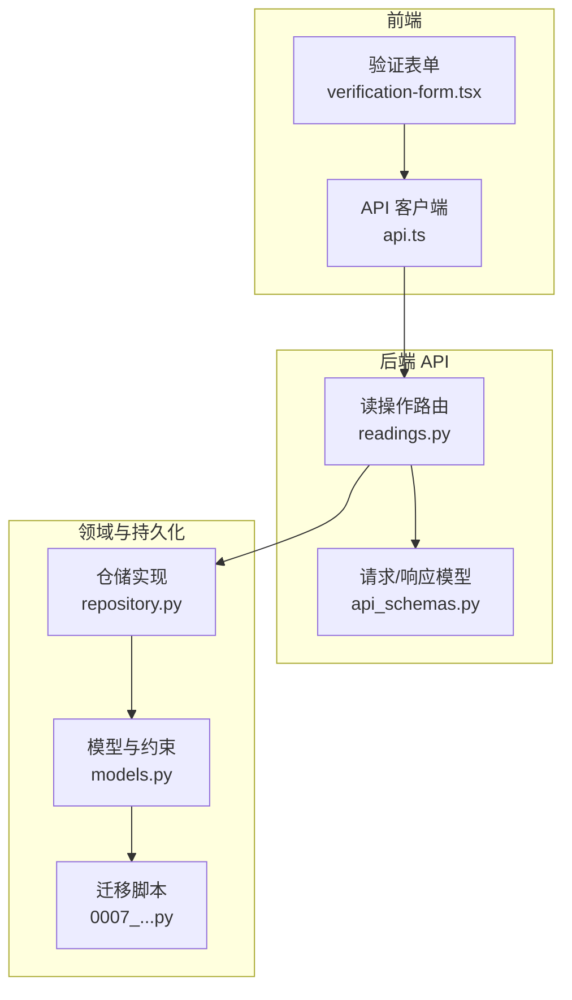
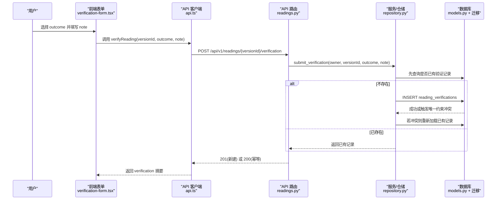
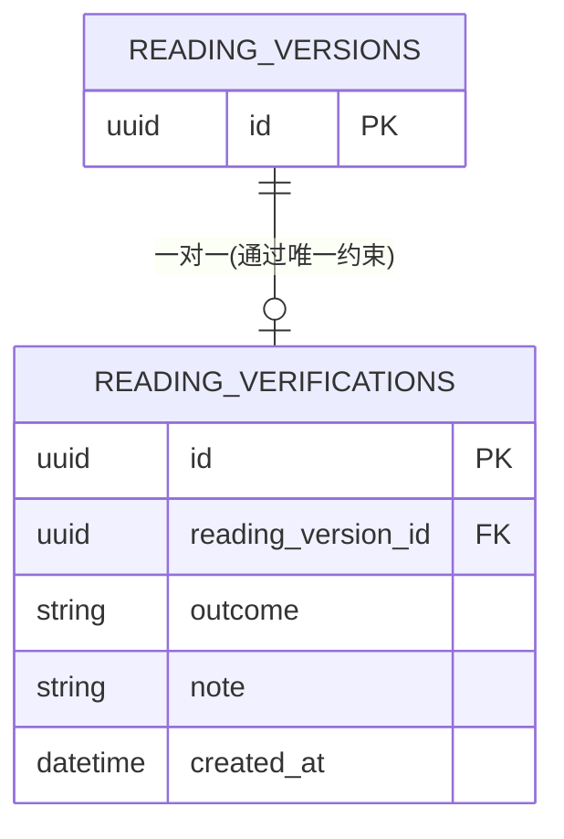
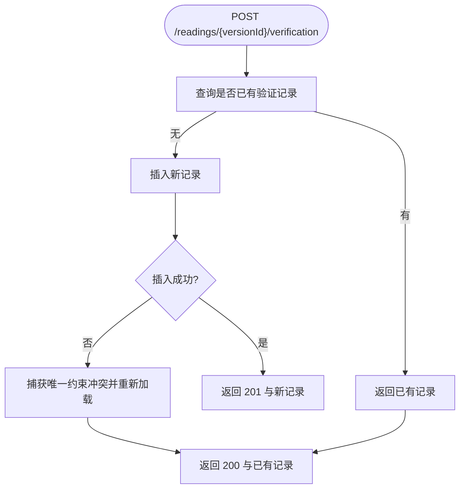
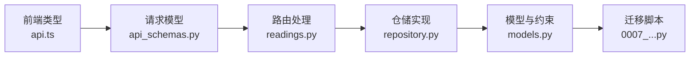

# 验证反馈实体

<cite>
**本文引用的文件**
- [models.py](file://backend/app/readings/models.py)
- [0007_reading_api_idempotency_and_verification.py](file://backend/alembic/versions/0007_reading_api_idempotency_and_verification.py)
- [repository.py](file://backend/app/readings/repository.py)
- [api_schemas.py](file://backend/app/readings/api_schemas.py)
- [readings.py](file://backend/app/api/readings.py)
- [test_readings_api.py](file://backend/tests/test_readings_api.py)
- [test_reading_migrations.py](file://backend/tests/test_reading_migrations.py)
- [verification-form.tsx](file://web/src/components/readings/verification-form.tsx)
- [api.ts](file://web/src/lib/api.ts)
</cite>

## 目录
1. [简介](#简介)
2. [项目结构](#项目结构)
3. [核心组件](#核心组件)
4. [架构总览](#架构总览)
5. [详细组件分析](#详细组件分析)
6. [依赖关系分析](#依赖关系分析)
7. [性能与一致性考虑](#性能与一致性考虑)
8. [故障排查指南](#故障排查指南)
9. [结论](#结论)
10. [附录：数据模型与字段说明](#附录数据模型与字段说明)

## 简介
本文件围绕“验证反馈实体”展开，聚焦于 ReadingVerification 表如何收集用户对解读结果（reading_versions）的反馈。文档说明其设计目的、outcome 枚举值含义、note 自由文本用途、与 reading_versions 的一对一关系约束、created_at 时间戳语义，以及数据验证与业务规则。同时给出用户反馈收集流程、数据分析用法示例，以及在质量评估中的应用场景。

## 项目结构
与验证反馈相关的关键位置如下：
- 数据库模型与约束：后端模型定义与迁移脚本
- 服务与仓储：保存与读取验证反馈的业务逻辑
- API 层：提交与查询验证反馈的接口
- 前端：用户选择 outcome 并提交 note 的表单与调用

图表来源
- [verification-form.tsx:13-18](file://web/src/components/readings/verification-form.tsx#L13-L18)
- [api.ts:149-161](file://web/src/lib/api.ts#L149-L161)
- [readings.py:333-361](file://backend/app/api/readings.py#L333-L361)
- [api_schemas.py:111-129](file://backend/app/readings/api_schemas.py#L111-L129)
- [repository.py:378-404](file://backend/app/readings/repository.py#L378-L404)
- [models.py:340-367](file://backend/app/readings/models.py#L340-L367)
- [0007_reading_api_idempotency_and_verification.py:74-100](file://backend/alembic/versions/0007_reading_api_idempotency_and_verification.py#L74-L100)

章节来源
- [models.py:340-367](file://backend/app/readings/models.py#L340-L367)
- [0007_reading_api_idempotency_and_verification.py:74-100](file://backend/alembic/versions/0007_reading_api_idempotency_and_verification.py#L74-L100)
- [repository.py:378-404](file://backend/app/readings/repository.py#L378-L404)
- [api_schemas.py:111-129](file://backend/app/readings/api_schemas.py#L111-L129)
- [readings.py:333-361](file://backend/app/api/readings.py#L333-L361)
- [verification-form.tsx:13-18](file://web/src/components/readings/verification-form.tsx#L13-L18)
- [api.ts:149-161](file://web/src/lib/api.ts#L149-L161)

## 核心组件
- 数据模型 ReadingVerification：定义 reading_verifications 表的字段、外键、唯一约束与检查约束，确保每个 reading_version 仅有一条验证记录，且 outcome 为受控枚举。
- 仓储 save_verification：先查后插，捕获并发重复插入并回退到已有记录，保证幂等与一致性。
- API 端点 /readings/{id}/verification：接收 VerificationRequest，返回 ReadingVerificationSummary；首次创建返回 201，幂等更新返回 200。
- 前端验证表单：提供四个 outcome 选项与可选 note，调用 verifyReading 提交。

章节来源
- [models.py:340-367](file://backend/app/readings/models.py#L340-L367)
- [repository.py:378-404](file://backend/app/readings/repository.py#L378-L404)
- [readings.py:333-361](file://backend/app/api/readings.py#L333-L361)
- [api_schemas.py:111-129](file://backend/app/readings/api_schemas.py#L111-L129)
- [verification-form.tsx:13-18](file://web/src/components/readings/verification-form.tsx#L13-L18)
- [api.ts:500-513](file://web/src/lib/api.ts#L500-L513)

## 架构总览
下图展示从用户提交反馈到落库的完整链路，包括前端表单、API 路由、仓储保存与数据库约束。

图表来源
- [readings.py:333-361](file://backend/app/api/readings.py#L333-L361)
- [repository.py:378-404](file://backend/app/readings/repository.py#L378-L404)
- [models.py:340-367](file://backend/app/readings/models.py#L340-L367)
- [0007_reading_api_idempotency_and_verification.py:74-100](file://backend/alembic/versions/0007_reading_api_idempotency_and_verification.py#L74-L100)

## 详细组件分析

### 数据模型与约束
- 表名：reading_verifications
- 主键：id(UUID)
- 关联：reading_version_id → reading_versions.id，级联删除
- 一对一约束：对 reading_version_id 的唯一约束，确保每条解读版本仅一条验证记录
- outcome 检查约束：限定为 accepted、partial、disagreed、unknown
- note：长度限制的自由文本，允许为空
- created_at：服务器默认当前时间，不可为空

图表来源
- [models.py:340-367](file://backend/app/readings/models.py#L340-L367)
- [0007_reading_api_idempotency_and_verification.py:74-100](file://backend/alembic/versions/0007_reading_api_idempotency_and_verification.py#L74-L100)

章节来源
- [models.py:340-367](file://backend/app/readings/models.py#L340-L367)
- [0007_reading_api_idempotency_and_verification.py:74-100](file://backend/alembic/versions/0007_reading_api_idempotency_and_verification.py#L74-L100)

### 业务状态枚举 outcome
- accepted：完全符合
- partial：部分符合
- disagreed：不符合
- unknown：暂时不知道

这些值在 API 请求模型、响应模型与数据库检查约束中保持一致，防止非法状态写入。

章节来源
- [api_schemas.py:111-129](file://backend/app/readings/api_schemas.py#L111-L129)
- [models.py:340-367](file://backend/app/readings/models.py#L340-L367)
- [verification-form.tsx:13-18](file://web/src/components/readings/verification-form.tsx#L13-L18)
- [api.ts:149-161](file://web/src/lib/api.ts#L149-L161)

### 自由文本反馈 note
- 用于记录用户对解读结果的补充说明或原因
- 可为空，便于快速反馈
- 前端会过滤空白字符串后再提交

章节来源
- [api_schemas.py:111-129](file://backend/app/readings/api_schemas.py#L111-L129)
- [api.ts:500-513](file://web/src/lib/api.ts#L500-L513)

### 与 reading_versions 的一对一关系
- 通过 reading_version_id 的唯一约束实现一对一
- 同一版本多次提交验证时，仓储层先查后插，遇到并发冲突会回落到已有记录，保持幂等
- 测试覆盖了并发重复插入场景，确保不会新增多余行

章节来源
- [models.py:340-367](file://backend/app/readings/models.py#L340-L367)
- [repository.py:378-404](file://backend/app/readings/repository.py#L378-L404)
- [test_reading_repository.py:416-469](file://backend/tests/test_reading_repository.py#L416-L469)

### 时间戳 created_at
- 由数据库函数默认生成，表示反馈创建时间
- 可用于统计用户反馈时效、趋势分析与质量评估

章节来源
- [models.py:340-367](file://backend/app/readings/models.py#L340-L367)
- [0007_reading_api_idempotency_and_verification.py:74-100](file://backend/alembic/versions/0007_reading_api_idempotency_and_verification.py#L74-L100)

### API 工作流与幂等性
- 首次提交返回 201 Created，后续相同版本的提交返回 200 OK 并返回已有 verification_id
- 不触发新的解读任务，不影响 reading_versions 的状态与已发布结果

图表来源
- [readings.py:333-361](file://backend/app/api/readings.py#L333-L361)
- [repository.py:378-404](file://backend/app/readings/repository.py#L378-L404)

章节来源
- [readings.py:333-361](file://backend/app/api/readings.py#L333-L361)
- [repository.py:378-404](file://backend/app/readings/repository.py#L378-L404)
- [test_readings_api.py:1173-1219](file://backend/tests/test_readings_api.py#L1173-L1219)

### 前端交互
- 提供四个 outcome 选项与可选 note
- 调用 verifyReading 将 outcome 与 note 发送至后端
- 成功后可显示已保存的验证摘要

章节来源
- [verification-form.tsx:13-18](file://web/src/components/readings/verification-form.tsx#L13-L18)
- [api.ts:500-513](file://web/src/lib/api.ts#L500-L513)

## 依赖关系分析
- 前端类型与后端响应模型对齐：VerificationOutcome、ReadingVerificationSummary
- API 路由依赖请求/响应模型进行校验与序列化
- 仓储依赖模型与数据库约束保证数据完整性
- 迁移脚本确保 schema 与约束在生产环境生效

图表来源
- [api.ts:149-161](file://web/src/lib/api.ts#L149-L161)
- [api_schemas.py:111-129](file://backend/app/readings/api_schemas.py#L111-L129)
- [readings.py:333-361](file://backend/app/api/readings.py#L333-L361)
- [repository.py:378-404](file://backend/app/readings/repository.py#L378-L404)
- [models.py:340-367](file://backend/app/readings/models.py#L340-L367)
- [0007_reading_api_idempotency_and_verification.py:74-100](file://backend/alembic/versions/0007_reading_api_idempotency_and_verification.py#L74-L100)

章节来源
- [api.ts:149-161](file://web/src/lib/api.ts#L149-L161)
- [api_schemas.py:111-129](file://backend/app/readings/api_schemas.py#L111-L129)
- [readings.py:333-361](file://backend/app/api/readings.py#L333-L361)
- [repository.py:378-404](file://backend/app/readings/repository.py#L378-L404)
- [models.py:340-367](file://backend/app/readings/models.py#L340-L367)
- [0007_reading_api_idempotency_and_verification.py:74-100](file://backend/alembic/versions/0007_reading_api_idempotency_and_verification.py#L74-L100)

## 性能与一致性考虑
- 幂等性：同一版本多次提交不会重复建表行，避免冗余数据与额外计算
- 并发安全：仓储层捕获唯一约束冲突并回退到已有记录，避免竞态导致错误
- 独立存储：验证反馈独立于解读任务队列，不触发新的 job，不影响版本状态
- 轻量写入：仅插入少量字段，created_at 由数据库默认填充，减少应用侧开销

章节来源
- [repository.py:378-404](file://backend/app/readings/repository.py#L378-L404)
- [test_readings_api.py:1185-1219](file://backend/tests/test_readings_api.py#L1185-L1219)

## 故障排查指南
- 提交非法 outcome：会被请求模型与数据库检查约束拒绝，返回相应错误
- 并发重复提交：应返回 200 与已有 verification_id，若出现 500 需检查仓储重试与异常处理
- 未找到版本：路由或服务层会抛出对应错误，需确认版本是否存在且归属正确
- 前端报错：检查 verifyReading 调用参数与后端返回的 verification 摘要是否一致

章节来源
- [test_readings_api.py:1222-1234](file://backend/tests/test_readings_api.py#L1222-L1234)
- [test_reading_migrations.py:203-227](file://backend/tests/test_reading_migrations.py#L203-L227)
- [readings.py:333-361](file://backend/app/api/readings.py#L333-L361)

## 结论
ReadingVerification 以最小侵入的方式为用户反馈提供了稳定、幂等、可审计的记录能力。通过严格的枚举约束与一对一关系，确保数据质量；通过独立的存储路径，避免影响解读任务与版本状态。结合 created_at 与 outcome，可在质量评估与数据分析中发挥重要作用。

## 附录：数据模型与字段说明
- reading_verifications
  - id：UUID，主键
  - reading_version_id：UUID，外键至 reading_versions，级联删除
  - outcome：受限枚举，accepted/partial/disagreed/unknown
  - note：可选自由文本，最大长度受列定义限制
  - created_at：服务器默认当前时间，不可为空

章节来源
- [models.py:340-367](file://backend/app/readings/models.py#L340-L367)
- [0007_reading_api_idempotency_and_verification.py:74-100](file://backend/alembic/versions/0007_reading_api_idempotency_and_verification.py#L74-L100)