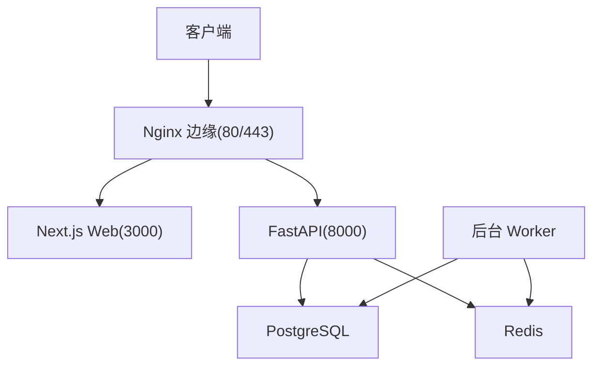
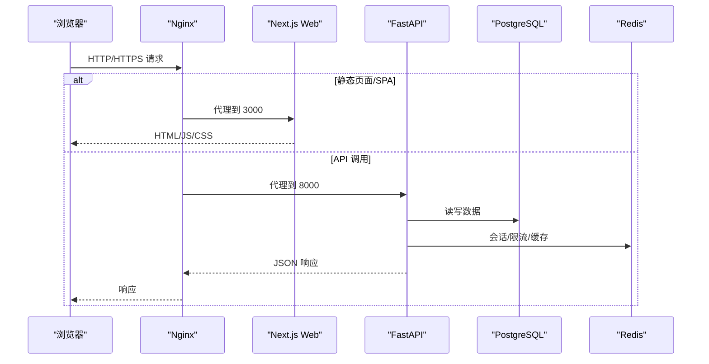
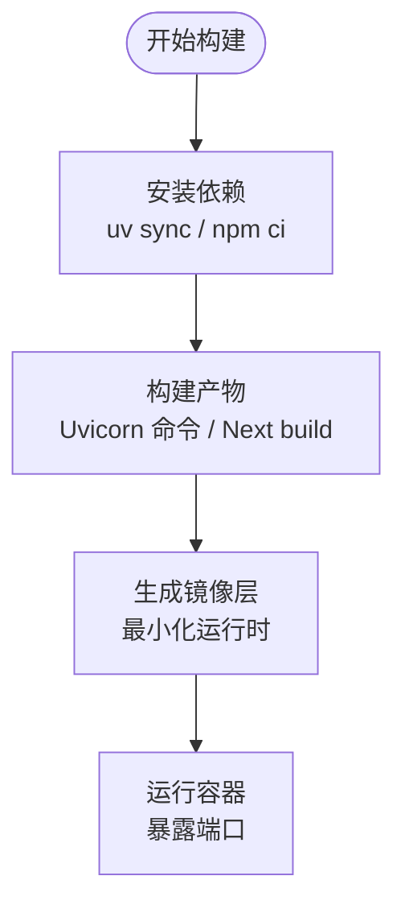
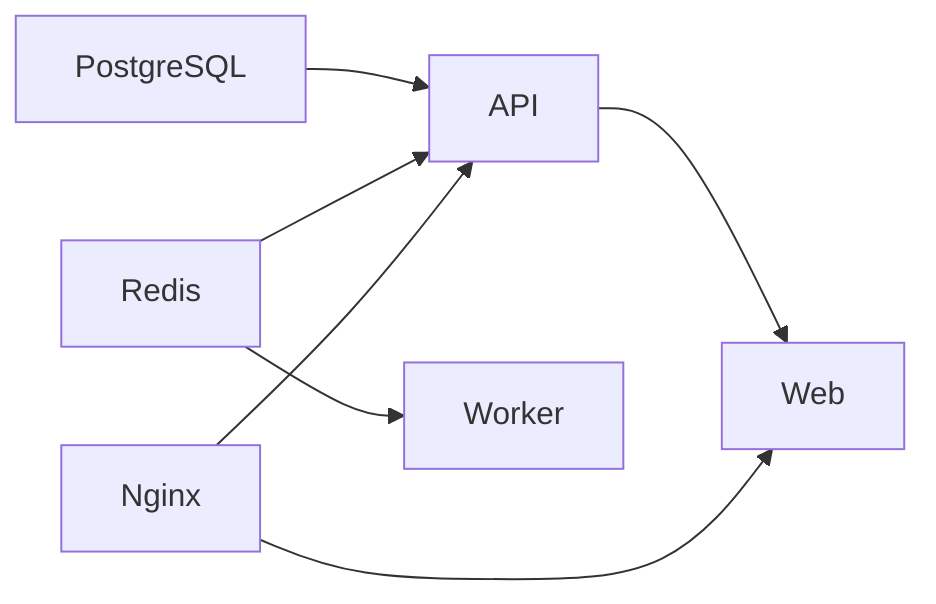
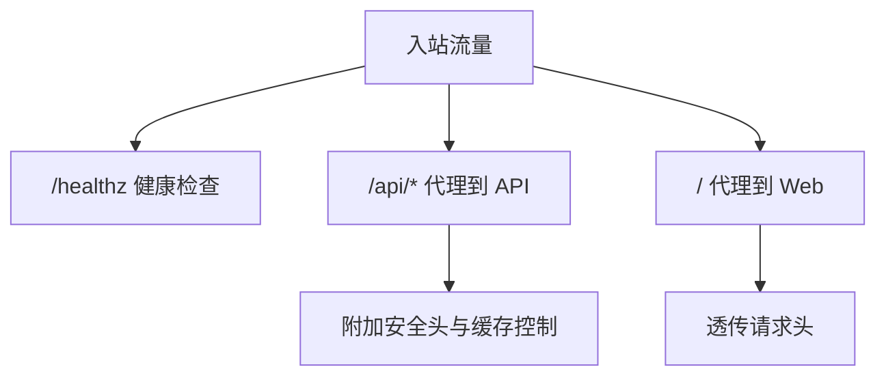
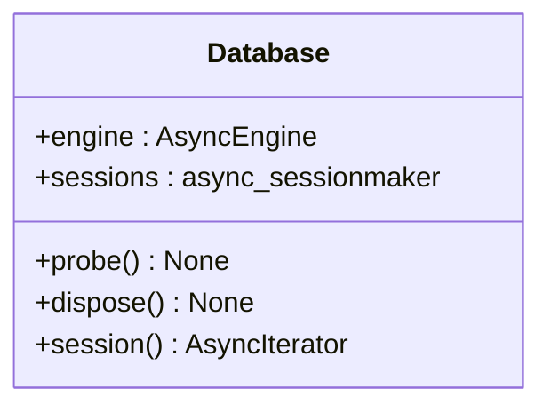
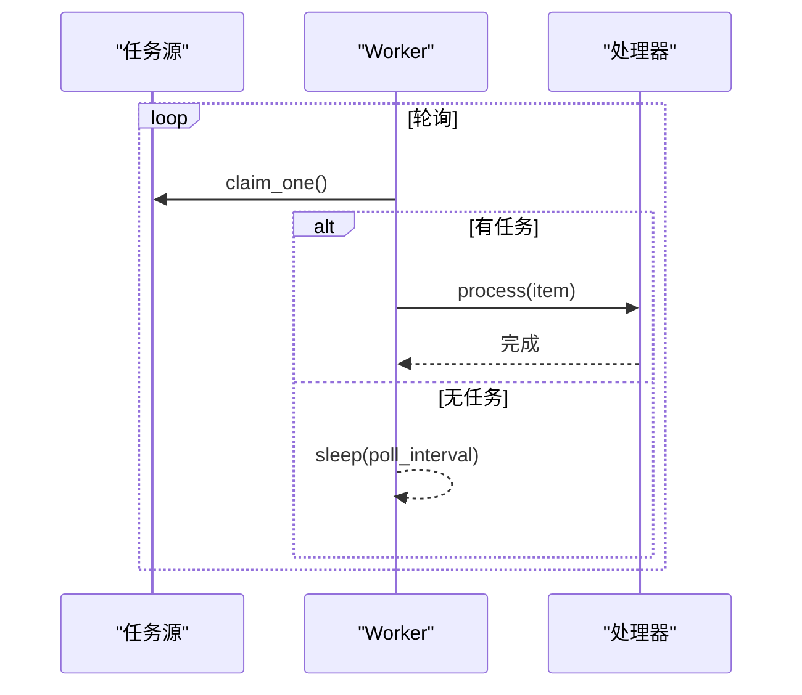
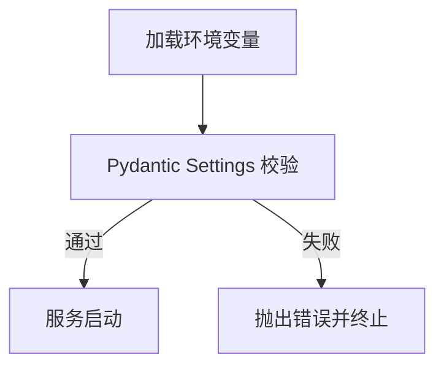
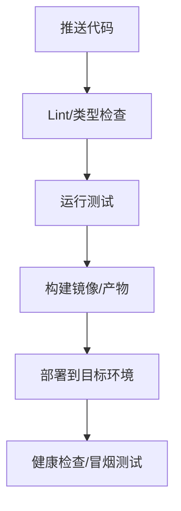
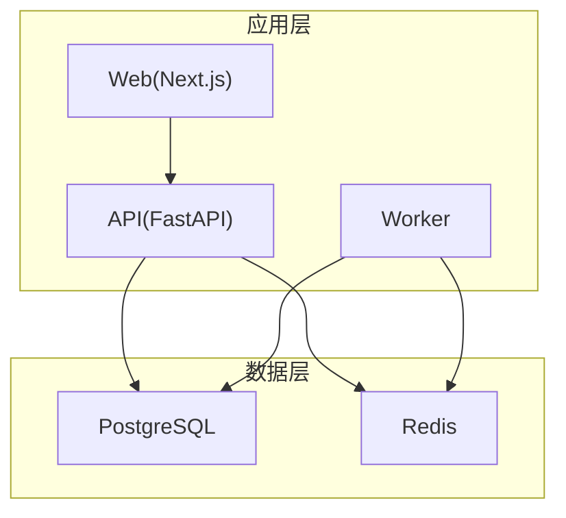

# 基础设施架构

<cite>
**本文引用的文件**
- [backend.Dockerfile](file://infra/docker/backend.Dockerfile)
- [web.Dockerfile](file://infra/docker/web.Dockerfile)
- [compose.local.yml](file://infra/compose.local.yml)
- [app.conf](file://infra/nginx/app.conf)
- [reload-nginx.sh](file://infra/letsencrypt/reload-nginx.sh)
- [config.py](file://backend/app/config.py)
- [database.py](file://backend/app/database.py)
- [main.py（worker）](file://backend/worker/main.py)
- [fateradar-test.env.example](file://infra/fateradar-test.env.example)
- [fateradar-test-api.service](file://infra/systemd/fateradar-test-api.service)
- [fateradar-test-web.service](file://infra/systemd/fateradar-test-web.service)
- [fateradar-test-worker.service](file://infra/systemd/fateradar-test-worker.service)
- [Makefile](file://Makefile)
</cite>

## 目录
1. [简介](#简介)
2. [项目结构](#项目结构)
3. [核心组件](#核心组件)
4. [架构总览](#架构总览)
5. [详细组件分析](#详细组件分析)
6. [依赖关系分析](#依赖关系分析)
7. [性能考量](#性能考量)
8. [故障排查指南](#故障排查指南)
9. [结论](#结论)
10. [附录：配置与脚本示例](#附录配置与脚本示例)

## 简介
本文件面向 Mingli Web 的基础设施架构，聚焦容器化构建、服务编排、反向代理、数据库与缓存部署、CI/CD 流水线、监控日志、安全加固与环境管理。文档以仓库内现有 Dockerfile、Compose、Nginx 配置、systemd 单元、环境变量模板与后端配置为核心依据，给出可落地的部署与运维方案，并配套架构图与流程图。

## 项目结构
- 前端 Next.js 应用通过独立镜像构建为 standalone 产物，运行在 Node 进程上。
- 后端 FastAPI 应用与后台 Worker 使用 Python 镜像，基于 uv 同步依赖并启动 Uvicorn。
- 本地开发使用 Docker Compose 编排 PostgreSQL、Redis、API、Worker、Web 与 Nginx 边缘节点。
- 生产/测试主机采用 systemd 单元管理 API/Web/Worker 进程，Nginx 作为外部入口。
- 配置集中通过环境变量注入，敏感信息通过 Secret 或受保护的环境文件提供。

**图示来源**
- [compose.local.yml:31-89](file://infra/compose.local.yml#L31-L89)
- [app.conf:1-45](file://infra/nginx/app.conf#L1-L45)

**章节来源**
- [compose.local.yml:1-93](file://infra/compose.local.yml#L1-L93)
- [app.conf:1-45](file://infra/nginx/app.conf#L1-L45)

## 核心组件
- 容器镜像
  - 后端镜像：基于 Python slim，使用 uv 冻结依赖，暴露 8000 端口，启动 Uvicorn。
  - 前端镜像：基于 Node Alpine，构建 Next.js standalone 产物，暴露 3000 端口。
- 服务编排
  - Compose 定义 Postgres、Redis、API、Worker、Web、Edge(Nginx)，含健康检查与服务依赖。
- 反向代理
  - Nginx 将 /api/ 转发至 API，/ 转发至 Web，设置安全响应头与请求头透传。
- 数据库与缓存
  - PostgreSQL 持久化数据；Redis 用于会话/限流等（Compose 中启用）。
- 后台任务
  - Worker 轮询任务源，执行读取生成等耗时任务，支持单次与常驻模式。
- 配置与安全
  - 统一通过 MINGLI_ 前缀环境变量注入；生产环境强制安全策略校验。
  - systemd 单元对 API/Worker 启用内存不可执行等加固；Web 因 V8 JIT 放宽限制。

**章节来源**
- [backend.Dockerfile:1-23](file://infra/docker/backend.Dockerfile#L1-L23)
- [web.Dockerfile:1-27](file://infra/docker/web.Dockerfile#L1-L27)
- [compose.local.yml:1-93](file://infra/compose.local.yml#L1-L93)
- [app.conf:1-45](file://infra/nginx/app.conf#L1-L45)
- [config.py:62-149](file://backend/app/config.py#L62-L149)
- [fateradar-test-api.service:19-52](file://infra/systemd/fateradar-test-api.service#L19-L52)
- [fateradar-test-web.service:20-60](file://infra/systemd/fateradar-test-web.service#L20-L60)
- [fateradar-test-worker.service:23-56](file://infra/systemd/fateradar-test-worker.service#L23-L56)

## 架构总览
下图展示从浏览器到后端服务的完整路径，包括 Nginx 的反向代理、前后端服务、数据库与缓存的交互关系。

**图示来源**
- [app.conf:10-43](file://infra/nginx/app.conf#L10-L43)
- [compose.local.yml:31-89](file://infra/compose.local.yml#L31-L89)

## 详细组件分析

### 容器化与镜像构建
- 后端镜像
  - 多阶段构建：先使用 uv 安装依赖，再拷贝源码与 Alembic 迁移文件，最终仅包含运行时所需内容。
  - 暴露 8000 端口，默认命令启动 Uvicorn。
- 前端镜像
  - 依赖安装与构建分离，构建时注入 BACKEND_INTERNAL_URL，产出 standalone 包。
  - 运行阶段仅复制 .next/standalone、静态资源与 public，以非 root 用户运行。

**图示来源**
- [backend.Dockerfile:1-23](file://infra/docker/backend.Dockerfile#L1-L23)
- [web.Dockerfile:1-27](file://infra/docker/web.Dockerfile#L1-L27)

**章节来源**
- [backend.Dockerfile:1-23](file://infra/docker/backend.Dockerfile#L1-L23)
- [web.Dockerfile:1-27](file://infra/docker/web.Dockerfile#L1-L27)

### 服务编排与健康检查
- Compose 定义了 Postgres、Redis、API、Worker、Web、Edge 六类服务。
- 数据库与缓存通过 healthcheck 确保就绪后再启动依赖服务。
- API 与 Worker 共享相同镜像，但命令不同；Web 依赖 API 启动。

**图示来源**
- [compose.local.yml:4-89](file://infra/compose.local.yml#L4-L89)

**章节来源**
- [compose.local.yml:1-93](file://infra/compose.local.yml#L1-L93)

### Nginx 反向代理与安全头
- 路由规则：/healthz 返回健康状态；/api/ 转发至 API；/ 转发至 Web。
- 安全头：X-Content-Type-Options、X-Frame-Options、Referrer-Policy、Permissions-Policy 全局设置。
- 请求头透传：Host、X-Forwarded-*、X-Real-IP、X-Request-ID。
- API 响应额外设置 Cache-Control 私有不缓存。

**图示来源**
- [app.conf:1-45](file://infra/nginx/app.conf#L1-L45)

**章节来源**
- [app.conf:1-45](file://infra/nginx/app.conf#L1-L45)

### 数据库与缓存部署
- PostgreSQL
  - 使用官方镜像，健康检查通过 pg_isready。
  - 数据卷持久化；本地映射到 127.0.0.1:5432。
- Redis
  - 关闭持久化快照与 AOF，适合测试/临时缓存场景。
  - 健康检查通过 redis-cli ping。
- 连接与池化
  - 后端使用 SQLAlchemy AsyncEngine，开启 pool_pre_ping 探测连接有效性。
  - Session 工厂 expire_on_commit=False 避免重复加载。

**图示来源**
- [database.py:12-33](file://backend/app/database.py#L12-L33)

**章节来源**
- [compose.local.yml:4-30](file://infra/compose.local.yml#L4-L30)
- [database.py:1-33](file://backend/app/database.py#L1-L33)

### 后台任务与工作进程
- Worker 主循环：轮询任务源，处理完成后休眠指定间隔；支持 --once 单次执行。
- 任务模型：WorkItem 包含 id、可选 claim_token 与 lease_generation。
- 扩展点：WorkSource/WorkProcessor 协议便于替换具体实现。

**图示来源**
- [main.py（worker）:10-79](file://backend/worker/main.py#L10-L79)

**章节来源**
- [main.py（worker）:1-120](file://backend/worker/main.py#L1-L120)

### 配置管理与安全策略
- 配置来源：统一通过 MINGLI_ 前缀环境变量注入；DeepSeek API Key 单独处理并从其他源过滤。
- 生产安全校验：
  - 强制 Secure Cookie、禁止 Fake OTP/Runtime/Model。
  - 固定 Runtime 路径与状态根目录，要求受信任的 manifest/capability digest。
  - 模型参数白名单与超时上限约束。
  - 真实流量开关需配合告警接收器。
- 系统级加固：
  - API/Worker 启用 MemoryDenyWriteExecute、ProtectSystem=strict 等。
  - Web 因 V8 JIT 需要可写可执行映射，故未启用该选项。

**图示来源**
- [config.py:62-186](file://backend/app/config.py#L62-L186)
- [config.py:188-329](file://backend/app/config.py#L188-L329)
- [fateradar-test-api.service:32-52](file://infra/systemd/fateradar-test-api.service#L32-L52)
- [fateradar-test-worker.service:36-56](file://infra/systemd/fateradar-test-worker.service#L36-L56)
- [fateradar-test-web.service:39-60](file://infra/systemd/fateradar-test-web.service#L39-L60)

**章节来源**
- [config.py:62-329](file://backend/app/config.py#L62-L329)
- [fateradar-test.env.example:1-45](file://infra/fateradar-test.env.example#L1-L45)
- [fateradar-test-api.service:19-52](file://infra/systemd/fateradar-test-api.service#L19-L52)
- [fateradar-test-worker.service:23-56](file://infra/systemd/fateradar-test-worker.service#L23-L56)
- [fateradar-test-web.service:20-60](file://infra/systemd/fateradar-test-web.service#L20-L60)

### CI/CD 流水线设计
- 代码质量与类型检查：后端使用 ruff/mypy，前端使用 ESLint/TypeScript 检查。
- 测试：后端 pytest 覆盖业务与合同测试；前端 Vitest 单元测试。
- 构建：前端构建 Next.js standalone；后端冻结依赖并打包。
- 部署：通过 Makefile 触发迁移与一次性 Worker 迭代；生产环境由 systemd 单元管理进程生命周期。

**图示来源**
- [Makefile:1-47](file://Makefile#L1-L47)

**章节来源**
- [Makefile:1-47](file://Makefile#L1-L47)

### 监控与日志收集
- 健康检查：Nginx 提供 /healthz 快速探针；Compose 中数据库与缓存具备健康检查。
- 日志输出：Python/Node 应用默认输出到标准输出，便于被宿主或编排系统采集。
- 建议采集方案（概念性）：
  - 应用指标：Prometheus 抓取 Uvicorn/Next 暴露的指标端点（如存在）。
  - 结构化日志：JSON 格式输出，集中到 ELK/Loki。
  - 错误追踪：接入 Sentry 或类似平台，上报异常堆栈与上下文。
- 当前仓库未内置监控组件，建议在编排层引入侧车或集中式日志/指标服务。

[本节为通用指导，不直接分析具体文件]

### 安全基础设施
- 网络访问控制：
  - Nginx 设置严格的安全响应头，限制危险能力（摄像头、麦克风、地理定位、支付）。
  - 可信代理 CIDR 通过配置项限定，防止伪造 X-Forwarded-For。
- 密钥管理：
  - 身份哈希键与内容加密键通过环境变量注入，生产环境禁止使用本地占位值。
  - DeepSeek API Key 单独处理，不参与常规配置源。
- 系统加固：
  - systemd 单元启用 NoNewPrivileges、PrivateTmp、ProtectSystem=strict 等。
  - 限制系统调用架构与地址族，降低攻击面。

**章节来源**
- [app.conf:5-31](file://infra/nginx/app.conf#L5-L31)
- [config.py:188-329](file://backend/app/config.py#L188-L329)
- [fateradar-test-api.service:32-52](file://infra/systemd/fateradar-test-api.service#L32-L52)
- [fateradar-test-worker.service:36-56](file://infra/systemd/fateradar-test-worker.service#L36-L56)

### 环境管理与配置策略
- 本地开发：使用 Compose 一键拉起所有依赖，端口绑定到 127.0.0.1。
- 测试/生产主机：使用 systemd 单元管理进程，环境变量文件集中存放于 /etc/fateradar/test.env。
- 构建期注入：前端通过 BACKEND_INTERNAL_URL 在构建时内联后端地址，减少运行时耦合。
- 配置分层：环境变量优先，dotenv 与文件密钥次之，特殊字段（如 DeepSeek API Key）单独处理。

**章节来源**
- [compose.local.yml:31-89](file://infra/compose.local.yml#L31-L89)
- [fateradar-test.env.example:1-45](file://infra/fateradar-test.env.example#L1-L45)
- [web.Dockerfile:7-12](file://infra/docker/web.Dockerfile#L7-L12)
- [config.py:150-186](file://backend/app/config.py#L150-L186)

## 依赖关系分析
- 服务间依赖：
  - Web 依赖 API；API 依赖数据库与缓存；Worker 依赖数据库与缓存。
- 配置依赖：
  - 后端配置强依赖环境变量；生产环境对多项参数进行白名单与上限校验。
- 系统依赖：
  - systemd 单元声明对网络与数据库服务的启动顺序与重启策略。

**图示来源**
- [compose.local.yml:31-89](file://infra/compose.local.yml#L31-L89)

**章节来源**
- [compose.local.yml:31-89](file://infra/compose.local.yml#L31-L89)
- [config.py:62-149](file://backend/app/config.py#L62-L149)

## 性能考量
- 数据库连接池：SQLAlchemy AsyncEngine 开启 pool_pre_ping，避免使用失效连接；Session 工厂禁用提交后过期，减少重复查询开销。
- 缓存策略：Redis 关闭持久化，提升写入吞吐；可根据业务将热点数据缓存至 Redis。
- 反向代理：Nginx 设置合理的超时与连接复用（HTTP/1.1），减少握手开销。
- 构建优化：前端使用多阶段构建与 standalone 输出，减小运行时体积；后端使用 uv 冻结依赖，加速冷启动。
- 工作进程：Worker 支持可调 poll-interval，平衡 CPU 与延迟。

**章节来源**
- [database.py:12-33](file://backend/app/database.py#L12-L33)
- [compose.local.yml:20-30](file://infra/compose.local.yml#L20-L30)
- [app.conf:16-43](file://infra/nginx/app.conf#L16-L43)
- [web.Dockerfile:1-27](file://infra/docker/web.Dockerfile#L1-L27)
- [backend.Dockerfile:1-23](file://infra/docker/backend.Dockerfile#L1-L23)
- [main.py（worker）:74-85](file://backend/worker/main.py#L74-L85)

## 故障排查指南
- 健康检查失败
  - Nginx /healthz 应返回 ok；若失败，检查 Nginx 配置与上游可达性。
  - 数据库/缓存健康检查失败：确认端口、认证与权限。
- 服务无法启动
  - 环境变量缺失或非法：检查 MINGLI_* 配置，尤其是生产安全项（Secure Cookie、OTP 适配器、Runtime 路径等）。
  - systemd 单元启动失败：查看日志与权限设置，确认只读路径与可写路径正确。
- 代理问题
  - /api/ 与 / 路由是否正确转发；检查 X-Forwarded-* 头是否被正确透传。
- 任务堆积
  - Worker 轮询间隔过长或任务源为空；调整 --poll-interval 或检查任务队列。

**章节来源**
- [app.conf:10-14](file://infra/nginx/app.conf#L10-L14)
- [compose.local.yml:10-29](file://infra/compose.local.yml#L10-L29)
- [config.py:188-329](file://backend/app/config.py#L188-L329)
- [fateradar-test-api.service:19-52](file://infra/systemd/fateradar-test-api.service#L19-L52)
- [fateradar-test-web.service:20-60](file://infra/systemd/fateradar-test-web.service#L20-L60)
- [fateradar-test-worker.service:23-56](file://infra/systemd/fateradar-test-worker.service#L23-L56)
- [main.py（worker）:74-85](file://backend/worker/main.py#L74-L85)

## 结论
Mingli Web 的基础设施以容器化与 Compose 为核心，结合 Nginx 反向代理与 systemd 单元管理，形成清晰的边界与可维护的部署形态。配置通过环境变量集中注入，并在生产环境实施严格的安全校验。数据库与缓存提供稳定的数据与缓存能力，Worker 承担异步任务处理。建议在后续阶段引入集中式监控与日志平台，完善告警与可观测性。

## 附录：配置与脚本示例
- 环境变量模板
  - 参考测试环境模板，按需替换占位符，确保数据库密码、加密键等敏感信息正确配置。
- Nginx 重载脚本
  - 使用脚本验证配置并平滑重载 Nginx，避免中断服务。
- systemd 单元
  - API/Web/Worker 单元分别定义启动命令、依赖关系与加固选项，确保进程自恢复与最小权限。
- Makefile 常用命令
  - 安装依赖、运行测试、类型检查、构建、迁移与一次性 Worker 迭代。

**章节来源**
- [fateradar-test.env.example:1-45](file://infra/fateradar-test.env.example#L1-L45)
- [reload-nginx.sh:1-6](file://infra/letsencrypt/reload-nginx.sh#L1-L6)
- [fateradar-test-api.service:1-56](file://infra/systemd/fateradar-test-api.service#L1-L56)
- [fateradar-test-web.service:1-64](file://infra/systemd/fateradar-test-web.service#L1-L64)
- [fateradar-test-worker.service:1-60](file://infra/systemd/fateradar-test-worker.service#L1-L60)
- [Makefile:1-47](file://Makefile#L1-L47)