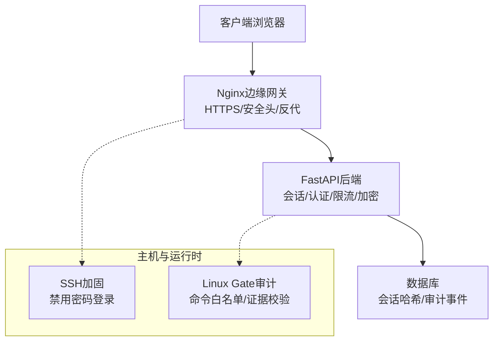
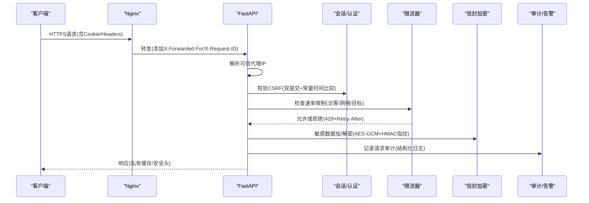
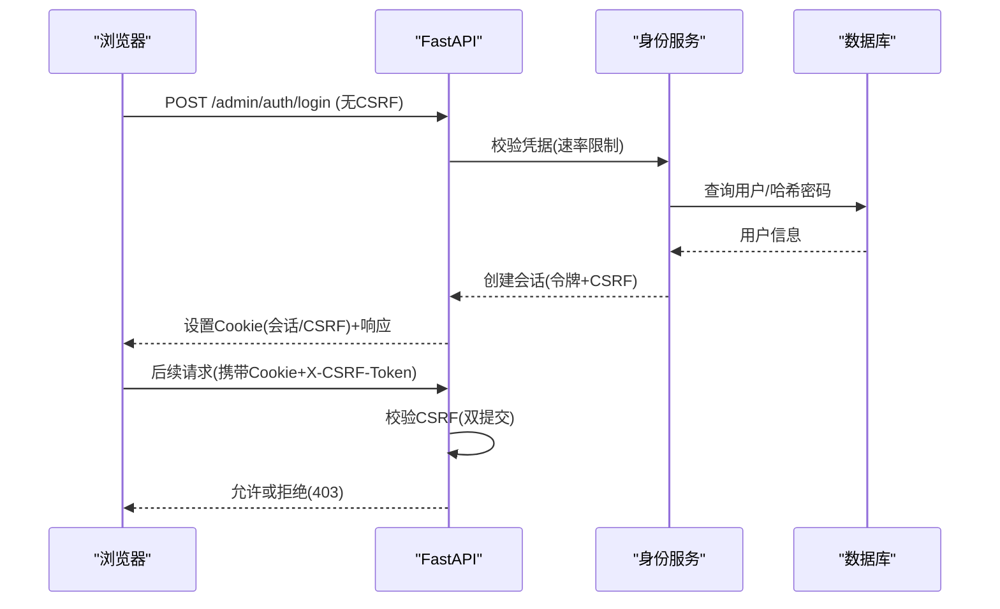
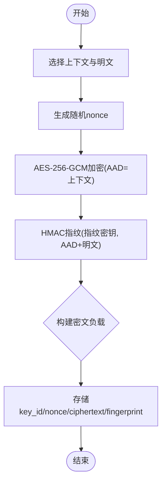
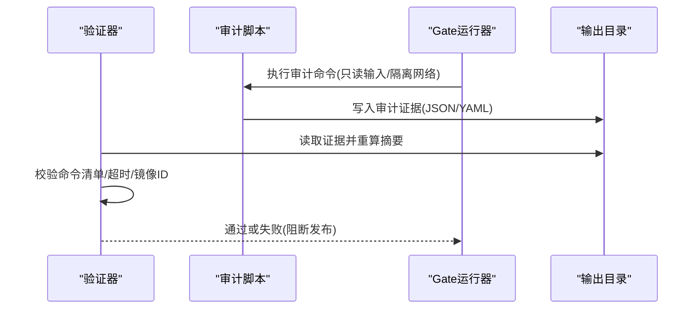
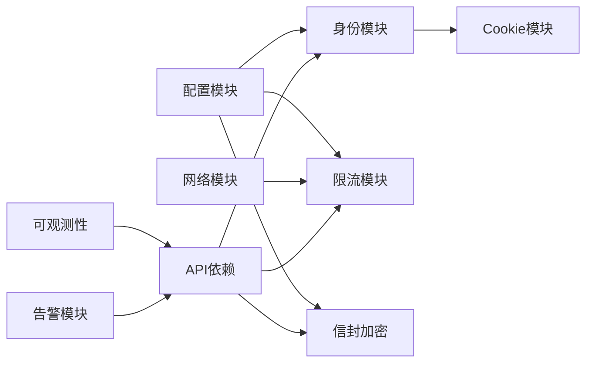

# 安全基础设施

<cite>
**本文引用的文件**
- [backend/app/config.py](file://backend/app/config.py)
- [backend/app/network.py](file://backend/app/network.py)
- [backend/app/security/envelope.py](file://backend/app/security/envelope.py)
- [backend/app/identity/security.py](file://backend/app/identity/security.py)
- [backend/app/identity/cookies.py](file://backend/app/identity/cookies.py)
- [backend/app/api/dependencies.py](file://backend/app/api/dependencies.py)
- [backend/app/api/rate_guard.py](file://backend/app/api/rate_guard.py)
- [backend/app/readings/rate_limit.py](file://backend/app/readings/rate_limit.py)
- [backend/app/identity/otp.py](file://backend/app/identity/otp.py)
- [backend/app/admin/service.py](file://backend/app/admin/service.py)
- [backend/app/admin/passwords.py](file://backend/app/admin/passwords.py)
- [infra/nginx/app.conf](file://infra/nginx/app.conf)
- [infra/nginx/fateradar-tls.conf](file://infra/nginx/fateradar-tls.conf)
- [infra/nginx/fateradar.conf](file://infra/nginx/fateradar.conf)
- [infra/ssh/99-fateradar-hardening.conf](file://infra/ssh/99-fateradar-hardening.conf)
- [infra/mingli-runtime/audit_runtime.py](file://infra/mingli-runtime/audit_runtime.py)
- [infra/mingli-runtime/run_lima_gate.py](file://infra/mingli-runtime/run_lima_gate.py)
- [infra/mingli-runtime/verify_release.py](file://infra/mingli-runtime/verify_release.py)
- [contracts/schemas/auth-session.schema.json](file://contracts/schemas/auth-session.schema.json)
- [backend/app/observability.py](file://backend/app/observability.py)
- [backend/app/readings/alerts.py](file://backend/app/readings/alerts.py)
</cite>

## 目录
1. [简介](#简介)
2. [项目结构](#项目结构)
3. [核心组件](#核心组件)
4. [架构总览](#架构总览)
5. [详细组件分析](#详细组件分析)
6. [依赖关系分析](#依赖关系分析)
7. [性能考虑](#性能考虑)
8. [故障排查指南](#故障排查指南)
9. [结论](#结论)
10. [附录](#附录)

## 简介
本文件面向Mingli Web项目的安全基础设施，覆盖网络安全配置、身份认证与令牌管理、数据加密方案、安全审计与合规检查，以及最佳实践与常见漏洞防护。内容基于仓库中后端服务、Nginx边缘网关、SSH加固、运行时审计与发布验证等实现进行系统化梳理，并提供架构图与威胁模型分析，帮助读者快速理解并落地安全策略。

## 项目结构
本项目采用前后端分离与模块化后端设计：
- 前端（Next.js）通过反向代理暴露给Nginx，仅承载静态资源与页面路由。
- 后端（FastAPI）提供REST API，负责会话、认证、限流、数据访问与业务编排。
- Nginx作为统一入口，强制HTTPS、设置安全响应头、转发请求到后端。
- SSH加固限制远程登录方式，降低主机入侵面。
- 运行时审计脚本在构建与发布阶段生成可验证证据，确保生产环境只运行受控镜像与命令集。

图表来源
- [infra/nginx/app.conf:1-45](file://infra/nginx/app.conf#L1-L45)
- [infra/nginx/fateradar-tls.conf:56-125](file://infra/nginx/fateradar-tls.conf#L56-L125)
- [infra/ssh/99-fateradar-hardening.conf:1-4](file://infra/ssh/99-fateradar-hardening.conf#L1-L4)
- [infra/mingli-runtime/audit_runtime.py:58-82](file://infra/mingli-runtime/audit_runtime.py#L58-L82)

章节来源
- [infra/nginx/app.conf:1-45](file://infra/nginx/app.conf#L1-L45)
- [infra/nginx/fateradar-tls.conf:56-125](file://infra/nginx/fateradar-tls.conf#L56-L125)
- [infra/ssh/99-fateradar-hardening.conf:1-4](file://infra/ssh/99-fateradar-hardening.conf#L1-L4)
- [infra/mingli-runtime/audit_runtime.py:58-82](file://infra/mingli-runtime/audit_runtime.py#L58-L82)

## 核心组件
- 网络安全与传输加密
  - Nginx强制HTTPS、启用HSTS、设置X-Content-Type-Options、X-Frame-Options、Referrer-Policy、Permissions-Policy等安全响应头；对API路径附加私有缓存控制。
  - 可信代理IP解析：根据配置的信任网段解析真实客户端IP，避免伪造X-Forwarded-For。
- 身份认证与会话安全
  - 访客与会话Cookie：HttpOnly、Secure、SameSite=Lax，区分访客与会话Cookie生命周期。
  - CSRF双提交保护：Cookie中的CSRF与请求头中的X-CSRF-Token必须一致，服务端使用常量时间比较。
  - 令牌与哈希：不透明令牌生成与SHA-256哈希存储，数据库中仅保存哈希值。
  - 管理员登录：速率限制、最小化错误信息、会话Cookie与CSRF绑定。
- 数据加密
  - 信封加密：AES-256-GCM + HMAC指纹，带上下文AAD，支持文本与JSON加解密，密钥ID用于多版本密钥轮换。
  - 配置级安全：生产环境强制注入内容加密密钥与身份哈希密钥，禁止本地默认值复用。
- 限流与防滥用
  - 通用滑动窗口限流器：按所有者键限制写操作，返回Retry-After。
  - OTP发送三层限流：访客、网络、目标地址维度，失败时原子回滚已消耗容量。
  - 管理员登录限流：按邮箱桶限制尝试次数。
- 安全审计与合规
  - Linux Gate审计：固定命令清单、超时预算、镜像ID校验、产物摘要重算。
  - 告警输出：结构化日志告警，生产环境需开启告警接收器。
  - 发布验证：校验报告字段、命令清单、提供者白名单与审计入口一致性。

章节来源
- [infra/nginx/app.conf:1-45](file://infra/nginx/app.conf#L1-L45)
- [infra/nginx/fateradar-tls.conf:56-125](file://infra/nginx/fateradar-tls.conf#L56-L125)
- [backend/app/network.py:16-54](file://backend/app/network.py#L16-L54)
- [backend/app/identity/cookies.py:12-101](file://backend/app/identity/cookies.py#L12-L101)
- [backend/app/api/dependencies.py:29-136](file://backend/app/api/dependencies.py#L29-L136)
- [backend/app/identity/security.py:5-10](file://backend/app/identity/security.py#L5-L10)
- [backend/app/admin/service.py:33-47](file://backend/app/admin/service.py#L33-L47)
- [backend/app/security/envelope.py:32-122](file://backend/app/security/envelope.py#L32-L122)
- [backend/app/config.py:188-329](file://backend/app/config.py#L188-L329)
- [backend/app/readings/rate_limit.py:9-38](file://backend/app/readings/rate_limit.py#L9-L38)
- [backend/app/api/rate_guard.py:5-19](file://backend/app/api/rate_guard.py#L5-L19)
- [backend/app/identity/otp.py:64-155](file://backend/app/identity/otp.py#L64-L155)
- [infra/mingli-runtime/audit_runtime.py:58-82](file://infra/mingli-runtime/audit_runtime.py#L58-L82)
- [infra/mingli-runtime/verify_release.py:3191-3408](file://infra/mingli-runtime/verify_release.py#L3191-L3408)
- [backend/app/readings/alerts.py:16-75](file://backend/app/readings/alerts.py#L16-L75)

## 架构总览
下图展示从客户端到后端的完整安全链路，包括Nginx的安全头与HTTPS、可信代理IP解析、CSRF校验、会话Cookie、OTP限流、信封加密与审计证据。

图表来源
- [infra/nginx/app.conf:16-32](file://infra/nginx/app.conf#L16-L32)
- [backend/app/network.py:22-54](file://backend/app/network.py#L22-L54)
- [backend/app/api/dependencies.py:29-136](file://backend/app/api/dependencies.py#L29-L136)
- [backend/app/identity/otp.py:86-122](file://backend/app/identity/otp.py#L86-L122)
- [backend/app/security/envelope.py:56-96](file://backend/app/security/envelope.py#L56-L96)
- [backend/app/observability.py:27-51](file://backend/app/observability.py#L27-L51)

## 详细组件分析

### 网络安全与传输加密
- HTTPS与HSTS：TLS监听端口、证书路径、DH参数与HSTS头部，强制将HTTP重定向至HTTPS。
- 安全响应头：全局设置X-Content-Type-Options、X-Frame-Options、Referrer-Policy、Permissions-Policy；API路径额外设置私有缓存控制。
- 可信代理IP解析：仅当上游为信任网段时才读取X-Forwarded-For链，否则回退到直连地址；对非法或过长链直接拒绝。
- 建议的防火墙规则与ACL（部署层面）：
  - 仅开放80/443入站，限制源IP至CDN或负载均衡器网段。
  - 出站仅允许必要的域名与端口（如SMTP、模型API），其余默认拒绝。
  - 内部服务间通信使用mTLS或内网隔离，避免跨进程明文传输。
- DDoS防护（部署层面）：
  - 在边缘层启用连接数与请求频率限制，结合WAF规则拦截异常流量。
  - 后端限流器配合Redis实现分布式限流，防止单点被压垮。

章节来源
- [infra/nginx/fateradar-tls.conf:56-125](file://infra/nginx/fateradar-tls.conf#L56-L125)
- [infra/nginx/app.conf:1-45](file://infra/nginx/app.conf#L1-L45)
- [backend/app/network.py:16-54](file://backend/app/network.py#L16-L54)

### 身份认证基础设施
- Cookie与会话安全：
  - 访客与会话Cookie均设置HttpOnly、Secure、SameSite=Lax；设备会话有效期由配置决定。
  - 登出时清除会话与CSRF Cookie。
- CSRF双提交：
  - Cookie中的CSRF与请求头X-CSRF-Token必须一致；服务端使用hmac.compare_digest进行常量时间比较，避免时序攻击。
  - 设备与会话均需CSRF保护，未通过则返回403。
- 令牌与哈希：
  - 不透明令牌使用安全随机生成；数据库仅存储SHA-256哈希，避免泄露原始令牌。
- 管理员登录：
  - 登录接口按邮箱桶进行速率限制；成功登录后设置会话Cookie与CSRF；登出需要CSRF保护。
  - 生产环境禁止使用引导凭据。

图表来源
- [backend/app/identity/cookies.py:35-101](file://backend/app/identity/cookies.py#L35-L101)
- [backend/app/api/dependencies.py:29-136](file://backend/app/api/dependencies.py#L29-L136)
- [backend/app/identity/security.py:5-10](file://backend/app/identity/security.py#L5-L10)
- [backend/app/admin/service.py:33-47](file://backend/app/admin/service.py#L33-L47)

章节来源
- [backend/app/identity/cookies.py:35-101](file://backend/app/identity/cookies.py#L35-L101)
- [backend/app/api/dependencies.py:29-136](file://backend/app/api/dependencies.py#L29-L136)
- [backend/app/identity/security.py:5-10](file://backend/app/identity/security.py#L5-L10)
- [backend/app/admin/service.py:33-47](file://backend/app/admin/service.py#L33-L47)
- [contracts/schemas/auth-session.schema.json:1-14](file://contracts/schemas/auth-session.schema.json#L1-L14)

### 数据加密方案
- 传输加密：
  - 全站HTTPS，启用HSTS；API路径设置私有缓存控制，避免中间节点缓存敏感数据。
- 存储加密（信封加密）：
  - AES-256-GCM对称加密，nonce随机，AAD使用上下文隔离不同用途。
  - 使用独立指纹密钥对密文与明文计算HMAC指纹，校验完整性与抗篡改。
  - 支持多密钥ID，便于密钥轮换；解密时校验key_id匹配。
- 密钥管理：
  - 内容加密密钥与身份哈希密钥在生产环境必须注入，禁止使用本地默认值。
  - 配置校验确保密钥长度、格式与来源符合安全要求。

图表来源
- [backend/app/security/envelope.py:56-96](file://backend/app/security/envelope.py#L56-L96)
- [backend/app/config.py:217-236](file://backend/app/config.py#L217-L236)

章节来源
- [infra/nginx/fateradar-tls.conf:56-125](file://infra/nginx/fateradar-tls.conf#L56-L125)
- [infra/nginx/app.conf:16-32](file://infra/nginx/app.conf#L16-L32)
- [backend/app/security/envelope.py:32-122](file://backend/app/security/envelope.py#L32-L122)
- [backend/app/config.py:217-236](file://backend/app/config.py#L217-L236)

### 安全审计机制
- 操作日志与访问审计：
  - 请求级审计：每个HTTP请求记录request_id、方法、路径、状态码、耗时；隐藏敏感传输日志器。
  - 告警事件：结构化告警事件包含类型、时间、作业ID、阅读版本ID与详情；生产环境需开启告警接收器。
- 合规检查与发布验证：
  - Linux Gate审计：固定命令清单、超时预算、镜像ID校验、产物摘要重算；报告字段严格校验。
  - 发布验证：校验审计入口、完成时间戳、运行标识、命令清单与提供者白名单一致性。
- 运行时隔离：
  - 审计容器以只读挂载输入与研究目录，输出写入隔离目录；网络隔离确保无外联。

图表来源
- [infra/mingli-runtime/run_lima_gate.py:1776-1809](file://infra/mingli-runtime/run_lima_gate.py#L1776-L1809)
- [infra/mingli-runtime/audit_runtime.py:58-82](file://infra/mingli-runtime/audit_runtime.py#L58-L82)
- [infra/mingli-runtime/verify_release.py:3191-3408](file://infra/mingli-runtime/verify_release.py#L3191-L3408)

章节来源
- [backend/app/observability.py:27-51](file://backend/app/observability.py#L27-L51)
- [backend/app/readings/alerts.py:16-75](file://backend/app/readings/alerts.py#L16-L75)
- [infra/mingli-runtime/run_lima_gate.py:1776-1809](file://infra/mingli-runtime/run_lima_gate.py#L1776-L1809)
- [infra/mingli-runtime/audit_runtime.py:58-82](file://infra/mingli-runtime/audit_runtime.py#L58-L82)
- [infra/mingli-runtime/verify_release.py:3191-3408](file://infra/mingli-runtime/verify_release.py#L3191-L3408)

### 威胁模型分析
- 外部威胁
  - 中间人攻击：通过HTTPS与HSTS缓解；Nginx安全头防止点击劫持与嗅探。
  - CSRF攻击：双提交+常量时间比较；Cookie SameSite=Lax减少跨站风险。
  - 暴力破解：管理员登录与OTP发送多层限流；错误信息最小化。
  - DDoS：边缘层限流与WAF；后端限流器返回Retry-After。
- 内部威胁
  - 密钥泄露：生产环境强制注入密钥，禁止本地默认值；密钥与哈希密钥不得复用。
  - 数据篡改：信封加密的HMAC指纹检测篡改；审计证据不可变且可重算。
  - 供应链攻击：Linux Gate固定命令清单与镜像ID校验；发布验证阻断异常变更。
- 缓解措施
  - 最小权限：SSH禁用密码登录；仅开放必要端口。
  - 隔离：审计容器网络隔离、只读挂载；运行时路径固定。
  - 监控：结构化日志与告警；请求追踪ID贯穿全链路。

[本节为概念性分析，不直接引用具体代码文件]

## 依赖关系分析
后端安全组件之间的依赖关系如下：
- 配置模块提供密钥、限流阈值、环境约束；所有安全相关组件依赖配置进行运行时校验。
- 网络模块解析客户端IP，供限流与审计使用。
- 身份模块依赖安全模块生成令牌与哈希；Cookie模块设置会话与CSRF。
- API依赖模块组合会话、CSRF、限流与加密能力。
- 审计与告警模块记录事件并输出结构化日志。

图表来源
- [backend/app/config.py:188-329](file://backend/app/config.py#L188-L329)
- [backend/app/network.py:16-54](file://backend/app/network.py#L16-L54)
- [backend/app/identity/security.py:5-10](file://backend/app/identity/security.py#L5-L10)
- [backend/app/identity/cookies.py:12-101](file://backend/app/identity/cookies.py#L12-L101)
- [backend/app/api/dependencies.py:29-136](file://backend/app/api/dependencies.py#L29-L136)
- [backend/app/readings/rate_limit.py:9-38](file://backend/app/readings/rate_limit.py#L9-L38)
- [backend/app/security/envelope.py:32-122](file://backend/app/security/envelope.py#L32-L122)
- [backend/app/observability.py:27-51](file://backend/app/observability.py#L27-L51)
- [backend/app/readings/alerts.py:16-75](file://backend/app/readings/alerts.py#L16-L75)

章节来源
- [backend/app/config.py:188-329](file://backend/app/config.py#L188-L329)
- [backend/app/network.py:16-54](file://backend/app/network.py#L16-L54)
- [backend/app/identity/security.py:5-10](file://backend/app/identity/security.py#L5-L10)
- [backend/app/identity/cookies.py:12-101](file://backend/app/identity/cookies.py#L12-L101)
- [backend/app/api/dependencies.py:29-136](file://backend/app/api/dependencies.py#L29-L136)
- [backend/app/readings/rate_limit.py:9-38](file://backend/app/readings/rate_limit.py#L9-L38)
- [backend/app/security/envelope.py:32-122](file://backend/app/security/envelope.py#L32-L122)
- [backend/app/observability.py:27-51](file://backend/app/observability.py#L27-L51)
- [backend/app/readings/alerts.py:16-75](file://backend/app/readings/alerts.py#L16-L75)

## 性能考虑
- 限流器使用滑动窗口与去重队列，内存占用随键数量增长；合理设置窗口大小与最大键数。
- OTP三层限流在失败时原子回滚已消耗容量，避免误伤合法请求；生产环境建议使用Redis实现分布式限流。
- 信封加密使用AES-GCM，性能开销较低；注意nonce唯一性与上下文隔离。
- 审计日志与告警应异步写入，避免阻塞主流程；生产环境启用告警接收器。

[本节提供一般性指导，不直接分析具体文件]

## 故障排查指南
- 会话与CSRF问题
  - 检查Cookie是否设置HttpOnly、Secure、SameSite=Lax；确认请求头包含正确的X-CSRF-Token。
  - 若出现403，检查CSRF双提交是否一致；确认服务端常量时间比较逻辑未被绕过。
- 限流与拒绝
  - 若返回429，检查Retry-After头部；调整限流阈值或优化请求频率。
  - OTP发送失败时，检查三层限流是否达到上限；确认失败时容量已回滚。
- 加密与密钥
  - 若解密失败，检查key_id是否匹配、nonce是否重复、上下文是否正确；确认指纹校验通过。
  - 生产环境启动失败时，检查是否注入内容加密密钥与身份哈希密钥；禁止使用本地默认值。
- 审计与发布
  - 若发布验证失败，检查审计命令清单、超时预算、镜像ID与产物摘要；确认审计入口一致。
  - 审计容器网络隔离导致外联失败时，检查必要域名与端口是否放行。

章节来源
- [backend/app/identity/cookies.py:35-101](file://backend/app/identity/cookies.py#L35-L101)
- [backend/app/api/dependencies.py:29-136](file://backend/app/api/dependencies.py#L29-L136)
- [backend/app/api/rate_guard.py:5-19](file://backend/app/api/rate_guard.py#L5-L19)
- [backend/app/readings/rate_limit.py:9-38](file://backend/app/readings/rate_limit.py#L9-L38)
- [backend/app/identity/otp.py:86-155](file://backend/app/identity/otp.py#L86-L155)
- [backend/app/security/envelope.py:75-96](file://backend/app/security/envelope.py#L75-L96)
- [backend/app/config.py:188-329](file://backend/app/config.py#L188-L329)
- [infra/mingli-runtime/verify_release.py:3191-3408](file://infra/mingli-runtime/verify_release.py#L3191-L3408)

## 结论
Mingli Web项目在网络安全、身份认证、数据加密、审计与合规方面具备较为完善的基础设施。通过Nginx安全头与HTTPS、CSRF双提交、信封加密、多层限流与Linux Gate审计，有效降低了常见攻击面与供应链风险。建议在部署层面补充防火墙规则与DDoS防护，并在生产环境中持续验证配置与密钥的正确性，确保系统长期安全运行。

[本节为总结性内容，不直接引用具体代码文件]

## 附录
- 安全配置最佳实践
  - 强制HTTPS与HSTS，禁用不安全协议。
  - 设置全面的安全响应头，避免点击劫持与嗅探。
  - 使用可信代理解析客户端IP，防止伪造。
  - 会话Cookie设置HttpOnly、Secure、SameSite=Lax。
  - CSRF双提交与常量时间比较，避免时序攻击。
  - 令牌仅存储哈希，避免泄露原始值。
  - 信封加密使用AES-GCM与HMAC指纹，上下文隔离。
  - 生产环境注入密钥，禁止本地默认值。
  - 多层限流与重试提示，防止滥用。
  - 审计与告警结构化输出，便于追踪与分析。
  - 发布前执行Linux Gate审计，确保命令与镜像受控。
- 常见漏洞防护措施
  - XSS：设置X-Content-Type-Options与Referrer-Policy。
  - CSRF：双提交与SameSite策略。
  - 暴力破解：速率限制与最小化错误信息。
  - 数据泄露：传输加密与存储加密。
  - 供应链攻击：固定命令清单与镜像ID校验。
  - DDoS：边缘限流与WAF规则。

[本节为概念性内容，不直接引用具体代码文件]