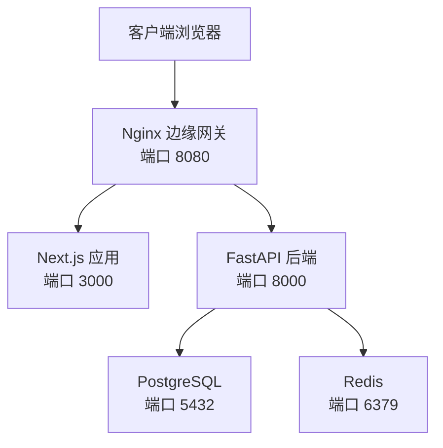
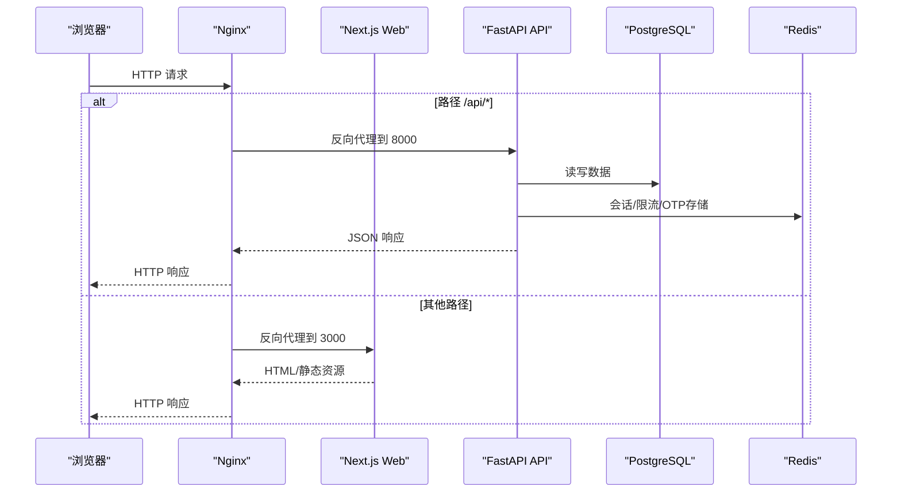
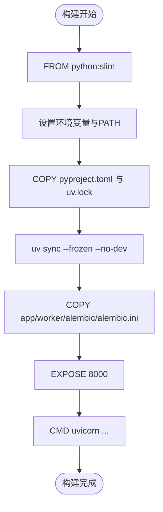
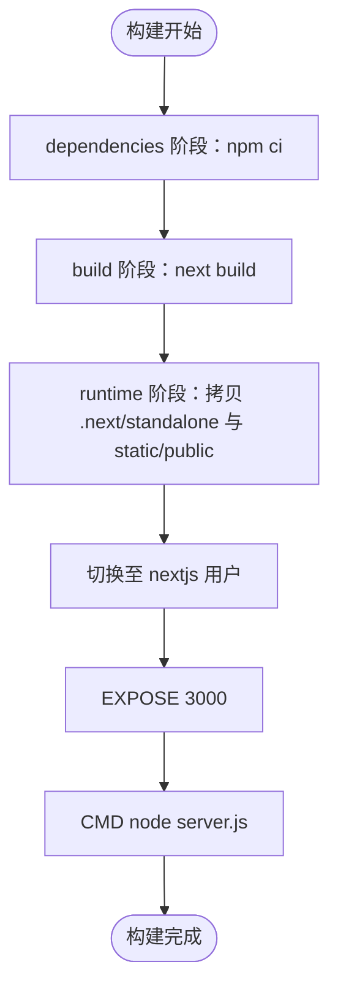
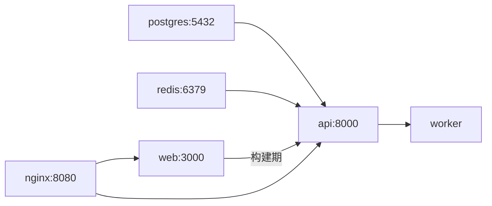
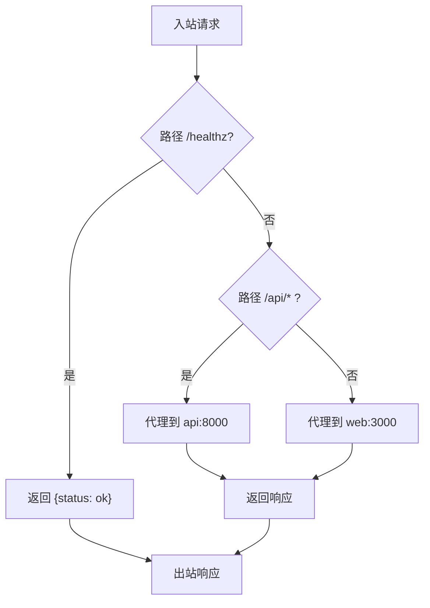
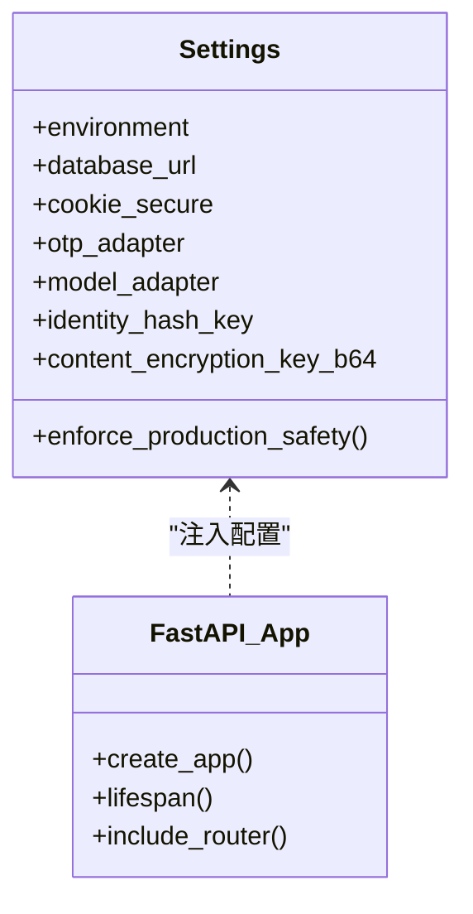
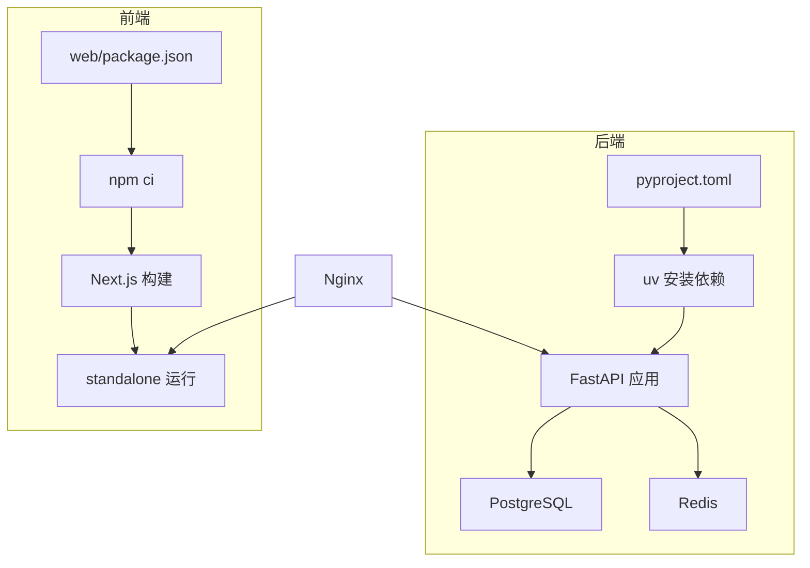

# 容器化架构

<cite>
**本文引用的文件**
- [infra/docker/backend.Dockerfile](file://infra/docker/backend.Dockerfile)
- [infra/docker/web.Dockerfile](file://infra/docker/web.Dockerfile)
- [infra/compose.local.yml](file://infra/compose.local.yml)
- [infra/nginx/app.conf](file://infra/nginx/app.conf)
- [backend/pyproject.toml](file://backend/pyproject.toml)
- [web/package.json](file://web/package.json)
- [admin/package.json](file://admin/package.json)
- [backend/app/config.py](file://backend/app/config.py)
- [backend/app/main.py](file://backend/app/main.py)
- [web/next.config.ts](file://web/next.config.ts)
- [admin/next.config.ts](file://admin/next.config.ts)
- [infra/fateradar-test.env.example](file://infra/fateradar-test.env.example)
</cite>

## 目录
1. [简介](#简介)
2. [项目结构](#项目结构)
3. [核心组件](#核心组件)
4. [架构总览](#架构总览)
5. [详细组件分析](#详细组件分析)
6. [依赖关系分析](#依赖关系分析)
7. [性能考量](#性能考量)
8. [故障排查指南](#故障排查指南)
9. [结论](#结论)
10. [附录](#附录)

## 简介
本文件面向Mingli Web项目的容器化架构，聚焦以下目标：
- 镜像构建策略：后端Python服务与前端Next.js应用的Dockerfile设计、多阶段构建优化、镜像分层与缓存机制。
- Compose编排：服务依赖、网络、数据卷与环境变量管理。
- 健康检查、日志与监控集成点。
- 安全最佳实践：非root用户运行、最小化镜像、敏感信息管理。
- 本地开发环境搭建与生产部署配置示例。

## 项目结构
本项目采用前后端分离与模块化单体后端：
- 后端（FastAPI + Uvicorn）：提供REST API与后台任务Worker，使用PostgreSQL与Redis。
- 前端（Next.js）：用户站点与管理后台均通过standalone模式构建，便于在轻量运行时中运行。
- 边缘层（Nginx）：统一入口，反向代理到Web与API，并设置安全响应头。
- 基础设施：Dockerfile位于infra/docker；Compose编排位于infra/compose.local.yml；Nginx配置位于infra/nginx/app.conf。

**图表来源**
- [infra/compose.local.yml:4-92](file://infra/compose.local.yml#L4-L92)
- [infra/nginx/app.conf:1-45](file://infra/nginx/app.conf#L1-L45)

**章节来源**
- [infra/compose.local.yml:1-93](file://infra/compose.local.yml#L1-L93)
- [infra/nginx/app.conf:1-45](file://infra/nginx/app.conf#L1-L45)

## 核心组件
- 后端镜像（backend.Dockerfile）：基于python:slim，使用uv进行依赖安装，暴露8000端口，启动Uvicorn。
- 前端镜像（web.Dockerfile）：Node多阶段构建，输出Next.js standalone产物，以非root用户nextjs运行，暴露3000端口。
- 编排（compose.local.yml）：定义postgres、redis、api、worker、web、edge六个服务，包含健康检查、端口映射、数据卷与依赖关系。
- 边缘网关（nginx/app.conf）：统一入口，转发/api到后端，其余到前端，设置安全响应头与健康探针。

**章节来源**
- [infra/docker/backend.Dockerfile:1-23](file://infra/docker/backend.Dockerfile#L1-L23)
- [infra/docker/web.Dockerfile:1-27](file://infra/docker/web.Dockerfile#L1-L27)
- [infra/compose.local.yml:1-93](file://infra/compose.local.yml#L1-L93)
- [infra/nginx/app.conf:1-45](file://infra/nginx/app.conf#L1-L45)

## 架构总览
下图展示请求从浏览器经Nginx进入Web或API，以及API对数据库与缓存的访问路径。

**图表来源**
- [infra/nginx/app.conf:16-43](file://infra/nginx/app.conf#L16-L43)
- [infra/compose.local.yml:31-79](file://infra/compose.local.yml#L31-L79)

## 详细组件分析

### 后端镜像与构建策略（backend.Dockerfile）
- 基础镜像：python:3.12-slim，启用无字节码与缓冲输出，PATH指向虚拟环境bin。
- 依赖安装：使用astral-sh/uv工具进行冻结安装（--frozen --no-dev），将依赖安装结果缓存于独立层。
- 代码复制：仅复制app、worker、alembic与配置文件，减少无关内容。
- 启动命令：Uvicorn监听0.0.0.0:8000。

**图表来源**
- [infra/docker/backend.Dockerfile:1-23](file://infra/docker/backend.Dockerfile#L1-L23)

**章节来源**
- [infra/docker/backend.Dockerfile:1-23](file://infra/docker/backend.Dockerfile#L1-L23)
- [backend/pyproject.toml:1-58](file://backend/pyproject.toml#L1-L58)

### 前端镜像与构建策略（web.Dockerfile）
- 多阶段构建：
  - dependencies阶段：安装node_modules（npm ci）。
  - build阶段：复制源码并执行next build，生成standalone产物。
  - runtime阶段：仅拷贝构建产物与public资源，创建系统用户nextjs并以该用户运行。
- 环境变量：BACKEND_INTERNAL_URL用于构建时重写API路径；NODE_ENV=production；禁用遥测。
- 启动：node server.js，监听3000端口。

**图表来源**
- [infra/docker/web.Dockerfile:1-27](file://infra/docker/web.Dockerfile#L1-L27)

**章节来源**
- [infra/docker/web.Dockerfile:1-27](file://infra/docker/web.Dockerfile#L1-L27)
- [web/package.json:1-46](file://web/package.json#L1-L46)
- [web/next.config.ts:1-66](file://web/next.config.ts#L1-L66)

### 编排与服务依赖（compose.local.yml）
- 服务清单：
  - postgres：健康检查使用pg_isready，持久化数据卷。
  - redis：关闭持久化，健康检查使用redis-cli ping。
  - api：依赖postgres与redis健康状态，注入MINGLI_*环境变量。
  - worker：复用后端镜像，执行worker.main，同样依赖postgres与redis。
  - web：依赖api，构建参数BACKEND_INTERNAL_URL。
  - edge：nginx镜像，挂载app.conf，暴露8080。
- 网络：默认bridge网络，服务间通过服务名解析。
- 数据卷：postgres-data持久化数据库文件。
- 端口映射：仅绑定127.0.0.1，避免外部直接访问。

**图表来源**
- [infra/compose.local.yml:4-92](file://infra/compose.local.yml#L4-L92)

**章节来源**
- [infra/compose.local.yml:1-93](file://infra/compose.local.yml#L1-L93)

### 边缘网关与安全头（nginx/app.conf）
- 路由：
  - /healthz：返回健康信息。
  - /api/*：反向代理到api:8000，附加X-Forwarded-*与Request-ID等头部，设置私有缓存控制。
  - /：反向代理到web:3000。
- 安全头：X-Content-Type-Options、X-Frame-Options、Referrer-Policy、Permissions-Policy等。

**图表来源**
- [infra/nginx/app.conf:10-43](file://infra/nginx/app.conf#L10-L43)

**章节来源**
- [infra/nginx/app.conf:1-45](file://infra/nginx/app.conf#L1-L45)

### 后端配置与安全校验（config.py）
- 配置加载：通过pydantic-settings读取MINGLI_*环境变量，支持自定义源过滤敏感字段（如DEEPSEEK_API_KEY）。
- 生产安全约束：
  - 强制secure cookies、禁止fake OTP/Model/Runtime适配器。
  - SMTP OTP需完整配置且生产下不可用。
  - identity_hash_key与content_encryption_key必须为真实密钥，禁止使用local-only占位值。
  - 模型调用超时、温度、最大token等参数有严格边界限制。
  - 生产要求固定路径与受控manifest/capability digest。
- 应用装配（main.py）：
  - 初始化速率限制器、OTP存储与投递适配器。
  - 注册异常处理器与OpenAPI文档。
  - 根据环境选择OTP适配器实现。

**图表来源**
- [backend/app/config.py:62-335](file://backend/app/config.py#L62-L335)
- [backend/app/main.py:30-156](file://backend/app/main.py#L30-L156)

**章节来源**
- [backend/app/config.py:1-335](file://backend/app/config.py#L1-L335)
- [backend/app/main.py:1-156](file://backend/app/main.py#L1-L156)

### 前端重写与安全头（web/next.config.ts, admin/next.config.ts）
- 重写规则：/api/*重写到BACKEND_INTERNAL_URL对应的后端地址。
- 安全头：CSP、Referrer-Policy、Permissions-Policy、X-Content-Type-Options、X-Frame-Options、COOP等。
- 私有页面：/app与/account路径添加私有缓存控制与robots指令。
- 构建产物：output=standalone，配合web.Dockerfile运行。

**章节来源**
- [web/next.config.ts:1-66](file://web/next.config.ts#L1-L66)
- [admin/next.config.ts:1-65](file://admin/next.config.ts#L1-L65)

## 依赖关系分析
- 后端依赖：
  - Python版本与包：由pyproject.toml声明，使用uv进行冻结安装，确保可重现构建。
  - 运行时依赖：PostgreSQL与Redis，通过环境变量连接。
- 前端依赖：
  - Node版本与包：由package.json声明，构建期npm ci锁定依赖。
  - 构建期依赖：Next.js与standalone输出。
- 编排依赖：
  - 服务间通过Compose网络通信，依赖顺序通过depends_on与healthcheck条件控制。

**图表来源**
- [backend/pyproject.toml:1-58](file://backend/pyproject.toml#L1-L58)
- [web/package.json:1-46](file://web/package.json#L1-L46)
- [infra/compose.local.yml:31-92](file://infra/compose.local.yml#L31-L92)

**章节来源**
- [backend/pyproject.toml:1-58](file://backend/pyproject.toml#L1-L58)
- [web/package.json:1-46](file://web/package.json#L1-L46)
- [infra/compose.local.yml:1-93](file://infra/compose.local.yml#L1-L93)

## 性能考量
- 镜像分层与缓存：
  - 后端：先复制pyproject.toml与uv.lock并安装依赖，再复制源代码，最大化利用Docker层缓存。
  - 前端：先安装依赖再构建，最后仅拷贝构建产物，减小运行时镜像体积。
- 运行时优化：
  - 后端：使用slim基础镜像与uv冻结安装，禁用开发依赖。
  - 前端：standalone模式去除构建工具链，仅保留运行所需文件。
- 网络与并发：
  - Nginx作为边缘层集中处理安全头与请求转发，减轻后端压力。
  - Redis用于会话与限流，降低数据库压力。
- 资源隔离：
  - 通过Compose限制端口绑定到localhost，避免不必要的暴露。

[本节为通用指导，不直接分析具体文件]

## 故障排查指南
- 健康检查：
  - PostgreSQL：pg_isready检测数据库可用性。
  - Redis：redis-cli ping检测缓存可用性。
  - Nginx：/healthz返回服务健康状态。
- 常见问题定位：
  - 数据库连接失败：检查MINGLI_DATABASE_URL与PostgreSQL服务健康。
  - 认证/OTP问题：确认MINGLI_OTP_ADAPTER与相关SMTP配置（若启用）。
  - 前端无法访问API：检查BACKEND_INTERNAL_URL与Nginx重写规则。
- 日志与观测：
  - 后端日志级别可通过MINGLI_LOG_LEVEL调整。
  - 请求追踪：Nginx传递X-Request-ID，便于跨服务关联日志。

**章节来源**
- [infra/compose.local.yml:10-27](file://infra/compose.local.yml#L10-L27)
- [infra/nginx/app.conf:10-14](file://infra/nginx/app.conf#L10-L14)
- [backend/app/config.py:146-148](file://backend/app/config.py#L146-L148)

## 结论
本项目通过清晰的分层与多阶段构建实现了高效、安全的容器化方案：
- 后端与前端均采用最小化运行时镜像，结合依赖冻结与分层缓存提升构建效率。
- Compose编排明确服务依赖与健康检查，保证本地与测试环境的一致性。
- Nginx作为统一入口，集中安全策略与请求转发。
- 配置层在生产环境下实施严格的安全校验，防止误配导致的风险。
建议在生产环境中：
- 使用专用密钥管理（identity_hash_key、content_encryption_key、DeepSeek API Key）。
- 启用HTTPS与TLS终止，并通过Nginx或云负载均衡器管理证书。
- 收集容器日志与指标，接入集中式日志与监控系统。

[本节为总结性内容，不直接分析具体文件]

## 附录

### 环境变量与敏感信息管理
- 关键环境变量：
  - MINGLI_ENVIRONMENT：运行环境（local/test/staging/production）。
  - MINGLI_DATABASE_URL：数据库连接串。
  - MINGLI_COOKIE_SECURE：是否启用Secure Cookie。
  - MINGLI_OTP_ADAPTER：OTP适配器（fake/smtp/disabled）。
  - MINGLI_IDENTITY_HASH_KEY：身份哈希密钥。
  - MINGLI_CONTENT_ENCRYPTION_KEY_B64：内容加密密钥（Base64编码的32字节）。
  - DEEPSEEK_API_KEY：模型提供商密钥（仅在启用deepseek适配器时需要）。
- 参考示例：
  - infra/fateradar-test.env.example提供了测试环境的占位配置，切勿提交真实密钥。

**章节来源**
- [infra/fateradar-test.env.example:1-45](file://infra/fateradar-test.env.example#L1-L45)
- [backend/app/config.py:62-186](file://backend/app/config.py#L62-L186)

### 本地开发环境搭建指南
- 启动服务：
  - 使用docker compose up启动postgres、redis、api、worker、web、edge。
  - 访问http://127.0.0.1:8080进入前端，/api/docs查看API文档。
- 开发提示：
  - 修改前端代码后重新构建web镜像或使用开发模式。
  - 修改后端代码后重启api与worker服务。
- 数据持久化：
  - 使用postgres-data卷保存数据库数据。

**章节来源**
- [infra/compose.local.yml:4-92](file://infra/compose.local.yml#L4-L92)

### 生产环境部署配置示例
- 镜像构建：
  - 后端：确保使用冻结依赖与非开发依赖。
  - 前端：设置BACKEND_INTERNAL_URL为内网API地址，构建standalone产物。
- 服务编排：
  - 使用独立的编排文件替换compose.local.yml，配置生产级数据库与缓存。
  - 启用HTTPS与TLS，配置Nginx证书与重载脚本。
- 安全加固：
  - 设置生产级密钥（identity_hash_key、content_encryption_key、DeepSeek API Key）。
  - 启用secure cookies，限制可信代理CIDR。
  - 禁用fake适配器，启用真实OTP与模型适配器。

**章节来源**
- [infra/docker/backend.Dockerfile:1-23](file://infra/docker/backend.Dockerfile#L1-L23)
- [infra/docker/web.Dockerfile:1-27](file://infra/docker/web.Dockerfile#L1-L27)
- [infra/nginx/app.conf:1-45](file://infra/nginx/app.conf#L1-L45)
- [backend/app/config.py:188-329](file://backend/app/config.py#L188-L329)