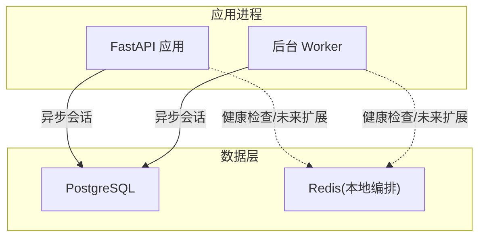
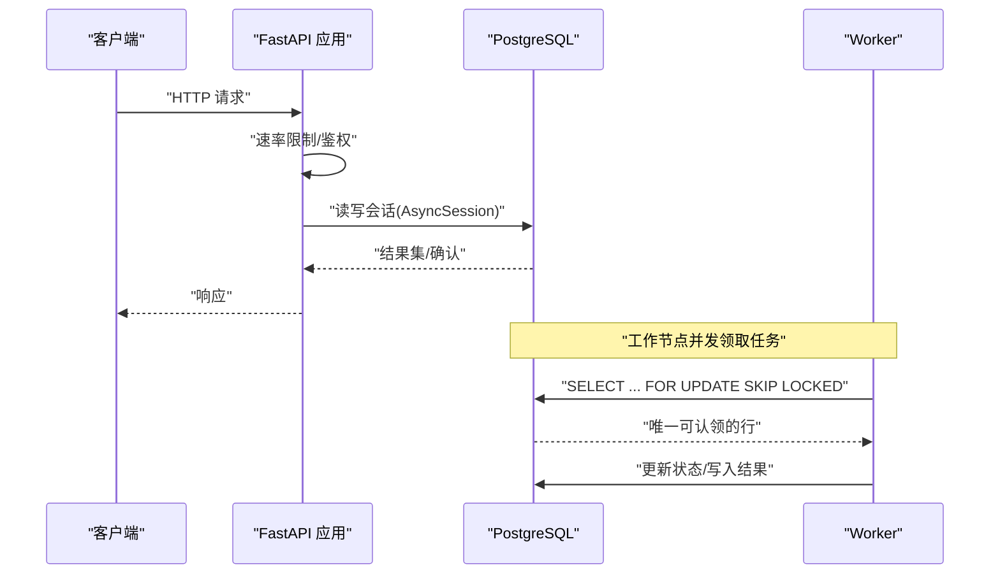
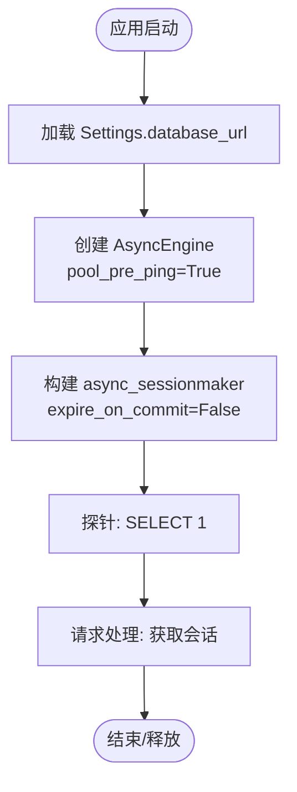
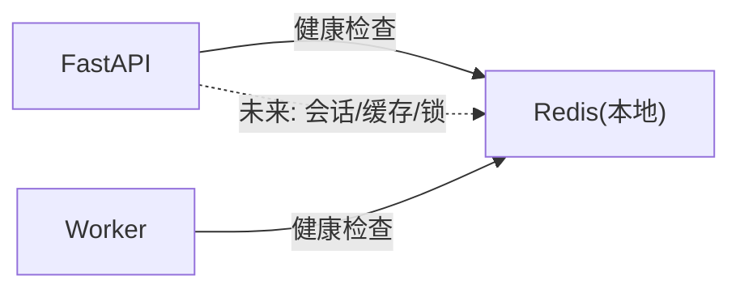
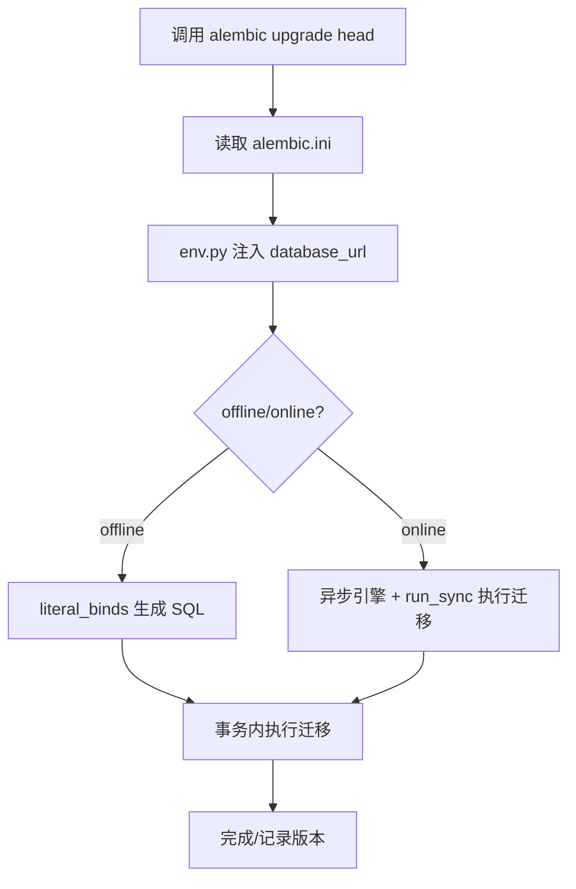
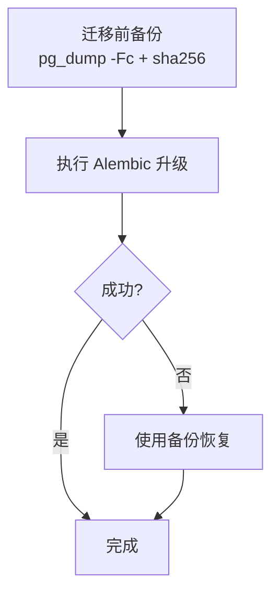
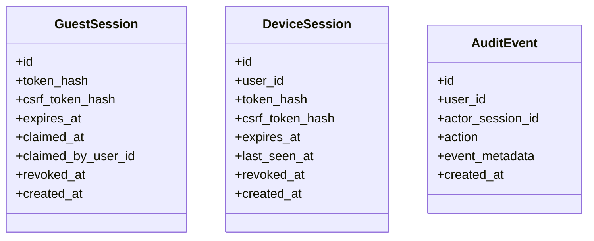
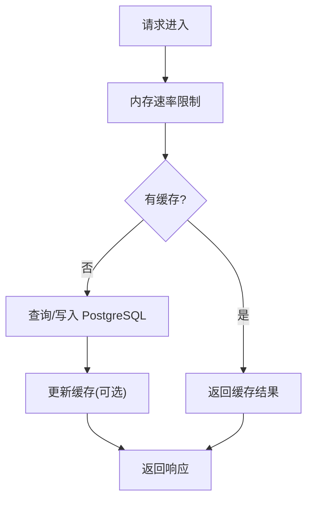
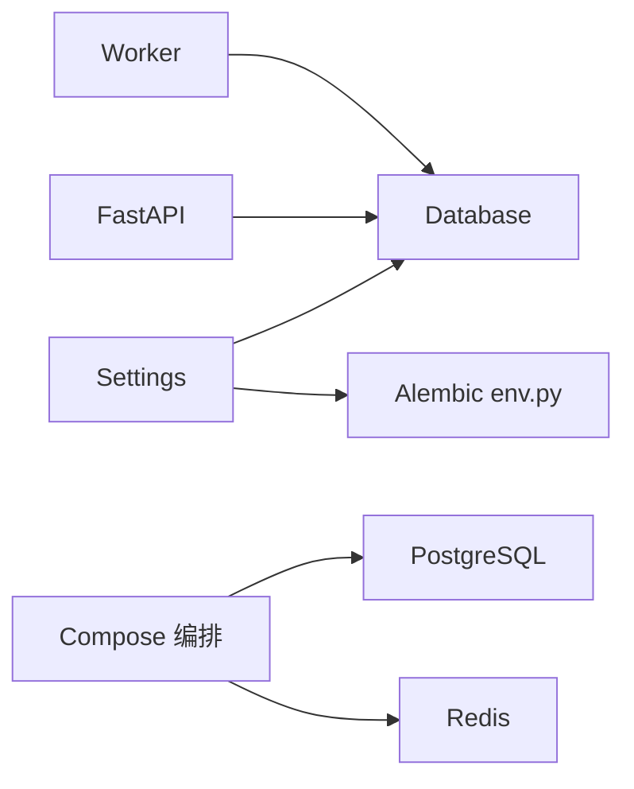

# 数据库与缓存

<cite>
**本文引用的文件**
- [backend/app/config.py](file://backend/app/config.py)
- [backend/app/database.py](file://backend/app/database.py)
- [backend/app/main.py](file://backend/app/main.py)
- [backend/alembic.ini](file://backend/alembic.ini)
- [backend/alembic/env.py](file://backend/alembic/env.py)
- [backend/alembic/versions/0001_identity_foundation.py](file://backend/alembic/versions/0001_identity_foundation.py)
- [infra/compose.local.yml](file://infra/compose.local.yml)
- [infra/fateradar-test.env.example](file://infra/fateradar-test.env.example)
- [infra/TEST_SERVER_RUNBOOK.md](file://infra/TEST_SERVER_RUNBOOK.md)
- [backend/tests/test_reading_worker.py](file://backend/tests/test_reading_worker.py)
- [backend/tests/test_guest_sessions.py](file://backend/tests/test_guest_sessions.py)
</cite>

## 目录
1. [简介](#简介)
2. [项目结构](#项目结构)
3. [核心组件](#核心组件)
4. [架构总览](#架构总览)
5. [详细组件分析](#详细组件分析)
6. [依赖关系分析](#依赖关系分析)
7. [性能考虑](#性能考虑)
8. [故障排查指南](#故障排查指南)
9. [结论](#结论)
10. [附录](#附录)

## 简介
本文件聚焦 Mingli Web 项目的数据层与缓存层设计，覆盖 PostgreSQL 连接与配置、Redis 在本地环境中的编排、Alembic 迁移管理、数据持久化与备份恢复策略、以及监控与性能分析要点。文档同时提供数据流图与缓存策略说明，帮助读者快速理解从请求到落库、再到缓存与回滚的完整链路。

## 项目结构
后端通过 FastAPI 应用启动，使用 SQLAlchemy AsyncEngine 管理 PostgreSQL 连接池与会话；迁移由 Alembic 驱动，基于 Pydantic Settings 读取数据库 URL；本地开发通过 Docker Compose 同时拉起 PostgreSQL 与 Redis（仅用于健康检查与未来扩展），并暴露 API/Worker/Web 服务。

图表来源
- [backend/app/main.py:30-156](file://backend/app/main.py#L30-L156)
- [backend/app/database.py:12-33](file://backend/app/database.py#L12-L33)
- [infra/compose.local.yml:3-29](file://infra/compose.local.yml#L3-L29)

章节来源
- [backend/app/main.py:30-156](file://backend/app/main.py#L30-L156)
- [backend/app/database.py:12-33](file://backend/app/database.py#L12-L33)
- [infra/compose.local.yml:3-29](file://infra/compose.local.yml#L3-L29)

## 核心组件
- 配置中心：Settings 集中管理数据库连接串、Cookie、OTP、速率限制等运行时参数，并在生产环境执行严格校验。
- 数据库抽象：Database 封装 AsyncEngine 与 Session 工厂，提供探测、释放与会话上下文。
- 迁移系统：Alembic 通过 env.py 注入 Settings.database_url，支持离线与在线模式，统一目标元数据。
- 编排与服务：Compose 定义 PostgreSQL、Redis、API、Worker、Web 及 Nginx，确保依赖就绪与健康检查。

章节来源
- [backend/app/config.py:62-149](file://backend/app/config.py#L62-L149)
- [backend/app/database.py:12-33](file://backend/app/database.py#L12-L33)
- [backend/alembic/env.py:13-59](file://backend/alembic/env.py#L13-L59)
- [infra/compose.local.yml:3-93](file://infra/compose.local.yml#L3-L93)

## 架构总览
下图展示请求从 API 进入，经速率限制、身份校验后访问数据库，以及 Worker 并发处理任务时的“行级锁+租约”机制。

图表来源
- [backend/app/main.py:30-156](file://backend/app/main.py#L30-L156)
- [backend/app/database.py:12-33](file://backend/app/database.py#L12-L33)
- [backend/tests/test_reading_worker.py:229-265](file://backend/tests/test_reading_worker.py#L229-L265)

## 详细组件分析

### PostgreSQL 配置与连接池
- 连接串来源：Settings.database_url 默认值为 local 环境的 postgresql+asyncpg 连接串，可通过环境变量覆盖。
- 引擎与会话：Database 使用 create_async_engine 创建引擎，启用 pool_pre_ping 以检测失效连接；会话工厂设置 expire_on_commit=False 避免提交后自动刷新导致的额外查询。
- 健康探测：probe 方法执行 SELECT 1 验证连通性；dispose 关闭引擎。
- 测试与并发：测试中通过 server_settings.search_path 隔离 schema，并使用 FOR UPDATE SKIP LOCKED 实现无锁竞争的任务领取。

图表来源
- [backend/app/config.py:72-75](file://backend/app/config.py#L72-L75)
- [backend/app/database.py:12-33](file://backend/app/database.py#L12-L33)
- [backend/tests/test_reading_worker.py:57-65](file://backend/tests/test_reading_worker.py#L57-L65)

章节来源
- [backend/app/config.py:72-75](file://backend/app/config.py#L72-L75)
- [backend/app/database.py:12-33](file://backend/app/database.py#L12-L33)
- [backend/tests/test_reading_worker.py:57-65](file://backend/tests/test_reading_worker.py#L57-L65)

### Redis 缓存配置与用途
- 本地编排：compose.local.yml 启动 redis:7-alpine，禁用 RDB/AOF 快照，仅用于健康检查与后续扩展。
- 当前用途：应用未直接集成 Redis 客户端；但已预留 OTP 挑战存储与分布式限流的接口位置（内存实现）。
- 建议扩展：可将 OTP 挑战、会话、分布式锁等热点数据迁移至 Redis，以实现跨实例共享与高可用。

图表来源
- [infra/compose.local.yml:20-29](file://infra/compose.local.yml#L20-L29)
- [backend/app/main.py:61-88](file://backend/app/main.py#L61-L88)

章节来源
- [infra/compose.local.yml:20-29](file://infra/compose.local.yml#L20-L29)
- [backend/app/main.py:61-88](file://backend/app/main.py#L61-L88)

### 数据库迁移管理（Alembic）
- 配置：alembic.ini 指定脚本目录与日志级别；env.py 将 Settings.database_url 注入 sqlalchemy.url，并导入所有模型以收集元数据。
- 运行模式：支持 offline（literal_binds）与 online（异步引擎 + run_sync）两种模式；生产部署按 release SHA 固定 Alembic 版本执行。
- 版本控制：每个迁移文件包含 revision/down_revision，形成线性版本链；首次迁移创建用户、会话、审计等基础表。
- 回滚策略：通过 downgrade 函数逐层回滚；测试与服务手册要求在升级前做 pg_dump 并记录哈希，便于失败回退。

图表来源
- [backend/alembic.ini:1-39](file://backend/alembic.ini#L1-L39)
- [backend/alembic/env.py:13-59](file://backend/alembic/env.py#L13-L59)
- [backend/alembic/versions/0001_identity_foundation.py:19-136](file://backend/alembic/versions/0001_identity_foundation.py#L19-L136)
- [infra/TEST_SERVER_RUNBOOK.md:100-123](file://infra/TEST_SERVER_RUNBOOK.md#L100-L123)

章节来源
- [backend/alembic.ini:1-39](file://backend/alembic.ini#L1-L39)
- [backend/alembic/env.py:13-59](file://backend/alembic/env.py#L13-L59)
- [backend/alembic/versions/0001_identity_foundation.py:19-136](file://backend/alembic/versions/0001_identity_foundation.py#L19-L136)
- [infra/TEST_SERVER_RUNBOOK.md:100-123](file://infra/TEST_SERVER_RUNBOOK.md#L100-L123)

### 数据持久化方案
- 数据卷管理：本地开发通过 Docker volume 持久化 PostgreSQL 数据目录；生产环境依据手册将备份归档至共享目录并按 release SHA 命名。
- 数据同步：迁移在同一数据库上滚动升级，不切换库；Worker 与 API 共享同一数据源，保证一致性。
- 灾难恢复：每次迁移前执行 pg_dump -Fc 并计算 sha256；若迁移失败，可使用该备份恢复到迁移前状态。

图表来源
- [infra/compose.local.yml:17-18](file://infra/compose.local.yml#L17-L18)
- [infra/TEST_SERVER_RUNBOOK.md:100-123](file://infra/TEST_SERVER_RUNBOOK.md#L100-L123)

章节来源
- [infra/compose.local.yml:17-18](file://infra/compose.local.yml#L17-L18)
- [infra/TEST_SERVER_RUNBOOK.md:100-123](file://infra/TEST_SERVER_RUNBOOK.md#L100-L123)

### 会话与认证的数据落地
- 访客会话：创建后返回 cookie，服务端仅持久化 token_hash 与 csrf_token_hash；新会话会撤销旧会话（revoked_at 标记）。
- 设备会话：结构与访客会话类似，绑定用户 ID，具备过期与撤销字段。
- 审计事件：记录关键操作，便于追踪与合规。

图表来源
- [backend/alembic/versions/0001_identity_foundation.py:58-123](file://backend/alembic/versions/0001_identity_foundation.py#L58-L123)
- [backend/tests/test_guest_sessions.py:40-75](file://backend/tests/test_guest_sessions.py#L40-L75)

章节来源
- [backend/alembic/versions/0001_identity_foundation.py:58-123](file://backend/alembic/versions/0001_identity_foundation.py#L58-L123)
- [backend/tests/test_guest_sessions.py:40-75](file://backend/tests/test_guest_sessions.py#L40-L75)

### 数据流图与缓存策略说明
- 写路径：API 接收请求 -> 速率限制 -> 业务逻辑 -> 写入 PostgreSQL（含事务与约束）-> 返回结果。
- 读路径：API 优先命中内存缓存（如速率窗口、OTP 挑战），未命中则查库；Worker 并发领取任务时通过数据库行级锁避免重复处理。
- 缓存策略：
  - 短期窗口型限流：内存窗口计数器，进程重启即重置，适合抗突发流量。
  - OTP 挑战与请求频率：当前为内存实现，生产建议迁移至 Redis 以实现多实例共享与 TTL 自动清理。
  - 会话与令牌：敏感信息不落盘明文，仅存哈希；过期与撤销通过数据库字段控制。

图表来源
- [backend/app/main.py:61-88](file://backend/app/main.py#L61-L88)
- [backend/tests/test_reading_worker.py:229-265](file://backend/tests/test_reading_worker.py#L229-L265)

章节来源
- [backend/app/main.py:61-88](file://backend/app/main.py#L61-L88)
- [backend/tests/test_reading_worker.py:229-265](file://backend/tests/test_reading_worker.py#L229-L265)

## 依赖关系分析
- 应用对数据库的依赖通过 Settings.database_url 注入，Database 负责生命周期管理。
- Alembic 依赖 Settings 与所有模型模块以收集元数据。
- Compose 确保 PostgreSQL 与 Redis 健康后再启动 API/Worker。

图表来源
- [backend/app/config.py:62-149](file://backend/app/config.py#L62-L149)
- [backend/app/database.py:12-33](file://backend/app/database.py#L12-L33)
- [backend/alembic/env.py:13-59](file://backend/alembic/env.py#L13-L59)
- [infra/compose.local.yml:31-67](file://infra/compose.local.yml#L31-L67)

章节来源
- [backend/app/config.py:62-149](file://backend/app/config.py#L62-L149)
- [backend/app/database.py:12-33](file://backend/app/database.py#L12-L33)
- [backend/alembic/env.py:13-59](file://backend/alembic/env.py#L13-L59)
- [infra/compose.local.yml:31-67](file://infra/compose.local.yml#L31-L67)

## 性能考虑
- 连接池：启用 pool_pre_ping 减少死连接影响；提交后不自动刷新对象，降低二次查询开销。
- 并发安全：使用 FOR UPDATE SKIP LOCKED 避免多 Worker 争抢同一任务，提升吞吐。
- 迁移效率：在线模式下通过异步引擎执行迁移，减少对主库的阻塞。
- 缓存建议：将 OTP 挑战、请求频率统计、分布式锁等热点数据迁移至 Redis，利用其原子性与 TTL 能力降低数据库压力。

章节来源
- [backend/app/database.py:12-33](file://backend/app/database.py#L12-L33)
- [backend/tests/test_reading_worker.py:229-265](file://backend/tests/test_reading_worker.py#L229-L265)
- [backend/alembic/env.py:42-59](file://backend/alembic/env.py#L42-L59)

## 故障排查指南
- 数据库不可用：检查 MINGLI_DATABASE_URL 是否正确；使用 Database.probe 进行连通性探测；查看 Compose 健康检查输出。
- 迁移失败：确认已执行 pg_dump 并保留哈希；核对 alembic.ini 与 env.py 的数据库 URL；必要时降级到上一版本。
- 会话异常：检查 guest/device session 的 token_hash 与 revoked_at 字段；确认 Cookie 属性（HttpOnly、Secure、SameSite）符合预期。
- 并发问题：确认 Worker 是否正确使用 FOR UPDATE SKIP LOCKED；观察是否存在锁等待或超时。

章节来源
- [backend/app/database.py:23-33](file://backend/app/database.py#L23-L33)
- [infra/TEST_SERVER_RUNBOOK.md:100-123](file://infra/TEST_SERVER_RUNBOOK.md#L100-L123)
- [backend/tests/test_guest_sessions.py:14-75](file://backend/tests/test_guest_sessions.py#L14-L75)
- [backend/tests/test_reading_worker.py:229-265](file://backend/tests/test_reading_worker.py#L229-L265)

## 结论
本项目采用异步 SQLAlchemy + Alembic 的现代化数据栈，结合 Compose 编排 PostgreSQL 与 Redis，满足开发与测试需求。生产环境需强化 Redis 接入、完善备份与回滚流程，并通过严格的配置校验保障安全性与稳定性。建议在后续迭代中将更多热点状态迁移至 Redis，进一步提升可扩展性与容错能力。

## 附录
- 环境变量示例：参考 infra/fateradar-test.env.example 了解本地/测试环境的关键变量。
- 迁移脚本：位于 backend/alembic/versions，按顺序维护数据库结构演进。
- 健康检查：Compose 中对 PostgreSQL 与 Redis 均定义了健康检查，确保服务就绪。

章节来源
- [infra/fateradar-test.env.example:1-45](file://infra/fateradar-test.env.example#L1-L45)
- [backend/alembic/versions/0001_identity_foundation.py:19-136](file://backend/alembic/versions/0001_identity_foundation.py#L19-L136)
- [infra/compose.local.yml:10-29](file://infra/compose.local.yml#L10-L29)