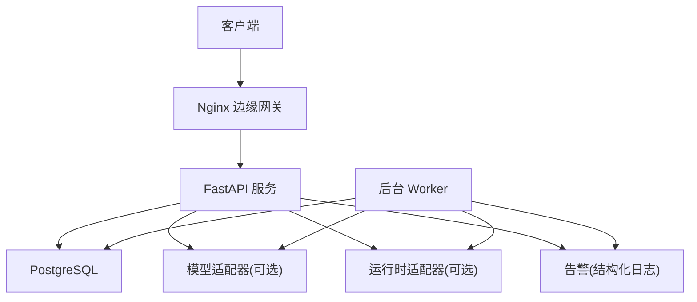
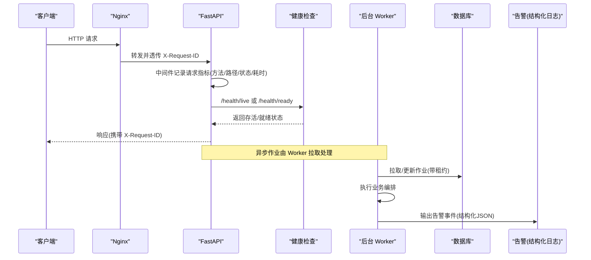
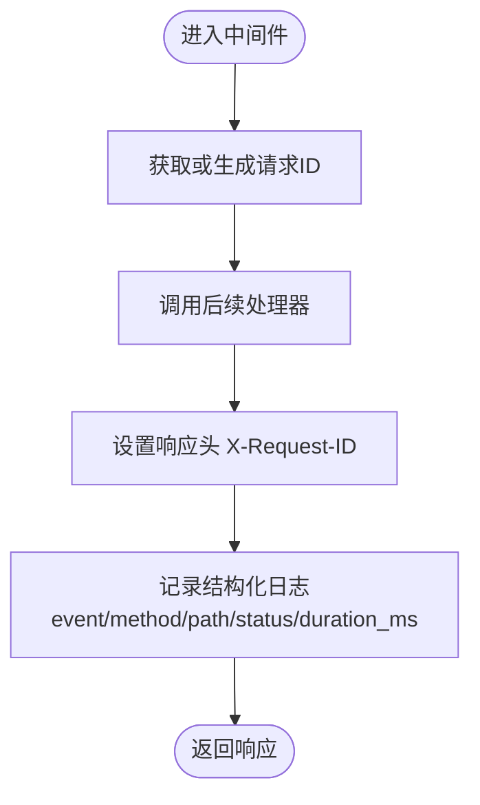
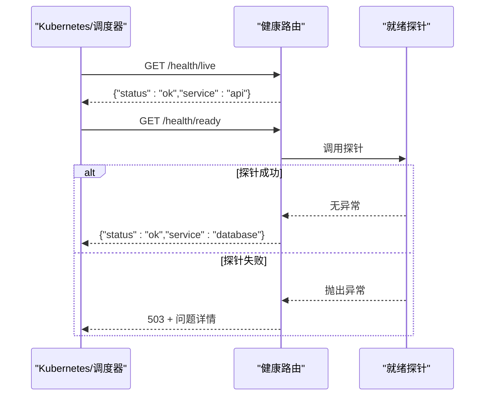
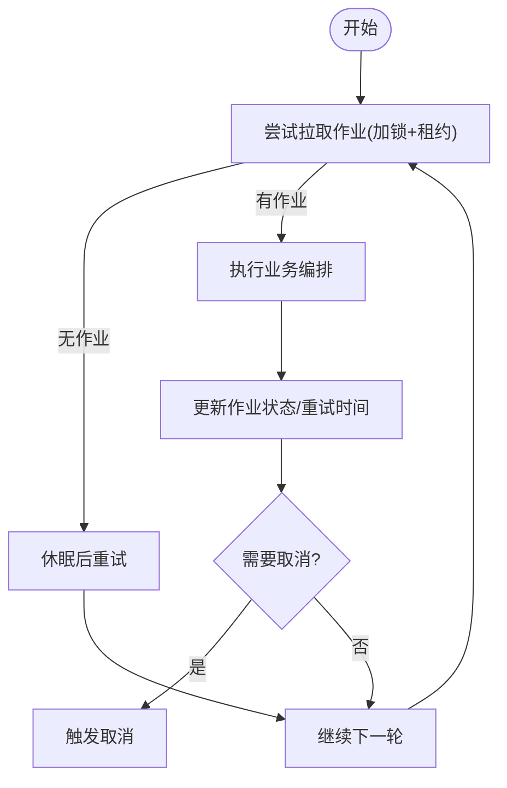
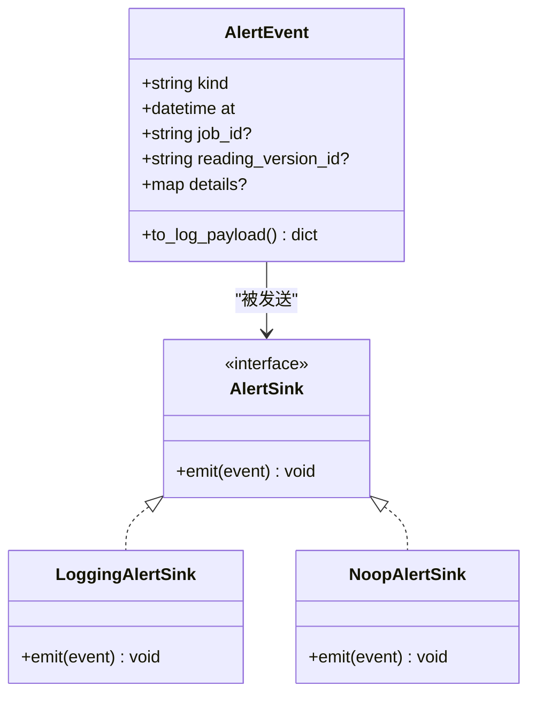
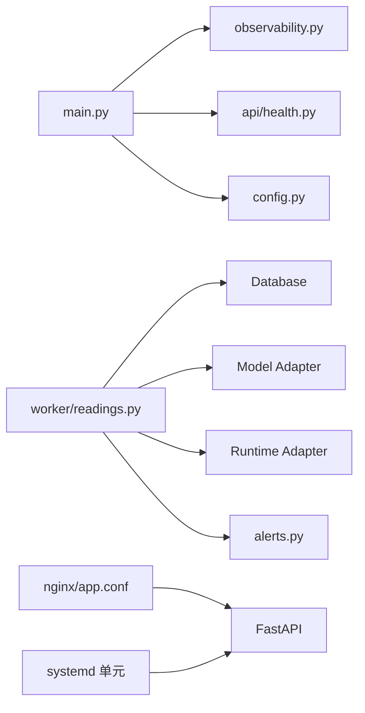

# 监控与日志

<cite>
**本文引用的文件**
- [backend/app/observability.py](file://backend/app/observability.py)
- [backend/app/api/health.py](file://backend/app/api/health.py)
- [backend/app/main.py](file://backend/app/main.py)
- [backend/app/config.py](file://backend/app/config.py)
- [backend/worker/readings.py](file://backend/worker/readings.py)
- [backend/worker/main.py](file://backend/worker/main.py)
- [backend/app/readings/alerts.py](file://backend/app/readings/alerts.py)
- [infra/systemd/fateradar-test-api.service](file://infra/systemd/fateradar-test-api.service)
- [infra/nginx/app.conf](file://infra/nginx/app.conf)
- [contracts/schemas/health.schema.json](file://contracts/schemas/health.schema.json)
</cite>

## 目录
1. [简介](#简介)
2. [项目结构](#项目结构)
3. [核心组件](#核心组件)
4. [架构总览](#架构总览)
5. [详细组件分析](#详细组件分析)
6. [依赖关系分析](#依赖关系分析)
7. [性能考量](#性能考量)
8. [故障排查指南](#故障排查指南)
9. [结论](#结论)
10. [附录](#附录)

## 简介
本文件为 Mingli Web 项目的“监控与日志”架构文档，聚焦以下目标：
- 应用监控方案：性能指标收集、健康检查端点、错误追踪集成。
- 日志收集策略：结构化日志格式、日志轮转、集中式日志管理。
- 系统监控配置：进程守护、自动重启、资源监控。
- 告警机制：阈值设置、通知渠道、故障自愈。
- 监控仪表板与日志查询示例。
- 监控架构图与关键指标定义。

本项目在 API 层提供请求级可观测性（请求ID、耗时、状态码），在后端启动时统一配置日志级别；健康检查通过 /health/live 与 /health/ready 暴露；后台 Worker 具备作业拉取、处理与重试能力；运维侧通过 systemd 进行进程守护与自动重启；Nginx 作为边缘网关转发并透传请求ID；告警以结构化日志事件输出，便于接入集中式日志平台与告警系统。

## 项目结构
与监控与日志相关的关键位置如下：
- API 可观测性与日志初始化：后端主程序装配中间件与日志配置。
- 健康检查：独立路由模块，支持存活与就绪探针。
- 后台任务：Worker 循环拉取作业、执行编排器、持久化结果。
- 告警：结构化告警事件，默认写入日志，可按开关启用。
- 进程守护：systemd 单元文件负责进程生命周期与重启策略。
- 边缘网关：Nginx 转发请求、注入/透传请求ID、提供边缘健康检查。

图表来源
- [backend/app/main.py:50-140](file://backend/app/main.py#L50-L140)
- [backend/app/api/health.py:11-36](file://backend/app/api/health.py#L11-L36)
- [backend/worker/readings.py:254-319](file://backend/worker/readings.py#L254-L319)
- [infra/nginx/app.conf:10-44](file://infra/nginx/app.conf#L10-L44)

章节来源
- [backend/app/main.py:50-140](file://backend/app/main.py#L50-L140)
- [backend/app/api/health.py:11-36](file://backend/app/api/health.py#L11-L36)
- [backend/worker/readings.py:254-319](file://backend/worker/readings.py#L254-L319)
- [infra/nginx/app.conf:10-44](file://infra/nginx/app.conf#L10-L44)

## 核心组件
- 请求级可观测性：为每个 HTTP 请求生成或透传唯一请求ID，记录方法、路径、状态码、耗时等指标到结构化日志。
- 健康检查：/health/live 返回服务存活；/health/ready 调用就绪探针（如数据库连通性）判断是否可接收流量。
- 日志配置：统一设置日志级别，屏蔽敏感传输库的冗余日志。
- 后台 Worker：从数据库拉取待处理作业，加租约锁避免重复处理，执行读取编排流程，更新作业状态，支持重试与取消。
- 告警：将业务异常或重要事件以结构化 JSON 形式输出到日志，便于外部系统采集与告警。
- 进程守护：systemd 管理 API 进程，失败自动重启，限制权限与内存写执行。
- 边缘网关：Nginx 转发请求至 API/Web，透传 X-Request-ID，提供边缘健康检查。

章节来源
- [backend/app/observability.py:14-51](file://backend/app/observability.py#L14-L51)
- [backend/app/api/health.py:11-36](file://backend/app/api/health.py#L11-L36)
- [backend/app/main.py:138-140](file://backend/app/main.py#L138-L140)
- [backend/worker/readings.py:121-231](file://backend/worker/readings.py#L121-L231)
- [backend/app/readings/alerts.py:20-75](file://backend/app/readings/alerts.py#L20-L75)
- [infra/systemd/fateradar-test-api.service:19-52](file://infra/systemd/fateradar-test-api.service#L19-L52)
- [infra/nginx/app.conf:10-44](file://infra/nginx/app.conf#L10-L44)

## 架构总览
下图展示了请求从入口到后端处理、再到后台作业与告警的整体链路，以及健康检查与边缘网关的作用。

图表来源
- [infra/nginx/app.conf:16-43](file://infra/nginx/app.conf#L16-L43)
- [backend/app/observability.py:27-51](file://backend/app/observability.py#L27-L51)
- [backend/app/api/health.py:11-36](file://backend/app/api/health.py#L11-L36)
- [backend/worker/readings.py:121-231](file://backend/worker/readings.py#L121-L231)
- [backend/app/readings/alerts.py:20-75](file://backend/app/readings/alerts.py#L20-L75)

## 详细组件分析

### 请求级可观测性（HTTP 中间件）
- 功能：解析或生成请求ID，记录每次请求的方法、路径、状态码、耗时到结构化日志，并在响应头中回显请求ID以便链路追踪。
- 关键点：对第三方传输库日志降级以减少噪音；使用高精度计时计算耗时。
- 集成点：在应用启动时安装到 FastAPI 中间件链。

图表来源
- [backend/app/observability.py:20-51](file://backend/app/observability.py#L20-L51)

章节来源
- [backend/app/observability.py:14-51](file://backend/app/observability.py#L14-L51)
- [backend/app/main.py:138-140](file://backend/app/main.py#L138-L140)

### 健康检查端点
- /health/live：快速返回服务存活状态。
- /health/ready：调用就绪探针（例如数据库探测），失败返回 503 并附带问题类型。
- 契约：响应体包含 status 与 service 字段，符合健康响应 Schema。

图表来源
- [backend/app/api/health.py:11-36](file://backend/app/api/health.py#L11-L36)
- [contracts/schemas/health.schema.json:1-12](file://contracts/schemas/health.schema.json#L1-L12)

章节来源
- [backend/app/api/health.py:11-36](file://backend/app/api/health.py#L11-L36)
- [contracts/schemas/health.schema.json:1-12](file://contracts/schemas/health.schema.json#L1-L12)

### 后台作业处理（Worker）
- 作业拉取：按优先级与可用时间拉取队列中的作业，采用行级锁与租约防止重复处理。
- 作业处理：执行业务编排，根据结果更新作业状态，支持延迟重试与取消。
- 可观测性：每次迭代输出结构化事件，便于统计吞吐与失败率。

图表来源
- [backend/worker/readings.py:121-231](file://backend/worker/readings.py#L121-L231)
- [backend/worker/main.py:74-97](file://backend/worker/main.py#L74-L97)

章节来源
- [backend/worker/readings.py:121-231](file://backend/worker/readings.py#L121-L231)
- [backend/worker/main.py:74-97](file://backend/worker/main.py#L74-L97)

### 告警机制（结构化日志）
- 事件模型：包含事件类型、时间戳、关联作业/版本ID与详情。
- 输出方式：默认以结构化 JSON 写入日志（警告级别），可通过配置开关启用。
- 扩展点：通过协议抽象 AlertSink，支持测试记录与生产日志两种实现。

图表来源
- [backend/app/readings/alerts.py:16-75](file://backend/app/readings/alerts.py#L16-L75)

章节来源
- [backend/app/readings/alerts.py:20-75](file://backend/app/readings/alerts.py#L20-L75)
- [backend/worker/readings.py:268-274](file://backend/worker/readings.py#L268-L274)

### 进程守护与自动重启（systemd）
- 进程管理：以简单服务模式运行 uvicorn，指定工作目录与环境变量。
- 自动重启：失败时自动重启，设置重启间隔与优雅停止超时。
- 安全加固：限制权限、禁止提权、隔离临时目录与设备、限制系统调用架构、禁用内存写执行。

章节来源
- [infra/systemd/fateradar-test-api.service:19-52](file://infra/systemd/fateradar-test-api.service#L19-L52)

### 边缘网关（Nginx）
- 健康检查：/healthz 直接返回边缘健康状态，不记录访问日志。
- 请求转发：将 /api 转发至后端 API，将根路径转发至前端 Web。
- 请求追踪：透传 X-Request-ID 到后端，便于全链路追踪。
- 安全头：设置内容类型嗅探防护、帧选项、引用策略与权限策略。

章节来源
- [infra/nginx/app.conf:10-44](file://infra/nginx/app.conf#L10-L44)

## 依赖关系分析
- API 启动依赖：
  - 日志配置与请求可观测性中间件在应用创建时安装。
  - 健康路由注册到 API，就绪探针默认为数据库探针。
- Worker 依赖：
  - 数据库会话、运行时与模型适配器（可替换）。
  - 告警 Sink 通过配置开关启用。
- 外部依赖：
  - PostgreSQL（数据库）、Nginx（边缘网关）、systemd（进程守护）。

图表来源
- [backend/app/main.py:50-140](file://backend/app/main.py#L50-L140)
- [backend/worker/readings.py:254-319](file://backend/worker/readings.py#L254-L319)
- [infra/nginx/app.conf:16-43](file://infra/nginx/app.conf#L16-L43)
- [infra/systemd/fateradar-test-api.service:19-52](file://infra/systemd/fateradar-test-api.service#L19-L52)

章节来源
- [backend/app/main.py:50-140](file://backend/app/main.py#L50-L140)
- [backend/worker/readings.py:254-319](file://backend/worker/readings.py#L254-L319)
- [infra/nginx/app.conf:16-43](file://infra/nginx/app.conf#L16-L43)
- [infra/systemd/fateradar-test-api.service:19-52](file://infra/systemd/fateradar-test-api.service#L19-L52)

## 性能考量
- 请求指标：通过中间件记录耗时与状态码，建议基于这些指标建立延迟分位（p50/p95/p99）与错误率看板。
- 日志级别：通过配置项控制日志级别，生产环境建议仅保留必要信息，降低 I/O 压力。
- 后台吞吐：Worker 拉取间隔与作业并发度影响吞吐，需结合数据库负载与外部依赖限流调整。
- 外部依赖超时：模型与运行时适配器存在超时与大小限制，需合理配置以避免长尾请求阻塞。

[本节为通用指导，无需特定文件引用]

## 故障排查指南
- 无法访问健康端点：
  - 检查 /health/live 是否返回存活；若 /health/ready 返回 503，检查数据库连接与就绪探针逻辑。
- 请求无法追踪：
  - 确认 Nginx 是否正确透传 X-Request-ID，API 是否在响应头中回显该 ID。
- 日志过多或过少：
  - 调整日志级别配置；注意第三方传输库日志已降级。
- 作业未处理：
  - 检查数据库作业表是否有可拉取的作业；确认 Worker 是否正常运行且租约未过期。
- 告警未产生：
  - 确认告警 Sink 是否启用；查看结构化日志中是否存在 ops_alert 事件。

章节来源
- [backend/app/api/health.py:11-36](file://backend/app/api/health.py#L11-L36)
- [infra/nginx/app.conf:16-43](file://infra/nginx/app.conf#L16-L43)
- [backend/app/observability.py:14-51](file://backend/app/observability.py#L14-L51)
- [backend/worker/readings.py:121-231](file://backend/worker/readings.py#L121-L231)
- [backend/app/readings/alerts.py:20-75](file://backend/app/readings/alerts.py#L20-L75)

## 结论
本项目提供了完整的请求级可观测性、健康检查、结构化日志与告警能力，并通过 systemd 与 Nginx 实现了进程守护与边缘转发。建议在部署环境中接入集中式日志平台与监控系统，基于现有指标与事件构建仪表板与告警规则，进一步提升系统的可观测性与稳定性。

[本节为总结性内容，无需特定文件引用]

## 附录

### 关键指标定义
- 请求指标（来自中间件）：
  - event: http_request
  - request_id: 请求唯一标识
  - method: HTTP 方法
  - path: 请求路径
  - status: 响应状态码
  - duration_ms: 请求耗时（毫秒）
- 健康检查：
  - /health/live: 服务存活
  - /health/ready: 服务就绪（依赖可用性）
- 作业指标（来自 Worker）：
  - worker_iteration: 每次迭代结果（是否处理了作业）
- 告警事件（来自告警 Sink）：
  - event: ops_alert
  - kind: 告警类型
  - at: 时间戳
  - job_id: 作业ID（可选）
  - reading_version_id: 读取版本ID（可选）
  - details: 详情（可选）

章节来源
- [backend/app/observability.py:37-50](file://backend/app/observability.py#L37-L50)
- [backend/app/api/health.py:14-34](file://backend/app/api/health.py#L14-L34)
- [backend/worker/main.py:91-97](file://backend/worker/main.py#L91-L97)
- [backend/app/readings/alerts.py:28-40](file://backend/app/readings/alerts.py#L28-L40)

### 监控仪表板配置建议
- 指标来源：
  - 结构化日志中的 http_request 事件，用于绘制 QPS、延迟分布、错误率。
  - 健康检查端点，用于绘制服务可用性。
  - Worker 迭代事件，用于绘制作业吞吐与失败率。
- 推荐面板：
  - 请求延迟分位图（p50/p95/p99）
  - 各接口错误率与 Top 错误
  - 健康检查成功率
  - 作业处理吞吐与积压
  - 告警事件趋势与分类

[本节为概念性建议，无需特定文件引用]

### 日志查询示例
- 查找某请求的完整链路：
  - 使用 request_id 过滤所有日志条目，包括中间件记录与健康检查。
- 定位慢请求：
  - 筛选 duration_ms 大于阈值的 http_request 事件。
- 分析作业处理情况：
  - 查询 worker_iteration 事件，统计 processed 比例与失败原因。
- 检索告警事件：
  - 筛选 event=ops_alert 的结构化日志，按 kind 分类统计。

[本节为概念性建议，无需特定文件引用]