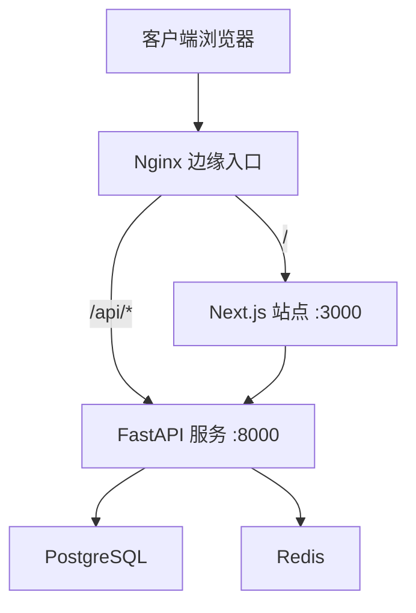
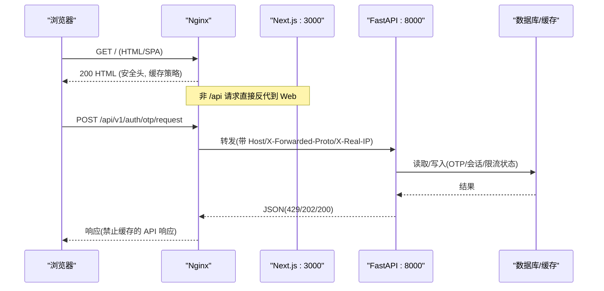
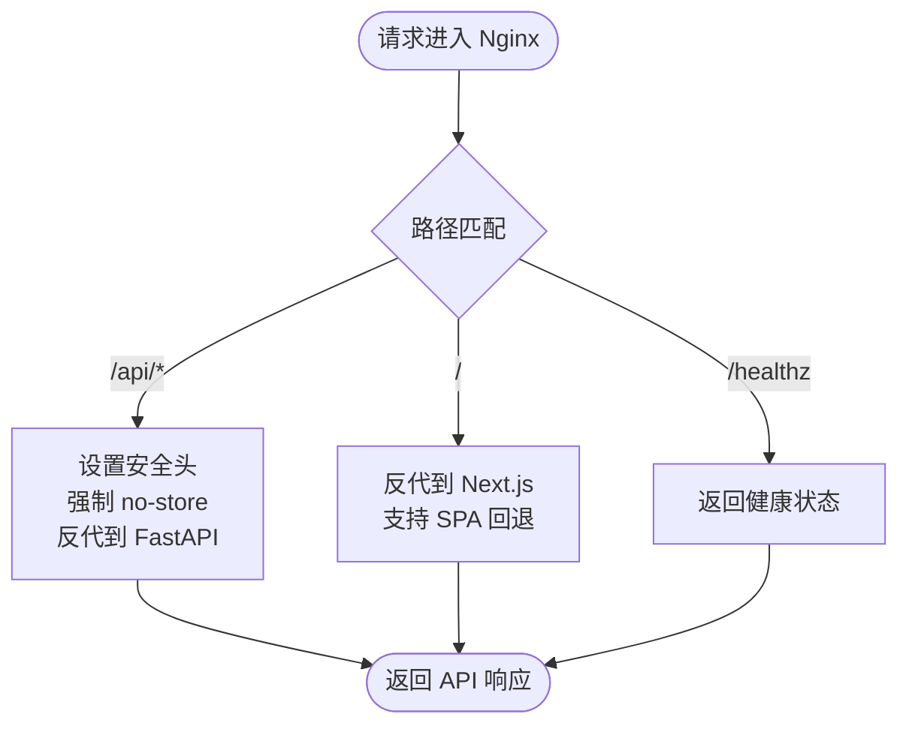
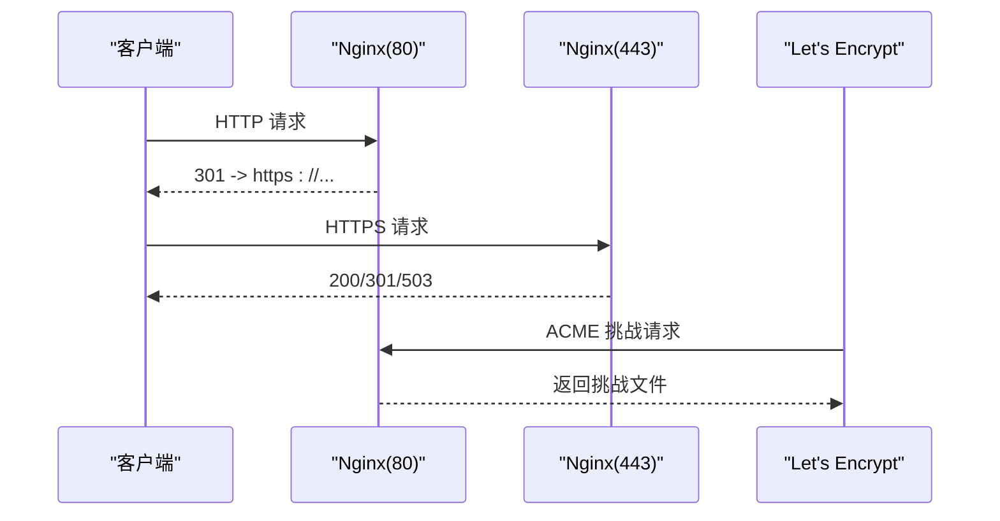
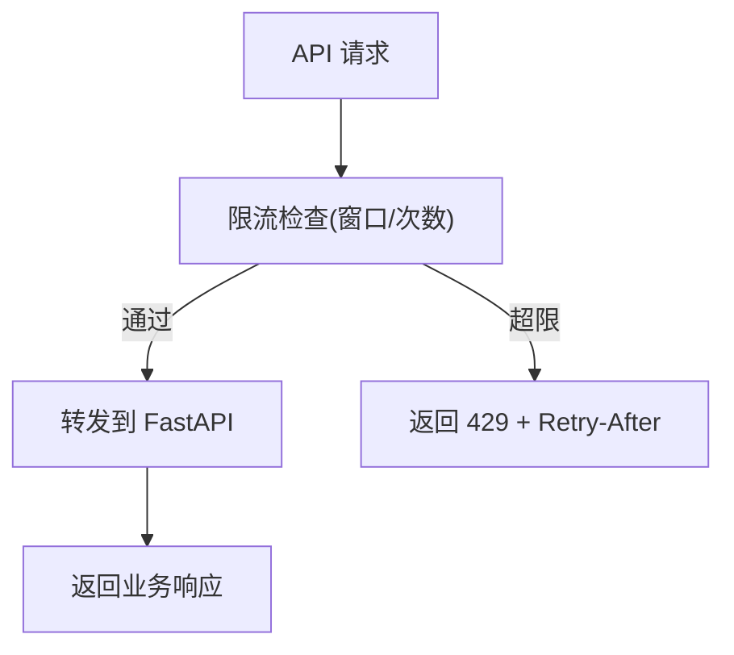
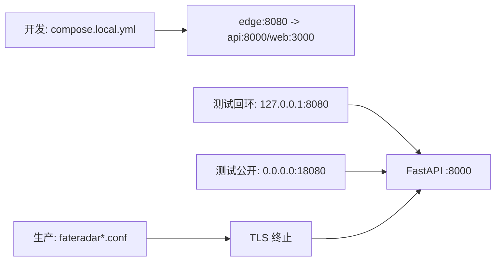
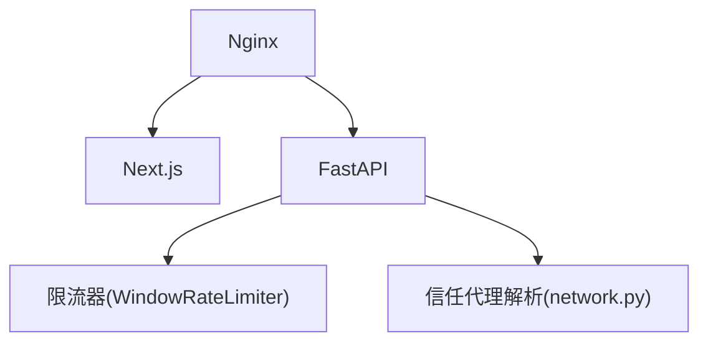

# 网络与反向代理

<cite>
**本文引用的文件**
- [infra/nginx/app.conf](file://infra/nginx/app.conf)
- [infra/nginx/fateradar.conf](file://infra/nginx/fateradar.conf)
- [infra/nginx/fateradar-tls.conf](file://infra/nginx/fateradar-tls.conf)
- [infra/nginx/fateradar-test-loopback.conf](file://infra/nginx/fateradar-test-loopback.conf)
- [infra/nginx/fateradar-test-public-preview.conf](file://infra/nginx/fateradar-test-public-preview.conf)
- [infra/compose.local.yml](file://infra/compose.local.yml)
- [backend/app/network.py](file://backend/app/network.py)
- [backend/app/config.py](file://backend/app/config.py)
- [backend/app/main.py](file://backend/app/main.py)
- [backend/app/readings/rate_limit.py](file://backend/app/readings/rate_limit.py)
- [backend/app/api/rate_guard.py](file://backend/app/api/rate_guard.py)
- [web/next.config.ts](file://web/next.config.ts)
- [admin/next.config.ts](file://admin/next.config.ts)
- [tests/contract/test_infra_contract.py](file://tests/contract/test_infra_contract.py)
</cite>

## 目录
1. [简介](#简介)
2. [项目结构](#项目结构)
3. [核心组件](#核心组件)
4. [架构总览](#架构总览)
5. [详细组件分析](#详细组件分析)
6. [依赖关系分析](#依赖关系分析)
7. [性能考虑](#性能考虑)
8. [故障排查指南](#故障排查指南)
9. [结论](#结论)
10. [附录](#附录)

## 简介
本文件聚焦 Mingli Web 项目的网络与反向代理架构，围绕 Nginx 边缘入口、请求路由、负载均衡策略、SSL/TLS 终止、静态资源服务、API 网关能力（限流、认证相关头转发、CORS）、域名解析与 HTTPS 证书管理进行系统化说明。文档同时提供开发、测试、生产三类环境的配置示例与差异对比，并给出网络拓扑图与流量流向图，帮助读者快速理解从浏览器到后端服务的完整链路。

## 项目结构
本项目采用“边缘 Nginx + Next.js 前端 + FastAPI 后端”的分层架构：
- 边缘层：Nginx 负责对外暴露端口、统一安全头、健康检查、HTTPS 终止、按路径将请求分发至 Web 或 API。
- 前端层：Next.js standalone 应用，提供页面渲染与 SPA 路由；通过 rewrites 将 /api/* 转发给后端。
- 后端层：FastAPI 应用，承载业务 API、鉴权、限流、OTP 等逻辑；配合 Redis/PostgreSQL 持久化。
- 编排层：Docker Compose 在本地编排数据库、缓存、API、Worker、Web、Edge 等服务。

**图示来源**
- [infra/nginx/app.conf:1-44](file://infra/nginx/app.conf#L1-L44)
- [infra/compose.local.yml:31-89](file://infra/compose.local.yml#L31-L89)

**章节来源**
- [infra/nginx/app.conf:1-44](file://infra/nginx/app.conf#L1-L44)
- [infra/compose.local.yml:1-93](file://infra/compose.local.yml#L1-L93)

## 核心组件
- Nginx 边缘入口
  - 统一安全响应头、健康检查端点、按路径反代到 Web 或 API。
  - 对 API 路径强制 no-store，避免中间层缓存敏感数据。
  - 重写 X-Forwarded-For 为直连客户端地址，防止伪造。
- Next.js 前端
  - 通过 rewrites 将 /api/* 转发到后端内部地址。
  - 设置严格的安全头与私有缓存策略。
- FastAPI 后端
  - 基于配置的信任代理网段解析真实客户端 IP。
  - 内置多类限流器：OTP 请求限流、写操作窗口限流、会话创建限流、管理员登录限流。
  - 生命周期中注册限流器与 OTP 能力，并在退出时清理状态。

**章节来源**
- [infra/nginx/app.conf:1-44](file://infra/nginx/app.conf#L1-L44)
- [web/next.config.ts:27-65](file://web/next.config.ts#L27-L65)
- [backend/app/network.py:16-54](file://backend/app/network.py#L16-L54)
- [backend/app/main.py:30-156](file://backend/app/main.py#L30-L156)
- [backend/app/readings/rate_limit.py:9-61](file://backend/app/readings/rate_limit.py#L9-L61)
- [backend/app/api/rate_guard.py:1-20](file://backend/app/api/rate_guard.py#L1-L20)

## 架构总览
下图展示典型部署下的请求流转：浏览器访问域名，Nginx 根据路径将请求路由到 Next.js 或 FastAPI；API 请求携带必要的代理头，后端依据信任代理网段解析真实客户端 IP；静态资源由 Next.js 输出，必要时可接入 CDN。

**图示来源**
- [infra/nginx/app.conf:16-43](file://infra/nginx/app.conf#L16-L43)
- [backend/app/main.py:67-88](file://backend/app/main.py#L67-L88)
- [backend/app/network.py:22-54](file://backend/app/network.py#L22-L54)

## 详细组件分析

### Nginx 反向代理与请求路由
- 路由规则
  - /healthz：返回边缘健康状态，便于探针检测。
  - /api/*：反代到后端 FastAPI 服务，强制无缓存与安全头。
  - /：反代到 Next.js 站点，支持 SPA 回退。
- 安全与传输
  - 统一设置 X-Content-Type-Options、X-Frame-Options、Referrer-Policy、Permissions-Policy。
  - 对 API 响应设置 private,no-store,max-age=0，避免中间缓存泄露敏感信息。
  - 重写 X-Forwarded-For 为 $remote_addr，确保后端拿到直连客户端地址。
- 负载均衡策略
  - 当前配置为单上游服务；如需多实例，可在 upstream 中定义多个 server 并使用默认轮询策略。
- 静态资源与压缩
  - 静态资源由 Next.js 输出；可在 Nginx 层开启 gzip/brotli 压缩与长缓存策略（针对静态资源）。
- CDN 集成
  - 可将静态资源托管至 CDN，Nginx 仅作为入口与 API 反代；需确保 Cookie/Session 不随静态资源下发。

**图示来源**
- [infra/nginx/app.conf:10-43](file://infra/nginx/app.conf#L10-L43)

**章节来源**
- [infra/nginx/app.conf:1-44](file://infra/nginx/app.conf#L1-L44)
- [infra/nginx/fateradar-test-loopback.conf:11-57](file://infra/nginx/fateradar-test-loopback.conf#L11-L57)
- [infra/nginx/fateradar-test-public-preview.conf:4-45](file://infra/nginx/fateradar-test-public-preview.conf#L4-L45)

### SSL/TLS 终止与证书管理
- HTTP 到 HTTPS 重定向
  - 所有 80 端口请求重定向到对应域名的 https。
- TLS 配置
  - 使用 Let’s Encrypt 证书路径与 DH 参数，启用 HSTS。
  - 为 www 子域名重定向到主域名。
- ACME 验证
  - 暴露 /.well-known/acme-challenge/ 供证书签发工具校验。
- 证书重载
  - 提供脚本用于 nginx 配置测试与平滑重载。

**图示来源**
- [infra/nginx/fateradar-tls.conf:8-124](file://infra/nginx/fateradar-tls.conf#L8-L124)
- [infra/letsencrypt/reload-nginx.sh:1-6](file://infra/letsencrypt/reload-nginx.sh#L1-L6)

**章节来源**
- [infra/nginx/fateradar.conf:8-58](file://infra/nginx/fateradar.conf#L8-L58)
- [infra/nginx/fateradar-tls.conf:8-124](file://infra/nginx/fateradar-tls.conf#L8-L124)
- [infra/letsencrypt/reload-nginx.sh:1-6](file://infra/letsencrypt/reload-nginx.sh#L1-L6)

### 静态资源服务与缓存策略
- Next.js 输出 standalone 包，Nginx 将 / 反代到 :3000。
- 建议策略
  - 静态资源（js/css/img）开启 gzip/brotli 与长期缓存（如一年），并设置 Cache-Control。
  - 动态页面与 API 保持 no-store。
  - 若接入 CDN，需在 CDN 层配置缓存键与排除 Cookie 的规则，避免用户态数据被缓存。
- 安全头
  - Nginx 与 Next.js 均设置 CSP、Referrer-Policy、Permissions-Policy、X-Frame-Options 等。

**章节来源**
- [web/next.config.ts:27-65](file://web/next.config.ts#L27-L65)
- [admin/next.config.ts:1-64](file://admin/next.config.ts#L1-L64)
- [infra/nginx/app.conf:5-43](file://infra/nginx/app.conf#L5-L43)

### API 网关功能：限流、认证相关头转发、CORS
- 限流
  - 后端内置多种限流器：OTP 请求限流、写操作窗口限流、会话创建限流、管理员登录限流。
  - 限流器以滑动窗口实现，超限时返回 429 并附带 Retry-After。
- 认证相关头转发
  - Nginx 传递 Host、X-Forwarded-Host、X-Forwarded-Proto、X-Real-IP、X-Request-ID。
  - 后端依据 trusted_proxy_cidrs 解析真实客户端 IP，避免伪造。
- CORS
  - 当前配置未显式设置 Access-Control-Allow-*；跨域场景需在 Nginx 或 FastAPI 中补充相应头。

**图示来源**
- [backend/app/readings/rate_limit.py:9-61](file://backend/app/readings/rate_limit.py#L9-L61)
- [backend/app/api/rate_guard.py:5-20](file://backend/app/api/rate_guard.py#L5-L20)
- [infra/nginx/app.conf:16-32](file://infra/nginx/app.conf#L16-L32)

**章节来源**
- [backend/app/main.py:67-88](file://backend/app/main.py#L67-L88)
- [backend/app/network.py:16-54](file://backend/app/network.py#L16-L54)
- [backend/app/readings/rate_limit.py:9-61](file://backend/app/readings/rate_limit.py#L9-L61)
- [backend/app/api/rate_guard.py:1-20](file://backend/app/api/rate_guard.py#L1-L20)

### 域名解析、DNS 与 HTTPS 证书管理
- DNS 记录
  - 为 fateradar.cn、www.fateradar.cn、api.fateradar.cn 指向服务器公网 IP。
- HTTPS 证书
  - 使用 Let’s Encrypt 自动签发与续期；Nginx 暴露 ACME 验证路径。
  - 证书更新后通过脚本重载 Nginx。
- 重定向策略
  - 所有 HTTP 请求重定向到对应域名的 HTTPS。

**章节来源**
- [infra/nginx/fateradar.conf:8-58](file://infra/nginx/fateradar.conf#L8-L58)
- [infra/nginx/fateradar-tls.conf:8-124](file://infra/nginx/fateradar-tls.conf#L8-L124)
- [infra/letsencrypt/reload-nginx.sh:1-6](file://infra/letsencrypt/reload-nginx.sh#L1-L6)

### 不同环境的代理配置示例
- 开发环境（本地 Docker Compose）
  - 通过 edge 容器映射 127.0.0.1:8080:80，反代到 api:8000 与 web:3000。
  - 环境变量注入 MINGLI_TRUSTED_PROXY_CIDRS，使后端正确解析客户端 IP。
- 测试回环入口
  - 仅监听 127.0.0.1:8080，不做 TLS，适合本机 SSH 隧道访问。
- 公开预览入口
  - 监听 0.0.0.0:18080，允许临时公网访问（仅限测试环境）。
- 生产入口
  - 使用 fateradar.conf 与 fateradar-tls.conf 处理 HTTP 重定向与 HTTPS 终止。
  - API 入口暂时返回 503，待 FastAPI 上线后替换为反向代理。

**图示来源**
- [infra/compose.local.yml:81-90](file://infra/compose.local.yml#L81-L90)
- [infra/nginx/fateradar-test-loopback.conf:11-57](file://infra/nginx/fateradar-test-loopback.conf#L11-L57)
- [infra/nginx/fateradar-test-public-preview.conf:4-45](file://infra/nginx/fateradar-test-public-preview.conf#L4-L45)
- [infra/nginx/fateradar.conf:8-58](file://infra/nginx/fateradar.conf#L8-L58)
- [infra/nginx/fateradar-tls.conf:56-124](file://infra/nginx/fateradar-tls.conf#L56-L124)

**章节来源**
- [infra/compose.local.yml:31-90](file://infra/compose.local.yml#L31-L90)
- [infra/nginx/fateradar-test-loopback.conf:11-57](file://infra/nginx/fateradar-test-loopback.conf#L11-L57)
- [infra/nginx/fateradar-test-public-preview.conf:4-45](file://infra/nginx/fateradar-test-public-preview.conf#L4-L45)
- [infra/nginx/fateradar.conf:8-58](file://infra/nginx/fateradar.conf#L8-L58)
- [infra/nginx/fateradar-tls.conf:56-124](file://infra/nginx/fateradar-tls.conf#L56-L124)

## 依赖关系分析
- Nginx 与后端/前端的耦合
  - Nginx 通过路径将请求分发到 Web 与 API；API 路径强制安全头与 no-store。
- 后端对信任代理的依赖
  - 后端通过 trusted_proxy_cidrs 解析真实客户端 IP，避免伪造 X-Forwarded-For。
- 限流器与业务模块
  - 限流器在应用启动时注册，生命周期结束时清理；业务接口通过 rate_guard 抛出 429。

**图示来源**
- [infra/nginx/app.conf:16-43](file://infra/nginx/app.conf#L16-L43)
- [backend/app/network.py:16-54](file://backend/app/network.py#L16-L54)
- [backend/app/readings/rate_limit.py:9-61](file://backend/app/readings/rate_limit.py#L9-L61)
- [backend/app/api/rate_guard.py:1-20](file://backend/app/api/rate_guard.py#L1-L20)

**章节来源**
- [infra/nginx/app.conf:1-44](file://infra/nginx/app.conf#L1-L44)
- [backend/app/network.py:16-54](file://backend/app/network.py#L16-L54)
- [backend/app/readings/rate_limit.py:9-61](file://backend/app/readings/rate_limit.py#L9-L61)
- [backend/app/api/rate_guard.py:1-20](file://backend/app/api/rate_guard.py#L1-L20)

## 性能考虑
- 连接复用与协议
  - Nginx 使用 HTTP/1.1 与上游建立连接，减少握手开销。
- 缓存策略
  - API 响应一律 no-store；静态资源建议开启 gzip/brotli 与长期缓存。
- 限流与背压
  - 后端限流器保护写操作与 OTP 发送，避免雪崩；合理设置窗口与阈值。
- 日志与可观测性
  - 健康检查端点关闭访问日志；关键请求携带 Request-ID 便于追踪。

[本节为通用指导，不直接分析具体文件]

## 故障排查指南
- 常见问题
  - 客户端 IP 不正确：检查 Nginx 是否重写 X-Forwarded-For；确认后端 trusted_proxy_cidrs 包含代理网段。
  - API 被缓存：确认 Nginx 与 Next.js 对 /api/* 设置了 no-store。
  - 证书续期失败：检查 ACME 验证路径是否可达；执行重载脚本。
  - 跨域错误：在 Nginx 或 FastAPI 中补充 CORS 头。
- 诊断步骤
  - 使用 /healthz 检查边缘健康。
  - 查看 Nginx 错误日志与后端日志，结合 Request-ID 定位问题。
  - 使用 curl 验证响应头与缓存策略。

**章节来源**
- [infra/nginx/app.conf:10-43](file://infra/nginx/app.conf#L10-L43)
- [infra/nginx/fateradar-tls.conf:13-124](file://infra/nginx/fateradar-tls.conf#L13-L124)
- [infra/letsencrypt/reload-nginx.sh:1-6](file://infra/letsencrypt/reload-nginx.sh#L1-L6)
- [backend/app/network.py:22-54](file://backend/app/network.py#L22-L54)

## 结论
Mingli Web 的网络架构以 Nginx 为统一入口，按路径将请求路由到 Next.js 与 FastAPI，并通过严格的安全头与缓存策略保障安全性与性能。后端具备完善的限流与可信代理解析能力，适配开发与测试、生产的不同需求。建议在静态资源层引入 CDN 与压缩优化，并根据实际跨域需求补充 CORS 配置。

[本节为总结性内容，不直接分析具体文件]

## 附录
- 环境与变量
  - MINGLI_TRUSTED_PROXY_CIDRS：后端信任的代理网段，影响客户端 IP 解析。
  - BACKEND_INTERNAL_URL：Next.js 构建时使用的后端地址，用于 rewrites。
- 参考测试契约
  - 测试用例验证 Nginx 的路由、安全头与 Compose 的服务边界。

**章节来源**
- [infra/compose.local.yml:35-42](file://infra/compose.local.yml#L35-L42)
- [web/next.config.ts:3-6](file://web/next.config.ts#L3-L6)
- [tests/contract/test_infra_contract.py:19-56](file://tests/contract/test_infra_contract.py#L19-L56)