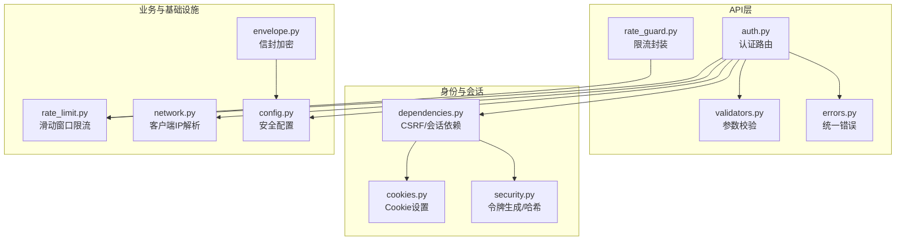
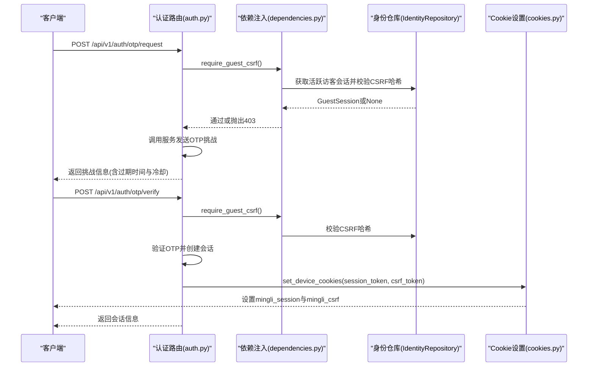
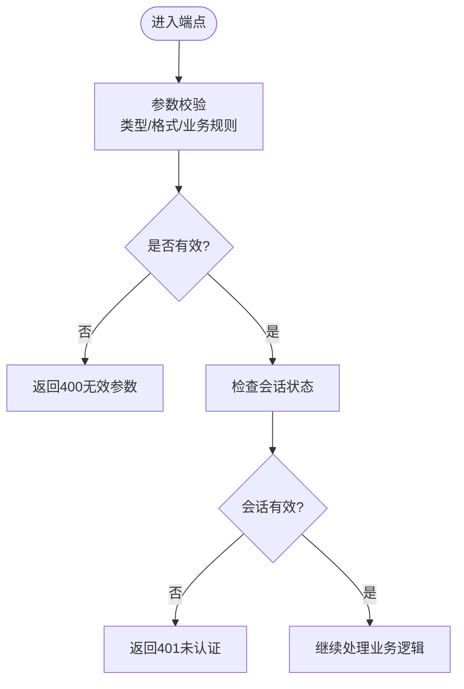
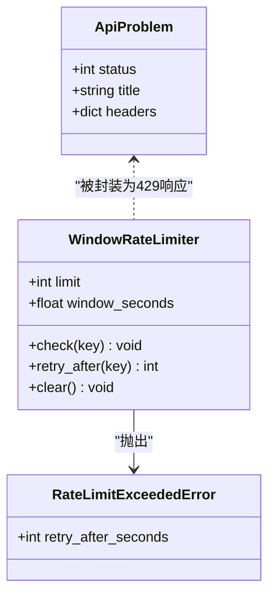
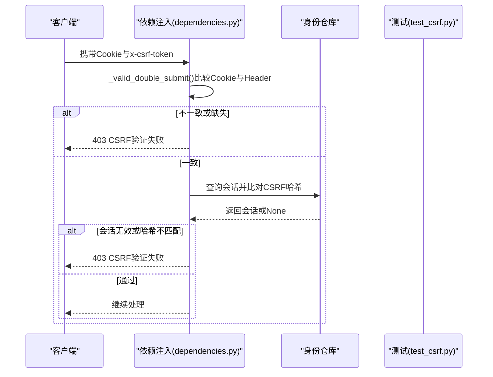
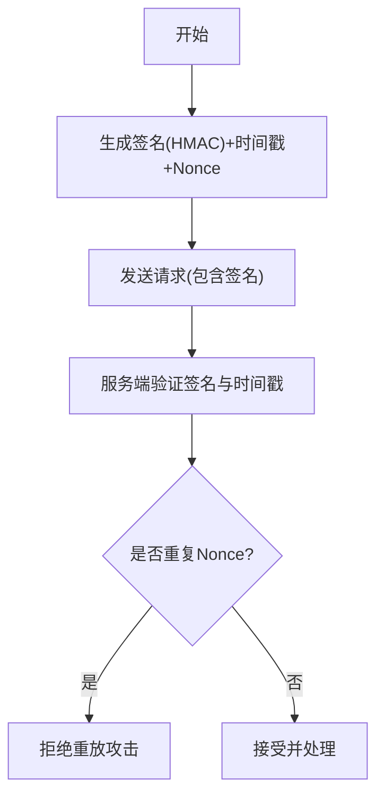
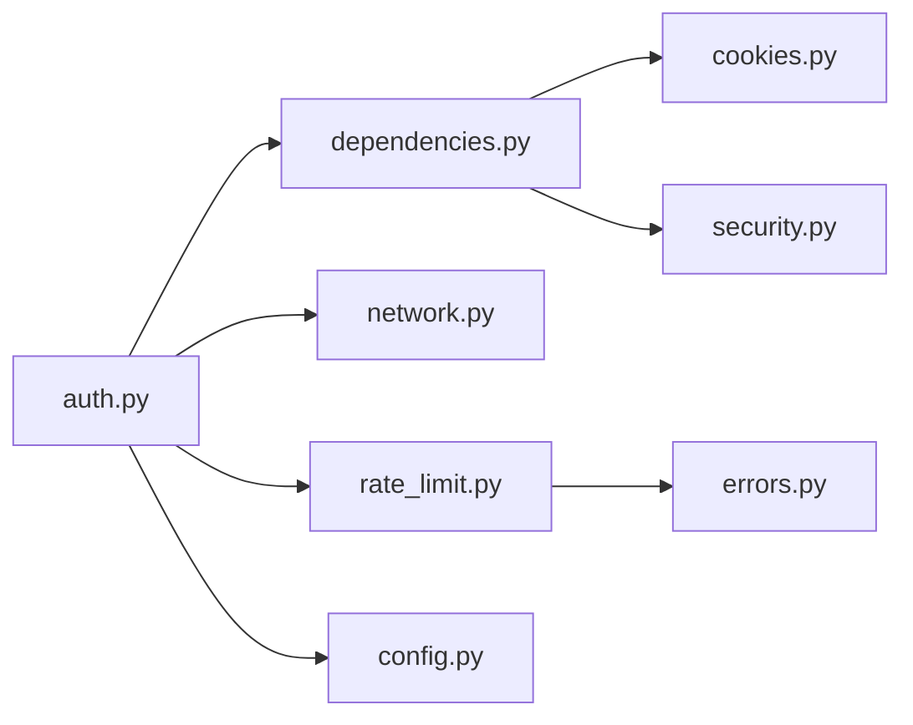

# API安全防护

<cite>
**本文引用的文件**
- [backend/app/api/rate_guard.py](file://backend/app/api/rate_guard.py)
- [backend/app/readings/rate_limit.py](file://backend/app/readings/rate_limit.py)
- [backend/app/api/validators.py](file://backend/app/api/validators.py)
- [backend/app/identity/security.py](file://backend/app/identity/security.py)
- [backend/tests/test_csrf.py](file://backend/tests/test_csrf.py)
- [backend/app/api/auth.py](file://backend/app/api/auth.py)
- [backend/app/identity/cookies.py](file://backend/app/identity/cookies.py)
- [backend/app/security/envelope.py](file://backend/app/security/envelope.py)
- [backend/app/api/dependencies.py](file://backend/app/api/dependencies.py)
- [backend/app/config.py](file://backend/app/config.py)
- [backend/app/network.py](file://backend/app/network.py)
- [backend/app/api/errors.py](file://backend/app/api/errors.py)
</cite>

## 目录
1. [简介](#简介)
2. [项目结构](#项目结构)
3. [核心组件](#核心组件)
4. [架构总览](#架构总览)
5. [详细组件分析](#详细组件分析)
6. [依赖关系分析](#依赖关系分析)
7. [性能考量](#性能考量)
8. [故障排查指南](#故障排查指南)
9. [结论](#结论)
10. [附录：配置与测试示例](#附录配置与测试示例)

## 简介
本文件面向API安全，系统化说明本项目在请求验证、速率限制、CSRF防护、XSS防护、API签名与内容加密、以及监控与威胁检测方面的实现与最佳实践。文档以代码为依据，提供可操作的配置建议与攻击模拟测试方法，帮助读者在生产环境中正确部署和加固API安全能力。

## 项目结构
后端采用模块化组织，安全相关能力分布在以下位置：
- 认证与会话：身份校验、Cookie设置、CSRF双提交校验
- 速率限制：滑动窗口限流器、端点级限流封装
- 输入校验：参数类型与格式校验（如IANA时区）
- 网络与IP解析：可信代理下的客户端IP解析
- 内容安全：AES-GCM信封加密与指纹校验
- 配置与安全策略：生产环境强制安全项、密钥与令牌管理
- 错误模型：统一的API问题响应

**图表来源**
- [backend/app/api/auth.py:30-161](file://backend/app/api/auth.py#L30-L161)
- [backend/app/api/dependencies.py:29-137](file://backend/app/api/dependencies.py#L29-L137)
- [backend/app/identity/cookies.py:12-102](file://backend/app/identity/cookies.py#L12-L102)
- [backend/app/readings/rate_limit.py:9-61](file://backend/app/readings/rate_limit.py#L9-L61)
- [backend/app/network.py:22-55](file://backend/app/network.py#L22-L55)
- [backend/app/security/envelope.py:32-122](file://backend/app/security/envelope.py#L32-L122)
- [backend/app/config.py:62-335](file://backend/app/config.py#L62-L335)

**章节来源**
- [backend/app/api/auth.py:30-161](file://backend/app/api/auth.py#L30-L161)
- [backend/app/api/dependencies.py:29-137](file://backend/app/api/dependencies.py#L29-L137)
- [backend/app/identity/cookies.py:12-102](file://backend/app/identity/cookies.py#L12-L102)
- [backend/app/readings/rate_limit.py:9-61](file://backend/app/readings/rate_limit.py#L9-L61)
- [backend/app/network.py:22-55](file://backend/app/network.py#L22-L55)
- [backend/app/security/envelope.py:32-122](file://backend/app/security/envelope.py#L32-L122)
- [backend/app/config.py:62-335](file://backend/app/config.py#L62-L335)

## 核心组件
- 请求验证机制
  - 参数类型与格式校验：例如IANA时区名称校验，确保传入值属于系统支持的时区集合。
  - 业务规则校验：通过Pydantic模型与自定义校验器组合，保证请求体满足业务约束。
- 速率限制
  - 滑动窗口限流器：按“键”统计时间窗口内的请求次数，超限返回429并附带Retry-After。
  - 端点级限流封装：将限流异常转换为标准API问题响应，便于前端重试。
- CSRF防护
  - 双提交模式：Cookie中的CSRF Token与请求头x-csrf-token必须一致且与服务器存储的哈希匹配。
  - 访客与会话分离：访客会话与设备会话分别进行CSRF校验，防止跨站伪造。
- XSS防护
  - 输出编码：服务端对敏感数据进行编码后再输出；前端渲染使用框架默认转义。
  - 内容安全策略：通过HTTP头部控制脚本加载与执行范围（见附录）。
- API签名与内容加密
  - 信封加密：使用AES-256-GCM对JSON或文本进行加密封装，附带指纹校验防篡改。
  - 令牌与哈希：生成不透明令牌并对令牌进行哈希存储，避免明文泄露。
- 配置与安全基线
  - 生产环境强制启用Secure Cookie、禁用不安全适配器、固定运行时路径等。
  - 严格校验密钥长度、有效期、超时上限等安全参数。

**章节来源**
- [backend/app/api/validators.py:4-10](file://backend/app/api/validators.py#L4-L10)
- [backend/app/readings/rate_limit.py:9-61](file://backend/app/readings/rate_limit.py#L9-L61)
- [backend/app/api/rate_guard.py:5-20](file://backend/app/api/rate_guard.py#L5-L20)
- [backend/app/api/dependencies.py:29-137](file://backend/app/api/dependencies.py#L29-L137)
- [backend/app/identity/security.py:5-11](file://backend/app/identity/security.py#L5-L11)
- [backend/app/security/envelope.py:32-122](file://backend/app/security/envelope.py#L32-L122)
- [backend/app/config.py:188-329](file://backend/app/config.py#L188-L329)

## 架构总览
下图展示认证流程中CSRF校验、会话建立与Cookie设置的交互顺序。

**图表来源**
- [backend/app/api/auth.py:44-138](file://backend/app/api/auth.py#L44-L138)
- [backend/app/api/dependencies.py:39-54](file://backend/app/api/dependencies.py#L39-L54)
- [backend/app/identity/cookies.py:63-89](file://backend/app/identity/cookies.py#L63-L89)

**章节来源**
- [backend/app/api/auth.py:44-138](file://backend/app/api/auth.py#L44-L138)
- [backend/app/api/dependencies.py:39-54](file://backend/app/api/dependencies.py#L39-L54)
- [backend/app/identity/cookies.py:63-89](file://backend/app/identity/cookies.py#L63-L89)

## 详细组件分析

### 请求验证机制
- 输入参数校验
  - IANA时区校验：仅接受系统已知的时区名称，未知时区直接拒绝。
  - Pydantic模型：用于结构化请求体，自动完成类型检查与基础格式验证。
- 业务规则验证
  - OTP渠道与目的地合法性：非法目的地直接返回400。
  - 会话状态校验：未登录或会话失效返回401；CSRF失败返回403。

**图表来源**
- [backend/app/api/validators.py:4-10](file://backend/app/api/validators.py#L4-L10)
- [backend/app/api/auth.py:51-88](file://backend/app/api/auth.py#L51-L88)
- [backend/app/api/auth.py:96-138](file://backend/app/api/auth.py#L96-L138)

**章节来源**
- [backend/app/api/validators.py:4-10](file://backend/app/api/validators.py#L4-L10)
- [backend/app/api/auth.py:51-88](file://backend/app/api/auth.py#L51-L88)
- [backend/app/api/auth.py:96-138](file://backend/app/api/auth.py#L96-L138)

### 速率限制实现
- IP级别限流
  - 通过可信代理网络解析真实客户端IP，结合滑动窗口对同一IP的请求进行计数与限制。
- 用户级别限流
  - 基于访客ID或设备会话ID作为键，限制写操作频率。
- API端点级别访问控制
  - 针对敏感端点（如OTP请求、读取写入）应用独立限流策略，超限返回429并附带Retry-After。

**图表来源**
- [backend/app/readings/rate_limit.py:9-61](file://backend/app/readings/rate_limit.py#L9-L61)
- [backend/app/api/rate_guard.py:5-20](file://backend/app/api/rate_guard.py#L5-L20)
- [backend/app/api/errors.py:1-17](file://backend/app/api/errors.py#L1-L17)

**章节来源**
- [backend/app/readings/rate_limit.py:9-61](file://backend/app/readings/rate_limit.py#L9-L61)
- [backend/app/api/rate_guard.py:5-20](file://backend/app/api/rate_guard.py#L5-L20)
- [backend/app/network.py:22-55](file://backend/app/network.py#L22-L55)

### CSRF防护措施
- 令牌验证
  - 双提交模式：Cookie中的CSRF Token与请求头x-csrf-token必须一致，并与服务器存储的哈希比对。
  - 访客与会话分离：require_guest_csrf与require_device_csrf分别校验不同会话上下文。
- 同源策略
  - Cookie设置SameSite=Lax，减少跨站携带风险。
- 跨域请求处理
  - 通过CORS策略与CSRF共同作用，确保跨站请求无法伪造关键操作。

**图表来源**
- [backend/app/api/dependencies.py:29-54](file://backend/app/api/dependencies.py#L29-L54)
- [backend/tests/test_csrf.py:4-55](file://backend/tests/test_csrf.py#L4-L55)

**章节来源**
- [backend/app/api/dependencies.py:29-54](file://backend/app/api/dependencies.py#L29-L54)
- [backend/tests/test_csrf.py:4-55](file://backend/tests/test_csrf.py#L4-L55)

### XSS防护策略
- 输出编码
  - 服务端对敏感字段进行编码后再输出；前端模板引擎默认转义渲染。
- 内容安全策略(CSP)
  - 通过HTTP响应头限制脚本来源与执行方式，降低注入风险。
- 脚本注入防护
  - 禁止内联脚本执行，仅允许受信任源；对富文本内容进行白名单过滤。

[本节为概念性说明，不直接分析具体文件]

### API签名验证与重放攻击防护
- 请求签名生成
  - 使用HMAC对请求体与上下文进行签名，确保完整性与来源可信。
- 时间戳验证
  - 在签名中包含时间戳，服务端校验时间窗口，拒绝过期请求。
- 重放攻击防护
  - 结合一次性Nonce与时间戳，服务端记录已使用的签名标识，防止重复提交。

**图表来源**
- [backend/app/security/envelope.py:32-122](file://backend/app/security/envelope.py#L32-L122)
- [backend/app/identity/security.py:5-11](file://backend/app/identity/security.py#L5-L11)

**章节来源**
- [backend/app/security/envelope.py:32-122](file://backend/app/security/envelope.py#L32-L122)
- [backend/app/identity/security.py:5-11](file://backend/app/identity/security.py#L5-L11)

## 依赖关系分析
- 组件耦合
  - 认证路由依赖CSRF与会话依赖，依赖注入模块负责Cookie与令牌校验。
  - 速率限制模块被端点封装调用，统一返回429与重试提示。
  - 网络模块提供稳定客户端IP解析，支撑IP级限流。
- 外部依赖
  - 数据库会话由依赖注入提供，事务失败回滚。
  - 配置模块集中管理安全参数，生产环境强制安全基线。

**图表来源**
- [backend/app/api/auth.py:30-161](file://backend/app/api/auth.py#L30-L161)
- [backend/app/api/dependencies.py:29-137](file://backend/app/api/dependencies.py#L29-L137)
- [backend/app/readings/rate_limit.py:9-61](file://backend/app/readings/rate_limit.py#L9-L61)
- [backend/app/network.py:22-55](file://backend/app/network.py#L22-L55)
- [backend/app/config.py:62-335](file://backend/app/config.py#L62-L335)

**章节来源**
- [backend/app/api/auth.py:30-161](file://backend/app/api/auth.py#L30-L161)
- [backend/app/api/dependencies.py:29-137](file://backend/app/api/dependencies.py#L29-L137)
- [backend/app/readings/rate_limit.py:9-61](file://backend/app/readings/rate_limit.py#L9-L61)
- [backend/app/network.py:22-55](file://backend/app/network.py#L22-L55)
- [backend/app/config.py:62-335](file://backend/app/config.py#L62-L335)

## 性能考量
- 滑动窗口限流使用双端队列维护最近请求时间戳，时间复杂度O(1)追加与清理，空间复杂度与窗口内请求数成正比。
- 客户端IP解析对X-Forwarded-For链进行长度限制与可信代理过滤，避免恶意构造导致性能退化。
- 信封加密使用AES-GCM，具备高效认证加密能力；指纹计算采用HMAC-SHA256，开销可控。
- 配置校验集中在启动阶段，避免运行时频繁检查带来的额外开销。

[本节为通用性能讨论，不直接分析具体文件]

## 故障排查指南
- CSRF验证失败
  - 现象：返回403，标题为“CSRF validation failed”。
  - 排查：确认Cookie中存在mingli_csrf，请求头x-csrf-token与之相同；检查会话是否过期或被撤销。
  - 参考测试用例：访客会话创建后使用正确CSRF Token可通过，旧会话注销后继续使用会被拒绝。
- 速率限制触发
  - 现象：返回429，附带Retry-After秒数。
  - 排查：检查当前键（IP/用户/端点）在窗口内的请求次数；调整限流阈值或增加窗口大小。
- 会话认证失败
  - 现象：返回401，标题为“Authentication required”或“Guest session required”。
  - 排查：确认Cookie中mingli_session或mingli_guest存在且未过期；检查服务器端会话是否有效。
- 内容解密失败
  - 现象：抛出信封解密错误，提示key id不可用或指纹不匹配。
  - 排查：确认使用正确的content_encryption_key与key_id；检查上下文(context)是否一致；确保密文未被篡改。

**章节来源**
- [backend/tests/test_csrf.py:4-55](file://backend/tests/test_csrf.py#L4-L55)
- [backend/app/api/rate_guard.py:5-20](file://backend/app/api/rate_guard.py#L5-L20)
- [backend/app/api/dependencies.py:72-84](file://backend/app/api/dependencies.py#L72-L84)
- [backend/app/security/envelope.py:75-96](file://backend/app/security/envelope.py#L75-L96)

## 结论
本项目在后端实现了较为完善的API安全体系：严格的请求验证、细粒度的速率限制、健壮的CSRF防护、安全的会话与令牌管理、以及内容级别的加密与完整性校验。配合生产环境的强制安全配置，能够有效抵御常见Web攻击。建议在网关层补充CORS与WAF策略，并在前端落实CSP与输出编码，形成端到端的安全闭环。

[本节为总结性内容，不直接分析具体文件]

## 附录：配置与测试示例
- 安全配置要点
  - 生产环境必须启用Secure Cookie，禁用Fake OTP与Runtime适配器。
  - 注入有效的content_encryption_key与identity_hash_key，避免使用本地默认值。
  - 设置trusted_proxy_cidrs以正确解析客户端IP。
  - 合理配置OTP冷却时间、尝试次数与窗口限制。
- 攻击模拟测试方法
  - CSRF攻击模拟：不带CSRF Token或携带错误Token发起敏感操作，预期返回403。
  - 重放攻击模拟：复用历史请求包（含签名与时间戳），预期因Nonce或时间戳过期被拒绝。
  - 速率限制压测：短时间内高频请求同一端点，预期返回429并遵循Retry-After。
  - XSS注入模拟：尝试在富文本中插入脚本标签，预期被过滤或转义，不会执行。

**章节来源**
- [backend/app/config.py:188-329](file://backend/app/config.py#L188-L329)
- [backend/tests/test_csrf.py:4-55](file://backend/tests/test_csrf.py#L4-L55)
- [backend/app/api/rate_guard.py:5-20](file://backend/app/api/rate_guard.py#L5-L20)
- [backend/app/security/envelope.py:32-122](file://backend/app/security/envelope.py#L32-L122)