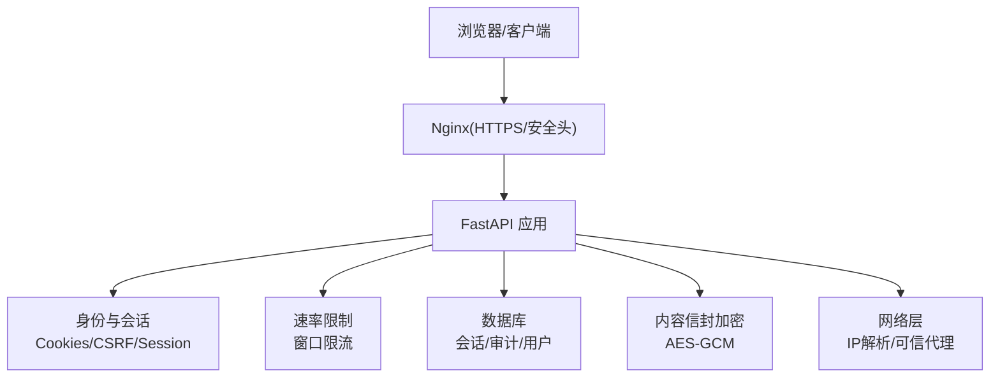
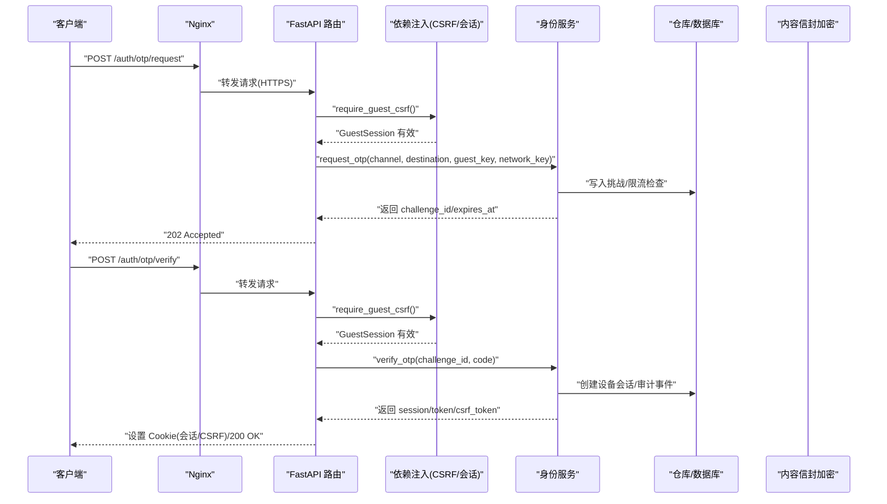
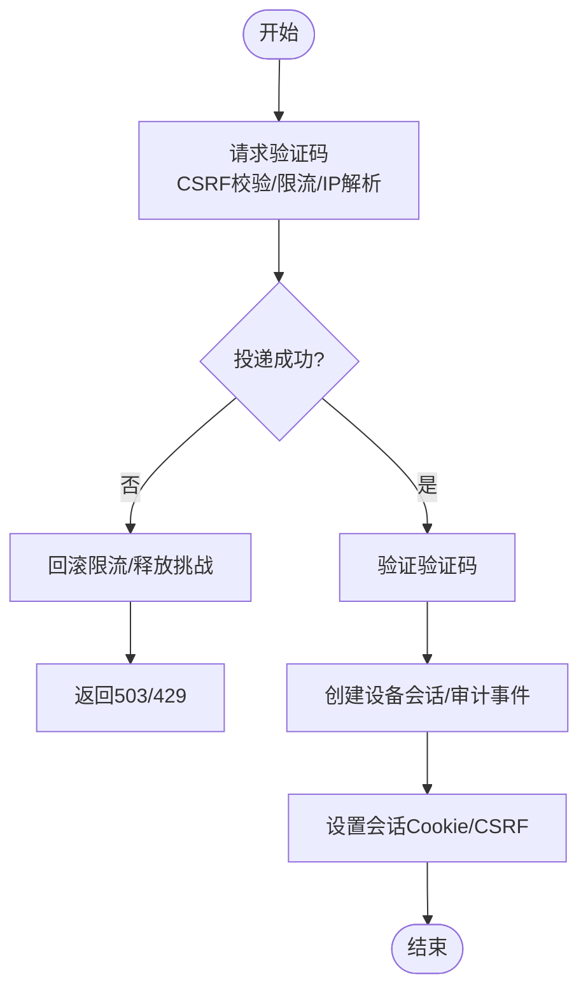
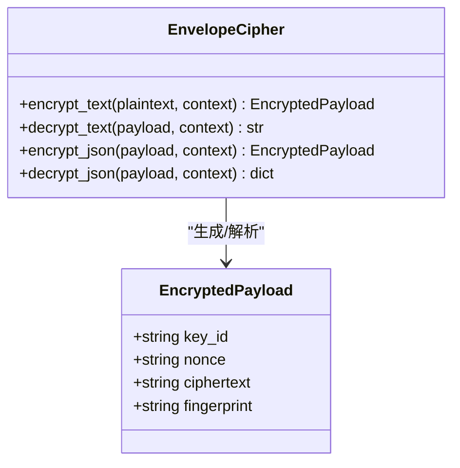
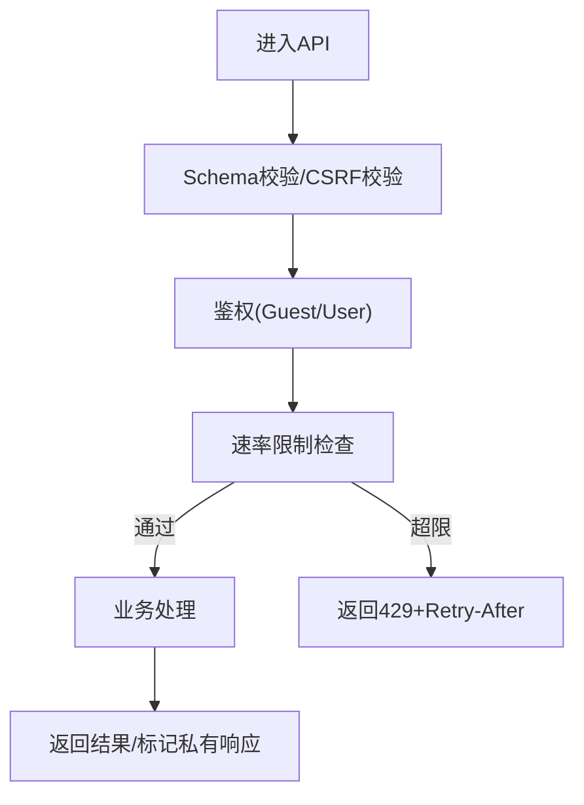
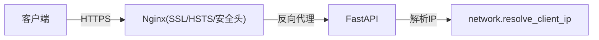
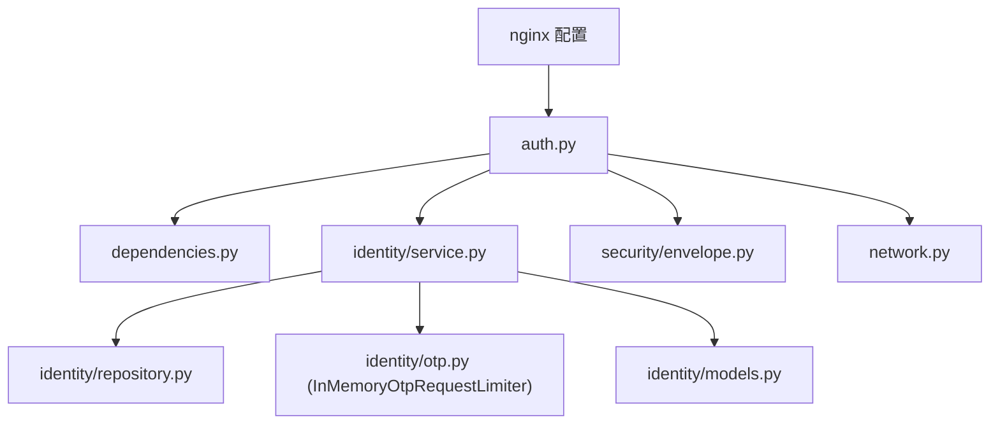

# 安全架构

<cite>
**本文引用的文件**
- [backend/app/identity/security.py](file://backend/app/identity/security.py)
- [backend/app/api/auth.py](file://backend/app/api/auth.py)
- [backend/app/api/dependencies.py](file://backend/app/api/dependencies.py)
- [backend/app/config.py](file://backend/app/config.py)
- [backend/app/network.py](file://backend/app/network.py)
- [backend/app/security/envelope.py](file://backend/app/security/envelope.py)
- [backend/app/identity/service.py](file://backend/app/identity/service.py)
- [backend/app/identity/models.py](file://backend/app/identity/models.py)
- [backend/app/admin/passwords.py](file://backend/app/admin/passwords.py)
- [infra/nginx/fateradar.conf](file://infra/nginx/fateradar.conf)
- [infra/nginx/fateradar-tls.conf](file://infra/nginx/fateradar-tls.conf)
</cite>

## 目录
1. [简介](#简介)
2. [项目结构](#项目结构)
3. [核心组件](#核心组件)
4. [架构总览](#架构总览)
5. [详细组件分析](#详细组件分析)
6. [依赖关系分析](#依赖关系分析)
7. [性能与安全权衡](#性能与安全权衡)
8. [故障排查指南](#故障排查指南)
9. [结论](#结论)
10. [附录：配置与最佳实践](#附录配置与最佳实践)

## 简介
本安全架构文档围绕 Mingli Web 项目的身份认证、授权、数据安全、API 防护、网络安全、审计合规以及威胁防护等方面，系统化梳理现有实现并给出可操作的安全配置建议。重点覆盖 OTP 登录流程、会话管理、权限控制、敏感数据加密、传输安全、存储安全、请求校验、速率限制、CSRF/XSS 防护、HTTPS 与反向代理策略、审计日志与隐私保护、常见注入与上传攻击防护、密钥轮换机制等。

## 项目结构
后端采用模块化设计，安全相关能力分布在以下位置：
- 身份与会话：identity（模型、服务、Cookie、OTP、安全工具）
- API 层：api（路由、依赖注入、限流、错误处理）
- 安全封装：security（内容信封加解密）
- 网络：network（可信代理与客户端 IP 解析）
- 配置：config（生产环境强制安全约束、密钥与开关）
- 基础设施：nginx（TLS、安全响应头、HTTP→HTTPS 重定向）

**图示来源**
- [infra/nginx/fateradar-tls.conf:56-84](file://infra/nginx/fateradar-tls.conf#L56-L84)
- [backend/app/api/auth.py:44-138](file://backend/app/api/auth.py#L44-L138)
- [backend/app/identity/models.py:68-132](file://backend/app/identity/models.py#L68-L132)
- [backend/app/security/envelope.py:32-122](file://backend/app/security/envelope.py#L32-L122)
- [backend/app/network.py:22-54](file://backend/app/network.py#L22-L54)

**章节来源**
- [infra/nginx/fateradar.conf:1-59](file://infra/nginx/fateradar.conf#L1-L59)
- [infra/nginx/fateradar-tls.conf:1-125](file://infra/nginx/fateradar-tls.conf#L1-L125)
- [backend/app/api/auth.py:1-161](file://backend/app/api/auth.py#L1-L161)
- [backend/app/identity/models.py:1-132](file://backend/app/identity/models.py#L1-L132)
- [backend/app/security/envelope.py:1-122](file://backend/app/security/envelope.py#L1-L122)
- [backend/app/network.py:1-72](file://backend/app/network.py#L1-L72)

## 核心组件
- 身份认证与会话
  - OTP 登录：请求验证码、验证并创建设备会话，设置 Cookie（会话令牌、CSRF 令牌），支持访客会话到正式用户的认领。
  - 会话管理：设备会话与访客会话的创建、校验、撤销；CSRF 双提交校验；Cookie 安全属性（HttpOnly、SameSite、Secure）。
  - 管理员密码：使用 scrypt 哈希与常量时间比较。
- 数据安全
  - 内容信封加密：AES-256-GCM + HMAC 指纹，带上下文绑定与密钥版本标识。
  - 配置级安全：生产环境强制 Secure Cookie、禁用模拟 OTP/运行时/模型适配器、固定路径与白名单、密钥不可复用。
- API 防护
  - 请求校验：Pydantic Schema、CSRF 双提交、Owner/Guest 鉴权依赖。
  - 速率限制：OTP 多层窗口限流（访客、网络、目的地）、写操作滑动窗口限流。
  - 错误统一：标准化问题对象与状态码。
- 网络安全
  - HTTPS：Nginx TLS 配置、HSTS、安全响应头、HTTP→HTTPS 重定向。
  - 可信代理：基于 CIDR 的可信代理网络解析真实客户端 IP。
- 审计与合规
  - 审计事件：登录、登出等关键动作记录，包含用户与会话上下文。
  - 隐私保护：私密响应头禁止缓存与索引。

**章节来源**
- [backend/app/identity/service.py:35-192](file://backend/app/identity/service.py#L35-L192)
- [backend/app/api/dependencies.py:29-137](file://backend/app/api/dependencies.py#L29-L137)
- [backend/app/admin/passwords.py:1-55](file://backend/app/admin/passwords.py#L1-L55)
- [backend/app/security/envelope.py:32-122](file://backend/app/security/envelope.py#L32-L122)
- [backend/app/config.py:188-329](file://backend/app/config.py#L188-L329)
- [infra/nginx/fateradar-tls.conf:56-124](file://infra/nginx/fateradar-tls.conf#L56-L124)
- [backend/app/network.py:22-54](file://backend/app/network.py#L22-L54)

## 架构总览
下图展示从客户端到后端的核心安全交互：Nginx 提供 HTTPS 与安全头，FastAPI 通过依赖注入完成 CSRF 校验与会话识别，身份服务处理 OTP 流程并持久化会话与审计事件，内容信封用于敏感数据加解密，网络模块确保在可信代理后正确解析客户端 IP。

**图示来源**
- [backend/app/api/auth.py:44-138](file://backend/app/api/auth.py#L44-L138)
- [backend/app/api/dependencies.py:39-54](file://backend/app/api/dependencies.py#L39-L54)
- [backend/app/identity/service.py:100-192](file://backend/app/identity/service.py#L100-L192)
- [infra/nginx/fateradar-tls.conf:56-84](file://infra/nginx/fateradar-tls.conf#L56-L84)

## 详细组件分析

### 身份认证与会话管理
- OTP 登录流程
  - 请求验证码：校验访客 CSRF，解析真实客户端 IP，进行多层限流（访客、网络、目的地），生成一次性挑战并投递。
  - 验证验证码：校验挑战与代码，解析或创建用户与登录身份，创建设备会话（令牌与 CSRF 令牌），记录审计事件，设置 Cookie。
  - 登出：撤销设备会话，记录审计事件，清理 Cookie。
- 会话与 CSRF
  - 访客与会话 Cookie：HttpOnly 保护会话 Cookie，CSRF Cookie 与请求头双提交校验，SameSite=Lax，Secure 在生产启用。
  - 依赖注入：require_guest_session、require_device_session、require_owner、require_guest_csrf、require_device_csrf、require_owner_csrf。
- 管理员密码
  - 使用 scrypt 参数化哈希，最小长度校验，常量时间比较防止时序攻击。

**图示来源**
- [backend/app/api/auth.py:44-138](file://backend/app/api/auth.py#L44-L138)
- [backend/app/identity/service.py:100-192](file://backend/app/identity/service.py#L100-L192)
- [backend/app/api/dependencies.py:39-137](file://backend/app/api/dependencies.py#L39-L137)
- [backend/app/network.py:22-54](file://backend/app/network.py#L22-L54)

**章节来源**
- [backend/app/api/auth.py:44-161](file://backend/app/api/auth.py#L44-L161)
- [backend/app/identity/service.py:35-192](file://backend/app/identity/service.py#L35-L192)
- [backend/app/identity/models.py:68-132](file://backend/app/identity/models.py#L68-L132)
- [backend/app/admin/passwords.py:16-55](file://backend/app/admin/passwords.py#L16-L55)

### 数据安全与存储
- 内容信封加密
  - AES-256-GCM 对称加密，带随机 nonce 与附加数据（context）绑定，输出包含 key_id、nonce、ciphertext、fingerprint。
  - 解密时校验 key_id、标签与指纹，失败抛出专用异常。
  - JSON 明文序列化前排序键与压缩分隔符，保证确定性。
- 配置级安全约束
  - 生产环境强制 Secure Cookie、禁用 fake 适配器、固定运行路径与白名单、密钥不可复用、模型参数冻结。
  - 内容加密密钥必须为有效的 32 字节 Base64，且不得与身份哈希密钥相同。
- 会话与审计存储
  - 会话表：设备会话与访客会话均仅存储令牌哈希与 CSRF 哈希，避免明文存储。
  - 审计事件：记录用户、会话、动作与元数据，便于追踪与合规。

**图示来源**
- [backend/app/security/envelope.py:32-122](file://backend/app/security/envelope.py#L32-L122)

**章节来源**
- [backend/app/security/envelope.py:1-122](file://backend/app/security/envelope.py#L1-L122)
- [backend/app/config.py:188-329](file://backend/app/config.py#L188-L329)
- [backend/app/identity/models.py:68-132](file://backend/app/identity/models.py#L68-L132)

### API 安全防护
- 请求校验与鉴权
  - Pydantic Schema 校验输入，依赖注入实现 Guest/User 鉴权与 CSRF 校验。
  - 私有响应标记：禁止缓存与索引，防止敏感信息泄露。
- 速率限制
  - OTP 多层窗口限流：按访客、网络、目的地维度限制，支持回滚投递失败。
  - 写操作滑动窗口限流：按拥有者维度限制，返回 Retry-After。
- 错误处理
  - 统一 ApiProblem 返回，携带状态码与标题，便于前端与网关处理。

**图示来源**
- [backend/app/api/dependencies.py:29-137](file://backend/app/api/dependencies.py#L29-L137)
- [backend/app/readings/rate_limit.py:9-60](file://backend/app/readings/rate_limit.py#L9-L60)
- [backend/app/api/rate_guard.py:5-20](file://backend/app/api/rate_guard.py#L5-L20)

**章节来源**
- [backend/app/api/dependencies.py:29-137](file://backend/app/api/dependencies.py#L29-L137)
- [backend/app/readings/rate_limit.py:1-60](file://backend/app/readings/rate_limit.py#L1-L60)
- [backend/app/api/rate_guard.py:1-20](file://backend/app/api/rate_guard.py#L1-L20)

### 网络安全与传输安全
- HTTPS 与 HSTS
  - Nginx 监听 443 SSL，配置证书与 DH 参数，设置 HSTS 与安全响应头。
  - HTTP 站点重定向至 HTTPS，阻止明文访问。
- 安全响应头
  - X-Content-Type-Options、X-Frame-Options、Referrer-Policy、Permissions-Policy 等头部增强安全性。
- 可信代理与 IP 解析
  - 基于 trusted_proxy_cidrs 解析真实客户端 IP，防止伪造 X-Forwarded-For 绕过限流。

**图示来源**
- [infra/nginx/fateradar-tls.conf:56-124](file://infra/nginx/fateradar-tls.conf#L56-L124)
- [infra/nginx/fateradar.conf:1-59](file://infra/nginx/fateradar.conf#L1-L59)
- [backend/app/network.py:22-54](file://backend/app/network.py#L22-L54)

**章节来源**
- [infra/nginx/fateradar-tls.conf:1-125](file://infra/nginx/fateradar-tls.conf#L1-L125)
- [infra/nginx/fateradar.conf:1-59](file://infra/nginx/fateradar.conf#L1-L59)
- [backend/app/network.py:1-72](file://backend/app/network.py#L1-L72)

### 审计与合规性
- 审计事件
  - 登录、登出等关键动作记录，包含用户 ID、会话 ID、动作类型与元数据。
- 隐私保护
  - 私有响应头禁止缓存与索引，防止敏感数据被中间节点或搜索引擎缓存。
- 合规约束
  - 生产环境强制安全配置，如 Secure Cookie、禁用模拟适配器、固定路径与白名单。

**章节来源**
- [backend/app/identity/models.py:113-132](file://backend/app/identity/models.py#L113-L132)
- [backend/app/api/dependencies.py:133-137](file://backend/app/api/dependencies.py#L133-L137)
- [backend/app/config.py:188-329](file://backend/app/config.py#L188-L329)

### 安全威胁防护措施
- SQL 注入
  - 使用 SQLAlchemy ORM 与异步会话，避免拼接 SQL 字符串，降低注入风险。
- 命令注入
  - 生产环境固定运行器与 Python 路径，禁止动态拼接命令；严格参数校验与白名单。
- 文件上传攻击
  - 当前未见通用上传入口；若引入上传功能，应限制类型、大小、扫描恶意文件并存储于隔离目录。
- XSS 防护
  - 前端框架默认转义；Nginx 设置 X-Content-Type-Options 与 Referrer-Policy 减少脚本执行面。
- CSRF 防护
  - 双提交模式：Cookie 中的 CSRF Token 与请求头一致；服务端使用常量时间比较。
- 速率限制与暴力破解
  - OTP 多层窗口限流与写操作滑动窗口限流，防止暴力尝试与资源耗尽。

[本节为概念性说明，不直接分析具体文件]

## 依赖关系分析
- 组件耦合
  - API 路由依赖身份服务与依赖注入，身份服务依赖仓库与限流器，仓库依赖数据库。
  - 内容信封加密独立于业务逻辑，通过配置注入密钥与版本。
  - 网络模块解耦于代理配置，支持多网段可信代理。
- 外部依赖
  - Nginx 作为边缘网关提供 TLS 与安全头。
  - 数据库存储会话、审计与用户数据。
  - 可选 SMTP 适配器用于 OTP 投递（生产需持久化挑战存储）。

**图示来源**
- [backend/app/api/auth.py:1-161](file://backend/app/api/auth.py#L1-L161)
- [backend/app/api/dependencies.py:1-137](file://backend/app/api/dependencies.py#L1-L137)
- [backend/app/identity/service.py:1-192](file://backend/app/identity/service.py#L1-L192)
- [backend/app/identity/models.py:1-132](file://backend/app/identity/models.py#L1-L132)
- [backend/app/security/envelope.py:1-122](file://backend/app/security/envelope.py#L1-L122)
- [backend/app/network.py:1-72](file://backend/app/network.py#L1-L72)
- [infra/nginx/fateradar-tls.conf:1-125](file://infra/nginx/fateradar-tls.conf#L1-L125)

**章节来源**
- [backend/app/api/auth.py:1-161](file://backend/app/api/auth.py#L1-L161)
- [backend/app/api/dependencies.py:1-137](file://backend/app/api/dependencies.py#L1-L137)
- [backend/app/identity/service.py:1-192](file://backend/app/identity/service.py#L1-L192)
- [backend/app/identity/models.py:1-132](file://backend/app/identity/models.py#L1-L132)
- [backend/app/security/envelope.py:1-122](file://backend/app/security/envelope.py#L1-L122)
- [backend/app/network.py:1-72](file://backend/app/network.py#L1-L72)
- [infra/nginx/fateradar-tls.conf:1-125](file://infra/nginx/fateradar-tls.conf#L1-L125)

## 性能与安全权衡
- 速率限制
  - OTP 多层窗口限流平衡用户体验与防滥用；写操作滑动窗口限流保护后端资源。
- 会话生命周期
  - 设备会话天数与访客会话时长影响安全性与便利性；生产建议较短有效期与定期刷新。
- 加密开销
  - AES-GCM 加解密成本可控；指纹校验增加安全性但带来额外计算。
- 代理与 IP 解析
  - 可信代理网络配置需精确，避免误判导致限流失效或误封禁。

[本节提供一般性指导，不直接分析具体文件]

## 故障排查指南
- CSRF 校验失败
  - 检查 Cookie 与请求头是否同时存在且一致；确认 SameSite 与 Secure 配置。
- 会话无效
  - 检查会话是否过期或被撤销；确认令牌哈希匹配。
- 速率限制触发
  - 查看访客、网络、目的地维度限制；确认 IP 解析是否正确。
- 内容解密失败
  - 检查 key_id 是否匹配；确认上下文与指纹一致；排查密钥注入。
- 生产环境启动失败
  - 检查 Secure Cookie、禁用 fake 适配器、固定路径与白名单、密钥注入。

**章节来源**
- [backend/app/api/dependencies.py:29-137](file://backend/app/api/dependencies.py#L29-L137)
- [backend/app/identity/service.py:100-192](file://backend/app/identity/service.py#L100-L192)
- [backend/app/security/envelope.py:75-96](file://backend/app/security/envelope.py#L75-L96)
- [backend/app/config.py:188-329](file://backend/app/config.py#L188-L329)

## 结论
Mingli Web 项目在身份认证、会话管理、数据安全、API 防护、网络安全与审计方面具备较为完善的安全基础。通过 OTP 登录、CSRF 双提交、多层速率限制、内容信封加密、HTTPS 与安全头、可信代理 IP 解析与审计事件记录，有效降低了常见安全风险。建议在后续迭代中持续强化密钥轮换、上传安全与前端 XSS 防护，并完善监控告警与合规报告。

[本节为总结性内容，不直接分析具体文件]

## 附录：配置与最佳实践
- 环境变量与密钥
  - MINGLI_COOKIE_SECURE：生产环境必须启用。
  - MINGLI_OTP_ADAPTER：生产环境禁用 fake。
  - MINGLI_CONTENT_ENCRYPTION_KEY_B64：32 字节 Base64 密钥，不得与身份哈希密钥相同。
  - MINGLI_TRUSTED_PROXY_CIDRS：配置可信代理网段，确保 IP 解析准确。
- Nginx 安全头
  - 设置 X-Content-Type-Options、X-Frame-Options、Referrer-Policy、Permissions-Policy。
  - 启用 HSTS 与 HTTP→HTTPS 重定向。
- 会话与 CSRF
  - 会话 Cookie 设置 HttpOnly、SameSite=Lax、Secure（生产）。
  - CSRF 双提交：Cookie 与请求头一致，服务端常量时间比较。
- 速率限制
  - OTP 多层窗口限流：访客、网络、目的地维度。
  - 写操作滑动窗口限流：按拥有者维度限制，返回 Retry-After。
- 审计与隐私
  - 记录登录、登出等关键动作。
  - 私有响应头禁止缓存与索引。

**章节来源**
- [backend/app/config.py:62-149](file://backend/app/config.py#L62-L149)
- [backend/app/config.py:188-329](file://backend/app/config.py#L188-L329)
- [infra/nginx/fateradar-tls.conf:56-124](file://infra/nginx/fateradar-tls.conf#L56-L124)
- [backend/app/identity/cookies.py:12-102](file://backend/app/identity/cookies.py#L12-L102)
- [backend/app/api/dependencies.py:29-137](file://backend/app/api/dependencies.py#L29-L137)
- [backend/app/readings/rate_limit.py:9-60](file://backend/app/readings/rate_limit.py#L9-L60)
- [backend/app/identity/models.py:113-132](file://backend/app/identity/models.py#L113-L132)