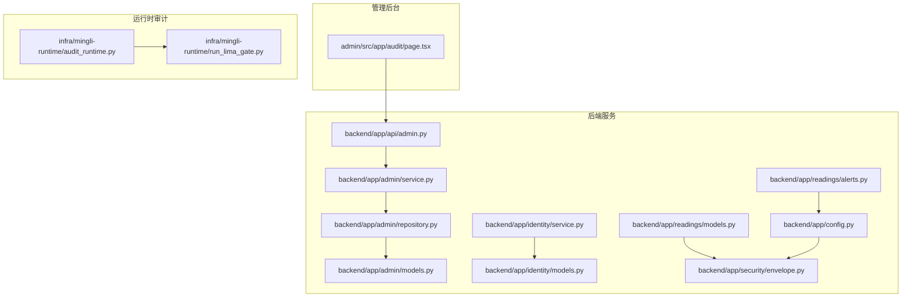
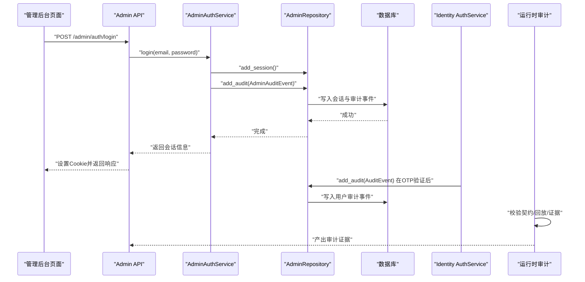
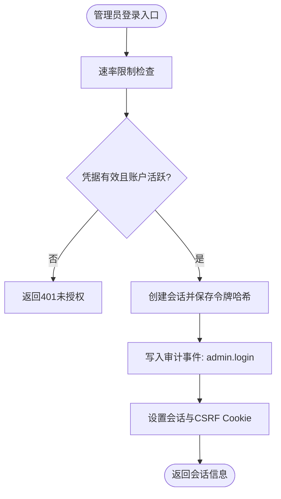
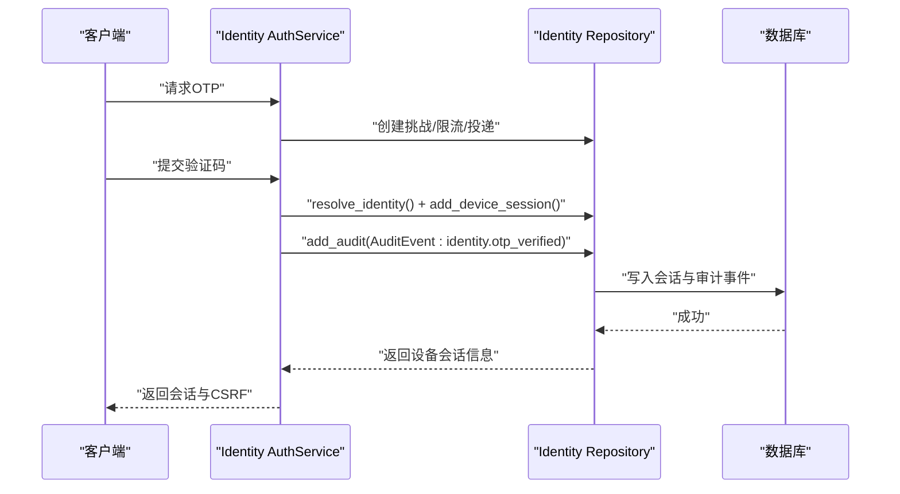
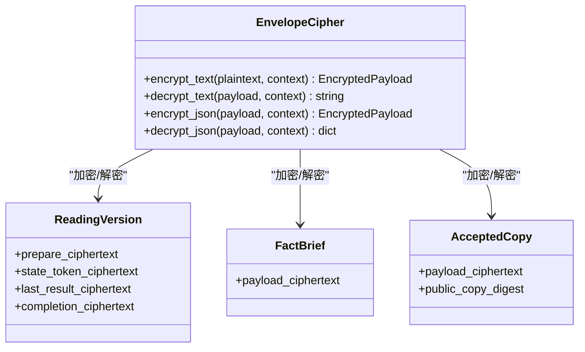
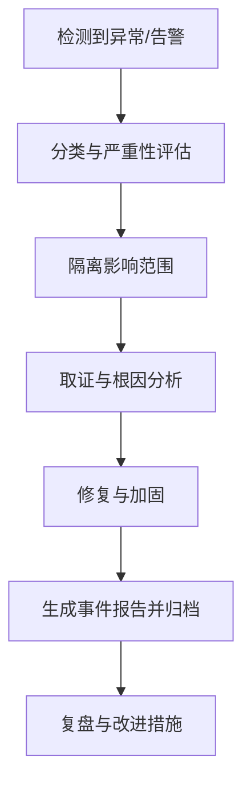
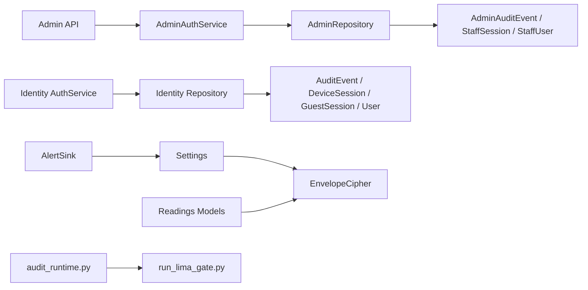

# 审计与合规性

<cite>
**本文引用的文件**
- [backend/app/admin/models.py](file://backend/app/admin/models.py)
- [backend/app/admin/service.py](file://backend/app/admin/service.py)
- [backend/app/admin/repository.py](file://backend/app/admin/repository.py)
- [backend/app/api/admin.py](file://backend/app/api/admin.py)
- [backend/app/identity/models.py](file://backend/app/identity/models.py)
- [backend/app/identity/service.py](file://backend/app/identity/service.py)
- [backend/app/readings/models.py](file://backend/app/readings/models.py)
- [backend/app/security/envelope.py](file://backend/app/security/envelope.py)
- [backend/app/config.py](file://backend/app/config.py)
- [backend/app/readings/alerts.py](file://backend/app/readings/alerts.py)
- [admin/src/app/audit/page.tsx](file://admin/src/app/audit/page.tsx)
- [web/src/app/privacy/page.tsx](file://web/src/app/privacy/page.tsx)
- [infra/mingli-runtime/audit_runtime.py](file://infra/mingli-runtime/audit_runtime.py)
- [infra/mingli-runtime/run_lima_gate.py](file://infra/mingli-runtime/run_lima_gate.py)
</cite>

## 目录
1. [简介](#简介)
2. [项目结构](#项目结构)
3. [核心组件](#核心组件)
4. [架构总览](#架构总览)
5. [详细组件分析](#详细组件分析)
6. [依赖关系分析](#依赖关系分析)
7. [性能考虑](#性能考虑)
8. [故障排查指南](#故障排查指南)
9. [结论](#结论)
10. [附录](#附录)

## 简介
本文件面向审计与合规，覆盖操作审计、数据访问审计、隐私保护、合规要求与安全事件响应。基于代码库中的管理员审计事件、用户身份审计事件、运行时审计流水线、敏感数据加密与配置校验等实现，提供可操作的审计配置示例与合规检查清单，并给出审计报告生成与合规评估工具的使用说明。

## 项目结构
本项目在后端通过数据库持久化两类审计事件：
- 管理员审计事件（staff/admin）：记录管理后台登录、登出、初始化等关键行为。
- 用户身份审计事件（identity）：记录设备会话创建、OTP 验证等关键行为。

同时，后端对敏感内容采用信封加密，并通过严格的配置校验确保生产环境安全基线；前端提供“审计日志”页面占位，等待接入审计事件查询接口。

图表来源
- [admin/src/app/audit/page.tsx:1-13](file://admin/src/app/audit/page.tsx#L1-L13)
- [backend/app/api/admin.py:1-200](file://backend/app/api/admin.py#L1-L200)
- [backend/app/admin/service.py:1-148](file://backend/app/admin/service.py#L1-L148)
- [backend/app/admin/repository.py:1-57](file://backend/app/admin/repository.py#L1-L57)
- [backend/app/admin/models.py:1-81](file://backend/app/admin/models.py#L1-L81)
- [backend/app/identity/service.py:1-192](file://backend/app/identity/service.py#L1-L192)
- [backend/app/identity/models.py:1-132](file://backend/app/identity/models.py#L1-L132)
- [backend/app/readings/models.py:1-378](file://backend/app/readings/models.py#L1-L378)
- [backend/app/security/envelope.py:1-122](file://backend/app/security/envelope.py#L1-L122)
- [backend/app/config.py:1-335](file://backend/app/config.py#L1-L335)
- [backend/app/readings/alerts.py:48-81](file://backend/app/readings/alerts.py#L48-L81)
- [infra/mingli-runtime/audit_runtime.py:145-175](file://infra/mingli-runtime/audit_runtime.py#L145-L175)
- [infra/mingli-runtime/run_lima_gate.py:1776-1809](file://infra/mingli-runtime/run_lima_gate.py#L1776-L1809)

章节来源
- [backend/app/admin/models.py:1-81](file://backend/app/admin/models.py#L1-L81)
- [backend/app/identity/models.py:1-132](file://backend/app/identity/models.py#L1-L132)
- [backend/app/readings/models.py:1-378](file://backend/app/readings/models.py#L1-L378)
- [backend/app/security/envelope.py:1-122](file://backend/app/security/envelope.py#L1-L122)
- [backend/app/config.py:1-335](file://backend/app/config.py#L1-L335)
- [admin/src/app/audit/page.tsx:1-13](file://admin/src/app/audit/page.tsx#L1-L13)

## 核心组件
- 管理员审计事件模型与会话模型：用于记录管理后台的登录、登出、初始化等行为，关联会话标识与操作元数据。
- 用户身份审计事件模型：用于记录用户侧的关键认证行为（如 OTP 验证），关联用户与会话。
- 管理员认证服务：在登录、登出、初始化时写入审计事件，并维护会话生命周期。
- 用户认证服务：在 OTP 验证成功后写入审计事件。
- 敏感数据信封加密：为读取结果、事实简报等敏感载荷提供带指纹的 AEAD 加密与上下文绑定。
- 配置安全校验：在生产环境强制启用安全 Cookie、禁用测试适配器、固定运行时路径与白名单模型参数。
- 告警输出：将安全/异常事件以结构化日志形式输出，便于集中收集与分析。
- 运行时审计流水线：对运行时的契约、回放、证据进行完整性校验，形成可审计证据链。

章节来源
- [backend/app/admin/models.py:17-81](file://backend/app/admin/models.py#L17-L81)
- [backend/app/identity/models.py:31-132](file://backend/app/identity/models.py#L31-L132)
- [backend/app/admin/service.py:33-129](file://backend/app/admin/service.py#L33-L129)
- [backend/app/identity/service.py:78-192](file://backend/app/identity/service.py#L78-L192)
- [backend/app/security/envelope.py:24-122](file://backend/app/security/envelope.py#L24-L122)
- [backend/app/config.py:62-335](file://backend/app/config.py#L62-L335)
- [backend/app/readings/alerts.py:48-81](file://backend/app/readings/alerts.py#L48-L81)
- [infra/mingli-runtime/audit_runtime.py:145-175](file://infra/mingli-runtime/audit_runtime.py#L145-L175)

## 架构总览
下图展示了从请求到审计落盘与运行时审计证据生成的端到端流程。

图表来源
- [backend/app/api/admin.py:103-163](file://backend/app/api/admin.py#L103-L163)
- [backend/app/admin/service.py:49-129](file://backend/app/admin/service.py#L49-L129)
- [backend/app/admin/repository.py:33-40](file://backend/app/admin/repository.py#L33-L40)
- [backend/app/identity/service.py:153-192](file://backend/app/identity/service.py#L153-L192)
- [infra/mingli-runtime/audit_runtime.py:145-175](file://infra/mingli-runtime/audit_runtime.py#L145-L175)

## 详细组件分析

### 管理员操作审计
- 登录流程：校验速率限制、验证凭据、创建会话、更新最后登录时间、写入审计事件（包含角色）。
- 登出流程：撤销会话、写入审计事件。
- 初始化流程：在允许的环境下创建首个超级管理员并记录审计事件。
- 会话校验：通过 Cookie 中的令牌哈希查找有效会话，校验状态与过期时间，并刷新最后访问时间。
- CSRF 校验：比较 Cookie 与请求头中的 CSRF Token，并与服务端存储的哈希比对。

图表来源
- [backend/app/api/admin.py:56-100](file://backend/app/api/admin.py#L56-L100)
- [backend/app/api/admin.py:103-163](file://backend/app/api/admin.py#L103-L163)
- [backend/app/admin/service.py:49-101](file://backend/app/admin/service.py#L49-L101)
- [backend/app/admin/repository.py:42-57](file://backend/app/admin/repository.py#L42-L57)

章节来源
- [backend/app/api/admin.py:68-100](file://backend/app/api/admin.py#L68-L100)
- [backend/app/api/admin.py:103-163](file://backend/app/api/admin.py#L103-L163)
- [backend/app/admin/service.py:49-129](file://backend/app/admin/service.py#L49-L129)
- [backend/app/admin/repository.py:18-57](file://backend/app/admin/repository.py#L18-L57)
- [backend/app/admin/models.py:17-81](file://backend/app/admin/models.py#L17-L81)

### 用户行为审计
- OTP 验证码流程：生成挑战、限流、投递、验证成功后创建设备会话并写入审计事件（包含渠道信息）。
- 访客会话：创建短期访客会话并设置 CSRF Token，用于无账号体验。
- 审计事件字段：用户 ID、会话 ID、动作类型、事件元数据、时间戳。

图表来源
- [backend/app/identity/service.py:100-192](file://backend/app/identity/service.py#L100-L192)
- [backend/app/identity/models.py:68-132](file://backend/app/identity/models.py#L68-L132)

章节来源
- [backend/app/identity/service.py:100-192](file://backend/app/identity/service.py#L100-L192)
- [backend/app/identity/models.py:68-132](file://backend/app/identity/models.py#L68-L132)

### 数据访问审计与敏感数据处理
- 敏感数据加密：使用 AES-GCM 对读取结果、事实简报、接受副本等进行信封加密，附带指纹与上下文绑定，防止篡改与越域解密。
- 不可变记录：对关键业务记录（如发布版本、事实简报、生成尝试、接受副本）实施追加-only 约束，禁止更新。
- 审计事件：所有关键数据访问与变更均通过审计事件记录，包括动作类型、元数据与时间戳。

图表来源
- [backend/app/security/envelope.py:24-122](file://backend/app/security/envelope.py#L24-L122)
- [backend/app/readings/models.py:84-245](file://backend/app/readings/models.py#L84-L245)

章节来源
- [backend/app/security/envelope.py:24-122](file://backend/app/security/envelope.py#L24-L122)
- [backend/app/readings/models.py:84-245](file://backend/app/readings/models.py#L84-L245)
- [backend/app/readings/models.py:370-378](file://backend/app/readings/models.py#L370-L378)

### 隐私保护措施
- 个人信息保护：浏览器仅使用 HttpOnly Cookie 保存短期游客关系与可撤销设备会话；不将正式令牌、完整报告或长期出生资料存入 localStorage。
- 数据最小化：默认只发送本次成稿需要的事实简报和问题，避免向模型供应商发送手机号、邮箱、订单信息等无关数据。
- 日志与监控：普通日志不包含 OTP、Cookie、完整出生资料、问题正文、报告或模型密钥。
- 用户权利：正式账户区提供访问、导出、更正与删除入口，支持撤回非必要同意与撤销其他设备。

章节来源
- [web/src/app/privacy/page.tsx:11-47](file://web/src/app/privacy/page.tsx#L11-L47)

### 合规性要求
- GDPR 相关实践：
  - 数据最小化与目的限定：仅传输必要数据至模型供应商。
  - 用户权利：提供访问、导出、更正、删除与同意撤回能力。
  - 审计与可追溯：关键操作与数据访问均有审计事件记录。
- 数据本地化：生产环境固定运行时路径与状态根目录，限制外部调用与执行环境。
- 行业监管标准：
  - 生产环境强制安全 Cookie、禁用测试适配器。
  - 固定 P0 模型提供商、模型 ID、端点路径与思考模式，限制超时与响应大小。
  - 运行时发布物需匹配冻结的清单摘要与能力形状摘要。

章节来源
- [backend/app/config.py:188-329](file://backend/app/config.py#L188-L329)

### 安全事件响应
- 入侵检测与威胁分析：
  - 登录速率限制与 OTP 请求限流，防止暴力破解与滥用。
  - 会话令牌与 CSRF Token 哈希存储与严格校验，降低会话劫持风险。
  - 告警输出：将安全事件以结构化日志输出，便于集中收集与告警。
- 事件报告流程：
  - 告警 sink 根据配置启用或禁用，生产环境建议启用结构化日志输出。
  - 运行时审计流水线对契约、回放与证据进行校验，发现不一致即失败。

图表来源
- [backend/app/readings/alerts.py:48-81](file://backend/app/readings/alerts.py#L48-L81)
- [infra/mingli-runtime/audit_runtime.py:145-175](file://infra/mingli-runtime/audit_runtime.py#L145-L175)

章节来源
- [backend/app/readings/alerts.py:48-81](file://backend/app/readings/alerts.py#L48-L81)
- [infra/mingli-runtime/audit_runtime.py:145-175](file://infra/mingli-runtime/audit_runtime.py#L145-L175)

## 依赖关系分析
- 管理员模块依赖：API 层依赖认证服务，认证服务依赖仓库与模型，仓库直接操作数据库。
- 身份模块依赖：认证服务依赖仓库与 OTP 通道，最终写入审计事件。
- 安全与配置：安全模块依赖配置提供的密钥与策略，配置在生产环境强制执行多项安全基线。
- 运行时审计：审计脚本通过容器挂载只读输入与可写输出，保证审计过程的可重复性与可验证性。

图表来源
- [backend/app/api/admin.py:1-200](file://backend/app/api/admin.py#L1-L200)
- [backend/app/admin/service.py:1-148](file://backend/app/admin/service.py#L1-L148)
- [backend/app/admin/repository.py:1-57](file://backend/app/admin/repository.py#L1-L57)
- [backend/app/admin/models.py:1-81](file://backend/app/admin/models.py#L1-L81)
- [backend/app/identity/service.py:1-192](file://backend/app/identity/service.py#L1-L192)
- [backend/app/identity/models.py:1-132](file://backend/app/identity/models.py#L1-L132)
- [backend/app/security/envelope.py:1-122](file://backend/app/security/envelope.py#L1-L122)
- [backend/app/config.py:1-335](file://backend/app/config.py#L1-L335)
- [backend/app/readings/alerts.py:48-81](file://backend/app/readings/alerts.py#L48-L81)
- [infra/mingli-runtime/audit_runtime.py:145-175](file://infra/mingli-runtime/audit_runtime.py#L145-L175)
- [infra/mingli-runtime/run_lima_gate.py:1776-1809](file://infra/mingli-runtime/run_lima_gate.py#L1776-L1809)

章节来源
- [backend/app/api/admin.py:1-200](file://backend/app/api/admin.py#L1-L200)
- [backend/app/admin/service.py:1-148](file://backend/app/admin/service.py#L1-L148)
- [backend/app/admin/repository.py:1-57](file://backend/app/admin/repository.py#L1-L57)
- [backend/app/admin/models.py:1-81](file://backend/app/admin/models.py#L1-L81)
- [backend/app/identity/service.py:1-192](file://backend/app/identity/service.py#L1-L192)
- [backend/app/identity/models.py:1-132](file://backend/app/identity/models.py#L1-L132)
- [backend/app/security/envelope.py:1-122](file://backend/app/security/envelope.py#L1-L122)
- [backend/app/config.py:1-335](file://backend/app/config.py#L1-L335)
- [backend/app/readings/alerts.py:48-81](file://backend/app/readings/alerts.py#L48-L81)
- [infra/mingli-runtime/audit_runtime.py:145-175](file://infra/mingli-runtime/audit_runtime.py#L145-L175)
- [infra/mingli-runtime/run_lima_gate.py:1776-1809](file://infra/mingli-runtime/run_lima_gate.py#L1776-L1809)

## 性能考虑
- 审计事件写入为轻量级 JSONB 字段，建议在数据库层面建立索引以提升查询性能（已为管理员审计事件与用户审计事件建立索引）。
- 会话表与审计表按时间与主体建立索引，有助于快速检索最近活动与特定用户行为。
- 告警输出采用结构化日志，避免序列化大对象与敏感字段，减少 I/O 压力。
- 运行时审计流水线通过只读挂载与临时文件系统，降低对主运行环境的干扰。

章节来源
- [backend/app/admin/models.py:59-81](file://backend/app/admin/models.py#L59-L81)
- [backend/app/identity/models.py:113-132](file://backend/app/identity/models.py#L113-L132)
- [backend/app/readings/alerts.py:48-81](file://backend/app/readings/alerts.py#L48-L81)

## 故障排查指南
- 管理员登录失败：
  - 检查速率限制是否触发。
  - 确认会话令牌哈希与 CSRF 校验逻辑。
  - 查看审计事件是否记录了登录失败或会话创建失败。
- 会话失效：
  - 检查会话过期时间与撤销时间。
  - 确认 last_seen_at 是否被刷新。
- 敏感数据解密失败：
  - 核对 key_id、上下文与指纹是否匹配。
  - 检查配置中的内容加密密钥是否为生产注入的有效值。
- 告警未输出：
  - 确认告警 sink 是否启用。
  - 检查结构化日志是否被正确收集。

章节来源
- [backend/app/api/admin.py:56-100](file://backend/app/api/admin.py#L56-L100)
- [backend/app/admin/service.py:49-129](file://backend/app/admin/service.py#L49-L129)
- [backend/app/security/envelope.py:75-96](file://backend/app/security/envelope.py#L75-L96)
- [backend/app/config.py:188-329](file://backend/app/config.py#L188-L329)
- [backend/app/readings/alerts.py:48-81](file://backend/app/readings/alerts.py#L48-L81)

## 结论
本项目在审计与合规方面具备坚实基础：管理员与用户关键行为均有审计事件记录；敏感数据采用信封加密与上下文绑定；生产环境配置强制安全基线；运行时审计流水线保障可重复性与可验证性。后续可进一步完善审计查询界面与告警集成，提升可观测性与响应效率。

## 附录

### 审计配置示例
- 管理员会话与登录限流：
  - 管理员会话时长、登录次数限制与窗口时间可通过配置项设置。
- 内容加密密钥：
  - 生产环境必须注入有效的 32 字节 Base64 内容加密密钥，且不得复用身份哈希密钥。
- 告警输出：
  - 通过配置开关启用结构化告警输出，便于集中收集与分析。

章节来源
- [backend/app/config.py:141-149](file://backend/app/config.py#L141-L149)
- [backend/app/config.py:217-236](file://backend/app/config.py#L217-L236)
- [backend/app/readings/alerts.py:72-81](file://backend/app/readings/alerts.py#L72-L81)

### 合规检查清单
- 生产环境安全基线：
  - 启用安全 Cookie。
  - 禁用 Fake OTP 与 Fake Runtime/Model 适配器。
  - 固定运行时路径与状态根目录。
  - 白名单模型提供商、ID、端点路径与思考模式。
  - 限制模型超时、响应大小与温度。
- 数据保护：
  - 敏感数据使用信封加密，附带指纹与上下文。
  - 关键记录不可变（追加-only）。
  - 日志不包含敏感字段。
- 审计与可追溯：
  - 管理员与用户关键行为均有审计事件。
  - 会话与会话令牌哈希存储与校验。
  - 运行时审计流水线产出可验证证据。

章节来源
- [backend/app/config.py:188-329](file://backend/app/config.py#L188-L329)
- [backend/app/security/envelope.py:24-122](file://backend/app/security/envelope.py#L24-L122)
- [backend/app/readings/models.py:370-378](file://backend/app/readings/models.py#L370-L378)
- [backend/app/admin/models.py:59-81](file://backend/app/admin/models.py#L59-L81)
- [backend/app/identity/models.py:113-132](file://backend/app/identity/models.py#L113-L132)

### 安全审计报告生成与合规评估工具使用指南
- 生成审计报告：
  - 使用运行时审计脚本对契约、回放与证据进行校验，产出审计证据。
  - 通过容器挂载只读输入与可写输出，确保审计过程隔离与可重复。
- 合规评估：
  - 检查配置项是否符合生产安全基线。
  - 验证会话与审计事件是否完整记录关键行为。
  - 确认敏感数据加密与不可变记录策略生效。

章节来源
- [infra/mingli-runtime/audit_runtime.py:145-175](file://infra/mingli-runtime/audit_runtime.py#L145-L175)
- [infra/mingli-runtime/run_lima_gate.py:1776-1809](file://infra/mingli-runtime/run_lima_gate.py#L1776-L1809)
- [backend/app/config.py:188-329](file://backend/app/config.py#L188-L329)