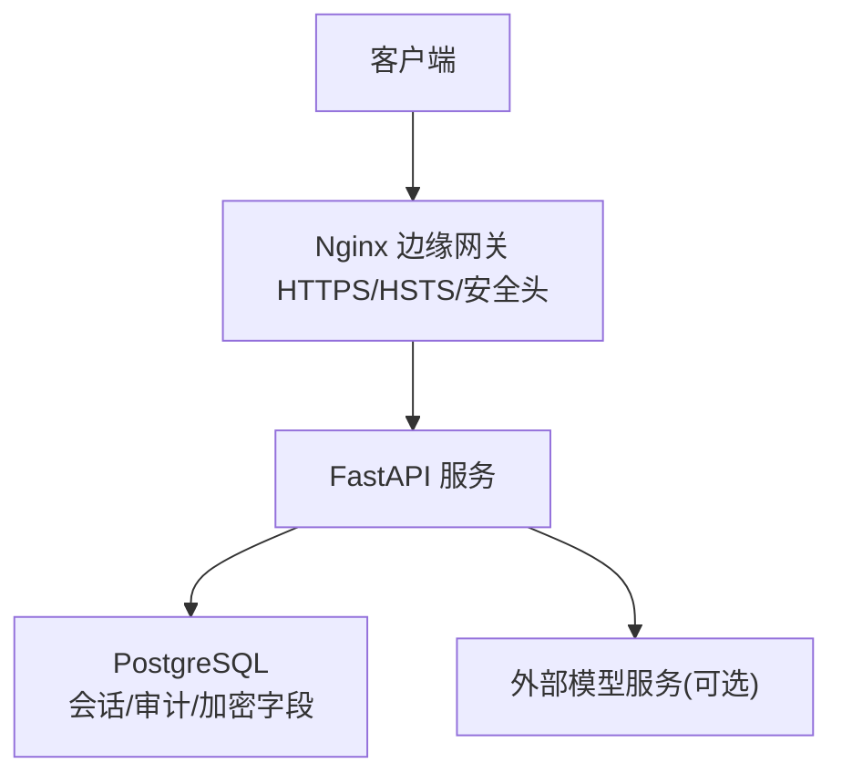
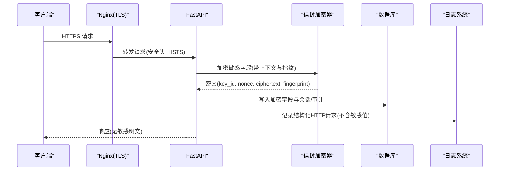
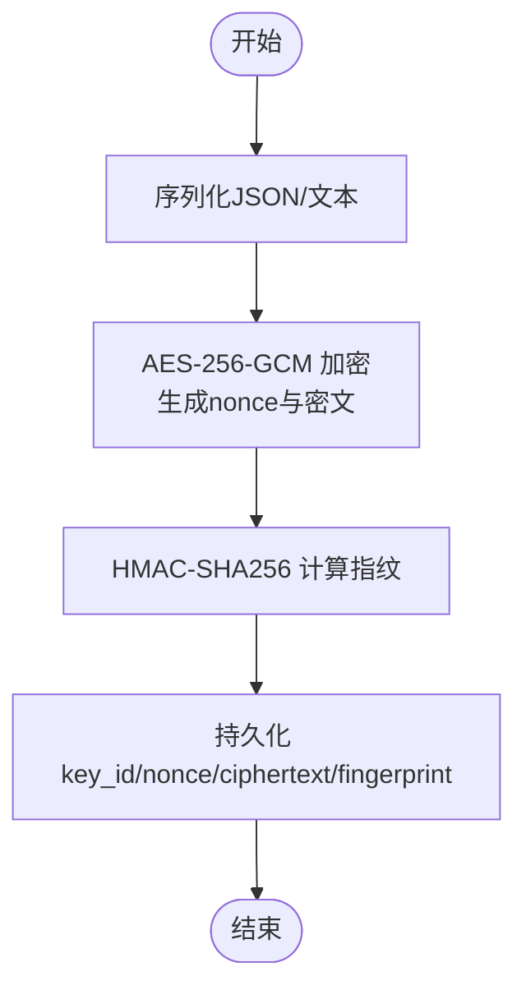
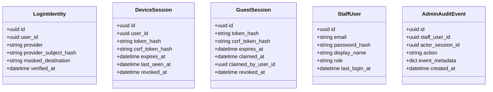
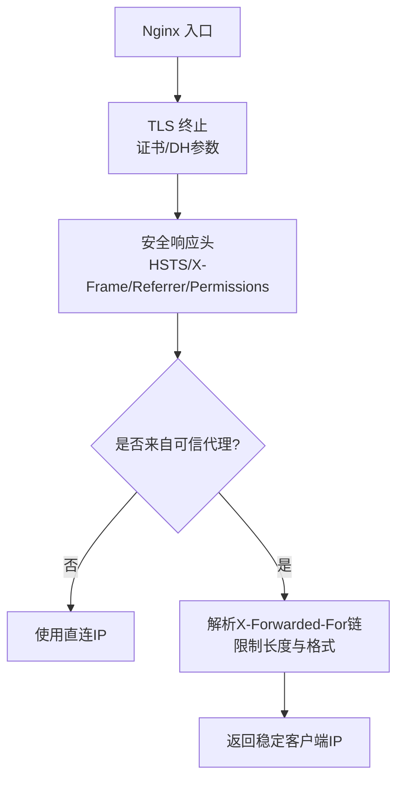
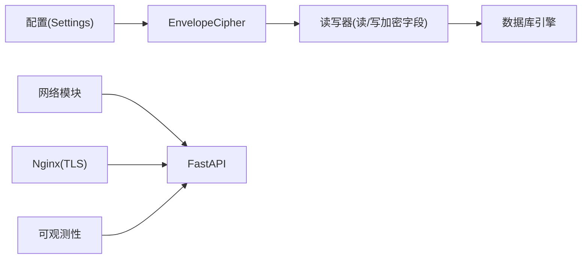
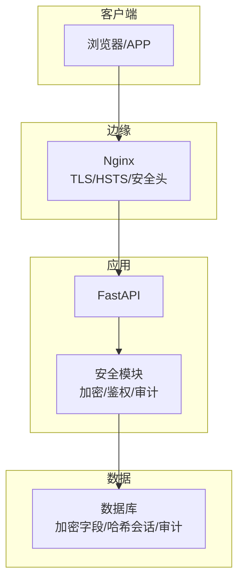

# 数据安全保护

<cite>
**本文引用的文件**
- [backend/app/security/envelope.py](file://backend/app/security/envelope.py)
- [backend/app/config.py](file://backend/app/config.py)
- [backend/app/network.py](file://backend/app/network.py)
- [backend/app/identity/security.py](file://backend/app/identity/security.py)
- [backend/app/admin/passwords.py](file://backend/app/admin/passwords.py)
- [backend/app/identity/models.py](file://backend/app/identity/models.py)
- [backend/app/admin/models.py](file://backend/app/admin/models.py)
- [backend/app/database.py](file://backend/app/database.py)
- [backend/app/observability.py](file://backend/app/observability.py)
- [infra/nginx/fateradar-tls.conf](file://infra/nginx/fateradar-tls.conf)
- [infra/nginx/fateradar.conf](file://infra/nginx/fateradar.conf)
- [infra/ssh/99-fateradar-hardening.conf](file://infra/ssh/99-fateradar-hardening.conf)
- [scripts/check_production_secrets.py](file://scripts/check_production_secrets.py)
- [backend/tests/test_sensitive_payloads.py](file://backend/tests/test_sensitive_payloads.py)
- [backend/tests/test_config.py](file://backend/tests/test_config.py)
</cite>

## 目录
1. [简介](#简介)
2. [项目结构](#项目结构)
3. [核心组件](#核心组件)
4. [架构总览](#架构总览)
5. [详细组件分析](#详细组件分析)
6. [依赖关系分析](#依赖关系分析)
7. [性能考量](#性能考量)
8. [故障排查指南](#故障排查指南)
9. [结论](#结论)
10. [附录](#附录)

## 简介
本文件面向生产环境的数据安全落地，覆盖以下方面：
- 敏感数据加密机制：信封式内容加密、密钥标识与指纹校验、加解密流程。
- 数据传输安全：HTTPS/TLS、HSTS、反向代理安全头、可信代理IP解析。
- 数据存储安全：数据库字段级加密、会话与凭据哈希存储、审计事件持久化。
- 内存处理安全：日志脱敏、请求追踪、临时数据清理策略。
- 数据访问审计：用户与管理员操作记录、变更追踪、访问模式分析。
- 配置与合规：生产环境强制安全约束、密钥注入校验。
- 最佳实践与应急响应：泄露防护清单与处置流程。

## 项目结构
本项目采用前后端分离与模块化后端设计，关键安全能力集中在后端模块与基础设施配置中：
- 后端应用（FastAPI）提供加密、认证、会话、审计、网络与安全配置等能力。
- Nginx作为边缘网关，负责TLS终止、安全响应头与HTTP到HTTPS重定向。
- SSH加固配置用于服务器登录安全。
- 脚本与测试保障生产密钥注入与配置正确性。

图表来源
- [infra/nginx/fateradar-tls.conf:56-124](file://infra/nginx/fateradar-tls.conf#L56-L124)
- [backend/app/main.py](file://backend/app/main.py)
- [backend/app/database.py:12-33](file://backend/app/database.py#L12-L33)

章节来源
- [infra/nginx/fateradar-tls.conf:1-124](file://infra/nginx/fateradar-tls.conf#L1-L124)
- [infra/nginx/fateradar.conf:1-59](file://infra/nginx/fateradar.conf#L1-L59)
- [backend/app/database.py:12-33](file://backend/app/database.py#L12-L33)

## 核心组件
- 信封加密器：基于AES-256-GCM的内容加密，附带领域上下文与HMAC指纹，确保完整性与不可混淆。
- 配置与安全策略：集中管理密钥、Cookie安全、OTP、运行时与模型调用限制，并在生产环境强制执行。
- 身份与会话安全：令牌生成与哈希存储、CSRF令牌哈希、设备/访客会话生命周期。
- 管理员密码：使用scrypt进行高强度哈希，验证时恒定时间比较。
- 网络与信任边界：从可信代理链解析真实客户端IP，避免伪造X-Forwarded-For。
- 可观测性与日志：结构化HTTP请求日志、敏感传输库日志降级、请求ID透传。
- 审计模型：用户与管理员操作事件持久化，支持元数据扩展。

章节来源
- [backend/app/security/envelope.py:32-122](file://backend/app/security/envelope.py#L32-L122)
- [backend/app/config.py:62-335](file://backend/app/config.py#L62-L335)
- [backend/app/identity/security.py:5-10](file://backend/app/identity/security.py#L5-L10)
- [backend/app/admin/passwords.py:16-54](file://backend/app/admin/passwords.py#L16-L54)
- [backend/app/network.py:16-72](file://backend/app/network.py#L16-L72)
- [backend/app/observability.py:14-52](file://backend/app/observability.py#L14-L52)
- [backend/app/identity/models.py:68-132](file://backend/app/identity/models.py#L68-L132)
- [backend/app/admin/models.py:17-81](file://backend/app/admin/models.py#L17-L81)

## 架构总览
下图展示端到端数据流中的安全控制点：客户端经Nginx启用HTTPS与严格安全头；FastAPI在业务层对敏感数据进行信封加密并落库；会话与凭据以哈希形式存储；所有关键操作写入审计表；日志仅包含必要非敏感信息。

图表来源
- [infra/nginx/fateradar-tls.conf:56-124](file://infra/nginx/fateradar-tls.conf#L56-L124)
- [backend/app/security/envelope.py:56-96](file://backend/app/security/envelope.py#L56-L96)
- [backend/app/identity/models.py:68-132](file://backend/app/identity/models.py#L68-L132)
- [backend/app/observability.py:27-52](file://backend/app/observability.py#L27-L52)

## 详细组件分析

### 信封加密与数据落库
- 算法与参数：AES-256-GCM，随机nonce，附加域上下文AAD，HMAC-SHA256指纹校验。
- 密钥管理：通过配置项加载Base64编码的32字节密钥与key_id；生产环境禁止本地默认密钥。
- 数据流：将JSON或文本序列化后加密，持久化key_id、nonce、ciphertext与fingerprint四列；读取时先验key_id再解密并比对指纹。
- 完整性与防篡改：指纹由“上下文+分隔符+明文”计算，防止密文被替换或上下文混淆。

图表来源
- [backend/app/security/envelope.py:56-96](file://backend/app/security/envelope.py#L56-L96)
- [backend/app/config.py:124-125](file://backend/app/config.py#L124-L125)
- [backend/app/config.py:217-234](file://backend/app/config.py#L217-L234)

章节来源
- [backend/app/security/envelope.py:20-122](file://backend/app/security/envelope.py#L20-L122)
- [backend/app/config.py:62-335](file://backend/app/config.py#L62-L335)

### 密钥管理与生产安全约束
- 密钥来源：content_encryption_key_b64为Base64编码的32字节密钥；identity_hash_key用于身份相关哈希。
- 生产校验：禁止使用本地默认密钥；禁止复用身份哈希密钥；要求cookie_secure=true；禁用fake OTP/Runtime/Model适配器。
- 外部密钥注入：通过环境变量或文件秘密注入，测试与脚本验证缺失或非法值。

章节来源
- [backend/app/config.py:124-125](file://backend/app/config.py#L124-L125)
- [backend/app/config.py:188-329](file://backend/app/config.py#L188-L329)
- [backend/tests/test_sensitive_payloads.py:55-89](file://backend/tests/test_sensitive_payloads.py#L55-L89)
- [backend/tests/test_config.py:12-31](file://backend/tests/test_config.py#L12-L31)
- [scripts/check_production_secrets.py:1-20](file://scripts/check_production_secrets.py#L1-L20)

### 身份与会话安全
- 令牌：使用安全随机数生成不透明令牌，并以SHA-256哈希形式存储于数据库，避免明文留存。
- 会话：设备与会话表保存token_hash、csrf_token_hash、过期时间与撤销标记；访客会话支持认领与撤销。
- 管理员：密码使用scrypt高成本哈希，验证时恒定时间比较，降低时序攻击风险。

图表来源
- [backend/app/identity/models.py:41-111](file://backend/app/identity/models.py#L41-L111)
- [backend/app/admin/models.py:17-81](file://backend/app/admin/models.py#L17-L81)

章节来源
- [backend/app/identity/security.py:5-10](file://backend/app/identity/security.py#L5-L10)
- [backend/app/identity/models.py:41-111](file://backend/app/identity/models.py#L41-L111)
- [backend/app/admin/passwords.py:16-54](file://backend/app/admin/passwords.py#L16-L54)
- [backend/app/admin/models.py:17-81](file://backend/app/admin/models.py#L17-L81)

### 数据传输安全（HTTPS/TLS/安全头/可信代理）
- TLS与证书：Nginx监听443并配置Let’s Encrypt证书与DH参数；自动续期挑战路径已开放。
- HSTS与响应头：强制HTTPS、禁止缓存、禁止点击劫持、限制权限策略。
- HTTP重定向：80端口统一重定向至HTTPS。
- 可信代理IP解析：仅在来自受信任网段的请求中解析X-Forwarded-For，且限制链长度与格式，回退到直连IP。

图表来源
- [infra/nginx/fateradar-tls.conf:56-124](file://infra/nginx/fateradar-tls.conf#L56-L124)
- [infra/nginx/fateradar.conf:8-37](file://infra/nginx/fateradar.conf#L8-L37)
- [backend/app/network.py:16-72](file://backend/app/network.py#L16-L72)

章节来源
- [infra/nginx/fateradar-tls.conf:1-124](file://infra/nginx/fateradar-tls.conf#L1-L124)
- [infra/nginx/fateradar.conf:1-59](file://infra/nginx/fateradar.conf#L1-L59)
- [backend/app/network.py:16-72](file://backend/app/network.py#L16-L72)

### 数据存储安全（字段加密/脱敏/备份）
- 字段级加密：读结果完成态等敏感内容以EncryptedPayload四列存储，读取时按上下文解密并校验指纹。
- 脱敏：登录身份表保存masked_destination，避免直接暴露完整目的地信息。
- 备份建议：数据库备份应包含加密字段；密钥需独立保管并与数据分离；恢复时需保证相同key_id与上下文一致。

章节来源
- [backend/app/security/envelope.py:56-96](file://backend/app/security/envelope.py#L56-L96)
- [backend/app/identity/models.py:41-66](file://backend/app/identity/models.py#L41-L66)

### 内存处理安全（临时文件/日志/调试）
- 日志脱敏：HTTP请求日志仅记录方法、路径、状态码、耗时与请求ID；敏感传输库日志级别提升以减少泄漏面。
- 请求ID：从请求头或生成UUID，贯穿响应头便于追踪。
- 临时文件：建议在业务层使用内存或一次性临时文件，并在异常路径显式清理；当前仓库未实现通用清理中间件，需在具体处理器中落实。

章节来源
- [backend/app/observability.py:14-52](file://backend/app/observability.py#L14-L52)

### 数据访问审计（敏感操作/变更追踪/访问模式）
- 用户审计：audit_events表记录user_id、actor_session_id、action与event_metadata，支持按用户与时间检索。
- 管理员审计：admin_audit_events表记录staff_user_id、session、动作与元数据，便于内部合规审查。
- 访问模式分析：结合HTTP请求日志与审计事件，统计高频接口、失败率与异常行为。

章节来源
- [backend/app/identity/models.py:113-132](file://backend/app/identity/models.py#L113-L132)
- [backend/app/admin/models.py:59-81](file://backend/app/admin/models.py#L59-L81)
- [backend/app/observability.py:27-52](file://backend/app/observability.py#L27-L52)

## 依赖关系分析
- 加密器依赖配置提供的密钥与key_id；数据库会话由Database类统一管理；网络模块依赖FastAPI Request对象解析IP；Nginx配置与SSH加固构成基础设施安全基线。

图表来源
- [backend/app/config.py:62-335](file://backend/app/config.py#L62-L335)
- [backend/app/security/envelope.py:32-122](file://backend/app/security/envelope.py#L32-L122)
- [backend/app/database.py:12-33](file://backend/app/database.py#L12-L33)
- [backend/app/network.py:16-72](file://backend/app/network.py#L16-L72)
- [infra/nginx/fateradar-tls.conf:56-124](file://infra/nginx/fateradar-tls.conf#L56-L124)
- [backend/app/observability.py:27-52](file://backend/app/observability.py#L27-L52)

章节来源
- [backend/app/config.py:62-335](file://backend/app/config.py#L62-L335)
- [backend/app/security/envelope.py:32-122](file://backend/app/security/envelope.py#L32-L122)
- [backend/app/database.py:12-33](file://backend/app/database.py#L12-L33)
- [backend/app/network.py:16-72](file://backend/app/network.py#L16-L72)
- [infra/nginx/fateradar-tls.conf:56-124](file://infra/nginx/fateradar-tls.conf#L56-L124)
- [backend/app/observability.py:27-52](file://backend/app/observability.py#L27-L52)

## 性能考量
- 加密开销：AES-GCM硬件加速友好；指纹计算轻量；在高吞吐场景下注意批量处理的I/O与CPU占用。
- 数据库写入：加密字段增加列与索引需求；建议对查询热点建立合适索引（如用户ID、创建时间）。
- 日志体积：结构化日志便于聚合但可能增大存储；建议按环境调整保留周期与采样策略。
- 网络延迟：TLS握手与HSTS预载影响首包；合理设置会话与缓存策略（对外部资源谨慎缓存）。

[本节为通用指导，无需特定文件引用]

## 故障排查指南
- 生产密钥缺失或无效：启动时报错提示缺少或非法的content_encryption_key_b64/identity_hash_key；检查环境变量与注入流程。
- 解密失败：若出现指纹不匹配或标签无效，检查上下文是否一致、密文是否被篡改、key_id是否可用。
- 日志泄露：确认敏感传输库日志级别已提升；检查自定义日志输出是否包含敏感字段。
- 代理IP错误：确认trusted_proxy_cidrs配置正确；检查X-Forwarded-For链长度与格式。
- 会话失效：核对token_hash与csrf_token_hash是否一致；检查过期时间与撤销标记。

章节来源
- [backend/app/config.py:188-329](file://backend/app/config.py#L188-L329)
- [backend/app/security/envelope.py:75-96](file://backend/app/security/envelope.py#L75-L96)
- [backend/app/observability.py:14-52](file://backend/app/observability.py#L14-L52)
- [backend/app/network.py:16-72](file://backend/app/network.py#L16-L72)

## 结论
本项目在数据全生命周期内实现了较为完善的安全控制：传输层通过Nginx强制HTTPS与安全头；应用层对敏感数据采用信封加密与指纹校验；存储层以哈希与加密字段保护凭据与隐私；运行期通过结构化日志与审计事件支撑可观测与合规；配置层在生产环境实施强约束与密钥注入校验。建议持续完善临时文件清理、备份密钥管理与泄露应急响应流程，以确保整体安全水位持续提升。

[本节为总结性内容，无需特定文件引用]

## 附录

### 加密配置示例（说明性）
- 内容加密密钥：通过环境变量注入Base64编码的32字节密钥，并指定key_id用于多版本密钥轮换。
- Cookie安全：生产环境必须启用secure标志，避免明文传输。
- 可信代理：配置trusted_proxy_cidrs以允许上游负载均衡或WAF转发真实IP。
- 日志级别：生产环境提高敏感传输库日志级别，仅记录必要信息。

章节来源
- [backend/app/config.py:124-125](file://backend/app/config.py#L124-L125)
- [backend/app/config.py:188-234](file://backend/app/config.py#L188-L234)
- [backend/app/network.py:16-72](file://backend/app/network.py#L16-L72)
- [backend/app/observability.py:14-52](file://backend/app/observability.py#L14-L52)

### 数据流安全架构图（概念图）

[此图为概念示意，不映射具体源码文件]

### 数据泄露防护最佳实践
- 最小化敏感数据：仅收集必要信息，避免在日志与错误消息中输出敏感字段。
- 密钥隔离：密钥与数据分离存储，定期轮换，限制访问范围。
- 传输安全：全站HTTPS，启用HSTS，禁用不安全协议与弱密码套件。
- 存储安全：敏感字段加密，凭据哈希存储，定期审计数据库访问。
- 访问控制：基于角色与最小权限原则，限制后台与运维访问。
- 监控与告警：对异常访问与失败率设置阈值告警，快速发现潜在泄露。

[本节为通用指导，无需特定文件引用]

### 应急响应预案（概要）
- 检测：通过日志与审计事件识别异常访问与数据外泄迹象。
- 遏制：立即吊销受影响会话与令牌，冻结可疑账户，阻断可疑IP。
- 取证：保留相关请求ID、审计事件与日志快照，记录时间线与影响范围。
- 修复：轮换密钥、修补漏洞、更新配置与策略。
- 复盘：评估影响面，改进控制措施，完善监控与演练。

[本节为通用指导，无需特定文件引用]