# 网络安全设计

<cite>
**本文引用的文件**
- [fateradar.conf](file://infra/nginx/fateradar.conf)
- [fateradar-tls.conf](file://infra/nginx/fateradar-tls.conf)
- [fateradar-test-loopback.conf](file://infra/nginx/fateradar-test-loopback.conf)
- [fateradar-test-public-preview.conf](file://infra/nginx/fateradar-test-public-preview.conf)
- [network.py](file://backend/app/network.py)
- [config.py](file://backend/app/config.py)
- [envelope.py](file://backend/app/security/envelope.py)
- [rate_guard.py](file://backend/app/api/rate_guard.py)
- [observability.py](file://backend/app/observability.py)
- [alerts.py](file://backend/app/readings/alerts.py)
- [compose.local.yml](file://infra/compose.local.yml)
- [99-fateradar-hardening.conf](file://infra/ssh/99-fateradar-hardening.conf)
- [health.schema.json](file://contracts/schemas/health.schema.json)
- [TEST_SERVER_RUNBOOK.md](file://infra/TEST_SERVER_RUNBOOK.md)
</cite>

## 目录
1. [简介](#简介)
2. [项目结构](#项目结构)
3. [核心组件](#核心组件)
4. [架构总览](#架构总览)
5. [详细组件分析](#详细组件分析)
6. [依赖关系分析](#依赖关系分析)
7. [性能与安全考量](#性能与安全考量)
8. [故障排查指南](#故障排查指南)
9. [结论](#结论)
10. [附录：配置示例与拓扑图](#附录配置示例与拓扑图)

## 简介
本文件面向生产级网络安全设计，围绕 HTTPS/TLS、防火墙与访问控制、网络隔离、负载均衡安全、监控与日志、事件响应与漏洞修复等主题，结合仓库中的 Nginx 边缘层、后端 FastAPI、容器编排与系统加固配置，给出可落地的策略与实践。文档同时提供可视化架构图与流程图，帮助非专业读者理解关键流程。

## 项目结构
本项目采用“边缘网关 + Web/API 服务 + 数据层”的分层部署方式：
- 边缘层：Nginx 负责 TLS 终止、安全头、健康检查、反向代理与静态资源路由。
- 应用层：FastAPI 提供 API，Next.js 提供 Web；通过 systemd 或 Docker Compose 管理进程。
- 数据层：PostgreSQL、Redis（本地开发）；生产环境建议独立托管并限制访问来源。
- 运维与加固：SSH 加固、环境变量与密钥注入、健康检查与告警。

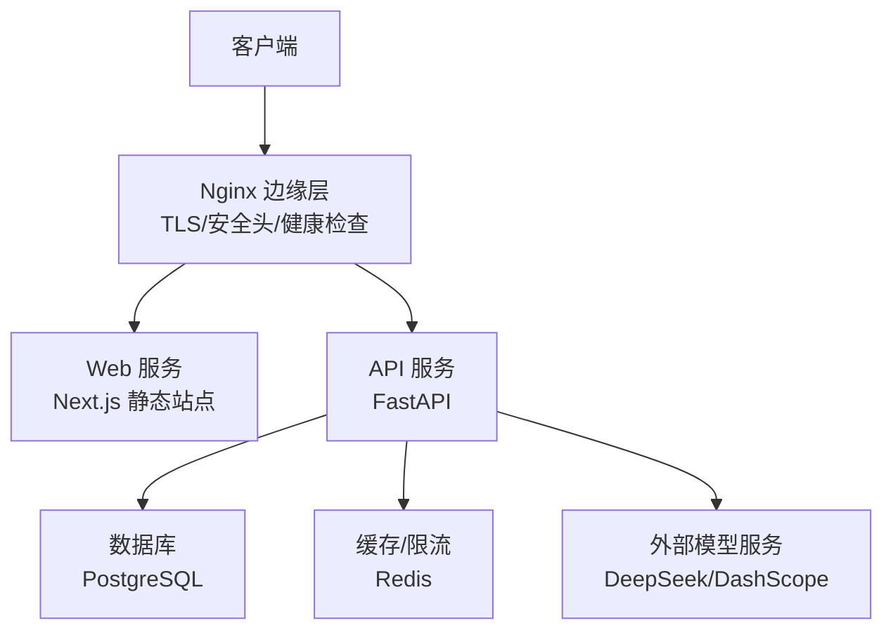

**图表来源**
- [fateradar.conf:1-59](file://infra/nginx/fateradar.conf#L1-L59)
- [fateradar-tls.conf:56-125](file://infra/nginx/fateradar-tls.conf#L56-L125)
- [compose.local.yml:31-50](file://infra/compose.local.yml#L31-L50)

**章节来源**
- [fateradar.conf:1-59](file://infra/nginx/fateradar.conf#L1-L59)
- [fateradar-tls.conf:1-125](file://infra/nginx/fateradar-tls.conf#L1-L125)
- [compose.local.yml:1-93](file://infra/compose.local.yml#L1-L93)

## 核心组件
- 边缘网关（Nginx）：HTTPS 证书管理、强制重定向、安全响应头、健康检查端点、反代策略。
- 应用配置（Settings）：生产环境安全校验、速率限制、可信代理、加密密钥、模型调用白名单与超时约束。
- 网络信任链：解析真实客户端 IP，防止伪造 X-Forwarded-For。
- 内容加密：AES-256-GCM 信封加密，带指纹校验与上下文绑定。
- 速率限制：统一返回 429 与 Retry-After，抑制滥用。
- 可观测性：结构化请求日志、请求 ID 透传、敏感传输日志降噪。
- 告警：结构化告警事件输出，便于接入日志平台。

**章节来源**
- [config.py:62-149](file://backend/app/config.py#L62-L149)
- [config.py:188-329](file://backend/app/config.py#L188-L329)
- [network.py:16-54](file://backend/app/network.py#L16-L54)
- [envelope.py:32-96](file://backend/app/security/envelope.py#L32-L96)
- [rate_guard.py:5-20](file://backend/app/api/rate_guard.py#L5-L20)
- [observability.py:14-52](file://backend/app/observability.py#L14-L52)
- [alerts.py:16-75](file://backend/app/readings/alerts.py#L16-L75)

## 架构总览
下图展示从客户端到后端服务的完整链路，包括 TLS 终止、安全头、健康检查、反代与内部服务通信。

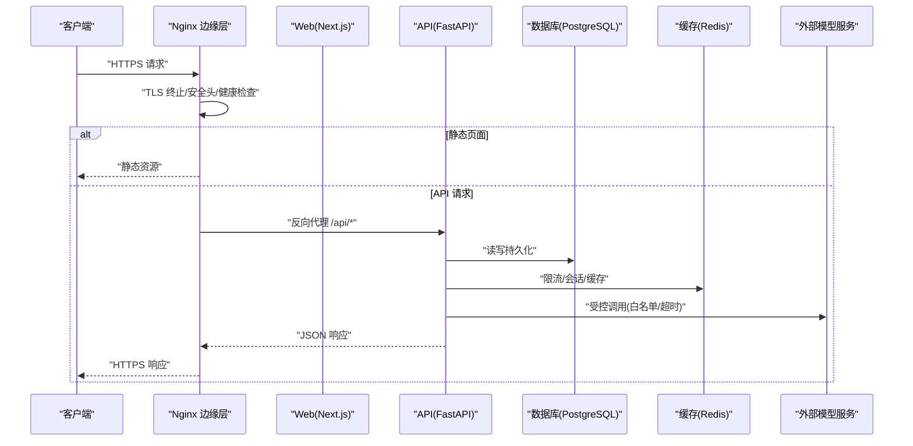

**图表来源**
- [fateradar-tls.conf:56-125](file://infra/nginx/fateradar-tls.conf#L56-L125)
- [fateradar-test-loopback.conf:26-44](file://infra/nginx/fateradar-test-loopback.conf#L26-L44)
- [compose.local.yml:31-50](file://infra/compose.local.yml#L31-L50)

## 详细组件分析

### HTTPS 与 TLS 配置
- 证书管理：使用 Let’s Encrypt 提供的 fullchain 与 privkey，并通过 include 引入通用 SSL 选项与 DH 参数。
- 协议版本与套件：通过 include 的 options-ssl-nginx.conf 启用现代 TLS 配置；生产环境应确保仅允许 TLS 1.2+，禁用弱套件。
- HSTS：为域名设置 Strict-Transport-Security，强制浏览器走 HTTPS。
- HTTP 重定向：所有 HTTP 请求 301 重定向到对应 HTTPS 域名。
- ACME 验证：/.well-known/acme-challenge 路径放行以支持自动续期。

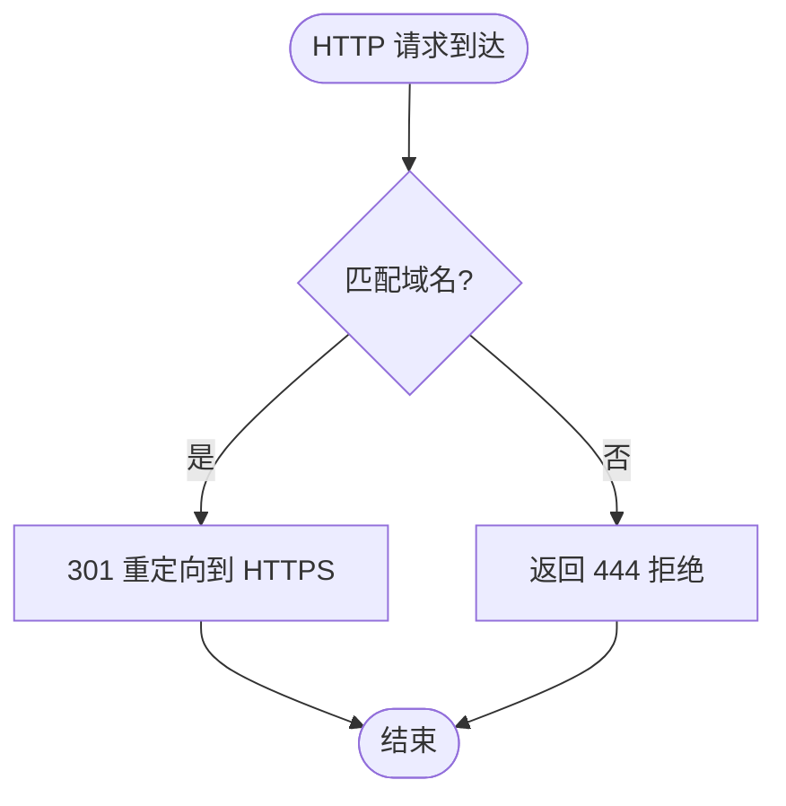

**图表来源**
- [fateradar-tls.conf:8-22](file://infra/nginx/fateradar-tls.conf#L8-L22)
- [fateradar-tls.conf:24-38](file://infra/nginx/fateradar-tls.conf#L24-L38)
- [fateradar-tls.conf:40-54](file://infra/nginx/fateradar-tls.conf#L40-L54)
- [fateradar-tls.conf:56-84](file://infra/nginx/fateradar-tls.conf#L56-L84)

**章节来源**
- [fateradar-tls.conf:1-125](file://infra/nginx/fateradar-tls.conf#L1-L125)
- [fateradar.conf:1-59](file://infra/nginx/fateradar.conf#L1-L59)

### 防火墙与访问控制
- SSH 加固：禁用密码登录与键盘交互，禁止 root 密码登录，仅允许公钥认证。
- 端口开放策略：
  - 测试服务器临时公网入口仅在 18080 暴露，配合 UFW 与云安全组规则。
  - 回环入口仅监听 127.0.0.1:8080，避免公网暴露。
- 入站出站控制：
  - 入站：仅开放必要端口（如 80/443、临时预览 18080）。
  - 出站：API 对模型服务的调用通过白名单与超时限制，降低恶意外联风险。

**章节来源**
- [99-fateradar-hardening.conf:1-5](file://infra/ssh/99-fateradar-hardening.conf#L1-L5)
- [TEST_SERVER_RUNBOOK.md:181-235](file://infra/TEST_SERVER_RUNBOOK.md#L181-L235)
- [fateradar-test-public-preview.conf:1-46](file://infra/nginx/fateradar-test-public-preview.conf#L1-L46)
- [fateradar-test-loopback.conf:1-58](file://infra/nginx/fateradar-test-loopback.conf#L1-L58)

### 网络隔离策略
- 微服务间通信：
  - 通过 Nginx 将 /api/* 反代到本地 127.0.0.1:8000，其他路径到 Next.js 3000，实现服务边界隔离。
  - 在反向代理中覆写 X-Forwarded-For 为直连客户端地址，防止中间层伪造。
- 数据库连接保护：
  - 本地开发通过 Docker Compose 将 PostgreSQL 绑定到 127.0.0.1:5432，仅本机可达。
  - 生产建议将数据库置于内网子网，仅允许 API 所在主机访问。
- 外部 API 调用安全：
  - 配置严格白名单与固定端点路径，限制模型提供商与基础 URL。
  - 设置连接、读取与总体超时，限制最大响应体大小，防止资源耗尽。

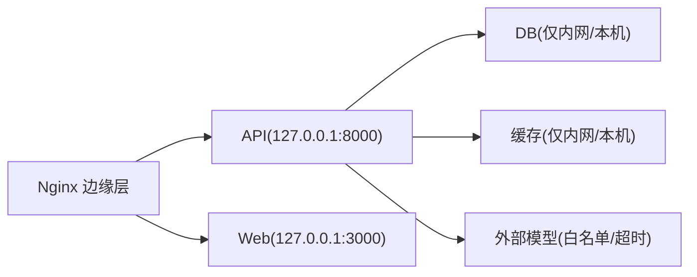

**图表来源**
- [fateradar-test-loopback.conf:26-44](file://infra/nginx/fateradar-test-loopback.conf#L26-L44)
- [compose.local.yml:4-19](file://infra/compose.local.yml#L4-L19)
- [config.py:101-118](file://backend/app/config.py#L101-L118)

**章节来源**
- [fateradar-test-loopback.conf:1-58](file://infra/nginx/fateradar-test-loopback.conf#L1-L58)
- [compose.local.yml:1-93](file://infra/compose.local.yml#L1-L93)
- [config.py:101-118](file://backend/app/config.py#L101-L118)

### 负载均衡与健康检查
- 健康检查：
  - Nginx 暴露 /healthz 返回简单状态，用于四层/七层探针。
  - API 提供 /api/v1/health/live 与 /api/v1/health/ready，供编排系统判断存活与就绪。
- 故障转移：
  - 当上游不可用时，Nginx 可配置备用节点（当前配置为单实例，生产建议多副本）。
- 流量分发：
  - 基于 location 的路由分发至不同上游；API 与 Web 分离，避免相互影响。

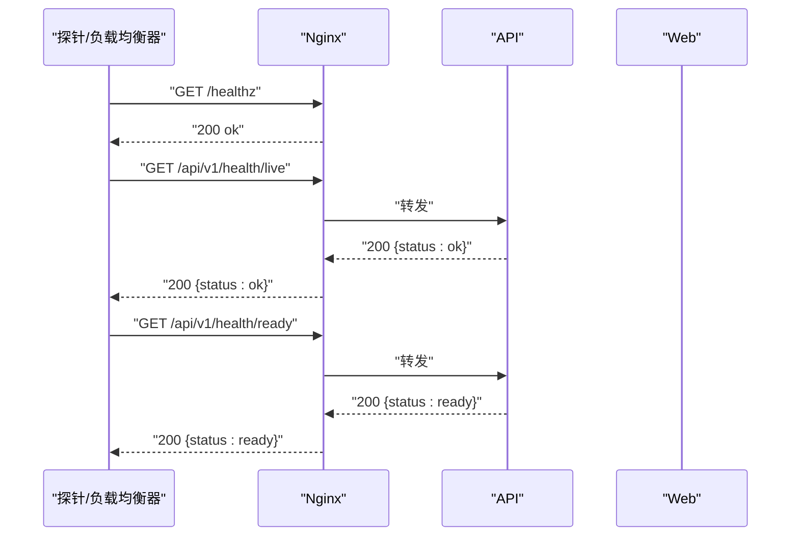

**图表来源**
- [fateradar.conf:21-25](file://infra/nginx/fateradar.conf#L21-L25)
- [fateradar.conf:47-51](file://infra/nginx/fateradar.conf#L47-L51)
- [fateradar-tls.conf:75-79](file://infra/nginx/fateradar-tls.conf#L75-L79)
- [fateradar-tls.conf:113-117](file://infra/nginx/fateradar-tls.conf#L113-L117)
- [TEST_SERVER_RUNBOOK.md:244-258](file://infra/TEST_SERVER_RUNBOOK.md#L244-L258)

**章节来源**
- [fateradar.conf:21-51](file://infra/nginx/fateradar.conf#L21-L51)
- [fateradar-tls.conf:75-117](file://infra/nginx/fateradar-tls.conf#L75-L117)
- [TEST_SERVER_RUNBOOK.md:244-258](file://infra/TEST_SERVER_RUNBOOK.md#L244-L258)

### 速率限制与防滥用
- 统一限流接口：check_rate_limiter 捕获超限异常并返回 429 与 Retry-After 头。
- 配置项：针对访客会话创建、写入操作等设置窗口与次数限制。
- 适用场景：注册、短信验证码、读条生成等易被滥用的接口。

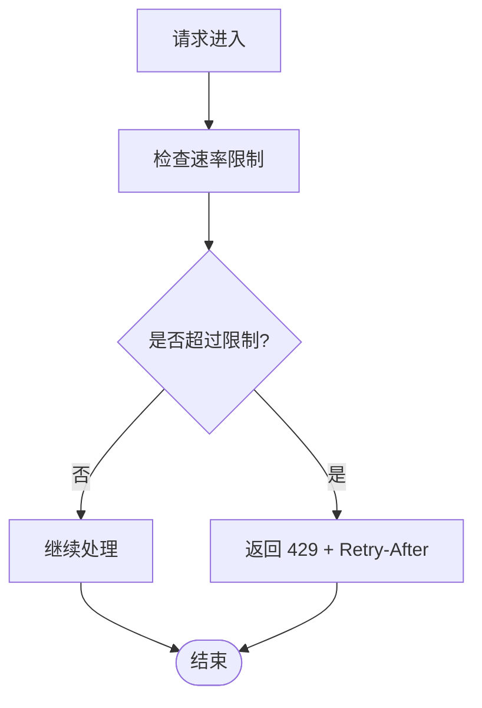

**图表来源**
- [rate_guard.py:5-20](file://backend/app/api/rate_guard.py#L5-L20)
- [config.py:126-138](file://backend/app/config.py#L126-L138)

**章节来源**
- [rate_guard.py:1-20](file://backend/app/api/rate_guard.py#L1-L20)
- [config.py:126-138](file://backend/app/config.py#L126-L138)

### 内容加密与敏感数据处理
- 算法：AES-256-GCM 提供机密性与完整性；HMAC 指纹校验防止篡改。
- 密钥管理：通过 base64 编码的 32 字节密钥与 key_id 标识；生产环境强制注入且禁止使用默认值。
- 上下文绑定：加解密需传入 context，避免密文在不同业务域复用。
- JSON 封装：提供 encrypt_json/decrypt_json 便捷方法，保证序列化顺序一致。

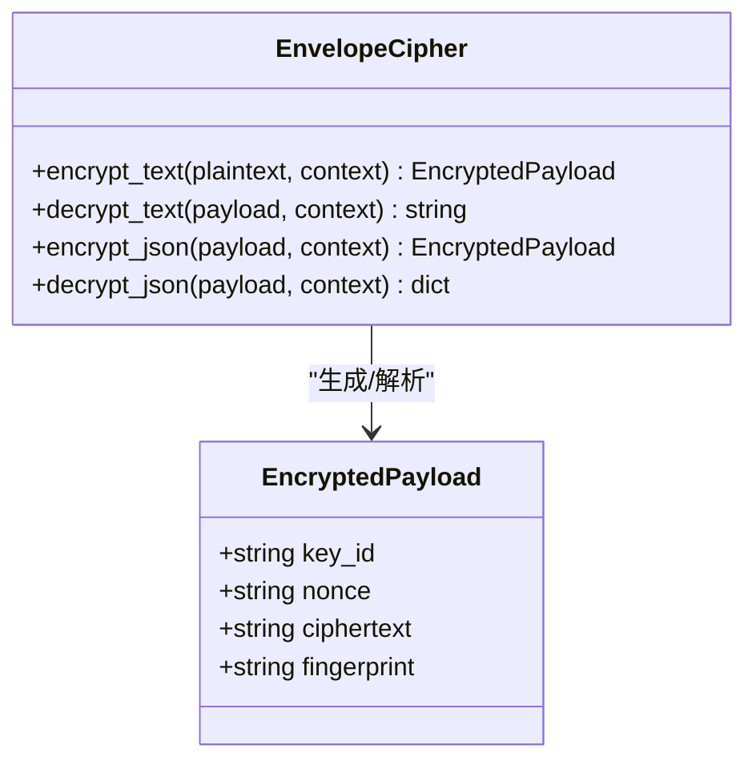

**图表来源**
- [envelope.py:24-96](file://backend/app/security/envelope.py#L24-L96)
- [config.py:123-125](file://backend/app/config.py#L123-L125)

**章节来源**
- [envelope.py:1-122](file://backend/app/security/envelope.py#L1-L122)
- [config.py:123-125](file://backend/app/config.py#L123-L125)

### 可信代理与真实客户端 IP
- 可信代理网段：通过 trusted_proxy_cidrs 声明可信代理范围。
- 解析逻辑：若来自可信代理，则从 X-Forwarded-For 链中自右向左查找第一个非可信代理地址作为客户端 IP；否则直接使用直连地址。
- 规范化：IPv4 映射 IPv6 地址会被压缩为标准 IPv4 表示。

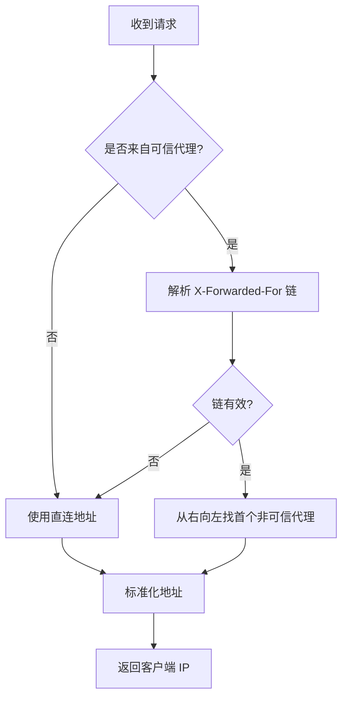

**图表来源**
- [network.py:16-54](file://backend/app/network.py#L16-L54)
- [config.py:139](file://backend/app/config.py#L139)

**章节来源**
- [network.py:1-72](file://backend/app/network.py#L1-L72)
- [config.py:139](file://backend/app/config.py#L139)

### 监控与日志收集
- 请求日志：每个 HTTP 请求记录 method、path、status、耗时与 request_id，便于追踪。
- 敏感日志降噪：httpx/httpcore/h2/hpack 等传输层日志降级为 WARNING，减少敏感信息泄露。
- 告警事件：结构化 ops_alert 事件，包含 kind、时间戳、作业/版本 ID 与详情，便于接入日志平台。
- 健康检查：Nginx 与 API 均提供健康端点，便于编排系统探测。

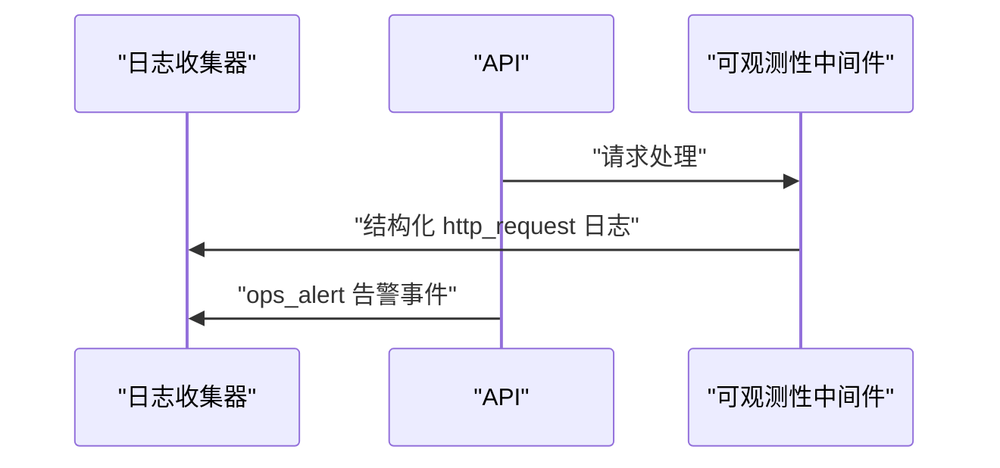

**图表来源**
- [observability.py:14-52](file://backend/app/observability.py#L14-L52)
- [alerts.py:20-75](file://backend/app/readings/alerts.py#L20-L75)

**章节来源**
- [observability.py:1-52](file://backend/app/observability.py#L1-L52)
- [alerts.py:1-81](file://backend/app/readings/alerts.py#L1-L81)

## 依赖关系分析
- Nginx 与后端：Nginx 作为唯一入站入口，统一处理 TLS、安全头与健康检查，并将 /api/* 反代到 FastAPI，其余到 Next.js。
- FastAPI 与数据层：通过数据库 URL 连接 PostgreSQL，使用 Redis 做限流与会话存储。
- 外部依赖：模型服务调用受白名单与超时限制，避免任意外联。
- 配置依赖：Settings 在生产环境强制多项安全约束，如 cookie_secure、OTP 适配器、内容加密密钥、运行时路径等。

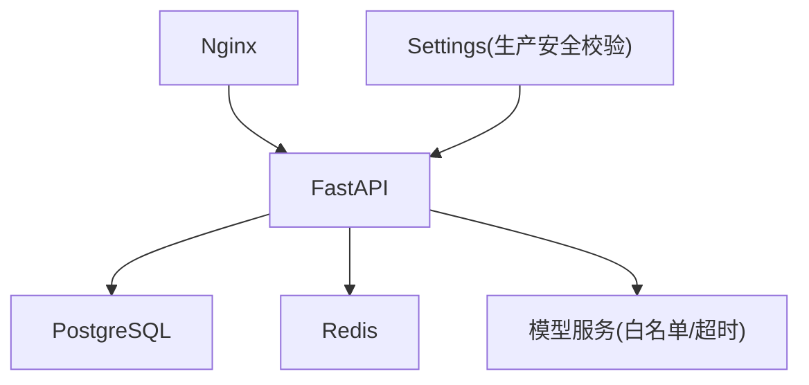

**图表来源**
- [fateradar-test-loopback.conf:26-44](file://infra/nginx/fateradar-test-loopback.conf#L26-L44)
- [compose.local.yml:31-50](file://infra/compose.local.yml#L31-L50)
- [config.py:188-329](file://backend/app/config.py#L188-L329)

**章节来源**
- [fateradar-test-loopback.conf:1-58](file://infra/nginx/fateradar-test-loopback.conf#L1-L58)
- [compose.local.yml:1-93](file://infra/compose.local.yml#L1-L93)
- [config.py:188-329](file://backend/app/config.py#L188-L329)

## 性能与安全考量
- 性能
  - 合理设置超时与响应体大小，避免长尾请求拖垮服务。
  - 使用 Redis 做热点数据缓存与限流，降低数据库压力。
  - Nginx 静态资源直接返回，减少后端负载。
- 安全
  - 生产环境强制 HTTPS、HSTS、安全响应头与最小权限原则。
  - 严格限制可信代理网段，防止伪造客户端 IP。
  - 内容加密与指纹校验保障数据机密性与完整性。
  - 对外部模型调用实施白名单与超时限制，降低供应链风险。

[本节为通用指导，不直接分析具体文件]

## 故障排查指南
- 健康检查失败
  - 检查 Nginx /healthz 与 API /api/v1/health/live、/api/v1/health/ready 是否正常。
  - 确认 systemd 单元状态与依赖服务（PostgreSQL、Redis）健康。
- 证书问题
  - 确认 Let’s Encrypt 证书路径与权限正确，ACME 挑战路径可访问。
  - 检查 HSTS 是否导致浏览器强制 HTTPS。
- 客户端 IP 不正确
  - 检查 trusted_proxy_cidrs 配置与 Nginx 的 X-Forwarded-For 覆写逻辑。
- 速率限制触发
  - 查看 429 响应与 Retry-After 头，调整窗口与次数限制。
- 告警与日志
  - 查看结构化 http_request 与 ops_alert 日志，定位异常请求与错误堆栈。

**章节来源**
- [TEST_SERVER_RUNBOOK.md:244-258](file://infra/TEST_SERVER_RUNBOOK.md#L244-L258)
- [fateradar.conf:21-51](file://infra/nginx/fateradar.conf#L21-L51)
- [fateradar-tls.conf:75-117](file://infra/nginx/fateradar-tls.conf#L75-L117)
- [network.py:16-54](file://backend/app/network.py#L16-L54)
- [rate_guard.py:5-20](file://backend/app/api/rate_guard.py#L5-L20)
- [observability.py:14-52](file://backend/app/observability.py#L14-L52)
- [alerts.py:20-75](file://backend/app/readings/alerts.py#L20-L75)

## 结论
本方案通过 Nginx 边缘层集中处理 TLS 与安全头，结合后端的严格配置校验、可信代理解析、内容加密与速率限制，构建了端到端的网络安全基线。配合健康检查、结构化日志与告警，可实现可观测与可运维的生产环境。建议在正式生产环境中进一步扩展负载均衡、多副本部署与更细粒度的网络隔离策略。

[本节为总结，不直接分析具体文件]

## 附录：配置示例与拓扑图

### 安全拓扑图
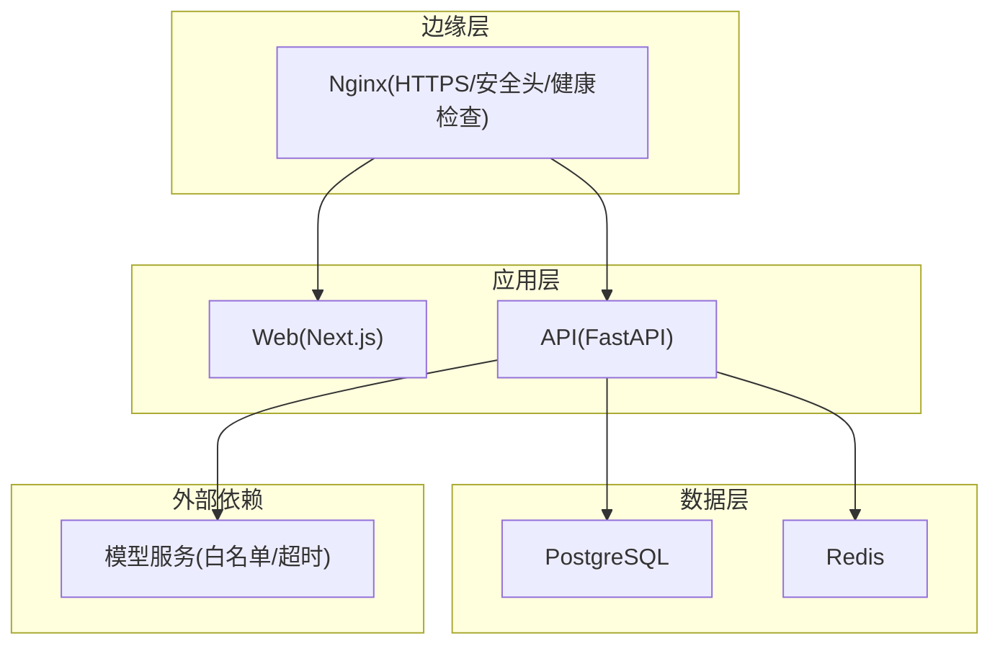

**图表来源**
- [fateradar-tls.conf:56-125](file://infra/nginx/fateradar-tls.conf#L56-L125)
- [fateradar-test-loopback.conf:26-44](file://infra/nginx/fateradar-test-loopback.conf#L26-L44)
- [compose.local.yml:31-50](file://infra/compose.local.yml#L31-L50)

### 关键配置要点清单
- HTTPS/TLS
  - 使用 Let’s Encrypt 证书与 DH 参数，include 通用 SSL 选项。
  - 设置 HSTS 与强制 HTTPS 重定向。
- 防火墙与端口
  - 仅开放必要端口；临时公网入口限时限域。
  - SSH 仅允许公钥认证，禁用密码与键盘交互。
- 网络隔离
  - Nginx 按路径反代到不同上游；数据库与缓存仅内网/本机可达。
  - 外部模型调用白名单与超时限制。
- 负载均衡与健康检查
  - Nginx /healthz 与 API /api/v1/health/* 提供探针。
  - 生产建议多副本与故障转移。
- 监控与日志
  - 结构化 http_request 与 ops_alert 日志。
  - 敏感传输日志降噪。
- 速率限制
  - 统一 429 与 Retry-After；按业务维度设置窗口与次数。
- 内容加密
  - AES-256-GCM + HMAC 指纹；生产强制注入密钥。

**章节来源**
- [fateradar-tls.conf:1-125](file://infra/nginx/fateradar-tls.conf#L1-L125)
- [99-fateradar-hardening.conf:1-5](file://infra/ssh/99-fateradar-hardening.conf#L1-L5)
- [fateradar-test-loopback.conf:1-58](file://infra/nginx/fateradar-test-loopback.conf#L1-L58)
- [compose.local.yml:1-93](file://infra/compose.local.yml#L1-L93)
- [observability.py:1-52](file://backend/app/observability.py#L1-L52)
- [alerts.py:1-81](file://backend/app/readings/alerts.py#L1-L81)
- [rate_guard.py:1-20](file://backend/app/api/rate_guard.py#L1-L20)
- [envelope.py:1-122](file://backend/app/security/envelope.py#L1-L122)