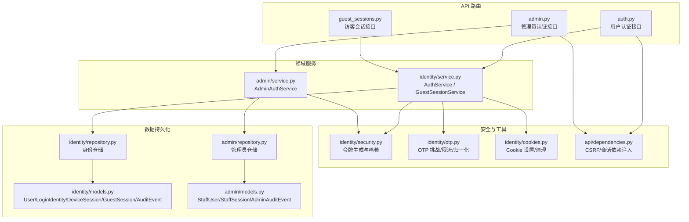
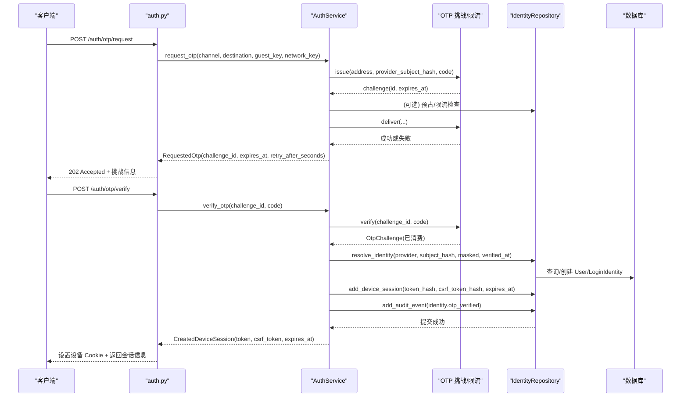
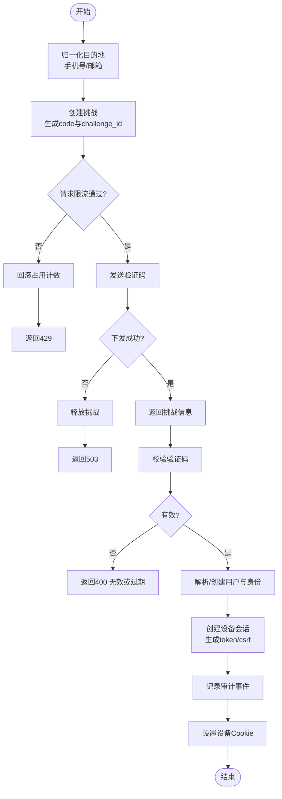
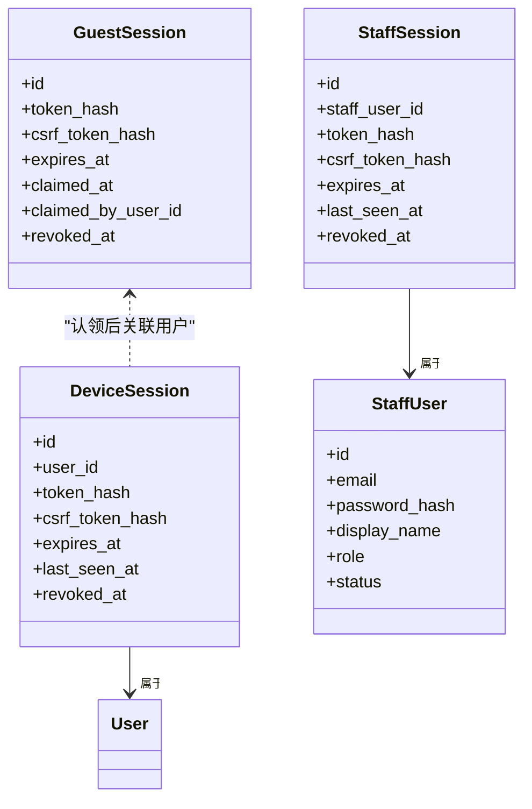
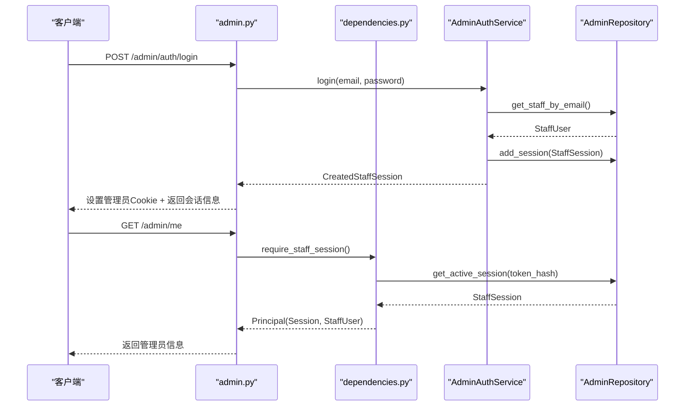
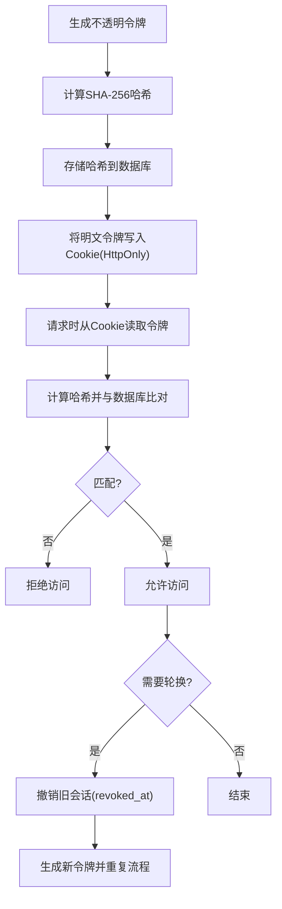
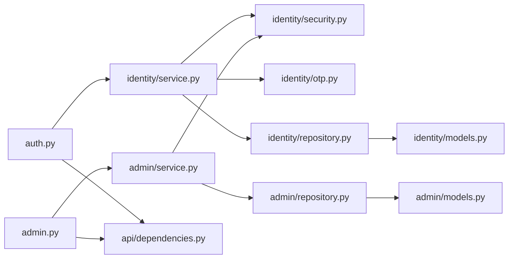

# 身份认证与授权

<cite>
**本文引用的文件**
- [backend/app/api/auth.py](file://backend/app/api/auth.py)
- [backend/app/identity/service.py](file://backend/app/identity/service.py)
- [backend/app/identity/security.py](file://backend/app/identity/security.py)
- [backend/app/identity/models.py](file://backend/app/identity/models.py)
- [backend/app/identity/repository.py](file://backend/app/identity/repository.py)
- [backend/app/identity/otp.py](file://backend/app/identity/otp.py)
- [backend/app/api/guest_sessions.py](file://backend/app/api/guest_sessions.py)
- [backend/app/api/dependencies.py](file://backend/app/api/dependencies.py)
- [backend/app/admin/service.py](file://backend/app/admin/service.py)
- [backend/app/admin/models.py](file://backend/app/admin/models.py)
- [backend/app/admin/repository.py](file://backend/app/admin/repository.py)
- [backend/app/api/admin.py](file://backend/app/api/admin.py)
- [backend/app/identity/cookies.py](file://backend/app/identity/cookies.py)
</cite>

## 目录
1. [简介](#简介)
2. [项目结构](#项目结构)
3. [核心组件](#核心组件)
4. [架构总览](#架构总览)
5. [详细组件分析](#详细组件分析)
6. [依赖关系分析](#依赖关系分析)
7. [性能与安全考量](#性能与安全考量)
8. [故障排查指南](#故障排查指南)
9. [结论](#结论)
10. [附录](#附录)

## 简介
本文件系统性阐述该项目的身份认证与授权机制，覆盖以下主题：
- OTP 登录流程：手机号与邮箱验证码的发送、校验与会话创建
- 会话管理：访客会话、用户设备会话、管理员会话的区别与生命周期
- 权限控制模型：基于角色的访问控制（RBAC）实现、资源级权限检查、中间件拦截
- 令牌安全策略：不透明令牌生成、哈希存储、令牌轮换与撤销
- 流程图与示例：认证序列图、权限检查流程、常见场景实践与安全最佳实践

## 项目结构
后端采用模块化分层设计：API 路由层负责 HTTP 接口；领域服务层封装认证与业务逻辑；仓储层对接数据库模型；安全与工具模块提供令牌、Cookie、OTP 等通用能力。

图表来源
- [backend/app/api/auth.py:1-161](file://backend/app/api/auth.py#L1-L161)
- [backend/app/api/guest_sessions.py:1-53](file://backend/app/api/guest_sessions.py#L1-L53)
- [backend/app/api/admin.py:1-200](file://backend/app/api/admin.py#L1-L200)
- [backend/app/identity/service.py:1-192](file://backend/app/identity/service.py#L1-L192)
- [backend/app/admin/service.py:1-148](file://backend/app/admin/service.py#L1-L148)
- [backend/app/identity/security.py:1-11](file://backend/app/identity/security.py#L1-L11)
- [backend/app/identity/otp.py:1-304](file://backend/app/identity/otp.py#L1-L304)
- [backend/app/identity/cookies.py:1-102](file://backend/app/identity/cookies.py#L1-L102)
- [backend/app/identity/models.py:1-132](file://backend/app/identity/models.py#L1-L132)
- [backend/app/admin/models.py:1-81](file://backend/app/admin/models.py#L1-L81)
- [backend/app/identity/repository.py:1-114](file://backend/app/identity/repository.py#L1-L114)
- [backend/app/admin/repository.py:1-57](file://backend/app/admin/repository.py#L1-L57)

章节来源
- [backend/app/api/auth.py:1-161](file://backend/app/api/auth.py#L1-L161)
- [backend/app/api/guest_sessions.py:1-53](file://backend/app/api/guest_sessions.py#L1-L53)
- [backend/app/api/admin.py:1-200](file://backend/app/api/admin.py#L1-L200)

## 核心组件
- 用户认证服务（AuthService）：负责 OTP 请求、校验、设备会话创建与审计记录
- 访客会话服务（GuestSessionService）：创建短期访客会话并绑定 CSRF
- 管理员认证服务（AdminAuthService）：员工账号密码登录、会话创建与审计
- 安全工具：不透明令牌生成、令牌哈希、HMAC 校验
- OTP 子系统：地址归一化、挑战存储、请求限流、验证码校验
- Cookie 管理：访客/设备/管理员 Cookie 的设置与清理
- 依赖注入与 CSRF：统一校验双提交 CSRF、会话有效性

章节来源
- [backend/app/identity/service.py:1-192](file://backend/app/identity/service.py#L1-L192)
- [backend/app/identity/security.py:1-11](file://backend/app/identity/security.py#L1-L11)
- [backend/app/identity/otp.py:1-304](file://backend/app/identity/otp.py#L1-L304)
- [backend/app/identity/cookies.py:1-102](file://backend/app/identity/cookies.py#L1-L102)
- [backend/app/api/dependencies.py:1-137](file://backend/app/api/dependencies.py#L1-L137)
- [backend/app/admin/service.py:1-148](file://backend/app/admin/service.py#L1-L148)

## 架构总览
系统通过 FastAPI 路由暴露认证相关 API，使用依赖注入完成数据库会话、速率限制器与配置注入。认证流程以“无状态令牌 + 服务端会话表”的方式实现：客户端持有不透明令牌（Cookie），服务端仅保存令牌哈希与元数据，支持撤销与过期。

图表来源
- [backend/app/api/auth.py:44-138](file://backend/app/api/auth.py#L44-L138)
- [backend/app/identity/service.py:100-191](file://backend/app/identity/service.py#L100-L191)
- [backend/app/identity/otp.py:221-304](file://backend/app/identity/otp.py#L221-L304)
- [backend/app/identity/repository.py:48-82](file://backend/app/identity/repository.py#L48-L82)

## 详细组件分析

### OTP 登录流程（手机号/邮箱）
- 地址归一化：手机号按中国大陆规则标准化并脱敏显示；邮箱进行格式校验与小写规范化
- 挑战创建：为每个请求生成唯一 challenge_id，计算验证码 HMAC 哈希并设置 TTL
- 请求限流：三层限流（访客键、网络键、目的地哈希），失败可回滚占用计数
- 验证码下发：调用适配器发送短信/邮件；若不可用则释放挑战并返回 503
- 验证码校验：验证挑战存在、未过期、未超限尝试次数；成功后标记 consumed
- 会话创建：解析或创建用户与登录身份，生成设备会话（不透明令牌+CSRF），写入审计事件
- 响应处理：设置设备 Cookie（HttpOnly、Secure、SameSite=Lax），返回会话元数据

图表来源
- [backend/app/identity/otp.py:183-218](file://backend/app/identity/otp.py#L183-L218)
- [backend/app/identity/otp.py:221-304](file://backend/app/identity/otp.py#L221-L304)
- [backend/app/identity/service.py:100-191](file://backend/app/identity/service.py#L100-L191)
- [backend/app/api/auth.py:44-138](file://backend/app/api/auth.py#L44-L138)

章节来源
- [backend/app/api/auth.py:44-138](file://backend/app/api/auth.py#L44-L138)
- [backend/app/identity/service.py:100-191](file://backend/app/identity/service.py#L100-L191)
- [backend/app/identity/otp.py:183-304](file://backend/app/identity/otp.py#L183-L304)

### 会话管理机制（访客/用户/管理员）
- 访客会话：短期（默认24小时），用于未登录用户的临时上下文与 CSRF；可被认领为用户会话
- 用户设备会话：OTP 登录后创建，携带不透明令牌与 CSRF，支持撤销与过期；每次访问更新 last_seen_at
- 管理员会话：员工账号密码登录，独立会话表与审计；支持角色字段与首次引导初始化（bootstrap）

图表来源
- [backend/app/identity/models.py:68-110](file://backend/app/identity/models.py#L68-L110)
- [backend/app/admin/models.py:17-56](file://backend/app/admin/models.py#L17-L56)

章节来源
- [backend/app/identity/service.py:28-58](file://backend/app/identity/service.py#L28-L58)
- [backend/app/api/guest_sessions.py:16-52](file://backend/app/api/guest_sessions.py#L16-L52)
- [backend/app/admin/service.py:49-89](file://backend/app/admin/service.py#L49-L89)
- [backend/app/identity/models.py:68-110](file://backend/app/identity/models.py#L68-L110)
- [backend/app/admin/models.py:17-56](file://backend/app/admin/models.py#L17-L56)

### 权限控制模型（RBAC、资源级检查、中间件拦截）
- RBAC：管理员角色存储在 staff_users.role，登录时返回并在后续接口中作为权限依据；当前实现提供基础角色字段，可在资源级接口中根据角色进行细粒度控制
- 资源级权限检查：通过依赖注入获取 Owner（用户或访客）或 StaffPrincipal（管理员），在处理器中进行资源归属或角色判断
- 中间件拦截：依赖函数 require_guest_csrf、require_device_csrf、require_owner_csrf、require_staff_csrf 统一校验 CSRF 与会话有效性，防止跨站请求伪造与越权访问

图表来源
- [backend/app/api/admin.py:103-145](file://backend/app/api/admin.py#L103-L145)
- [backend/app/api/admin.py:166-185](file://backend/app/api/admin.py#L166-L185)
- [backend/app/admin/service.py:49-89](file://backend/app/admin/service.py#L49-L89)
- [backend/app/admin/repository.py:42-53](file://backend/app/admin/repository.py#L42-L53)
- [backend/app/api/dependencies.py:68-100](file://backend/app/api/dependencies.py#L68-L100)

章节来源
- [backend/app/api/admin.py:68-100](file://backend/app/api/admin.py#L68-L100)
- [backend/app/api/dependencies.py:87-130](file://backend/app/api/dependencies.py#L87-L130)
- [backend/app/admin/models.py:17-34](file://backend/app/admin/models.py#L17-L34)

### 令牌安全策略（不透明令牌、哈希存储、轮换与撤销）
- 不透明令牌：使用加密安全的随机字符串作为 session token 与 csrf token，避免泄露内部结构
- 哈希存储：所有敏感令牌均以 SHA-256 哈希形式存入数据库，比较时使用哈希值匹配
- 轮换：访客会话创建时可回收旧令牌；设备会话与管理员会话均支持重新颁发新令牌
- 撤销：通过设置 revoked_at 立即失效；登出时清除 Cookie 并记录审计事件

图表来源
- [backend/app/identity/security.py:5-11](file://backend/app/identity/security.py#L5-L11)
- [backend/app/identity/service.py:39-58](file://backend/app/identity/service.py#L39-L58)
- [backend/app/identity/service.py:153-191](file://backend/app/identity/service.py#L153-L191)
- [backend/app/admin/service.py:59-89](file://backend/app/admin/service.py#L59-L89)
- [backend/app/api/auth.py:141-160](file://backend/app/api/auth.py#L141-L160)

章节来源
- [backend/app/identity/security.py:5-11](file://backend/app/identity/security.py#L5-L11)
- [backend/app/identity/service.py:39-58](file://backend/app/identity/service.py#L39-L58)
- [backend/app/identity/service.py:153-191](file://backend/app/identity/service.py#L153-L191)
- [backend/app/admin/service.py:59-89](file://backend/app/admin/service.py#L59-L89)
- [backend/app/api/auth.py:141-160](file://backend/app/api/auth.py#L141-L160)

### 常见认证场景与最佳实践
- 手机号/邮箱验证码登录：遵循地址归一化、挑战 TTL、限流与失败回滚策略，确保高可用与防刷
- 访客认领：验证通过后合并访客会话至用户会话，避免数据丢失
- 管理员登录：启用登录速率限制，记录审计事件，支持 bootstrap 初始化超级管理员（仅限本地/测试环境）
- 安全最佳实践：
  - 始终使用 HttpOnly、Secure、SameSite=Lax 的 Cookie
  - 强制双提交 CSRF 校验，禁止缓存私密响应
  - 令牌仅存哈希，明文仅在内存与 Cookie 中短暂存在
  - 对失败路径进行幂等与回滚，避免资源泄漏与误限流

章节来源
- [backend/app/api/auth.py:44-138](file://backend/app/api/auth.py#L44-L138)
- [backend/app/api/guest_sessions.py:16-52](file://backend/app/api/guest_sessions.py#L16-L52)
- [backend/app/api/admin.py:103-163](file://backend/app/api/admin.py#L103-L163)
- [backend/app/identity/cookies.py:12-102](file://backend/app/identity/cookies.py#L12-L102)
- [backend/app/api/dependencies.py:29-130](file://backend/app/api/dependencies.py#L29-L130)

## 依赖关系分析
- API 路由依赖服务层：auth.py -> AuthService；admin.py -> AdminAuthService
- 服务层依赖安全与 OTP：AuthService -> security.py、otp.py；AdminAuthService -> security.py
- 服务层依赖仓储层：AuthService -> IdentityRepository；AdminAuthService -> AdminRepository
- 仓储层依赖模型：IdentityRepository -> identity/models.py；AdminRepository -> admin/models.py
- 依赖注入与 CSRF：dependencies.py 提供 require_* 系列依赖，统一鉴权与防护

图表来源
- [backend/app/api/auth.py:1-161](file://backend/app/api/auth.py#L1-L161)
- [backend/app/api/admin.py:1-200](file://backend/app/api/admin.py#L1-L200)
- [backend/app/identity/service.py:1-192](file://backend/app/identity/service.py#L1-L192)
- [backend/app/admin/service.py:1-148](file://backend/app/admin/service.py#L1-L148)
- [backend/app/identity/security.py:1-11](file://backend/app/identity/security.py#L1-L11)
- [backend/app/identity/otp.py:1-304](file://backend/app/identity/otp.py#L1-L304)
- [backend/app/identity/repository.py:1-114](file://backend/app/identity/repository.py#L1-L114)
- [backend/app/admin/repository.py:1-57](file://backend/app/admin/repository.py#L1-L57)
- [backend/app/identity/models.py:1-132](file://backend/app/identity/models.py#L1-L132)
- [backend/app/admin/models.py:1-81](file://backend/app/admin/models.py#L1-L81)
- [backend/app/api/dependencies.py:1-137](file://backend/app/api/dependencies.py#L1-L137)

章节来源
- [backend/app/api/auth.py:1-161](file://backend/app/api/auth.py#L1-L161)
- [backend/app/api/admin.py:1-200](file://backend/app/api/admin.py#L1-L200)
- [backend/app/identity/service.py:1-192](file://backend/app/identity/service.py#L1-L192)
- [backend/app/admin/service.py:1-148](file://backend/app/admin/service.py#L1-L148)

## 性能与安全考量
- 性能
  - 限流器使用内存窗口统计，适合本地/测试；生产应替换为 Redis 实现以支持分布式限流
  - 挑战存储使用内存字典，生产需替换为带 TTL 的键值存储（如 Redis）
  - 数据库查询使用索引优化（如 expires_at、user_id、token_hash）
- 安全
  - 令牌不透明且仅哈希存储，降低泄露风险
  - 双提交 CSRF 校验，防止跨站请求伪造
  - Cookie 设置 HttpOnly、Secure、SameSite=Lax，减少 XSS 与跨域攻击面
  - 审计事件记录关键操作，便于追踪与合规

[本节为通用指导，无需具体文件引用]

## 故障排查指南
- 验证码无法下发（503）
  - 检查 OTP 适配器是否可用；若失败会释放挑战并回滚限流占用
  - 参考：下发失败的回滚逻辑与异常抛出
- 验证码校验失败（400/429）
  - 检查挑战是否过期、尝试次数是否超限；确认 HMAC 校验一致
  - 参考：挑战验证与尝试计数逻辑
- CSRF 校验失败（403）
  - 确认 Cookie 与 Header 中的 x-csrf-token 一致，且与服务器端哈希匹配
  - 参考：双提交 CSRF 校验流程
- 会话无效（401）
  - 检查 Cookie 是否存在、是否过期或被撤销；确认数据库中存在有效会话
  - 参考：会话依赖注入与查询逻辑
- 管理员登录受限（429）
  - 检查登录速率限制器配置与触发条件
  - 参考：管理员登录限流与错误提示

章节来源
- [backend/app/identity/service.py:100-191](file://backend/app/identity/service.py#L100-L191)
- [backend/app/identity/otp.py:221-304](file://backend/app/identity/otp.py#L221-L304)
- [backend/app/api/dependencies.py:29-130](file://backend/app/api/dependencies.py#L29-L130)
- [backend/app/api/admin.py:56-65](file://backend/app/api/admin.py#L56-L65)

## 结论
本项目实现了稳健的 OTP 认证与会话管理机制，结合不透明令牌、哈希存储与 CSRF 防护，提供了访客、用户与管理员三类会话的生命周期管理。RBAC 在管理员侧具备基础角色字段，可在资源级接口中扩展细粒度权限控制。建议在生产环境中将内存式限流与挑战存储替换为分布式实现，并持续完善审计与监控，以提升安全性与可观测性。

[本节为总结，无需具体文件引用]

## 附录
- 常用接口路径
  - 用户认证：POST /auth/otp/request、POST /auth/otp/verify、POST /auth/logout
  - 访客会话：POST /guest-sessions
  - 管理员认证：POST /admin/auth/login、GET /admin/me、POST /admin/auth/logout
- 关键配置项
  - OTP 冷却时间、设备会话天数、管理员会话时长、登录速率限制窗口与上限
- 安全清单
  - 启用 Secure Cookie、HttpOnly、SameSite=Lax
  - 强制 CSRF 双提交校验
  - 令牌仅存哈希，明文不落地
  - 记录审计事件，定期审查

[本节为补充信息，无需具体文件引用]