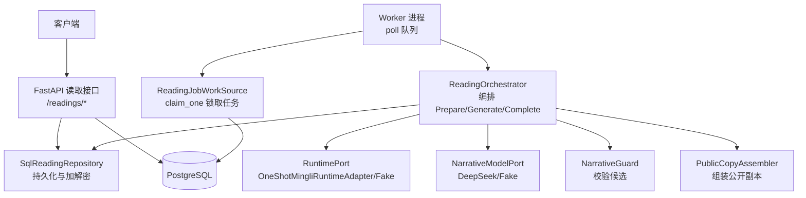
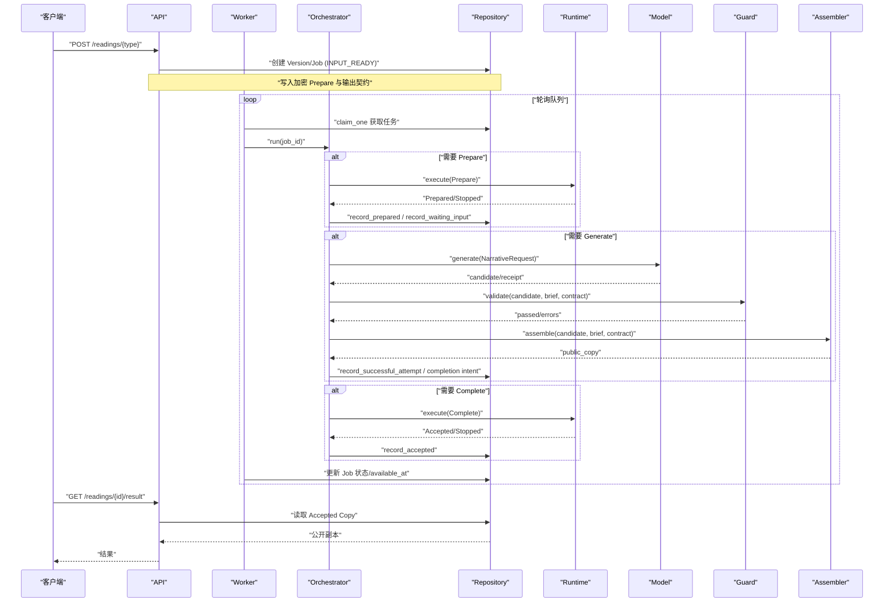
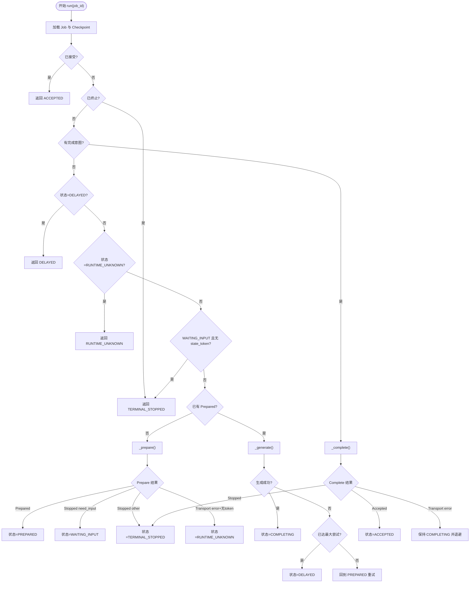
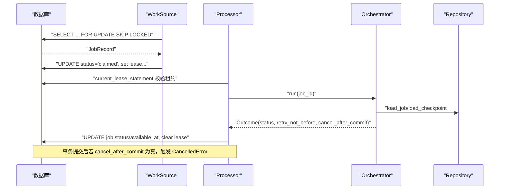
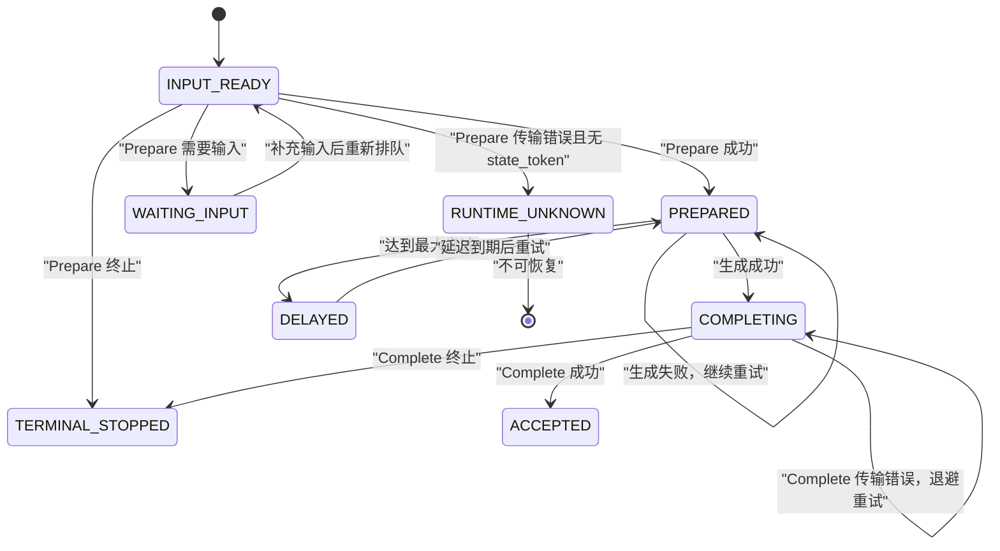
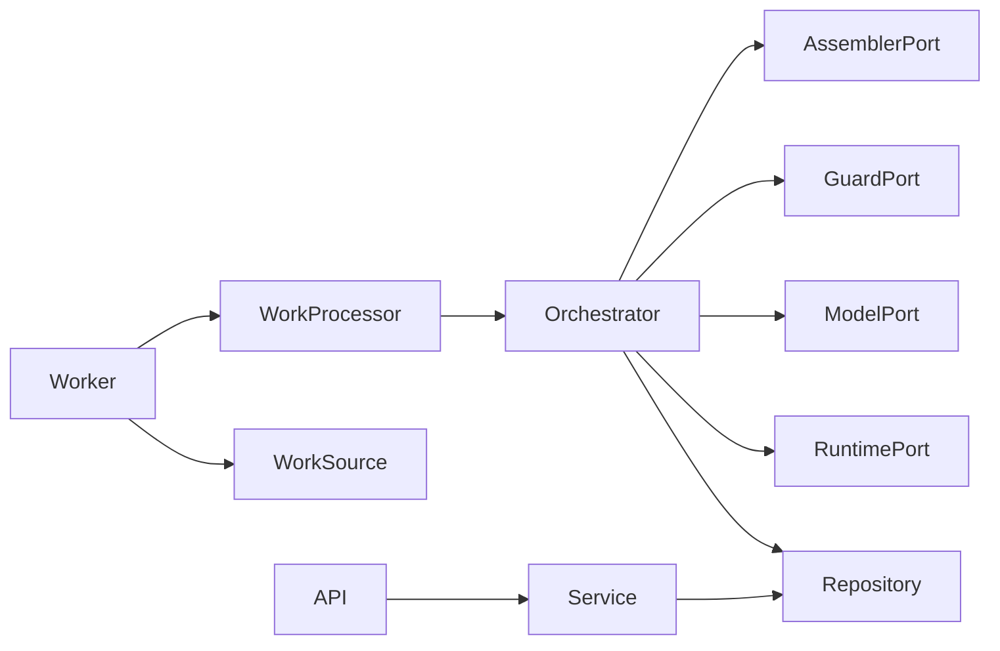

# 异步任务流程

<cite>
**本文引用的文件**   
- [orchestrator.py](file://backend/app/readings/orchestrator.py)
- [readings.py](file://backend/worker/readings.py)
- [main.py](file://backend/worker/main.py)
- [status.py](file://backend/app/readings/status.py)
- [repository.py](file://backend/app/readings/repository.py)
- [models.py](file://backend/app/readings/models.py)
- [runtime_contracts.py](file://backend/app/readings/runtime_contracts.py)
- [runtime.py](file://backend/app/adapters/runtime.py)
- [readings_api.py](file://backend/app/api/readings.py)
</cite>

## 目录
1. [简介](#简介)
2. [项目结构](#项目结构)
3. [核心组件](#核心组件)
4. [架构总览](#架构总览)
5. [详细组件分析](#详细组件分析)
6. [依赖关系分析](#依赖关系分析)
7. [性能与可靠性](#性能与可靠性)
8. [故障排查指南](#故障排查指南)
9. [结论](#结论)
10. [附录：状态机与流程图](#附录状态机与流程图)

## 简介
本文件面向 Mingli Web 项目的“命理解读”异步任务流程，聚焦于 ReadingOrchestrator 的工作流、Worker 进程的任务调度与执行、任务状态机设计（INPUT_READY、PREPARED、COMPLETING、ACCEPTED 等）、重试与超时处理、异常恢复策略，并通过流程图与状态转换图展示复杂业务场景的异步处理过程。文档同时给出关键实现路径以便读者定位代码细节。

## 项目结构
后端采用“API 服务 + Worker 进程”的解耦架构：
- API 服务负责接收用户请求、创建解读版本与任务、查询结果与状态。
- Worker 进程从数据库队列中领取任务，调用 ReadingOrchestrator 推进任务，通过 Repository 持久化检查点，并驱动外部 Runtime 与模型生成。

**图表来源**
- [readings_api.py:87-399](file://backend/app/api/readings.py#L87-L399)
- [readings.py:63-286](file://backend/worker/readings.py#L63-L286)
- [orchestrator.py:178-450](file://backend/app/readings/orchestrator.py#L178-L450)
- [runtime.py:605-756](file://backend/app/adapters/runtime.py#L605-L756)

**章节来源**
- [readings_api.py:87-399](file://backend/app/api/readings.py#L87-L399)
- [readings.py:63-286](file://backend/worker/readings.py#L63-L286)
- [orchestrator.py:178-450](file://backend/app/readings/orchestrator.py#L178-L450)
- [runtime.py:605-756](file://backend/app/adapters/runtime.py#L605-L756)

## 核心组件
- ReadingOrchestrator：任务编排器，负责 Prepare → Generate → Complete 的完整生命周期管理，维护检查点与重试逻辑。
- SqlReadingRepository：数据访问层，负责加解密存储、状态迁移、尝试记录、完成意图与已接受副本的持久化。
- Worker 与 WorkSource/Processor：从数据库队列中安全地 claim 任务，使用租约与 fencing token 保证并发安全，调用 Orchestrator 推进任务。
- RuntimePort/NarrativeModelPort：对外部运行时与模型的抽象，支持真实 One-Shot 进程与测试 Fake。
- Status：统一的状态枚举，贯穿任务状态机。

**章节来源**
- [orchestrator.py:43-189](file://backend/app/readings/orchestrator.py#L43-L189)
- [repository.py:51-730](file://backend/app/readings/repository.py#L51-L730)
- [readings.py:108-286](file://backend/worker/readings.py#L108-L286)
- [status.py:1-13](file://backend/app/readings/status.py#L1-L13)

## 架构总览
任务从 API 创建到最终 ACCEPTED 的关键路径如下：
1. API 创建 ReadingVersion 与 Job，初始状态为 INPUT_READY。
2. Worker 周期性 poll，claim 一个可执行任务（queued/claimed 过期）。
3. Orchestrator.run 根据检查点决定下一步：
   - 若存在已完成或终止状态，直接返回；
   - 若处于 WAITING_INPUT 且无 state_token，则视为不可恢复，标记 RUNTIME_UNKNOWN；
   - 否则进入 _prepare → _generate → _complete 的流水线。
4. _prepare 调用 Runtime.execute(Prepare)，成功则记录 Prepared 并进入 PREPARED；如需输入则记录 WaitingInput；失败或未知则进入 DELAYED/RUNTIME_UNKNOWN。
5. _generate 调用模型生成，经过 Guard 校验与 PublicCopyAssembler 组装，成功后记录 Attempt 与 CompletionIntent，进入 COMPLETING；失败则记录 Attempt 并根据 max_attempts 决定是否延迟。
6. _complete 调用 Runtime.execute(Complete)，成功后记录 Accepted 并进入 ACCEPTED；传输错误时保持 COMPLETING 并重试。

**图表来源**
- [readings_api.py:87-399](file://backend/app/api/readings.py#L87-L399)
- [readings.py:121-218](file://backend/worker/readings.py#L121-L218)
- [orchestrator.py:212-450](file://backend/app/readings/orchestrator.py#L212-L450)
- [repository.py:448-730](file://backend/app/readings/repository.py#L448-L730)
- [runtime.py:605-756](file://backend/app/adapters/runtime.py#L605-L756)

## 详细组件分析

### ReadingOrchestrator 工作流
- 入口 run(job_id)：加载 Job 与 Checkpoint，按优先级判断是否已接受、终止、等待输入、延迟或运行未知，然后选择 _prepare/_generate/_complete。
- _prepare：调用 Runtime.execute(Prepare)。若返回 Prepared，记录 Prepared 并进入 PREPARED；若 Stopped.reason=need_input，记录 WaitingInput；若无 state_token 且传输错误，标记 RUNTIME_UNKNOWN 并告警；其他情况抛出不变量错误。
- _generate：构造 NarrativeRequest，调用模型生成，关闭候选引用，Guard 校验，组装公开副本。失败时记录 Attempt 与错误类型；达到 max_attempts 后标记 DELAYED 并告警；成功则记录 SuccessfulAttempt 与 CompletionIntent，进入 COMPLETING。
- _complete：调用 Runtime.execute(Complete)。若 Accepted 且 state_token/public_copy 一致，记录 Accepted 并进入 ACCEPTED；若 Stopped，记录终止；若传输错误，保持 COMPLETING 并设置 retry_not_before 以退避重试。

**图表来源**
- [orchestrator.py:212-450](file://backend/app/readings/orchestrator.py#L212-L450)

**章节来源**
- [orchestrator.py:212-450](file://backend/app/readings/orchestrator.py#L212-L450)

### Worker 进程的任务调度、执行与监控
- 任务领取：ReadingJobWorkSource.claim_one 使用 SELECT ... FOR UPDATE SKIP LOCKED 锁定一条 queued 或 claimed 过期的任务，分配 lease_owner/lease_token/lease_expires_at，并返回 WorkItem。
- 任务执行：ReadingJobProcessor.process 在事务内验证当前租约（fencing token），调用 Orchestrator.run 得到 Outcome，映射为 Job 状态并更新 available_at。若 Outcome.cancel_after_commit 为真，提交后主动取消任务。
- 监控与告警：Orchestrator 内部通过 AlertSink 发出告警事件（如 delayed、guard_rejection、model_cost、runtime_unknown），便于运维观测。

**图表来源**
- [readings.py:63-218](file://backend/worker/readings.py#L63-L218)

**章节来源**
- [readings.py:63-218](file://backend/worker/readings.py#L63-L218)

### 任务状态机设计
系统使用 ReadingStatus 定义任务状态，并在 Repository 与 Worker 之间保持一致映射：
- INPUT_READY：初始状态，等待 Worker 调度。
- WAITING_INPUT：需要用户提供输入。
- TERMINAL_STOPPED：运行时终止，不可恢复。
- PREPARED：Prepare 成功，等待模型生成。
- COMPLETING：生成成功，等待 Complete 确认。
- ACCEPTED：Complete 成功，结果已接受。
- DELAYED：达到最大尝试或需要延迟重试。
- RUNTIME_UNKNOWN：Prepare 无 state_token 且传输错误，无法安全重放。

**图表来源**
- [status.py:1-13](file://backend/app/readings/status.py#L1-L13)
- [repository.py:556-730](file://backend/app/readings/repository.py#L556-L730)
- [readings.py:175-231](file://backend/worker/readings.py#L175-L231)

**章节来源**
- [status.py:1-13](file://backend/app/readings/status.py#L1-L13)
- [repository.py:556-730](file://backend/app/readings/repository.py#L556-L730)
- [readings.py:175-231](file://backend/worker/readings.py#L175-L231)

### 任务重试机制、超时处理与异常恢复
- 重试与退避：
  - Prepare 阶段：若发生 RuntimeTransportError 且 prepare_command.state_token 不为空，返回 INPUT_READY 并设置 retry_not_before（基于 prepare_transport_backoff）；若无 state_token，标记 RUNTIME_UNKNOWN。
  - Generate 阶段：每次失败记录 GenerationAttempt，达到 max_attempts 后标记 DELAYED；成功则记录 SuccessfulAttempt 并进入 COMPLETING。
  - Complete 阶段：若发生 RuntimeTransportError，保持 COMPLETING 并设置 retry_not_before（基于 complete_transport_backoff），下次重试会携带相同的 state_token 与 public_copy。
- 超时与资源限制：
  - Runtime 适配器对子进程通信设置 stdin/stdout/stderr 大小上限，超时会抛出 RuntimeTransportError；超时后杀死进程组。
  - Worker 轮询间隔默认 2 秒，可通过参数调整。
- 异常恢复：
  - 所有关键状态变更均通过 Repository 持久化，确保崩溃后可从检查点恢复。
  - 使用数据库行级锁与 fencing token 避免重复处理。
  - 对于 Completed 的幂等性，AcceptedCopy 仅允许首次写入，后续写入会被拒绝。

**章节来源**
- [orchestrator.py:250-435](file://backend/app/readings/orchestrator.py#L250-L435)
- [runtime.py:546-707](file://backend/app/adapters/runtime.py#L546-L707)
- [repository.py:616-716](file://backend/app/readings/repository.py#L616-L716)
- [readings.py:121-218](file://backend/worker/readings.py#L121-L218)

### 具体代码示例说明（路径指引）
- 任务编排主流程：[orchestrator.py:212-450](file://backend/app/readings/orchestrator.py#L212-L450)
- 准备阶段 Prepare 调用与检查点记录：[orchestrator.py:250-285](file://backend/app/readings/orchestrator.py#L250-L285), [repository.py:584-614](file://backend/app/readings/repository.py#L584-L614)
- 生成阶段模型调用与校验：[orchestrator.py:287-394](file://backend/app/readings/orchestrator.py#L287-L394), [repository.py:616-659](file://backend/app/readings/repository.py#L616-L659)
- 完成阶段 Complete 与幂等接受：[orchestrator.py:396-435](file://backend/app/readings/orchestrator.py#L396-L435), [repository.py:674-716](file://backend/app/readings/repository.py#L674-L716)
- Worker 任务领取与执行：[readings.py:121-218](file://backend/worker/readings.py#L121-L218)
- 运行时适配器超时与 I/O 限制：[runtime.py:546-707](file://backend/app/adapters/runtime.py#L546-L707)

## 依赖关系分析
- Orchestrator 依赖：
  - Repository：读写检查点、尝试记录、完成意图与已接受副本。
  - RuntimePort：执行 Prepare/Complete。
  - NarrativeModelPort：生成候选文本。
  - NarrativeGuardPort：校验候选是否符合约束。
  - PublicCopyAssemblerPort：组装公开副本。
  - Clock/AlertSink：时间戳与告警。
- Worker 依赖：
  - WorkSource：从数据库安全领取任务。
  - WorkProcessor：封装 Orchestrator 调用与状态更新。
- API 依赖：
  - Service（未在本节展开）：创建版本与任务、提供输入与查询结果。
  - RateGuard：限流保护。

**图表来源**
- [orchestrator.py:178-189](file://backend/app/readings/orchestrator.py#L178-L189)
- [readings.py:164-286](file://backend/worker/readings.py#L164-L286)
- [readings_api.py:45-85](file://backend/app/api/readings.py#L45-L85)

**章节来源**
- [orchestrator.py:178-189](file://backend/app/readings/orchestrator.py#L178-L189)
- [readings.py:164-286](file://backend/worker/readings.py#L164-L286)
- [readings_api.py:45-85](file://backend/app/api/readings.py#L45-L85)

## 性能与可靠性
- 并发安全：
  - 使用 PostgreSQL 的 SELECT ... FOR UPDATE SKIP LOCKED 避免多 Worker 争抢同一任务。
  - 使用 lease_owner/lease_token/lease_generation 进行 fencing，防止旧 Worker 覆盖新任务。
- 幂等性与一致性：
  - AcceptedCopy 仅允许首次写入，后续写入被拒绝，确保结果唯一。
  - 所有敏感数据（Prepare、Brief、Candidate、AcceptedCopy）通过 EnvelopeCipher 加密存储。
- 超时与资源保护：
  - Runtime 子进程通信设置严格的大小限制与超时，避免内存耗尽与长时间阻塞。
- 可观测性：
  - 告警事件包括 delayed、guard_rejection、model_cost、runtime_unknown，便于监控与排障。

**章节来源**
- [readings.py:63-105](file://backend/worker/readings.py#L63-L105)
- [repository.py:674-716](file://backend/app/readings/repository.py#L674-L716)
- [runtime.py:546-707](file://backend/app/adapters/runtime.py#L546-L707)
- [orchestrator.py:196-210](file://backend/app/readings/orchestrator.py#L196-L210)

## 故障排查指南
- 常见错误与处理：
  - RuntimeTransportError：检查运行时进程是否启动成功、I/O 是否超限、是否超时；查看告警 runtime_unknown。
  - Guard rejection：检查候选文本是否符合输出契约与叙事约束；关注 guard_rejection 告警中的错误列表。
  - Max attempts reached：任务进入 DELAYED，需检查模型稳定性与输入质量；关注 delayed 告警。
  - Lease lost：Worker 并发冲突导致租约失效，通常自动重试；检查数据库锁与网络抖动。
- 排查步骤：
  - 查看 ReadingVersion 与 ReadingJobRecord 的状态与 available_at。
  - 检查 GenerationAttempt 的错误列表与 model_receipt。
  - 核对 AcceptedCopy 是否存在且与预期一致。
  - 审查告警事件与日志，定位具体阶段失败原因。

**章节来源**
- [orchestrator.py:301-394](file://backend/app/readings/orchestrator.py#L301-L394)
- [repository.py:616-716](file://backend/app/readings/repository.py#L616-L716)
- [readings.py:175-231](file://backend/worker/readings.py#L175-L231)

## 结论
Mingli Web 的命理解读异步任务通过 ReadingOrchestrator 实现了清晰、健壮且可恢复的编排流程。结合 Worker 的安全任务领取、Repository 的加密持久化与幂等控制、以及 Runtime/Model 的超时与限制，系统在复杂业务场景下具备高可靠性与可观测性。状态机设计覆盖了正常流程与异常分支，重试与退避机制确保了任务的最终完成。

## 附录：状态机与流程图
- 状态机图见前文“任务状态机设计”。
- 流程图见前文“架构总览”与“ReadingOrchestrator 工作流”。