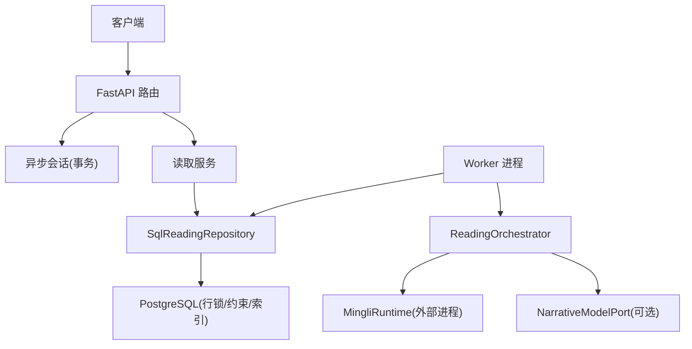
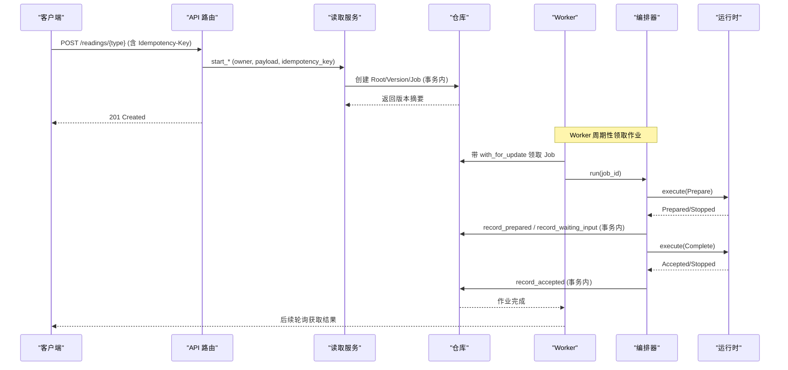
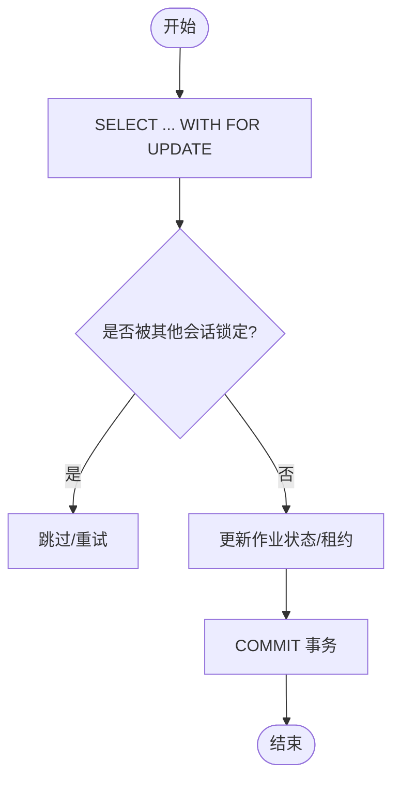
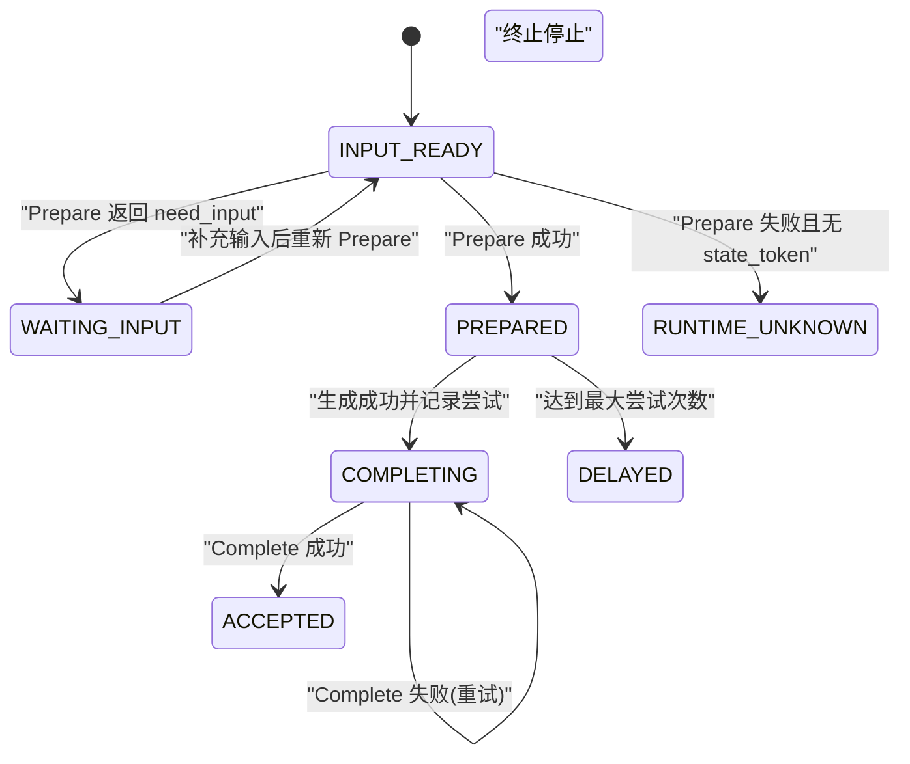
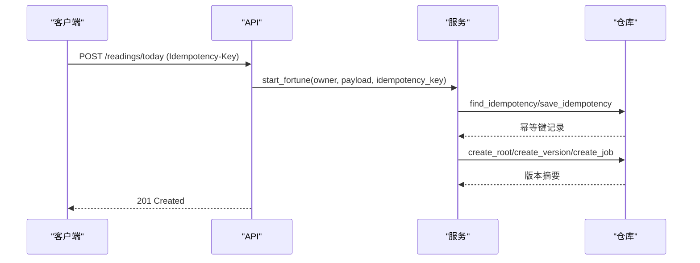
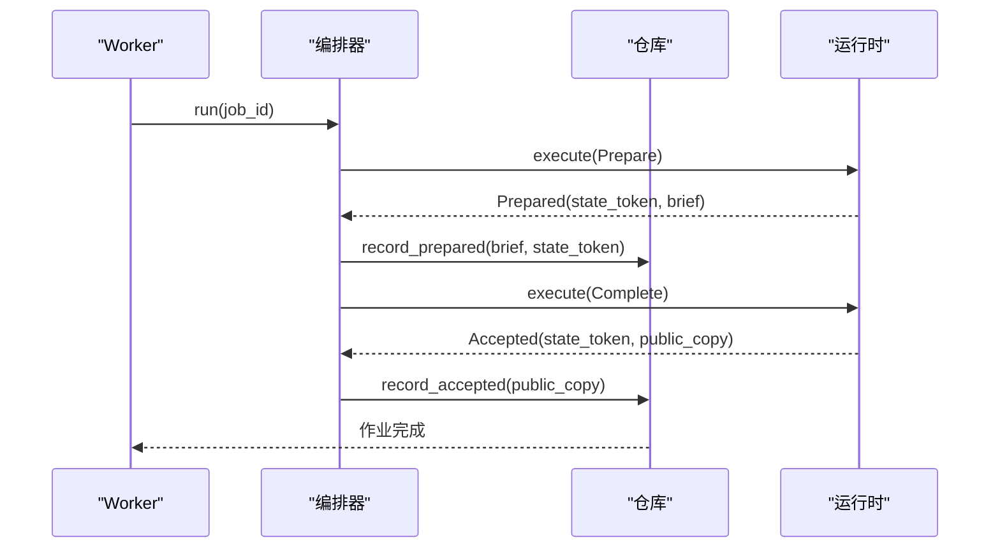
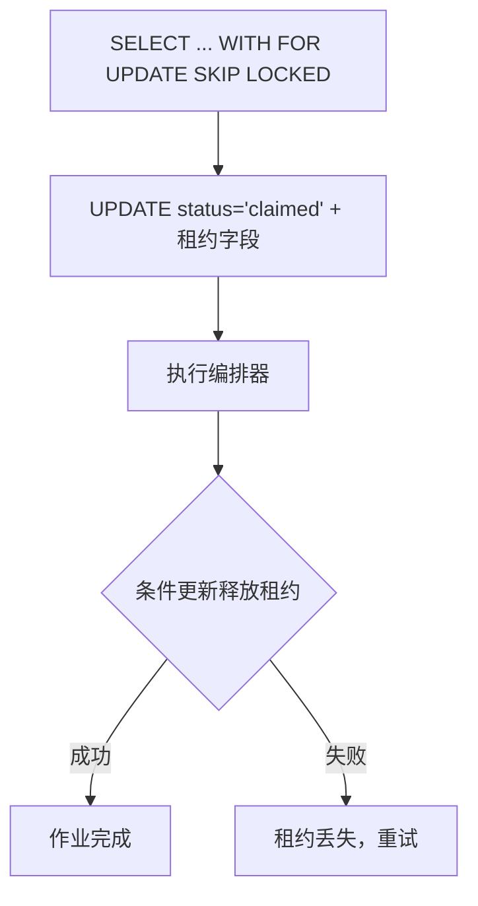
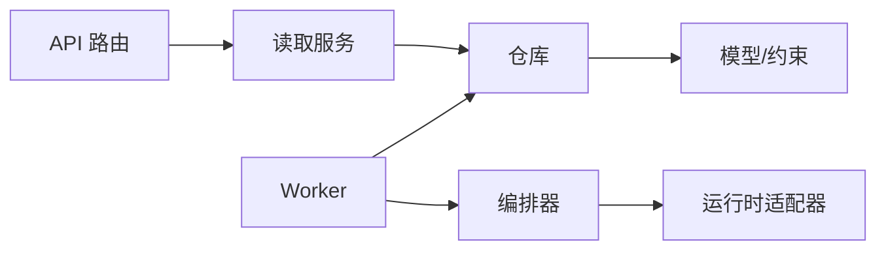
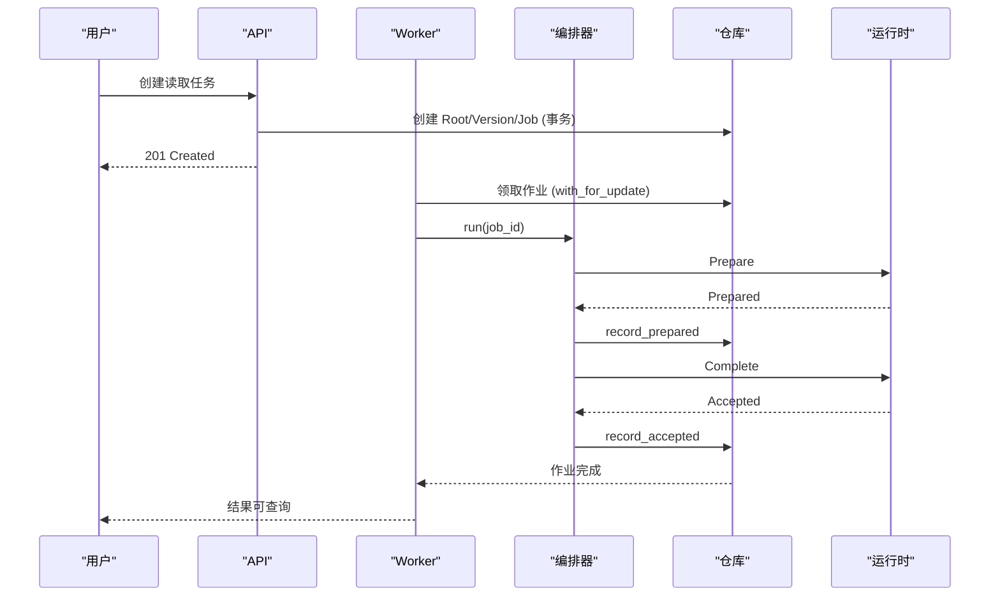

# 数据一致性保障

<cite>
**本文引用的文件**
- [backend/app/readings/orchestrator.py](file://backend/app/readings/orchestrator.py)
- [backend/app/readings/repository.py](file://backend/app/readings/repository.py)
- [backend/app/readings/models.py](file://backend/app/readings/models.py)
- [backend/app/readings/status.py](file://backend/app/readings/status.py)
- [backend/app/readings/runtime_contracts.py](file://backend/app/readings/runtime_contracts.py)
- [backend/app/adapters/runtime.py](file://backend/app/adapters/runtime.py)
- [backend/worker/readings.py](file://backend/worker/readings.py)
- [backend/app/database.py](file://backend/app/database.py)
- [backend/app/persistence.py](file://backend/app/persistence.py)
- [backend/app/api/dependencies.py](file://backend/app/api/dependencies.py)
- [backend/app/api/readings.py](file://backend/app/api/readings.py)
</cite>

## 目录
1. [简介](#简介)
2. [项目结构](#项目结构)
3. [核心组件](#核心组件)
4. [架构总览](#架构总览)
5. [详细组件分析](#详细组件分析)
6. [依赖关系分析](#依赖关系分析)
7. [性能与可扩展性](#性能与可扩展性)
8. [故障排查指南](#故障排查指南)
9. [结论](#结论)
10. [附录：关键流程图示](#附录关键流程图示)

## 简介
本文件聚焦 Mingli Web 后端在“命理解读”工作流中的数据一致性与完整性保障。系统通过数据库事务边界、行级锁、幂等键、不可变记录、状态机与补偿机制，确保跨进程（Web 服务 + Worker）和跨外部运行时（Mingli Runtime）的调用具备可重入、可恢复、可审计的一致性保证。文档同时覆盖分布式环境下的最终一致性策略（重试、延迟队列、幂等）、并发控制（锁、版本号、冲突检测）以及输入校验与契约验证。

## 项目结构
- Web API 层负责鉴权、限流、请求校验，并在事务中创建或推进读取任务。
- Worker 进程从数据库领取任务，使用带租约的行级锁避免重复处理。
- 编排器 Orchestrator 驱动 Prepare/Complete 两阶段流程，持久化检查点并处理失败重试。
- 仓库 Repository 封装所有数据库访问，使用 with_for_update、唯一约束、CheckConstraint 与不可变模型事件，确保强一致与防篡改。
- 运行时适配器将命令序列化到外部进程执行，并通过启动门控校验发布包完整性。



**图表来源**
- [backend/app/api/readings.py:87-399](file://backend/app/api/readings.py#L87-L399)
- [backend/app/api/dependencies.py:19-26](file://backend/app/api/dependencies.py#L19-L26)
- [backend/worker/readings.py:121-218](file://backend/worker/readings.py#L121-L218)
- [backend/app/readings/orchestrator.py:212-435](file://backend/app/readings/orchestrator.py#L212-L435)
- [backend/app/adapters/runtime.py:605-707](file://backend/app/adapters/runtime.py#L605-L707)

**章节来源**
- [backend/app/api/readings.py:87-399](file://backend/app/api/readings.py#L87-L399)
- [backend/app/api/dependencies.py:19-26](file://backend/app/api/dependencies.py#L19-L26)
- [backend/worker/readings.py:121-218](file://backend/worker/readings.py#L121-L218)
- [backend/app/readings/orchestrator.py:212-435](file://backend/app/readings/orchestrator.py#L212-L435)
- [backend/app/adapters/runtime.py:605-707](file://backend/app/adapters/runtime.py#L605-L707)

## 核心组件
- 数据库会话与事务：统一提供 AsyncSession 并在异常时回滚，确保写操作原子性。
- 读取版本与作业：ReadingVersion 与 ReadingJobRecord 构成主数据与工作项，配合状态枚举与索引实现有序流转。
- 编排器：以检查点驱动 Prepare→生成→Complete→Accepted 的状态机，支持中断恢复与重试。
- 仓库：集中实现加锁、幂等、不可变记录、加密载荷与校验。
- 运行时适配：对外部进程进行安全启动、协议校验、超时与资源限制，并将错误映射为可重试的传输错误。

**章节来源**
- [backend/app/database.py:12-32](file://backend/app/database.py#L12-L32)
- [backend/app/readings/models.py:53-378](file://backend/app/readings/models.py#L53-L378)
- [backend/app/readings/status.py:4-13](file://backend/app/readings/status.py#L4-L13)
- [backend/app/readings/orchestrator.py:178-435](file://backend/app/readings/orchestrator.py#L178-L435)
- [backend/app/readings/repository.py:51-800](file://backend/app/readings/repository.py#L51-L800)
- [backend/app/adapters/runtime.py:605-707](file://backend/app/adapters/runtime.py#L605-L707)

## 架构总览
系统采用“Web 发起 + Worker 执行 + 外部运行时计算”的分层架构。一致性由以下机制共同保障：
- 事务边界：API 层与 Worker 层均以 session.begin() 包裹关键路径，异常自动回滚。
- 并发控制：with_for_update 行级锁、唯一约束、CheckConstraint、租约令牌与 generation 号。
- 幂等与去重：Idempotency-Key 与 owner 维度唯一约束，防止重复提交。
- 状态机与检查点：ReadingStatus 明确定义各阶段；Orchestrator 基于 checkpoint 决定下一步。
- 最终一致性：Prepare/Complete 两阶段，Complete 失败会标记 COMPLETING 并重试；无 state_token 的 Prepare 失败进入 RUNTIME_UNKNOWN 等待修复。
- 输入与契约校验：JSON Schema 校验命令/结果，字段冻结与类型转换，非法数据直接拒绝。



**图表来源**
- [backend/app/api/readings.py:87-237](file://backend/app/api/readings.py#L87-L237)
- [backend/worker/readings.py:121-218](file://backend/worker/readings.py#L121-L218)
- [backend/app/readings/orchestrator.py:212-435](file://backend/app/readings/orchestrator.py#L212-L435)
- [backend/app/adapters/runtime.py:605-707](file://backend/app/adapters/runtime.py#L605-L707)

## 详细组件分析

### 事务边界与 ACID 保证
- 会话管理：Database 提供 AsyncEngine 与 session 工厂，API 通过依赖注入在每个请求生命周期内提供会话，异常时回滚。
- 显式事务：Worker 使用 session.begin() 包裹领取、处理、释放租约的全流程；API 在成功路径后 commit。
- 原子写入：仓库方法在单个会话中组合多次 flush，结合数据库约束保证原子性。
- 隔离级别：通过 PostgreSQL 的 with_for_update 实现行级排他锁，避免并发写冲突。
- 一致性：所有写路径均遵循“先持久化检查点，再推进状态”的原则，崩溃后可从检查点恢复。

**章节来源**
- [backend/app/database.py:12-32](file://backend/app/database.py#L12-L32)
- [backend/app/api/dependencies.py:19-26](file://backend/app/api/dependencies.py#L19-L26)
- [backend/worker/readings.py:175-218](file://backend/worker/readings.py#L175-L218)
- [backend/app/readings/repository.py:120-167](file://backend/app/readings/repository.py#L120-L167)

### 并发控制策略
- 行级锁：create_version 对 ReadingRoot 加 with_for_update，确保版本分配串行化。
- 作业领用：Worker 使用 with_for_update(skip_locked=True) 竞争领取作业，避免多实例重复消费。
- 租约与 fencing：作业记录包含 lease_owner、lease_token、lease_generation 与 lease_expires_at，更新时必须匹配全部字段，否则视为租约丢失。
- 唯一约束与检查约束：ReadingVersions、GenerationAttempts、AcceptedCopies、FactBriefs 等表通过唯一约束与 CheckConstraint 防止重复与非法状态。
- 不可变记录：对 FactBrief、GenerationAttempt、AcceptedCopy、RuntimeRelease 注册 before_update 事件，阻止修改已插入记录。



**图表来源**
- [backend/app/readings/repository.py:44-48](file://backend/app/readings/repository.py#L44-L48)
- [backend/worker/readings.py:63-82](file://backend/worker/readings.py#L63-L82)
- [backend/worker/readings.py:175-218](file://backend/worker/readings.py#L175-L218)
- [backend/app/readings/models.py:188-245](file://backend/app/readings/models.py#L188-L245)

**章节来源**
- [backend/app/readings/repository.py:44-48](file://backend/app/readings/repository.py#L44-L48)
- [backend/worker/readings.py:63-82](file://backend/worker/readings.py#L63-L82)
- [backend/worker/readings.py:175-218](file://backend/worker/readings.py#L175-L218)
- [backend/app/readings/models.py:188-245](file://backend/app/readings/models.py#L188-L245)
- [backend/app/readings/models.py:370-378](file://backend/app/readings/models.py#L370-L378)

### 分布式同步与最终一致性
- 两阶段提交语义：Prepare 成功后持久化 brief 与 state_token；Complete 携带相同 token 与 public_copy，若失败则保持 COMPLETING 并指数退避重试。
- 幂等与可重入：Complete 使用 state_token 作为幂等键；AcceptedCopy 仅允许首次写入，后续重复写入会被拒绝。
- 失败恢复：
  - Prepare 传输错误且无 state_token 时，置为 RUNTIME_UNKNOWN，等待人工或调度修复。
  - Complete 传输错误时，保持 COMPLETING，下次重试精确回放同一 token 与副本。
- 延迟与重试：当尝试次数耗尽或需要冷却，作业状态置为 DELAYED，并设置 available_at 延迟重试。



**图表来源**
- [backend/app/readings/status.py:4-13](file://backend/app/readings/status.py#L4-L13)
- [backend/app/readings/orchestrator.py:212-435](file://backend/app/readings/orchestrator.py#L212-L435)
- [backend/app/readings/repository.py:661-716](file://backend/app/readings/repository.py#L661-L716)

**章节来源**
- [backend/app/readings/orchestrator.py:212-435](file://backend/app/readings/orchestrator.py#L212-L435)
- [backend/app/readings/repository.py:661-716](file://backend/app/readings/repository.py#L661-L716)
- [backend/app/readings/status.py:4-13](file://backend/app/readings/status.py#L4-L13)

### 数据校验与验证机制
- JSON Schema 校验：命令与结果在构造时按 schema 校验，非法结构直接抛出契约错误。
- 数据冻结：对象内部使用不可变映射与元组，防止意外修改。
- 输入合法性：API 层对请求体进行 Pydantic/Schema 校验；仓库层对 horizon、dimension_ids 等字段做类型与存在性检查。
- 安全载荷：敏感字段（prepare/brief/candidate/public_copy/state_token）通过信封加密存储，附带指纹用于完整性校验。

**章节来源**
- [backend/app/readings/runtime_contracts.py:27-71](file://backend/app/readings/runtime_contracts.py#L27-L71)
- [backend/app/readings/runtime_contracts.py:113-152](file://backend/app/readings/runtime_contracts.py#L113-L152)
- [backend/app/readings/repository.py:120-167](file://backend/app/readings/repository.py#L120-L167)
- [backend/app/readings/repository.py:584-614](file://backend/app/readings/repository.py#L584-L614)

### 关键业务场景的一致性流程

#### 场景一：创建读取任务（幂等）
- API 接收 Idempotency-Key，服务层在事务中查找或创建幂等键，确保同一 owner 的同一 key 只产生一个 Reading Version。
- 创建 Root、Version、Job，并写入幂等键，提交事务。



**图表来源**
- [backend/app/api/readings.py:124-158](file://backend/app/api/readings.py#L124-L158)
- [backend/app/readings/repository.py:406-446](file://backend/app/readings/repository.py#L406-L446)
- [backend/app/readings/repository.py:83-167](file://backend/app/readings/repository.py#L83-L167)

**章节来源**
- [backend/app/api/readings.py:124-158](file://backend/app/api/readings.py#L124-L158)
- [backend/app/readings/repository.py:406-446](file://backend/app/readings/repository.py#L406-L446)
- [backend/app/readings/repository.py:83-167](file://backend/app/readings/repository.py#L83-L167)

#### 场景二：Prepare 与 Complete 的两阶段一致性
- Prepare 成功后持久化 brief 与 state_token，作业状态转为 running。
- 生成候选文本并通过守卫校验，组装公开副本，记录成功尝试并标记 COMPLETING。
- Complete 携带 state_token 与 public_copy，若成功则记录 AcceptedCopy 并置 ACCEPTED；若失败则保持 COMPLETING 并退避重试。



**图表来源**
- [backend/app/readings/orchestrator.py:250-395](file://backend/app/readings/orchestrator.py#L250-L395)
- [backend/app/readings/orchestrator.py:396-435](file://backend/app/readings/orchestrator.py#L396-L435)
- [backend/app/readings/repository.py:584-716](file://backend/app/readings/repository.py#L584-L716)

**章节来源**
- [backend/app/readings/orchestrator.py:250-435](file://backend/app/readings/orchestrator.py#L250-L435)
- [backend/app/readings/repository.py:584-716](file://backend/app/readings/repository.py#L584-L716)

#### 场景三：Worker 并发领取与租约保护
- 使用 with_for_update(skip_locked=True) 竞争领取作业，避免重复消费。
- 更新作业状态并写入租约信息（owner/token/generation/expires_at）。
- 处理完成后，使用条件更新释放租约，若 fencing 不匹配则抛出租约丢失错误，触发重试。



**图表来源**
- [backend/worker/readings.py:63-82](file://backend/worker/readings.py#L63-L82)
- [backend/worker/readings.py:121-161](file://backend/worker/readings.py#L121-L161)
- [backend/worker/readings.py:175-218](file://backend/worker/readings.py#L175-L218)

**章节来源**
- [backend/worker/readings.py:63-82](file://backend/worker/readings.py#L63-L82)
- [backend/worker/readings.py:121-161](file://backend/worker/readings.py#L121-L161)
- [backend/worker/readings.py:175-218](file://backend/worker/readings.py#L175-L218)

## 依赖关系分析
- API 依赖数据库会话与读取服务；服务依赖仓库；仓库依赖模型与加密信封。
- Worker 依赖仓库与编排器；编排器依赖运行时与模型端口。
- 运行时适配器负责外部进程通信，严格限制 I/O 大小与超时，并将错误映射为可重试的传输错误。



**图表来源**
- [backend/app/api/readings.py:87-399](file://backend/app/api/readings.py#L87-L399)
- [backend/worker/readings.py:175-218](file://backend/worker/readings.py#L175-L218)
- [backend/app/readings/orchestrator.py:178-435](file://backend/app/readings/orchestrator.py#L178-L435)
- [backend/app/adapters/runtime.py:605-707](file://backend/app/adapters/runtime.py#L605-L707)

**章节来源**
- [backend/app/api/readings.py:87-399](file://backend/app/api/readings.py#L87-L399)
- [backend/worker/readings.py:175-218](file://backend/worker/readings.py#L175-L218)
- [backend/app/readings/orchestrator.py:178-435](file://backend/app/readings/orchestrator.py#L178-L435)
- [backend/app/adapters/runtime.py:605-707](file://backend/app/adapters/runtime.py#L605-L707)

## 性能与可扩展性
- 并发吞吐：通过 skip_locked 与行级锁提高并发领取效率；作业状态索引优化查询。
- 重试与退避：Prepare/Complete 失败采用固定退避，避免雪崩；达到最大尝试次数后延迟队列。
- 资源限制：运行时适配器限制 stdin/stdout/stderr 大小与超时，防止外部进程占用过多资源。
- 可扩展性：Worker 多实例共享数据库，天然水平扩展；编排器无状态，易于横向扩容。

[本节为通用指导，无需特定文件引用]

## 故障排查指南
- 幂等冲突：若出现 Idempotency-Key 冲突，检查客户端是否正确生成唯一键，并确保同一 owner 下键的唯一性。
- 租约丢失：Worker 处理过程中若 fencing 不匹配，说明租约已被其他实例抢占或过期，应重试。
- 运行时未知：Prepare 失败且无 state_token 时，作业进入 RUNTIME_UNKNOWN，需检查外部运行时健康与配置。
- 契约校验失败：命令或结果不符合 JSON Schema，检查请求结构与字段类型。
- 不可变记录错误：尝试修改已插入的 FactBrief/GenerationAttempt/AcceptedCopy 将被拒绝，确认业务流程是否误改。

**章节来源**
- [backend/app/api/readings.py:67-84](file://backend/app/api/readings.py#L67-L84)
- [backend/worker/readings.py:175-218](file://backend/worker/readings.py#L175-L218)
- [backend/app/readings/orchestrator.py:250-285](file://backend/app/readings/orchestrator.py#L250-L285)
- [backend/app/readings/runtime_contracts.py:27-71](file://backend/app/readings/runtime_contracts.py#L27-L71)
- [backend/app/readings/models.py:370-378](file://backend/app/readings/models.py#L370-L378)

## 结论
Mingli Web 通过事务边界、行级锁、幂等键、不可变记录、状态机与两阶段提交，构建了强一致与最终一致相结合的数据一致性体系。该设计在保证正确性的同时，具备良好的可恢复性与可扩展性，适用于高并发与分布式环境。

[本节为总结，无需特定文件引用]

## 附录：关键流程图示

### 类图：核心实体与关系
```mermaid
classDiagram
class ReadingRoot {
+uuid id
+uuid owner_user_id
+uuid owner_guest_session_id
+string capability_id
}
class ReadingVersion {
+uuid id
+uuid reading_root_id
+int version
+string status
+jsonb horizon
+bool prepare_has_state_token
}
class ReadingJobRecord {
+uuid id
+uuid reading_version_id
+string status
+datetime available_at
+string lease_owner
+string lease_token
+datetime lease_expires_at
}
class GenerationAttempt {
+uuid id
+uuid reading_version_id
+int attempt_number
+json guard_errors
}
class AcceptedCopy {
+uuid id
+uuid reading_version_id
+string public_copy_digest
+datetime accepted_at
}
ReadingRoot ||--o{ ReadingVersion : "拥有"
ReadingVersion ||--o{ ReadingJobRecord : "关联"
ReadingVersion ||--o{ GenerationAttempt : "记录尝试"
ReadingVersion ||--o| AcceptedCopy : "接受副本"
```

**图表来源**
- [backend/app/readings/models.py:53-378](file://backend/app/readings/models.py#L53-L378)

### 序列图：完整读取生命周期


**图表来源**
- [backend/app/api/readings.py:87-237](file://backend/app/api/readings.py#L87-L237)
- [backend/worker/readings.py:121-218](file://backend/worker/readings.py#L121-L218)
- [backend/app/readings/orchestrator.py:212-435](file://backend/app/readings/orchestrator.py#L212-L435)
- [backend/app/readings/repository.py:584-716](file://backend/app/readings/repository.py#L584-L716)