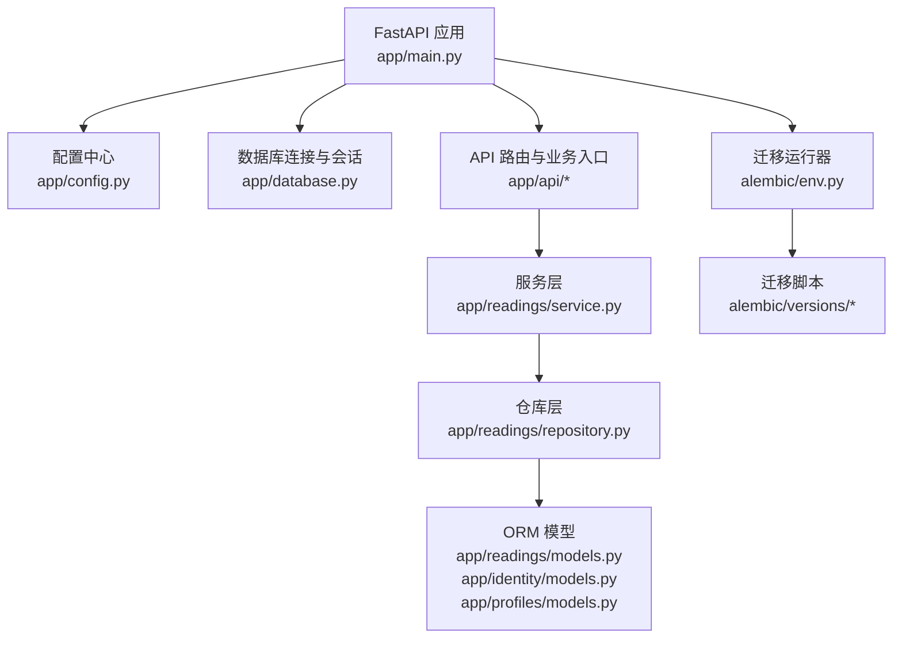
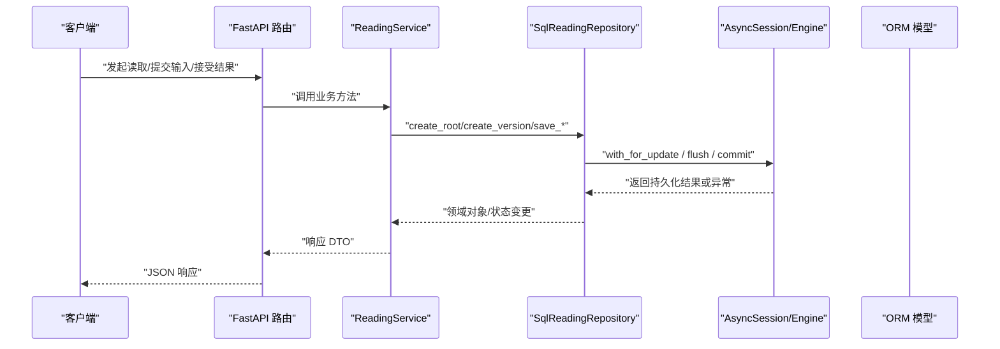
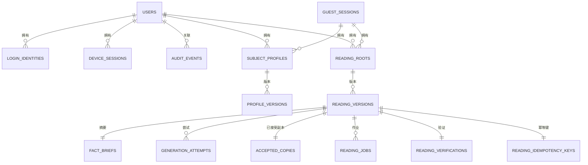
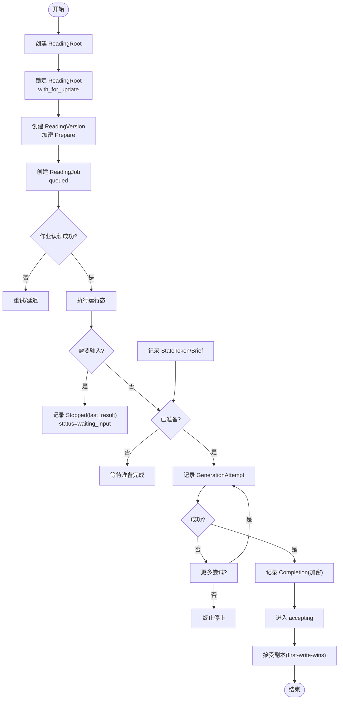
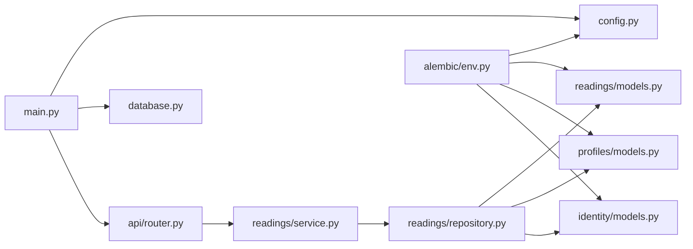

# 数据持久化流程

<cite>
**本文引用的文件**
- [backend/app/database.py](file://backend/app/database.py)
- [backend/app/persistence.py](file://backend/app/persistence.py)
- [backend/app/config.py](file://backend/app/config.py)
- [backend/app/main.py](file://backend/app/main.py)
- [backend/alembic/env.py](file://backend/alembic/env.py)
- [backend/alembic/versions/0001_identity_foundation.py](file://backend/alembic/versions/0001_identity_foundation.py)
- [backend/alembic/versions/0002_profiles_and_readings.py](file://backend/alembic/versions/0002_profiles_and_readings.py)
- [backend/alembic/versions/0008_admin_staff_foundation.py](file://backend/alembic/versions/0008_admin_staff_foundation.py)
- [backend/app/identity/models.py](file://backend/app/identity/models.py)
- [backend/app/profiles/models.py](file://backend/app/profiles/models.py)
- [backend/app/readings/models.py](file://backend/app/readings/models.py)
- [backend/app/readings/repository.py](file://backend/app/readings/repository.py)
- [backend/app/readings/service.py](file://backend/app/readings/service.py)
</cite>

## 目录
1. [简介](#简介)
2. [项目结构](#项目结构)
3. [核心组件](#核心组件)
4. [架构总览](#架构总览)
5. [详细组件分析](#详细组件分析)
6. [依赖关系分析](#依赖关系分析)
7. [性能考量](#性能考量)
8. [故障排查指南](#故障排查指南)
9. [结论](#结论)
10. [附录](#附录)

## 简介
本文件面向 Mingli Web 后端的数据持久化流程，聚焦于 SQLAlchemy ORM 的使用模式、会话与事务管理、连接池配置、数据模型版本化与不可变设计、数据库迁移管理与 Schema 演进策略，以及数据一致性保障机制（乐观锁、悲观锁、幂等与分布式任务编排）。文档包含数据流图与实体关系图，并给出关键代码路径以便快速定位实现细节。

## 项目结构
后端采用模块化组织：
- 应用启动与生命周期：FastAPI 应用创建、依赖注入、数据库生命周期管理
- 配置：集中式 Settings，含数据库 URL、安全密钥、速率限制等
- 数据访问层：SQLAlchemy 异步引擎与会话工厂、仓库模式封装
- 领域模型：身份、档案、阅读（Reading）工作流、管理员审计等
- 迁移：Alembic 异步迁移脚本，统一元数据注册

图表来源
- [backend/app/main.py:30-156](file://backend/app/main.py#L30-L156)
- [backend/app/config.py:62-149](file://backend/app/config.py#L62-L149)
- [backend/app/database.py:12-32](file://backend/app/database.py#L12-L32)
- [backend/alembic/env.py:17-58](file://backend/alembic/env.py#L17-L58)

章节来源
- [backend/app/main.py:30-156](file://backend/app/main.py#L30-L156)
- [backend/app/config.py:62-149](file://backend/app/config.py#L62-L149)
- [backend/app/database.py:12-32](file://backend/app/database.py#L12-L32)
- [backend/alembic/env.py:17-58](file://backend/alembic/env.py#L17-L58)

## 核心组件
- 数据库与连接池：异步 SQLAlchemy 引擎、会话工厂、健康探测与资源释放
- 配置：Settings 提供 database_url、加密密钥、速率限制等；生产环境强制校验
- 模型基类与命名约定：DeclarativeBase + 命名约定，统一约束与索引命名
- 仓库层：SqlReadingRepository 封装所有读写、加锁、加密载荷、状态机推进
- 服务层：ReadingService 编排业务用例，组合 ProfileService、仓库、加密器
- 迁移：Alembic 异步执行，统一 target_metadata 聚合各模块 Base.metadata

章节来源
- [backend/app/database.py:12-32](file://backend/app/database.py#L12-L32)
- [backend/app/config.py:62-149](file://backend/app/config.py#L62-L149)
- [backend/app/identity/models.py:18-28](file://backend/app/identity/models.py#L18-L28)
- [backend/app/readings/repository.py:51-81](file://backend/app/readings/repository.py#L51-L81)
- [backend/app/readings/service.py:117-128](file://backend/app/readings/service.py#L117-L128)
- [backend/alembic/env.py:17-58](file://backend/alembic/env.py#L17-L58)

## 架构总览
从请求到落库的关键链路如下：
- FastAPI 在 lifespan 中持有 Database 实例，并在关闭时释放
- API 通过依赖注入获取 AsyncSession
- Service 调用 Repository 进行领域操作
- Repository 使用 with_for_update 进行行级锁定，结合唯一约束与检查约束保证一致性
- 敏感字段以信封加密存储，读取时解密并校验指纹

图表来源
- [backend/app/main.py:30-156](file://backend/app/main.py#L30-L156)
- [backend/app/readings/service.py:117-200](file://backend/app/readings/service.py#L117-L200)
- [backend/app/readings/repository.py:120-167](file://backend/app/readings/repository.py#L120-L167)
- [backend/app/database.py:12-32](file://backend/app/database.py#L12-L32)

## 详细组件分析

### 数据库连接与会话管理
- 引擎与会话工厂：使用 create_async_engine 创建异步引擎，启用 pool_pre_ping 检测连接有效性；会话工厂设置 expire_on_commit=False 避免提交后自动失效
- 会话上下文：通过 async_sessionmaker 提供的上下文管理器生成会话，确保请求级隔离
- 健康探测与销毁：probe 执行 SELECT 1 验证连通性；dispose 释放引擎资源

章节来源
- [backend/app/database.py:12-32](file://backend/app/database.py#L12-L32)
- [backend/app/main.py:30-59](file://backend/app/main.py#L30-L59)

### 配置与安全
- database_url 来自 Settings，默认指向本地 PostgreSQL
- 内容加密密钥 identity_hash_key、content_encryption_key_b64 在生产环境强制注入与校验
- 运行时参数如超时、令牌长度等均有边界校验，防止误配

章节来源
- [backend/app/config.py:62-149](file://backend/app/config.py#L62-L149)
- [backend/app/config.py:188-329](file://backend/app/config.py#L188-L329)

### 数据模型与版本化设计
- 基础模型：Base 定义命名约定，统一索引/约束命名风格
- 身份域：users、login_identities、device_sessions、guest_sessions、audit_events
- 档案域：subject_profiles（主体档案）、profile_versions（不可变版本，追加写入）
- 阅读域：
  - reading_roots：拥有者（用户或访客）+ 能力标识
  - reading_versions：版本号递增，状态机驱动，敏感字段（prepare/state_token/last_result/completion）以信封加密存储
  - fact_briefs、generation_attempts、accepted_copies：不可变记录，禁止更新
  - reading_jobs：作业队列，带租约与可用性时间
  - reading_idempotency_keys：幂等键映射到版本
  - reading_verifications：用户反馈

图表来源
- [backend/app/identity/models.py:31-132](file://backend/app/identity/models.py#L31-L132)
- [backend/app/profiles/models.py:21-79](file://backend/app/profiles/models.py#L21-L79)
- [backend/app/readings/models.py:28-378](file://backend/app/readings/models.py#L28-L378)

章节来源
- [backend/app/identity/models.py:18-132](file://backend/app/identity/models.py#L18-L132)
- [backend/app/profiles/models.py:21-79](file://backend/app/profiles/models.py#L21-L79)
- [backend/app/readings/models.py:28-378](file://backend/app/readings/models.py#L28-L378)

### 不可变数据模式与审计
- 不可变记录：RuntimeRelease、FactBrief、GenerationAttempt、AcceptedCopy、ProfileVersion 均禁止更新，通过 before_update 事件抛出 ImmutableRecordError
- 审计：audit_events、admin_audit_events 记录操作轨迹，便于追溯

章节来源
- [backend/app/readings/models.py:370-378](file://backend/app/readings/models.py#L370-L378)
- [backend/app/profiles/models.py:77-79](file://backend/app/profiles/models.py#L77-L79)
- [backend/app/persistence.py:1-3](file://backend/app/persistence.py#L1-L3)
- [backend/app/identity/models.py:113-132](file://backend/app/identity/models.py#L113-L132)
- [backend/app/admin/models.py:59-81](file://backend/app/admin/models.py#L59-L81)

### 事务控制与一致性
- 行级锁：reading_root_version_lock_statement 使用 with_for_update 串行化同一 Reading Root 的版本分配
- 唯一约束与检查约束：
  - 拥有者互斥：owner_user_id 与 owner_guest_session_id 二选一
  - 信封字段成对存在：state_token/last_result/completion/candidate 的 key/nonce/ciphertext/digest 必须同时存在或同时为空
  - 作业并发：active 状态的 reading_version_id 唯一索引
- 幂等键：reading_idempotency_keys 基于 key_hash + owner 唯一，防止重复提交
- 首次写入获胜：AcceptedCopy 仅允许一次写入，后续写入需比对明文一致

章节来源
- [backend/app/readings/repository.py:44-48](file://backend/app/readings/repository.py#L44-L48)
- [backend/app/readings/models.py:53-114](file://backend/app/readings/models.py#L53-L114)
- [backend/app/readings/models.py:188-223](file://backend/app/readings/models.py#L188-L223)
- [backend/app/readings/models.py:247-292](file://backend/app/readings/models.py#L247-L292)
- [backend/app/readings/models.py:294-338](file://backend/app/readings/models.py#L294-L338)
- [backend/app/readings/repository.py:674-716](file://backend/app/readings/repository.py#L674-L716)

### 数据流与处理逻辑
- 开始阅读：创建 root -> 锁定 root -> 计算最大版本 -> 创建 version（加密 prepare）-> 创建 job
- 等待输入：job 被认领 -> 运行 -> 若 need_input 则记录 last_result 并回退到 waiting_input
- 继续输入：replace_prepare 重置 last_result，重新进入 input_ready
- 准备完成：记录 state_token 与 brief（加密），推进到 prepared
- 生成尝试：append-only 记录 candidate/guard_errors/model_receipt
- 成功完成：记录 completion（加密），推进到 completing
- 接受副本：first-write-wins，校验明文一致，推进到 accepted

图表来源
- [backend/app/readings/repository.py:83-167](file://backend/app/readings/repository.py#L83-L167)
- [backend/app/readings/repository.py:169-198](file://backend/app/readings/repository.py#L169-L198)
- [backend/app/readings/repository.py:556-582](file://backend/app/readings/repository.py#L556-L582)
- [backend/app/readings/repository.py:584-614](file://backend/app/readings/repository.py#L584-L614)
- [backend/app/readings/repository.py:616-659](file://backend/app/readings/repository.py#L616-L659)
- [backend/app/readings/repository.py:661-716](file://backend/app/readings/repository.py#L661-L716)

章节来源
- [backend/app/readings/repository.py:83-167](file://backend/app/readings/repository.py#L83-L167)
- [backend/app/readings/repository.py:169-198](file://backend/app/readings/repository.py#L169-L198)
- [backend/app/readings/repository.py:556-614](file://backend/app/readings/repository.py#L556-L614)
- [backend/app/readings/repository.py:616-716](file://backend/app/readings/repository.py#L616-L716)

### 数据库迁移管理与 Schema 演进
- Alembic 异步执行：env.py 将 Settings.database_url 注入引擎，使用 async_engine_from_config 并 run_sync 执行迁移
- 元数据聚合：target_metadata = Base.metadata，导入各模块 models 以注册表结构
- 迁移脚本：
  - 0001：身份基础（users、sessions、audit）
  - 0002：档案与阅读（profiles、readings、jobs、idempotency）
  - 0008：管理员与员工（staff_users、staff_sessions、admin_audit_events）

章节来源
- [backend/alembic/env.py:17-58](file://backend/alembic/env.py#L17-L58)
- [backend/alembic/versions/0001_identity_foundation.py:19-123](file://backend/alembic/versions/0001_identity_foundation.py#L19-L123)
- [backend/alembic/versions/0002_profiles_and_readings.py:28-288](file://backend/alembic/versions/0002_profiles_and_readings.py#L28-L288)
- [backend/alembic/versions/0008_admin_staff_foundation.py:19-103](file://backend/alembic/versions/0008_admin_staff_foundation.py#L19-L103)

### 数据一致性保障机制
- 悲观锁：with_for_update 串行化版本分配，避免竞态
- 乐观锁：通过唯一约束与检查约束实现“首次写入获胜”和“成对字段完整性”
- 幂等：reading_idempotency_keys 保证同一 owner 的同一 key 只映射一个版本
- 分布式事务：当前为单进程/单库，未引入跨进程事务；通过作业队列与租约实现分布式消费的一致性

章节来源
- [backend/app/readings/repository.py:44-48](file://backend/app/readings/repository.py#L44-L48)
- [backend/app/readings/models.py:247-292](file://backend/app/readings/models.py#L247-L292)
- [backend/app/readings/models.py:294-338](file://backend/app/readings/models.py#L294-L338)
- [backend/app/readings/repository.py:674-716](file://backend/app/readings/repository.py#L674-L716)

## 依赖关系分析
- main.py 依赖 config、database、api router，构建应用并注入速率限制器与 OTP 适配器
- service.py 依赖 repository、profiles.service、security.envelope
- repository.py 依赖 models、security.envelope、status、runtime_contracts
- alembic/env.py 依赖 app.config.Settings 与各模块 models 以聚合 metadata

图表来源
- [backend/app/main.py:30-156](file://backend/app/main.py#L30-L156)
- [backend/app/readings/service.py:117-128](file://backend/app/readings/service.py#L117-L128)
- [backend/app/readings/repository.py:51-81](file://backend/app/readings/repository.py#L51-L81)
- [backend/alembic/env.py:17-58](file://backend/alembic/env.py#L17-L58)

章节来源
- [backend/app/main.py:30-156](file://backend/app/main.py#L30-L156)
- [backend/app/readings/service.py:117-128](file://backend/app/readings/service.py#L117-L128)
- [backend/app/readings/repository.py:51-81](file://backend/app/readings/repository.py#L51-L81)
- [backend/alembic/env.py:17-58](file://backend/alembic/env.py#L17-L58)

## 性能考量
- 连接池：engine 使用 pool_pre_ping 减少死连接影响；建议根据并发调整连接池大小
- 查询优化：
  - 使用 with_for_update 仅在必要时锁定，避免长事务
  - 列表查询限制 limit（如历史最多 50 条）
  - 条件索引：reading_jobs.active 的条件唯一索引提升并发选择效率
- 加密开销：敏感字段加密/解密在仓库层集中处理，注意批量操作时的 CPU 成本
- 幂等与去重：利用唯一约束避免重复插入，减少冲突重试

[本节为通用指导，不直接分析具体文件]

## 故障排查指南
- 不可变记录被修改：抛出 ImmutableRecordError，检查是否误更新了不应更新的记录（如 FactBrief、GenerationAttempt、AcceptedCopy、ProfileVersion）
- 版本冲突：UniqueConstraint 触发 IntegrityError，检查并发写入与幂等键是否正确
- 作业竞争：active 状态唯一索引导致抢占失败，检查作业状态机与租约过期时间
- 会话问题：ensure session 在请求范围内正确创建与关闭；探针失败检查数据库连通性与凭据

章节来源
- [backend/app/persistence.py:1-3](file://backend/app/persistence.py#L1-L3)
- [backend/app/readings/models.py:370-378](file://backend/app/readings/models.py#L370-L378)
- [backend/app/readings/repository.py:394-403](file://backend/app/readings/repository.py#L394-L403)
- [backend/app/readings/models.py:247-292](file://backend/app/readings/models.py#L247-L292)

## 结论
Mingli Web 的后端数据持久化以 SQLAlchemy 异步 ORM 为核心，结合 Alembic 迁移、仓库模式与严格的约束设计，实现了高可靠、可审计、可演进的数据层。通过行级锁、唯一/检查约束、幂等键与不可变记录，系统在并发与一致性方面具备强保障。建议在扩展新特性时遵循现有模式：新增不可变记录、完善约束、使用仓库封装复杂逻辑，并通过迁移逐步演进 Schema。

## 附录
- 关键代码路径参考：
  - 会话与引擎：[backend/app/database.py:12-32](file://backend/app/database.py#L12-L32)
  - 应用启动与依赖注入：[backend/app/main.py:30-156](file://backend/app/main.py#L30-L156)
  - 配置与生产校验：[backend/app/config.py:62-149](file://backend/app/config.py#L62-L149), [backend/app/config.py:188-329](file://backend/app/config.py#L188-L329)
  - 模型与约束：[backend/app/readings/models.py:28-378](file://backend/app/readings/models.py#L28-L378), [backend/app/profiles/models.py:21-79](file://backend/app/profiles/models.py#L21-L79), [backend/app/identity/models.py:31-132](file://backend/app/identity/models.py#L31-L132)
  - 仓库与状态机：[backend/app/readings/repository.py:83-167](file://backend/app/readings/repository.py#L83-L167), [backend/app/readings/repository.py:556-716](file://backend/app/readings/repository.py#L556-L716)
  - 迁移与环境：[backend/alembic/env.py:17-58](file://backend/alembic/env.py#L17-L58), [backend/alembic/versions/0001_identity_foundation.py:19-123](file://backend/alembic/versions/0001_identity_foundation.py#L19-L123), [backend/alembic/versions/0002_profiles_and_readings.py:28-288](file://backend/alembic/versions/0002_profiles_and_readings.py#L28-L288), [backend/alembic/versions/0008_admin_staff_foundation.py:19-103](file://backend/alembic/versions/0008_admin_staff_foundation.py#L19-L103)