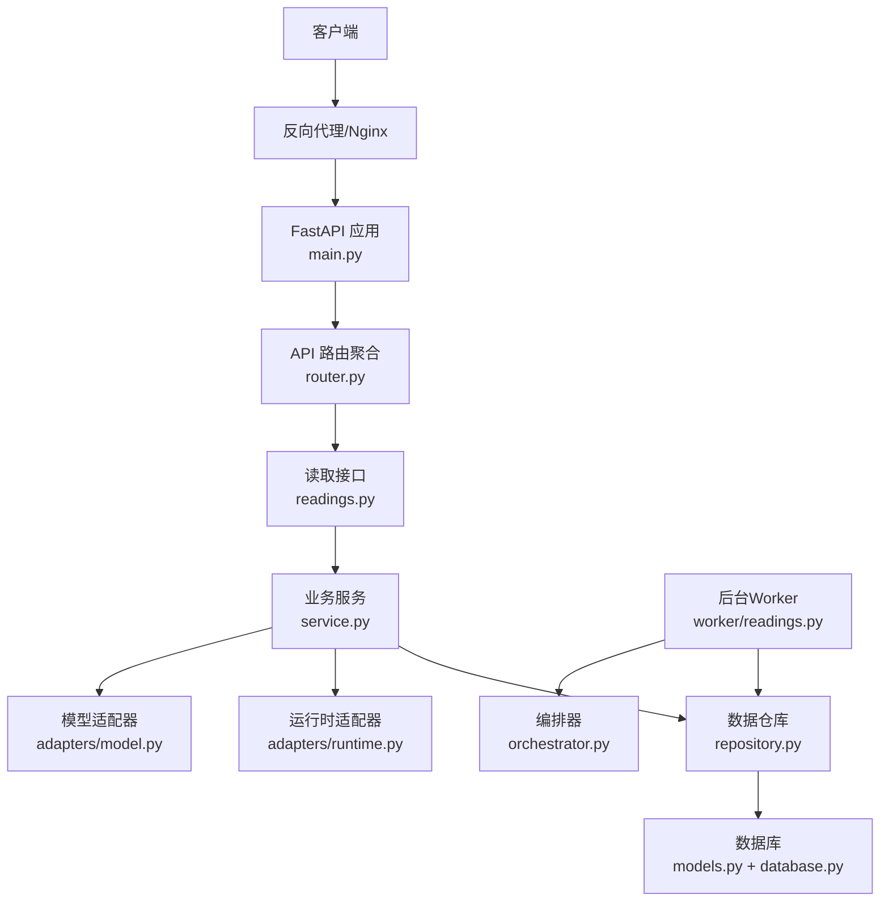
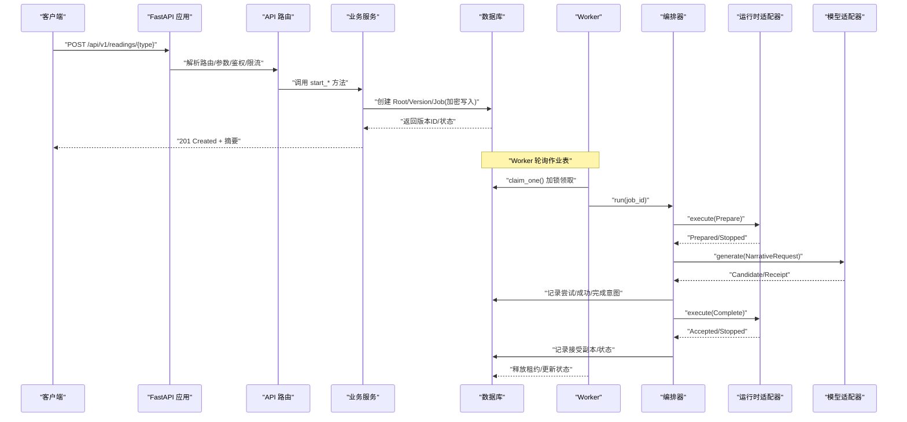
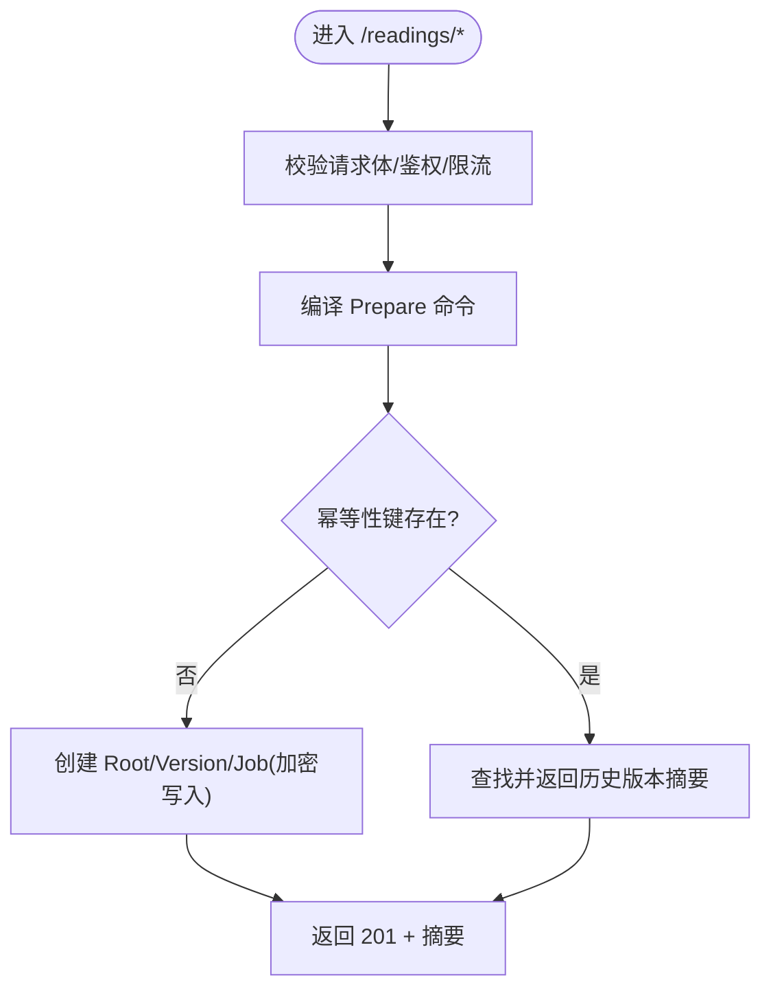
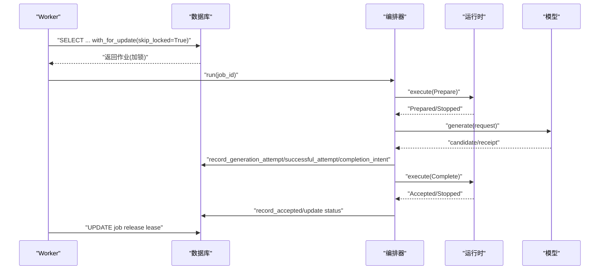
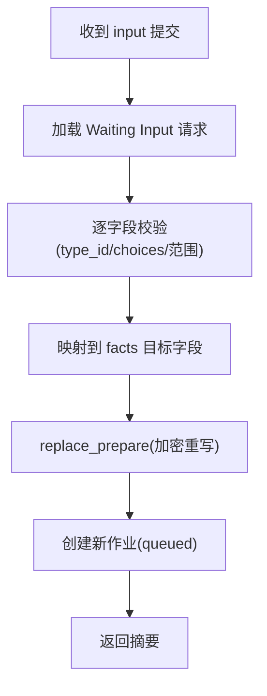
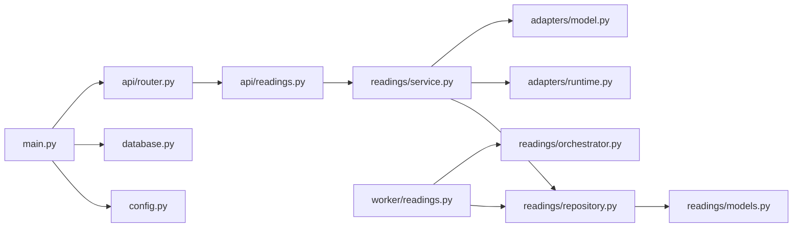

# 数据流设计

<cite>
**本文引用的文件**
- [backend/app/main.py](file://backend/app/main.py)
- [backend/app/api/router.py](file://backend/app/api/router.py)
- [backend/app/api/readings.py](file://backend/app/api/readings.py)
- [backend/app/readings/service.py](file://backend/app/readings/service.py)
- [backend/app/readings/orchestrator.py](file://backend/app/readings/orchestrator.py)
- [backend/worker/readings.py](file://backend/worker/readings.py)
- [backend/worker/main.py](file://backend/worker/main.py)
- [backend/app/readings/repository.py](file://backend/app/readings/repository.py)
- [backend/app/readings/models.py](file://backend/app/readings/models.py)
- [backend/app/database.py](file://backend/app/database.py)
- [backend/app/adapters/runtime.py](file://backend/app/adapters/runtime.py)
- [backend/app/adapters/model.py](file://backend/app/adapters/model.py)
- [backend/app/config.py](file://backend/app/config.py)
- [contracts/openapi/v1.yaml](file://contracts/openapi/v1.yaml)
</cite>

## 目录
1. [简介](#简介)
2. [项目结构](#项目结构)
3. [核心组件](#核心组件)
4. [架构总览](#架构总览)
5. [详细组件分析](#详细组件分析)
6. [依赖关系分析](#依赖关系分析)
7. [性能与缓存优化](#性能与缓存优化)
8. [故障排查指南](#故障排查指南)
9. [结论](#结论)

## 简介
本文件面向 Mingli Web 项目的数据流设计，聚焦从用户请求到数据持久化的完整流转过程。内容覆盖 API 路由、中间件处理、业务逻辑执行、数据访问、异步任务队列与 Worker 处理、结果回调、一致性保障（事务、并发控制、幂等）、错误处理与异常传播，以及关键场景的数据流与时序图。文档同时给出具体代码路径以便定位实现细节。

## 项目结构
后端采用 FastAPI 作为 HTTP 入口，按领域划分模块：身份、档案、命理解读（Readings）与管理员接口；通过统一路由器聚合；数据库使用 SQLAlchemy 异步会话；异步任务由独立 Worker 进程消费数据库中的作业表；运行时与模型调用通过适配器隔离，便于替换与测试。



图表来源
- [backend/app/main.py:30-156](file://backend/app/main.py#L30-L156)
- [backend/app/api/router.py:12-21](file://backend/app/api/router.py#L12-L21)
- [backend/app/api/readings.py:42-399](file://backend/app/api/readings.py#L42-L399)
- [backend/app/readings/service.py:117-819](file://backend/app/readings/service.py#L117-L819)
- [backend/app/readings/repository.py:51-862](file://backend/app/readings/repository.py#L51-L862)
- [backend/app/readings/models.py:28-378](file://backend/app/readings/models.py#L28-L378)
- [backend/app/database.py:12-33](file://backend/app/database.py#L12-L33)
- [backend/app/adapters/runtime.py:605-756](file://backend/app/adapters/runtime.py#L605-L756)
- [backend/app/adapters/model.py:144-586](file://backend/app/adapters/model.py#L144-L586)
- [backend/worker/readings.py:108-286](file://backend/worker/readings.py#L108-L286)
- [backend/app/readings/orchestrator.py:178-450](file://backend/app/readings/orchestrator.py#L178-L450)

章节来源
- [backend/app/main.py:30-156](file://backend/app/main.py#L30-L156)
- [backend/app/api/router.py:12-21](file://backend/app/api/router.py#L12-L21)
- [contracts/openapi/v1.yaml:15-200](file://contracts/openapi/v1.yaml#L15-L200)

## 核心组件
- 应用启动与全局配置：创建 FastAPI 实例、注册异常处理器、加载设置、初始化数据库与会话工厂、OTP 存储与限流器、速率限制器、可信代理网络、OTP 投递适配器、OpenAPI 文档。
- API 路由：统一前缀 /api/v1，包含健康检查、访客会话、认证、账户、档案、命理解读与管理端点。
- 业务服务：负责输入校验、编译 Prepare 命令、幂等性键管理、版本与作业创建、摘要与结果查询、验证反馈与后续追问。
- 数据仓库：封装所有持久化操作，包括加密存储、状态机转换、不可变记录保护、并发锁与唯一约束。
- 编排器：驱动命理解读生命周期（准备、生成、完成），协调运行时与模型适配器，维护检查点与重试策略。
- 工作队列与 Worker：基于数据库作业表的分布式领取与租约机制，保证单消费者串行处理与失败重试。
- 适配器：运行时适配器（一次性进程或 Fake），模型适配器（DeepSeek 或 Fake），屏蔽外部系统差异。

章节来源
- [backend/app/main.py:30-156](file://backend/app/main.py#L30-L156)
- [backend/app/api/router.py:12-21](file://backend/app/api/router.py#L12-L21)
- [backend/app/readings/service.py:117-819](file://backend/app/readings/service.py#L117-L819)
- [backend/app/readings/repository.py:51-862](file://backend/app/readings/repository.py#L51-L862)
- [backend/app/readings/orchestrator.py:178-450](file://backend/app/readings/orchestrator.py#L178-L450)
- [backend/worker/readings.py:108-286](file://backend/worker/readings.py#L108-L286)
- [backend/app/adapters/runtime.py:605-756](file://backend/app/adapters/runtime.py#L605-L756)
- [backend/app/adapters/model.py:144-586](file://backend/app/adapters/model.py#L144-L586)

## 架构总览
下图展示一次“开始命理解读”的端到端数据流：前端发起 POST，API 层鉴权与限流，服务层编译指令并落库，随后 Worker 拉取作业，编排器驱动运行时与模型，最终持久化接受副本并返回结果。



图表来源
- [backend/app/api/readings.py:87-237](file://backend/app/api/readings.py#L87-L237)
- [backend/app/readings/service.py:129-254](file://backend/app/readings/service.py#L129-L254)
- [backend/app/readings/repository.py:83-224](file://backend/app/readings/repository.py#L83-L224)
- [backend/worker/readings.py:121-218](file://backend/worker/readings.py#L121-L218)
- [backend/app/readings/orchestrator.py:212-435](file://backend/app/readings/orchestrator.py#L212-L435)
- [backend/app/adapters/runtime.py:641-707](file://backend/app/adapters/runtime.py#L641-L707)
- [backend/app/adapters/model.py:200-334](file://backend/app/adapters/model.py#L200-L334)

## 详细组件分析

### 请求处理链路（API -> 服务 -> 仓库）
- 路由层：统一前缀 /api/v1，按功能分组；读写接口均注入数据库会话与所有者上下文，并进行速率限制。
- 服务层：对输入进行严格校验（类型、范围、选择集），编译 Prepare 命令，维护幂等性键，创建 Root/Version/Job，返回摘要。
- 仓库层：加密存储敏感字段（Prepare、Brief、结果、接受副本），使用唯一约束与检查约束保证不可变性与一致性。



图表来源
- [backend/app/api/readings.py:87-237](file://backend/app/api/readings.py#L87-L237)
- [backend/app/readings/service.py:129-254](file://backend/app/readings/service.py#L129-L254)
- [backend/app/readings/repository.py:83-224](file://backend/app/readings/repository.py#L83-L224)

章节来源
- [backend/app/api/readings.py:87-237](file://backend/app/api/readings.py#L87-L237)
- [backend/app/readings/service.py:129-254](file://backend/app/readings/service.py#L129-L254)
- [backend/app/readings/repository.py:83-224](file://backend/app/readings/repository.py#L83-L224)

### 异步任务处理（Worker -> 编排器 -> 运行时/模型）
- 作业领取：Worker 使用带 for_update(skip_locked=True) 的 SQL 语句锁定一条可执行作业，分配租约（owner/token/expiry）。
- 编排执行：编排器根据检查点决定下一步（准备、生成、完成），调用运行时适配器执行 Prepare/Complete，调用模型适配器生成候选稿，并通过守卫与组装器产出公开副本。
- 结果回写：在事务中记录尝试次数、成功尝试、完成意图与接受副本，更新作业状态为 complete/delayed/stopped 等。



图表来源
- [backend/worker/readings.py:63-161](file://backend/worker/readings.py#L63-L161)
- [backend/worker/readings.py:175-218](file://backend/worker/readings.py#L175-L218)
- [backend/app/readings/orchestrator.py:212-435](file://backend/app/readings/orchestrator.py#L212-L435)
- [backend/app/adapters/runtime.py:641-707](file://backend/app/adapters/runtime.py#L641-L707)
- [backend/app/adapters/model.py:200-334](file://backend/app/adapters/model.py#L200-L334)

章节来源
- [backend/worker/readings.py:63-218](file://backend/worker/readings.py#L63-L218)
- [backend/app/readings/orchestrator.py:212-435](file://backend/app/readings/orchestrator.py#L212-L435)

### 数据模型与一致性
- 不可变记录：RuntimeRelease、FactBrief、GenerationAttempt、AcceptedCopy 在 before_update 事件中抛出不可变错误，确保追加式审计与合规。
- 并发控制：ReadingRoot 版本分配使用 with_for_update() 序列化；作业表通过索引与唯一约束避免重复运行；租约令牌与代数递增防止抢占。
- 加密存储：敏感字段（Prepare、Brief、结果、接受副本、状态令牌）通过信封加密保存，附带指纹用于完整性校验。
- 状态机：ReadingVersion.status 与 ReadingJobRecord.status 协同推进，支持 waiting_input、delayed、runtime_unknown 等分支。

```mermaid
classDiagram
class ReadingRoot {
+id
+owner_user_id
+owner_guest_session_id
+profile_version_id
+capability_id
+created_at
}
class ReadingVersion {
+id
+reading_root_id
+runtime_release_id
+version
+status
+prepare_key_id
+state_token_key_id
+last_result_key_id
+completion_key_id
+created_at
}
class ReadingJobRecord {
+id
+reading_version_id
+status
+available_at
+lease_owner
+lease_token
+lease_expires_at
+created_at
}
class FactBrief {
+id
+reading_version_id
+payload_key_id
+payload_nonce
+payload_ciphertext
+payload_digest
+created_at
}
class GenerationAttempt {
+id
+reading_version_id
+attempt_number
+candidate_key_id
+guard_errors
+model_receipt
+created_at
}
class AcceptedCopy {
+id
+reading_version_id
+payload_key_id
+public_copy_digest
+accepted_at
}
ReadingRoot ||--o{ ReadingVersion : "拥有多个版本"
ReadingVersion ||--o{ FactBrief : "事实简报"
ReadingVersion ||--o{ GenerationAttempt : "多次尝试"
ReadingVersion ||--|| AcceptedCopy : "接受副本"
ReadingVersion ||--o{ ReadingJobRecord : "关联作业"
```

图表来源
- [backend/app/readings/models.py:28-378](file://backend/app/readings/models.py#L28-L378)

章节来源
- [backend/app/readings/models.py:28-378](file://backend/app/readings/models.py#L28-L378)
- [backend/app/readings/repository.py:756-800](file://backend/app/readings/repository.py#L756-L800)

### 输入验证与转换
- 输入需求来自运行时返回的 Stopped.input_request，服务层依据 requirements.any_of 与 type_id 进行强校验，仅允许白名单字段与取值范围。
- 将用户输入映射到 facts 子域，合并到 Prepare 的 facts 中，保持与运行时契约一致。
- 对于六爻起卦等场景，强制要求六个 cast 值且类型正确。



图表来源
- [backend/app/readings/service.py:256-292](file://backend/app/readings/service.py#L256-L292)
- [backend/app/readings/service.py:677-731](file://backend/app/readings/service.py#L677-L731)
- [backend/app/readings/service.py:788-798](file://backend/app/readings/service.py#L788-L798)

章节来源
- [backend/app/readings/service.py:256-292](file://backend/app/readings/service.py#L256-L292)
- [backend/app/readings/service.py:677-731](file://backend/app/readings/service.py#L677-L731)
- [backend/app/readings/service.py:788-798](file://backend/app/readings/service.py#L788-L798)

### 幂等性与并发安全
- 幂等性键：服务层基于 HMAC 计算 key_hash 与 request_fingerprint，写入 reading_idempotency_keys 表，冲突时返回历史版本摘要。
- 并发控制：版本分配对 ReadingRoot 加锁；作业领取使用 skip_locked 与租约令牌；接受副本首次写入后禁止覆盖。
- 事务边界：API 层在每个写操作后 commit；Worker 在单个事务内完成领取、处理、释放租约与状态更新。

章节来源
- [backend/app/readings/service.py:429-453](file://backend/app/readings/service.py#L429-L453)
- [backend/app/readings/service.py:552-595](file://backend/app/readings/service.py#L552-L595)
- [backend/app/readings/repository.py:406-446](file://backend/app/readings/repository.py#L406-L446)
- [backend/worker/readings.py:121-218](file://backend/worker/readings.py#L121-L218)

### 错误处理与异常传播
- API 层统一异常处理器：ApiProblem 与 RequestValidationError 转换为标准问题响应。
- 服务层错误分类：未找到、非等待输入、已排队、不接受、运行时不可用、输入无效等，映射为合适的 HTTP 状态码。
- 运行时与模型错误：传输错误、超时、非法输出、上游错误等被捕获并转化为明确的错误码，编排器据此决定重试或延迟。

章节来源
- [backend/app/main.py:115-136](file://backend/app/main.py#L115-L136)
- [backend/app/api/readings.py:67-84](file://backend/app/api/readings.py#L67-L84)
- [backend/app/readings/orchestrator.py:250-285](file://backend/app/readings/orchestrator.py#L250-L285)
- [backend/app/adapters/runtime.py:641-707](file://backend/app/adapters/runtime.py#L641-L707)
- [backend/app/adapters/model.py:200-334](file://backend/app/adapters/model.py#L200-L334)

## 依赖关系分析
- 应用启动依赖 Settings 与 Database，注册 OTP 存储、限流器、速率限制器与 OTP 投递适配器。
- API 路由依赖各功能模块路由，统一挂载到 /api/v1。
- 服务依赖 ProfileService、Repository、Settings；仓库依赖 EnvelopeCipher 与 SQLAlchemy 模型。
- Worker 依赖 Database、OrchestratorFactory、AlertSink；编排器依赖 Repository、RuntimePort、NarrativeModelPort、Guard、Assembler。
- 适配器依赖 Settings 与外部系统（进程/HTTP）。



图表来源
- [backend/app/main.py:30-156](file://backend/app/main.py#L30-L156)
- [backend/app/api/router.py:12-21](file://backend/app/api/router.py#L12-L21)
- [backend/app/api/readings.py:42-399](file://backend/app/api/readings.py#L42-L399)
- [backend/app/readings/service.py:117-819](file://backend/app/readings/service.py#L117-L819)
- [backend/app/readings/repository.py:51-862](file://backend/app/readings/repository.py#L51-L862)
- [backend/app/readings/models.py:28-378](file://backend/app/readings/models.py#L28-L378)
- [backend/app/adapters/runtime.py:605-756](file://backend/app/adapters/runtime.py#L605-L756)
- [backend/app/adapters/model.py:144-586](file://backend/app/adapters/model.py#L144-L586)
- [backend/worker/readings.py:108-286](file://backend/worker/readings.py#L108-L286)
- [backend/app/readings/orchestrator.py:178-450](file://backend/app/readings/orchestrator.py#L178-L450)

章节来源
- [backend/app/main.py:30-156](file://backend/app/main.py#L30-L156)
- [backend/app/api/router.py:12-21](file://backend/app/api/router.py#L12-L21)
- [backend/app/readings/service.py:117-819](file://backend/app/readings/service.py#L117-L819)
- [backend/app/readings/repository.py:51-862](file://backend/app/readings/repository.py#L51-L862)
- [backend/app/readings/models.py:28-378](file://backend/app/readings/models.py#L28-L378)
- [backend/app/adapters/runtime.py:605-756](file://backend/app/adapters/runtime.py#L605-L756)
- [backend/app/adapters/model.py:144-586](file://backend/app/adapters/model.py#L144-L586)
- [backend/worker/readings.py:108-286](file://backend/worker/readings.py#L108-L286)
- [backend/app/readings/orchestrator.py:178-450](file://backend/app/readings/orchestrator.py#L178-L450)

## 性能与缓存优化
- 数据库连接池：使用 SQLAlchemy AsyncEngine 与 async_sessionmaker，expire_on_commit=False 减少刷新开销。
- 作业调度：skip_locked 与租约机制避免争抢；可用时间窗口与延迟状态降低无效重试。
- 模型调用：固定温度与最大输出 token，限制响应大小与超时，避免资源耗尽；审计日志仅记录元数据，不记录正文。
- 运行时隔离：一次性进程模式限制 I/O 与内存，严格路径与清单校验确保安全与稳定。
- 缓存策略：当前实现以数据库为单一事实源，无应用级缓存；可通过引入 Redis 缓存热点摘要或结果以提升读取性能（建议方案）。

章节来源
- [backend/app/database.py:12-33](file://backend/app/database.py#L12-L33)
- [backend/worker/readings.py:63-161](file://backend/worker/readings.py#L63-L161)
- [backend/app/adapters/model.py:144-586](file://backend/app/adapters/model.py#L144-L586)
- [backend/app/adapters/runtime.py:605-756](file://backend/app/adapters/runtime.py#L605-L756)

## 故障排查指南
- 运行时未知：当 Prepare 无 state_token 且传输失败，编排器标记 RUNTIME_UNKNOWN，Worker 在租约过期时恢复该状态并释放作业。
- 模型错误：上游 5xx、429、超时、非法响应等会被捕获并记录 receipt；编排器根据尝试次数决定是否延迟或终止。
- 幂等冲突：Idempotency-Key 与 action/fingerprint 不一致时抛出冲突错误，需客户端修正或更换键。
- 输入无效：不符合 runtime 输入需求或超出范围/选择集时，返回 400 并提示具体原因。
- 接受副本冲突：首次写入后禁止覆盖，重复提交会返回已有副本。

章节来源
- [backend/app/readings/orchestrator.py:250-285](file://backend/app/readings/orchestrator.py#L250-L285)
- [backend/app/readings/orchestrator.py:287-394](file://backend/app/readings/orchestrator.py#L287-L394)
- [backend/app/readings/service.py:429-453](file://backend/app/readings/service.py#L429-L453)
- [backend/app/readings/service.py:677-731](file://backend/app/readings/service.py#L677-L731)
- [backend/app/readings/repository.py:674-716](file://backend/app/readings/repository.py#L674-L716)

## 结论
Mingli Web 的数据流设计围绕“服务编排 + 数据库作业队列 + 适配器隔离”展开，实现了高可靠、可审计、可扩展的命理解读流水线。通过严格的输入校验、加密存储、不可变记录、幂等性与并发控制，保障了数据一致性与安全性。异步 Worker 解耦了耗时任务，编排器在多阶段间维持状态与重试策略，适配层屏蔽外部系统差异。未来可在读取路径引入缓存以提升性能，同时保持写路径的强一致与可追溯性。