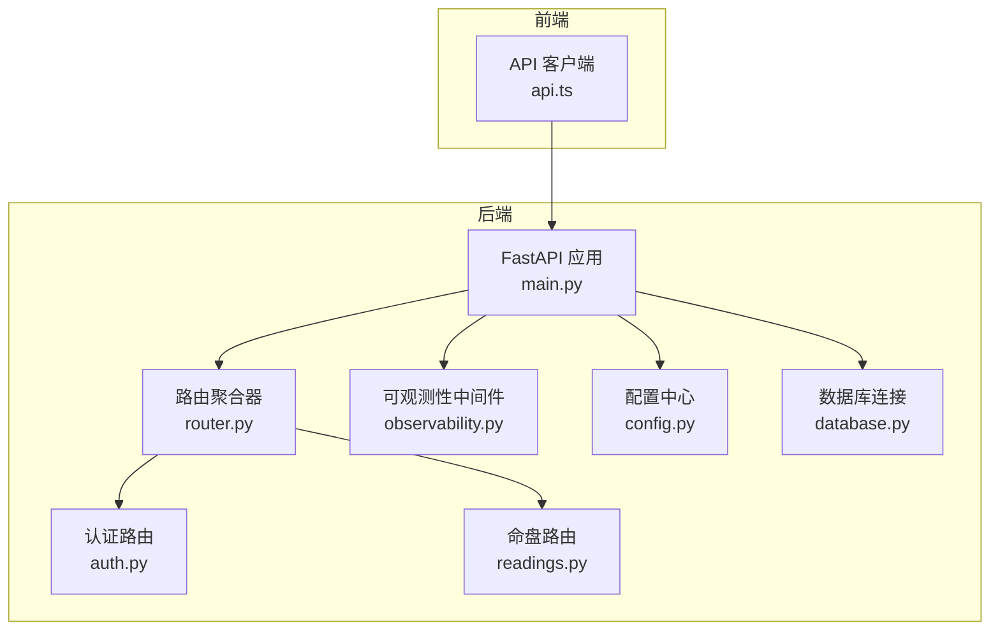
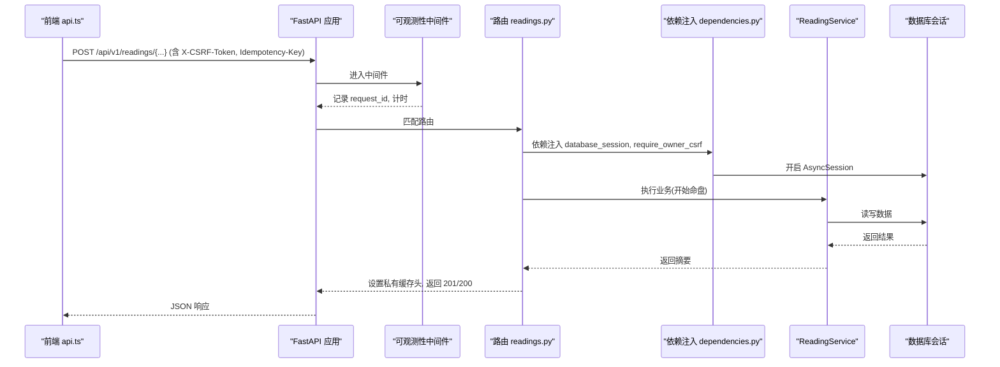
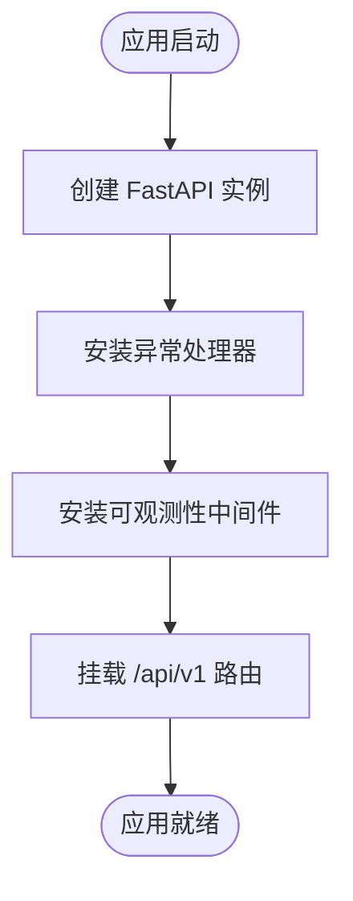
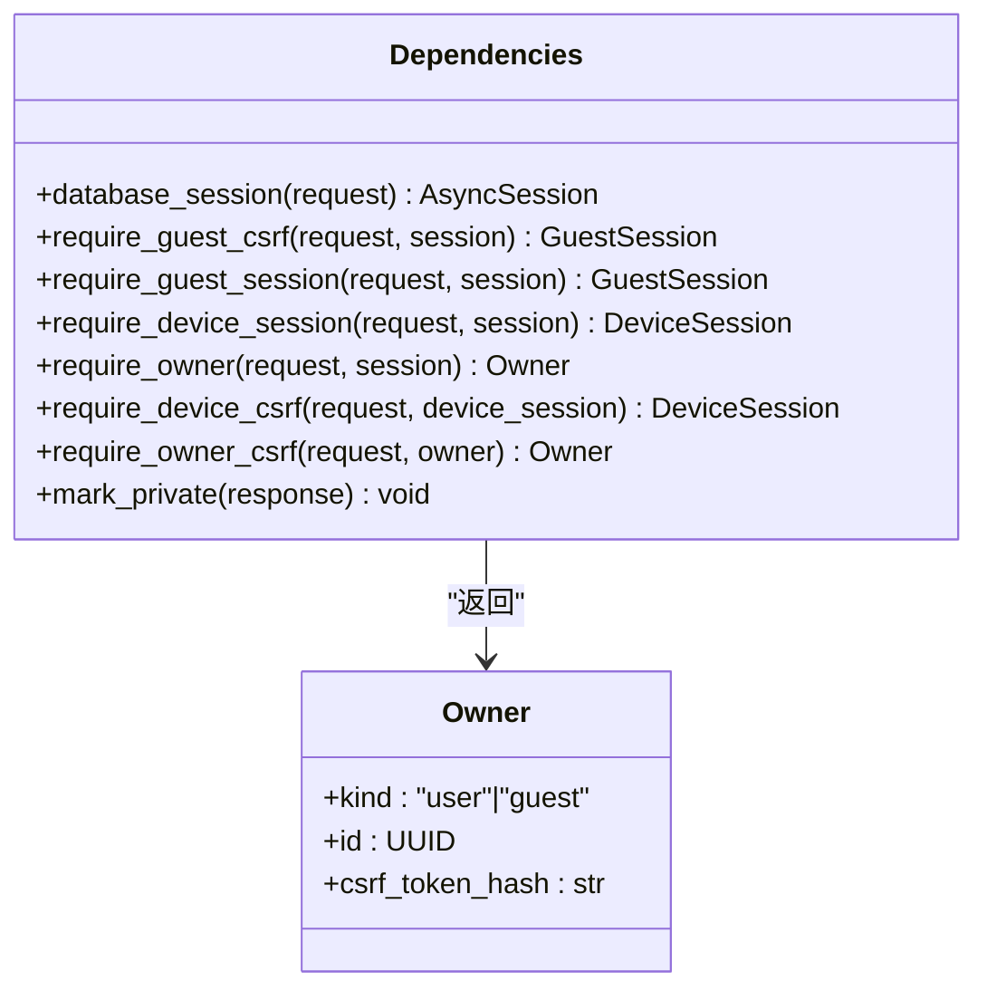
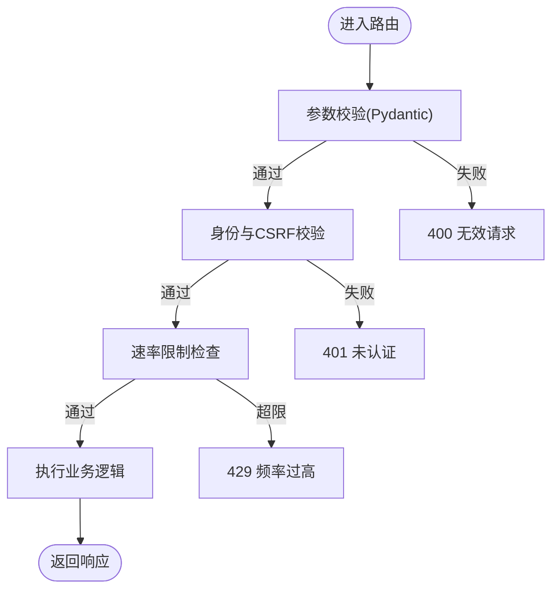
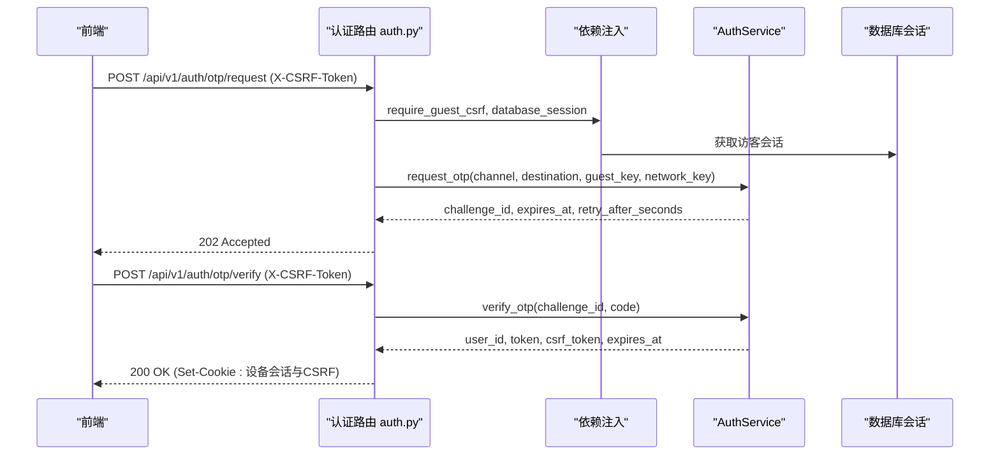
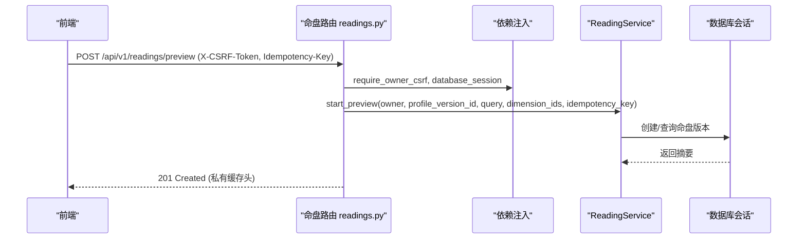
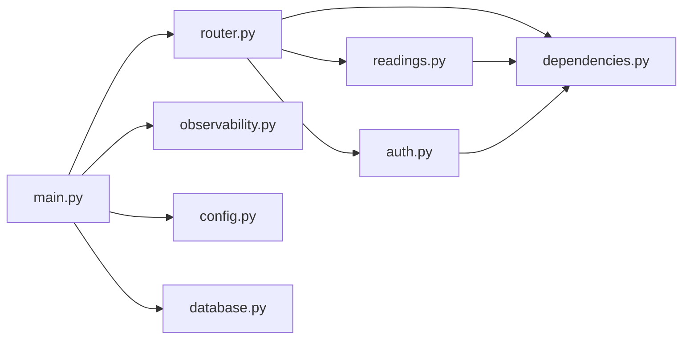

# 请求处理流程

<cite>
**本文引用的文件**
- [backend/app/main.py](file://backend/app/main.py)
- [backend/app/api/router.py](file://backend/app/api/router.py)
- [backend/app/api/dependencies.py](file://backend/app/api/dependencies.py)
- [backend/app/config.py](file://backend/app/config.py)
- [backend/app/database.py](file://backend/app/database.py)
- [backend/app/observability.py](file://backend/app/observability.py)
- [backend/app/network.py](file://backend/app/network.py)
- [backend/app/api/auth.py](file://backend/app/api/auth.py)
- [backend/app/api/readings.py](file://backend/app/api/readings.py)
- [backend/app/api/errors.py](file://backend/app/api/errors.py)
- [backend/app/api/validators.py](file://backend/app/api/validators.py)
- [web/src/lib/api.ts](file://web/src/lib/api.ts)
</cite>

## 目录
1. [简介](#简介)
2. [项目结构](#项目结构)
3. [核心组件](#核心组件)
4. [架构总览](#架构总览)
5. [详细组件分析](#详细组件分析)
6. [依赖关系分析](#依赖关系分析)
7. [性能考量](#性能考量)
8. [故障排查指南](#故障排查指南)
9. [结论](#结论)
10. [附录](#附录)

## 简介
本文件面向 Mingli Web 后端（FastAPI）与前端（Next.js）的端到端请求处理链路，覆盖从 HTTP 请求进入、路由注册、中间件执行顺序、依赖注入、请求验证、权限检查、参数转换、异步处理到错误处理的完整过程。同时说明前后端 API 调用流程与数据格式转换，并提供关键业务场景的请求流程图与时序图。

## 项目结构
后端采用模块化组织：应用入口负责创建 FastAPI 实例、安装异常处理器、配置日志与可观测性、挂载路由；路由按领域拆分（认证、账户、档案、命盘等），并通过统一依赖注入数据库会话、身份与会话校验、CSRF 校验等横切关注点。前端通过统一的 API 客户端封装请求、CSRF 令牌获取与幂等键机制。

**图表来源**
- [backend/app/main.py:30-156](file://backend/app/main.py#L30-L156)
- [backend/app/api/router.py:12-21](file://backend/app/api/router.py#L12-L21)
- [backend/app/observability.py:27-52](file://backend/app/observability.py#L27-L52)
- [backend/app/config.py:62-149](file://backend/app/config.py#L62-L149)
- [backend/app/database.py:12-33](file://backend/app/database.py#L12-L33)
- [web/src/lib/api.ts:256-385](file://web/src/lib/api.ts#L256-L385)

**章节来源**
- [backend/app/main.py:30-156](file://backend/app/main.py#L30-L156)
- [backend/app/api/router.py:12-21](file://backend/app/api/router.py#L12-L21)

## 核心组件
- 应用生命周期与异常处理：在应用启动时安装全局异常处理器，将业务异常与验证异常统一转换为结构化问题响应；安装请求级可观测性中间件，记录请求 ID、方法、路径、状态码与耗时。
- 路由聚合：统一前缀 /api/v1，按功能模块挂载健康检查、访客会话、认证、账户、档案、命盘、管理后台等子路由。
- 依赖注入：通过 FastAPI Depends 提供数据库会话、所有者身份（用户或访客）、CSRF 校验、速率限制等能力，解耦业务逻辑与横切关注点。
- 配置与安全：集中式 Settings 加载环境变量并做生产环境安全校验；支持 OTP 适配器选择、模型与运行时参数约束、内容加密密钥校验等。
- 网络与代理：解析可信代理网段，安全地还原客户端真实 IP，用于限流与审计。
- 前端 API 客户端：统一 JSON 请求封装、自动携带 CSRF Token、幂等键、错误分类与重试策略。

**章节来源**
- [backend/app/main.py:115-152](file://backend/app/main.py#L115-L152)
- [backend/app/observability.py:27-52](file://backend/app/observability.py#L27-L52)
- [backend/app/api/router.py:12-21](file://backend/app/api/router.py#L12-L21)
- [backend/app/api/dependencies.py:19-137](file://backend/app/api/dependencies.py#L19-L137)
- [backend/app/config.py:62-335](file://backend/app/config.py#L62-L335)
- [backend/app/network.py:16-72](file://backend/app/network.py#L16-L72)
- [web/src/lib/api.ts:256-385](file://web/src/lib/api.ts#L256-L385)

## 架构总览
下图展示一次典型“开始命盘”请求的端到端流程：前端发起 POST 请求，携带 CSRF Token 与可选幂等键；后端中间件记录请求信息；路由层进行身份与 CSRF 校验、速率限制；服务层编排业务逻辑；数据库会话提交事务；响应头标记私有缓存控制；前端解析结果并更新 UI。

**图表来源**
- [backend/app/observability.py:27-52](file://backend/app/observability.py#L27-L52)
- [backend/app/api/readings.py:87-121](file://backend/app/api/readings.py#L87-L121)
- [backend/app/api/dependencies.py:19-137](file://backend/app/api/dependencies.py#L19-L137)
- [web/src/lib/api.ts:292-330](file://web/src/lib/api.ts#L292-L330)

## 详细组件分析

### 应用启动与中间件执行顺序
- 应用创建：构造 FastAPI 实例，注入 Settings、Database、OTP 存储与投递器、各类速率限制器等；安装自定义异常处理器（ApiProblem、RequestValidationError）。
- 可观测性中间件：为每个请求生成或透传 request_id，写入响应头，并以结构化日志输出请求指标。
- 路由挂载：统一前缀 /api/v1，包含健康检查、访客会话、认证、账户、档案、命盘、管理等子路由。

**图表来源**
- [backend/app/main.py:30-156](file://backend/app/main.py#L30-L156)
- [backend/app/observability.py:27-52](file://backend/app/observability.py#L27-L52)
- [backend/app/api/router.py:12-21](file://backend/app/api/router.py#L12-L21)

**章节来源**
- [backend/app/main.py:30-156](file://backend/app/main.py#L30-L156)
- [backend/app/observability.py:27-52](file://backend/app/observability.py#L27-L52)
- [backend/app/api/router.py:12-21](file://backend/app/api/router.py#L12-L21)

### 路由注册与依赖注入机制
- 路由注册：通过 build_api_router 聚合各子路由，统一前缀 /api/v1。
- 依赖注入：
  - database_session：基于应用状态的 session_factory 提供 AsyncSession，异常时回滚。
  - require_guest_session / require_device_session：根据 Cookie 中的访客或设备会话令牌，查询并校验活跃会话。
  - require_owner：统一抽象“拥有者”，兼容用户与访客。
  - require_guest_csrf / require_device_csrf / require_owner_csrf：双因子 CSRF 校验（Cookie + Header），并与服务端哈希比对。
  - mark_private：为响应添加私有缓存与索引控制头。

**图表来源**
- [backend/app/api/dependencies.py:19-137](file://backend/app/api/dependencies.py#L19-L137)

**章节来源**
- [backend/app/api/dependencies.py:19-137](file://backend/app/api/dependencies.py#L19-L137)

### 请求验证、权限检查与参数转换
- 请求验证：Pydantic 模型驱动的路径/查询/体参数校验；非法请求触发 RequestValidationError，由全局处理器转为 400 结构化问题。
- 权限检查：
  - 访客：需要有效的访客 Cookie 与 CSRF 双因子校验。
  - 已登录用户：需要设备会话 Cookie 与 CSRF 双因子校验。
  - 资源归属：Owner 抽象确保仅资源拥有者可操作。
- 参数转换：
  - 时间与时区：使用 IANA 时区校验工具函数 validate_iana_timezone。
  - 客户端 IP：通过可信代理链解析稳定 IP，用于限流与审计。
  - 幂等键：Header 长度与存在性校验，前端生成唯一键避免重复提交。

**图表来源**
- [backend/app/api/readings.py:87-121](file://backend/app/api/readings.py#L87-L121)
- [backend/app/api/dependencies.py:29-130](file://backend/app/api/dependencies.py#L29-L130)
- [backend/app/api/validators.py:4-9](file://backend/app/api/validators.py#L4-L9)
- [backend/app/network.py:22-54](file://backend/app/network.py#L22-L54)

**章节来源**
- [backend/app/api/readings.py:87-121](file://backend/app/api/readings.py#L87-L121)
- [backend/app/api/dependencies.py:29-130](file://backend/app/api/dependencies.py#L29-L130)
- [backend/app/api/validators.py:4-9](file://backend/app/api/validators.py#L4-L9)
- [backend/app/network.py:22-54](file://backend/app/network.py#L22-L54)

### 异步请求处理与事务边界
- 数据库会话：每个请求通过依赖注入获得 AsyncSession，异常时自动回滚，保证一致性。
- 事务提交：路由层在成功处理后显式 commit，确保写操作原子性。
- 外部调用：服务层可能调用运行时或模型适配器，超时与大小限制由配置项约束，防止资源耗尽。

**章节来源**
- [backend/app/api/dependencies.py:19-27](file://backend/app/api/dependencies.py#L19-L27)
- [backend/app/api/readings.py:107-121](file://backend/app/api/readings.py#L107-L121)
- [backend/app/config.py:84-125](file://backend/app/config.py#L84-L125)

### 错误处理机制
- 业务异常：定义 ApiProblem，携带状态码、标题、类型、详情与额外头，统一由全局处理器转换为 JSON 响应。
- 验证异常：RequestValidationError 被捕获并转为 400 问题响应。
- 领域异常映射：如读取命盘时的各种 ReadingServiceError 被映射为合适的 HTTP 状态码（400/404/409/503）。

**章节来源**
- [backend/app/api/errors.py:1-17](file://backend/app/api/errors.py#L1-L17)
- [backend/app/main.py:115-136](file://backend/app/main.py#L115-L136)
- [backend/app/api/readings.py:67-85](file://backend/app/api/readings.py#L67-L85)

### 前后端 API 调用流程与数据格式转换
- 前端请求封装：
  - 统一 JSON 请求函数，自动携带 credentials。
  - 自动获取并附加 CSRF Token（优先读 Cookie，否则向访客会话接口拉取）。
  - 支持幂等键，失败时针对 403 CSRF 错误自动清理缓存并重试。
  - 错误对象 ApiError 携带 status 与 detail，便于上层 UI 提示。
- 数据模型：
  - 前端定义 Profile、Reading、FactPanel、Verification 等类型，与服务端 Pydantic 模型对应。
  - 对敏感字段（原始输入引用）进行过滤，确保浏览器不保留私密数据。
- 典型调用：
  - 创建档案草稿、确认档案、列出档案与命盘、开始预览/今日/周/六爻命盘、轮询状态、获取结果、提交输入、验证结果、后续追问等。

**章节来源**
- [web/src/lib/api.ts:256-385](file://web/src/lib/api.ts#L256-L385)
- [web/src/lib/api.ts:394-525](file://web/src/lib/api.ts#L394-L525)
- [web/src/lib/api.ts:176-216](file://web/src/lib/api.ts#L176-L216)

### 关键业务场景时序图

#### 场景一：发送验证码并验证登录

**图表来源**
- [backend/app/api/auth.py:44-138](file://backend/app/api/auth.py#L44-L138)
- [backend/app/api/dependencies.py:29-69](file://backend/app/api/dependencies.py#L29-L69)

**章节来源**
- [backend/app/api/auth.py:44-138](file://backend/app/api/auth.py#L44-L138)
- [backend/app/api/dependencies.py:29-69](file://backend/app/api/dependencies.py#L29-L69)

#### 场景二：开始命盘（幂等提交）

**图表来源**
- [backend/app/api/readings.py:87-121](file://backend/app/api/readings.py#L87-L121)
- [backend/app/api/dependencies.py:94-130](file://backend/app/api/dependencies.py#L94-L130)

**章节来源**
- [backend/app/api/readings.py:87-121](file://backend/app/api/readings.py#L87-L121)
- [backend/app/api/dependencies.py:94-130](file://backend/app/api/dependencies.py#L94-L130)

## 依赖关系分析
- 应用层依赖：
  - main.py 依赖 router、errors、health、config、database、observability、network、rate_limit。
  - router.py 聚合多个领域路由。
  - dependencies.py 提供跨域横切能力（会话、CSRF、私有缓存）。
  - config.py 提供强约束的配置加载与生产安全检查。
  - observability.py 提供请求级可观测性中间件。
  - network.py 提供安全的客户端 IP 解析。
- 前端依赖：
  - api.ts 封装所有 API 调用，处理 CSRF、幂等键、错误与数据投影。

**图表来源**
- [backend/app/main.py:30-156](file://backend/app/main.py#L30-L156)
- [backend/app/api/router.py:12-21](file://backend/app/api/router.py#L12-L21)
- [backend/app/api/dependencies.py:19-137](file://backend/app/api/dependencies.py#L19-L137)
- [backend/app/api/readings.py:1-47](file://backend/app/api/readings.py#L1-L47)
- [backend/app/api/auth.py:1-27](file://backend/app/api/auth.py#L1-L27)

**章节来源**
- [backend/app/main.py:30-156](file://backend/app/main.py#L30-L156)
- [backend/app/api/router.py:12-21](file://backend/app/api/router.py#L12-L21)
- [backend/app/api/dependencies.py:19-137](file://backend/app/api/dependencies.py#L19-L137)

## 性能考量
- 中间件开销：请求级可观测性中间件轻量，仅记录必要指标与追加响应头。
- 数据库会话：使用异步引擎与会话工厂，减少阻塞；异常时自动回滚，避免脏数据。
- 速率限制：按拥有者维度限制写操作频率，保护后端与下游系统。
- 超时与大小限制：模型与运行时相关超时、响应体大小、输入输出字节数均受配置约束，防止资源滥用。
- 前端重试：针对 CSRF 失效的幂等重试，降低网络抖动影响。

[本节为通用指导，无需特定文件引用]

## 故障排查指南
- 400 无效请求：检查 Pydantic 模型校验失败原因；查看 RequestValidationError 处理器输出的问题类型。
- 401 未认证：确认 Cookie 中访客或设备会话是否存在且有效；检查 CSRF 双因子是否一致。
- 403 CSRF 校验失败：前端需确保 X-CSRF-Token 与 Cookie 值一致；必要时清理本地缓存并重试。
- 404 资源不存在：核对路径参数与资源归属；确认 Owner 是否正确。
- 409 冲突：幂等键冲突或状态机不允许当前操作；检查前端是否重复提交或状态是否满足。
- 429 频率过高：降低请求频率或等待冷却；检查速率限制配置。
- 503 服务不可用：OTP 投递不可用或运行时发布包不可用；检查配置与依赖服务状态。

**章节来源**
- [backend/app/main.py:115-136](file://backend/app/main.py#L115-L136)
- [backend/app/api/readings.py:67-85](file://backend/app/api/readings.py#L67-L85)
- [backend/app/api/auth.py:69-110](file://backend/app/api/auth.py#L69-L110)
- [backend/app/api/dependencies.py:29-130](file://backend/app/api/dependencies.py#L29-L130)

## 结论
Mingli Web 后端以 FastAPI 为核心，结合模块化路由、依赖注入、统一异常处理与可观测性中间件，构建了清晰、可扩展且安全的请求处理流水线。前端通过统一的 API 客户端封装了 CSRF、幂等键与错误处理，形成稳健的前后端协作模式。通过严格的配置校验与速率限制，系统在保障安全的同时兼顾性能与稳定性。

[本节为总结性内容，无需特定文件引用]

## 附录
- 关键代码片段路径（不含具体代码内容）：
  - 应用创建与异常处理器：[backend/app/main.py:30-156](file://backend/app/main.py#L30-L156)
  - 路由聚合：[backend/app/api/router.py:12-21](file://backend/app/api/router.py#L12-L21)
  - 依赖注入（会话、身份、CSRF）：[backend/app/api/dependencies.py:19-137](file://backend/app/api/dependencies.py#L19-L137)
  - 配置与安全校验：[backend/app/config.py:62-335](file://backend/app/config.py#L62-L335)
  - 可观测性中间件：[backend/app/observability.py:27-52](file://backend/app/observability.py#L27-L52)
  - 客户端 IP 解析：[backend/app/network.py:22-54](file://backend/app/network.py#L22-L54)
  - 认证路由（OTP 请求与验证）：[backend/app/api/auth.py:44-138](file://backend/app/api/auth.py#L44-L138)
  - 命盘路由（开始、列表、结果、验证、后续）：[backend/app/api/readings.py:87-399](file://backend/app/api/readings.py#L87-L399)
  - 前端 API 客户端（请求封装、CSRF、幂等键）：[web/src/lib/api.ts:256-385](file://web/src/lib/api.ts#L256-L385)
  - 前端 API 调用（档案、命盘、验证）：[web/src/lib/api.ts:394-525](file://web/src/lib/api.ts#L394-L525)

[本节为参考索引，无需特定文件引用]