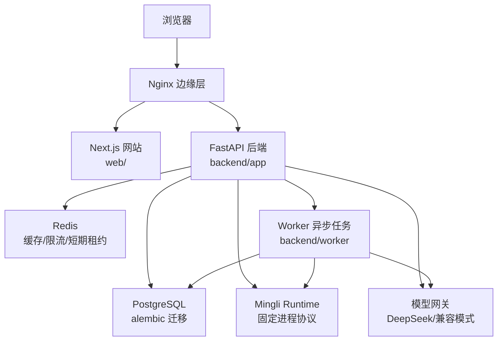
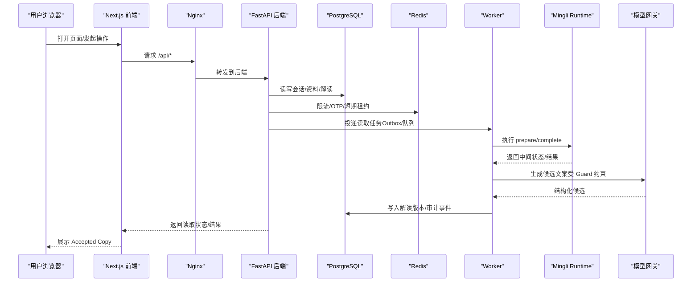
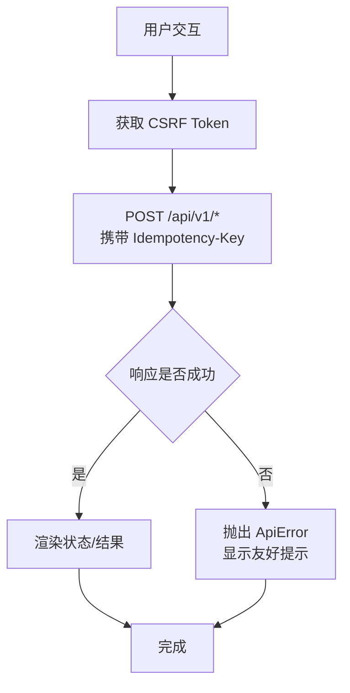
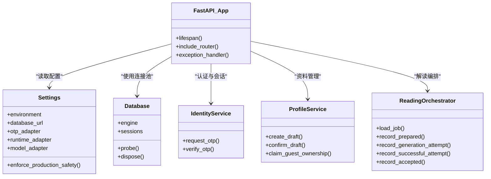
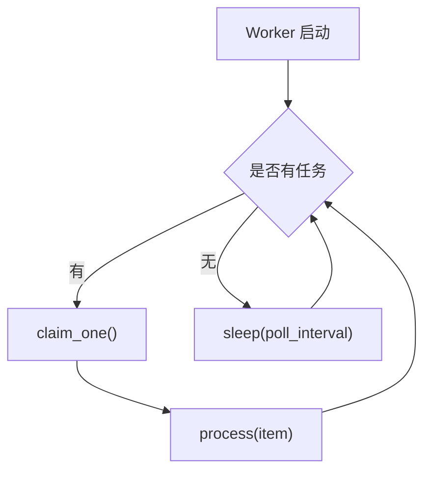
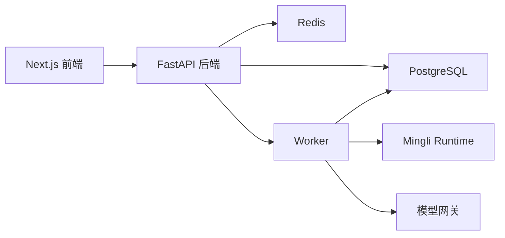
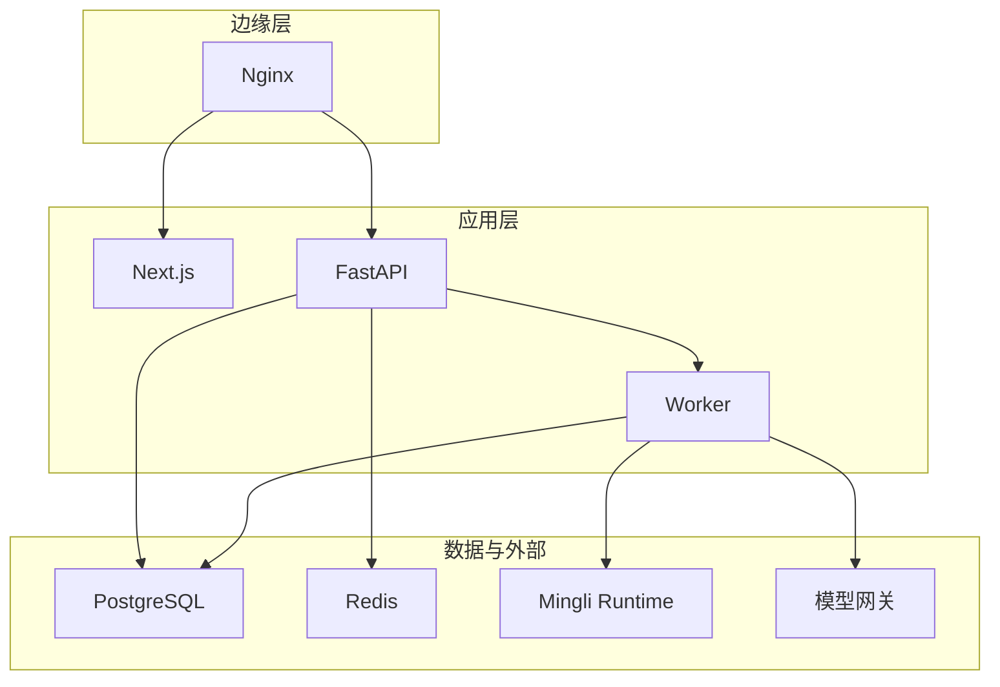

# 整体架构概览

<cite>
**本文引用的文件**
- [README.md](file://README.md)
- [DESIGN.md](file://DESIGN.md)
- [PRODUCT.md](file://PRODUCT.md)
- [backend/app/main.py](file://backend/app/main.py)
- [backend/app/config.py](file://backend/app/config.py)
- [backend/app/database.py](file://backend/app/database.py)
- [backend/worker/main.py](file://backend/worker/main.py)
- [web/src/lib/api.ts](file://web/src/lib/api.ts)
- [web/src/app/layout.tsx](file://web/src/app/layout.tsx)
- [infra/compose.local.yml](file://infra/compose.local.yml)
- [infra/nginx/app.conf](file://infra/nginx/app.conf)
- [docs/adr/0001-use-a-modular-monolith-on-alibaba-cloud.md](file://docs/adr/0001-use-a-modular-monolith-on-alibaba-cloud.md)
- [docs/PRODUCT_BLUEPRINT_WEB_IOS_V2.md](file://docs/PRODUCT_BLUEPRINT_WEB_IOS_V2.md)
- [backend/app/readings/orchestrator.py](file://backend/app/readings/orchestrator.py)
- [backend/app/identity/service.py](file://backend/app/identity/service.py)
- [backend/app/profiles/service.py](file://backend/app/profiles/service.py)
</cite>

## 目录
1. [引言](#引言)
2. [项目结构](#项目结构)
3. [核心组件](#核心组件)
4. [架构总览](#架构总览)
5. [详细组件分析](#详细组件分析)
6. [依赖关系分析](#依赖关系分析)
7. [性能与可扩展性](#性能与可扩展性)
8. [故障排查指南](#故障排查指南)
9. [结论](#结论)
10. [附录：部署拓扑与边界定义](#附录部署拓扑与边界定义)

## 引言
本文件面向 Mingli Web 项目的整体架构，聚焦“模块化单体”设计、前后端职责划分、数据与控制流、以及未来扩展路径。系统以 Next.js 前端、FastAPI 后端、PostgreSQL 持久化、Redis 缓存与限流、独立 Worker 异步任务为核心，通过同源 API 与共享契约（OpenAPI/JSON Schema）保持跨端一致性。产品方向强调“先算再讲”，将确定性计算、可核对依据与白话解读统一沉淀为私密档案，并保留未来原生 iOS 接入能力。

**章节来源**
- [README.md:24-35](file://README.md#L24-L35)
- [PRODUCT.md:15-39](file://PRODUCT.md#L15-L39)

## 项目结构
仓库采用多模块、多进程组织：
- web：Next.js App Router + TypeScript，负责公共页面、私人应用区、阅读工作台与结果展示。
- backend：FastAPI 模块化单体，按领域划分 Identity、Profiles、Readings、Admin 等模块；Alembic 管理 PostgreSQL 迁移。
- worker：独立 Python 进程，轮询并处理读取任务，与 API 共享领域代码和数据库迁移。
- contracts：OpenAPI 与 JSON Schema，作为前后端与未来客户端的权威契约。
- infra：Docker Compose、Nginx、运行手册与环境模板，提供本地与测试环境编排。
- tests/contract：跨模块合同测试，确保接口与 schema 一致。

**图表来源**
- [infra/compose.local.yml:31-67](file://infra/compose.local.yml#L31-L67)
- [infra/nginx/app.conf:16-43](file://infra/nginx/app.conf#L16-L43)
- [backend/app/main.py:50-140](file://backend/app/main.py#L50-L140)
- [backend/worker/main.py:100-115](file://backend/worker/main.py#L100-L115)

**章节来源**
- [README.md:24-35](file://README.md#L24-L35)
- [infra/compose.local.yml:1-93](file://infra/compose.local.yml#L1-L93)

## 核心组件
- 前端应用（Next.js）
  - 根布局与元信息、全局样式与字体、路由与页面。
  - 统一的 API 客户端封装，包含 CSRF 获取、幂等键、错误处理与业务接口。
- 后端服务（FastAPI）
  - 应用生命周期、配置加载、健康检查、异常映射、路由装配。
  - 领域模块：身份认证与会话、资料档案、命理解读编排、管理员后台。
  - 基础设施：数据库连接池、运行时适配器、模型网关、告警与可观测性。
- 数据库（PostgreSQL）
  - 事务事实源，承载用户、会话、资料、解读版本、订单与权益事件。
  - Alembic 迁移保证 schema 演进一致性。
- 缓存（Redis）
  - 用于 OTP 挑战存储、请求限流、短期租约与热点数据缓存。
- 异步任务处理器（Worker）
  - 独立进程轮询工作项，执行业务长耗时流程（如读取编排、运行时调用、模型生成）。
- 边缘与部署
  - Nginx 反向代理、安全头、同源 /api 转发与健康探针。
  - Docker Compose 编排本地开发与服务依赖。

**章节来源**
- [web/src/app/layout.tsx:8-24](file://web/src/app/layout.tsx#L8-L24)
- [web/src/lib/api.ts:214-343](file://web/src/lib/api.ts#L214-L343)
- [backend/app/main.py:30-156](file://backend/app/main.py#L30-L156)
- [backend/app/config.py:62-149](file://backend/app/config.py#L62-L149)
- [backend/app/database.py:12-32](file://backend/app/database.py#L12-L32)
- [backend/worker/main.py:10-115](file://backend/worker/main.py#L10-L115)
- [infra/nginx/app.conf:1-45](file://infra/nginx/app.conf#L1-L45)
- [infra/compose.local.yml:31-67](file://infra/compose.local.yml#L31-L67)

## 架构总览
系统采用“模块化单体 + 独立 Worker”的模式：API 与 Worker 共享领域代码与数据库迁移，但作为独立进程运行，从而在单仓库内实现清晰的职责分离与扩展点。PostgreSQL 是业务与任务的事实源；Redis 仅承担缓存、限流与短期租约，不成为订单、权益或解读的唯一记录。

**图表来源**
- [infra/nginx/app.conf:16-32](file://infra/nginx/app.conf#L16-L32)
- [backend/app/main.py:50-140](file://backend/app/main.py#L50-L140)
- [backend/app/database.py:12-32](file://backend/app/database.py#L12-L32)
- [backend/worker/main.py:100-115](file://backend/worker/main.py#L100-L115)
- [backend/app/readings/orchestrator.py:178-189](file://backend/app/readings/orchestrator.py#L178-L189)

**章节来源**
- [docs/adr/0001-use-a-modular-monolith-on-alibaba-cloud.md:6-12](file://docs/adr/0001-use-a-modular-monolith-on-alibaba-cloud.md#L6-L12)
- [docs/PRODUCT_BLUEPRINT_WEB_IOS_V2.md:414-435](file://docs/PRODUCT_BLUEPRINT_WEB_IOS_V2.md#L414-L435)

## 详细组件分析

### 前端应用（Next.js）
- 根布局设置站点元信息、视口与主题色，引入中文字体与全局样式。
- API 客户端统一封装：
  - CSRF 令牌获取与缓存，失败时自动重试。
  - 幂等键校验与注入，避免重复提交。
  - 错误响应解析为友好提示。
  - 暴露建档、读取启动、轮询、结果获取、验证与追问等接口。

**图表来源**
- [web/src/lib/api.ts:214-343](file://web/src/lib/api.ts#L214-L343)
- [web/src/lib/api.ts:352-477](file://web/src/lib/api.ts#L352-L477)

**章节来源**
- [web/src/app/layout.tsx:8-24](file://web/src/app/layout.tsx#L8-L24)
- [web/src/lib/api.ts:214-343](file://web/src/lib/api.ts#L214-L343)
- [web/src/lib/api.ts:352-477](file://web/src/lib/api.ts#L352-L477)

### 后端服务（FastAPI）
- 应用创建与生命周期：
  - 注入 Settings、Database、速率限制器、OTP 存储与交付适配器。
  - 注册异常处理器，统一问题响应格式。
  - 挂载 OpenAPI 文档并移除 422 响应以避免泄露内部校验细节。
- 配置与安全：
  - 严格的生产环境校验（Cookie Secure、禁止 Fake OTP/Runtime/Model、固定 Runtime 路径、白名单模型参数等）。
  - 内容加密密钥与身份哈希密钥隔离，防止重用。
- 领域模块：
  - 身份与会话：游客会话、设备会话、OTP 请求/校验、审计事件。
  - 资料档案：草稿创建、不可变版本确认、归属转移。
  - 命理解读：编排运行时、模型、Guard 与公开副本组装。

**图表来源**
- [backend/app/main.py:30-156](file://backend/app/main.py#L30-L156)
- [backend/app/config.py:62-335](file://backend/app/config.py#L62-L335)
- [backend/app/database.py:12-32](file://backend/app/database.py#L12-L32)
- [backend/app/identity/service.py:35-192](file://backend/app/identity/service.py#L35-L192)
- [backend/app/profiles/service.py:44-189](file://backend/app/profiles/service.py#L44-L189)
- [backend/app/readings/orchestrator.py:178-189](file://backend/app/readings/orchestrator.py#L178-L189)

**章节来源**
- [backend/app/main.py:30-156](file://backend/app/main.py#L30-L156)
- [backend/app/config.py:62-335](file://backend/app/config.py#L62-L335)
- [backend/app/database.py:12-32](file://backend/app/database.py#L12-L32)
- [backend/app/identity/service.py:35-192](file://backend/app/identity/service.py#L35-L192)
- [backend/app/profiles/service.py:44-189](file://backend/app/profiles/service.py#L44-L189)

### 异步任务处理器（Worker）
- 通用 Worker 抽象：
  - WorkItem 表示任务项，WorkSource 负责领取任务，WorkProcessor 处理任务。
  - run_once 与 run_forever 支持单次执行与持续轮询。
- 读取任务 Worker：
  - 通过 configured_reading_worker 构造具体 Worker，集成读取编排逻辑。
  - 命令行参数支持 --once 与 --poll-interval。

**图表来源**
- [backend/worker/main.py:10-115](file://backend/worker/main.py#L10-L115)

**章节来源**
- [backend/worker/main.py:10-115](file://backend/worker/main.py#L10-L115)

### 数据与契约
- 前端类型与后端 API 通过 contracts/openapi 与 contracts/schemas 对齐，确保跨端一致性。
- 读取结果包含状态、Accepted Copy、事实面板、证据、限制与验证摘要，前端仅展示服务端已确认的内容。

**章节来源**
- [README.md:24-35](file://README.md#L24-L35)
- [web/src/lib/api.ts:32-174](file://web/src/lib/api.ts#L32-L174)

## 依赖关系分析
- 前端依赖后端同源 API，通过 Nginx 统一入口与同源策略减少跨域复杂度。
- 后端依赖 PostgreSQL 作为事实源，Redis 用于 OTP、限流与短期租约。
- Worker 与 API 共享领域代码与迁移，但进程隔离，降低耦合与风险面。
- 运行时与模型通过固定协议与白名单配置接入，避免随意扩展带来的不一致。

**图表来源**
- [infra/compose.local.yml:31-67](file://infra/compose.local.yml#L31-L67)
- [backend/app/main.py:50-140](file://backend/app/main.py#L50-L140)
- [backend/worker/main.py:100-115](file://backend/worker/main.py#L100-L115)

**章节来源**
- [docs/PRODUCT_BLUEPRINT_WEB_IOS_V2.md:414-435](file://docs/PRODUCT_BLUEPRINT_WEB_IOS_V2.md#L414-L435)

## 性能与可扩展性
- 性能特性
  - 数据库连接池与异步会话提升并发吞吐。
  - Redis 限流保护敏感接口（OTP、读取写入、个人资料写入、管理员登录）。
  - Worker 异步处理长耗时任务，避免阻塞 HTTP 请求。
  - 模型调用超时与输出大小限制，防止资源耗尽。
- 可扩展性设计
  - 模块化单体通过深接口与领域边界保留拆分空间，未来可按模块拆分为独立服务。
  - 契约优先（OpenAPI/JSON Schema），便于新增客户端（如原生 iOS）复用同一后端。
  - 运行时与模型通过适配器与白名单控制，支持替换与升级而不影响上层业务。
  - 配置集中且带生产安全校验，便于多环境管理与灰度发布。

[本节为通用指导，不直接分析具体文件]

## 故障排查指南
- 常见问题定位
  - 前端 CSRF 失败：检查 Cookie 与 /api/v1/guest-sessions 响应，必要时清除缓存并重试。
  - 后端 422 未出现在 OpenAPI：应用层移除了 422 响应，需查看日志与问题对象。
  - Worker 无进展：检查轮询间隔与工作源是否返回任务，确认数据库与运行时可达。
  - 模型调用超时：检查超时配置与网络连通性，关注模型网关错误与预算限制。
- 关键断点
  - 应用生命周期清理速率限制器与数据库连接。
  - 异常处理器统一问题响应，便于前端展示与日志追踪。
  - 配置校验在生产环境阻止不安全组合（Fake OTP/Runtime/Model、本地密钥等）。

**章节来源**
- [web/src/lib/api.ts:214-343](file://web/src/lib/api.ts#L214-L343)
- [backend/app/main.py:115-152](file://backend/app/main.py#L115-L152)
- [backend/app/config.py:188-329](file://backend/app/config.py#L188-L329)
- [backend/worker/main.py:91-115](file://backend/worker/main.py#L91-L115)

## 结论
Mingli Web 采用模块化单体与独立 Worker 的组合，既保证了当前规模下的事务一致性与开发效率，又通过领域边界与契约预留了未来拆分与多端扩展的空间。前端专注用户体验与状态呈现，后端聚焦领域逻辑与数据安全，基础设施提供稳定可靠的运行环境。通过严格的配置校验与可观测性，系统在安全性、可靠性与可维护性之间取得平衡。

[本节为总结性内容，不直接分析具体文件]

## 附录：部署拓扑与边界定义
- 部署拓扑
  - Nginx 作为边缘层，统一安全头与反向代理，/api 转发至后端，静态资源与页面转发至前端。
  - Docker Compose 编排 PostgreSQL、Redis、API、Worker、Web 与 Edge，便于本地与测试环境快速启动。
- 职责边界
  - 前端：展示、表单、状态与结果渲染，不伪造计算结果。
  - 后端：身份、资料、解读编排、计费与权益、合规与审计。
  - 基础设施：数据库、缓存、运行时与模型适配、日志与监控。
  - Worker：异步任务执行，保障主请求链路稳定性。

**图表来源**
- [infra/nginx/app.conf:1-45](file://infra/nginx/app.conf#L1-L45)
- [infra/compose.local.yml:31-67](file://infra/compose.local.yml#L31-L67)

**章节来源**
- [infra/nginx/app.conf:1-45](file://infra/nginx/app.conf#L1-L45)
- [infra/compose.local.yml:1-93](file://infra/compose.local.yml#L1-L93)
- [docs/adr/0001-use-a-modular-monolith-on-alibaba-cloud.md:6-12](file://docs/adr/0001-use-a-modular-monolith-on-alibaba-cloud.md#L6-L12)