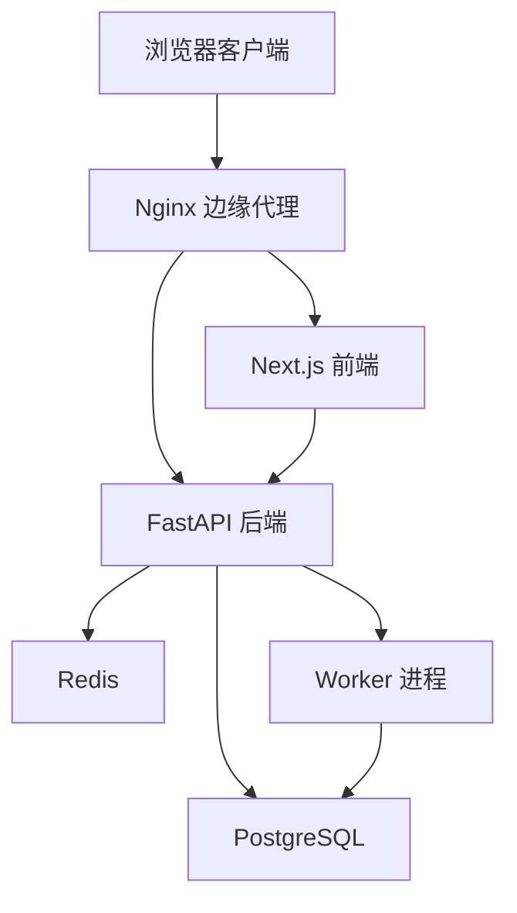
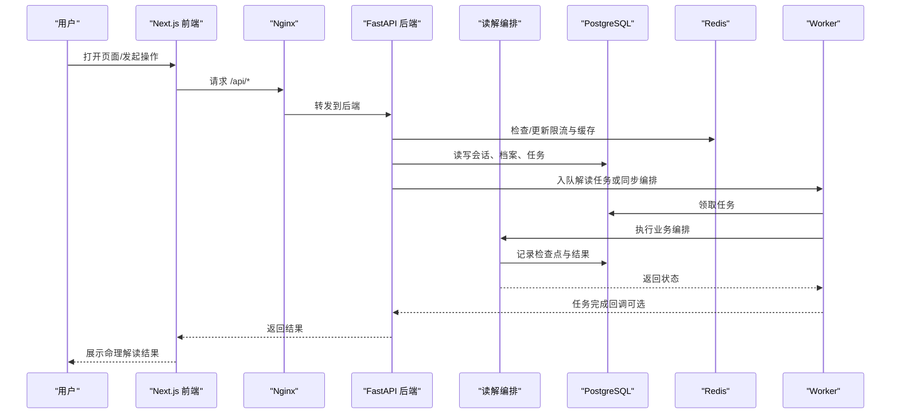
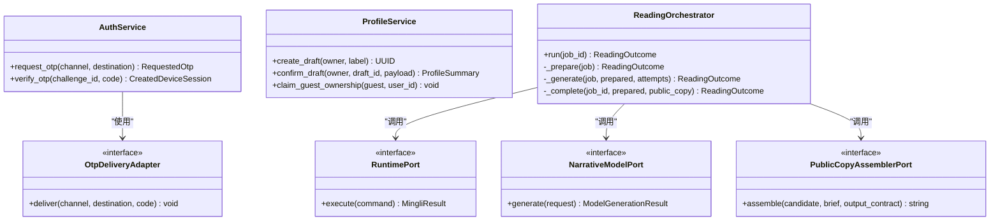
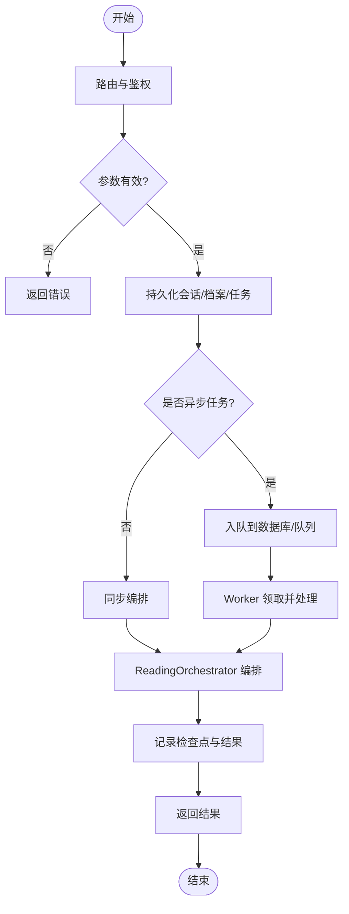
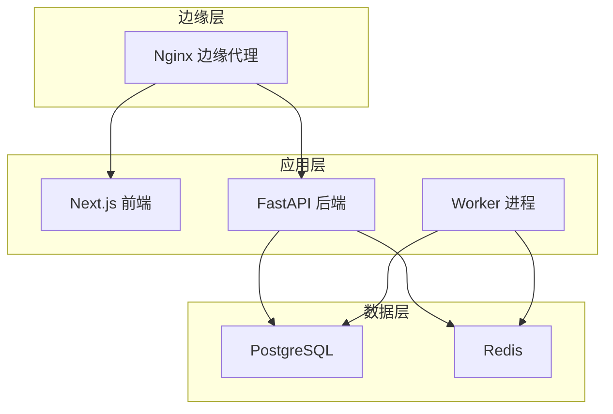
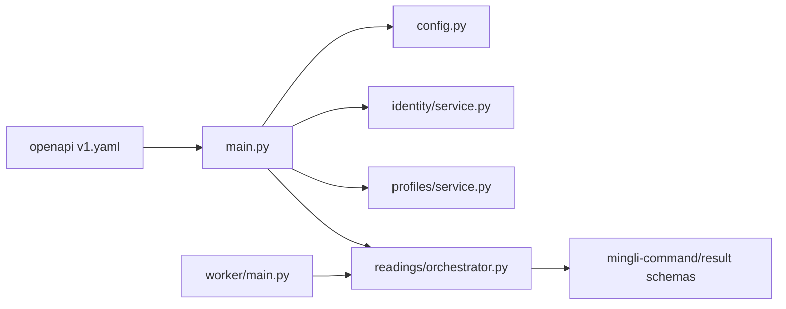

# 架构设计

<cite>
**本文引用的文件**
- [README.md](file://README.md)
- [DESIGN.md](file://DESIGN.md)
- [backend/app/main.py](file://backend/app/main.py)
- [backend/app/config.py](file://backend/app/config.py)
- [backend/app/readings/orchestrator.py](file://backend/app/readings/orchestrator.py)
- [backend/app/identity/service.py](file://backend/app/identity/service.py)
- [backend/app/profiles/service.py](file://backend/app/profiles/service.py)
- [backend/worker/main.py](file://backend/worker/main.py)
- [contracts/openapi/v1.yaml](file://contracts/openapi/v1.yaml)
- [contracts/schemas/mingli-command-v2.schema.json](file://contracts/schemas/mingli-command-v2.schema.json)
- [contracts/schemas/mingli-result-v2.schema.json](file://contracts/schemas/mingli-result-v2.schema.json)
- [infra/docker/backend.Dockerfile](file://infra/docker/backend.Dockerfile)
- [infra/docker/web.Dockerfile](file://infra/docker/web.Dockerfile)
- [infra/nginx/app.conf](file://infra/nginx/app.conf)
- [infra/compose.local.yml](file://infra/compose.local.yml)
- [docs/adr/0001-use-a-modular-monolith-on-alibaba-cloud.md](file://docs/adr/0001-use-a-modular-monolith-on-alibaba-cloud.md)
</cite>

## 目录
1. [简介](#简介)
2. [项目结构](#项目结构)
3. [核心组件](#核心组件)
4. [架构总览](#架构总览)
5. [详细组件分析](#详细组件分析)
6. [依赖关系分析](#依赖关系分析)
7. [性能考虑](#性能考虑)
8. [故障排查指南](#故障排查指南)
9. [结论](#结论)
10. [附录](#附录)

## 简介
本架构设计文档面向 Mingli Web（FateRadar）项目的模块化单体实现，说明如何以 Next.js 前端、FastAPI 后端、PostgreSQL 持久化、Redis 缓存与限流、以及独立 Worker 进程协同工作。文档重点解释身份认证、用户档案、命理解读等域模块的边界隔离方式，描述从用户请求到命理解析结果的数据流向与处理流程，并阐述容器化部署、Nginx 反向代理、负载均衡、扩展点与集成模式（适配器）、安全设计与监控方案。

## 项目结构
仓库采用多模块、多进程的模块化单体：
- 前端：Next.js 应用，提供公共页面与私人应用界面，通过同源 /api 访问后端。
- 后端：FastAPI 模块化单体，按领域划分 identity、profiles、readings、admin、adapters、security 等子模块；统一入口在 main.py。
- 异步任务：独立的 worker 进程，轮询数据库中的待处理任务并执行命理解读编排。
- 数据层：PostgreSQL 作为业务事实源与任务事实源；Redis 用于缓存、限流与短期租约。
- 合同与契约：OpenAPI v1 定义对外 API；JSON Schema 定义命令与结果协议。
- 基础设施：Docker 镜像构建、Nginx 边缘反向代理、Compose 本地编排。

图表来源
- [infra/nginx/app.conf:1-45](file://infra/nginx/app.conf#L1-L45)
- [infra/compose.local.yml:31-67](file://infra/compose.local.yml#L31-L67)
- [infra/docker/backend.Dockerfile:1-23](file://infra/docker/backend.Dockerfile#L1-L23)
- [infra/docker/web.Dockerfile:1-27](file://infra/docker/web.Dockerfile#L1-L27)

章节来源
- [README.md:24-35](file://README.md#L24-L35)
- [infra/compose.local.yml:1-93](file://infra/compose.local.yml#L1-L93)

## 核心组件
- FastAPI 应用装配：创建应用实例、注册路由、异常处理器、速率限制器、OTP 适配器等。
- 配置与安全：集中式 Settings，生产环境强制安全策略（Secure Cookie、禁用 Fake OTP/Runtime/Model、固定路径与白名单）。
- 身份认证：Guest Session、OTP 挑战与验证、设备会话创建与审计事件记录。
- 用户档案：草稿创建、确认生成不可变版本、访客资源向已认证用户的原子迁移。
- 命理解读编排：状态机驱动的准备、生成、完成阶段，结合运行时、模型、守卫与公开副本组装。
- 异步 Worker：通用工作单元抽象与轮询执行，读取任务并调用领域处理器。
- 外部契约：OpenAPI 接口与 JSON Schema 命令/结果协议确保跨进程与跨语言一致性。

章节来源
- [backend/app/main.py:30-156](file://backend/app/main.py#L30-L156)
- [backend/app/config.py:62-335](file://backend/app/config.py#L62-L335)
- [backend/app/identity/service.py:28-192](file://backend/app/identity/service.py#L28-L192)
- [backend/app/profiles/service.py:44-189](file://backend/app/profiles/service.py#L44-L189)
- [backend/app/readings/orchestrator.py:43-450](file://backend/app/readings/orchestrator.py#L43-L450)
- [backend/worker/main.py:10-120](file://backend/worker/main.py#L10-L120)
- [contracts/openapi/v1.yaml:1-800](file://contracts/openapi/v1.yaml#L1-L800)
- [contracts/schemas/mingli-command-v2.schema.json:1-126](file://contracts/schemas/mingli-command-v2.schema.json#L1-L126)
- [contracts/schemas/mingli-result-v2.schema.json:1-392](file://contracts/schemas/mingli-result-v2.schema.json#L1-L392)

## 架构总览
系统采用“模块化单体 + 独立 Worker”的模式，将身份认证、用户档案、命理解读等能力封装为清晰领域模块，并通过共享数据库迁移与领域代码保持事务一致性。Nginx 作为边缘代理统一暴露 /api 与静态资源，Next.js 负责渲染与交互，FastAPI 提供 RESTful API，Worker 承担耗时任务（如命理解读编排）。

图表来源
- [infra/nginx/app.conf:16-32](file://infra/nginx/app.conf#L16-L32)
- [infra/compose.local.yml:31-67](file://infra/compose.local.yml#L31-L67)
- [backend/app/readings/orchestrator.py:212-450](file://backend/app/readings/orchestrator.py#L212-L450)
- [backend/worker/main.py:74-115](file://backend/worker/main.py#L74-L115)

章节来源
- [docs/adr/0001-use-a-modular-monolith-on-alibaba-cloud.md:1-13](file://docs/adr/0001-use-a-modular-monolith-on-alibaba-cloud.md#L1-L13)
- [README.md:39-73](file://README.md#L39-L73)

## 详细组件分析

### 模块化单体与领域边界
- 身份认证域：管理 Guest Session、OTP 挑战与验证、设备会话与审计事件，使用内存挑战存储与请求限流器，支持 fake/smtp/disabled 多种 OTP 投递适配器。
- 用户档案域：支持草稿创建与确认，生成不可变版本；提供访客资源向已认证用户的原子迁移，保证所有权转移的一致性。
- 命理解读域：通过 ReadingOrchestrator 驱动 Prepare/Generate/Complete 三阶段，结合 RuntimePort、NarrativeModelPort、NarrativeGuardPort、PublicCopyAssemblerPort 等端口进行解耦，输出 Accepted Copy。
- 适配器模式：OTP 投递、Runtime 执行、模型调用、公开副本组装均通过 Protocol/Adapter 抽象，便于替换实现与测试。

图表来源
- [backend/app/identity/service.py:78-192](file://backend/app/identity/service.py#L78-L192)
- [backend/app/profiles/service.py:44-189](file://backend/app/profiles/service.py#L44-L189)
- [backend/app/readings/orchestrator.py:81-186](file://backend/app/readings/orchestrator.py#L81-L186)

章节来源
- [backend/app/identity/service.py:28-192](file://backend/app/identity/service.py#L28-L192)
- [backend/app/profiles/service.py:44-189](file://backend/app/profiles/service.py#L44-L189)
- [backend/app/readings/orchestrator.py:43-450](file://backend/app/readings/orchestrator.py#L43-L450)

### 请求处理流程：从用户请求到命理解析结果
- 前端通过 Next.js 页面触发操作，提交表单或点击按钮。
- Nginx 将 /api/* 请求转发给 FastAPI，同时设置安全响应头与缓存控制。
- FastAPI 校验输入、鉴权与会话，必要时写入 PostgreSQL（会话、档案、任务），并将解读任务入队或直接编排。
- Worker 轮询任务，调用 ReadingOrchestrator 执行 Prepare/Generate/Complete，期间记录检查点与告警。
- 完成后，前端轮询读取结果，展示公开副本与证据。

图表来源
- [contracts/openapi/v1.yaml:221-549](file://contracts/openapi/v1.yaml#L221-L549)
- [backend/app/readings/orchestrator.py:212-450](file://backend/app/readings/orchestrator.py#L212-L450)
- [backend/worker/main.py:74-115](file://backend/worker/main.py#L74-L115)

章节来源
- [contracts/openapi/v1.yaml:1-800](file://contracts/openapi/v1.yaml#L1-L800)
- [backend/app/readings/orchestrator.py:212-450](file://backend/app/readings/orchestrator.py#L212-L450)
- [backend/worker/main.py:74-115](file://backend/worker/main.py#L74-L115)

### 关键决策：为什么选择模块化单体
- 当前规模下，支付、权益与解读的一致性可保留在一个事务边界内，降低分布式复杂度。
- 深模块接口（Protocol/Adapter）保留未来拆分空间，避免过早微服务化带来的运维与一致性成本。
- PostgreSQL 作为业务事实源与任务事实源，Redis 仅用于缓存、限流与短期租约，不成为唯一记录。

章节来源
- [docs/adr/0001-use-a-modular-monolith-on-alibaba-cloud.md:1-13](file://docs/adr/0001-use-a-modular-monolith-on-alibaba-cloud.md#L1-L13)

### 基础设施架构：容器化、Nginx 与编排
- Docker 镜像：后端使用 Python 3.12 基础镜像，安装 uv 并冻结依赖；前端使用 Node 24 构建并运行 standalone 产物。
- Compose 编排：包含 PostgreSQL、Redis、API、Worker、Web、Edge（Nginx）服务，健康检查与端口映射明确。
- Nginx 反向代理：统一暴露 /healthz、/api/* 与静态资源，设置安全头与缓存策略，转发真实 IP 与请求 ID。

图表来源
- [infra/docker/backend.Dockerfile:1-23](file://infra/docker/backend.Dockerfile#L1-L23)
- [infra/docker/web.Dockerfile:1-27](file://infra/docker/web.Dockerfile#L1-L27)
- [infra/nginx/app.conf:1-45](file://infra/nginx/app.conf#L1-L45)
- [infra/compose.local.yml:1-93](file://infra/compose.local.yml#L1-L93)

章节来源
- [infra/docker/backend.Dockerfile:1-23](file://infra/docker/backend.Dockerfile#L1-L23)
- [infra/docker/web.Dockerfile:1-27](file://infra/docker/web.Dockerfile#L1-L27)
- [infra/nginx/app.conf:1-45](file://infra/nginx/app.conf#L1-L45)
- [infra/compose.local.yml:1-93](file://infra/compose.local.yml#L1-L93)

## 依赖关系分析
- 应用装配依赖：main.py 注入 Settings、Database、RateLimiters、OTP Adapters，并注册路由与异常处理器。
- 领域模块依赖：identity、profiles、readings 通过 Repository/Service 分层访问数据库与外部适配器。
- 契约依赖：OpenAPI 与 JSON Schema 约束前后端与进程间通信，确保命令与结果格式一致。
- 基础设施依赖：Compose 编排服务间的启动顺序与健康检查，Nginx 转发规则决定流量走向。

图表来源
- [backend/app/main.py:30-156](file://backend/app/main.py#L30-L156)
- [backend/app/config.py:62-335](file://backend/app/config.py#L62-L335)
- [backend/app/readings/orchestrator.py:43-450](file://backend/app/readings/orchestrator.py#L43-L450)
- [contracts/openapi/v1.yaml:1-800](file://contracts/openapi/v1.yaml#L1-L800)
- [contracts/schemas/mingli-command-v2.schema.json:1-126](file://contracts/schemas/mingli-command-v2.schema.json#L1-L126)
- [contracts/schemas/mingli-result-v2.schema.json:1-392](file://contracts/schemas/mingli-result-v2.schema.json#L1-L392)
- [backend/worker/main.py:74-115](file://backend/worker/main.py#L74-L115)

章节来源
- [backend/app/main.py:30-156](file://backend/app/main.py#L30-L156)
- [backend/app/config.py:62-335](file://backend/app/config.py#L62-L335)
- [backend/app/readings/orchestrator.py:43-450](file://backend/app/readings/orchestrator.py#L43-L450)
- [contracts/openapi/v1.yaml:1-800](file://contracts/openapi/v1.yaml#L1-L800)
- [contracts/schemas/mingli-command-v2.schema.json:1-126](file://contracts/schemas/mingli-command-v2.schema.json#L1-L126)
- [contracts/schemas/mingli-result-v2.schema.json:1-392](file://contracts/schemas/mingli-result-v2.schema.json#L1-L392)
- [backend/worker/main.py:74-115](file://backend/worker/main.py#L74-L115)

## 性能考虑
- 速率限制：应用级 WindowRateLimiter 对阅读写入、个人资料写入、访客会话创建、管理员登录等进行窗口限流，防止滥用与雪崩。
- 超时与回退：模型调用与运行时传输具备连接、读取与整体超时限制；Prepare/Complete 失败时采用指数退避与重试。
- 幂等性：读取版本创建支持 Idempotency-Key，重复请求返回相同结果，避免重复计费与重复计算。
- 缓存与限流：Redis 用于 OTP 请求限流、短期租约与缓存，减轻数据库压力。
- 构建优化：前端使用 standalone 构建减少运行时依赖；后端使用 uv 冻结依赖提升启动速度。

章节来源
- [backend/app/main.py:73-88](file://backend/app/main.py#L73-L88)
- [backend/app/config.py:126-145](file://backend/app/config.py#L126-L145)
- [backend/app/readings/orchestrator.py:187-194](file://backend/app/readings/orchestrator.py#L187-L194)
- [contracts/openapi/v1.yaml:221-549](file://contracts/openapi/v1.yaml#L221-L549)
- [infra/docker/web.Dockerfile:14-27](file://infra/docker/web.Dockerfile#L14-L27)
- [infra/docker/backend.Dockerfile:10-23](file://infra/docker/backend.Dockerfile#L10-L23)

## 故障排查指南
- 健康检查：/api/v1/health/live 与 /api/v1/health/ready 分别确认进程存活与依赖就绪；Nginx 提供 /healthz 边缘健康探针。
- 常见错误：
  - 422 无效请求：由 FastAPI 验证失败触发，统一转换为问题响应。
  - 429 请求过多：OTP、阅读写入、个人资料写入、管理员登录等触发限流。
  - 503 服务不可用：运行时未知或依赖不可达时返回。
- 调试建议：
  - 检查 Redis 与 PostgreSQL 健康状态。
  - 查看 Worker 日志与任务检查点，确认 Prepare/Generate/Complete 阶段状态。
  - 核对 OpenAPI 与 JSON Schema 一致性，确保前后端契约未漂移。

章节来源
- [contracts/openapi/v1.yaml:15-39](file://contracts/openapi/v1.yaml#L15-L39)
- [infra/nginx/app.conf:10-14](file://infra/nginx/app.conf#L10-L14)
- [backend/app/main.py:115-136](file://backend/app/main.py#L115-L136)
- [backend/app/readings/orchestrator.py:250-285](file://backend/app/readings/orchestrator.py#L250-L285)

## 结论
Mingli Web 采用模块化单体架构，在保证一致性与可维护性的前提下，通过清晰的领域边界、适配器模式与显式契约，实现了身份认证、用户档案与命理解读的解耦与协作。Nginx 边缘代理、容器化编排与独立 Worker 构成了可扩展的基础设施。配合严格的配置校验、速率限制与超时控制，系统在性能与安全方面具备良好基线。未来可在不破坏现有边界的前提下逐步演进为更细粒度的服务。

## 附录
- 设计系统与品牌规范：遵循东方编辑档案风格，强调私密、精确与可核对。
- 本地运行：可通过 Docker Compose 启动完整链路，或通过命令行分别启动 API、Worker 与前端。
- 安全实践：生产环境禁用 Fake OTP/Runtime/Model，强制 Secure Cookie 与固定路径，密钥通过环境变量注入。

章节来源
- [DESIGN.md:131-156](file://DESIGN.md#L131-L156)
- [README.md:39-73](file://README.md#L39-L73)
- [backend/app/config.py:188-329](file://backend/app/config.py#L188-L329)