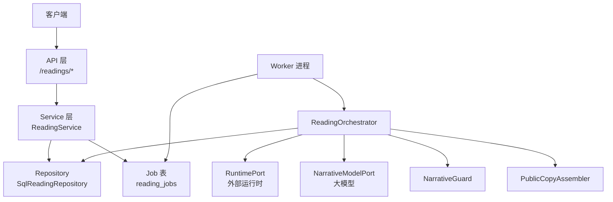
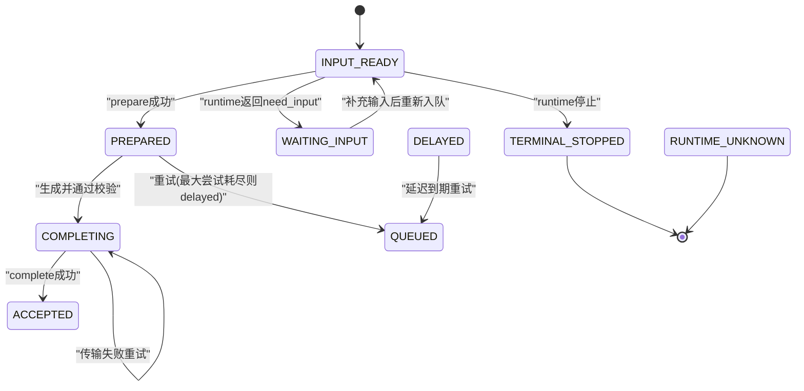
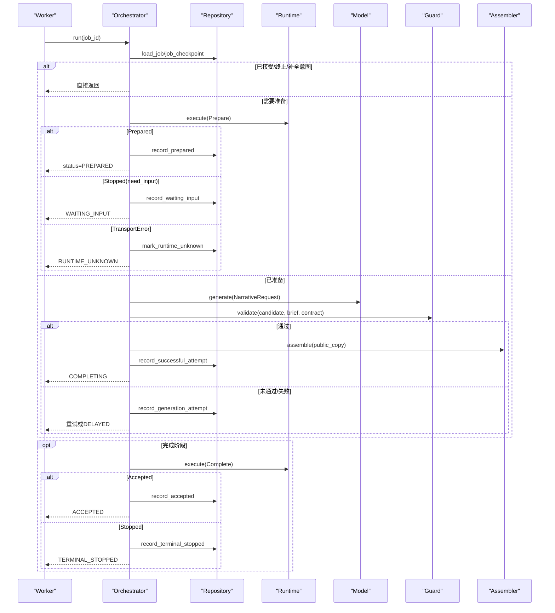
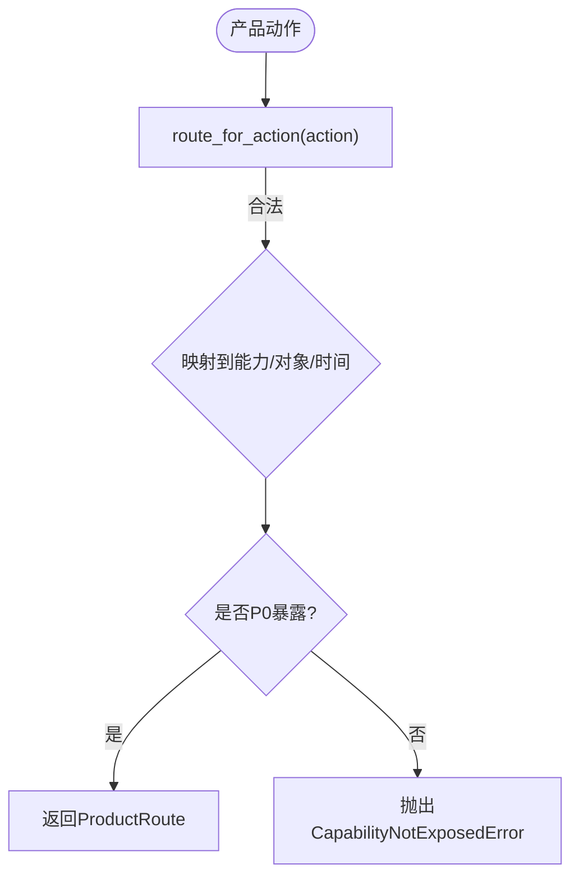
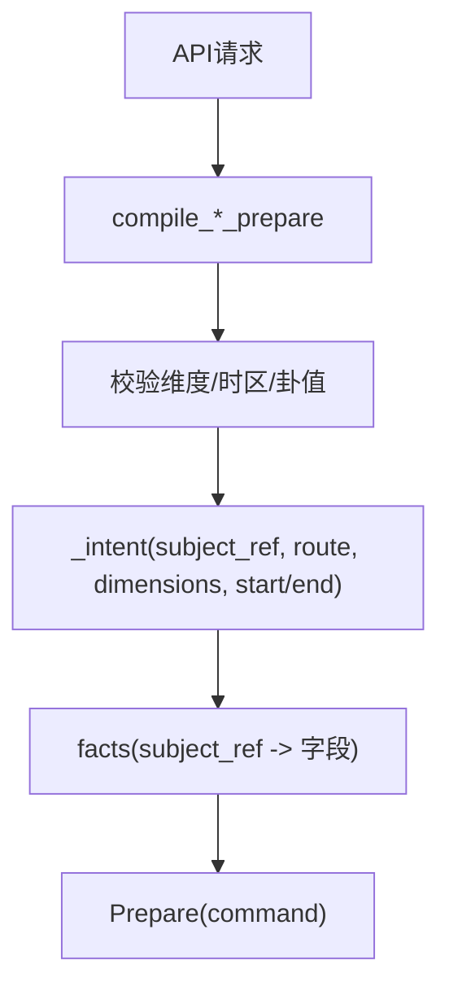
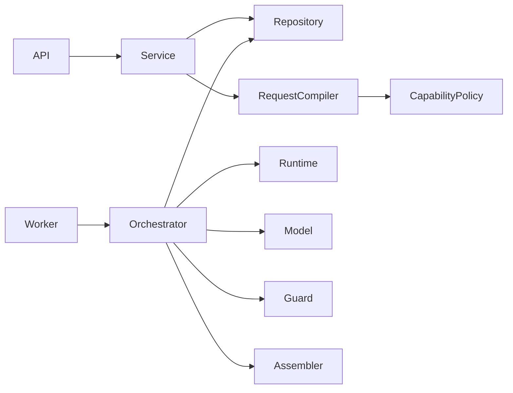

# 命理解读领域

<cite>
**本文引用的文件**
- [backend/app/readings/orchestrator.py](file://backend/app/readings/orchestrator.py)
- [backend/app/readings/capability_policy.py](file://backend/app/readings/capability_policy.py)
- [backend/app/readings/models.py](file://backend/app/readings/models.py)
- [backend/worker/readings.py](file://backend/worker/readings.py)
- [backend/app/readings/service.py](file://backend/app/readings/service.py)
- [backend/app/readings/repository.py](file://backend/app/readings/repository.py)
- [backend/app/api/readings.py](file://backend/app/api/readings.py)
- [backend/app/readings/request_compiler.py](file://backend/app/readings/request_compiler.py)
- [backend/app/readings/status.py](file://backend/app/readings/status.py)
- [backend/app/readings/runtime_contracts.py](file://backend/app/readings/runtime_contracts.py)
</cite>

## 目录
1. [简介](#简介)
2. [项目结构](#项目结构)
3. [核心组件](#核心组件)
4. [架构总览](#架构总览)
5. [详细组件分析](#详细组件分析)
6. [依赖关系分析](#依赖关系分析)
7. [性能与可靠性](#性能与可靠性)
8. [故障排查指南](#故障排查指南)
9. [结论](#结论)
10. [附录：端到端流程示例](#附录端到端流程示例)

## 简介
本文件聚焦命理解读领域的后端实现，系统性阐述“解读编排系统”的设计与实现。重点包括：
- ReadingOrchestrator 的任务编排、状态机推进与重试策略
- 能力策略 CapabilityPolicy 对功能暴露与产品路由的管控
- 解读结果数据模型 ReadingRoot、ReadingVersion、证据链（GenerationAttempt、AcceptedCopy）等
- Worker 进程与主服务的异步任务处理机制（领租、执行、回写）
- 不同解读类型（八字、运势、六爻）的处理流程与输入编译
- 质量评估与用户反馈收集（验证记录）

## 项目结构
后端围绕“服务层 + 编排器 + 仓库 + Worker 工作进程 + API 网关”分层组织：
- API 层：接收请求、鉴权、限流、参数校验，调用 Service
- Service 层：业务编排（创建版本、持久化 Prepare、入队 Job、查询摘要/结果、提交验证）
- Repository 层：数据库访问（加密存储 Prepare、Job 队列、版本、尝试记录、验证）
- Orchestrator：读取检查点，驱动 Runtime 与模型生成，组装公开副本，完成最终接受
- Worker：从数据库领取 Job，执行编排，更新状态并释放租约
- 能力策略：限制可暴露的能力与产品动作映射

**图表来源**
- [backend/app/api/readings.py:87-200](file://backend/app/api/readings.py#L87-L200)
- [backend/app/readings/service.py:117-513](file://backend/app/readings/service.py#L117-L513)
- [backend/app/readings/repository.py:51-200](file://backend/app/readings/repository.py#L51-L200)
- [backend/app/readings/orchestrator.py:178-450](file://backend/app/readings/orchestrator.py#L178-L450)
- [backend/worker/readings.py:108-286](file://backend/worker/readings.py#L108-L286)

**章节来源**
- [backend/app/api/readings.py:87-200](file://backend/app/api/readings.py#L87-L200)
- [backend/app/readings/service.py:117-513](file://backend/app/readings/service.py#L117-L513)
- [backend/app/readings/repository.py:51-200](file://backend/app/readings/repository.py#L51-L200)
- [backend/app/readings/orchestrator.py:178-450](file://backend/app/readings/orchestrator.py#L178-L450)
- [backend/worker/readings.py:108-286](file://backend/worker/readings.py#L108-L286)

## 核心组件
- ReadingOrchestrator：编排 Prepare -> Generate -> Complete 的生命周期，维护检查点与重试退避，产出 Accepted 或中间态
- CapabilityPolicy：定义 P0 暴露能力与产品动作到能力/对象/时间维度的路由
- ReadingService：对外 API 的业务入口，负责输入编译、幂等性、版本创建、Job 入队、结果与验证
- SqlReadingRepository：持久化 ReadingRoot/Version、Prepare/Complete 密文、GenerationAttempt/AcceptedCopy、Job 队列、验证
- Worker：基于数据库锁与租约的分布式任务执行器，安全地驱动 Orchestrator 推进状态

**章节来源**
- [backend/app/readings/orchestrator.py:178-450](file://backend/app/readings/orchestrator.py#L178-L450)
- [backend/app/readings/capability_policy.py:1-68](file://backend/app/readings/capability_policy.py#L1-L68)
- [backend/app/readings/service.py:117-819](file://backend/app/readings/service.py#L117-L819)
- [backend/app/readings/repository.py:51-862](file://backend/app/readings/repository.py#L51-L862)
- [backend/worker/readings.py:108-286](file://backend/worker/readings.py#L108-L286)

## 架构总览
解读生命周期由 Orchestrator 驱动，状态机如下：
- input_ready -> prepared -> completing -> accepted
- 中途可能进入 waiting_input / terminal_stopped / delayed / runtime_unknown
- 通过 Job 表进行异步调度，Worker 以租约方式独占执行，避免重复消费

**图表来源**
- [backend/app/readings/status.py:1-13](file://backend/app/readings/status.py#L1-L13)
- [backend/app/readings/orchestrator.py:212-450](file://backend/app/readings/orchestrator.py#L212-L450)
- [backend/worker/readings.py:175-231](file://backend/worker/readings.py#L175-L231)

## 详细组件分析

### ReadingOrchestrator：编排与状态推进
- 职责：加载 Job 与 Checkpoint，按状态分支执行 _prepare/_generate/_complete；记录尝试、成本、告警；处理传输错误与重试退避
- 关键设计：
  - 使用 Protocol 抽象 RuntimePort/NarrativeModelPort/Guard/Assembler，便于替换与测试
  - 通过 Clock 注入时间，便于测试与确定性控制
  - 严格不变式校验（如 token 一致性、public_copy 一致性），防止状态漂移
  - 支持 cancel_after_commit 在事务外取消后续操作

**图表来源**
- [backend/app/readings/orchestrator.py:212-450](file://backend/app/readings/orchestrator.py#L212-L450)

**章节来源**
- [backend/app/readings/orchestrator.py:178-450](file://backend/app/readings/orchestrator.py#L178-L450)

### CapabilityPolicy：能力暴露与产品路由
- 作用：限定当前产品版本暴露的能力集合，并将前端动作（profile_preview/today/near_seven/liuyao_one_question）映射到能力、对象、时间维度
- 关键点：
  - V51_RELEASE_CAPABILITY_IDS 列出全部能力
  - P0_EXPOSED_CAPABILITY_IDS 仅暴露 bazi/fortune/liuyao
  - route_for_action 校验动作合法性并强制 P0 能力白名单

**图表来源**
- [backend/app/readings/capability_policy.py:1-68](file://backend/app/readings/capability_policy.py#L1-L68)

**章节来源**
- [backend/app/readings/capability_policy.py:1-68](file://backend/app/readings/capability_policy.py#L1-L68)

### RequestCompiler：解读类型输入编译
- 将高层 API 请求编译为 Prepare 命令，包含 intent（capability/object/horizon/dimensions）与 facts（用户资料/事件信息）
- 支持的解读类型：
  - 八字（bazi）：基于用户画像（出生时间、时区、地点、性别、政策）
  - 运势（fortune）：今日/本周，基于参考时间与 horizon
  - 六爻（liuyao）：支持数字卦或手动掷卦，需事件时间与地点

**图表来源**
- [backend/app/readings/request_compiler.py:96-216](file://backend/app/readings/request_compiler.py#L96-L216)
- [backend/app/readings/request_compiler.py:35-94](file://backend/app/readings/request_compiler.py#L35-L94)

**章节来源**
- [backend/app/readings/request_compiler.py:1-216](file://backend/app/readings/request_compiler.py#L1-L216)

### Service：业务编排与幂等性
- 提供 start_preview/start_fortune/start_liuyao/supply_input/get_result/follow_up/submit_verification 等方法
- 幂等性：通过 Idempotency-Key 计算 key_hash 与 request_fingerprint，避免重复提交
- 输入校验：根据 runtime 返回的 input_request 要求，校验字段类型、范围、选择项
- 跟进（follow-up）：基于上一次 Accepted Copy 构造新的 Prepare，延续 lineage

**章节来源**
- [backend/app/readings/service.py:117-819](file://backend/app/readings/service.py#L117-L819)

### Repository：数据模型与持久化
- 核心实体：
  - ReadingRoot：解读根（归属用户/访客、能力ID）
  - ReadingVersion：解读版本（状态、能力、对象、维度、horizon、Prepare/Complete 密文包）
  - FactBrief：事实简报（用于公共面板展示）
  - GenerationAttempt：每次模型生成的候选与错误、收据
  - AcceptedCopy：最终接受的公开副本（密文+摘要）
  - ReadingJobRecord：Job 队列（状态、租约、可用时间）
  - ReadingIdempotencyKey：幂等键
  - ReadingVerification：用户反馈（outcome: accepted/partial/disagreed/unknown）
- 安全：Prepare/Complete/Result 等敏感数据通过 EnvelopeCipher 加密存储，附带指纹

**章节来源**
- [backend/app/readings/models.py:28-378](file://backend/app/readings/models.py#L28-L378)
- [backend/app/readings/repository.py:51-862](file://backend/app/readings/repository.py#L51-L862)

### Worker：异步任务处理
- 工作源 ReadingJobWorkSource：
  - 使用 for_update(skip_locked=True) 选取可执行 Job
  - 处理过期租约与无 state_token 的 Prepare 特殊路径（标记 runtime_unknown）
- 处理器 ReadingJobProcessor：
  - 校验当前租约有效性，调用 Orchestrator.run
  - 根据 Outcome 映射 Job 状态，设置 available_at（含 retry_not_before）
  - 提交后释放租约，必要时触发取消
- 构建：根据配置选择真实或模拟的 Runtime/Model 适配器

**章节来源**
- [backend/worker/readings.py:108-286](file://backend/worker/readings.py#L108-L286)

### Runtime Contracts：协议与契约
- 命令/结果类型：Describe/Prepare/Complete 与 Described/Prepared/Accepted/Stopped
- 使用 JSON Schema 校验 payload，确保跨进程/模块边界的数据一致性
- ReadingBrief 封装 brief 数据，冻结/解冻保证不可变性与序列化兼容

**章节来源**
- [backend/app/readings/runtime_contracts.py:1-304](file://backend/app/readings/runtime_contracts.py#L1-L304)

## 依赖关系分析
- API 层依赖 Service，Service 依赖 Repository 与 ProfileService
- Orchestrator 依赖 Repository/Runtime/Model/Guard/Assembler/Clock/AlertSink
- Worker 依赖 Database、OrchestratorFactory、ReadingJobWorkSource/Processor
- CapabilityPolicy 被 RequestCompiler 与 API 层共同引用，约束产品行为

**图表来源**
- [backend/app/api/readings.py:87-200](file://backend/app/api/readings.py#L87-L200)
- [backend/app/readings/service.py:117-513](file://backend/app/readings/service.py#L117-L513)
- [backend/app/readings/request_compiler.py:35-94](file://backend/app/readings/request_compiler.py#L35-L94)
- [backend/app/readings/orchestrator.py:178-450](file://backend/app/readings/orchestrator.py#L178-L450)
- [backend/worker/readings.py:108-286](file://backend/worker/readings.py#L108-L286)

**章节来源**
- [backend/app/api/readings.py:87-200](file://backend/app/api/readings.py#L87-L200)
- [backend/app/readings/service.py:117-513](file://backend/app/readings/service.py#L117-L513)
- [backend/app/readings/request_compiler.py:35-94](file://backend/app/readings/request_compiler.py#L35-L94)
- [backend/app/readings/orchestrator.py:178-450](file://backend/app/readings/orchestrator.py#L178-L450)
- [backend/worker/readings.py:108-286](file://backend/worker/readings.py#L108-L286)

## 性能与可靠性
- 并发与幂等：
  - 幂等键避免重复提交，结合唯一索引保障一致性
  - Job 表使用 for_update(skip_locked=True) 与租约令牌避免重复执行
- 重试与退避：
  - Prepare/Complete 传输失败采用 backoff 重试
  - 模型生成失败达到上限后标记 delayed，延后重试
- 数据安全：
  - 敏感字段（Prepare/Result）加密存储，附带指纹校验
  - 严格的状态机与不变式检查，防止状态不一致
- 可扩展性：
  - Protocol 抽象使 Runtime/Model/Guard/Assembler 可替换，便于多提供商接入与本地测试

[本节为通用指导，不直接分析具体文件]

## 故障排查指南
- 常见错误与定位：
  - 运行时未知：当 Prepare 无 state_token 且传输失败，标记 runtime_unknown，需检查运行时可用性
  - 输入等待：stopped.reason == need_input 时，需根据 input_request 补充字段再提交
  - 生成失败：记录 generation_attempt 的错误列表与 model_receipt，检查模型配额/错误码
  - 幂等冲突：Idempotency-Key 与 action/fingerprint 不匹配，需更换 key 或修正请求体
  - 租约丢失：Worker 处理期间租约过期或被抢占，会抛出 LeaseLostError，应重试
- 日志与告警：
  - Orchestrator 通过 AlertSink 输出 guard_rejection、model_cost、delayed、runtime_unknown 等事件
  - Worker 启动时配置日志级别，便于追踪任务执行链路

**章节来源**
- [backend/app/readings/orchestrator.py:196-210](file://backend/app/readings/orchestrator.py#L196-L210)
- [backend/worker/readings.py:175-218](file://backend/worker/readings.py#L175-L218)
- [backend/app/readings/service.py:677-786](file://backend/app/readings/service.py#L677-L786)

## 结论
该命理解读系统通过清晰的职责分层与严格的协议契约，实现了高可靠、可扩展的解读编排与异步执行。ReadingOrchestrator 作为核心编排器，配合 Worker 的租约机制与 Repository 的加密持久化，确保了状态一致性与数据安全。CapabilityPolicy 与 RequestCompiler 保证了产品能力的可控暴露与输入合规。整体设计兼顾了用户体验（幂等、可跟进）、运维可观测性（告警、日志）与工程可维护性（Protocol 抽象、Schema 校验）。

[本节为总结性内容，不直接分析具体文件]

## 附录：端到端流程示例

### 提交八字解读预览
- 步骤：
  1. 调用 /readings/preview，携带 profile_version_id、query、dimension_ids、可选 Idempotency-Key
  2. Service 编译 Prepare（bazi），创建 ReadingRoot/Version，加密存储 Prepare，写入 Job
  3. Worker 领取 Job，执行 Orchestrator._prepare，若返回 Prepared 则入队下一阶段
  4. 继续执行 _generate，模型生成候选，Guard 校验，PublicCopyAssembler 组装公开副本
  5. 成功后进入 _complete，调用 Complete，得到 Accepted，记录 AcceptedCopy
- 相关路径：
  - API：[backend/app/api/readings.py:87-121](file://backend/app/api/readings.py#L87-L121)
  - Service：[backend/app/readings/service.py:129-165](file://backend/app/readings/service.py#L129-L165)
  - Compiler：[backend/app/readings/request_compiler.py:96-126](file://backend/app/readings/request_compiler.py#L96-L126)
  - Orchestrator：[backend/app/readings/orchestrator.py:250-394](file://backend/app/readings/orchestrator.py#L250-L394)
  - Worker：[backend/worker/readings.py:175-231](file://backend/worker/readings.py#L175-L231)

### 提交六爻占卜
- 步骤：
  1. 调用 /readings/liuyao，传入 cast（数字卦或 digital_coin）、event_datetime、timezone、location、subject_ref、query、dimension_ids
  2. Service 编译 Prepare（liuyao），创建 Version/Job
  3. 若 runtime 返回 need_input，Service 通过 supply_input 补充字段后重新入队
  4. Worker 执行编排，生成候选并通过 Guard/Assembler，完成 Accept
- 相关路径：
  - API：[backend/app/api/readings.py:198-239](file://backend/app/api/readings.py#L198-L239)
  - Service：[backend/app/readings/service.py:206-254](file://backend/app/readings/service.py#L206-L254)
  - Compiler：[backend/app/readings/request_compiler.py:183-216](file://backend/app/readings/request_compiler.py#L183-L216)
  - Service 输入校验：[backend/app/readings/service.py:677-786](file://backend/app/readings/service.py#L677-L786)

### 提交运势预测（今日/本周）
- 步骤：
  1. 调用 /readings/today 或 /readings/week，传入 profile_version_id、query
  2. Service 编译 Prepare（fortune），设置 horizon（day/week）与 reference_datetime
  3. 后续流程同八字/六爻
- 相关路径：
  - API：[backend/app/api/readings.py:124-195](file://backend/app/api/readings.py#L124-L195)
  - Service：[backend/app/readings/service.py:167-204](file://backend/app/readings/service.py#L167-L204)
  - Compiler：[backend/app/readings/request_compiler.py:129-170](file://backend/app/readings/request_compiler.py#L129-L170)

### 获取解读结果与用户反馈
- 获取结果：
  - 调用 get_summary/get_result，返回状态、公开事实面板、输入请求、验证摘要
  - 路径：[backend/app/readings/service.py:294-344](file://backend/app/readings/service.py#L294-L344)
- 提交验证：
  - 调用 submit_verification，记录 outcome（accepted/partial/disagreed/unknown）与 note
  - 路径：[backend/app/readings/service.py:346-365](file://backend/app/readings/service.py#L346-L365)
  - 数据模型：[backend/app/readings/models.py:340-367](file://backend/app/readings/models.py#L340-L367)

[本节为流程说明，不单独添加图表来源]