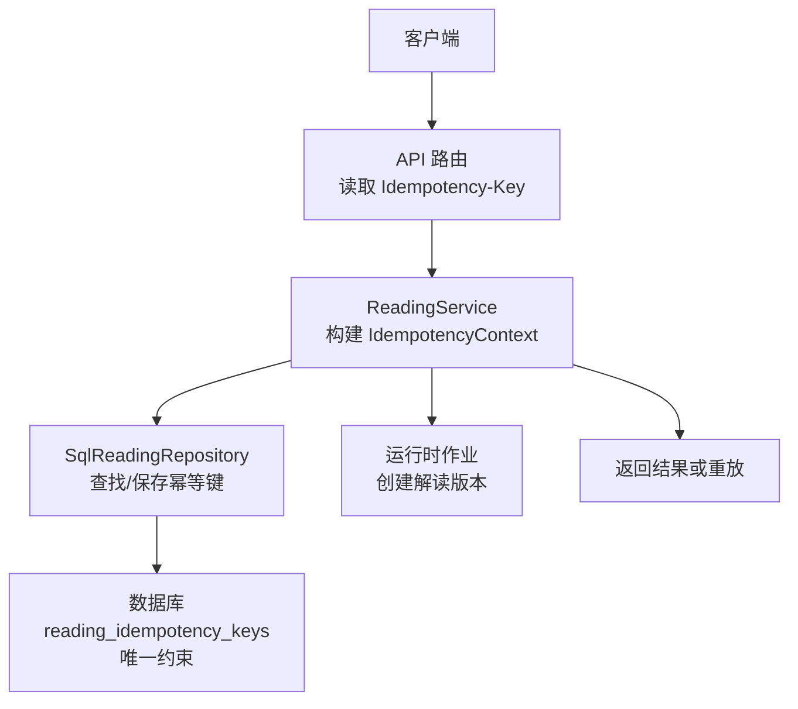
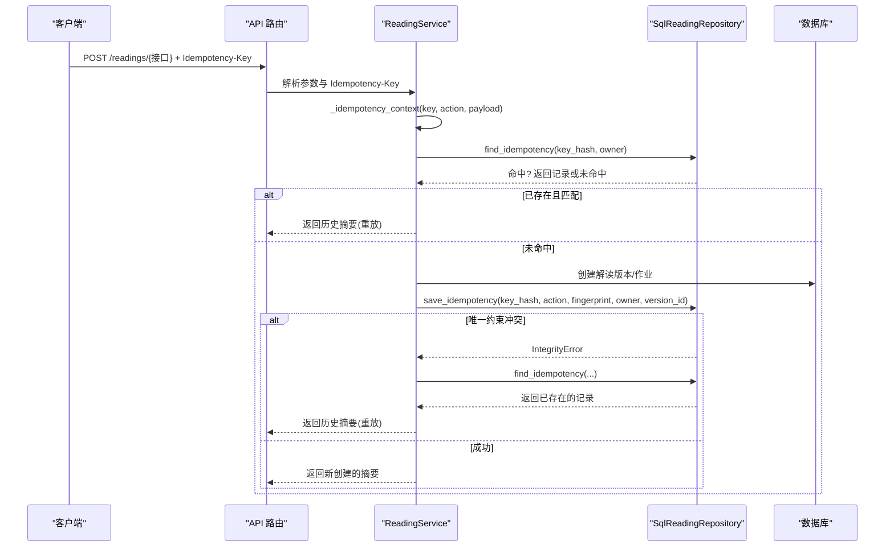
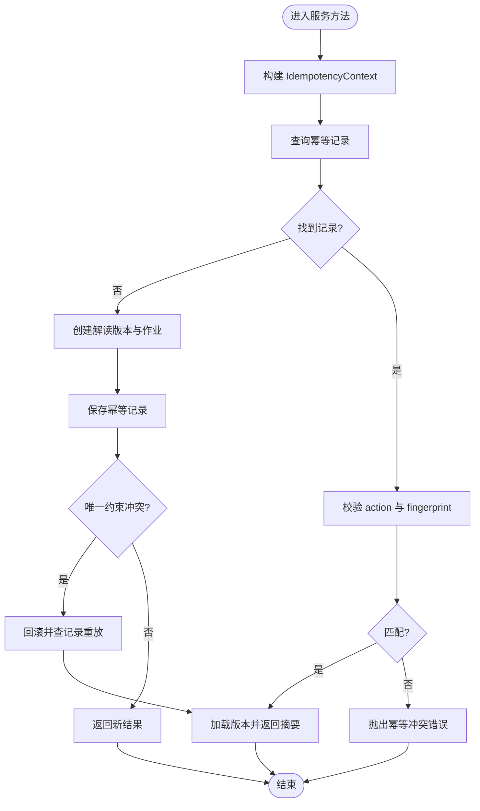
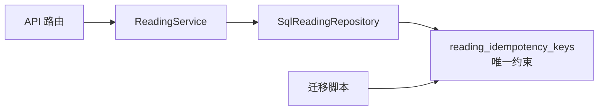

# 幂等性控制

<cite>
**本文引用的文件**
- [backend/app/readings/service.py](file://backend/app/readings/service.py)
- [backend/app/readings/repository.py](file://backend/app/readings/repository.py)
- [backend/app/readings/models.py](file://backend/app/readings/models.py)
- [backend/alembic/versions/0007_reading_api_idempotency_and_verification.py](file://backend/alembic/versions/0007_reading_api_idempotency_and_verification.py)
- [backend/app/api/readings.py](file://backend/app/api/readings.py)
- [web/src/lib/idempotency.ts](file://web/src/lib/idempotency.ts)
- [web/src/lib/api.ts](file://web/src/lib/api.ts)
- [tests/contract/test_openapi_contract.py](file://tests/contract/test_openapi_contract.py)
- [scripts/server_task13_trajectory_payload.py](file://scripts/server_task13_trajectory_payload.py)
</cite>

## 目录
1. [简介](#简介)
2. [项目结构](#项目结构)
3. [核心组件](#核心组件)
4. [架构总览](#架构总览)
5. [详细组件分析](#详细组件分析)
6. [依赖关系分析](#依赖关系分析)
7. [性能考虑](#性能考虑)
8. [故障排查指南](#故障排查指南)
9. [结论](#结论)
10. [附录](#附录)

## 简介
本文件系统性阐述命理解读服务中的幂等性控制机制，重点解释 IdempotencyContext 的设计原理与 HMAC 签名机制，说明 key_hash、action、request_fingerprint 三个关键字段的作用与计算方式；完整描述从请求接收到响应返回的幂等检查流程；覆盖 start_preview、start_fortune、start_liuyao、follow_up 等接口的幂等策略；解释并发场景下的唯一性约束与事务隔离选择；给出幂等键生命周期管理与过期策略建议；并提供客户端与服务端的具体调用示例路径。最后提供故障排查方法与性能优化建议。

## 项目结构
幂等性控制贯穿前端、API 层、服务层与数据层：
- 前端负责为每次“意图”生成稳定的幂等键，并在重试时复用同一键。
- API 层将幂等键作为请求头传入服务。
- 服务层基于 IdempotencyContext 计算并校验幂等键，结合数据库唯一约束实现“首次写入获胜”的幂等语义。
- 数据层通过迁移脚本创建幂等键表及唯一约束，确保跨进程/实例的强一致性。

图表来源
- [backend/app/api/readings.py:124-195](file://backend/app/api/readings.py#L124-L195)
- [backend/app/readings/service.py:129-254](file://backend/app/readings/service.py#L129-L254)
- [backend/app/readings/repository.py:406-446](file://backend/app/readings/repository.py#L406-L446)
- [backend/alembic/versions/0007_reading_api_idempotency_and_verification.py:24-62](file://backend/alembic/versions/0007_reading_api_idempotency_and_verification.py#L24-L62)

章节来源
- [backend/app/api/readings.py:124-195](file://backend/app/api/readings.py#L124-L195)
- [backend/app/readings/service.py:129-254](file://backend/app/readings/service.py#L129-L254)
- [backend/app/readings/repository.py:406-446](file://backend/app/readings/repository.py#L406-L446)
- [backend/alembic/versions/0007_reading_api_idempotency_and_verification.py:24-62](file://backend/alembic/versions/0007_reading_api_idempotency_and_verification.py#L24-L62)

## 核心组件
- IdempotencyContext：不可变的数据类，包含 key_hash、action、request_fingerprint，用于标识一次幂等请求的“操作类型+载荷指纹”。
- ReadingService：在 start_preview、start_fortune、start_liuyao、follow_up 等方法中构造 IdempotencyContext，先尝试重放（若存在），再持久化新记录，失败时回滚并重放。
- SqlReadingRepository：提供 find_idempotency 与 save_idempotency，后者在插入冲突时触发 IntegrityError，由服务层捕获并重放。
- 数据库表 reading_idempotency_keys：以 (key_hash, owner_user_id, owner_guest_session_id) 的唯一约束保证全局幂等。

章节来源
- [backend/app/readings/service.py:81-86](file://backend/app/readings/service.py#L81-L86)
- [backend/app/readings/service.py:429-453](file://backend/app/readings/service.py#L429-L453)
- [backend/app/readings/repository.py:406-446](file://backend/app/readings/repository.py#L406-L446)
- [backend/alembic/versions/0007_reading_api_idempotency_and_verification.py:24-62](file://backend/alembic/versions/0007_reading_api_idempotency_and_verification.py#L24-L62)

## 架构总览
幂等性控制的关键在于“服务端基于 key_hash 的唯一性约束 + 业务 action 与请求指纹的双重校验”，确保同一用户/会话对同一操作的重复提交只执行一次，且后续相同请求直接重放历史结果。

图表来源
- [backend/app/api/readings.py:124-195](file://backend/app/api/readings.py#L124-L195)
- [backend/app/readings/service.py:429-453](file://backend/app/readings/service.py#L429-L453)
- [backend/app/readings/repository.py:406-446](file://backend/app/readings/repository.py#L406-L446)
- [backend/alembic/versions/0007_reading_api_idempotency_and_verification.py:24-62](file://backend/alembic/versions/0007_reading_api_idempotency_and_verification.py#L24-L62)

## 详细组件分析

### IdempotencyContext 设计与 HMAC 签名机制
- key_hash：对原始 Idempotency-Key 进行哈希后的值，避免明文存储敏感键，同时作为唯一索引字段。
- action：表示具体操作类型，如 profile_preview、today、near_seven、liuyao_one_question、follow_up。不同 action 即使 key_hash 相同也不视为幂等重复。
- request_fingerprint：对请求关键负载（如 profile_version_id、query、cast、event_datetime、timezone、location、subject_ref、dimension_ids 等）进行稳定序列化后计算的指纹，防止同一 key 被用于不同请求体。

计算要点
- 服务层使用配置中的 identity_hash_key 作为 HMAC 密钥，对 key 与 payload 的组合进行签名/哈希，得到 key_hash 与 request_fingerprint。
- 前端通过稳定键生成逻辑，确保同一意图在重试时复用相同的 Idempotency-Key。

章节来源
- [backend/app/readings/service.py:81-86](file://backend/app/readings/service.py#L81-L86)
- [backend/app/readings/service.py:129-254](file://backend/app/readings/service.py#L129-L254)
- [backend/app/readings/service.py:597-600](file://backend/app/readings/service.py#L597-L600)
- [web/src/lib/idempotency.ts:1-17](file://web/src/lib/idempotency.ts#L1-L17)

### 幂等性检查完整流程
- 接收请求：API 路由从请求头读取 Idempotency-Key，并传递给服务方法。
- 构建上下文：服务根据 action 与请求负载构造 IdempotencyContext。
- 预检查：查询是否存在相同 key_hash 且属于同一用户的幂等记录。
- 重放分支：若存在且 action 与 request_fingerprint 均匹配，则加载对应 reading_version 并返回历史摘要。
- 新建分支：若不存在，创建解读版本与作业，随后尝试保存幂等记录；若唯一约束冲突，回滚事务并走重放分支。
- 返回响应：无论新建还是重放，最终都返回一致的摘要结构。

图表来源
- [backend/app/readings/service.py:429-453](file://backend/app/readings/service.py#L429-L453)
- [backend/app/readings/service.py:552-595](file://backend/app/readings/service.py#L552-L595)
- [backend/app/readings/repository.py:406-446](file://backend/app/readings/repository.py#L406-L446)

章节来源
- [backend/app/readings/service.py:429-453](file://backend/app/readings/service.py#L429-L453)
- [backend/app/readings/service.py:552-595](file://backend/app/readings/service.py#L552-L595)
- [backend/app/readings/repository.py:406-446](file://backend/app/readings/repository.py#L406-L446)

### 不同操作类型的幂等性策略
- start_preview（profile_preview）：对 profile_version_id、query、dimension_ids 参与指纹计算，确保预览维度一致才幂等。
- start_fortune（today/near_seven）：对 profile_version_id、query 参与指纹计算，区分今日与近七天的 action。
- start_liuyao（liuyao_one_question）：对 cast、event_datetime、timezone、location、subject_ref、query、dimension_ids 参与指纹计算，确保起卦输入一致。
- follow_up：对 reading_version_id、query 参与指纹计算，要求处于 Accepted 状态，并携带 prior_answer 上下文。

章节来源
- [backend/app/readings/service.py:129-165](file://backend/app/readings/service.py#L129-L165)
- [backend/app/readings/service.py:167-204](file://backend/app/readings/service.py#L167-L204)
- [backend/app/readings/service.py:206-254](file://backend/app/readings/service.py#L206-L254)
- [backend/app/readings/service.py:367-427](file://backend/app/readings/service.py#L367-L427)

### 并发场景下的幂等性实现
- 数据库唯一约束：reading_idempotency_keys 表以 (key_hash, owner_user_id, owner_guest_session_id) 建立唯一约束，保证多实例并发下仅第一条插入成功。
- 事务隔离级别：采用默认隔离级别配合唯一约束，利用“首次写入获胜”原则；当并发插入冲突时，服务层捕获 IntegrityError 并回滚，然后按已存在记录重放。
- 所有者边界：owner_user_id 与 owner_guest_session_id 互斥约束确保幂等记录严格绑定到单一所有者。

章节来源
- [backend/alembic/versions/0007_reading_api_idempotency_and_verification.py:24-62](file://backend/alembic/versions/0007_reading_api_idempotency_and_verification.py#L24-L62)
- [backend/app/readings/models.py:53-61](file://backend/app/readings/models.py#L53-L61)
- [backend/app/readings/service.py:429-453](file://backend/app/readings/service.py#L429-L453)

### 幂等键的生命周期管理与过期策略
当前代码库未内置自动过期清理逻辑。为避免无限增长，建议：
- 基于时间窗口清理：定期删除超过一定时长（如 24 小时）的幂等记录，因为幂等主要用于防抖与重试，长期保留收益有限。
- 基于业务实体级联：由于 reading_version_id 外键设置 CASCADE，删除解读版本时可间接清理相关幂等记录；但需注意幂等记录可能早于版本存在，因此仍需显式清理策略。
- 分片与归档：对高吞吐环境可按 owner_user_id 或 created_at 分表/分区，便于按时间范围清理。
- 监控与告警：统计幂等表大小与增长率，设定阈值告警，及时触发清理任务。

[本节为通用建议，不直接分析具体文件]

### 客户端幂等性键生成与服务端调用示例
- 客户端生成稳定键：使用稳定键函数，对意图对象 JSON 序列化后比较指纹，若不变则复用已有 Idempotency-Key，否则生成新的随机键。
- 客户端发送请求：在请求头中携带 Idempotency-Key，例如调用 /api/v1/readings/today、/api/v1/readings/week、/api/v1/readings/liuyao 等接口。
- 服务端处理：API 路由读取 Idempotency-Key 并传给服务；服务构造 IdempotencyContext 并执行幂等检查与重放。

章节来源
- [web/src/lib/idempotency.ts:1-17](file://web/src/lib/idempotency.ts#L1-L17)
- [web/src/lib/api.ts:1-200](file://web/src/lib/api.ts#L1-L200)
- [backend/app/api/readings.py:124-195](file://backend/app/api/readings.py#L124-L195)
- [scripts/server_task13_trajectory_payload.py:428-449](file://scripts/server_task13_trajectory_payload.py#L428-L449)

## 依赖关系分析
- API 路由依赖服务层方法，传递 Idempotency-Key。
- 服务层依赖仓库层进行幂等记录的查找与保存。
- 仓库层依赖数据库表的唯一约束保障并发安全。
- 迁移脚本定义幂等键表结构与约束。

图表来源
- [backend/app/api/readings.py:124-195](file://backend/app/api/readings.py#L124-L195)
- [backend/app/readings/service.py:429-453](file://backend/app/readings/service.py#L429-L453)
- [backend/app/readings/repository.py:406-446](file://backend/app/readings/repository.py#L406-L446)
- [backend/alembic/versions/0007_reading_api_idempotency_and_verification.py:24-62](file://backend/alembic/versions/0007_reading_api_idempotency_and_verification.py#L24-L62)

章节来源
- [backend/app/api/readings.py:124-195](file://backend/app/api/readings.py#L124-L195)
- [backend/app/readings/service.py:429-453](file://backend/app/readings/service.py#L429-L453)
- [backend/app/readings/repository.py:406-446](file://backend/app/readings/repository.py#L406-L446)
- [backend/alembic/versions/0007_reading_api_idempotency_and_verification.py:24-62](file://backend/alembic/versions/0007_reading_api_idempotency_and_verification.py#L24-L62)

## 性能考虑
- 减少不必要的幂等记录：仅在易重复提交的写操作启用幂等键，避免对高频读接口增加额外开销。
- 合理设置指纹字段：确保 request_fingerprint 仅包含必要且稳定的字段，避免过大负载导致指纹计算与存储成本上升。
- 数据库索引与约束：确保 key_hash 与所有者字段有合适索引，提升查找效率；唯一约束已在迁移中定义。
- 批量清理任务：定期清理过期幂等记录，降低表膨胀带来的查询与写入延迟。
- 监控指标：跟踪幂等命中率、冲突率、表大小与清理效果，指导调优。

[本节提供通用指导，不直接分析具体文件]

## 故障排查指南
- 幂等冲突错误：当 Idempotency-Key 被用于不同的 action 或请求体时，服务会抛出冲突错误。检查客户端是否正确为不同意图生成新键。
- 重放未命中：若 find_idempotency 未找到记录，服务不会重放，而是继续新建流程。确认是否传入了正确的 Idempotency-Key。
- 唯一约束冲突：并发插入时出现 IntegrityError 属正常现象，服务会回滚并重放。观察日志确认是否按预期重放。
- 前端重试行为：测试用例表明，同一意图重试时应复用相同 Idempotency-Key。检查 stableKeyForIntent 的实现与调用点。
- OpenAPI 契约：变更阶段要求 mutating 路由声明 CSRF 与幂等键参数。确保接口契约与实现一致。

章节来源
- [backend/app/readings/service.py:552-595](file://backend/app/readings/service.py#L552-L595)
- [backend/app/readings/service.py:429-453](file://backend/app/readings/service.py#L429-L453)
- [web/src/test/reading-flows.test.tsx:370-402](file://web/src/test/reading-flows.test.tsx#L370-L402)
- [tests/contract/test_openapi_contract.py:119-147](file://tests/contract/test_openapi_contract.py#L119-L147)

## 结论
该系统的幂等性控制以 IdempotencyContext 为核心，结合 HMAC 签名与数据库唯一约束，实现了跨实例、跨重试的强幂等语义。通过对不同操作类型的精细化指纹计算与 action 隔离，既保证了安全性又提升了灵活性。建议在现有基础上引入幂等键的过期清理策略，并结合监控指标持续优化性能与可维护性。

## 附录
- 客户端幂等键生成与复用：参考稳定键函数与 API 调用封装。
- 服务端幂等检查与重放：参考服务层方法中的上下文构建、重放与保存逻辑。
- 数据库幂等键表结构：参考迁移脚本中的建表与约束定义。

章节来源
- [web/src/lib/idempotency.ts:1-17](file://web/src/lib/idempotency.ts#L1-L17)
- [backend/app/readings/service.py:129-254](file://backend/app/readings/service.py#L129-L254)
- [backend/alembic/versions/0007_reading_api_idempotency_and_verification.py:24-62](file://backend/alembic/versions/0007_reading_api_idempotency_and_verification.py#L24-L62)