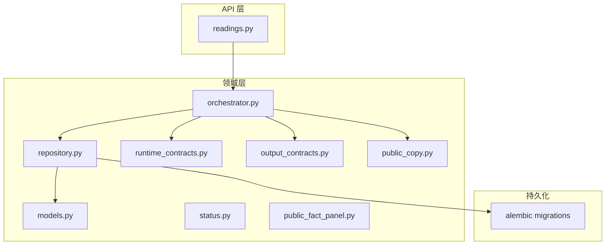
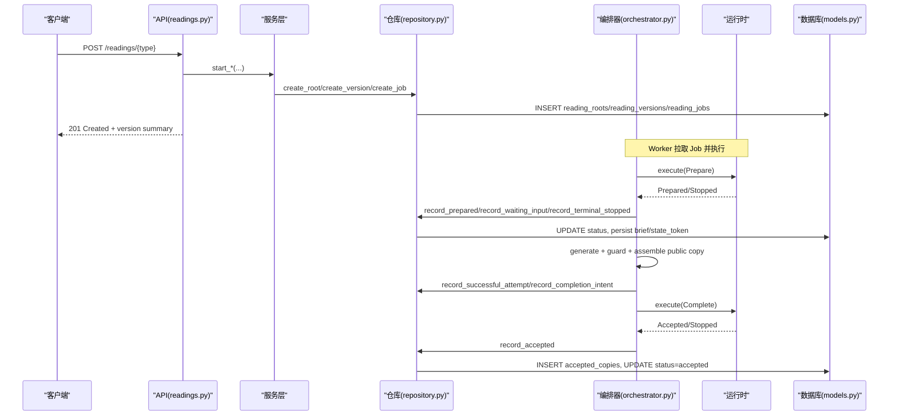
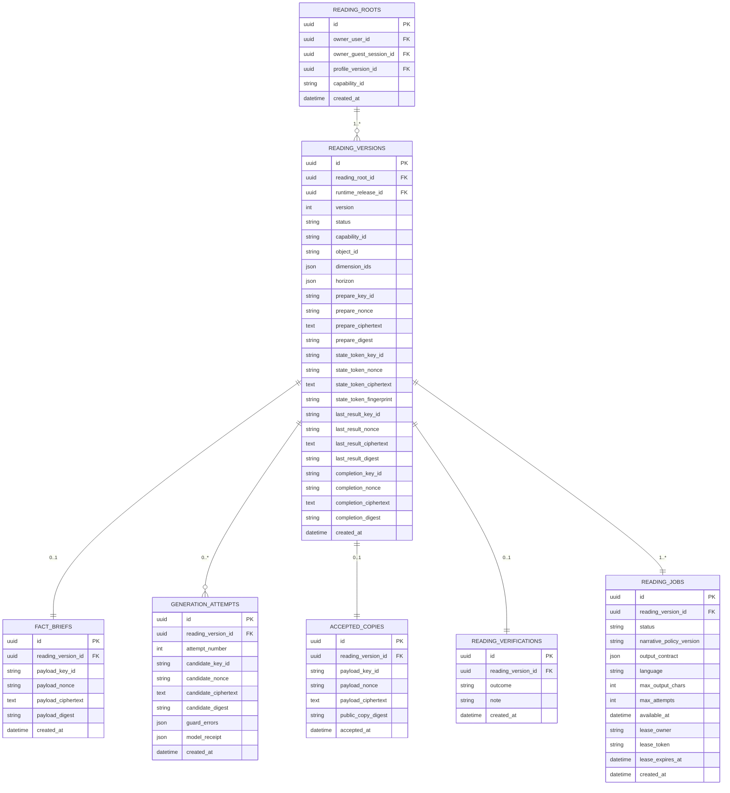
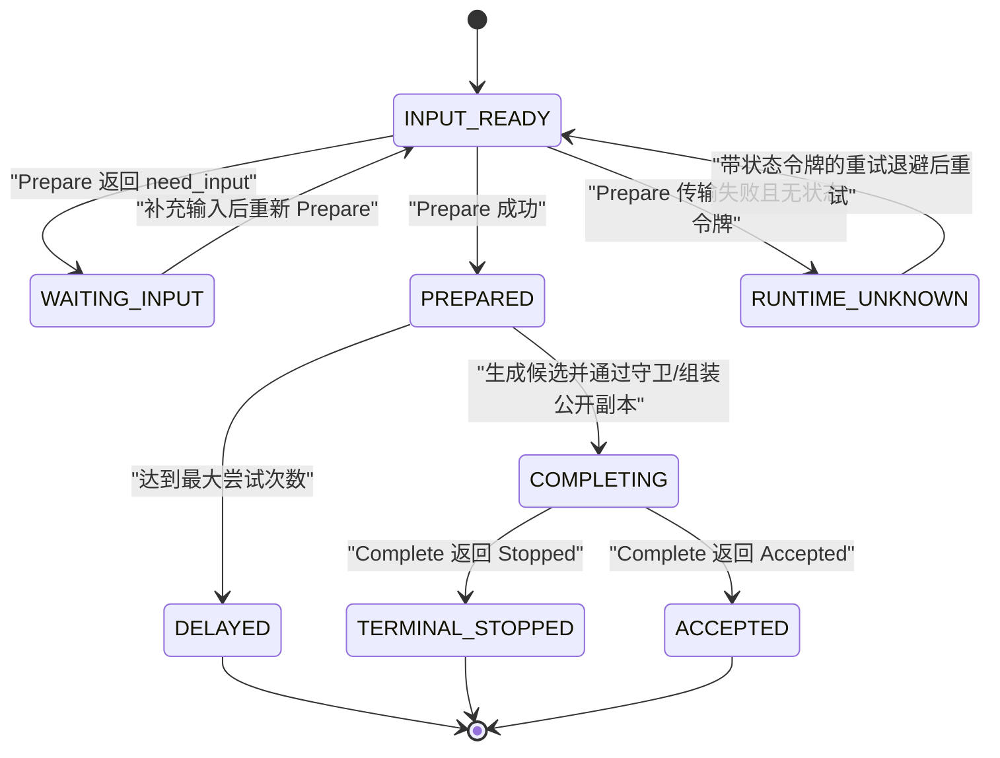
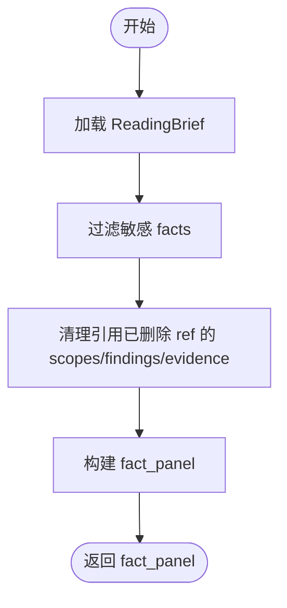
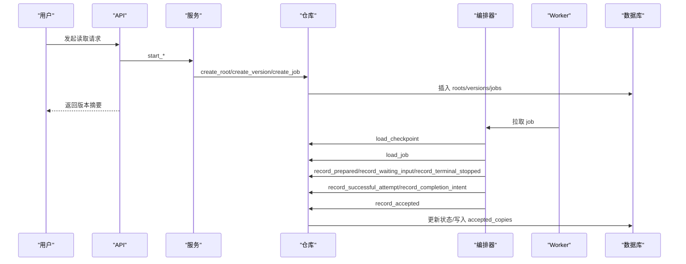
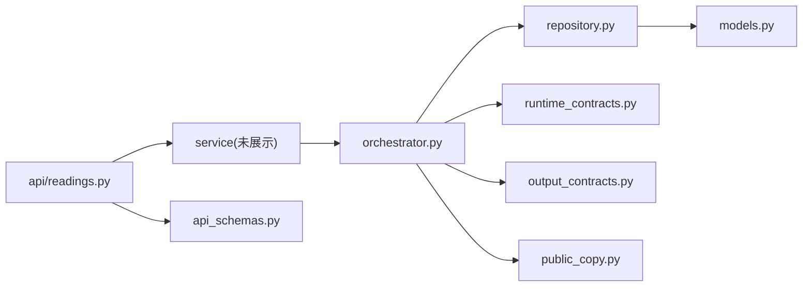

# 数据模型设计

<cite>
**本文引用的文件**
- [backend/app/readings/models.py](file://backend/app/readings/models.py)
- [backend/app/readings/status.py](file://backend/app/readings/status.py)
- [backend/app/readings/api_schemas.py](file://backend/app/readings/api_schemas.py)
- [backend/app/readings/public_fact_panel.py](file://backend/app/readings/public_fact_panel.py)
- [backend/app/readings/public_copy.py](file://backend/app/readings/public_copy.py)
- [backend/app/readings/repository.py](file://backend/app/readings/repository.py)
- [backend/app/readings/orchestrator.py](file://backend/app/readings/orchestrator.py)
- [backend/app/readings/runtime_contracts.py](file://backend/app/readings/runtime_contracts.py)
- [backend/app/readings/output_contracts.py](file://backend/app/readings/output_contracts.py)
- [backend/alembic/versions/0002_profiles_and_readings.py](file://backend/alembic/versions/0002_profiles_and_readings.py)
- [backend/alembic/versions/0007_reading_api_idempotency_and_verification.py](file://backend/alembic/versions/0007_reading_api_idempotency_and_verification.py)
- [backend/app/api/readings.py](file://backend/app/api/readings.py)
</cite>

## 目录
1. [简介](#简介)
2. [项目结构](#项目结构)
3. [核心组件](#核心组件)
4. [架构总览](#架构总览)
5. [详细组件分析](#详细组件分析)
6. [依赖关系分析](#依赖关系分析)
7. [性能与一致性考虑](#性能与一致性考虑)
8. [故障排查指南](#故障排查指南)
9. [结论](#结论)
10. [附录：数据库表结构与样例](#附录数据库表结构与样例)

## 简介
本文件面向命理解读系统的数据模型，围绕 ReadingRoot、ReadingVersion、ReadingJob 等核心实体展开，解释版本化不可变数据模型的设计动机、状态机流转、解读结果数据结构（fact_panel、accepted_copy、verification）、输入输出校验与规范化策略，以及数据库迁移与版本兼容性。目标是让读者既能把握整体架构，也能深入理解关键实现细节。

## 项目结构
后端读取模块位于 backend/app/readings，包含数据模型、状态枚举、编排器、仓库、运行时契约、公开副本组装、事实面板投影等；API 层在 backend/app/api/readings.py；数据库迁移在 backend/alembic/versions。

图表来源
- [backend/app/api/readings.py:87-399](file://backend/app/api/readings.py#L87-L399)
- [backend/app/readings/orchestrator.py:178-450](file://backend/app/readings/orchestrator.py#L178-L450)
- [backend/app/readings/repository.py:51-862](file://backend/app/readings/repository.py#L51-L862)
- [backend/app/readings/models.py:53-378](file://backend/app/readings/models.py#L53-L378)

章节来源
- [backend/app/api/readings.py:87-399](file://backend/app/api/readings.py#L87-L399)
- [backend/app/readings/orchestrator.py:178-450](file://backend/app/readings/orchestrator.py#L178-L450)
- [backend/app/readings/repository.py:51-862](file://backend/app/readings/repository.py#L51-L862)
- [backend/app/readings/models.py:53-378](file://backend/app/readings/models.py#L53-L378)

## 核心组件
- ReadingRoot：一次命理解读的根实体，绑定拥有者（用户或访客会话）与能力标识，作为版本链的锚点。
- ReadingVersion：不可变的版本记录，保存 Prepare 指令密文、状态、能力维度、时间范围、状态令牌、最近结果、完成意图等，并通过唯一约束保证同一 Root 的版本号单调递增。
- ReadingJobRecord：工作队列中的任务记录，承载叙事策略版本、输出契约、语言、最大输出长度、重试次数、可用性时间与租约信息。
- FactBrief：存储运行时产出的“事实简报”（ReadingBrief），用于后续生成与验证。
- GenerationAttempt：每次模型生成的尝试记录，含候选文本、守卫错误、模型回执等。
- AcceptedCopy：最终被接受的公开副本，带摘要指纹与接受时间。
- ReadingVerification：用户对结果的反馈（接受/部分同意/不同意/未知）。
- RuntimeRelease：运行时发布物元数据，用于锁定执行环境。

章节来源
- [backend/app/readings/models.py:28-378](file://backend/app/readings/models.py#L28-L378)

## 架构总览
读取流程由 API 触发，服务层创建 Root 与 Version，并写入 Job；Worker 通过编排器驱动运行时与模型，将中间态与结果落库；最终产出 accepted_copy 与 fact_panel，并允许用户提交 verification。

图表来源
- [backend/app/api/readings.py:87-399](file://backend/app/api/readings.py#L87-L399)
- [backend/app/readings/orchestrator.py:212-450](file://backend/app/readings/orchestrator.py#L212-L450)
- [backend/app/readings/repository.py:120-716](file://backend/app/readings/repository.py#L120-L716)
- [backend/app/readings/models.py:84-378](file://backend/app/readings/models.py#L84-L378)

## 详细组件分析

### 实体关系与字段定义
- ReadingRoot
  - 关键字段：id、owner_user_id、owner_guest_session_id、profile_version_id、capability_id、created_at
  - 约束：拥有者必须恰好一个（用户或访客会话）
- ReadingVersion
  - 关键字段：reading_root_id、runtime_release_id、version、status、capability_id、object_id、dimension_ids、horizon、prepare_*、state_token_*、last_result_*、completion_*、created_at
  - 约束：(root_id, version) 唯一；state_token、last_result、completion 三组字段要么全空要么全有
- ReadingJobRecord
  - 关键字段：reading_version_id、status、narrative_policy_version、output_contract、language、max_output_chars、max_attempts、available_at、lease_*、created_at
  - 索引：活跃版本唯一（queued/claimed/running），按 status+available_at 查询
- FactBrief、GenerationAttempt、AcceptedCopy、ReadingVerification
  - 均为 append-only 不可变记录，禁止更新事件触发异常
  - 唯一约束保障一对一或一多关系

图表来源
- [backend/app/readings/models.py:53-378](file://backend/app/readings/models.py#L53-L378)
- [backend/alembic/versions/0002_profiles_and_readings.py:28-288](file://backend/alembic/versions/0002_profiles_and_readings.py#L28-L288)
- [backend/alembic/versions/0007_reading_api_idempotency_and_verification.py:24-100](file://backend/alembic/versions/0007_reading_api_idempotency_and_verification.py#L24-L100)

章节来源
- [backend/app/readings/models.py:53-378](file://backend/app/readings/models.py#L53-L378)
- [backend/alembic/versions/0002_profiles_and_readings.py:28-288](file://backend/alembic/versions/0002_profiles_and_readings.py#L28-L288)
- [backend/alembic/versions/0007_reading_api_idempotency_and_verification.py:24-100](file://backend/alembic/versions/0007_reading_api_idempotency_and_verification.py#L24-L100)

### 解读版本的状态机设计
状态枚举定义于 ReadingStatus，包括 input_ready、waiting_input、terminal_stopped、prepared、completing、accepted、delayed、runtime_unknown。

图表来源
- [backend/app/readings/status.py:4-13](file://backend/app/readings/status.py#L4-L13)
- [backend/app/readings/orchestrator.py:212-450](file://backend/app/readings/orchestrator.py#L212-L450)
- [backend/app/readings/repository.py:556-730](file://backend/app/readings/repository.py#L556-L730)

状态转换条件与业务含义
- INPUT_READY：初始态，等待 Prepare 执行或等待补充输入。
- WAITING_INPUT：运行时要求用户提供缺失输入，需调用输入接口回填。
- PREPARED：Prepare 成功，已持久化事实简报与状态令牌，进入生成阶段。
- COMPLETING：候选通过守卫与公开副本组装，准备 Complete。
- ACCEPTED：Complete 成功，持久化 accepted_copy，对外可获取最终结果。
- TERMINAL_STOPPED：运行时终止（非 need_input），不可恢复。
- DELAYED：模型尝试耗尽或策略限制，进入延迟队列。
- RUNTIME_UNKNOWN：Prepare 传输失败且无法恢复，需人工介入或降级处理。

章节来源
- [backend/app/readings/status.py:4-13](file://backend/app/readings/status.py#L4-L13)
- [backend/app/readings/orchestrator.py:212-450](file://backend/app/readings/orchestrator.py#L212-L450)
- [backend/app/readings/repository.py:556-730](file://backend/app/readings/repository.py#L556-L730)

### 解读结果的数据结构
- fact_panel：来自 FactBrief 的 ReadingBrief，经 public_fact_panel 过滤敏感字段后暴露给外部 API。规则包括移除引用原始输入的 fact、隐藏包含出生时间等敏感信息的 display_text/value，并清理 claim_scopes/findings/evidence 中对已删除 ref 的引用。
- accepted_copy：最终公开的纯文本副本，由 PublicCopyAssembler 基于 NarrativeCandidate、ReadingBrief 与 OutputContract 机械组装，包含区块文本、必要限制说明与披露文案，并通过内部标识检查与大小限制。
- verification：用户反馈，outcome 限定为 accepted/partial/disagreed/unknown，note 可选，最多 500 字符。

图表来源
- [backend/app/readings/public_fact_panel.py:54-149](file://backend/app/readings/public_fact_panel.py#L54-L149)

章节来源
- [backend/app/readings/public_fact_panel.py:54-149](file://backend/app/readings/public_fact_panel.py#L54-L149)
- [backend/app/readings/public_copy.py:9-46](file://backend/app/readings/public_copy.py#L9-L46)
- [backend/app/readings/models.py:340-367](file://backend/app/readings/models.py#L340-L367)
- [backend/app/readings/api_schemas.py:121-129](file://backend/app/readings/api_schemas.py#L121-L129)

### 不可变数据模型与版本化
- 不可变性：FactBrief、GenerationAttempt、AcceptedCopy 等记录在 before_update 事件中抛出 ImmutableRecordError，确保追加式写入，便于审计与回溯。
- 版本化：ReadingVersion 以 (reading_root_id, version) 唯一键保证单调递增；每个版本关联特定 RuntimeRelease，确保执行环境可追溯。
- 加密与完整性：所有敏感载荷（prepare、brief、candidate、accepted_copy、state_token、last_result、completion）均以 envelope 加密并附带 digest/fingerprint，防止篡改。

章节来源
- [backend/app/readings/models.py:370-378](file://backend/app/readings/models.py#L370-L378)
- [backend/app/readings/models.py:84-160](file://backend/app/readings/models.py#L84-L160)
- [backend/app/readings/repository.py:120-167](file://backend/app/readings/repository.py#L120-L167)
- [backend/app/readings/repository.py:336-363](file://backend/app/readings/repository.py#L336-L363)

### 数据验证与约束
- 输入校验：API 请求体使用 Pydantic 模型进行强类型校验与范围约束（如 LiuyaoCast 长度、timezone IANA 校验、query/dimension_ids 长度等）。
- 运行时契约：Prepare/Complete/Described/Prepared/Accepted/Stopped 等命令与结果均通过 JSON Schema 校验，确保跨进程边界的一致性。
- 输出规范：OutputContract 规定语言、块数量、最大字符数、必需维度与限制项、披露文案；PublicCopyAssembler 强制满足这些约束。
- 数据库约束：CheckConstraint 与 UniqueConstraint 保证状态信封完整性、拥有者唯一性、版本唯一性等。

章节来源
- [backend/app/readings/api_schemas.py:17-74](file://backend/app/readings/api_schemas.py#L17-L74)
- [backend/app/readings/runtime_contracts.py:27-40](file://backend/app/readings/runtime_contracts.py#L27-L40)
- [backend/app/readings/runtime_contracts.py:113-249](file://backend/app/readings/runtime_contracts.py#L113-L249)
- [backend/app/readings/output_contracts.py:10-35](file://backend/app/readings/output_contracts.py#L10-L35)
- [backend/app/readings/models.py:84-160](file://backend/app/readings/models.py#L84-L160)

### 工作流序列图（从创建到接受）

图表来源
- [backend/app/api/readings.py:87-399](file://backend/app/api/readings.py#L87-L399)
- [backend/app/readings/orchestrator.py:212-450](file://backend/app/readings/orchestrator.py#L212-L450)
- [backend/app/readings/repository.py:120-716](file://backend/app/readings/repository.py#L120-L716)

## 依赖关系分析
- orchestrator 依赖 repository、runtime、model、guard、assembler 等端口，解耦外部系统。
- repository 直接操作 models，并通过 EnvelopeCipher 对敏感数据进行加解密。
- api/readings.py 仅负责路由、鉴权、限流与错误映射，不持有业务状态。
- public_fact_panel 与 public_copy 分别负责事实面板脱敏与公开副本组装，是安全边界的关键环节。

图表来源
- [backend/app/api/readings.py:87-399](file://backend/app/api/readings.py#L87-L399)
- [backend/app/readings/orchestrator.py:178-450](file://backend/app/readings/orchestrator.py#L178-L450)
- [backend/app/readings/repository.py:51-862](file://backend/app/readings/repository.py#L51-L862)

章节来源
- [backend/app/api/readings.py:87-399](file://backend/app/api/readings.py#L87-L399)
- [backend/app/readings/orchestrator.py:178-450](file://backend/app/readings/orchestrator.py#L178-L450)
- [backend/app/readings/repository.py:51-862](file://backend/app/readings/repository.py#L51-L862)

## 性能与一致性考虑
- 并发与锁：create_version 使用 with_for_update 锁定 Root，避免并发分配版本号冲突。
- 幂等性：Idempotency-Key 持久化到 reading_idempotency_keys，结合 owner 维度去重，防止重复创建。
- 重试与退避：Prepare/Complete 传输失败时采用指数退避或标记 delayed/runtime_unknown，减少抖动。
- 不可变审计：append-only 记录与 digest 校验，支持事后审计与问题定位。
- 索引优化：jobs 表针对 active 版本与 claim 场景建立索引，提升调度效率。

章节来源
- [backend/app/readings/repository.py:44-48](file://backend/app/readings/repository.py#L44-L48)
- [backend/app/readings/repository.py:120-167](file://backend/app/readings/repository.py#L120-L167)
- [backend/app/readings/models.py:247-291](file://backend/app/readings/models.py#L247-L291)
- [backend/alembic/versions/0007_reading_api_idempotency_and_verification.py:24-73](file://backend/alembic/versions/0007_reading_api_idempotency_and_verification.py#L24-L73)

## 故障排查指南
- 常见错误
  - ImmutableRecordError：尝试更新不可变记录（如 Attempt/Brief/Copy），应改为追加新记录。
  - ContractValidationError：命令/结果不符合 JSON Schema，检查 payload 结构与类型。
  - PublicCopyAssemblyError：公开副本组装失败（缺少限制项、超字数、包含内部标识），检查候选与契约。
  - Idempotency-Key conflict：重复提交相同幂等键，确认上游是否重试。
- 定位步骤
  - 查看 ReadingVersion.status 与 ReadingJobRecord.status 判断当前阶段。
  - 检查 last_result/candidate/brief 是否存在及 digest 是否匹配。
  - 核对 OutputContract 与 NarrativeCandidate 的 limit_kind_ids 是否齐全。
  - 审查 Guard 错误列表与模型回执，定位生成失败原因。

章节来源
- [backend/app/readings/models.py:370-378](file://backend/app/readings/models.py#L370-L378)
- [backend/app/readings/runtime_contracts.py:23-40](file://backend/app/readings/runtime_contracts.py#L23-L40)
- [backend/app/readings/public_copy.py:9-46](file://backend/app/readings/public_copy.py#L9-L46)
- [backend/app/api/readings.py:67-84](file://backend/app/api/readings.py#L67-L84)

## 结论
本数据模型以版本化与不可变记录为核心，配合严格的契约校验与安全边界（加密、脱敏、公开副本组装），实现了命理解读过程的可追溯、可审计与高一致性。状态机清晰表达生命周期，仓库层提供并发安全与幂等保障，API 层保持简洁与职责单一。该设计既满足生产环境的稳定性需求，也为后续扩展（更多能力、更复杂叙事策略）预留了空间。

## 附录：数据库表结构与样例
- 表结构
  - reading_roots：根记录，绑定拥有者与能力
  - reading_versions：版本记录，包含 Prepare、状态、维度、时间范围、状态令牌、最近结果、完成意图等
  - reading_jobs：工作队列任务，携带输出契约、语言、重试策略与租约
  - fact_briefs：事实简报（ReadingBrief）密文
  - generation_attempts：生成尝试历史
  - accepted_copies：最终公开副本密文与摘要
  - reading_verifications：用户反馈
  - reading_idempotency_keys：幂等键映射
- 样例数据（示意）
  - reading_roots: {id: UUID, owner_user_id: UUID|null, owner_guest_session_id: UUID|null, profile_version_id: UUID|null, capability_id: "bazi", created_at: ISO8601}
  - reading_versions: {id: UUID, reading_root_id: UUID, runtime_release_id: UUID, version: 1, status: "input_ready", capability_id: "bazi", object_id: "user_123", dimension_ids: ["career"], horizon: {"kind_id": "year"}, prepare_key_id: "...", ...}
  - reading_jobs: {id: UUID, reading_version_id: UUID, status: "queued", narrative_policy_version: "v1", output_contract: {...}, language: "zh-CN", max_output_chars: 1200, max_attempts: 2, available_at: ISO8601}
  - fact_briefs: {id: UUID, reading_version_id: UUID, payload_key_id: "...", payload_nonce: "...", payload_ciphertext: "...", payload_digest: "..."}
  - generation_attempts: {id: UUID, reading_version_id: UUID, attempt_number: 1, candidate_key_id: "...", guard_errors: [], model_receipt: {...}}
  - accepted_copies: {id: UUID, reading_version_id: UUID, payload_key_id: "...", public_copy_digest: "...", accepted_at: ISO8601}
  - reading_verifications: {id: UUID, reading_version_id: UUID, outcome: "accepted", note: "基本符合预期"}
  - reading_idempotency_keys: {id: UUID, key_hash: "...", action: "start_preview", request_fingerprint: "...", owner_user_id: UUID|null, owner_guest_session_id: UUID|null, reading_version_id: UUID}

章节来源
- [backend/alembic/versions/0002_profiles_and_readings.py:28-288](file://backend/alembic/versions/0002_profiles_and_readings.py#L28-L288)
- [backend/alembic/versions/0007_reading_api_idempotency_and_verification.py:24-100](file://backend/alembic/versions/0007_reading_api_idempotency_and_verification.py#L24-L100)
- [backend/app/readings/models.py:53-378](file://backend/app/readings/models.py#L53-L378)