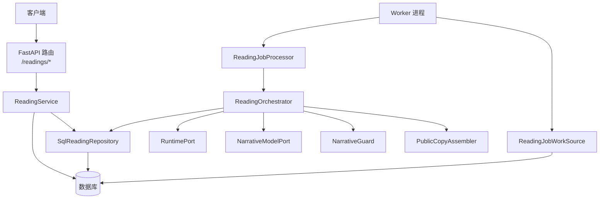
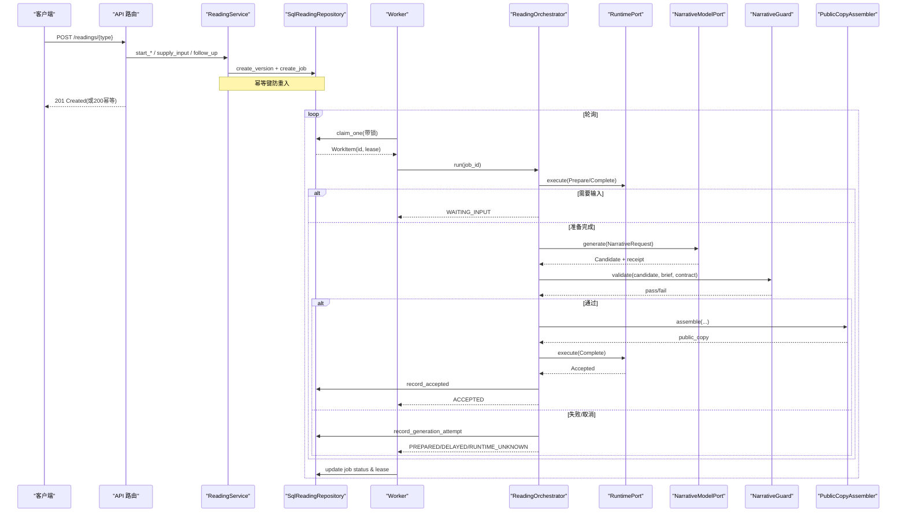
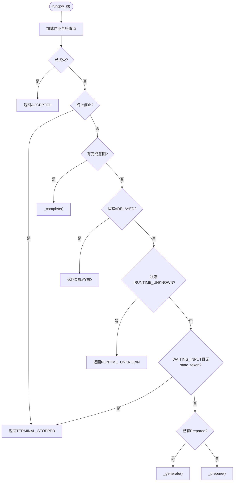
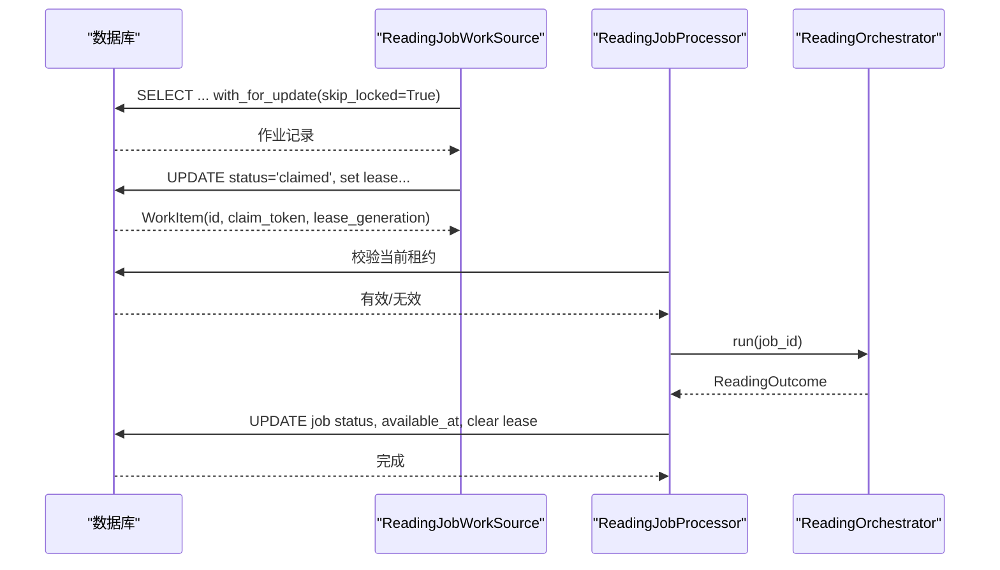
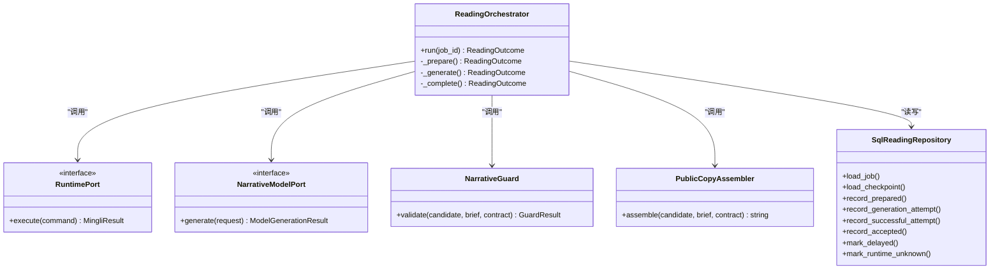

# 解读编排器

<cite>
**本文引用的文件**
- [backend/app/readings/orchestrator.py](file://backend/app/readings/orchestrator.py)
- [backend/worker/readings.py](file://backend/worker/readings.py)
- [backend/worker/main.py](file://backend/worker/main.py)
- [backend/app/readings/service.py](file://backend/app/readings/service.py)
- [backend/app/api/readings.py](file://backend/app/api/readings.py)
- [backend/app/readings/request_compiler.py](file://backend/app/readings/request_compiler.py)
- [backend/app/readings/models.py](file://backend/app/readings/models.py)
- [backend/app/readings/repository.py](file://backend/app/readings/repository.py)
- [backend/app/readings/status.py](file://backend/app/readings/status.py)
- [backend/app/readings/errors.py](file://backend/app/readings/errors.py)
</cite>

## 目录
1. [简介](#简介)
2. [项目结构](#项目结构)
3. [核心组件](#核心组件)
4. [架构总览](#架构总览)
5. [详细组件分析](#详细组件分析)
6. [依赖关系分析](#依赖关系分析)
7. [性能考量](#性能考量)
8. [故障排查指南](#故障排查指南)
9. [结论](#结论)
10. [附录：端到端流程示例](#附录：端到端流程示例)

## 简介
本文件面向“命理解读编排器”的实现与使用，聚焦 ReadingOrchestrator 的核心设计模式、任务调度机制、生命周期阶段管理、状态转换逻辑与错误处理策略。文档同时说明不同解读类型（八字分析、运势预测、六爻占卜）的编排差异，统一接口如何承载多种场景；阐述异步任务队列的工作机制、Worker 进程与主服务的通信协议、任务重试与失败处理策略；并提供从提交、执行监控到结果获取的完整流程指引与优化建议。

## 项目结构
后端以“服务层 + 编排器 + Worker 队列”的分层架构组织：
- API 层：FastAPI 路由接收请求，调用 Service 层创建或续写解读版本并落库。
- Service 层：负责业务编排入口（开始预览、今日/周运势、六爻、补充输入、跟进等），生成 Prepare 命令并持久化。
- 编排器：ReadingOrchestrator 驱动解读生命周期，协调运行时、模型、校验与公共副本组装。
- Worker：后台进程从数据库领取任务，调用编排器推进状态机，更新作业状态与结果。
- 数据层：SQLAlchemy 模型与仓库，提供加密存储、幂等键、作业租约与不可变记录保护。

图表来源
- [backend/app/api/readings.py:87-399](file://backend/app/api/readings.py#L87-L399)
- [backend/app/readings/service.py:117-513](file://backend/app/readings/service.py#L117-L513)
- [backend/app/readings/repository.py:51-200](file://backend/app/readings/repository.py#L51-L200)
- [backend/worker/readings.py:108-286](file://backend/worker/readings.py#L108-L286)
- [backend/app/readings/orchestrator.py:178-450](file://backend/app/readings/orchestrator.py#L178-L450)

章节来源
- [backend/app/api/readings.py:87-399](file://backend/app/api/readings.py#L87-L399)
- [backend/app/readings/service.py:117-513](file://backend/app/readings/service.py#L117-L513)
- [backend/worker/readings.py:108-286](file://backend/worker/readings.py#L108-L286)
- [backend/app/readings/orchestrator.py:178-450](file://backend/app/readings/orchestrator.py#L178-L450)

## 核心组件
- ReadingOrchestrator：编排解读生命周期的核心，维护状态机、重试与回退策略，协调外部运行时与模型能力。
- SqlReadingRepository：封装所有持久化操作，包括读取/写入 Prepare、Checkpoint、尝试次数、接受副本、幂等键等。
- ReadingService：对外暴露统一的解读启动/续写接口，将产品动作编译为 Prepare 命令并创建版本与作业。
- Worker 与 Job 源/处理器：基于数据库的作业队列，带租约与过期回收，保证并发安全与幂等执行。
- RequestCompiler：按解读类型（八字、运势、六爻）将用户输入编译为合法的 Prepare 指令。
- 状态枚举：定义解读状态机所有合法状态。

章节来源
- [backend/app/readings/orchestrator.py:43-189](file://backend/app/readings/orchestrator.py#L43-L189)
- [backend/app/readings/repository.py:51-200](file://backend/app/readings/repository.py#L51-L200)
- [backend/app/readings/service.py:117-513](file://backend/app/readings/service.py#L117-L513)
- [backend/worker/readings.py:108-286](file://backend/worker/readings.py#L108-L286)
- [backend/app/readings/request_compiler.py:96-216](file://backend/app/readings/request_compiler.py#L96-L216)
- [backend/app/readings/status.py:1-13](file://backend/app/readings/status.py#L1-L13)

## 架构总览
解读编排采用“服务层发起 + Worker 异步推进”的模式：
- 服务层负责鉴权、限流、参数校验、幂等控制、Prepare 编译与版本创建，并将作业入队。
- Worker 周期性从数据库领取作业，通过编排器驱动状态机，调用运行时执行 Prepare/Complete，调用模型生成候选文本，经守卫校验后组装公共副本，最终标记接受。
- 所有关键中间态均持久化，支持断点恢复与幂等重放。

图表来源
- [backend/app/api/readings.py:87-399](file://backend/app/api/readings.py#L87-L399)
- [backend/app/readings/service.py:117-513](file://backend/app/readings/service.py#L117-L513)
- [backend/worker/readings.py:108-286](file://backend/worker/readings.py#L108-L286)
- [backend/app/readings/orchestrator.py:212-450](file://backend/app/readings/orchestrator.py#L212-L450)

## 详细组件分析

### ReadingOrchestrator：状态机与编排
- 职责
  - 加载作业与检查点，依据当前状态决定下一步：准备、生成、完成、等待输入、延迟、未知运行时、已接受。
  - 调用运行时执行 Prepare/Complete，捕获传输异常并设置重试时间。
  - 调用模型生成候选，结合守卫校验与公共副本组装，记录每次尝试与成本收据。
  - 在达到最大尝试次数时进入延迟状态，便于后续重试。
- 关键数据结构
  - ReadingJob：作业元信息（Prepare 命令、策略版本、输出契约、语言、最大字符数、最大尝试次数）。
  - ReadingCheckpoint：持久化的中间状态（状态、等待输入、终止停止、已准备、尝试次数、完成意图、已接受）。
  - ReadingOutcome：编排结果（状态、公共副本、输入请求、停止原因、重试时间、提交后取消标志）。
- 状态转换要点
  - INPUT_READY -> PREPARED：Prepare 成功。
  - PREPARED -> COMPLETING：模型生成并通过守卫，组装成功。
  - COMPLETING -> ACCEPTED：Complete 成功且令牌一致。
  - 任意状态 -> WAITING_INPUT：运行时要求补充输入。
  - 任意状态 -> TERMINAL_STOPPED：运行时终止。
  - PREPARED -> DELAYED：超过最大尝试次数。
  - 无令牌 Prepare 失败 -> RUNTIME_UNKNOWN：无法区分是否已在运行时创建根。
- 错误处理
  - RuntimeTransportError：可重试，设置 retry_not_before。
  - NarrativeGenerationError/NarrativeGenerationCancelled：记录尝试并可能触发提交后取消。
  - OrchestratorInvariantError：不变量被破坏，抛出异常。

图表来源
- [backend/app/readings/orchestrator.py:212-248](file://backend/app/readings/orchestrator.py#L212-L248)
- [backend/app/readings/orchestrator.py:250-450](file://backend/app/readings/orchestrator.py#L250-L450)

章节来源
- [backend/app/readings/orchestrator.py:43-189](file://backend/app/readings/orchestrator.py#L43-L189)
- [backend/app/readings/orchestrator.py:212-450](file://backend/app/readings/orchestrator.py#L212-L450)
- [backend/app/readings/errors.py:1-30](file://backend/app/readings/errors.py#L1-L30)

### Worker 与作业队列：并发安全与重试
- 作业领取
  - 使用 SQL 查询选择 queued 且 available_at <= now，或 claimed 且租约过期的作业，with_for_update(skip_locked=True) 避免争用。
  - 对无令牌 Prepare 的过期租约，将版本置为 RUNTIME_UNKNOWN 并释放租约，防止误判。
- 作业处理
  - 校验当前租约有效性（owner、token、generation、过期时间）。
  - 调用编排器运行，根据 ReadingOutcome 映射作业状态（queued/waiting_input/stopped/complete/delayed/runtime_unknown）。
  - 更新作业状态、available_at、清理租约；若 outcome 指示提交后取消，则抛出 CancelledError 中断。
- 重试策略
  - 编排器返回 retry_not_before 时，作业设置为 queued 并在该时间之后重新可用。
  - 超过最大尝试次数进入 delayed，由上层调度器或定时任务再次尝试。

图表来源
- [backend/worker/readings.py:63-161](file://backend/worker/readings.py#L63-L161)
- [backend/worker/readings.py:164-231](file://backend/worker/readings.py#L164-L231)

章节来源
- [backend/worker/readings.py:63-231](file://backend/worker/readings.py#L63-L231)
- [backend/worker/main.py:57-120](file://backend/worker/main.py#L57-L120)

### Service 与 API：统一接口与多解读类型
- 统一接口
  - 开始预览（八字）、今日/周运势（运势）、六爻占卜：均返回 ReadingStartResponse，包含版本、状态、维度、前置答案、输入请求等。
  - 补充输入：校验运行时输入需求，合并事实，替换 Prepare，重新入队。
  - 跟进：基于已接受的副本继续新的解读，保持血缘关系。
- 幂等性
  - 通过 Idempotency-Key 计算 key_hash 与 request_fingerprint，持久化映射到 reading_version_id，重复请求直接返回相同结果。
- 解读类型差异
  - 八字：维度允许 overview/career，事实包含出生信息与政策。
  - 运势：维度允许 career，增加参考日期与时区归一化。
  - 六爻：维度允许 career/outcome/timing，校验掷卦值范围或数字硬币模式。

章节来源
- [backend/app/api/readings.py:87-399](file://backend/app/api/readings.py#L87-L399)
- [backend/app/readings/service.py:117-513](file://backend/app/readings/service.py#L117-L513)
- [backend/app/readings/request_compiler.py:96-216](file://backend/app/readings/request_compiler.py#L96-L216)

### 数据模型与持久化：不可变记录与加密
- 不可变记录
  - RuntimeRelease、FactBrief、GenerationAttempt、AcceptedCopy 禁止更新，确保审计与一致性。
- 加密存储
  - Prepare、FactBrief、AcceptedCopy 等敏感字段以信封加密形式保存（key_id、nonce、ciphertext、digest）。
- 作业租约
  - reading_jobs 表维护 lease_owner、lease_token、lease_expires_at，配合索引与约束保证并发安全。

章节来源
- [backend/app/readings/models.py:28-378](file://backend/app/readings/models.py#L28-L378)
- [backend/app/readings/repository.py:51-200](file://backend/app/readings/repository.py#L51-L200)

## 依赖关系分析
- 耦合与内聚
  - ReadingOrchestrator 通过 Protocol 解耦运行时、模型、守卫与公共副本组装，提升可测试性与替换性。
  - SqlReadingRepository 集中数据访问，屏蔽加密与复杂查询细节。
  - Worker 与编排器通过 ReadingOutcome 与状态映射松耦合协作。
- 外部依赖
  - 运行时适配器（RuntimePort）：执行 Prepare/Complete。
  - 模型适配器（NarrativeModelPort）：生成候选文本与收据。
  - 守卫（NarrativeGuard）：校验候选是否符合契约。
  - 公共副本组装（PublicCopyAssembler）：将候选转为公开可读副本。
- 循环依赖
  - 未发现循环导入；模块间通过 Protocol 与数据类传递边界。

图表来源
- [backend/app/readings/orchestrator.py:81-189](file://backend/app/readings/orchestrator.py#L81-L189)
- [backend/app/readings/repository.py:51-200](file://backend/app/readings/repository.py#L51-L200)

章节来源
- [backend/app/readings/orchestrator.py:81-189](file://backend/app/readings/orchestrator.py#L81-L189)
- [backend/app/readings/repository.py:51-200](file://backend/app/readings/repository.py#L51-L200)

## 性能考量
- 数据库层面
  - 使用 with_for_update(skip_locked=True) 减少锁竞争，提高并发领取效率。
  - 合理索引：reading_jobs(status, available_at)、active_version 唯一索引，加速领取与去重。
- 编排器层面
  - 传输重试退避：prepare_transport_backoff、complete_transport_backoff 避免雪崩。
  - 最大尝试次数限制：防止无限重试，进入 delayed 由调度器再试。
- Worker 层面
  - 租约过期回收：避免僵尸作业占用资源。
  - 提交后取消：在事务提交后取消长耗时任务，降低资源占用。
- 建议
  - 调整 poll_interval 与 lease_seconds 平衡吞吐与公平性。
  - 监控 model_cost 告警，评估模型调用成本与成功率。
  - 对高负载场景考虑分片或分区作业表，提升查询性能。

## 故障排查指南
- 常见问题定位
  - 运行时未知：当 Prepare 无 state_token 且传输失败，编排器标记 RUNTIME_UNKNOWN，Worker 会跳过该作业，需检查运行时健康与网络。
  - 输入缺失：WAITING_INPUT 状态，需确认前端是否正确提交 input_request 中的字段。
  - 守卫拒绝：guard_rejection 告警，检查候选文本与输出契约匹配度。
  - 模型失败/取消：model_generation_failed/model_generation_cancelled，查看 receipt 与重试策略。
  - 幂等冲突：Idempotency-Key conflict，检查客户端是否复用 key 但请求体变化。
- 日志与告警
  - 关注 alert_sink 发出的 runtime_unknown、delayed、guard_rejection、model_cost 事件。
  - 检查 GenerationAttempt 的 guard_errors 与 model_receipt 字段。
- 修复步骤
  - 对于 RUNTIME_UNKNOWN：确保 Prepare 携带 state_token，或重启运行时并重试。
  - 对于 DELAYED：等待调度器重试或人工干预。
  - 对于 WAITING_INPUT：补全输入后重新入队。

章节来源
- [backend/app/readings/orchestrator.py:250-450](file://backend/app/readings/orchestrator.py#L250-L450)
- [backend/worker/readings.py:121-231](file://backend/worker/readings.py#L121-L231)
- [backend/app/readings/errors.py:1-30](file://backend/app/readings/errors.py#L1-L30)

## 结论
ReadingOrchestrator 通过清晰的状态机、严格的不变量检查与完善的错误处理，实现了命理解读的可靠编排。结合 Worker 的并发安全与重试机制，系统能够稳定支撑八字、运势、六爻等多种解读类型。通过统一的服务接口与幂等控制，前端与客户端可以以一致的方式发起与跟踪解读任务。生产环境中应重点关注运行时健康、模型调用成本与守卫通过率，并结合告警与日志进行持续优化。

## 附录：端到端流程示例
以下示例展示从提交到结果获取的关键步骤与对应代码位置，便于快速上手与排错。

- 提交解读任务（以八字为例）
  - 调用 API：POST /readings/preview
  - 服务层：start_preview -> compile_bazi_prepare -> create_version + create_job
  - 代码路径参考：
    - [backend/app/api/readings.py:87-122](file://backend/app/api/readings.py#L87-L122)
    - [backend/app/readings/service.py:129-165](file://backend/app/readings/service.py#L129-L165)
    - [backend/app/readings/request_compiler.py:96-126](file://backend/app/readings/request_compiler.py#L96-L126)
    - [backend/app/readings/repository.py:120-167](file://backend/app/readings/repository.py#L120-L167)

- 执行与监控（Worker）
  - Worker 领取作业：claim_one -> process -> orchestrator.run
  - 编排器执行 Prepare -> 生成候选 -> 守卫校验 -> 组装公共副本 -> Complete
  - 代码路径参考：
    - [backend/worker/readings.py:121-231](file://backend/worker/readings.py#L121-L231)
    - [backend/app/readings/orchestrator.py:212-450](file://backend/app/readings/orchestrator.py#L212-L450)

- 获取结果
  - 调用 API：GET /readings/{version_id}/result
  - 服务层：get_result -> 组装 fact_panel、verification、input_request
  - 代码路径参考：
    - [backend/app/api/readings.py:309-330](file://backend/app/api/readings.py#L309-L330)
    - [backend/app/readings/service.py:318-344](file://backend/app/readings/service.py#L318-L344)

- 补充输入（如需）
  - 调用 API：POST /readings/{version_id}/input
  - 服务层：supply_input -> 校验输入 -> replace_prepare -> create_job
  - 代码路径参考：
    - [backend/app/api/readings.py:281-306](file://backend/app/api/readings.py#L281-L306)
    - [backend/app/readings/service.py:256-292](file://backend/app/readings/service.py#L256-L292)
    - [backend/app/readings/repository.py:169-199](file://backend/app/readings/repository.py#L169-L199)

- 跟进解读（基于已接受副本）
  - 调用 API：POST /readings/{version_id}/follow-up
  - 服务层：follow_up -> 构造新 Prepare（携带 prior_answer）-> create_version + create_job
  - 代码路径参考：
    - [backend/app/api/readings.py:364-399](file://backend/app/api/readings.py#L364-L399)
    - [backend/app/readings/service.py:367-427](file://backend/app/readings/service.py#L367-L427)